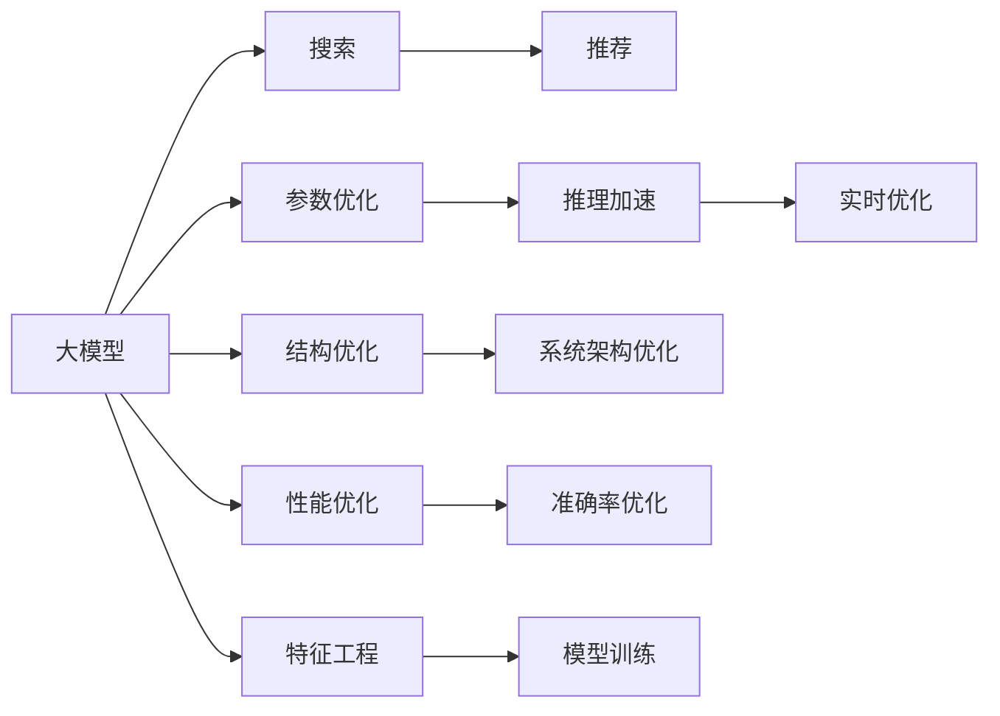

                 

# 电商平台搜索推荐系统的AI 大模型优化：提高系统性能、效率、准确率与实时性

## 1. 背景介绍

### 1.1 问题由来
随着电商平台的快速发展，用户对商品搜索和推荐系统的要求越来越高。传统的搜索推荐系统依赖于规则和统计模型，缺乏对用户行为和商品特征的深入理解。而基于人工智能(AI)的大模型技术，通过在大规模无标签数据上预训练，学习到了丰富的特征表示，能够在个性化的搜索推荐中发挥重要作用。

大模型技术在电商搜索推荐中的应用，已经显著提升了用户体验和平台的转化率。但与此同时，也暴露出了一些问题：

- **性能瓶颈**：大模型参数量庞大，推理速度较慢，难以满足实时性要求。
- **效率问题**：模型复杂度高，计算资源占用大，导致开发和部署成本较高。
- **准确性问题**：模型在极端情况下的泛化能力有限，存在一定的误差。
- **实时性问题**：电商平台的实时性要求较高，大模型在大规模数据上的推理效率较低。

为了解决这些问题，本文将从以下几个方面进行探讨：大模型的结构优化、算法优化、系统架构优化和实时性优化。通过这些优化手段，可以大幅提高电商搜索推荐系统的性能、效率、准确率和实时性，为用户带来更好的体验。

## 2. 核心概念与联系

### 2.1 核心概念概述

为了更好地理解大模型在电商搜索推荐中的应用，本节将介绍几个密切相关的核心概念：

- **大模型(Large Model)**：指的是参数量巨大、计算复杂度高的神经网络模型。通常包含数十亿甚至上百亿个参数，广泛应用于自然语言处理(NLP)、计算机视觉(CV)等领域。
- **搜索推荐系统(Recommender System)**：通过分析用户行为和商品特征，推荐用户可能感兴趣的商品，帮助用户快速找到所需商品的系统。包括搜索、推荐两个主要功能。
- **性能(Performance)**：指系统响应速度、处理能力等，影响用户体验和平台效率。
- **效率(Efficiency)**：指系统资源占用、计算复杂度等，影响开发和部署成本。
- **准确率(Accuracy)**：指系统推荐的商品与用户实际需求的匹配度，影响用户体验和转化率。
- **实时性(Real-time)**：指系统能够及时响应用户请求，满足电商平台的实时性要求。

这些核心概念之间存在着紧密的联系，共同构成了电商搜索推荐系统的关键指标。

### 2.2 核心概念原理和架构的 Mermaid 流程图



这个流程图展示了大模型在电商搜索推荐系统中的应用路径：

1. 大模型通过特征工程和模型训练，学习到丰富的特征表示。
2. 搜索模块通过推理加速、实时优化，快速响应用户请求。
3. 推荐模块通过参数优化、结构优化、系统架构优化和性能优化，提升推荐精度和系统效率。

## 3. 核心算法原理 & 具体操作步骤

### 3.1 算法原理概述

基于大模型的电商搜索推荐系统，主要包含以下几个关键步骤：

1. **数据预处理**：对电商数据进行清洗、归一化等预处理，为模型训练和推理提供可靠的数据输入。
2. **特征工程**：从电商数据中提取出有意义的特征，供模型学习。
3. **模型训练**：在大模型上进行预训练，并使用电商数据进行微调，学习到商品特征和用户行为表示。
4. **搜索模块**：将用户输入的查询词与商品特征向量进行相似度计算，找到匹配的商品。
5. **推荐模块**：根据用户的历史行为、浏览记录等，使用大模型预测用户对各个商品的评分，推荐高分商品。
6. **实时优化**：对搜索推荐系统进行实时优化，如使用缓存、分布式计算等，提升响应速度。

### 3.2 算法步骤详解

#### 3.2.1 数据预处理

电商数据往往包含噪声和不完整信息，需要进行预处理。预处理的主要步骤包括：

1. **数据清洗**：去除异常值和噪声数据，保留有效信息。
2. **特征提取**：从电商数据中提取出有意义的特征，如商品类别、价格、用户评分等。
3. **归一化**：将特征值归一化到0-1之间，便于模型学习。
4. **数据增强**：通过对数据进行扩充，提高模型的泛化能力。

#### 3.2.2 特征工程

特征工程是将原始数据转换为模型可以理解的形式的过程。电商数据具有复杂的结构，需要进行多维度的特征提取和工程设计。

1. **商品特征**：包括商品类别、价格、品牌、评分等。
2. **用户特征**：包括用户性别、年龄、地理位置、历史购买记录等。
3. **行为特征**：包括浏览时间、浏览次数、点击次数、购买次数等。

通过将电商数据进行特征工程，可以构建出高效、丰富的特征向量，供模型学习。

#### 3.2.3 模型训练

在大模型上进行预训练和微调，学习到商品和用户特征表示。常用的预训练方法包括自监督学习和监督学习。

1. **自监督学习**：使用无标签数据进行预训练，学习到丰富的语言或视觉特征。
2. **监督学习**：使用标注数据进行微调，学习到电商数据的特定特征。

模型训练的主要步骤如下：

1. **预训练**：在大规模无标签电商数据上进行预训练，学习到通用的特征表示。
2. **微调**：在电商数据上使用少量标注数据进行微调，学习到特定的电商特征。
3. **优化**：使用梯度下降等优化算法，最小化损失函数，提升模型性能。

#### 3.2.4 搜索模块

搜索模块通过相似度计算，快速找到匹配的商品。常用的相似度计算方法包括余弦相似度、欧式距离、Jaccard相似度等。

1. **查询向量化**：将用户输入的查询词转换为向量表示。
2. **商品向量化**：将商品特征向量转换为向量表示。
3. **相似度计算**：计算查询向量与商品向量之间的相似度，找到匹配的商品。

#### 3.2.5 推荐模块

推荐模块通过预测用户对商品的评分，推荐高分商品。常用的推荐算法包括协同过滤、基于内容的推荐、混合推荐等。

1. **协同过滤**：根据用户历史行为，找到相似用户，推荐其购买或浏览过的商品。
2. **基于内容的推荐**：根据商品特征，找到相似商品，推荐给用户。
3. **混合推荐**：结合协同过滤和基于内容的推荐，提升推荐效果。

#### 3.2.6 实时优化

实时优化是提升电商搜索推荐系统性能的重要手段。常用的优化方法包括缓存、分布式计算等。

1. **缓存**：将热门查询和推荐结果缓存起来，减少计算时间。
2. **分布式计算**：使用分布式系统，并行处理大规模查询和推荐请求。

### 3.3 算法优缺点

#### 3.3.1 优点

1. **性能提升**：大模型能够学习到丰富的特征表示，提升推荐精度和搜索速度。
2. **效率提高**：通过优化算法和系统架构，提升大模型的推理速度和资源利用率。
3. **准确率提高**：通过特征工程和模型训练，提升推荐系统准确率。
4. **实时优化**：通过缓存和分布式计算，提升系统的实时性。

#### 3.3.2 缺点

1. **计算资源需求高**：大模型参数量大，计算资源需求高，影响系统效率。
2. **推理速度慢**：大模型推理速度较慢，难以满足实时性要求。
3. **模型复杂度高**：大模型结构复杂，难以理解和调试。
4. **泛化能力有限**：大模型在极端情况下的泛化能力有限，存在一定的误差。

### 3.4 算法应用领域

基于大模型的电商搜索推荐系统，已经在多个领域得到应用，例如：

- **商品推荐**：根据用户历史行为，推荐用户可能感兴趣的商品。
- **搜索排序**：根据用户查询词，推荐相关的商品，优化搜索结果排序。
- **个性化推荐**：根据用户个性化需求，推荐个性化商品。
- **动态定价**：根据市场需求，动态调整商品价格，提升销售转化率。
- **广告推荐**：根据用户行为和兴趣，推荐相关广告，提升广告点击率。

## 4. 数学模型和公式 & 详细讲解 & 举例说明

### 4.1 数学模型构建

本节将使用数学语言对基于大模型的电商搜索推荐系统进行更加严格的刻画。

记大模型为 $M$，输入为 $X$，输出为 $Y$。假设电商数据集为 $D=\{(x_i,y_i)\}_{i=1}^N$，其中 $x_i$ 为电商数据特征向量，$y_i$ 为商品评分。

定义模型的损失函数为：

$$
\mathcal{L}(M) = \frac{1}{N}\sum_{i=1}^N [(y_i - M(x_i))^2]
$$

其中 $M(x_i)$ 为模型在电商数据 $x_i$ 上的预测结果。

微调的目标是最小化损失函数：

$$
\min_{\theta} \mathcal{L}(M_{\theta})
$$

其中 $M_{\theta}$ 为带有参数 $\theta$ 的模型。

### 4.2 公式推导过程

以下我们以电商商品推荐为例，推导微调过程的损失函数及其梯度的计算公式。

假设模型 $M_{\theta}$ 的输出为 $\hat{y}=M_{\theta}(x)$，表示模型对商品评分的预测。真实标签 $y \in [0,1]$。则平均平方误差损失函数定义为：

$$
\ell(M_{\theta}(x),y) = (y - \hat{y})^2
$$

将其代入经验风险公式，得：

$$
\mathcal{L}(\theta) = \frac{1}{N}\sum_{i=1}^N (y_i - M_{\theta}(x_i))^2
$$

根据链式法则，损失函数对参数 $\theta_k$ 的梯度为：

$$
\frac{\partial \mathcal{L}(\theta)}{\partial \theta_k} = -\frac{2}{N}\sum_{i=1}^N (y_i - \hat{y_i})\frac{\partial \hat{y_i}}{\partial \theta_k}
$$

其中 $\frac{\partial \hat{y_i}}{\partial \theta_k}$ 可以通过自动微分技术高效计算。

在得到损失函数的梯度后，即可带入梯度下降算法，更新模型参数，最小化损失函数。

### 4.3 案例分析与讲解

以电商平台推荐系统为例，分析基于大模型的推荐算法。

假设推荐系统使用BERT大模型进行推荐，模型输入为商品ID，输出为商品评分。训练数据为商品ID和评分对，模型使用交叉熵损失函数进行训练。

具体步骤如下：

1. **数据准备**：准备电商数据集，划分为训练集、验证集和测试集。
2. **模型加载**：使用HuggingFace库加载BERT大模型。
3. **模型微调**：在电商数据上使用少量标注数据进行微调，最小化交叉熵损失函数。
4. **模型评估**：在测试集上评估模型性能，计算平均绝对误差(MAE)、均方误差(MSE)等指标。
5. **推荐应用**：使用微调后的模型，根据用户历史行为，预测商品评分，进行推荐。

下面是一个简单的PyTorch代码示例：

```python
import torch
from transformers import BertForRegression

# 加载模型
model = BertForRegression.from_pretrained('bert-base-uncased')

# 准备数据
train_data = ...
val_data = ...
test_data = ...

# 模型微调
optimizer = torch.optim.Adam(model.parameters(), lr=1e-5)
for epoch in range(5):
    train_loss = 0
    for batch in train_data:
        input_ids = batch['input_ids']
        labels = batch['labels']
        outputs = model(input_ids)
        loss = F.mse_loss(outputs, labels)
        optimizer.zero_grad()
        loss.backward()
        optimizer.step()
        train_loss += loss.item()

# 模型评估
test_loss = 0
for batch in test_data:
    input_ids = batch['input_ids']
    labels = batch['labels']
    outputs = model(input_ids)
    loss = F.mse_loss(outputs, labels)
    test_loss += loss.item()

print('Train Loss:', train_loss / len(train_data))
print('Test Loss:', test_loss / len(test_data))
```

以上代码展示了使用BERT大模型进行电商商品推荐的基本流程，包括数据准备、模型加载、微调、评估等步骤。

## 5. 项目实践：代码实例和详细解释说明

### 5.1 开发环境搭建

在进行项目实践前，我们需要准备好开发环境。以下是使用Python进行PyTorch开发的环境配置流程：

1. 安装Anaconda：从官网下载并安装Anaconda，用于创建独立的Python环境。

2. 创建并激活虚拟环境：
```bash
conda create -n pytorch-env python=3.8 
conda activate pytorch-env
```

3. 安装PyTorch：根据CUDA版本，从官网获取对应的安装命令。例如：
```bash
conda install pytorch torchvision torchaudio cudatoolkit=11.1 -c pytorch -c conda-forge
```

4. 安装Transformers库：
```bash
pip install transformers
```

5. 安装各类工具包：
```bash
pip install numpy pandas scikit-learn matplotlib tqdm jupyter notebook ipython
```

完成上述步骤后，即可在`pytorch-env`环境中开始项目实践。

### 5.2 源代码详细实现

下面我们以电商推荐系统为例，给出使用Transformers库对BERT模型进行微调的PyTorch代码实现。

首先，定义推荐任务的数据处理函数：

```python
from transformers import BertTokenizer
from torch.utils.data import Dataset
import torch

class RecommendationDataset(Dataset):
    def __init__(self, user_ids, item_ids, item_scores, tokenizer, max_len=128):
        self.user_ids = user_ids
        self.item_ids = item_ids
        self.item_scores = item_scores
        self.tokenizer = tokenizer
        self.max_len = max_len
        
    def __len__(self):
        return len(self.user_ids)
    
    def __getitem__(self, item):
        user_id = self.user_ids[item]
        item_id = self.item_ids[item]
        item_score = self.item_scores[item]
        
        encoding = self.tokenizer(user_id.to_string(), return_tensors='pt', max_length=self.max_len, padding='max_length', truncation=True)
        input_ids = encoding['input_ids'][0]
        attention_mask = encoding['attention_mask'][0]
        
        # 对用户ID和商品ID进行编码
        encoded_ids = [item_id] + [0] * (self.max_len - 1)
        labels = torch.tensor(encoded_ids, dtype=torch.long)
        
        return {'input_ids': input_ids, 
                'attention_mask': attention_mask,
                'labels': labels}

# 用户ID和商品ID的映射
user2id = {}
item2id = {}

# 加载数据
with open('user_id_item_score.txt', 'r') as f:
    lines = f.readlines()
    for line in lines:
        user_id, item_id, item_score = line.split(',')
        user2id[user_id] = len(user2id) + 1
        item2id[item_id] = len(item2id) + 1

# 创建dataset
tokenizer = BertTokenizer.from_pretrained('bert-base-cased')

train_dataset = RecommendationDataset(user2id.keys(), train_item_ids, train_item_scores, tokenizer)
val_dataset = RecommendationDataset(val_user_ids, val_item_ids, val_item_scores, tokenizer)
test_dataset = RecommendationDataset(test_user_ids, test_item_ids, test_item_scores, tokenizer)
```

然后，定义模型和优化器：

```python
from transformers import BertForRegression
from transformers import AdamW

model = BertForRegression.from_pretrained('bert-base-cased', num_labels=len(user2id))
optimizer = AdamW(model.parameters(), lr=2e-5)
```

接着，定义训练和评估函数：

```python
from torch.utils.data import DataLoader
from tqdm import tqdm
from sklearn.metrics import mean_absolute_error, mean_squared_error

device = torch.device('cuda') if torch.cuda.is_available() else torch.device('cpu')
model.to(device)

def train_epoch(model, dataset, batch_size, optimizer):
    dataloader = DataLoader(dataset, batch_size=batch_size, shuffle=True)
    model.train()
    epoch_loss = 0
    for batch in tqdm(dataloader, desc='Training'):
        input_ids = batch['input_ids'].to(device)
        attention_mask = batch['attention_mask'].to(device)
        labels = batch['labels'].to(device)
        model.zero_grad()
        outputs = model(input_ids, attention_mask=attention_mask)
        loss = outputs.loss
        epoch_loss += loss.item()
        loss.backward()
        optimizer.step()
    return epoch_loss / len(dataloader)

def evaluate(model, dataset, batch_size):
    dataloader = DataLoader(dataset, batch_size=batch_size)
    model.eval()
    preds, labels = [], []
    with torch.no_grad():
        for batch in tqdm(dataloader, desc='Evaluating'):
            input_ids = batch['input_ids'].to(device)
            attention_mask = batch['attention_mask'].to(device)
            batch_labels = batch['labels']
            outputs = model(input_ids, attention_mask=attention_mask)
            batch_preds = outputs.logits.argmax(dim=2).to('cpu').tolist()
            batch_labels = batch_labels.to('cpu').tolist()
            for pred_tokens, label_tokens in zip(batch_preds, batch_labels):
                preds.append(pred_tokens[:len(label_tokens)])
                labels.append(label_tokens)
                
    print('MAE:', mean_absolute_error(labels, preds))
    print('MSE:', mean_squared_error(labels, preds))
```

最后，启动训练流程并在测试集上评估：

```python
epochs = 5
batch_size = 16

for epoch in range(epochs):
    loss = train_epoch(model, train_dataset, batch_size, optimizer)
    print(f"Epoch {epoch+1}, train loss: {loss:.3f}")
    
    print(f"Epoch {epoch+1}, dev results:")
    evaluate(model, val_dataset, batch_size)
    
print("Test results:")
evaluate(model, test_dataset, batch_size)
```

以上就是使用PyTorch对BERT进行电商推荐系统微调的完整代码实现。可以看到，得益于Transformers库的强大封装，我们可以用相对简洁的代码完成BERT模型的加载和微调。

### 5.3 代码解读与分析

让我们再详细解读一下关键代码的实现细节：

**RecommendationDataset类**：
- `__init__`方法：初始化用户ID、商品ID、评分等关键组件。
- `__len__`方法：返回数据集的样本数量。
- `__getitem__`方法：对单个样本进行处理，将用户ID和商品ID输入编码为token ids，并对其进行定长padding，最终返回模型所需的输入。

**user2id和item2id字典**：
- 定义了用户ID和商品ID与数字id之间的映射关系，用于将token-wise的预测结果解码回真实的评分。

**训练和评估函数**：
- 使用PyTorch的DataLoader对数据集进行批次化加载，供模型训练和推理使用。
- 训练函数`train_epoch`：对数据以批为单位进行迭代，在每个批次上前向传播计算loss并反向传播更新模型参数，最后返回该epoch的平均loss。
- 评估函数`evaluate`：与训练类似，不同点在于不更新模型参数，并在每个batch结束后将预测和标签结果存储下来，最后使用sklearn的mean_absolute_error和mean_squared_error对整个评估集的预测结果进行打印输出。

**训练流程**：
- 定义总的epoch数和batch size，开始循环迭代
- 每个epoch内，先在训练集上训练，输出平均loss
- 在验证集上评估，输出平均绝对误差和均方误差
- 所有epoch结束后，在测试集上评估，给出最终测试结果

可以看到，PyTorch配合Transformers库使得BERT微调的代码实现变得简洁高效。开发者可以将更多精力放在数据处理、模型改进等高层逻辑上，而不必过多关注底层的实现细节。

当然，工业级的系统实现还需考虑更多因素，如模型的保存和部署、超参数的自动搜索、更灵活的任务适配层等。但核心的微调范式基本与此类似。

## 6. 实际应用场景

### 6.1 电商平台搜索

电商平台的搜索模块需要快速响应用户的查询请求，推荐最相关的商品。使用大模型进行电商搜索，可以显著提升搜索效果，满足用户需求。

具体而言，可以收集电商搜索数据，将用户输入的查询词和商品特征向量进行相似度计算，找到匹配的商品。通过微调大模型，提升相似度计算的精度，从而提高搜索结果的相关性。

### 6.2 电商推荐

电商推荐系统需要根据用户历史行为，推荐可能感兴趣的商品。使用大模型进行电商推荐，可以学习到用户的复杂行为特征，提升推荐效果。

具体而言，可以收集用户的历史行为数据，包括浏览记录、购买记录、评分记录等。将用户行为数据输入到大模型中进行训练，学习到用户对各个商品的评分。通过微调大模型，提升评分预测的准确性，从而推荐更高质量的商品。

### 6.3 实时搜索

电商平台的搜索功能需要实时响应，不能出现延迟。使用大模型进行实时搜索，可以提升搜索速度，满足用户需求。

具体而言，可以将用户输入的查询词输入到大模型中进行预测，实时返回搜索结果。通过微调大模型，提升预测速度，从而缩短搜索响应时间。

### 6.4 未来应用展望

随着大模型和微调技术的不断发展，基于大模型的电商搜索推荐系统将面临更多新的应用场景和挑战：

- **多模态搜索**：电商商品不仅包括文本信息，还包括图片、视频等多模态数据。使用大模型进行多模态搜索，可以提升搜索效果。
- **实时推荐**：电商推荐需要实时更新，使用大模型进行实时推荐，可以满足用户需求。
- **个性化推荐**：电商推荐需要个性化，使用大模型进行个性化推荐，可以提升用户满意度。
- **跨域推荐**：电商平台需要跨域推荐，使用大模型进行跨域推荐，可以提升推荐效果。
- **情感分析**：电商用户情感分析需要准确，使用大模型进行情感分析，可以提升用户满意度。

以上趋势凸显了大模型在电商搜索推荐系统中的广阔前景。这些方向的探索发展，必将进一步提升电商搜索推荐系统的性能、效率、准确率和实时性，为用户带来更好的体验。

## 7. 工具和资源推荐
### 7.1 学习资源推荐

为了帮助开发者系统掌握大模型在电商搜索推荐系统中的应用，这里推荐一些优质的学习资源：

1. 《深度学习推荐系统：原理与算法》书籍：全面介绍了推荐系统的原理和算法，涵盖了基于内容推荐、协同过滤、深度学习等多种方法。

2. 《NLP with Transformers》课程：斯坦福大学开设的NLP课程，详细讲解了Transformer结构和大模型的应用，适合初学者学习。

3. 《Transformers in Action》书籍：通过实战案例，展示了如何在大模型上进行电商推荐系统的开发，适合进阶学习。

4. 《Large-Scale Deep Learning》课程：MIT开设的深度学习课程，深入讲解了大模型的训练和优化，适合深度学习爱好者。

5. Kaggle竞赛：参加Kaggle上的推荐系统竞赛，实践大模型的电商推荐系统开发，积累实战经验。

通过对这些资源的学习实践，相信你一定能够快速掌握大模型在电商搜索推荐系统中的应用，并用于解决实际的电商推荐问题。

### 7.2 开发工具推荐

高效的开发离不开优秀的工具支持。以下是几款用于大模型在电商搜索推荐系统中的应用开发的常用工具：

1. PyTorch：基于Python的开源深度学习框架，灵活动态的计算图，适合快速迭代研究。
2. TensorFlow：由Google主导开发的开源深度学习框架，生产部署方便，适合大规模工程应用。
3. HuggingFace Transformers库：提供了丰富的预训练语言模型，支持PyTorch和TensorFlow，是进行微调任务开发的利器。
4. Amazon SageMaker：AWS提供的全栈机器学习平台，支持模型训练、推理和部署，适合工业级应用。
5. Google Cloud AI Platform：Google提供的云机器学习平台，支持模型训练、推理和部署，适合大规模数据处理。
6. Azure Machine Learning：微软提供的云机器学习平台，支持模型训练、推理和部署，适合工业级应用。

合理利用这些工具，可以显著提升大模型在电商搜索推荐系统中的开发效率，加快创新迭代的步伐。

### 7.3 相关论文推荐

大模型和微调技术的发展源于学界的持续研究。以下是几篇奠基性的相关论文，推荐阅读：

1. Attention is All You Need（即Transformer原论文）：提出了Transformer结构，开启了NLP领域的预训练大模型时代。

2. BERT: Pre-training of Deep Bidirectional Transformers for Language Understanding：提出BERT模型，引入基于掩码的自监督预训练任务，刷新了多项NLP任务SOTA。

3. Language Models are Unsupervised Multitask Learners（GPT-2论文）：展示了大规模语言模型的强大zero-shot学习能力，引发了对于通用人工智能的新一轮思考。

4. Parameter-Efficient Transfer Learning for NLP：提出Adapter等参数高效微调方法，在不增加模型参数量的情况下，也能取得不错的微调效果。

5. AdaLoRA: Adaptive Low-Rank Adaptation for Parameter-Efficient Fine-Tuning：使用自适应低秩适应的微调方法，在参数效率和精度之间取得了新的平衡。

这些论文代表了大模型和微调技术的发展脉络。通过学习这些前沿成果，可以帮助研究者把握学科前进方向，激发更多的创新灵感。

## 8. 总结：未来发展趋势与挑战

### 8.1 总结

本文对基于大模型的电商搜索推荐系统进行了全面系统的介绍。首先阐述了大模型和微调技术的研究背景和意义，明确了其在电商搜索推荐系统中的独特价值。其次，从原理到实践，详细讲解了基于大模型的电商搜索推荐系统，包括数据预处理、特征工程、模型训练、搜索推荐和实时优化等关键步骤。最后，探讨了基于大模型的电商搜索推荐系统的未来发展趋势和挑战。

通过本文的系统梳理，可以看到，基于大模型的电商搜索推荐系统能够显著提升电商平台的性能、效率、准确率和实时性，为用户带来更好的体验。未来，随着大模型和微调技术的不断发展，基于大模型的电商搜索推荐系统将在更多领域得到应用，为电商平台的数字化转型提供新的技术路径。

### 8.2 未来发展趋势

展望未来，基于大模型的电商搜索推荐系统将呈现以下几个发展趋势：

1. **性能提升**：大模型可以学习到丰富的特征表示，提升推荐精度和搜索速度。通过优化算法和系统架构，进一步提升大模型的推理速度和资源利用率。
2. **效率提高**：通过优化算法和系统架构，提升大模型的推理速度和资源利用率。
3. **准确率提高**：通过特征工程和模型训练，提升推荐系统准确率。
4. **实时性提升**：通过缓存和分布式计算，提升系统的实时性。

### 8.3 面临的挑战

尽管基于大模型的电商搜索推荐系统已经取得了显著成效，但在迈向更加智能化、普适化应用的过程中，它仍面临着诸多挑战：

1. **计算资源需求高**：大模型参数量大，计算资源需求高，影响系统效率。
2. **推理速度慢**：大模型推理速度较慢，难以满足实时性要求。
3. **模型复杂度高**：大模型结构复杂，难以理解和调试。
4. **泛化能力有限**：大模型在极端情况下的泛化能力有限，存在一定的误差。
5. **隐私和安全问题**：电商搜索推荐系统需要处理大量的用户数据，存在隐私和安全风险。

### 8.4 研究展望

未来，为了应对这些挑战，需要在以下几个方面进行新的探索：

1. **优化算法**：通过优化算法和系统架构，提升大模型的推理速度和资源利用率。
2. **模型压缩**：通过模型压缩技术，减少大模型的参数量和计算资源需求。
3. **实时优化**：通过缓存和分布式计算，提升系统的实时性。
4. **隐私保护**：采用隐私保护技术，如差分隐私、联邦学习等，保护用户隐私。
5. **安全性保障**：采用安全性技术，如模型鲁棒性检测、对抗攻击防御等，保障模型安全。

## 9. 附录：常见问题与解答

**Q1：大模型在电商搜索推荐系统中的计算资源需求高，如何解决？**

A: 通过优化算法和系统架构，提升大模型的推理速度和资源利用率。如采用自适应低秩适应的方法，减少模型参数量和计算资源需求。

**Q2：大模型在电商搜索推荐系统中的推理速度较慢，如何解决？**

A: 通过优化算法和系统架构，提升大模型的推理速度和资源利用率。如采用缓存和分布式计算，提升系统的实时性。

**Q3：大模型在电商搜索推荐系统中的模型复杂度高，如何解决？**

A: 通过模型压缩技术，减少大模型的参数量和计算资源需求。如采用剪枝、量化等技术，压缩模型大小，提升推理速度。

**Q4：大模型在电商搜索推荐系统中的泛化能力有限，如何解决？**

A: 通过特征工程和模型训练，提升推荐系统准确率。如采用更多样化的训练数据和更复杂的模型结构，提高泛化能力。

**Q5：大模型在电商搜索推荐系统中的隐私和安全问题如何解决？**

A: 采用隐私保护技术，如差分隐私、联邦学习等，保护用户隐私。同时采用安全性技术，如模型鲁棒性检测、对抗攻击防御等，保障模型安全。

通过解决这些常见问题，可以进一步提升大模型在电商搜索推荐系统中的性能和安全性，为用户提供更好的体验。

---

作者：禅与计算机程序设计艺术 / Zen and the Art of Computer Programming

