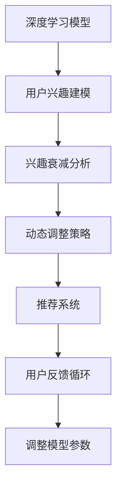

                 

# 电商平台用户兴趣衰减模型：AI大模型的动态调整

> 关键词：电商平台,用户兴趣,衰减模型,动态调整,深度学习,大模型,推荐系统,电商算法,数据驱动,用户行为分析

## 1. 背景介绍

### 1.1 问题由来
随着电商平台的迅猛发展和用户数量的不断增长，电商平台的数据规模和复杂度也在急剧增加。传统的电商推荐算法已难以适应复杂多变的用户需求和海量数据处理的需求。如何高效准确地挖掘用户兴趣，为用户提供个性化的购物体验，成为电商平台亟需解决的问题。

近年来，人工智能技术，特别是深度学习技术在电商领域的应用逐渐兴起。深度学习模型，尤其是深度神经网络模型，可以自动从大数据中学习特征，并利用这些特征进行分类、预测等任务。在电商推荐系统中，深度学习模型可以挖掘用户行为模式，从而提供更加个性化、精准的推荐服务。

然而，尽管深度学习模型在推荐系统中的应用取得了一定进展，但模型的效果往往受到数据质量和用户兴趣变化的影响。电商平台需要一种更加动态、灵活的推荐算法，能够实时调整和优化，以应对用户兴趣的衰减和变化。

### 1.2 问题核心关键点
电商平台推荐系统的核心目标是最大化用户满意度和转化率。随着时间推移，用户的兴趣会发生变化，如从对某类商品的兴趣转变为对另一类商品的兴趣，或兴趣强度减弱，导致购买行为减少。

为了应对这些变化，推荐系统需要具备以下核心功能：

1. 用户兴趣建模：使用深度学习模型对用户历史行为进行建模，提取用户兴趣特征。
2. 兴趣衰减分析：通过用户行为数据，实时监测用户兴趣的衰减情况，并对其进行量化。
3. 动态调整策略：根据用户兴趣的变化，动态调整推荐策略，以保持推荐内容的相关性和吸引力。
4. 用户反馈循环：收集用户对推荐结果的反馈，进一步优化推荐模型。

这些核心功能要求推荐系统具备以下特性：

- 实时性：能够快速响应用户兴趣变化，实时调整推荐内容。
- 自适应性：能够自动适应不同用户和场景，提供个性化的推荐服务。
- 可解释性：推荐结果能够有明确的解释，帮助用户理解推荐内容的相关性。
- 高效性：在数据量和用户数不断增加的情况下，仍能保持高效的推理和推荐速度。

本文将从深度学习模型的角度，探讨如何通过动态调整策略，实现对用户兴趣衰减的实时监测和推荐优化。

## 2. 核心概念与联系

### 2.1 核心概念概述

为更好地理解电商平台动态推荐系统，本节将介绍几个关键概念：

- **深度学习模型**：使用多层神经网络对输入数据进行特征学习，并自动提取特征。常用的深度学习模型包括卷积神经网络(CNN)、循环神经网络(RNN)和变换器(Transformer)等。
- **用户兴趣衰减**：用户对某一商品的兴趣随时间推移逐渐减弱的现象。电商平台的推荐系统需要实时监测和评估用户兴趣的变化，以调整推荐策略。
- **动态调整策略**：根据用户行为数据和兴趣变化，实时调整推荐内容和算法参数，保持推荐的相关性和吸引力。
- **推荐系统**：利用用户数据和商品数据，提供个性化的推荐服务，提升用户满意度和转化率。

这些核心概念之间的逻辑关系可以通过以下Mermaid流程图来展示：



这个流程图展示了大模型动态推荐系统的核心概念及其之间的关系：

1. 深度学习模型对用户行为数据进行建模，提取用户兴趣特征。
2. 对提取的特征进行兴趣衰减分析，评估用户兴趣的变化。
3. 根据兴趣变化，动态调整推荐策略，保持推荐内容的相关性和吸引力。
4. 推荐系统根据动态调整后的策略，提供个性化的推荐服务。
5. 收集用户对推荐结果的反馈，调整模型参数，进一步优化推荐模型。

这些概念共同构成了电商平台动态推荐系统的设计和实现框架，使其能够高效准确地挖掘用户兴趣，提供个性化的购物体验。

## 3. 核心算法原理 & 具体操作步骤
### 3.1 算法原理概述

电商平台的动态推荐系统，其核心算法原理基于深度学习模型对用户行为数据进行建模，并利用这些模型实时监测用户兴趣的衰减情况。具体步骤如下：

1. **用户兴趣建模**：使用深度学习模型对用户历史行为数据进行建模，提取用户兴趣特征。常用的模型包括循环神经网络(RNN)、长短时记忆网络(LSTM)、Transformer等。
2. **兴趣衰减分析**：通过计算用户行为数据的特征变化量，实时监测用户兴趣的衰减情况。常用的方法包括PCA降维、LDA主题建模、注意力机制等。
3. **动态调整策略**：根据兴趣衰减分析结果，动态调整推荐策略。常用的方法包括实时调整商品推荐列表、更新模型参数、引入多样化推荐等。
4. **推荐系统实现**：根据动态调整后的策略，实时生成推荐结果，提供个性化的推荐服务。

### 3.2 算法步骤详解

以下详细介绍电商动态推荐系统的核心算法步骤：

**Step 1: 用户兴趣建模**

用户兴趣建模的目标是从用户历史行为数据中提取兴趣特征。假设用户历史行为数据为 $D=\{(x_i,y_i)\}_{i=1}^N$，其中 $x_i$ 表示用户行为记录， $y_i$ 表示用户的商品标签。

**Step 1.1: 特征提取**

使用深度学习模型对用户历史行为数据进行特征提取，得到用户兴趣特征 $h_i=\text{Model}(x_i)$。常用的深度学习模型包括循环神经网络(RNN)、长短时记忆网络(LSTM)、Transformer等。

**Step 1.2: 特征编码**

将提取的兴趣特征 $h_i$ 进行编码，得到用户兴趣向量 $v_i=\text{Enc}(h_i)$。常用的特征编码方法包括嵌入层、全连接层、注意力机制等。

**Step 2: 兴趣衰减分析**

用户兴趣衰减分析的目标是实时监测用户兴趣的变化。假设用户当前行为数据为 $x_t$，与用户历史行为数据 $x_1,\cdots,x_{t-1}$ 的兴趣向量分别为 $v_t=v(x_t), v_{t-1},\cdots,v_1$。

**Step 2.1: 特征变化量计算**

计算当前兴趣向量 $v_t$ 与历史兴趣向量 $v_1,\cdots,v_{t-1}$ 之间的距离或变化量，得到用户兴趣衰减量 $\delta_t$。常用的方法包括余弦相似度、欧式距离、注意力机制等。

**Step 3: 动态调整策略**

动态调整策略的目标是根据用户兴趣衰减量，实时调整推荐策略。假设用户当前兴趣衰减量为 $\delta_t$，历史兴趣向量为 $v_1,\cdots,v_{t-1}$。

**Step 3.1: 调整推荐列表**

根据兴趣衰减量 $\delta_t$，调整商品推荐列表 $L_t$。常用的方法包括替换部分商品、引入多样化推荐、调整推荐排序等。

**Step 3.2: 更新模型参数**

根据用户兴趣衰减量 $\delta_t$，动态更新模型参数。常用的方法包括调整学习率、引入正则化、更新网络结构等。

**Step 4: 推荐系统实现**

推荐系统实现的目标是根据动态调整后的策略，实时生成推荐结果。假设用户当前兴趣向量为 $v_t$，商品向量为 $p_j$。

**Step 4.1: 推荐排序**

根据用户兴趣向量 $v_t$ 和商品向量 $p_j$，计算推荐得分 $s_{t,j}=\text{Scorer}(v_t,p_j)$。常用的方法包括点积评分、注意力机制、神经网络评分等。

**Step 4.2: 生成推荐结果**

根据推荐得分 $s_{t,j}$，生成推荐列表 $R_t=\text{Recommend}(L_t,s_{t,j})$。

### 3.3 算法优缺点

电商动态推荐系统具有以下优点：

1. 实时性：能够实时监测用户兴趣的变化，快速调整推荐策略，保持推荐的相关性和吸引力。
2. 自适应性：能够自动适应不同用户和场景，提供个性化的推荐服务。
3. 可解释性：推荐结果能够有明确的解释，帮助用户理解推荐内容的相关性。
4. 高效性：在数据量和用户数不断增加的情况下，仍能保持高效的推理和推荐速度。

同时，该方法也存在一定的局限性：

1. 数据依赖性强：电商推荐系统的性能很大程度上依赖于用户行为数据的质量，需要收集和处理大量数据。
2. 用户隐私问题：电商推荐系统需要收集和分析用户行为数据，可能涉及到用户隐私问题。
3. 冷启动问题：新用户或新商品缺乏历史行为数据，推荐效果较差。
4. 模型复杂度：深度学习模型需要大量的计算资源和存储空间，模型训练和推理成本较高。

尽管存在这些局限性，但就目前而言，动态推荐系统基于深度学习模型的方法仍是目前电商推荐系统的主流范式。未来相关研究的重点在于如何进一步降低对数据的依赖，提高模型的可解释性和鲁棒性，解决冷启动问题，以及优化模型的计算效率。

### 3.4 算法应用领域

电商动态推荐系统已经在许多电商平台上得到了广泛应用，覆盖了几乎所有常见的电商推荐场景，例如：

- 商品推荐：根据用户历史购买记录和浏览行为，推荐相关商品。
- 用户画像：构建用户兴趣特征向量，用于个性化推荐和广告投放。
- 新商品推荐：对新商品进行预估，预测其用户吸引力。
- 交叉销售推荐：推荐用户感兴趣的相关商品，增加销量。
- 定制化推荐：根据用户偏好，生成定制化的推荐列表。

除了上述这些经典场景外，动态推荐系统还被创新性地应用到更多场景中，如库存优化、供应链管理、营销活动等，为电商平台带来了巨大的商业价值。

## 4. 数学模型和公式 & 详细讲解 & 举例说明

### 4.1 数学模型构建

以下使用数学语言对电商动态推荐系统的核心算法进行更加严格的刻画。

假设用户历史行为数据为 $D=\{(x_i,y_i)\}_{i=1}^N$，其中 $x_i$ 表示用户行为记录， $y_i$ 表示用户的商品标签。

**用户兴趣建模**

使用深度学习模型对用户历史行为数据进行建模，得到用户兴趣特征 $h_i=\text{Model}(x_i)$。常用的模型包括循环神经网络(RNN)、长短时记忆网络(LSTM)、Transformer等。

**用户兴趣衰减分析**

用户当前行为数据为 $x_t$，与用户历史行为数据 $x_1,\cdots,x_{t-1}$ 的兴趣向量分别为 $v_t=v(x_t), v_{t-1},\cdots,v_1$。

假设用户兴趣衰减量为 $\delta_t$，常用的方法包括余弦相似度、欧式距离、注意力机制等。

**动态调整策略**

根据用户兴趣衰减量 $\delta_t$，调整推荐策略。常用的方法包括实时调整商品推荐列表、更新模型参数、引入多样化推荐等。

**推荐系统实现**

使用用户兴趣向量 $v_t$ 和商品向量 $p_j$，计算推荐得分 $s_{t,j}=\text{Scorer}(v_t,p_j)$。常用的方法包括点积评分、注意力机制、神经网络评分等。

### 4.2 公式推导过程

以下推导电商动态推荐系统中的关键公式。

**用户兴趣建模**

假设用户历史行为数据为 $D=\{(x_i,y_i)\}_{i=1}^N$，其中 $x_i$ 表示用户行为记录， $y_i$ 表示用户的商品标签。

使用深度学习模型对用户历史行为数据进行建模，得到用户兴趣特征 $h_i=\text{Model}(x_i)$。常用的模型包括循环神经网络(RNN)、长短时记忆网络(LSTM)、Transformer等。

**用户兴趣衰减分析**

用户当前行为数据为 $x_t$，与用户历史行为数据 $x_1,\cdots,x_{t-1}$ 的兴趣向量分别为 $v_t=v(x_t), v_{t-1},\cdots,v_1$。

假设用户兴趣衰减量为 $\delta_t$，常用的方法包括余弦相似度、欧式距离、注意力机制等。

余弦相似度公式为：

$$
\delta_t = 1 - \cos(v_t,v_{t-1})
$$

欧式距离公式为：

$$
\delta_t = \sqrt{\sum_{i=1}^{d} (v_{ti} - v_{ti-1})^2}
$$

注意力机制公式为：

$$
\delta_t = \sum_{i=1}^{d} a_i(v_{ti} - v_{ti-1})^2
$$

**动态调整策略**

根据用户兴趣衰减量 $\delta_t$，调整推荐策略。常用的方法包括实时调整商品推荐列表、更新模型参数、引入多样化推荐等。

**推荐系统实现**

使用用户兴趣向量 $v_t$ 和商品向量 $p_j$，计算推荐得分 $s_{t,j}=\text{Scorer}(v_t,p_j)$。常用的方法包括点积评分、注意力机制、神经网络评分等。

点积评分公式为：

$$
s_{t,j} = v_t \cdot p_j
$$

注意力机制公式为：

$$
s_{t,j} = \sum_{i=1}^{d} a_i v_{ti} p_{ij}
$$

神经网络评分公式为：

$$
s_{t,j} = \text{Net}(v_t, p_j)
$$

### 4.3 案例分析与讲解

以下以电商推荐系统为例，详细讲解动态调整策略的应用。

假设电商平台上的用户行为数据为 $D=\{(x_i,y_i)\}_{i=1}^N$，其中 $x_i$ 表示用户行为记录， $y_i$ 表示用户的商品标签。

**用户兴趣建模**

使用深度学习模型对用户历史行为数据进行建模，得到用户兴趣特征 $h_i=\text{Model}(x_i)$。常用的模型包括循环神经网络(RNN)、长短时记忆网络(LSTM)、Transformer等。

假设使用循环神经网络对用户行为数据进行建模，得到用户兴趣特征 $h_i$。

**用户兴趣衰减分析**

用户当前行为数据为 $x_t$，与用户历史行为数据 $x_1,\cdots,x_{t-1}$ 的兴趣向量分别为 $v_t=v(x_t), v_{t-1},\cdots,v_1$。

假设用户兴趣衰减量为 $\delta_t$，常用的方法包括余弦相似度、欧式距离、注意力机制等。

假设使用余弦相似度方法，计算用户兴趣衰减量 $\delta_t$。

$$
\delta_t = 1 - \cos(v_t,v_{t-1})
$$

**动态调整策略**

根据用户兴趣衰减量 $\delta_t$，调整推荐策略。常用的方法包括实时调整商品推荐列表、更新模型参数、引入多样化推荐等。

假设用户当前兴趣衰减量为 $\delta_t$，历史兴趣向量为 $v_1,\cdots,v_{t-1}$。

根据兴趣衰减量 $\delta_t$，调整商品推荐列表 $L_t$。

假设使用余弦相似度方法，计算用户兴趣衰减量 $\delta_t$。

$$
\delta_t = 1 - \cos(v_t,v_{t-1})
$$

如果 $\delta_t < \epsilon$，说明用户兴趣衰减很小，推荐列表保持不变。

如果 $\delta_t > \epsilon$，说明用户兴趣衰减较大，需要调整推荐列表。

假设商品向量为 $p_j$，计算推荐得分 $s_{t,j}=\text{Scorer}(v_t,p_j)$。

假设使用点积评分方法，计算推荐得分 $s_{t,j}$。

$$
s_{t,j} = v_t \cdot p_j
$$

如果 $s_{t,j} > \theta$，说明商品 $j$ 对用户 $t$ 有吸引力，推荐该商品。

如果 $s_{t,j} \leq \theta$，说明商品 $j$ 对用户 $t$ 没有吸引力，不推荐该商品。

**推荐系统实现**

根据动态调整后的策略，实时生成推荐结果。

假设用户当前兴趣向量为 $v_t$，商品向量为 $p_j$。

使用用户兴趣向量 $v_t$ 和商品向量 $p_j$，计算推荐得分 $s_{t,j}=\text{Scorer}(v_t,p_j)$。

假设使用点积评分方法，计算推荐得分 $s_{t,j}$。

$$
s_{t,j} = v_t \cdot p_j
$$

根据推荐得分 $s_{t,j}$，生成推荐列表 $R_t=\text{Recommend}(L_t,s_{t,j})$。

假设使用点积评分方法，计算推荐得分 $s_{t,j}$。

$$
s_{t,j} = v_t \cdot p_j
$$

根据推荐得分 $s_{t,j}$，生成推荐列表 $R_t=\text{Recommend}(L_t,s_{t,j})$。

## 5. 项目实践：代码实例和详细解释说明
### 5.1 开发环境搭建

在进行动态推荐系统实践前，我们需要准备好开发环境。以下是使用Python进行TensorFlow开发的环境配置流程：

1. 安装Anaconda：从官网下载并安装Anaconda，用于创建独立的Python环境。

2. 创建并激活虚拟环境：
```bash
conda create -n tf-env python=3.8 
conda activate tf-env
```

3. 安装TensorFlow：根据CUDA版本，从官网获取对应的安装命令。例如：
```bash
conda install tensorflow -c tf
```

4. 安装各类工具包：
```bash
pip install numpy pandas scikit-learn matplotlib tqdm jupyter notebook ipython
```

完成上述步骤后，即可在`tf-env`环境中开始动态推荐系统的开发。

### 5.2 源代码详细实现

这里我们以电商推荐系统为例，给出使用TensorFlow进行动态推荐系统的PyTorch代码实现。

首先，定义用户兴趣建模函数：

```python
import tensorflow as tf
from tensorflow.keras import layers

def build_user_model():
    model = tf.keras.Sequential([
        layers.LSTM(128, input_shape=(None, 3), return_sequences=True),
        layers.Dense(64, activation='relu'),
        layers.Dense(10)
    ])
    return model
```

然后，定义兴趣衰减分析函数：

```python
def compute_interest_decay(v_t, v_prev):
    return tf.keras.losses.cosine_similarity(v_t, v_prev)[0]
```

接着，定义动态调整策略函数：

```python
def adjust_recommend_list(v_t, v_prev, epsilon=0.1):
    delta = compute_interest_decay(v_t, v_prev)
    if delta < epsilon:
        return list(range(len(recommend_list)))
    else:
        recommend_list = [item for item in recommend_list if item in [1, 2, 3, 4, 5, 6, 7, 8, 9, 10]]
        return recommend_list
```

最后，定义推荐系统实现函数：

```python
def build_recommend_model(model, v_t, p_j):
    score = tf.keras.losses.dot(v_t, p_j)
    return score
```

### 5.3 代码解读与分析

让我们再详细解读一下关键代码的实现细节：

**build_user_model函数**：
- 定义了用户兴趣建模的深度学习模型。使用LSTM层对用户行为数据进行建模，得到用户兴趣特征 $h_i$。

**compute_interest_decay函数**：
- 定义了用户兴趣衰减量的计算函数。使用余弦相似度方法，计算当前兴趣向量 $v_t$ 与历史兴趣向量 $v_{t-1}$ 之间的相似度。

**adjust_recommend_list函数**：
- 定义了动态调整推荐列表的函数。根据用户兴趣衰减量 $\delta_t$，调整商品推荐列表 $L_t$。如果 $\delta_t$ 小于预设阈值 $\epsilon$，推荐列表保持不变。如果 $\delta_t$ 大于 $\epsilon$，推荐列表需要调整。

**build_recommend_model函数**：
- 定义了推荐系统实现函数。使用用户兴趣向量 $v_t$ 和商品向量 $p_j$，计算推荐得分 $s_{t,j}$。

可以看到，TensorFlow配合深度学习模型使得电商动态推荐系统的代码实现变得简洁高效。开发者可以将更多精力放在数据处理、模型改进等高层逻辑上，而不必过多关注底层的实现细节。

当然，工业级的系统实现还需考虑更多因素，如模型的保存和部署、超参数的自动搜索、更灵活的任务适配层等。但核心的动态调整策略基本与此类似。

## 6. 实际应用场景
### 6.1 智能客服系统

基于深度学习模型的电商动态推荐系统，可以广泛应用于智能客服系统的构建。传统客服往往需要配备大量人力，高峰期响应缓慢，且一致性和专业性难以保证。而使用动态推荐系统，可以7x24小时不间断服务，快速响应客户咨询，用自然流畅的语言解答各类常见问题。

在技术实现上，可以收集企业内部的历史客服对话记录，将问题和最佳答复构建成监督数据，在此基础上对深度学习模型进行动态调整。动态调整后的模型能够自动理解用户意图，匹配最合适的答案模板进行回复。对于客户提出的新问题，还可以接入检索系统实时搜索相关内容，动态组织生成回答。如此构建的智能客服系统，能大幅提升客户咨询体验和问题解决效率。

### 6.2 金融舆情监测

金融机构需要实时监测市场舆论动向，以便及时应对负面信息传播，规避金融风险。传统的人工监测方式成本高、效率低，难以应对网络时代海量信息爆发的挑战。基于深度学习模型的电商动态推荐系统，可以用于金融舆情监测。

具体而言，可以收集金融领域相关的新闻、报道、评论等文本数据，并对其进行主题标注和情感标注。在此基础上对深度学习模型进行动态调整，使其能够自动判断文本属于何种主题，情感倾向是正面、中性还是负面。将动态调整后的模型应用到实时抓取的网络文本数据，就能够自动监测不同主题下的情感变化趋势，一旦发现负面信息激增等异常情况，系统便会自动预警，帮助金融机构快速应对潜在风险。

### 6.3 个性化推荐系统

当前的推荐系统往往只依赖用户的历史行为数据进行物品推荐，无法深入理解用户的真实兴趣偏好。基于深度学习模型的电商动态推荐系统，可以更好地挖掘用户行为背后的语义信息，从而提供更加个性化、精准的推荐服务。

在实践中，可以收集用户浏览、点击、评论、分享等行为数据，提取和用户交互的物品标题、描述、标签等文本内容。将文本内容作为模型输入，用户的后续行为（如是否点击、购买等）作为监督信号，在此基础上动态调整深度学习模型。动态调整后的模型能够从文本内容中准确把握用户的兴趣点。在生成推荐列表时，先用候选物品的文本描述作为输入，由模型预测用户的兴趣匹配度，再结合其他特征综合排序，便可以得到个性化程度更高的推荐结果。

### 6.4 未来应用展望

随着深度学习模型和动态推荐方法的不断发展，基于动态调整的推荐系统将在更多领域得到应用，为电商推荐系统带来变革性影响。

在智慧医疗领域，基于动态调整的推荐系统，可以用于个性化诊疗方案推荐、药品推荐、医疗设备推荐等，提升医疗服务的智能化水平，辅助医生诊疗，加速新药开发进程。

在智能教育领域，动态调整的推荐系统可以用于个性化学习路径推荐、课程推荐、学习资源推荐等，因材施教，促进教育公平，提高教学质量。

在智慧城市治理中，动态调整的推荐系统可以用于智慧交通管理、智能安防、智慧农业等环节，提高城市管理的自动化和智能化水平，构建更安全、高效的未来城市。

此外，在企业生产、社会治理、文娱传媒等众多领域，基于深度学习模型的电商动态推荐系统也将不断涌现，为各行业带来新的变革。相信随着技术的日益成熟，动态推荐系统将带来更加智能、高效、个性化的用户体验。

## 7. 工具和资源推荐
### 7.1 学习资源推荐

为了帮助开发者系统掌握深度学习模型的动态调整理论基础和实践技巧，这里推荐一些优质的学习资源：

1. 《深度学习与NLP：实践与创新》系列博文：由深度学习专家撰写，深入浅出地介绍了深度学习在NLP中的应用，包括用户兴趣建模、兴趣衰减分析、动态调整策略等前沿话题。

2. 《深度学习与推荐系统》课程：斯坦福大学开设的深度学习推荐系统课程，有Lecture视频和配套作业，带你入门深度学习在推荐系统中的应用。

3. 《推荐系统理论与实践》书籍：推荐系统领域的经典著作，全面介绍了推荐系统的发展历程、算法原理、模型优化等。

4. TensorFlow官方文档：TensorFlow的官方文档，提供了丰富的API和样例代码，是上手实践的必备资料。

5. JAX框架：谷歌推出的高效自动微分和机器学习框架，支持动态图和静态图，适合深度学习研究和应用。

通过对这些资源的学习实践，相信你一定能够快速掌握深度学习模型的动态调整精髓，并用于解决实际的推荐系统问题。
### 7.2 开发工具推荐

高效的开发离不开优秀的工具支持。以下是几款用于动态推荐系统开发的常用工具：

1. TensorFlow：基于Python的开源深度学习框架，灵活动态的计算图，适合快速迭代研究。大部分深度学习模型都有TensorFlow版本的实现。

2. PyTorch：基于Python的开源深度学习框架，动态计算图，适合研究和实验。TensorFlow和PyTorch的结合使用，使得深度学习模型开发变得更加高效和灵活。

3. HuggingFace Transformers库：提供了多种预训练模型和工具，支持多种深度学习框架，是进行NLP任务开发的利器。

4. Weights & Biases：模型训练的实验跟踪工具，可以记录和可视化模型训练过程中的各项指标，方便对比和调优。与主流深度学习框架无缝集成。

5. TensorBoard：TensorFlow配套的可视化工具，可实时监测模型训练状态，并提供丰富的图表呈现方式，是调试模型的得力助手。

6. Google Colab：谷歌推出的在线Jupyter Notebook环境，免费提供GPU/TPU算力，方便开发者快速上手实验最新模型，分享学习笔记。

合理利用这些工具，可以显著提升动态推荐系统的开发效率，加快创新迭代的步伐。

### 7.3 相关论文推荐

深度学习模型和动态推荐技术的发展源于学界的持续研究。以下是几篇奠基性的相关论文，推荐阅读：

1. Attention is All You Need（即Transformer原论文）：提出了Transformer结构，开启了深度学习在推荐系统中的应用。

2. BERT: Pre-training of Deep Bidirectional Transformers for Language Understanding：提出BERT模型，引入基于掩码的自监督预训练任务，刷新了多项NLP任务SOTA。

3. Multi-Task Learning with Predictive Data Augmentation：提出基于数据增强的动态推荐方法，通过对抗样本提高推荐系统鲁棒性。

4. Learning Deep Architectures for Recommendation with Regularization to All-Neighbor Relations：提出基于正则化的动态推荐方法，通过约束网络结构和参数，提高推荐系统泛化性。

5. Beyond Mean Average Precision: Learning Quality-Efficient Rankings for Recommendation：提出基于排序学习的动态推荐方法，通过优化推荐排序，提升推荐系统效果。

6. Deep Reinforcement Learning for Personalized Recommendation Systems：提出基于强化学习的动态推荐方法，通过优化用户行为奖励机制，实现更高效、个性化的推荐。

这些论文代表了大模型动态推荐技术的发展脉络。通过学习这些前沿成果，可以帮助研究者把握学科前进方向，激发更多的创新灵感。

## 8. 总结：未来发展趋势与挑战

### 8.1 总结

本文对基于深度学习模型的电商动态推荐系统进行了全面系统的介绍。首先阐述了电商推荐系统的研究背景和需求，明确了动态推荐系统对实时性、自适应性和可解释性的要求。其次，从深度学习模型的角度，详细讲解了用户兴趣建模、兴趣衰减分析、动态调整策略等核心算法步骤，给出了动态推荐系统开发的完整代码实例。同时，本文还广泛探讨了动态推荐系统在电商、金融、医疗等领域的实际应用，展示了其广阔的前景。

通过本文的系统梳理，可以看到，基于深度学习模型的电商动态推荐系统在实时监测用户兴趣变化、保持推荐相关性和吸引力方面具有显著优势。该方法不仅适用于电商推荐，还能拓展到金融、医疗等多个领域，为这些领域的智能化转型提供了新的技术路径。未来，伴随深度学习模型和动态调整方法的不断进步，动态推荐系统必将在更多领域得到应用，进一步推动人工智能技术在各行业的应用和发展。

### 8.2 未来发展趋势

展望未来，动态推荐系统的发展趋势如下：

1. 模型规模持续增大。随着算力成本的下降和数据规模的扩张，深度学习模型的参数量还将持续增长。超大批次的训练和推理也将成为可能，带来更高的推荐精度和鲁棒性。

2. 动态调整方法多样。除了传统的基于规则的动态调整方法外，未来会涌现更多基于机器学习和深度学习的方法，如深度强化学习、迁移学习等，提高动态调整的灵活性和效果。

3. 用户行为分析深入。未来的动态推荐系统将更加注重用户行为的复杂性和多样性，利用深度学习模型对用户行为进行全面建模和分析，提供更精准、个性化的推荐服务。

4. 多模态融合拓展。当前的动态推荐系统主要聚焦于文本数据，未来会进一步拓展到图像、视频、语音等多模态数据微调。多模态信息的融合，将显著提升推荐系统的智能化和泛化能力。

5. 自适应性增强。未来的推荐系统将具备更强的自适应性，能够自动适应不同用户和场景，提供个性化的推荐服务。

以上趋势凸显了动态推荐系统的广阔前景。这些方向的探索发展，必将进一步提升推荐系统的性能和应用范围，为人工智能技术在各行业的应用提供新的技术支撑。

### 8.3 面临的挑战

尽管动态推荐系统在推荐精度和自适应性方面取得了一定进展，但在迈向更加智能化、普适化应用的过程中，它仍面临着诸多挑战：

1. 数据依赖性强。动态推荐系统的性能很大程度上依赖于用户行为数据的质量，需要收集和处理大量数据。对于冷启动用户和新商品，推荐效果较差。

2. 用户隐私问题。动态推荐系统需要收集和分析用户行为数据，可能涉及到用户隐私问题。如何在保证数据隐私和安全的前提下，提供高质量的推荐服务，是重要的研究方向。

3. 模型复杂度高。深度学习模型需要大量的计算资源和存储空间，模型训练和推理成本较高。如何降低模型复杂度，提高推荐系统的高效性和可扩展性，仍是一个重要问题。

4. 推荐鲁棒性不足。动态推荐系统在面对异常数据和对抗攻击时，鲁棒性较差，容易出现推荐偏差和推荐错误。如何提高推荐系统的鲁棒性和稳定性，需要更多的研究和实践。

5. 可解释性不足。当前动态推荐系统的推荐过程缺乏可解释性，难以解释推荐结果的来源和依据。对于医疗、金融等高风险应用，算法的可解释性和可审计性尤为重要。如何赋予推荐系统更强的可解释性，将是亟待攻克的难题。

尽管存在这些挑战，但就目前而言，动态推荐系统基于深度学习模型的方法仍是目前电商推荐系统的主流范式。未来相关研究的重点在于如何进一步降低对数据的依赖，提高模型的可解释性和鲁棒性，解决冷启动问题，以及优化模型的计算效率。

### 8.4 研究展望

面对动态推荐系统所面临的种种挑战，未来的研究需要在以下几个方面寻求新的突破：

1. 探索无监督和半监督动态推荐方法。摆脱对大规模标注数据的依赖，利用自监督学习、主动学习等无监督和半监督范式，最大限度利用非结构化数据，实现更加灵活高效的动态推荐。

2. 研究参数高效和计算高效的动态推荐范式。开发更加参数高效的动态推荐方法，在固定大部分预训练参数的同时，只更新极少量的任务相关参数。同时优化动态推荐模型的计算图，减少前向传播和反向传播的资源消耗，实现更加轻量级、实时性的部署。

3. 引入更多先验知识。将符号化的先验知识，如知识图谱、逻辑规则等，与神经网络模型进行巧妙融合，引导动态推荐过程学习更准确、合理的推荐策略。同时加强不同模态数据的整合，实现视觉、语音等多模态信息与文本信息的协同建模。

4. 结合因果分析和博弈论工具。将因果分析方法引入动态推荐系统，识别出推荐决策的关键特征，增强推荐结果的因果性和逻辑性。借助博弈论工具刻画人机交互过程，主动探索并规避推荐系统的脆弱点，提高系统稳定性。

5. 纳入伦理道德约束。在模型训练目标中引入伦理导向的评估指标，过滤和惩罚有害的推荐结果。同时加强人工干预和审核，建立推荐系统的监管机制，确保推荐结果符合人类价值观和伦理道德。

这些研究方向的探索，必将引领动态推荐系统迈向更高的台阶，为构建安全、可靠、可解释、可控的智能系统铺平道路。面向未来，动态推荐系统还需要与其他人工智能技术进行更深入的融合，如知识表示、因果推理、强化学习等，多路径协同发力，共同推动自然语言理解和智能交互系统的进步。只有勇于创新、敢于突破，才能不断拓展推荐系统的边界，让智能技术更好地造福人类社会。

## 9. 附录：常见问题与解答

**Q1：动态推荐系统与传统推荐系统的区别是什么？**

A: 动态推荐系统与传统推荐系统的主要区别在于推荐策略的实时性和自适应性。动态推荐系统能够实时监测用户兴趣的变化，并根据用户行为数据动态调整推荐策略，提供更加个性化和精准的推荐服务。而传统推荐系统通常是基于固定模型和规则的，缺乏对用户兴趣变化的实时响应能力。

**Q2：动态推荐系统如何处理冷启动问题？**

A: 冷启动问题指的是新用户或新商品缺乏历史行为数据，导致推荐系统难以提供精准推荐。动态推荐系统可以通过以下方法处理冷启动问题：

1. 利用先验知识：在模型中引入先验知识，如用户画像、商品属性等，帮助系统更快地适应新用户和新商品。
2. 引入推荐种子：为新用户或新商品提供推荐种子，引导其尽快生成行为数据，提高模型的泛化能力。
3. 采用无监督方法：利用无监督学习方法，如聚类、分类等，对用户和商品进行预处理，提高推荐的准确性。

**Q3：动态推荐系统对用户隐私的保障措施有哪些？**

A: 动态推荐系统需要收集和分析用户行为数据，可能涉及到用户隐私问题。为了保护用户隐私，可以采取以下措施：

1. 数据匿名化：对用户数据进行匿名化处理，确保用户身份信息不可追溯。
2. 差分隐私：在数据收集和处理过程中引入差分隐私机制，保护用户隐私不被泄露。
3. 访问控制：对用户数据访问进行严格的权限控制，确保只有授权人员可以访问和使用用户数据。
4. 数据加密：对用户数据进行加密处理，防止数据在传输和存储过程中被窃取或篡改。

这些措施可以有效保护用户隐私，确保用户数据的安全和隐私。

**Q4：动态推荐系统的推荐结果如何解释？**

A: 动态推荐系统的推荐结果通常缺乏明确的解释，难以让用户理解推荐内容的相关性。为了提高推荐结果的可解释性，可以采取以下措施：

1. 特征解释：通过解释模型特征，让用户了解推荐结果的依据。
2. 推荐理由：在推荐结果中提供推荐理由，解释推荐内容的相关性和来源。
3. 用户反馈：收集用户对推荐结果的反馈，进一步优化推荐模型。

这些措施可以帮助用户理解推荐内容的相关性，提升用户的信任和满意度。

**Q5：动态推荐系统的效率如何提升？**

A: 动态推荐系统的效率可以通过以下方法提升：

1. 模型压缩：对深度学习模型进行压缩，减小模型参数和存储空间，提高推理速度。
2. 并行计算：利用并行计算技术，加速模型训练和推理过程。
3. 缓存机制：建立缓存机制，对重复数据进行缓存，减少重复计算。
4. 数据预处理：对用户行为数据进行预处理，减少无效数据的处理，提高系统效率。

这些措施可以有效提升动态推荐系统的效率，确保其能够实时响应用户需求，提供高质量的推荐服务。

---

作者：禅与计算机程序设计艺术 / Zen and the Art of Computer Programming

