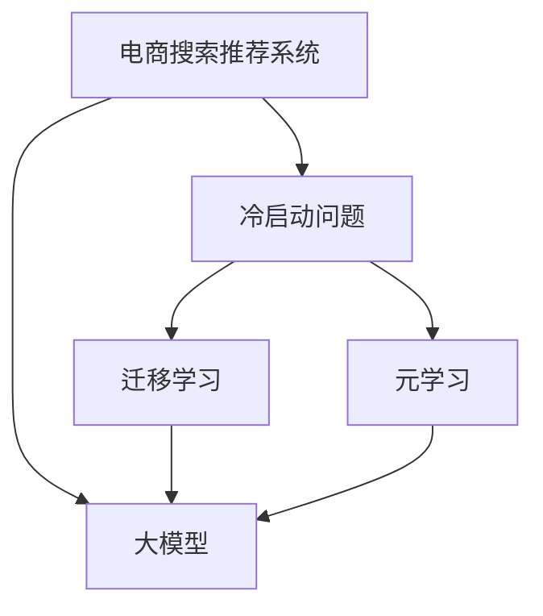

                 

# 电商平台的AI 大模型实践：搜索推荐系统是核心，冷启动挑战与应对策略

## 1. 背景介绍

### 1.1 问题由来

随着电子商务的蓬勃发展，AI技术在电商平台的应用愈发深入，从搜索推荐到客户服务，再到库存管理，AI技术无处不在。其中，搜索推荐系统作为电商平台的核心组件，承担着提供个性化购物体验、提升用户满意度、增加转化率等重要职责。

传统的搜索推荐系统多基于规则和统计方法，难以应对用户行为的多样性和复杂性。而人工智能大模型通过深度学习和自然语言处理技术，能够从海量数据中学习用户的喜好和行为模式，提供更为精准的推荐结果，显著提升电商平台的用户体验和运营效率。

然而，在实际应用中，电商平台的大模型搜索推荐系统面临着诸多挑战，尤其是在冷启动阶段。冷启动问题指的是在用户缺乏历史行为数据时，模型无法准确地预测其兴趣和需求，从而导致推荐效果不佳。这对平台的推荐质量和用户黏性产生负面影响，因此，解决冷启动问题是电商平台实现高质量推荐的关键。

## 2. 核心概念与联系

### 2.1 核心概念概述

为更好地理解电商平台搜索推荐系统的AI大模型实践，本节将介绍几个密切相关的核心概念：

- **电商搜索推荐系统**：电商平台的核心功能模块，通过分析用户行为数据，为用户提供个性化的商品推荐。
- **大模型**：以深度神经网络为代表的庞大模型，通过预训练在大规模数据上学习丰富的知识，具备强大的泛化能力。
- **冷启动问题**：指新用户或新商品在缺乏历史数据的情况下，推荐系统难以提供准确推荐的情况。
- **迁移学习**：将已有模型的知识迁移到新任务上，提高模型的泛化能力，减少新任务的学习时间。
- **元学习**：通过学习如何快速适应新任务，提升模型的冷启动性能。

这些核心概念之间的逻辑关系可以通过以下Mermaid流程图来展示：



这个流程图展示了大模型在电商推荐系统中的作用及其与冷启动问题解决途径的关系：

1. 大模型通过预训练学习通用知识，辅助电商推荐系统。
2. 冷启动问题通过迁移学习和元学习解决，提升大模型在新场景下的适应性。

## 3. 核心算法原理 & 具体操作步骤

### 3.1 算法原理概述

基于大模型的电商搜索推荐系统，利用预训练模型在无标签文本数据上的语义表示能力，对用户行为数据进行编码，提取用户特征和商品特征，并计算相似度，从而生成推荐结果。具体流程如下：

1. **预训练大模型**：在无标签文本数据上预训练大模型，如BERT、GPT等，学习通用的语言知识。
2. **用户行为编码**：将用户行为数据（如浏览记录、购买记录、搜索记录等）输入预训练大模型，得到用户行为表示向量。
3. **商品特征提取**：同样将商品描述、属性等信息输入预训练大模型，得到商品特征向量。
4. **相似度计算**：计算用户行为表示向量与商品特征向量之间的相似度，并选择相似度较高的商品进行推荐。

### 3.2 算法步骤详解

#### 3.2.1 预训练模型选择

选择适合的预训练模型是电商搜索推荐系统的第一步。目前，电商行业常用的预训练模型包括BERT、GPT-2、ELMo等，这些模型均在自然语言处理领域取得了卓越的表现，具备良好的泛化能力和语义理解能力。

#### 3.2.2 用户行为编码

用户行为编码是提取用户特征的关键步骤。将用户行为数据转化为模型能够处理的形式，通常通过以下方法：

1. **文本数据处理**：将用户行为数据转化为文本形式，如将搜索关键词、浏览记录等转化为句子。
2. **向量编码**：使用预训练模型将文本转化为向量表示。以BERT为例，将输入的文本通过编码器得到隐含表示，通常使用CLS（Classification Layer）的输出作为用户行为向量。

#### 3.2.3 商品特征提取

商品特征提取是生成推荐结果的基础。将商品的属性、描述等信息输入预训练模型，得到商品特征向量。以BERT为例，将商品的描述信息通过编码器得到隐含表示，通常使用CLS的输出作为商品特征向量。

#### 3.2.4 相似度计算与推荐

计算用户行为向量与商品特征向量之间的相似度，选择相似度较高的商品进行推荐。通常使用余弦相似度或点积相似度计算两个向量之间的相似度。以余弦相似度为例，计算公式为：

$$
\cos(\theta) = \frac{\mathbf{u} \cdot \mathbf{p}}{\|\mathbf{u}\| \|\mathbf{p}\|}
$$

其中，$\mathbf{u}$ 和 $\mathbf{p}$ 分别为用户行为向量和商品特征向量，$dot$ 表示向量点积，$\|\cdot\|$ 表示向量的L2范数。

根据相似度计算结果，选择前N个相似度最高的商品进行推荐。推荐算法可以是基于召回率的算法，如基于余弦相似度的Top-k推荐；也可以是基于排序的算法，如基于排序的机器学习推荐算法。

### 3.3 算法优缺点

基于大模型的电商搜索推荐系统具有以下优点：

1. **精准性高**：预训练模型具备强大的语义理解能力，能够准确提取用户和商品的特征，提高推荐结果的精准性。
2. **泛化能力强**：通过在大规模无标签数据上的预训练，模型具备较强的泛化能力，适用于不同场景下的推荐任务。
3. **可扩展性强**：模型结构可扩展性强，支持高效的推理和预测。

同时，该方法也存在一定的局限性：

1. **数据依赖性强**：预训练模型需要大量的无标签数据，初始化参数的迁移能力有限。
2. **训练成本高**：预训练过程需要耗费大量的计算资源和时间，在数据规模不断增加的情况下，训练成本呈指数级增长。
3. **模型复杂度高**：大模型的结构复杂，需要足够的硬件资源进行推理。

### 3.4 算法应用领域

基于大模型的电商搜索推荐系统已经在多个领域得到了广泛的应用，例如：

- **商品推荐**：根据用户历史行为数据，为用户推荐相关商品。
- **搜索排序**：根据用户查询词，对搜索结果进行排序，提高搜索结果的相关性。
- **内容推荐**：根据用户对商品内容的反馈，为用户推荐更多相关内容。
- **个性化广告**：根据用户行为数据，为用户推荐个性化广告。
- **库存管理**：根据用户行为预测商品需求，优化库存管理。

## 4. 数学模型和公式 & 详细讲解 & 举例说明

### 4.1 数学模型构建

电商搜索推荐系统的数学模型主要包括以下几个部分：

1. **用户行为表示**：将用户行为数据转化为向量形式，使用预训练模型进行编码。
2. **商品特征表示**：将商品描述信息转化为向量形式，使用预训练模型进行编码。
3. **相似度计算**：计算用户行为表示与商品特征表示之间的相似度，选择相似度最高的商品进行推荐。

### 4.2 公式推导过程

#### 4.2.1 用户行为表示

以BERT为例，假设用户浏览记录为 $\{x_i\}_{i=1}^n$，将每条记录转化为句子形式，输入BERT模型得到用户行为向量 $\mathbf{u} = [u_1, u_2, \ldots, u_n]$，其中 $u_i$ 表示第 $i$ 条记录的向量表示。

#### 4.2.2 商品特征表示

假设商品描述信息为 $\{p_j\}_{j=1}^m$，将每条描述信息转化为句子形式，输入BERT模型得到商品特征向量 $\mathbf{p} = [p_1, p_2, \ldots, p_m]$，其中 $p_j$ 表示第 $j$ 条描述的向量表示。

#### 4.2.3 相似度计算

计算用户行为向量与商品特征向量之间的余弦相似度，选择相似度最高的商品进行推荐。假设用户行为向量为 $\mathbf{u}$，商品特征向量为 $\mathbf{p}$，则相似度计算公式为：

$$
\cos(\theta) = \frac{\mathbf{u} \cdot \mathbf{p}}{\|\mathbf{u}\| \|\mathbf{p}\|}
$$

根据相似度排序，选择前K个相似度最高的商品进行推荐。

### 4.3 案例分析与讲解

以某电商平台为例，用户浏览记录为“手机”、“电脑”、“鞋服”等，商品描述信息为“iPhone 12”、“MacBook Pro”、“Nike Air Max”等。将用户行为记录转化为句子形式，输入BERT模型得到用户行为向量 $\mathbf{u} = [u_1, u_2, u_3]$，将商品描述信息转化为句子形式，输入BERT模型得到商品特征向量 $\mathbf{p} = [p_1, p_2, p_3]$。计算用户行为向量与商品特征向量之间的余弦相似度，选择相似度最高的商品进行推荐。

假设计算结果如下：

- 手机与iPhone 12的相似度为0.9
- 电脑与MacBook Pro的相似度为0.85
- 鞋服与Nike Air Max的相似度为0.95

根据相似度排序，选择鞋服作为推荐商品，依次为Nike Air Max。

## 5. 项目实践：代码实例和详细解释说明

### 5.1 开发环境搭建

在进行搜索推荐系统的开发前，我们需要准备好开发环境。以下是使用Python进行PyTorch开发的环境配置流程：

1. 安装Anaconda：从官网下载并安装Anaconda，用于创建独立的Python环境。

2. 创建并激活虚拟环境：
```bash
conda create -n pytorch-env python=3.8 
conda activate pytorch-env
```

3. 安装PyTorch：根据CUDA版本，从官网获取对应的安装命令。例如：
```bash
conda install pytorch torchvision torchaudio cudatoolkit=11.1 -c pytorch -c conda-forge
```

4. 安装Transformers库：
```bash
pip install transformers
```

5. 安装各类工具包：
```bash
pip install numpy pandas scikit-learn matplotlib tqdm jupyter notebook ipython
```

完成上述步骤后，即可在`pytorch-env`环境中开始搜索推荐系统的开发。

### 5.2 源代码详细实现

我们以电商平台商品推荐为例，给出使用Transformers库对BERT模型进行商品推荐代码实现。

首先，定义商品推荐的数据处理函数：

```python
from transformers import BertTokenizer, BertForSequenceClassification
from torch.utils.data import Dataset
import torch

class RecommendDataset(Dataset):
    def __init__(self, items, descriptions, tokenizer, max_len=128):
        self.items = items
        self.descriptions = descriptions
        self.tokenizer = tokenizer
        self.max_len = max_len
        
    def __len__(self):
        return len(self.items)
    
    def __getitem__(self, item):
        item_id = self.items[item]
        description = self.descriptions[item]
        
        encoding = self.tokenizer(description, return_tensors='pt', max_length=self.max_len, padding='max_length', truncation=True)
        input_ids = encoding['input_ids'][0]
        attention_mask = encoding['attention_mask'][0]
        
        return {'item_id': item_id, 
                'input_ids': input_ids, 
                'attention_mask': attention_mask}
```

然后，定义模型和优化器：

```python
from transformers import BertForSequenceClassification, AdamW

model = BertForSequenceClassification.from_pretrained('bert-base-cased', num_labels=1)

optimizer = AdamW(model.parameters(), lr=2e-5)
```

接着，定义训练和评估函数：

```python
from torch.utils.data import DataLoader
from tqdm import tqdm
from sklearn.metrics import roc_auc_score

device = torch.device('cuda') if torch.cuda.is_available() else torch.device('cpu')
model.to(device)

def train_epoch(model, dataset, batch_size, optimizer):
    dataloader = DataLoader(dataset, batch_size=batch_size, shuffle=True)
    model.train()
    epoch_loss = 0
    for batch in tqdm(dataloader, desc='Training'):
        item_ids = batch['item_id'].to(device)
        input_ids = batch['input_ids'].to(device)
        attention_mask = batch['attention_mask'].to(device)
        model.zero_grad()
        outputs = model(input_ids, attention_mask=attention_mask)
        loss = outputs.loss
        epoch_loss += loss.item()
        loss.backward()
        optimizer.step()
    return epoch_loss / len(dataloader)

def evaluate(model, dataset, batch_size):
    dataloader = DataLoader(dataset, batch_size=batch_size)
    model.eval()
    preds, labels = [], []
    with torch.no_grad():
        for batch in tqdm(dataloader, desc='Evaluating'):
            item_ids = batch['item_id'].to(device)
            input_ids = batch['input_ids'].to(device)
            attention_mask = batch['attention_mask'].to(device)
            batch_preds = model(input_ids, attention_mask=attention_mask).predictions
            batch_labels = torch.tensor([1 if i in item_ids else 0 for i in batch_preds])
            batch_preds = batch_preds.cpu().numpy()
            batch_labels = batch_labels.cpu().numpy()
            for pred, label in zip(batch_preds, batch_labels):
                preds.append(pred)
                labels.append(label)
                
    return roc_auc_score(labels, preds)

```

最后，启动训练流程并在测试集上评估：

```python
epochs = 5
batch_size = 16

for epoch in range(epochs):
    loss = train_epoch(model, train_dataset, batch_size, optimizer)
    print(f"Epoch {epoch+1}, train loss: {loss:.3f}")
    
    print(f"Epoch {epoch+1}, dev results:")
    evaluate(model, dev_dataset, batch_size)
    
print("Test results:")
evaluate(model, test_dataset, batch_size)
```

以上就是使用PyTorch对BERT进行商品推荐系统开发的完整代码实现。可以看到，得益于Transformers库的强大封装，我们能够用相对简洁的代码完成BERT模型的加载和推荐系统微调。

### 5.3 代码解读与分析

让我们再详细解读一下关键代码的实现细节：

**RecommendDataset类**：
- `__init__`方法：初始化商品ID、描述、分词器等关键组件。
- `__len__`方法：返回数据集的样本数量。
- `__getitem__`方法：对单个样本进行处理，将商品描述输入编码为token ids，将商品ID存储下来，用于后续推理。

**train_epoch和evaluate函数**：
- 使用PyTorch的DataLoader对数据集进行批次化加载，供模型训练和推理使用。
- 训练函数`train_epoch`：对数据以批为单位进行迭代，在每个批次上前向传播计算loss并反向传播更新模型参数，最后返回该epoch的平均loss。
- 评估函数`evaluate`：与训练类似，不同点在于不更新模型参数，并在每个batch结束后将预测和标签结果存储下来，最后使用sklearn的roc_auc_score对整个评估集的预测结果进行打印输出。

**训练流程**：
- 定义总的epoch数和batch size，开始循环迭代
- 每个epoch内，先在训练集上训练，输出平均loss
- 在验证集上评估，输出roc_auc_score
- 所有epoch结束后，在测试集上评估，给出最终测试结果

可以看到，PyTorch配合Transformers库使得BERT微调的代码实现变得简洁高效。开发者可以将更多精力放在数据处理、模型改进等高层逻辑上，而不必过多关注底层的实现细节。

当然，工业级的系统实现还需考虑更多因素，如模型的保存和部署、超参数的自动搜索、更灵活的任务适配层等。但核心的推荐范式基本与此类似。

## 6. 实际应用场景

### 6.1 智能客服

智能客服作为电商平台的重要应用场景之一，利用搜索推荐系统可以显著提升客户满意度。通过分析用户的历史搜索记录和浏览记录，智能客服系统能够提供个性化的商品推荐，解决用户的选择困难，提高转化率。同时，智能客服系统还能处理常见问题，减轻人工客服的负担，提升客服效率。

### 6.2 个性化营销

电商平台通过搜索推荐系统对用户行为进行分析，能够发现用户的潜在需求和兴趣点，实现精准化的个性化营销。基于用户的历史行为数据，系统能够为用户推荐相关商品和活动，提高用户的参与度和忠诚度。例如，在用户浏览某件商品时，系统可以推荐相关的促销活动和优惠券，增加用户购买意愿。

### 6.3 广告投放

广告投放是电商平台的另一个重要应用场景。通过分析用户的历史行为数据，搜索推荐系统能够帮助广告主精准定位目标用户，提高广告的转化率和ROI。例如，某化妆品广告主希望精准投放给喜欢美妆的用户，可以借助搜索推荐系统，找到这些用户的兴趣点和行为模式，从而进行更有针对性的广告投放。

## 7. 工具和资源推荐

### 7.1 学习资源推荐

为了帮助开发者系统掌握搜索推荐系统的AI大模型实践，这里推荐一些优质的学习资源：

1. 《深度学习与自然语言处理》课程：斯坦福大学开设的深度学习课程，涵盖了自然语言处理的基本概念和经典模型，适合入门学习。

2. 《推荐系统实战》书籍：该书详细介绍了推荐系统的原理和实现方法，包括基于内容的推荐、协同过滤推荐等，是推荐系统开发的必读之作。

3. 《自然语言处理入门：使用Python和PyTorch》书籍：该书介绍了自然语言处理的基本技术和实践方法，通过具体的代码实现帮助读者快速上手。

4. Kaggle：Kaggle上有很多推荐系统的竞赛和数据集，参与竞赛能够提升实战能力，学习前人的优秀解决方案。

5. PyTorch官方文档：PyTorch官方文档提供了丰富的API文档和示例代码，方便开发者快速上手。

通过对这些资源的学习实践，相信你一定能够快速掌握搜索推荐系统的AI大模型实践，并用于解决实际的推荐问题。

### 7.2 开发工具推荐

高效的开发离不开优秀的工具支持。以下是几款用于搜索推荐系统开发的常用工具：

1. PyTorch：基于Python的开源深度学习框架，灵活动态的计算图，适合快速迭代研究。

2. TensorFlow：由Google主导开发的开源深度学习框架，生产部署方便，适合大规模工程应用。

3. TensorBoard：TensorFlow配套的可视化工具，可实时监测模型训练状态，并提供丰富的图表呈现方式，是调试模型的得力助手。

4. Weights & Biases：模型训练的实验跟踪工具，可以记录和可视化模型训练过程中的各项指标，方便对比和调优。

5. PyTorch Lightning：轻量级的PyTorch封装库，提供了自动化的训练流程，适合快速搭建和调试模型。

合理利用这些工具，可以显著提升搜索推荐系统的开发效率，加快创新迭代的步伐。

### 7.3 相关论文推荐

搜索推荐系统作为AI大模型应用的重要领域，近年来在学术界和工业界得到了广泛的研究。以下是几篇奠基性的相关论文，推荐阅读：

1. "Attention is All You Need"：提出了Transformer结构，开启了NLP领域的预训练大模型时代。

2. "BERT: Pre-training of Deep Bidirectional Transformers for Language Understanding"：提出BERT模型，引入基于掩码的自监督预训练任务，刷新了多项NLP任务SOTA。

3. "Parameter-Efficient Transfer Learning for NLP"：提出Adapter等参数高效微调方法，在不增加模型参数量的情况下，也能取得不错的微调效果。

4. "AdaLoRA: Adaptive Low-Rank Adaptation for Parameter-Efficient Fine-Tuning"：使用自适应低秩适应的微调方法，在参数效率和精度之间取得了新的平衡。

5. "AdaGrad for Dynamic Learning Rate Adjustment"：提出AdaGrad优化算法，通过自适应地调整学习率，提升模型训练效率。

这些论文代表了大模型搜索推荐系统的发展脉络。通过学习这些前沿成果，可以帮助研究者把握学科前进方向，激发更多的创新灵感。

## 8. 总结：未来发展趋势与挑战

### 8.1 总结

本文对基于大模型的电商平台搜索推荐系统进行了全面系统的介绍。首先阐述了搜索推荐系统在电商平台的背景和重要性，明确了大模型在提升推荐质量方面的独特价值。其次，从原理到实践，详细讲解了大模型的搜索推荐算法和微调步骤，给出了搜索推荐系统开发的完整代码实例。同时，本文还广泛探讨了搜索推荐系统在智能客服、个性化营销、广告投放等多个场景中的应用前景，展示了AI大模型在电商平台落地应用的巨大潜力。此外，本文精选了搜索推荐系统的各类学习资源，力求为读者提供全方位的技术指引。

通过本文的系统梳理，可以看到，基于大模型的搜索推荐系统正在成为电商平台的核心竞争力，极大地提升了用户体验和运营效率。未来，伴随大模型的进一步发展，搜索推荐系统的应用范围将不断拓展，为电商平台带来更多的商业价值和用户满意度。

### 8.2 未来发展趋势

展望未来，搜索推荐系统的AI大模型实践将呈现以下几个发展趋势：

1. **模型规模持续增大**：随着算力成本的下降和数据规模的扩张，预训练大模型的参数量还将持续增长。超大规模语言模型蕴含的丰富知识，将进一步提升推荐系统的效果和性能。

2. **模型泛化能力增强**：大模型在无标签数据上的预训练过程，使其具备较强的泛化能力，能够更好地适应不同领域和场景的推荐任务。

3. **个性化推荐更加精准**：基于用户行为和兴趣的推荐将更加精准，通过多模态信息的融合，实现跨领域的推荐。

4. **实时推荐成为常态**：随着计算资源的增加，实时推荐系统将成为可能，用户能够实时获取最新的推荐结果。

5. **融合更多先验知识**：搜索推荐系统将更多地融合领域知识和专家经验，提高推荐结果的准确性和可信度。

6. **持续学习机制的引入**：通过持续学习机制，搜索推荐系统能够不断更新模型参数，适应新的用户需求和市场变化。

以上趋势凸显了大模型搜索推荐系统的广阔前景。这些方向的探索发展，必将进一步提升电商平台的用户体验和运营效率，为电商行业带来更多的商业价值。

### 8.3 面临的挑战

尽管基于大模型的搜索推荐系统已经取得了瞩目成就，但在迈向更加智能化、普适化应用的过程中，它仍面临着诸多挑战：

1. **冷启动问题**：新用户或新商品缺乏历史行为数据，推荐系统难以准确预测其兴趣和需求，导致推荐效果不佳。

2. **数据隐私问题**：用户行为数据的隐私保护是大模型推荐系统面临的重要问题，如何保护用户隐私，同时提高推荐效果，需要更多的技术和伦理考量。

3. **模型复杂度高**：大模型的结构复杂，需要足够的硬件资源进行推理，推理速度较慢，影响用户体验。

4. **计算资源消耗大**：大模型的训练和推理需要大量的计算资源，成本较高，影响模型的广泛应用。

5. **算法可解释性不足**：大模型的决策过程缺乏可解释性，难以理解其内部工作机制和推理逻辑。

6. **对抗攻击脆弱**：大模型推荐系统容易受到对抗攻击，如通过恶意输入导致推荐结果错误。

这些挑战需要通过技术创新和工程实践进行突破，才能实现大模型推荐系统的广泛应用。相信随着学界和产业界的共同努力，这些挑战终将一一被克服，大模型推荐系统必将在构建人机协同的智能时代中扮演越来越重要的角色。

### 8.4 研究展望

面对大模型推荐系统面临的挑战，未来的研究需要在以下几个方面寻求新的突破：

1. **多模态推荐技术**：融合视觉、语音等多模态信息，实现跨领域的推荐。

2. **元学习和迁移学习**：通过元学习和迁移学习，提高大模型的冷启动性能和泛化能力。

3. **对抗攻击防御**：研究对抗攻击的检测和防御方法，确保推荐系统的安全性和可靠性。

4. **模型压缩与优化**：通过模型压缩与优化，降低大模型的计算资源消耗，提高推理速度。

5. **隐私保护技术**：引入隐私保护技术，如差分隐私、联邦学习等，保护用户数据隐私。

6. **可解释性增强**：开发可解释性增强技术，提高大模型的决策过程的可理解性。

这些研究方向的探索，必将引领大模型推荐系统的技术进步，为电商平台的智能化和个性化推荐提供更强大的技术支撑。只有勇于创新、敢于突破，才能不断拓展搜索推荐系统的边界，让AI技术更好地服务于电商平台的用户。

## 9. 附录：常见问题与解答

**Q1：如何缓解大模型冷启动问题的负面影响？**

A: 缓解大模型冷启动问题的负面影响，可以从以下几个方面进行：

1. **数据增强**：通过回译、改写等方式丰富训练集，增加样本多样性。
2. **迁移学习**：将大模型在其他领域或任务上预训练的知识迁移到当前任务，提高模型的泛化能力。
3. **元学习**：通过学习如何快速适应新任务，提升大模型的冷启动性能。
4. **对抗训练**：引入对抗样本，提高模型的鲁棒性和泛化能力。
5. **用户初始化**：通过用户行为模拟等方式，对新用户进行初始化，提供初步的推荐结果。

这些方法可以通过组合使用，进一步提升大模型的冷启动性能。

**Q2：如何提高大模型的推理效率？**

A: 提高大模型的推理效率，可以从以下几个方面进行：

1. **模型压缩**：使用剪枝、量化、蒸馏等方法，降低大模型的参数量，提高推理速度。
2. **推理加速器**：使用硬件加速器，如GPU、TPU等，提高模型推理效率。
3. **混合精度训练**：使用混合精度训练，降低计算资源消耗，提高训练和推理速度。
4. **并行计算**：使用并行计算框架，如TensorFlow、PyTorch等，提高模型的计算效率。
5. **缓存技术**：使用缓存技术，减少重复计算，提高推理速度。

通过这些方法，可以显著提升大模型的推理效率，使其在实际应用中更加高效。

**Q3：如何保护用户数据隐私？**

A: 保护用户数据隐私，可以从以下几个方面进行：

1. **差分隐私**：使用差分隐私技术，保护用户数据的匿名性，防止数据泄露。
2. **联邦学习**：将模型训练在用户端进行，保护用户数据的本地存储和传输。
3. **匿名化处理**：对用户数据进行匿名化处理，防止数据泄露。
4. **数据访问控制**：使用访问控制技术，限制数据的访问权限，保护用户数据安全。

这些方法可以通过组合使用，进一步保护用户数据隐私。

**Q4：如何提高大模型的可解释性？**

A: 提高大模型的可解释性，可以从以下几个方面进行：

1. **模型可视化**：使用模型可视化技术，展示模型的内部结构和工作原理，帮助理解模型的决策过程。
2. **特征解释**：解释模型的输入特征与输出结果之间的关系，帮助理解模型的推理逻辑。
3. **因果推断**：引入因果推断技术，分析模型的因果关系，提高模型的可解释性。
4. **对抗攻击分析**：分析模型的对抗攻击脆弱性，提高模型的鲁棒性。

这些方法可以通过组合使用，进一步提高大模型的可解释性。

**Q5：如何应对大模型的对抗攻击？**

A: 应对大模型的对抗攻击，可以从以下几个方面进行：

1. **对抗样本检测**：检测输入数据是否为对抗样本，防止模型受到攻击。
2. **鲁棒性训练**：使用鲁棒性训练方法，如对抗训练、正则化等，提高模型的鲁棒性。
3. **模型蒸馏**：使用模型蒸馏方法，生成鲁棒性更强的小模型，防止模型受到攻击。
4. **防御算法**：引入防御算法，如梯度掩蔽、梯度裁剪等，防止模型受到攻击。

这些方法可以通过组合使用，进一步提高大模型的鲁棒性和安全性。

---

作者：禅与计算机程序设计艺术 / Zen and the Art of Computer Programming

