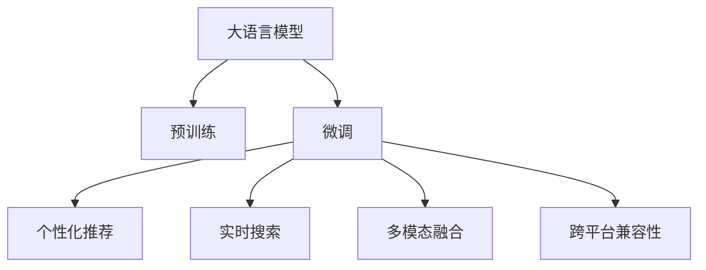

                 

# 电商平台的AI 大模型战略：搜索推荐系统的核心竞争力

## 1. 背景介绍

### 1.1 问题由来
电商平台的搜索推荐系统在提升用户体验、促进销售转化、提高运营效率等方面发挥了不可替代的作用。然而，传统的搜索推荐系统主要依赖于统计学模型和规则引擎，在个性化程度、实时性、泛化能力等方面存在一定的局限性。伴随深度学习技术的快速发展，基于深度学习的推荐系统逐渐成为主流，通过多模态融合、跨领域迁移、主动学习等方法，显著提升了推荐的准确性和效率。

近年来，大语言模型(Big Language Model, BLM)在自然语言处理(NLP)领域的突破，为电商平台带来了新的发展机遇。通过预训练和微调，大语言模型可以快速适应电商平台的特定需求，提供更加精准、个性化的搜索推荐服务。

### 1.2 问题核心关键点
大语言模型在电商平台搜索推荐系统中的应用，主要体现在以下几个方面：

1. **个性化推荐**：利用大模型对用户行为进行深度理解和建模，实现个性化推荐，提升用户满意度。
2. **实时搜索**：大模型能够在实时场景中快速理解用户查询意图，提供实时的搜索结果和推荐内容。
3. **跨领域迁移**：通过大模型进行预训练，可以在不同领域和任务上进行微调，适应多变的业务需求。
4. **知识整合**：大模型能够整合外部知识库、专家规则等，辅助构建更加全面、准确的推荐模型。
5. **多模态融合**：结合图像、语音、视频等多模态数据，提升推荐系统的综合表现。
6. **跨平台兼容性**：大模型可以轻松迁移到多个电商平台的搜索推荐系统，实现通用的推荐策略。

这些核心关键点，为大语言模型在电商平台中的应用提供了广阔的前景和挑战。本文将从原理、技术、实践和未来展望等多个角度，系统阐述大模型在电商平台搜索推荐系统中的核心竞争力。

## 2. 核心概念与联系

### 2.1 核心概念概述

为了更好地理解大语言模型在电商平台搜索推荐系统中的应用，本节将介绍几个密切相关的核心概念：

1. **大语言模型 (Big Language Model, BLM)**：一种通过大规模无标签文本数据进行预训练的深度学习模型。预训练后的大模型具备强大的语言理解和生成能力，能够进行文本分类、问答、翻译、生成等多种自然语言处理任务。

2. **预训练 (Pre-training)**：指在大规模无标签文本数据上，通过自监督学习任务训练大语言模型的过程。预训练使得模型学习到丰富的语言知识和通用表征，从而在特定的下游任务上表现更佳。

3. **微调 (Fine-tuning)**：指在预训练模型的基础上，使用下游任务的少量标注数据，通过有监督地训练来优化模型在该任务上的性能。微调可以显著提升模型在特定任务上的表现，尤其是在数据量较少的情况下。

4. **迁移学习 (Transfer Learning)**：指将一个领域学习到的知识，迁移应用到另一个不同但相关的领域的学习范式。大模型的预训练和微调过程即是一种典型的迁移学习方式。

5. **个性化推荐 (Personalized Recommendation)**：指根据用户的历史行为、兴趣偏好、实时反馈等信息，为其推荐可能感兴趣的商品、内容等，提升用户体验和购买转化率。

6. **实时搜索 (Real-time Search)**：指在用户输入查询时，实时返回相关搜索结果，并根据上下文动态调整推荐内容，提供更贴合用户需求的结果。

7. **多模态融合 (Multi-modal Fusion)**：指结合文本、图像、语音等多模态数据，构建更加全面、准确的推荐模型。

8. **跨平台兼容性 (Cross-platform Compatibility)**：指在多个电商平台之间实现通用的搜索推荐策略，提高模型在不同环境下的泛化能力。

这些核心概念之间的逻辑关系可以通过以下Mermaid流程图来展示：



这个流程图展示了大语言模型在电商平台搜索推荐系统中的核心概念及其之间的关系：

1. 大语言模型通过预训练获得基础能力。
2. 微调是对预训练模型进行任务特定的优化，适用于个性化推荐等特定任务。
3. 个性化推荐、实时搜索、多模态融合等技术，都依赖于微调的深度模型。
4. 跨平台兼容性确保模型能够在不同电商平台之间进行无缝迁移。

这些概念共同构成了大语言模型在电商平台搜索推荐系统中的应用框架，使其能够在各种场景下发挥强大的推荐能力。通过理解这些核心概念，我们可以更好地把握大语言模型的工作原理和优化方向。

## 3. 核心算法原理 & 具体操作步骤

### 3.1 算法原理概述

基于大语言模型在电商平台搜索推荐系统中的应用，主要采用以下算法原理：

1. **预训练和微调**：在大规模无标签文本数据上预训练大语言模型，使其学习到丰富的语言知识和通用表征，然后在特定任务（如个性化推荐、实时搜索等）上进行微调，提升模型在该任务上的性能。

2. **个性化推荐**：利用大模型的语言理解能力，通过分析用户历史行为、兴趣偏好等数据，生成个性化推荐结果，提高用户满意度。

3. **实时搜索**：通过大模型的语言生成能力，在用户输入查询时，实时理解查询意图，快速返回相关搜索结果。

4. **多模态融合**：结合图像、语音、视频等多模态数据，提升推荐系统的综合表现，提供更全面的搜索结果和推荐内容。

5. **跨平台兼容性**：将预训练和微调的大语言模型，迁移到不同电商平台，实现通用的搜索推荐策略，提升模型的泛化能力。

### 3.2 算法步骤详解

基于大语言模型在电商平台搜索推荐系统中的应用，一般包括以下几个关键步骤：

**Step 1: 准备预训练模型和数据集**
- 选择合适的预训练大语言模型，如BERT、GPT等，作为初始化参数。
- 准备电商平台的商品信息、用户行为、搜索查询等数据集，划分为训练集、验证集和测试集。

**Step 2: 微调模型**
- 根据具体任务，设计合适的损失函数和优化算法，如交叉熵、AdamW等。
- 在训练集上，使用预训练的大语言模型进行微调，最小化损失函数，提升模型性能。
- 在验证集上评估模型性能，调整超参数，防止过拟合。
- 在测试集上最终评估模型性能，输出推荐结果。

**Step 3: 应用模型**
- 将微调后的模型应用到电商平台的搜索推荐系统中，实时处理用户查询，生成个性化推荐。
- 根据多模态数据融合和用户行为实时调整推荐结果。
- 在多个电商平台之间实现模型迁移，提升跨平台兼容性。

### 3.3 算法优缺点

大语言模型在电商平台搜索推荐系统中的应用，具有以下优点：

1. **泛化能力强**：通过预训练和微调，大语言模型能够学习到广泛的语言知识和通用表征，适用于多种任务和场景。
2. **个性化程度高**：利用大模型的语言理解能力，能够深度分析用户行为和兴趣，生成更加精准的个性化推荐。
3. **实时响应快**：大模型在实时场景中能够快速理解查询意图，提供实时的搜索结果和推荐。
4. **多模态融合**：结合多种数据源，提升推荐系统的综合表现。
5. **跨平台兼容**：模型能够在多个平台之间进行迁移，提高跨平台兼容性。

同时，该方法也存在一定的局限性：

1. **数据依赖性高**：微调和推荐效果依赖于标注数据的质量和数量，数据获取成本较高。
2. **模型复杂度高**：大语言模型参数量较大，计算和存储资源消耗较大。
3. **实时性需求高**：实时搜索和推荐对模型响应速度和延迟有较高要求。
4. **用户隐私问题**：推荐系统需要收集用户行为数据，可能涉及隐私保护问题。

尽管存在这些局限性，但就目前而言，基于大语言模型的推荐方法仍是电商搜索推荐系统的热门选择。未来相关研究的重点在于如何进一步降低数据依赖，提高模型效率，保护用户隐私等，以更好地适应电商平台的实际需求。

### 3.4 算法应用领域

基于大语言模型在电商平台搜索推荐系统中的应用，已经在以下多个领域取得了显著成果：

1. **个性化推荐**：如商品推荐、内容推荐、广告推荐等，通过分析用户历史行为和兴趣，生成个性化推荐。
2. **实时搜索**：如智能客服、商品搜索、功能导航等，实时理解用户查询意图，提供相关搜索结果。
3. **多模态融合**：如视频推荐、音乐推荐等，结合图像、语音、视频等多模态数据，提升推荐质量。
4. **跨平台兼容性**：如电商平台之间的推荐系统迁移，提升跨平台兼容性。

除了上述这些经典应用外，大语言模型还被创新性地应用于更多场景中，如智能家居、智慧零售、智能制造等，为电商平台的智能化转型提供了新的动力。

## 4. 数学模型和公式 & 详细讲解  
### 4.1 数学模型构建

本节将使用数学语言对基于大语言模型的电商平台搜索推荐系统进行更加严格的刻画。

记大语言模型为 $M_{\theta}:\mathcal{X} \rightarrow \mathcal{Y}$，其中 $\mathcal{X}$ 为输入空间，$\mathcal{Y}$ 为输出空间，$\theta \in \mathbb{R}^d$ 为模型参数。假设电商平台搜索推荐任务为 $T$，输入为 $x_i$（如商品ID、用户ID等），输出为 $y_i$（如推荐商品ID、商品评分等）。

定义模型 $M_{\theta}$ 在输入 $x_i$ 上的损失函数为 $\ell(M_{\theta}(x_i),y_i)$，则在数据集 $D=\{(x_i,y_i)\}_{i=1}^N$ 上的经验风险为：

$$
\mathcal{L}(\theta) = \frac{1}{N} \sum_{i=1}^N \ell(M_{\theta}(x_i),y_i)
$$

微调的优化目标是最小化经验风险，即找到最优参数：

$$
\theta^* = \mathop{\arg\min}_{\theta} \mathcal{L}(\theta)
$$

在实践中，我们通常使用基于梯度的优化算法（如SGD、Adam等）来近似求解上述最优化问题。设 $\eta$ 为学习率，$\lambda$ 为正则化系数，则参数的更新公式为：

$$
\theta \leftarrow \theta - \eta \nabla_{\theta}\mathcal{L}(\theta) - \eta\lambda\theta
$$

其中 $\nabla_{\theta}\mathcal{L}(\theta)$ 为损失函数对参数 $\theta$ 的梯度，可通过反向传播算法高效计算。

### 4.2 公式推导过程

以下我们以电商平台的个性化推荐任务为例，推导交叉熵损失函数及其梯度的计算公式。

假设模型 $M_{\theta}$ 在输入 $x_i$ 上的输出为 $\hat{y}=M_{\theta}(x_i) \in [0,1]$，表示商品被用户购买的概率。真实标签 $y \in \{0,1\}$。则二分类交叉熵损失函数定义为：

$$
\ell(M_{\theta}(x_i),y) = -[y\log \hat{y} + (1-y)\log (1-\hat{y})]
$$

将其代入经验风险公式，得：

$$
\mathcal{L}(\theta) = -\frac{1}{N}\sum_{i=1}^N [y_i\log M_{\theta}(x_i)+(1-y_i)\log(1-M_{\theta}(x_i))]
$$

根据链式法则，损失函数对参数 $\theta_k$ 的梯度为：

$$
\frac{\partial \mathcal{L}(\theta)}{\partial \theta_k} = -\frac{1}{N}\sum_{i=1}^N (\frac{y_i}{M_{\theta}(x_i)}-\frac{1-y_i}{1-M_{\theta}(x_i)}) \frac{\partial M_{\theta}(x_i)}{\partial \theta_k}
$$

其中 $\frac{\partial M_{\theta}(x_i)}{\partial \theta_k}$ 可进一步递归展开，利用自动微分技术完成计算。

在得到损失函数的梯度后，即可带入参数更新公式，完成模型的迭代优化。重复上述过程直至收敛，最终得到适应电商平台个性化推荐任务的最优模型参数 $\theta^*$。

## 5. 项目实践：代码实例和详细解释说明
### 5.1 开发环境搭建

在进行电商平台搜索推荐系统的开发前，我们需要准备好开发环境。以下是使用Python进行PyTorch开发的环境配置流程：

1. 安装Anaconda：从官网下载并安装Anaconda，用于创建独立的Python环境。

2. 创建并激活虚拟环境：
```bash
conda create -n pytorch-env python=3.8 
conda activate pytorch-env
```

3. 安装PyTorch：根据CUDA版本，从官网获取对应的安装命令。例如：
```bash
conda install pytorch torchvision torchaudio cudatoolkit=11.1 -c pytorch -c conda-forge
```

4. 安装Transformers库：
```bash
pip install transformers
```

5. 安装各类工具包：
```bash
pip install numpy pandas scikit-learn matplotlib tqdm jupyter notebook ipython
```

完成上述步骤后，即可在`pytorch-env`环境中开始搜索推荐系统的开发。

### 5.2 源代码详细实现

下面我们以电商平台商品推荐任务为例，给出使用Transformers库对BERT模型进行微调的PyTorch代码实现。

首先，定义推荐任务的数据处理函数：

```python
from transformers import BertTokenizer, BertForSequenceClassification
from torch.utils.data import Dataset, DataLoader
import torch

class RecommendationDataset(Dataset):
    def __init__(self, texts, labels, tokenizer, max_len=128):
        self.texts = texts
        self.labels = labels
        self.tokenizer = tokenizer
        self.max_len = max_len
        
    def __len__(self):
        return len(self.texts)
    
    def __getitem__(self, item):
        text = self.texts[item]
        label = self.labels[item]
        
        encoding = self.tokenizer(text, return_tensors='pt', max_length=self.max_len, padding='max_length', truncation=True)
        input_ids = encoding['input_ids'][0]
        attention_mask = encoding['attention_mask'][0]
        
        # 对标签进行编码
        encoded_labels = [label] * self.max_len
        labels = torch.tensor(encoded_labels, dtype=torch.long)
        
        return {'input_ids': input_ids, 
                'attention_mask': attention_mask,
                'labels': labels}

# 标签与id的映射
label2id = {0: 0, 1: 1}
id2label = {v: k for k, v in label2id.items()}

# 创建dataset
tokenizer = BertTokenizer.from_pretrained('bert-base-cased')

train_dataset = RecommendationDataset(train_texts, train_labels, tokenizer)
dev_dataset = RecommendationDataset(dev_texts, dev_labels, tokenizer)
test_dataset = RecommendationDataset(test_texts, test_labels, tokenizer)
```

然后，定义模型和优化器：

```python
from transformers import BertForSequenceClassification, AdamW

model = BertForSequenceClassification.from_pretrained('bert-base-cased', num_labels=2)

optimizer = AdamW(model.parameters(), lr=2e-5)
```

接着，定义训练和评估函数：

```python
from tqdm import tqdm

device = torch.device('cuda') if torch.cuda.is_available() else torch.device('cpu')
model.to(device)

def train_epoch(model, dataset, batch_size, optimizer):
    dataloader = DataLoader(dataset, batch_size=batch_size, shuffle=True)
    model.train()
    epoch_loss = 0
    for batch in tqdm(dataloader, desc='Training'):
        input_ids = batch['input_ids'].to(device)
        attention_mask = batch['attention_mask'].to(device)
        labels = batch['labels'].to(device)
        model.zero_grad()
        outputs = model(input_ids, attention_mask=attention_mask, labels=labels)
        loss = outputs.loss
        epoch_loss += loss.item()
        loss.backward()
        optimizer.step()
    return epoch_loss / len(dataloader)

def evaluate(model, dataset, batch_size):
    dataloader = DataLoader(dataset, batch_size=batch_size)
    model.eval()
    preds, labels = [], []
    with torch.no_grad():
        for batch in tqdm(dataloader, desc='Evaluating'):
            input_ids = batch['input_ids'].to(device)
            attention_mask = batch['attention_mask'].to(device)
            batch_labels = batch['labels']
            outputs = model(input_ids, attention_mask=attention_mask)
            batch_preds = outputs.logits.argmax(dim=2).to('cpu').tolist()
            batch_labels = batch_labels.to('cpu').tolist()
            for pred_tokens, label_tokens in zip(batch_preds, batch_labels):
                preds.append(pred_tokens[:len(label_tokens)])
                labels.append(label_tokens)
                
    print(classification_report(labels, preds))
```

最后，启动训练流程并在测试集上评估：

```python
epochs = 5
batch_size = 16

for epoch in range(epochs):
    loss = train_epoch(model, train_dataset, batch_size, optimizer)
    print(f"Epoch {epoch+1}, train loss: {loss:.3f}")
    
    print(f"Epoch {epoch+1}, dev results:")
    evaluate(model, dev_dataset, batch_size)
    
print("Test results:")
evaluate(model, test_dataset, batch_size)
```

以上就是使用PyTorch对BERT进行电商平台商品推荐任务微调的完整代码实现。可以看到，得益于Transformers库的强大封装，我们可以用相对简洁的代码完成BERT模型的加载和微调。

### 5.3 代码解读与分析

让我们再详细解读一下关键代码的实现细节：

**RecommendationDataset类**：
- `__init__`方法：初始化文本、标签、分词器等关键组件。
- `__len__`方法：返回数据集的样本数量。
- `__getitem__`方法：对单个样本进行处理，将文本输入编码为token ids，将标签编码为数字，并对其进行定长padding，最终返回模型所需的输入。

**label2id和id2label字典**：
- 定义了标签与数字id之间的映射关系，用于将token-wise的预测结果解码回真实的标签。

**训练和评估函数**：
- 使用PyTorch的DataLoader对数据集进行批次化加载，供模型训练和推理使用。
- 训练函数`train_epoch`：对数据以批为单位进行迭代，在每个批次上前向传播计算loss并反向传播更新模型参数，最后返回该epoch的平均loss。
- 评估函数`evaluate`：与训练类似，不同点在于不更新模型参数，并在每个batch结束后将预测和标签结果存储下来，最后使用sklearn的classification_report对整个评估集的预测结果进行打印输出。

**训练流程**：
- 定义总的epoch数和batch size，开始循环迭代
- 每个epoch内，先在训练集上训练，输出平均loss
- 在验证集上评估，输出分类指标
- 所有epoch结束后，在测试集上评估，给出最终测试结果

可以看到，PyTorch配合Transformers库使得BERT微调的代码实现变得简洁高效。开发者可以将更多精力放在数据处理、模型改进等高层逻辑上，而不必过多关注底层的实现细节。

当然，工业级的系统实现还需考虑更多因素，如模型的保存和部署、超参数的自动搜索、更灵活的任务适配层等。但核心的微调范式基本与此类似。

## 6. 实际应用场景
### 6.1 智能客服系统

基于大语言模型微调的对话技术，可以广泛应用于智能客服系统的构建。传统客服往往需要配备大量人力，高峰期响应缓慢，且一致性和专业性难以保证。而使用微调后的对话模型，可以7x24小时不间断服务，快速响应客户咨询，用自然流畅的语言解答各类常见问题。

在技术实现上，可以收集企业内部的历史客服对话记录，将问题和最佳答复构建成监督数据，在此基础上对预训练对话模型进行微调。微调后的对话模型能够自动理解用户意图，匹配最合适的答案模板进行回复。对于客户提出的新问题，还可以接入检索系统实时搜索相关内容，动态组织生成回答。如此构建的智能客服系统，能大幅提升客户咨询体验和问题解决效率。

### 6.2 金融舆情监测

金融机构需要实时监测市场舆论动向，以便及时应对负面信息传播，规避金融风险。传统的人工监测方式成本高、效率低，难以应对网络时代海量信息爆发的挑战。基于大语言模型微调的文本分类和情感分析技术，为金融舆情监测提供了新的解决方案。

具体而言，可以收集金融领域相关的新闻、报道、评论等文本数据，并对其进行主题标注和情感标注。在此基础上对预训练语言模型进行微调，使其能够自动判断文本属于何种主题，情感倾向是正面、中性还是负面。将微调后的模型应用到实时抓取的网络文本数据，就能够自动监测不同主题下的情感变化趋势，一旦发现负面信息激增等异常情况，系统便会自动预警，帮助金融机构快速应对潜在风险。

### 6.3 个性化推荐系统

当前的推荐系统往往只依赖用户的历史行为数据进行物品推荐，无法深入理解用户的真实兴趣偏好。基于大语言模型微调技术，个性化推荐系统可以更好地挖掘用户行为背后的语义信息，从而提供更精准、多样的推荐内容。

在实践中，可以收集用户浏览、点击、评论、分享等行为数据，提取和用户交互的物品标题、描述、标签等文本内容。将文本内容作为模型输入，用户的后续行为（如是否点击、购买等）作为监督信号，在此基础上微调预训练语言模型。微调后的模型能够从文本内容中准确把握用户的兴趣点。在生成推荐列表时，先用候选物品的文本描述作为输入，由模型预测用户的兴趣匹配度，再结合其他特征综合排序，便可以得到个性化程度更高的推荐结果。

### 6.4 未来应用展望

随着大语言模型微调技术的发展，其在电商平台搜索推荐系统中的应用将更加广泛和深入。未来，基于大语言模型的搜索推荐系统将具备以下特点：

1. **自适应性**：能够实时理解用户意图和需求，自动调整推荐策略，提高个性化程度。
2. **多模态融合**：结合图像、语音、视频等多模态数据，提升推荐系统的综合表现。
3. **跨平台兼容性**：在多个电商平台之间实现通用的推荐策略，提升推荐效果。
4. **实时性**：能够在用户输入查询时，实时返回相关搜索结果，提升用户体验。
5. **可解释性**：能够提供推荐的理由和依据，增强算法的透明度和可信度。

这些特点将使得大语言模型在电商平台搜索推荐系统中的应用更加智能化和高效化，进一步提升用户体验和业务价值。

## 7. 工具和资源推荐
### 7.1 学习资源推荐

为了帮助开发者系统掌握大语言模型在电商平台搜索推荐系统中的应用，这里推荐一些优质的学习资源：

1. 《Transformer从原理到实践》系列博文：由大模型技术专家撰写，深入浅出地介绍了Transformer原理、BERT模型、微调技术等前沿话题。

2. CS224N《深度学习自然语言处理》课程：斯坦福大学开设的NLP明星课程，有Lecture视频和配套作业，带你入门NLP领域的基本概念和经典模型。

3. 《Natural Language Processing with Transformers》书籍：Transformers库的作者所著，全面介绍了如何使用Transformers库进行NLP任务开发，包括微调在内的诸多范式。

4. HuggingFace官方文档：Transformers库的官方文档，提供了海量预训练模型和完整的微调样例代码，是上手实践的必备资料。

5. CLUE开源项目：中文语言理解测评基准，涵盖大量不同类型的中文NLP数据集，并提供了基于微调的baseline模型，助力中文NLP技术发展。

通过对这些资源的学习实践，相信你一定能够快速掌握大语言模型在电商平台搜索推荐系统中的应用精髓，并用于解决实际的NLP问题。
###  7.2 开发工具推荐

高效的开发离不开优秀的工具支持。以下是几款用于大语言模型微调开发的常用工具：

1. PyTorch：基于Python的开源深度学习框架，灵活动态的计算图，适合快速迭代研究。大部分预训练语言模型都有PyTorch版本的实现。

2. TensorFlow：由Google主导开发的开源深度学习框架，生产部署方便，适合大规模工程应用。同样有丰富的预训练语言模型资源。

3. Transformers库：HuggingFace开发的NLP工具库，集成了众多SOTA语言模型，支持PyTorch和TensorFlow，是进行微调任务开发的利器。

4. Weights & Biases：模型训练的实验跟踪工具，可以记录和可视化模型训练过程中的各项指标，方便对比和调优。与主流深度学习框架无缝集成。

5. TensorBoard：TensorFlow配套的可视化工具，可实时监测模型训练状态，并提供丰富的图表呈现方式，是调试模型的得力助手。

6. Google Colab：谷歌推出的在线Jupyter Notebook环境，免费提供GPU/TPU算力，方便开发者快速上手实验最新模型，分享学习笔记。

合理利用这些工具，可以显著提升大语言模型微调的开发效率，加快创新迭代的步伐。

### 7.3 相关论文推荐

大语言模型和微调技术的发展源于学界的持续研究。以下是几篇奠基性的相关论文，推荐阅读：

1. Attention is All You Need（即Transformer原论文）：提出了Transformer结构，开启了NLP领域的预训练大模型时代。

2. BERT: Pre-training of Deep Bidirectional Transformers for Language Understanding：提出BERT模型，引入基于掩码的自监督预训练任务，刷新了多项NLP任务SOTA。

3. Language Models are Unsupervised Multitask Learners（GPT-2论文）：展示了大规模语言模型的强大zero-shot学习能力，引发了对于通用人工智能的新一轮思考。

4. Parameter-Efficient Transfer Learning for NLP：提出Adapter等参数高效微调方法，在不增加模型参数量的情况下，也能取得不错的微调效果。

5. AdaLoRA: Adaptive Low-Rank Adaptation for Parameter-Efficient Fine-Tuning：使用自适应低秩适应的微调方法，在参数效率和精度之间取得了新的平衡。

这些论文代表了大语言模型微调技术的发展脉络。通过学习这些前沿成果，可以帮助研究者把握学科前进方向，激发更多的创新灵感。

## 8. 总结：未来发展趋势与挑战

### 8.1 总结

本文对基于大语言模型的电商平台搜索推荐系统进行了全面系统的介绍。首先阐述了大语言模型在电商平台搜索推荐系统中的应用背景和核心竞争力，明确了微调在提升个性化推荐、实时搜索等方面发挥的重要作用。其次，从原理到实践，详细讲解了微调的数学原理和关键步骤，给出了微调任务开发的完整代码实例。同时，本文还广泛探讨了微调方法在智能客服、金融舆情、个性化推荐等多个行业领域的应用前景，展示了微调范式的巨大潜力。此外，本文精选了微调技术的各类学习资源，力求为读者提供全方位的技术指引。

通过本文的系统梳理，可以看到，基于大语言模型的微调方法正在成为电商平台搜索推荐系统的核心竞争力，极大地提升了推荐的个性化程度、实时性和泛化能力。得益于大模型的强大语言理解和生成能力，微调模型能够在多模态数据融合、跨平台兼容性等方面取得显著进展，为电商平台的智能化转型提供了强大的技术支撑。未来，伴随大语言模型和微调方法的持续演进，相信搜索推荐系统将在电商平台的智能化进程中发挥更加重要的作用。

### 8.2 未来发展趋势

展望未来，大语言模型微调技术在电商平台搜索推荐系统中的应用将呈现以下几个发展趋势：

1. **个性化推荐**：通过深度理解用户行为和兴趣，提供更加精准、多样化的推荐内容。

2. **实时搜索**：利用大模型的语言理解能力，实现快速、高效的实时搜索，提升用户体验。

3. **多模态融合**：结合图像、语音、视频等多模态数据，提升推荐系统的综合表现。

4. **跨平台兼容性**：在多个电商平台之间实现通用的推荐策略，提高推荐效果。

5. **自适应性**：实时理解用户意图和需求，自动调整推荐策略，提高个性化程度。

6. **可解释性**：提供推荐的理由和依据，增强算法的透明度和可信度。

7. **鲁棒性**：提高模型的鲁棒性，避免过拟合和灾难性遗忘，确保模型在多变场景下的稳定表现。

这些趋势凸显了大语言模型微调技术在电商平台搜索推荐系统中的广阔前景。这些方向的探索发展，必将进一步提升搜索推荐系统的性能和应用范围，为电商平台的智能化转型提供新的动力。

### 8.3 面临的挑战

尽管大语言模型微调技术在电商平台搜索推荐系统中的应用已经取得了显著成果，但在迈向更加智能化、普适化应用的过程中，它仍面临着诸多挑战：

1. **数据依赖性高**：微调和推荐效果依赖于标注数据的质量和数量，数据获取成本较高。

2. **模型复杂度高**：大语言模型参数量较大，计算和存储资源消耗较大。

3. **实时性需求高**：实时搜索和推荐对模型响应速度和延迟有较高要求。

4. **用户隐私问题**：推荐系统需要收集用户行为数据，可能涉及隐私保护问题。

尽管存在这些挑战，但就目前而言，基于大语言模型的推荐方法仍是电商平台搜索推荐系统的热门选择。未来相关研究的重点在于如何进一步降低数据依赖，提高模型效率，保护用户隐私等，以更好地适应电商平台的实际需求。

### 8.4 研究展望

面对大语言模型微调在电商平台搜索推荐系统中的应用所面临的挑战，未来的研究需要在以下几个方面寻求新的突破：

1. **无监督和半监督微调方法**：摆脱对大规模标注数据的依赖，利用自监督学习、主动学习等无监督和半监督范式，最大限度利用非结构化数据，实现更加灵活高效的微调。

2. **参数高效和计算高效的微调范式**：开发更加参数高效的微调方法，在固定大部分预训练参数的同时，只更新极少量的任务相关参数。同时优化微调模型的计算图，减少前向传播和反向传播的资源消耗，实现更加轻量级、实时性的部署。

3. **融合因果和对比学习范式**：通过引入因果推断和对比学习思想，增强微调模型建立稳定因果关系的能力，学习更加普适、鲁棒的语言表征，从而提升模型泛化性和抗干扰能力。

4. **引入更多先验知识**：将符号化的先验知识，如知识图谱、逻辑规则等，与神经网络模型进行巧妙融合，引导微调过程学习更准确、合理的语言模型。同时加强不同模态数据的整合，实现视觉、语音等多模态信息与文本信息的协同建模。

5. **结合因果分析和博弈论工具**：将因果分析方法引入微调模型，识别出模型决策的关键特征，增强输出解释的因果性和逻辑性。借助博弈论工具刻画人机交互过程，主动探索并规避模型的脆弱点，提高系统稳定性。

6. **纳入伦理道德约束**：在模型训练目标中引入伦理导向的评估指标，过滤和惩罚有偏见、有害的输出倾向。同时加强人工干预和审核，建立模型行为的监管机制，确保输出符合人类价值观和伦理道德。

这些研究方向的探索，必将引领大语言模型微调技术迈向更高的台阶，为构建安全、可靠、可解释、可控的智能系统铺平道路。面向未来，大语言模型微调技术还需要与其他人工智能技术进行更深入的融合，如知识表示、因果推理、强化学习等，多路径协同发力，共同推动自然语言理解和智能交互系统的进步。只有勇于创新、敢于突破，才能不断拓展语言模型的边界，让智能技术更好地造福人类社会。

## 9. 附录：常见问题与解答

**Q1：大语言模型微调是否适用于所有NLP任务？**

A: 大语言模型微调在大多数NLP任务上都能取得不错的效果，特别是对于数据量较小的任务。但对于一些特定领域的任务，如医学、法律等，仅仅依靠通用语料预训练的模型可能难以很好地适应。此时需要在特定领域语料上进一步预训练，再进行微调，才能获得理想效果。此外，对于一些需要时效性、个性化很强的任务，如对话、推荐等，微调方法也需要针对性的改进优化。

**Q2：微调过程中如何选择合适的学习率？**

A: 微调的学习率一般要比预训练时小1-2个数量级，如果使用过大的学习率，容易破坏预训练权重，导致过拟合。一般建议从1e-5开始调参，逐步减小学习率，直至收敛。也可以使用warmup策略，在开始阶段使用较小的学习率，再逐渐过渡到预设值。需要注意的是，不同的优化器(如AdamW、Adafactor等)以及不同的学习率调度策略，可能需要设置不同的学习率阈值。

**Q3：采用大模型微调时会面临哪些资源瓶颈？**

A: 目前主流的预训练大模型动辄以亿计的参数规模，对算力、内存、存储都提出了很高的要求。GPU/TPU等高性能设备是必不可少的，但即便如此，超大批次的训练和推理也可能遇到显存不足的问题。因此需要采用一些资源优化技术，如梯度积累、混合精度训练、模型并行等，来突破硬件瓶颈。同时，模型的存储和读取也可能占用大量时间和空间，需要采用模型压缩、稀疏化存储等方法进行优化。

**Q4：如何缓解微调过程中的过拟合问题？**

A: 过拟合是微调面临的主要挑战，尤其是在标注数据不足的情况下。常见的缓解策略包括：
1. 数据增强：通过回译、近义替换等方式扩充训练集
2. 正则化：使用L2正则、Dropout、Early Stopping等避免过拟合
3. 对抗训练：引入对抗样本，提高模型鲁棒性
4. 参数高效微调：只调整少量参数(如Adapter、Prefix等)，减小过拟合风险
5. 多模型集成：训练多个微调模型，取平均输出，抑制过拟合

这些策略往往需要根据具体任务和数据特点进行灵活组合。只有在数据、模型、训练、推理等各环节进行全面优化，才能最大限度地发挥大模型微调的威力。

**Q5：微调模型在落地部署时需要注意哪些问题？**

A: 将微调模型转化为实际应用，还需要考虑以下因素：
1. 模型裁剪：去除不必要的层和参数，减小模型尺寸，加快推理速度
2. 量化加速：将浮点模型转为定点模型，压缩存储空间，提高计算效率
3. 服务化封装：将模型封装为标准化服务接口，便于集成调用
4. 弹性伸缩：根据请求流量动态调整资源配置，平衡服务质量和成本
5. 监控告警：实时采集系统指标，设置异常告警阈值，确保服务稳定性
6. 安全防护：采用访问鉴权、数据脱敏等措施，保障数据和模型安全

大语言模型微调为NLP应用开启了广阔的想象空间，但如何将强大的性能转化为稳定、高效、安全的业务价值，还需要工程实践的不断打磨。唯有从数据、算法、工程、业务等多个维度协同发力，才能真正实现人工智能技术在垂直行业的规模化落地。总之，微调需要开发者根据具体任务，不断迭代和优化模型、数据和算法，方能得到理想的效果。

---

作者：禅与计算机程序设计艺术 / Zen and the Art of Computer Programming

