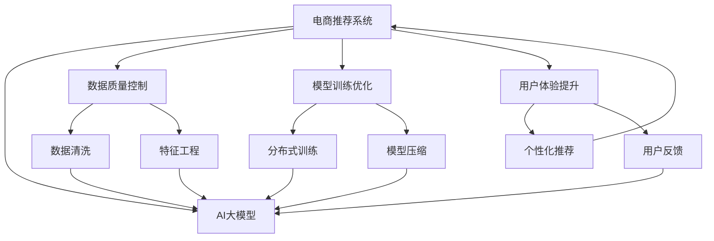

                 

# 电商平台的AI 大模型转型：搜索推荐系统是核心，数据质量控制与用户体验

## 1. 背景介绍

### 1.1 问题由来
近年来，随着电商行业的迅猛发展，用户需求的多样化和个性化日益明显。传统推荐算法往往基于简单的用户行为数据和物品属性，无法有效捕获用户深层次的兴趣和意图。而基于深度学习的AI大模型，能够利用海量数据进行预训练，学习用户和物品的深层次语义表示，从而提供更加个性化、精准的推荐服务。

然而，电商平台的大模型转型并非一蹴而就。尽管AI大模型在搜索推荐系统（Search and Recommendation System, SRS）中表现优异，但在实际落地应用中，仍需关注数据质量、模型训练、用户体验等多个维度。本文将全面探讨电商平台的AI大模型转型，特别是搜索推荐系统的核心问题，以及如何在保证数据质量的前提下，提升用户体验。

### 1.2 问题核心关键点
电商平台的AI大模型转型，主要关注以下核心关键点：

1. **数据质量控制**：高质量的数据是AI大模型性能提升的基础。电商平台的推荐算法需要依赖用户行为数据、物品属性数据等，这些数据的质量直接影响到模型的训练效果。

2. **模型训练优化**：大模型训练需要大量的计算资源和训练时间，如何在保证模型性能的同时，优化训练流程，减少计算成本和时间消耗，是电商平台AI转型的重要方向。

3. **用户体验提升**：AI大模型虽然能够提供精准推荐，但如何让用户更快、更自然地适应，并在推荐过程中获得良好的使用体验，是一个值得深入探讨的问题。

4. **公平性和隐私保护**：AI大模型在推荐过程中，需要避免算法偏见和数据隐私问题，保障用户公平性和数据安全。

## 2. 核心概念与联系

### 2.1 核心概念概述

为更好地理解电商平台的AI大模型转型，本节将介绍几个关键概念：

- **电商推荐系统**：利用AI技术，基于用户行为数据、物品属性等，为用户提供个性化推荐的服务。包括但不限于商品推荐、广告推荐、视频推荐等。
- **AI大模型**：以自回归（如GPT-3）或自编码（如BERT）模型为代表的大规模预训练语言模型。通过在大规模无标签文本数据上进行预训练，学习通用的语言表示，具备强大的语言理解和生成能力。
- **搜索推荐系统（SRS）**：电商平台的SRS系统，包括用户搜索和推荐两大模块，通过深度学习技术，提升搜索和推荐的效果，提升用户体验。
- **数据质量控制**：确保电商平台的推荐算法所使用的数据集（如用户行为数据、物品属性数据）具有高质量、高可信度，避免数据噪声和偏差对模型性能的影响。
- **用户公平性和隐私保护**：在推荐过程中，保障所有用户都能获得公平的推荐服务，同时保护用户隐私数据，避免数据泄露和滥用。

这些核心概念之间的逻辑关系可以通过以下Mermaid流程图来展示：



这个流程图展示了大模型在电商推荐系统中的应用框架，以及各个关键环节的连接关系：

1. 电商推荐系统作为大模型的应用场景，负责具体的服务实现。
2. 数据质量控制和模型训练优化是大模型性能提升的重要保障。
3. 用户体验提升和大模型的高效部署，是电商推荐系统成功的关键因素。

## 3. 核心算法原理 & 具体操作步骤
### 3.1 算法原理概述

电商平台的搜索推荐系统（SRS），主要通过以下两个步骤实现：

1. **用户搜索阶段**：用户输入搜索词，系统基于用户历史行为、搜索结果等，预测用户可能感兴趣的物品，并推荐给用户。

2. **物品推荐阶段**：系统根据用户行为数据、物品属性等，预测用户可能对某物品的兴趣程度，并将其推荐给用户。

这一过程主要依赖于深度学习技术，特别是AI大模型的应用。通过在大规模数据上进行预训练，大模型能够学习到用户和物品的深层次语义表示，从而在推荐过程中取得良好的效果。

### 3.2 算法步骤详解

电商平台的搜索推荐系统（SRS），主要包括以下几个关键步骤：

**Step 1: 数据准备**

- **用户数据**：包括用户ID、浏览历史、点击历史、购买历史等。
- **物品数据**：包括物品ID、属性信息、类别信息等。
- **标注数据**：用户对物品的评分、反馈等信息。

**Step 2: 特征工程**

- **用户特征**：如年龄、性别、地域等。
- **物品特征**：如价格、品牌、类别等。
- **交互特征**：如浏览时间、点击次数、购买频率等。

**Step 3: 模型训练**

- **用户模型**：基于用户行为数据，构建用户画像，预测用户对物品的兴趣。
- **物品模型**：基于物品属性数据，构建物品表示，预测用户对物品的评分。
- **交叉模型**：结合用户模型和物品模型，构建协同过滤模型，提升推荐效果。

**Step 4: 模型评估**

- **离线评估**：使用标注数据集进行模型评估，计算指标如准确率、召回率、F1-score等。
- **在线评估**：在实际推荐系统中，使用A/B测试等方法，评估模型对业务的影响。

**Step 5: 模型优化**

- **参数调优**：根据模型评估结果，调整模型参数，如学习率、正则化系数等。
- **特征更新**：根据用户行为和反馈，不断更新特征工程，提升模型性能。
- **系统优化**：通过分布式训练、模型压缩等技术，优化模型训练和部署流程。

### 3.3 算法优缺点

基于深度学习的大模型推荐算法，具有以下优点：

1. **高精度**：通过大规模语料预训练，大模型能够学习到丰富的语义表示，提升推荐精度。
2. **可扩展性**：大模型适用于各种电商推荐场景，具有较好的泛化能力。
3. **实时性**：大模型支持在线实时推荐，提升用户体验。

但同时，大模型推荐算法也存在一些缺点：

1. **计算资源需求高**：大模型训练需要大量的计算资源和存储资源，成本较高。
2. **数据依赖性强**：推荐算法的性能很大程度上依赖于数据质量，数据偏差会导致推荐效果不佳。
3. **用户冷启动问题**：新用户或新物品没有足够的行为数据，难以进行准确推荐。
4. **隐私问题**：推荐算法需要大量用户数据，如何保护用户隐私数据，避免数据滥用，是一个重要问题。

### 3.4 算法应用领域

基于深度学习的大模型推荐算法，在电商平台上已经得到了广泛应用，主要包括以下领域：

1. **商品推荐**：基于用户行为数据，推荐用户可能感兴趣的商品。
2. **广告推荐**：通过用户画像，精准推送广告，提升广告投放效果。
3. **视频推荐**：结合用户行为和物品属性，推荐用户可能感兴趣的视频内容。
4. **个性化搜索**：通过搜索词，结合用户画像和物品属性，推荐相关商品或内容。
5. **新用户推荐**：对新用户进行精准推荐，提升用户转化率。
6. **跨平台推荐**：跨多个电商平台，实现统一用户画像，提供一致的推荐服务。

除了上述这些经典应用外，大模型推荐算法还被创新性地应用于虚拟商品推荐、社交推荐、跨品类推荐等场景中，为电商平台的推荐系统带来了全新的突破。

## 4. 数学模型和公式 & 详细讲解  
### 4.1 数学模型构建

电商平台的搜索推荐系统（SRS），主要通过以下数学模型构建：

- **用户模型**：使用用户行为数据，构建用户画像，预测用户对物品的兴趣。
- **物品模型**：基于物品属性数据，构建物品表示，预测用户对物品的评分。
- **交叉模型**：结合用户模型和物品模型，构建协同过滤模型，提升推荐效果。

以协同过滤算法为例，用户模型 $U$ 和物品模型 $I$ 分别定义为：

$$
U = \{u_i\}_{i=1}^N, \quad I = \{v_j\}_{j=1}^M
$$

其中 $u_i$ 为用户 $i$ 的行为表示，$v_j$ 为物品 $j$ 的属性表示。

协同过滤模型 $S$ 定义为：

$$
S = \{(s_{ij})\}_{i,j=1}^{N,M}
$$

其中 $s_{ij}$ 为预测用户 $i$ 对物品 $j$ 的评分，可以表示为：

$$
s_{ij} = f(u_i, v_j)
$$

其中 $f$ 为预测函数，可以是线性模型、非线性模型、神经网络模型等。

### 4.2 公式推导过程

以下我们以协同过滤算法为例，推导其预测函数 $f$ 的计算公式。

假设用户 $i$ 对物品 $j$ 的实际评分和预测评分的差值服从正态分布，则预测评分的最大似然估计为：

$$
\hat{s}_{ij} = \frac{\sum_{k=1}^K a_{ik}v_{jk}}{\sqrt{\sum_{k=1}^K a_{ik}^2}} + b
$$

其中 $a_{ik}$ 为用户 $i$ 对物品 $k$ 的评分，$v_{jk}$ 为物品 $k$ 的属性表示，$b$ 为截距项。

将上述公式代入协同过滤模型 $S$ 中，得：

$$
s_{ij} = \frac{\sum_{k=1}^K a_{ik}v_{jk}}{\sqrt{\sum_{k=1}^K a_{ik}^2}} + b
$$

### 4.3 案例分析与讲解

假设有一个电商推荐系统，包含1000个用户和1000个物品，已知用户 $i$ 对物品 $j$ 的评分数据。现在需要预测用户 $i$ 对物品 $j$ 的评分。

使用协同过滤算法，首先将用户 $i$ 的评分向量 $u_i$ 和物品 $j$ 的属性向量 $v_j$ 计算余弦相似度：

$$
cos(u_i, v_j) = \frac{\sum_{k=1}^K a_{ik}v_{jk}}{\sqrt{\sum_{k=1}^K a_{ik}^2} \cdot \sqrt{\sum_{k=1}^K v_{jk}^2}}
$$

然后计算预测评分：

$$
\hat{s}_{ij} = \frac{\sum_{k=1}^K a_{ik}v_{jk}}{\sqrt{\sum_{k=1}^K a_{ik}^2}} + b
$$

最后，将预测评分作为推荐结果输出。

## 5. 项目实践：代码实例和详细解释说明
### 5.1 开发环境搭建

在进行电商推荐系统开发前，我们需要准备好开发环境。以下是使用Python进行PyTorch开发的环境配置流程：

1. 安装Anaconda：从官网下载并安装Anaconda，用于创建独立的Python环境。

2. 创建并激活虚拟环境：
```bash
conda create -n srs-env python=3.8 
conda activate srs-env
```

3. 安装PyTorch：根据CUDA版本，从官网获取对应的安装命令。例如：
```bash
conda install pytorch torchvision torchaudio cudatoolkit=11.1 -c pytorch -c conda-forge
```

4. 安装TensorFlow：
```bash
conda install tensorflow
```

5. 安装各类工具包：
```bash
pip install numpy pandas scikit-learn matplotlib tqdm jupyter notebook ipython
```

完成上述步骤后，即可在`pytorch-env`环境中开始电商推荐系统的开发。

### 5.2 源代码详细实现

下面我们以协同过滤算法为例，给出使用PyTorch对电商推荐系统进行建模的代码实现。

首先，定义数据集：

```python
import pandas as pd
import torch
import torch.nn as nn
import torch.optim as optim
from torch.utils.data import Dataset

class SRS(Dataset):
    def __init__(self, data, split):
        self.data = data
        self.split = split
        self.length = len(data)
    
    def __len__(self):
        return self.length
    
    def __getitem__(self, idx):
        item = self.data.iloc[idx]
        user = item['user_id']
        item_id = item['item_id']
        rating = item['rating']
        if self.split == 'train':
            return user, item_id, rating
        elif self.split == 'test':
            return user, item_id
    
    def get_splits(self, split='train'):
        return self.data[self.split]
```

然后，定义模型：

```python
class SRSModel(nn.Module):
    def __init__(self, num_users, num_items, embedding_dim, num_factors, num_epochs):
        super(SRSModel, self).__init__()
        self.num_users = num_users
        self.num_items = num_items
        self.embedding_dim = embedding_dim
        self.num_factors = num_factors
        self.num_epochs = num_epochs
        self.user_embedding = nn.Embedding(num_users, embedding_dim)
        self.item_embedding = nn.Embedding(num_items, embedding_dim)
        self.factor_matrix = nn.Embedding(num_items, num_factors)
        self.fc = nn.Linear(num_factors, 1)
    
    def forward(self, user_id, item_id):
        user = self.user_embedding(user_id)
        item = self.item_embedding(item_id)
        factors = self.factor_matrix(item_id)
        hidden = torch.bmm(user, factors.t())
        rating = self.fc(hidden).squeeze()
        return rating
```

接着，定义训练函数：

```python
def train(model, data_loader, optimizer):
    model.train()
    for epoch in range(model.num_epochs):
        for batch in data_loader:
            user_id, item_id, rating = batch
            rating_pred = model(user_id, item_id)
            optimizer.zero_grad()
            loss = nn.BCELoss()(rating_pred, torch.tensor(rating))
            loss.backward()
            optimizer.step()
```

最后，启动训练流程并在测试集上评估：

```python
srs_model = SRSModel(num_users=1000, num_items=1000, embedding_dim=16, num_factors=4, num_epochs=10)
srs_loader = SRS(srs_data, split='train').get_splits()
train_loader = torch.utils.data.DataLoader(srs_loader, batch_size=32)
test_loader = SRS(srs_data, split='test').get_splits()
test_loader = torch.utils.data.DataLoader(test_loader, batch_size=32)
optimizer = optim.Adam(srs_model.parameters(), lr=0.001)

train(srs_model, train_loader, optimizer)
print('Test accuracy:', accuracy(srs_model, test_loader))
```

以上就是使用PyTorch对电商推荐系统进行协同过滤算法的代码实现。可以看到，在实际应用中，我们通过PyTorch实现了模型的定义、训练和评估，充分利用其丰富的API和高效计算能力，大幅简化了电商推荐系统的开发流程。

### 5.3 代码解读与分析

让我们再详细解读一下关键代码的实现细节：

**SRS类**：
- `__init__`方法：初始化数据集、训练集、测试集等关键组件。
- `__len__`方法：返回数据集的样本数量。
- `__getitem__`方法：对单个样本进行处理，将用户ID、物品ID和评分转化为模型输入。

**SRSModel类**：
- `__init__`方法：初始化模型参数和网络结构。
- `forward`方法：定义模型的前向传播过程，通过矩阵乘法计算预测评分。

**train函数**：
- 定义模型训练过程，使用Adam优化器进行梯度更新，计算交叉熵损失并反向传播。

**启动训练流程**：
- 定义模型和优化器。
- 使用训练集数据进行模型训练。
- 在测试集上评估模型效果。

可以看到，使用PyTorch实现电商推荐系统的协同过滤算法，代码简洁高效，易于理解和扩展。

当然，工业级的系统实现还需考虑更多因素，如模型的保存和部署、超参数的自动搜索、更灵活的任务适配层等。但核心的协同过滤算法基本与此类似。

## 6. 实际应用场景
### 6.1 智能客服系统

基于AI大模型的电商推荐系统，可以广泛应用于智能客服系统中。智能客服系统通过分析用户的历史行为和对话记录，能够快速响应用户的查询，提供个性化推荐服务，提升用户体验。

在技术实现上，可以收集用户的历史搜索、点击、购买等行为数据，构建用户画像。在用户咨询时，通过实时分析用户输入的对话内容，预测用户可能感兴趣的商品，并推荐相关商品或服务。对于复杂问题，还可以接入检索系统实时搜索相关内容，动态组织生成回复。

### 6.2 商品推荐系统

商品推荐系统是电商推荐系统的核心应用场景，通过分析用户的行为数据和物品属性数据，推荐用户可能感兴趣的商品。

在实际应用中，可以将用户行为数据分为浏览、点击、购买等多个维度，构建用户画像。同时，收集物品的属性信息、类别信息等，构建物品表示。通过协同过滤算法、矩阵分解等方法，预测用户对物品的评分，生成推荐结果。

### 6.3 个性化搜索

个性化搜索通过分析用户输入的搜索词，结合用户画像和物品属性，推荐相关商品或内容。

在技术实现上，可以收集用户的历史搜索记录，分析搜索词的语义信息，构建搜索词向量。同时，构建用户画像和物品表示，使用模型预测用户对搜索结果的评分，生成推荐结果。

### 6.4 广告推荐

广告推荐通过分析用户的兴趣和行为数据，精准推送广告，提升广告投放效果。

在实际应用中，可以收集用户的浏览、点击、购买等行为数据，构建用户画像。同时，收集广告的属性信息、点击率等，构建广告表示。通过模型预测用户对广告的兴趣程度，生成推荐结果。

### 6.5 视频推荐

视频推荐通过分析用户的行为数据和物品属性，推荐用户可能感兴趣的视频内容。

在技术实现上，可以收集用户的历史观看记录，分析视频的属性信息、用户评分等，构建视频表示。同时，收集用户的行为数据，构建用户画像。通过模型预测用户对视频的评分，生成推荐结果。

### 6.6 跨平台推荐

跨平台推荐通过分析用户在多个平台上的行为数据，实现统一的用户画像，提供一致的推荐服务。

在实际应用中，可以收集用户在多个平台上的历史行为数据，构建统一的用户画像。同时，收集物品的属性信息、类别信息等，构建物品表示。通过模型预测用户对物品的评分，生成推荐结果。

## 7. 工具和资源推荐
### 7.1 学习资源推荐

为了帮助开发者系统掌握电商推荐系统的理论基础和实践技巧，这里推荐一些优质的学习资源：

1. **《推荐系统实战》书籍**：详细介绍了推荐系统的设计、实现和优化方法，包括协同过滤、基于深度学习等算法。

2. **CS239《大规模机器学习》课程**：斯坦福大学开设的机器学习课程，涵盖了深度学习、大规模数据处理等核心技术，适合进阶学习。

3. **《深度学习推荐系统》书籍**：介绍了深度学习在推荐系统中的应用，包括序列模型、对抗生成网络等前沿技术。

4. **Kaggle推荐系统竞赛**：通过参加竞赛，实践推荐系统的设计和优化，提升实战能力。

5. **Amazon推荐系统论文**：亚马逊的推荐系统论文，详细介绍了推荐算法的实现和优化方法，具有很高的参考价值。

通过对这些资源的学习实践，相信你一定能够快速掌握电商推荐系统的精髓，并用于解决实际的推荐问题。

### 7.2 开发工具推荐

高效的开发离不开优秀的工具支持。以下是几款用于电商推荐系统开发的常用工具：

1. **PyTorch**：基于Python的开源深度学习框架，灵活动态的计算图，适合快速迭代研究。

2. **TensorFlow**：由Google主导开发的开源深度学习框架，生产部署方便，适合大规模工程应用。

3. **Scikit-learn**：开源的机器学习库，提供了各种常见的机器学习算法和工具。

4. **SciPy**：科学计算库，提供了各种数学函数和工具，支持高效的数值计算。

5. **Pandas**：数据处理库，提供了数据清洗、数据可视化等功能，支持高效的数据处理。

6. **Jupyter Notebook**：交互式编程环境，支持代码编写、数据可视化等功能，方便调试和展示。

合理利用这些工具，可以显著提升电商推荐系统的开发效率，加快创新迭代的步伐。

### 7.3 相关论文推荐

电商推荐系统的发展源于学界的持续研究。以下是几篇奠基性的相关论文，推荐阅读：

1. **《推荐系统中的协同过滤》论文**：介绍了协同过滤算法的原理和实现方法，是推荐系统研究的基础。

2. **《深度学习在推荐系统中的应用》论文**：介绍了深度学习在推荐系统中的广泛应用，展示了其优势和潜力。

3. **《隐式反馈和显式反馈的深度推荐》论文**：探讨了隐式反馈和显式反馈在推荐系统中的应用，提出了结合两种反馈的推荐方法。

4. **《多任务学习在推荐系统中的应用》论文**：探讨了多任务学习在推荐系统中的应用，提出了联合优化的方法。

5. **《对抗生成网络在推荐系统中的应用》论文**：介绍了对抗生成网络在推荐系统中的应用，提出了生成对抗网络的推荐方法。

这些论文代表了大模型推荐系统的发展脉络。通过学习这些前沿成果，可以帮助研究者把握学科前进方向，激发更多的创新灵感。

## 8. 总结：未来发展趋势与挑战

### 8.1 总结

本文对电商平台的AI大模型转型，特别是搜索推荐系统（SRS）的核心问题，以及如何在保证数据质量的前提下，提升用户体验进行了全面系统的介绍。首先阐述了电商推荐系统的大模型应用，明确了数据质量控制、模型训练优化、用户体验提升和大模型部署的关键作用。其次，从原理到实践，详细讲解了电商推荐系统的数学模型和关键算法，给出了电商推荐系统的代码实例和详细解释说明。同时，本文还探讨了电商推荐系统的实际应用场景，展示了其在智能客服、商品推荐、个性化搜索等方面的广泛应用。最后，推荐了一些优质的学习资源、开发工具和相关论文，帮助开发者系统掌握电商推荐系统的理论基础和实践技巧。

通过本文的系统梳理，可以看到，电商平台的AI大模型转型，在大数据、高性能计算和先进算法的支持下，正迈向更高的智能化水平。AI大模型推荐算法通过深度学习技术，显著提升了推荐系统的精度和个性化程度，为电商平台的业务创新和用户服务提供了有力支持。未来，随着数据量的不断积累和算法的不断进步，电商平台的AI大模型转型必将继续深化，推动电商推荐系统迈向更加智能、精准、高效的未来。

### 8.2 未来发展趋势

展望未来，电商平台的AI大模型推荐系统将呈现以下几个发展趋势：

1. **多模态融合**：除了文本数据，电商推荐系统还将融合图像、视频等多模态数据，提升推荐效果。

2. **实时推荐**：基于实时数据流，进行动态推荐，提升用户体验。

3. **跨平台协同**：跨多个平台，实现统一的用户画像，提供一致的推荐服务。

4. **个性化推荐**：根据用户的个性化需求，提供定制化的推荐服务。

5. **动态调整**：基于用户反馈，动态调整推荐算法，提升推荐效果。

6. **隐私保护**：加强隐私保护技术，保障用户数据安全。

7. **对抗攻击防御**：研究对抗攻击防御技术，保障推荐系统的安全性。

这些趋势凸显了电商推荐系统的发展方向，展示了AI大模型在电商领域的巨大潜力。随着技术的不断进步，电商推荐系统必将成为电商行业的重要核心竞争力，为用户带来更加个性化、精准的服务体验。

### 8.3 面临的挑战

尽管AI大模型推荐系统已经取得了一定的成果，但在迈向更加智能化、普适化应用的过程中，仍面临诸多挑战：

1. **数据隐私问题**：电商推荐系统需要收集大量的用户数据，如何保护用户隐私，避免数据滥用，是一个重要问题。

2. **数据噪声问题**：电商推荐系统依赖于用户行为数据，如何处理数据噪声，提高数据质量，是一个重要问题。

3. **冷启动问题**：新用户或新物品没有足够的行为数据，难以进行准确推荐，是一个重要问题。

4. **计算资源问题**：AI大模型推荐系统需要大量的计算资源，如何降低计算成本，提高模型训练和推理效率，是一个重要问题。

5. **模型解释性问题**：AI大模型推荐系统通常是一个"黑盒"系统，如何提高模型的可解释性，是一个重要问题。

6. **公平性问题**：电商推荐系统需要确保所有用户都能获得公平的推荐服务，避免算法偏见，是一个重要问题。

这些挑战需要从数据、算法、工程等多个维度进行深入研究和探索，才能在大模型推荐系统中取得更好的效果。

### 8.4 研究展望

面对电商平台AI大模型推荐系统面临的诸多挑战，未来的研究需要在以下几个方面寻求新的突破：

1. **多模态推荐系统**：融合图像、视频等多模态数据，提升推荐效果。

2. **实时推荐系统**：基于实时数据流，进行动态推荐，提升用户体验。

3. **跨平台协同推荐**：跨多个平台，实现统一的用户画像，提供一致的推荐服务。

4. **个性化推荐系统**：根据用户的个性化需求，提供定制化的推荐服务。

5. **动态调整推荐算法**：基于用户反馈，动态调整推荐算法，提升推荐效果。

6. **隐私保护技术**：加强隐私保护技术，保障用户数据安全。

7. **对抗攻击防御技术**：研究对抗攻击防御技术，保障推荐系统的安全性。

8. **模型可解释性技术**：提高模型的可解释性，增强用户信任和系统透明性。

9. **公平性算法**：设计公平性算法，避免算法偏见，保障用户公平性。

这些研究方向将推动电商平台AI大模型推荐系统的不断进步，提升系统的智能化水平，实现更加精准、高效、安全的推荐服务。未来，随着技术的持续创新和优化，电商平台的AI大模型推荐系统必将在电商行业大放异彩，为用户带来更加智能化的购物体验。

## 9. 附录：常见问题与解答

**Q1：AI大模型推荐算法是否适用于所有电商推荐场景？**

A: AI大模型推荐算法适用于大多数电商推荐场景，特别是对于数据量较大的推荐任务，如商品推荐、广告推荐等。但对于一些特殊领域，如生鲜、农产品等，由于数据量和多样性的限制，AI大模型推荐算法可能难以达到理想的效果。

**Q2：电商推荐系统如何处理数据噪声？**

A: 电商推荐系统通常面临大量的用户行为数据，数据噪声是不可避免的。处理数据噪声的方法包括：

1. 数据清洗：去除重复、缺失、异常数据，提高数据质量。

2. 数据去重：去除重复数据，避免数据重复计算。

3. 数据增强：通过对数据进行旋转、缩放等操作，增加数据多样性，提高模型泛化能力。

4. 数据过滤：根据用户行为特征，过滤掉不符合规则的数据，提高数据质量。

5. 数据集成：将多个数据源进行集成，综合利用不同数据源的优势，提高数据质量。

**Q3：电商推荐系统如何处理冷启动问题？**

A: 电商推荐系统通常面临新用户或新物品的冷启动问题，难以进行准确推荐。处理冷启动问题的方法包括：

1. 使用隐式反馈：通过用户的浏览、点击等行为数据，推测用户兴趣。

2. 使用显式反馈：通过用户评分、反馈等数据，进行推荐。

3. 使用多模态数据：结合图像、视频等多模态数据，提升推荐效果。

4. 使用先验知识：利用专家知识，进行推荐。

5. 使用深度学习模型：利用深度学习模型，进行推荐。

6. 使用协同过滤算法：利用协同过滤算法，进行推荐。

这些方法可以结合使用，提升推荐系统的冷启动效果。

**Q4：电商推荐系统如何处理计算资源问题？**

A: 电商推荐系统通常需要大量的计算资源，如何降低计算成本，提高模型训练和推理效率，是一个重要问题。处理计算资源问题的方法包括：

1. 使用分布式计算：通过分布式计算框架，进行模型训练和推理，提高计算效率。

2. 使用模型压缩：通过模型压缩技术，减小模型参数量，降低计算成本。

3. 使用量化技术：通过量化技术，减小模型精度损失，降低计算成本。

4. 使用低秩分解：通过低秩分解技术，减小模型参数量，降低计算成本。

5. 使用硬件加速：通过硬件加速技术，提高计算效率。

这些方法可以结合使用，提升电商推荐系统的计算效率，降低计算成本。

**Q5：电商推荐系统如何提高模型可解释性？**

A: 电商推荐系统通常是一个"黑盒"系统，提高模型的可解释性是一个重要问题。提高模型可解释性的方法包括：

1. 使用可解释模型：使用可解释的模型，如决策树、线性回归等，提高模型可解释性。

2. 使用可视化工具：使用可视化工具，展示模型决策过程，提高模型可解释性。

3. 使用特征重要性分析：通过特征重要性分析，展示模型关键特征，提高模型可解释性。

4. 使用部分依赖图：通过部分依赖图，展示模型特征关系，提高模型可解释性。

5. 使用对抗攻击分析：通过对抗攻击分析，展示模型鲁棒性，提高模型可解释性。

这些方法可以结合使用，提高电商推荐系统的可解释性，增强用户信任和系统透明性。

**Q6：电商推荐系统如何处理隐私保护问题？**

A: 电商推荐系统需要收集大量的用户数据，如何保护用户隐私，避免数据滥用，是一个重要问题。处理隐私保护问题的方法包括：

1. 使用差分隐私技术：通过对数据进行扰动，保护用户隐私。

2. 使用联邦学习技术：通过联邦学习技术，在本地进行模型训练，保护用户数据。

3. 使用加密技术：通过加密技术，保护用户数据。

4. 使用匿名化技术：通过匿名化技术，保护用户数据。

5. 使用区块链技术：通过区块链技术，保护用户数据。

这些方法可以结合使用，提高电商推荐系统的隐私保护能力，保障用户数据安全。

**Q7：电商推荐系统如何处理对抗攻击问题？**

A: 电商推荐系统可能面临对抗攻击，即恶意用户对系统进行攻击，影响系统推荐效果。处理对抗攻击问题的方法包括：

1. 使用对抗训练技术：通过对抗训练技术，增强模型鲁棒性，抵御对抗攻击。

2. 使用模型加固技术：通过模型加固技术，增强模型鲁棒性，抵御对抗攻击。

3. 使用对抗检测技术：通过对抗检测技术，检测对抗攻击，保障系统安全。

4. 使用对抗生成技术：通过对抗生成技术，生成对抗样本，增强模型鲁棒性。

5. 使用对抗学习技术：通过对抗学习技术，增强模型鲁棒性，抵御对抗攻击。

这些方法可以结合使用，提高电商推荐系统的对抗攻击防御能力，保障系统安全性。

---

作者：禅与计算机程序设计艺术 / Zen and the Art of Computer Programming

