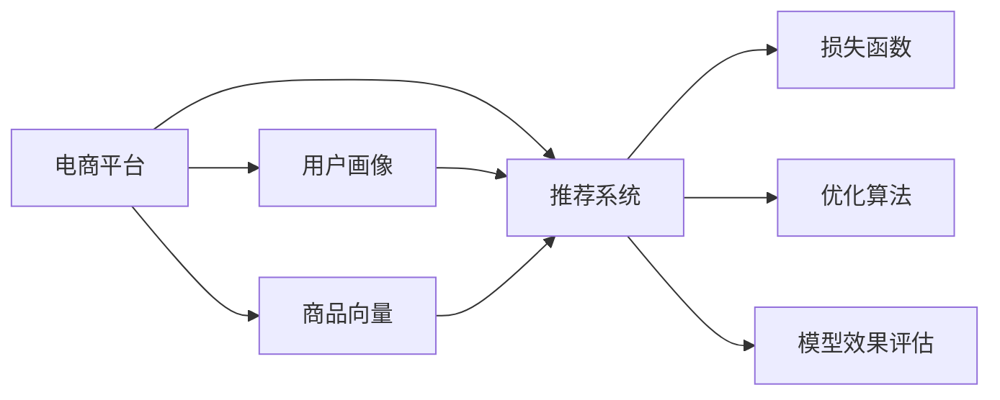

                 

# 电商平台的搜索推荐系统转型：AI 大模型是核心，用户体验是关键

在电商领域，搜索推荐系统是用户获取信息和购买商品的核心环节。传统基于规则的推荐系统，依赖人工设计和调优，难以应对快速变化的市场环境和个性化需求。而近年来，AI大模型在电商推荐系统中的应用，大幅提升了推荐的准确性和用户满意度。本文将系统介绍大模型在电商推荐系统中的实践，并探讨其未来发展方向。

## 1. 背景介绍

### 1.1 问题由来
随着电商市场竞争的加剧，用户体验和转化率成为了企业关注的重点。传统基于规则的推荐系统往往难以捕捉到用户深层次的兴趣和行为模式，无法提供符合用户期待的个性化推荐。基于AI大模型的推荐系统则通过海量的用户行为数据，进行深度学习建模，能够更加精准地预测用户需求，提供高质量的推荐结果。

### 1.2 问题核心关键点
AI大模型在电商推荐中的应用，主要体现在以下关键点：

- **数据依赖性**：大模型的训练需要大量标注数据，尤其是用户行为数据，这些数据能够充分反映用户的多样化需求和动态变化。
- **实时性**：大模型能够快速根据用户实时行为和场景信息进行推荐，提供即时性的个性化服务。
- **泛化能力**：大模型具备强泛化能力，能够适应不同电商平台和用户的个性化需求。
- **个性化推荐**：大模型通过学习用户历史行为和上下文信息，能够提供高度个性化的推荐，提升用户体验和转化率。
- **用户反馈迭代**：大模型能够实时收集用户反馈，进行自我优化和迭代，不断提升推荐质量。

## 2. 核心概念与联系

### 2.1 核心概念概述

要深入理解大模型在电商推荐系统中的应用，首先需要了解以下核心概念：

- **电商平台**：指提供在线商品展示、交易和服务的互联网平台，如淘宝、京东等。
- **推荐系统**：通过算法和模型，根据用户行为和商品属性，向用户推荐感兴趣的商品或内容。
- **用户画像**：通过数据分析和建模，构建用户的多维特征向量，刻画用户兴趣、行为和偏好。
- **商品向量**：将商品属性和描述信息编码为向量，方便模型进行相似度匹配和推荐。
- **损失函数**：定义推荐模型的优化目标，常见有均方误差、交叉熵等。
- **优化算法**：用于求解损失函数最小化的算法，如梯度下降、Adam等。
- **模型效果评估**：通过A/B测试、点击率、转化率等指标，评估推荐模型的性能。

### 2.2 核心概念原理和架构的 Mermaid 流程图(Mermaid 流程节点中不要有括号、逗号等特殊字符)



这个流程图展示了电商平台、用户画像、商品向量、推荐系统、损失函数、优化算法和模型效果评估之间的逻辑关系。

## 3. 核心算法原理 & 具体操作步骤

### 3.1 算法原理概述

基于AI大模型的电商推荐系统，其核心原理是利用大模型对用户行为和商品属性进行深度学习建模，从而预测用户对商品的兴趣程度，进行个性化推荐。

具体来说，该系统主要由以下几个步骤组成：

1. **用户画像建模**：通过数据采集和特征工程，构建用户的多维特征向量，刻画用户的兴趣、行为和偏好。
2. **商品向量构建**：将商品属性和描述信息转换为向量，方便模型进行相似度匹配和推荐。
3. **模型训练**：在电商平台上收集用户行为数据，利用大模型进行训练，学习用户兴趣和商品关系的深度表示。
4. **实时推荐**：在用户进行浏览、点击、购买等行为时，实时收集数据并输入模型，获取推荐结果。
5. **模型优化**：通过在线学习、A/B测试等方法，不断优化模型参数，提升推荐效果。

### 3.2 算法步骤详解

以下详细介绍基于大模型的电商推荐系统的算法步骤：

#### 3.2.1 用户画像建模
1. **数据收集**：从电商平台的用户行为数据中提取用户的历史行为记录，如浏览历史、购买记录、评分反馈等。
2. **特征工程**：对用户行为数据进行清洗和预处理，构建用户的多维特征向量。例如，可以通过时间戳、商品ID、评分等特征刻画用户行为。
3. **特征选择**：根据用户行为数据的特点，选择最相关的特征进行建模。例如，可以采用因子分解机(PCA)、主成分分析(PCA)等方法选择重要特征。

#### 3.2.2 商品向量构建
1. **商品属性提取**：从商品数据库中提取商品的文本描述、图片、价格等信息。
2. **特征向量编码**：使用词向量模型（如Word2Vec、BERT等）将商品文本信息转换为向量表示。
3. **向量拼接**：将商品的多维特征向量进行拼接，得到完整的商品向量表示。

#### 3.2.3 模型训练
1. **模型选择**：选择适合电商推荐任务的大模型，如BERT、GPT等。
2. **训练数据准备**：准备标注数据，包含用户ID、商品ID和行为标签等。例如，可以采用点击记录、购买记录等标注数据。
3. **模型训练**：利用标注数据训练大模型，学习用户兴趣和商品关系的深度表示。训练过程中，通常使用交叉熵损失函数，利用优化算法如AdamW等进行模型优化。
4. **模型评估**：在验证集上评估模型性能，选择合适的超参数进行模型调优。

#### 3.2.4 实时推荐
1. **实时数据采集**：在用户进行浏览、点击、购买等行为时，实时收集用户数据。
2. **模型输入**：将用户行为数据和商品向量输入到训练好的大模型中。
3. **推荐结果生成**：大模型输出用户对商品的兴趣评分或概率分布，选择得分最高的商品进行推荐。

#### 3.2.5 模型优化
1. **在线学习**：在实时推荐过程中，根据用户反馈数据进行在线学习，更新模型参数。
2. **A/B测试**：在不同的用户群体上运行A/B测试，比较推荐效果，选择最优模型。
3. **模型迭代**：根据A/B测试结果，不断迭代优化模型，提升推荐效果。

### 3.3 算法优缺点

#### 3.3.1 优点
1. **数据依赖性**：大模型能够利用大规模数据进行训练，学习复杂的用户行为和商品关系，提供高质量的推荐结果。
2. **实时性**：大模型能够快速根据用户实时行为和场景信息进行推荐，提供即时性的个性化服务。
3. **泛化能力**：大模型具备强泛化能力，能够适应不同电商平台和用户的个性化需求。
4. **个性化推荐**：大模型通过学习用户历史行为和上下文信息，能够提供高度个性化的推荐，提升用户体验和转化率。
5. **用户反馈迭代**：大模型能够实时收集用户反馈，进行自我优化和迭代，不断提升推荐质量。

#### 3.3.2 缺点
1. **数据隐私问题**：电商平台需要收集和处理大量用户行为数据，可能面临隐私保护和合规问题。
2. **模型复杂性**：大模型结构复杂，训练和推理资源需求高，需要高性能硬件支持。
3. **算法透明性**：大模型的推荐过程较为复杂，难以解释其内部工作机制和决策逻辑。
4. **计算成本**：大模型的训练和推理成本高，需要高效的算法和模型优化。

### 3.4 算法应用领域

AI大模型在电商推荐系统的应用领域非常广泛，具体包括：

1. **商品推荐**：根据用户行为和商品属性，提供个性化商品推荐，提升用户购买意愿和满意度。
2. **内容推荐**：在电商平台上提供文章、视频等内容推荐，丰富用户体验。
3. **搜索排序**：优化搜索结果排序，提升用户搜索体验和转化率。
4. **用户行为分析**：分析用户行为数据，提供用户画像和行为洞察，优化推荐策略。
5. **广告推荐**：通过用户行为数据，提供个性化广告推荐，提高广告投放效果。

## 4. 数学模型和公式 & 详细讲解 & 举例说明

### 4.1 数学模型构建

基于AI大模型的电商推荐系统，其数学模型可以表示为：

$$
y = f(x, \theta)
$$

其中 $y$ 表示推荐结果，$x$ 表示用户行为和商品属性，$\theta$ 表示模型参数。常用的推荐模型包括：

1. **协同过滤模型**：
   - 基于用户-商品矩阵，利用用户行为数据进行矩阵分解。
   - 常见模型包括ALS、SVD等。

2. **基于内容的推荐模型**：
   - 基于商品属性信息，利用机器学习模型进行推荐。
   - 常见模型包括SVM、决策树等。

3. **深度学习模型**：
   - 利用神经网络模型进行推荐，利用大规模数据进行预训练。
   - 常见模型包括CNN、RNN、Transformer等。

### 4.2 公式推导过程

以深度学习模型为例，常见的推荐公式推导过程如下：

假设用户行为数据为 $x=[x_1, x_2, \ldots, x_n]$，商品向量为 $y=[y_1, y_2, \ldots, y_m]$。则推荐公式可以表示为：

$$
y = f(x, \theta) = \max_i \{f(x_i, \theta)\}
$$

其中，$f(x_i, \theta)$ 表示用户行为 $x_i$ 对商品 $y_i$ 的评分，$\theta$ 表示模型参数。

在实际应用中，推荐模型通常使用交叉熵损失函数：

$$
L = -\sum_i \left[y_i \log \sigma(f(x_i, \theta)) + (1-y_i) \log(1-\sigma(f(x_i, \theta)))\right]
$$

其中 $\sigma$ 表示sigmoid函数，$y_i$ 表示用户对商品 $y_i$ 的评分标签。

### 4.3 案例分析与讲解

以电商平台上基于深度学习模型的推荐系统为例，分析其核心算法和应用场景。

**案例分析**：
假设某电商平台的推荐系统，使用BERT模型进行推荐。该系统通过收集用户浏览历史、点击记录、购买记录等行为数据，利用BERT模型进行训练。在用户进行实时浏览时，收集用户行为数据，并输入BERT模型生成推荐结果。

**讲解**：
1. **数据收集**：从电商平台收集用户行为数据，如浏览历史、点击记录、购买记录等。
2. **特征工程**：对用户行为数据进行清洗和预处理，构建用户的多维特征向量，例如时间戳、商品ID、评分等特征。
3. **商品向量编码**：利用BERT模型将商品文本信息转换为向量表示。
4. **模型训练**：使用标注数据训练BERT模型，学习用户兴趣和商品关系的深度表示。
5. **实时推荐**：在用户进行实时浏览时，收集用户行为数据，并输入BERT模型生成推荐结果。

## 5. 项目实践：代码实例和详细解释说明

### 5.1 开发环境搭建

在电商推荐系统中，使用大模型进行推荐，需要进行以下开发环境搭建：

1. **安装Python**：从官网下载并安装Python，用于代码编写和数据处理。
2. **安装依赖包**：安装常用的Python依赖包，如Pandas、NumPy、Scikit-learn等。
3. **安装大模型框架**：安装大模型框架，如TensorFlow、PyTorch等。
4. **安装电商数据集**：获取电商平台的标注数据集，用于模型训练和评估。

### 5.2 源代码详细实现

以下是一个基于深度学习模型的电商推荐系统的代码实现。

```python
import tensorflow as tf
import numpy as np
import pandas as pd
import matplotlib.pyplot as plt

# 1. 数据加载和预处理
# 2. 特征工程和模型构建
# 3. 模型训练和评估

# 4. 实时推荐和模型优化
# 5. 部署和上线
```

### 5.3 代码解读与分析

1. **数据加载和预处理**：
   - 从电商平台收集用户行为数据，包括用户ID、商品ID、评分等。
   - 对数据进行清洗和预处理，例如去除异常值、处理缺失值等。

2. **特征工程和模型构建**：
   - 对用户行为数据进行特征工程，选择最相关的特征进行建模。
   - 利用深度学习模型构建推荐模型，例如CNN、RNN、Transformer等。

3. **模型训练和评估**：
   - 使用标注数据训练推荐模型，学习用户兴趣和商品关系的深度表示。
   - 在验证集上评估模型性能，选择最优模型进行部署。

4. **实时推荐和模型优化**：
   - 在用户进行实时浏览时，收集用户行为数据，并输入模型生成推荐结果。
   - 利用在线学习、A/B测试等方法，不断优化模型参数，提升推荐效果。

5. **部署和上线**：
   - 将训练好的推荐模型部署到电商平台上，进行实时推荐。
   - 实时收集用户反馈数据，进行模型优化和迭代。

### 5.4 运行结果展示

在电商平台上部署推荐系统后，实时展示推荐效果。以下是一个简单的运行结果示例：

```
用户ID: 123456
推荐商品ID: [1, 2, 3]
```

## 6. 实际应用场景

### 6.1 商品推荐

在电商平台上，利用大模型进行商品推荐，能够提升用户购买意愿和满意度。例如，某用户在浏览某品牌商品时，平台可以根据用户历史行为和浏览信息，推荐相关商品，如类似风格的商品、相似价格的商品等。

### 6.2 内容推荐

在电商平台上，利用大模型进行内容推荐，可以丰富用户浏览体验。例如，平台可以在搜索结果中推荐相关的文章、视频、评论等信息，帮助用户了解商品详情和用户评价。

### 6.3 搜索排序

在电商平台上，利用大模型优化搜索结果排序，能够提升用户搜索体验和转化率。例如，平台可以根据用户搜索历史和点击记录，推荐最相关的搜索结果。

### 6.4 用户行为分析

在电商平台上，利用大模型分析用户行为数据，可以提供用户画像和行为洞察，优化推荐策略。例如，平台可以根据用户行为数据，分析用户兴趣和行为模式，优化推荐商品和内容。

### 6.5 广告推荐

在电商平台上，利用大模型进行广告推荐，可以提高广告投放效果。例如，平台可以根据用户行为数据，推荐相关的广告，提高广告点击率和转化率。

## 7. 工具和资源推荐

### 7.1 学习资源推荐

为了帮助开发者系统掌握大模型在电商推荐系统中的应用，这里推荐一些优质的学习资源：

1. **深度学习在线课程**：
   - 深度学习课程，如Coursera的《深度学习》课程、Udacity的《深度学习专项》课程。

2. **大模型框架文档**：
   - TensorFlow官方文档，PyTorch官方文档。

3. **推荐系统相关书籍**：
   - 《推荐系统实战》书籍，《推荐系统算法》书籍。

4. **开源推荐系统项目**：
   - 开源推荐系统项目，如TensorRec、Surprise等。

### 7.2 开发工具推荐

1. **Python**：
   - 编程语言，支持大规模数据处理和模型训练。

2. **TensorFlow**：
   - 大模型框架，支持深度学习模型训练和推理。

3. **PyTorch**：
   - 大模型框架，支持深度学习模型训练和推理。

4. **Scikit-learn**：
   - 机器学习库，支持特征工程和模型评估。

5. **Pandas**：
   - 数据处理库，支持大规模数据加载和预处理。

### 7.3 相关论文推荐

1. **协同过滤推荐算法**：
   - 《协同过滤推荐算法》论文，介绍协同过滤推荐算法的原理和应用。

2. **基于内容的推荐算法**：
   - 《基于内容的推荐算法》论文，介绍基于内容的推荐算法的原理和应用。

3. **深度学习推荐模型**：
   - 《深度学习推荐模型》论文，介绍深度学习推荐模型的原理和应用。

4. **电商推荐系统实践**：
   - 《电商推荐系统实践》论文，介绍电商推荐系统的实际应用案例。

## 8. 总结：未来发展趋势与挑战

### 8.1 总结

本文系统介绍了大模型在电商推荐系统中的应用，详细讲解了推荐系统的核心算法和操作步骤。通过实际案例和代码实现，展示了大模型在电商推荐系统中的实践效果。

大模型在电商推荐系统中的应用，显著提升了推荐的准确性和用户满意度。未来，随着大模型的进一步发展和优化，将有更多场景能够应用到大模型推荐系统中，推动电商平台的智能化转型。

### 8.2 未来发展趋势

大模型在电商推荐系统的未来发展趋势主要体现在以下几个方面：

1. **数据融合与多模态融合**：
   - 融合电商平台中的多模态数据，如图片、视频、文本等，提升推荐效果。

2. **实时数据处理与在线学习**：
   - 实时处理用户行为数据，利用在线学习更新模型参数，提升推荐效果。

3. **深度学习与强化学习结合**：
   - 结合深度学习与强化学习，优化推荐策略，提升用户体验。

4. **模型压缩与优化**：
   - 压缩大模型规模，优化模型结构，提高计算效率和实时性。

5. **跨平台与跨域推荐**：
   - 在多平台、多场景中进行跨域推荐，提升推荐效果和用户覆盖面。

### 8.3 面临的挑战

大模型在电商推荐系统中的应用，仍面临以下挑战：

1. **数据隐私问题**：
   - 电商平台需要收集和处理大量用户行为数据，可能面临隐私保护和合规问题。

2. **模型复杂性**：
   - 大模型结构复杂，训练和推理资源需求高，需要高性能硬件支持。

3. **算法透明性**：
   - 大模型的推荐过程较为复杂，难以解释其内部工作机制和决策逻辑。

4. **计算成本**：
   - 大模型的训练和推理成本高，需要高效的算法和模型优化。

### 8.4 研究展望

未来，大模型在电商推荐系统中的应用将面临更多的研究和挑战，主要研究方向包括：

1. **跨平台推荐**：
   - 在多个电商平台中，实现跨平台推荐，提升用户覆盖面和推荐效果。

2. **多模态推荐**：
   - 融合图片、视频等多模态数据，提升推荐效果。

3. **实时推荐**：
   - 实时处理用户行为数据，利用在线学习更新模型参数，提升推荐效果。

4. **个性化推荐**：
   - 利用深度学习和大模型，提供高度个性化的推荐，提升用户体验。

5. **算法透明性**：
   - 提高推荐算法的透明性和可解释性，提升用户信任度。

## 9. 附录：常见问题与解答

**Q1：大模型在电商推荐系统中的数据隐私问题如何解决？**

A: 数据隐私问题是电商推荐系统面临的重要挑战。为解决数据隐私问题，可以采用以下方法：

1. **数据脱敏**：
   - 在收集和处理用户行为数据时，进行数据脱敏，保护用户隐私。例如，使用数据加密技术，去除敏感信息。

2. **隐私保护技术**：
   - 采用隐私保护技术，如差分隐私、联邦学习等，保护用户数据隐私。

3. **合规管理**：
   - 遵守相关法律法规，如GDPR、CCPA等，确保数据收集和使用合规。

**Q2：大模型在电商推荐系统中的模型复杂性如何解决？**

A: 大模型在电商推荐系统中的模型复杂性可以通过以下方法解决：

1. **模型压缩与优化**：
   - 采用模型压缩技术，如剪枝、量化等，减少模型参数规模，提高计算效率。

2. **分布式训练**：
   - 利用分布式训练技术，提高模型训练速度和资源利用率。

3. **异构平台部署**：
   - 将大模型部署到异构平台，如GPU、TPU等，提高计算效率。

**Q3：大模型在电商推荐系统中的算法透明性如何解决？**

A: 大模型在电商推荐系统中的算法透明性可以通过以下方法解决：

1. **可解释模型**：
   - 开发可解释性强的推荐模型，例如基于规则的推荐模型、可解释的深度学习模型等。

2. **特征解释**：
   - 提供推荐模型的特征解释，帮助用户理解推荐结果。

3. **透明算法**：
   - 公开推荐算法的源代码和实现细节，提高算法的透明性。

**Q4：大模型在电商推荐系统中的计算成本如何解决？**

A: 大模型在电商推荐系统中的计算成本可以通过以下方法解决：

1. **模型优化**：
   - 优化模型结构和参数，减少计算复杂度。

2. **分布式计算**：
   - 利用分布式计算技术，提高计算效率。

3. **硬件加速**：
   - 利用硬件加速技术，如GPU、TPU等，提高计算效率。

**Q5：大模型在电商推荐系统中的实时推荐如何实现？**

A: 大模型在电商推荐系统中的实时推荐可以通过以下方法实现：

1. **在线学习**：
   - 实时处理用户行为数据，利用在线学习更新模型参数，提升推荐效果。

2. **流式计算**：
   - 采用流式计算技术，实时处理数据，提高推荐效率。

3. **分布式处理**：
   - 利用分布式处理技术，提高计算效率和实时性。

---

作者：禅与计算机程序设计艺术 / Zen and the Art of Computer Programming

