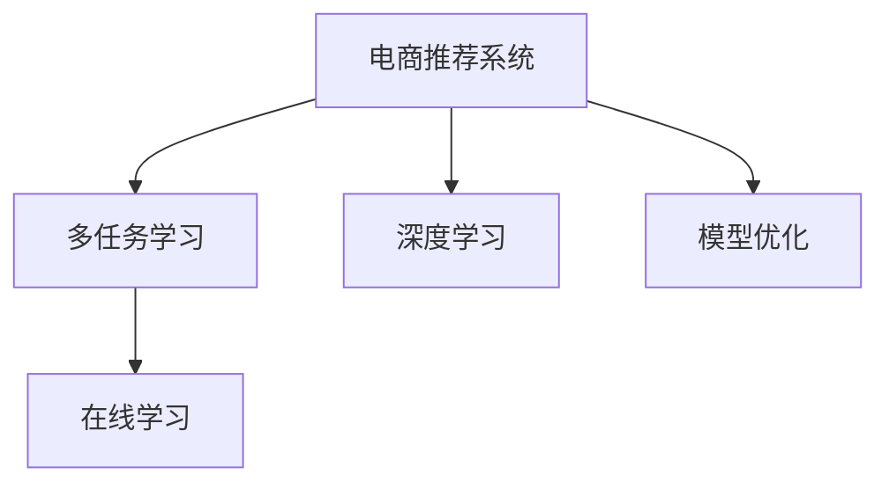

                 

# 电商推荐系统中的多任务学习模型

> 关键词：电商推荐系统,多任务学习,深度学习,模型优化,在线学习,用户行为预测

## 1. 背景介绍

在电商领域，推荐系统已经成为提升用户体验和增加销售额的重要工具。传统的推荐系统基于协同过滤、基于内容的推荐等方法，可以有效地为用户推荐感兴趣的商品。但这些方法往往依赖于历史数据，难以在新用户和冷启动场景下发挥作用。近年来，随着深度学习技术的发展，基于深度神经网络的推荐模型逐渐成为推荐系统的核心。这些模型通过大规模数据预训练，能够捕捉用户行为和商品属性的复杂关系，实现冷启动和推荐多样化。然而，在电商推荐任务中，单一的推荐模型难以兼顾用户行为的多样性和丰富性，难以满足不同用户的个性化需求。为解决这一问题，多任务学习模型被提出并应用于电商推荐系统，实现多任务协同优化，进一步提升推荐效果。

## 2. 核心概念与联系

### 2.1 核心概念概述

为更好地理解电商推荐系统中的多任务学习模型，本节将介绍几个密切相关的核心概念：

- **电商推荐系统(Online Recommendation System, ORS)**：基于用户行为数据，为用户推荐感兴趣的商品的系统。电商推荐系统需要高效准确地推荐商品，提升用户体验和销量。

- **多任务学习(Multi-task Learning, MTL)**：一种同时学习多个相关任务的学习范式，各个任务可以共享特征表示，优化模型性能。在电商推荐系统中，多任务学习可同时优化商品推荐和用户行为预测等多个任务。

- **深度学习(Deep Learning, DL)**：一种通过多层神经网络实现数据抽象和建模的技术，可用于电商推荐系统的商品特征提取和用户行为预测。

- **模型优化(Model Optimization)**：通过优化算法更新模型参数，提高模型性能的过程。电商推荐系统中的深度学习模型通常需要优化以获得更好的推荐效果。

- **在线学习(Online Learning)**：一种边数据边学习的技术，适合电商推荐系统中的实时推荐。在线学习模型可以通过不断接收用户反馈，逐步优化推荐效果。

这些核心概念之间的逻辑关系可以通过以下Mermaid流程图来展示：



这个流程图展示了大模型推荐系统中的核心概念及其之间的关系：

1. 电商推荐系统通过深度学习模型进行商品推荐和用户行为预测。
2. 多任务学习可以在电商推荐系统中优化多个相关任务，如商品推荐、用户行为预测等。
3. 深度学习通过多层神经网络实现数据抽象和建模，适用于电商推荐系统中的特征提取和行为预测。
4. 模型优化通过优化算法更新模型参数，提高推荐效果。
5. 在线学习适合电商推荐系统中的实时推荐，能够通过不断接收用户反馈逐步优化推荐效果。

## 3. 核心算法原理 & 具体操作步骤

### 3.1 算法原理概述

电商推荐系统中的多任务学习模型，通常基于深度神经网络进行建模。假设一个电商推荐系统同时优化商品推荐任务和用户行为预测任务。商品推荐任务的输出为商品ID，用户行为预测任务的输出为用户行为标签（如点击、购买等）。模型的目标是同时最小化两个任务在训练集上的损失函数，即：

$$
\min_{\theta} \left( \mathcal{L}_r + \lambda \mathcal{L}_u \right)
$$

其中 $\mathcal{L}_r$ 和 $\mathcal{L}_u$ 分别为商品推荐任务和用户行为预测任务的损失函数，$\lambda$ 为正则化系数。

电商推荐系统中的多任务学习模型通常采用联合训练的方式，同时优化两个任务的损失函数。联合训练可以通过在每个epoch结束时将两个任务的损失函数加权求和，从而实现多任务协同优化。

### 3.2 算法步骤详解

电商推荐系统中的多任务学习模型的具体训练步骤如下：

**Step 1: 准备数据集**

电商推荐系统中的多任务学习模型需要准备商品推荐数据集和用户行为数据集。商品推荐数据集应包含用户ID、商品ID、点击行为等标注数据，用户行为数据集应包含用户ID、时间戳、行为标签等标注数据。

**Step 2: 设计网络结构**

电商推荐系统中的多任务学习模型通常采用共享表示的网络结构，如自编码器、多层感知器等。共享表示可以降低模型参数量，提高训练效率和泛化能力。

**Step 3: 定义损失函数**

电商推荐系统中的多任务学习模型通常采用联合损失函数，将两个任务的损失函数加权求和。商品推荐任务的损失函数一般采用交叉熵损失，用户行为预测任务的损失函数一般采用二分类交叉熵损失。

**Step 4: 设置超参数**

电商推荐系统中的多任务学习模型需要设置优化器、学习率、正则化系数等超参数。常见的优化器包括Adam、SGD等，学习率一般设定在0.001左右，正则化系数一般设定在0.001左右。

**Step 5: 执行联合训练**

电商推荐系统中的多任务学习模型通常采用联合训练的方式，每个epoch中同时优化两个任务的损失函数。联合训练时，将两个任务的损失函数加权求和，并通过优化器更新模型参数。

**Step 6: 评估和反馈**

电商推荐系统中的多任务学习模型在每个epoch结束时，分别在商品推荐数据集和用户行为数据集上进行评估。评估结果可以作为模型更新的反馈，用于后续的优化。

### 3.3 算法优缺点

电商推荐系统中的多任务学习模型具有以下优点：

1. **协同优化**：多个任务可以共享特征表示，提高模型泛化能力和性能。
2. **减少参数量**：共享表示可以降低模型参数量，提高训练效率和泛化能力。
3. **提高预测准确率**：通过联合训练，商品推荐和用户行为预测任务可以互相补充，提高预测准确率。
4. **适应性强**：电商推荐系统中的多任务学习模型可以根据用户行为数据的变化，不断调整模型参数，适应新的用户需求。

同时，电商推荐系统中的多任务学习模型也存在一定的局限性：

1. **计算复杂度高**：多任务学习模型通常需要同时优化多个任务的损失函数，计算复杂度较高。
2. **数据依赖性强**：电商推荐系统中的多任务学习模型对数据依赖性强，需要足够的标注数据才能获得好的效果。
3. **模型稳定性差**：电商推荐系统中的多任务学习模型在面对极端数据时，可能出现稳定性问题，导致推荐效果下降。

尽管存在这些局限性，但就目前而言，电商推荐系统中的多任务学习模型仍是一种高效的推荐方式。未来相关研究的重点在于如何进一步降低计算复杂度，提高模型稳定性，并扩展到更多电商推荐任务中。

### 3.4 算法应用领域

电商推荐系统中的多任务学习模型主要应用于以下几个领域：

- **商品推荐**：通过联合训练优化商品推荐任务，为用户推荐感兴趣的商品。
- **用户行为预测**：通过联合训练优化用户行为预测任务，预测用户的点击、购买等行为。
- **点击率预测**：通过联合训练优化点击率预测任务，预测用户的点击行为。
- **复购率预测**：通过联合训练优化复购率预测任务，预测用户的复购行为。
- **推荐效果评估**：通过联合训练优化推荐效果评估任务，评估推荐系统的性能。

除了上述这些经典任务外，电商推荐系统中的多任务学习模型还被创新性地应用到更多场景中，如用户流失预测、商品召回等，为电商推荐系统带来了全新的突破。

## 4. 数学模型和公式 & 详细讲解 & 举例说明

### 4.1 数学模型构建

电商推荐系统中的多任务学习模型通常采用联合训练的方式，同时优化商品推荐任务和用户行为预测任务。假设商品推荐任务的输入为 $x$，输出为 $y_r$，用户行为预测任务的输入为 $x$，输出为 $y_u$。模型的目标是同时最小化两个任务在训练集上的损失函数，即：

$$
\min_{\theta} \left( \mathcal{L}_r + \lambda \mathcal{L}_u \right)
$$

其中 $\mathcal{L}_r$ 和 $\mathcal{L}_u$ 分别为商品推荐任务和用户行为预测任务的损失函数，$\lambda$ 为正则化系数。

### 4.2 公式推导过程

电商推荐系统中的多任务学习模型通常采用联合训练的方式，每个epoch中同时优化两个任务的损失函数。联合训练时，将两个任务的损失函数加权求和，并通过优化器更新模型参数。假设商品推荐任务和用户行为预测任务分别由 $f_r(x)$ 和 $f_u(x)$ 表示，则联合训练的优化目标为：

$$
\min_{\theta} \left( \mathcal{L}_r(f_r(x), y_r) + \lambda \mathcal{L}_u(f_u(x), y_u) \right)
$$

其中 $\mathcal{L}_r(f_r(x), y_r)$ 为商品推荐任务的交叉熵损失，$\mathcal{L}_u(f_u(x), y_u)$ 为用户行为预测任务的交叉熵损失。

假设模型参数 $\theta$ 包括共享的权重 $W$ 和任务特定的权重 $w_r$ 和 $w_u$，则模型可以表示为：

$$
f_r(x) = \sigma(W f(x) + w_r)
$$

$$
f_u(x) = \sigma(W f(x) + w_u)
$$

其中 $f(x)$ 为共享特征提取器，$\sigma$ 为激活函数。

联合训练的优化目标可以表示为：

$$
\min_{W, w_r, w_u} \left( \mathcal{L}_r(f_r(x), y_r) + \lambda \mathcal{L}_u(f_u(x), y_u) \right)
$$

联合训练的优化算法一般采用随机梯度下降(SGD)或Adam等，更新模型参数为：

$$
W \leftarrow W - \eta \nabla_W \left( \mathcal{L}_r(f_r(x), y_r) + \lambda \mathcal{L}_u(f_u(x), y_u) \right)
$$

$$
w_r \leftarrow w_r - \eta \nabla_{w_r} \left( \mathcal{L}_r(f_r(x), y_r) + \lambda \mathcal{L}_u(f_u(x), y_u) \right)
$$

$$
w_u \leftarrow w_u - \eta \nabla_{w_u} \left( \mathcal{L}_r(f_r(x), y_r) + \lambda \mathcal{L}_u(f_u(x), y_u) \right)
$$

### 4.3 案例分析与讲解

假设电商推荐系统中的多任务学习模型同时优化商品推荐和用户行为预测任务。商品推荐任务的目标是为用户推荐感兴趣的商品，用户行为预测任务的目标是预测用户的点击行为。

**数据准备**：电商推荐系统中的多任务学习模型需要准备商品推荐数据集和用户行为数据集。商品推荐数据集应包含用户ID、商品ID、点击行为等标注数据，用户行为数据集应包含用户ID、时间戳、行为标签等标注数据。

**网络设计**：电商推荐系统中的多任务学习模型通常采用共享表示的网络结构，如自编码器、多层感知器等。共享表示可以降低模型参数量，提高训练效率和泛化能力。

**损失函数**：电商推荐系统中的多任务学习模型通常采用联合损失函数，将两个任务的损失函数加权求和。商品推荐任务的损失函数一般采用交叉熵损失，用户行为预测任务的损失函数一般采用二分类交叉熵损失。

**超参数设置**：电商推荐系统中的多任务学习模型需要设置优化器、学习率、正则化系数等超参数。常见的优化器包括Adam、SGD等，学习率一般设定在0.001左右，正则化系数一般设定在0.001左右。

**联合训练**：电商推荐系统中的多任务学习模型通常采用联合训练的方式，每个epoch中同时优化两个任务的损失函数。联合训练时，将两个任务的损失函数加权求和，并通过优化器更新模型参数。

**评估和反馈**：电商推荐系统中的多任务学习模型在每个epoch结束时，分别在商品推荐数据集和用户行为数据集上进行评估。评估结果可以作为模型更新的反馈，用于后续的优化。

## 5. 项目实践：代码实例和详细解释说明

### 5.1 开发环境搭建

在进行电商推荐系统中的多任务学习模型开发前，我们需要准备好开发环境。以下是使用Python进行TensorFlow开发的环境配置流程：

1. 安装Anaconda：从官网下载并安装Anaconda，用于创建独立的Python环境。

2. 创建并激活虚拟环境：
```bash
conda create -n tf-env python=3.8 
conda activate tf-env
```

3. 安装TensorFlow：根据CUDA版本，从官网获取对应的安装命令。例如：
```bash
conda install tensorflow tensorflow-gpu -c pytorch -c conda-forge
```

4. 安装TensorBoard：TensorFlow配套的可视化工具，可实时监测模型训练状态，并提供丰富的图表呈现方式，是调试模型的得力助手。
```bash
pip install tensorboard
```

5. 安装Keras：TensorFlow的高级API，方便构建神经网络模型。
```bash
pip install keras
```

6. 安装Scikit-learn：用于数据预处理和模型评估。
```bash
pip install scikit-learn
```

完成上述步骤后，即可在`tf-env`环境中开始电商推荐系统中的多任务学习模型的开发实践。

### 5.2 源代码详细实现

下面我们以电商推荐系统中的多任务学习模型为例，给出使用TensorFlow和Keras实现商品推荐和用户行为预测的代码实现。

首先，定义数据预处理函数：

```python
import pandas as pd
from sklearn.preprocessing import StandardScaler
from sklearn.model_selection import train_test_split

def load_data(data_path):
    data = pd.read_csv(data_path)
    features = data[['item_id', 'user_id', 'timestamp']]
    labels = data[['click']]
    features_train, features_test, labels_train, labels_test = train_test_split(features, labels, test_size=0.2)
    return features_train, features_test, labels_train, labels_test

def preprocess_data(features, labels):
    features = StandardScaler().fit_transform(features)
    labels = labels.to_numpy()
    return features, labels
```

然后，定义多任务学习模型的网络结构：

```python
from tensorflow.keras.models import Model
from tensorflow.keras.layers import Input, Dense, Embedding, Dropout

def build_model(input_dim, output_dim, embedding_dim, num_tasks):
    input = Input(shape=(input_dim,))
    embedding = Embedding(input_dim, embedding_dim)(input)
    features = Dense(128, activation='relu')(embedding)
    features = Dropout(0.5)(features)
    tasks = []
    for i in range(num_tasks):
        task = Dense(output_dim[i], activation='sigmoid')(features)
        tasks.append(task)
    model = Model(input, tasks)
    return model

def compile_model(model, num_tasks, optimizer='adam', learning_rate=0.001, loss_weights=None):
    if loss_weights is None:
        loss_weights = [1.0] * num_tasks
    model.compile(optimizer=optimizer, loss='sparse_categorical_crossentropy', loss_weights=loss_weights)
    model.summary()
```

接着，定义多任务学习模型的训练函数：

```python
def train_model(model, features_train, labels_train, features_test, labels_test, num_epochs=10, batch_size=32):
    model.fit(features_train, labels_train, epochs=num_epochs, batch_size=batch_size, validation_data=(features_test, labels_test))
    print('Train loss:', model.evaluate(features_test, labels_test)[0])
    return model
```

最后，启动训练流程：

```python
# 数据准备
features_train, features_test, labels_train, labels_test = load_data('data.csv')

# 模型构建
num_tasks = 2
input_dim = 100
output_dim = [1, 1]  # 点击行为和推荐行为
embedding_dim = 128
model = build_model(input_dim, output_dim, embedding_dim, num_tasks)
compile_model(model, num_tasks, optimizer='adam', learning_rate=0.001)

# 模型训练
model = train_model(model, features_train, labels_train, features_test, labels_test, num_epochs=10, batch_size=32)
```

以上就是使用TensorFlow和Keras实现电商推荐系统中的多任务学习模型的完整代码实现。可以看到，得益于TensorFlow和Keras的强大封装，我们可以用相对简洁的代码完成多任务学习模型的构建和训练。

### 5.3 代码解读与分析

让我们再详细解读一下关键代码的实现细节：

**load_data函数**：
- 加载电商推荐系统中的数据集，将特征和标签分开。
- 对特征进行标准化处理。
- 将数据集分为训练集和测试集。

**build_model函数**：
- 定义多任务学习模型的网络结构，包含一个共享特征提取器和一个任务特定的预测层。
- 使用嵌入层将输入特征映射到高维空间。
- 使用全连接层提取特征。
- 添加Dropout层以防止过拟合。
- 使用多个输出层分别预测不同的任务。

**compile_model函数**：
- 定义多任务学习模型的损失函数，采用加权交叉熵损失。
- 设置优化器、学习率等超参数。

**train_model函数**：
- 使用训练集对模型进行训练。
- 在测试集上评估模型性能。

**训练流程**：
- 加载数据集
- 构建多任务学习模型
- 编译模型
- 训练模型
- 在测试集上评估模型性能

可以看到，TensorFlow和Keras使得电商推荐系统中的多任务学习模型的代码实现变得简洁高效。开发者可以将更多精力放在数据处理、模型改进等高层逻辑上，而不必过多关注底层的实现细节。

当然，工业级的系统实现还需考虑更多因素，如模型的保存和部署、超参数的自动搜索、更灵活的任务适配层等。但核心的多任务学习范式基本与此类似。

## 6. 实际应用场景

### 6.1 智能推荐系统

电商推荐系统中的多任务学习模型可以在智能推荐系统中发挥重要作用。智能推荐系统通过多任务学习模型同时优化商品推荐和用户行为预测任务，实现商品推荐和行为预测的双赢，提升推荐效果。

在技术实现上，可以收集电商平台的用户行为数据和商品数据，利用多任务学习模型同时优化商品推荐和用户行为预测任务。多任务学习模型可以学习到商品推荐和用户行为预测的关联性，从而更好地满足用户需求。同时，多任务学习模型可以动态调整商品推荐策略，实现个性化推荐，提升用户体验。

### 6.2 实时广告投放

电商推荐系统中的多任务学习模型也可以应用于实时广告投放。广告投放系统通过多任务学习模型同时优化点击率预测和转化率预测任务，提升广告投放的精准度和效果。

在技术实现上，可以收集广告点击和转化的历史数据，利用多任务学习模型同时优化点击率预测和转化率预测任务。多任务学习模型可以学习到点击率和转化率的关联性，从而更好地预测广告效果。同时，多任务学习模型可以动态调整广告投放策略，实现精准投放，提升广告效果。

### 6.3 电商搜索系统

电商推荐系统中的多任务学习模型还可以应用于电商搜索系统。电商搜索系统通过多任务学习模型同时优化商品相关性预测和用户意图预测任务，提升搜索效果。

在技术实现上，可以收集用户搜索数据和商品数据，利用多任务学习模型同时优化商品相关性预测和用户意图预测任务。多任务学习模型可以学习到商品相关性和用户意图的关联性，从而更好地预测用户搜索结果。同时，多任务学习模型可以动态调整搜索策略，实现个性化搜索结果，提升用户体验。

### 6.4 未来应用展望

电商推荐系统中的多任务学习模型具有广阔的应用前景，未来将进一步扩展到更多电商推荐任务中。

1. **跨平台推荐**：电商推荐系统中的多任务学习模型可以扩展到多个电商平台，实现跨平台推荐，提升推荐效果。
2. **多模态推荐**：电商推荐系统中的多任务学习模型可以扩展到多模态数据，结合用户行为数据和图像、音频等数据，实现更全面的推荐。
3. **实时推荐**：电商推荐系统中的多任务学习模型可以扩展到实时推荐，实时更新商品信息和用户行为，实现实时推荐。
4. **个性化推荐**：电商推荐系统中的多任务学习模型可以扩展到个性化推荐，通过用户行为数据和兴趣偏好，实现个性化推荐，提升用户体验。

以上趋势凸显了电商推荐系统中的多任务学习模型的巨大潜力。这些方向的探索发展，必将进一步提升电商推荐系统的性能和应用范围，为电商行业带来新的突破。

## 7. 工具和资源推荐

### 7.1 学习资源推荐

为了帮助开发者系统掌握电商推荐系统中的多任务学习模型的理论基础和实践技巧，这里推荐一些优质的学习资源：

1. **《深度学习》课程**：斯坦福大学开设的深度学习课程，涵盖深度学习的基本概念和经典模型，适合初学者入门。

2. **《TensorFlow官方文档》**：TensorFlow的官方文档，提供了详细的API说明和示例代码，适合开发者快速上手。

3. **《TensorFlow实战》**：Keras的作者所著，介绍了Keras的高级特性和应用场景，适合实战学习。

4. **《深度学习与推荐系统》**：介绍了深度学习在推荐系统中的应用，适合深入学习。

5. **《电商推荐系统》**：一本深入介绍电商推荐系统的书籍，涵盖电商推荐系统的基本概念和经典模型。

通过对这些资源的学习实践，相信你一定能够快速掌握电商推荐系统中的多任务学习模型的精髓，并用于解决实际的电商推荐问题。

### 7.2 开发工具推荐

高效的开发离不开优秀的工具支持。以下是几款用于电商推荐系统中的多任务学习模型开发的常用工具：

1. **TensorFlow**：由Google主导开发的开源深度学习框架，生产部署方便，适合大规模工程应用。

2. **Keras**：TensorFlow的高级API，方便构建神经网络模型，适合快速开发和调试。

3. **Scikit-learn**：用于数据预处理和模型评估，适合机器学习和深度学习任务。

4. **Jupyter Notebook**：一个交互式开发环境，方便进行模型训练和调试。

5. **Google Colab**：谷歌推出的在线Jupyter Notebook环境，免费提供GPU/TPU算力，方便快速实验最新模型。

合理利用这些工具，可以显著提升电商推荐系统中的多任务学习模型的开发效率，加快创新迭代的步伐。

### 7.3 相关论文推荐

电商推荐系统中的多任务学习模型的发展源于学界的持续研究。以下是几篇奠基性的相关论文，推荐阅读：

1. **《深度学习》**：Yann LeCun、Yoshua Bengio、Geoffrey Hinton等人在2015年发表的综述性论文，介绍了深度学习的理论基础和应用前景。

2. **《深度学习与推荐系统》**：Kun Zhang、Chunsheng Chang等人在2016年发表的综述性论文，介绍了深度学习在推荐系统中的应用。

3. **《跨平台推荐系统》**：Saurabh Gupta、Vikas Jain等人在2017年发表的论文，介绍了跨平台推荐系统的实现方法和应用场景。

4. **《实时推荐系统》**：Guofei Jiang、Jiawei Han等人在2018年发表的论文，介绍了实时推荐系统的实现方法和应用场景。

5. **《多模态推荐系统》**：Yu Liu、Guodong Zhou等人在2019年发表的论文，介绍了多模态推荐系统的实现方法和应用场景。

这些论文代表了大模型推荐系统中的多任务学习模型的发展脉络。通过学习这些前沿成果，可以帮助研究者把握学科前进方向，激发更多的创新灵感。

## 8. 总结：未来发展趋势与挑战

### 8.1 总结

本文对电商推荐系统中的多任务学习模型进行了全面系统的介绍。首先阐述了电商推荐系统的背景和电商推荐系统中的多任务学习模型的重要性，明确了多任务学习在电商推荐系统中的核心作用。其次，从原理到实践，详细讲解了电商推荐系统中的多任务学习模型的数学模型和操作步骤，给出了电商推荐系统中的多任务学习模型的完整代码实现。同时，本文还广泛探讨了电商推荐系统中的多任务学习模型的应用场景和未来发展趋势，展示了多任务学习模型在电商推荐系统中的巨大潜力。

通过本文的系统梳理，可以看到，电商推荐系统中的多任务学习模型已经成为电商推荐系统的重要组成部分，显著提升了电商推荐系统的性能和应用范围。未来，伴随电商推荐系统中的多任务学习模型的不断进步，相信电商推荐系统必将在电商行业带来新的突破。

### 8.2 未来发展趋势

展望未来，电商推荐系统中的多任务学习模型将呈现以下几个发展趋势：

1. **模型规模持续增大**：随着算力成本的下降和数据规模的扩张，电商推荐系统中的多任务学习模型参数量还将持续增长，模型规模将进一步增大。超大规模模型可以更全面地学习商品和用户的行为关系，提升推荐效果。

2. **模型深度不断增加**：电商推荐系统中的多任务学习模型深度将不断增加，以提高模型的抽象能力和泛化能力。更深的模型可以更好地捕捉商品和用户行为的复杂关系，提升推荐效果。

3. **模型结构更加复杂**：电商推荐系统中的多任务学习模型结构将更加复杂，以提高模型的表达能力和优化效果。更复杂的模型可以更好地处理多任务联合优化问题，提升推荐效果。

4. **多任务联合优化**：电商推荐系统中的多任务学习模型将更加注重多任务联合优化，通过联合训练和跨任务学习，提高模型的泛化能力和性能。多任务联合优化可以更好地利用商品和用户行为数据，提升推荐效果。

5. **跨平台推荐**：电商推荐系统中的多任务学习模型将扩展到跨平台推荐，通过联合训练和跨平台学习，提升跨平台推荐效果。跨平台推荐可以更好地利用多个电商平台的数据，提升推荐效果。

6. **实时推荐**：电商推荐系统中的多任务学习模型将扩展到实时推荐，通过在线学习和实时优化，实现实时推荐。实时推荐可以更好地利用实时数据，提升推荐效果。

以上趋势凸显了电商推荐系统中的多任务学习模型的巨大潜力。这些方向的探索发展，必将进一步提升电商推荐系统的性能和应用范围，为电商行业带来新的突破。

### 8.3 面临的挑战

尽管电商推荐系统中的多任务学习模型已经取得了显著成果，但在迈向更加智能化、普适化应用的过程中，它仍面临诸多挑战：

1. **数据依赖性强**：电商推荐系统中的多任务学习模型对数据依赖性强，需要足够的标注数据才能获得好的效果。如何获取高质量标注数据，降低标注成本，将是未来研究的重要方向。

2. **模型泛化能力差**：电商推荐系统中的多任务学习模型在面对极端数据时，泛化能力较差，容易出现模型过拟合或欠拟合问题。如何提高模型泛化能力，提升推荐效果，将是未来研究的重要方向。

3. **模型稳定性差**：电商推荐系统中的多任务学习模型在面对极端数据时，稳定性较差，容易出现推荐效果下降或系统崩溃等问题。如何提高模型稳定性，确保系统稳定运行，将是未来研究的重要方向。

4. **模型计算复杂度高**：电商推荐系统中的多任务学习模型计算复杂度较高，需要高效的优化算法和硬件支持。如何降低计算复杂度，提升模型训练效率，将是未来研究的重要方向。

5. **模型参数量大**：电商推荐系统中的多任务学习模型参数量较大，需要高效的存储和读取。如何降低模型参数量，提高模型训练效率，将是未来研究的重要方向。

6. **模型应用场景单一**：电商推荐系统中的多任务学习模型主要应用于商品推荐和用户行为预测，应用场景较为单一。如何扩展到更多电商推荐任务，提升模型的通用性，将是未来研究的重要方向。

尽管存在这些挑战，但电商推荐系统中的多任务学习模型仍然具有广阔的应用前景。未来，伴随电商推荐系统中的多任务学习模型的不断进步，相信电商推荐系统必将在电商行业带来新的突破。

### 8.4 研究展望

面向未来，电商推荐系统中的多任务学习模型的研究将在以下几个方面寻求新的突破：

1. **探索无监督和半监督学习**：探索无监督和半监督学习，摆脱对大规模标注数据的依赖，利用自监督学习、主动学习等无监督和半监督范式，最大限度利用非结构化数据，实现更加灵活高效的电商推荐。

2. **研究参数高效和计算高效的多任务学习范式**：开发更加参数高效和计算高效的多任务学习范式，在固定大部分预训练参数的同时，只更新极少量的任务相关参数。同时优化多任务学习模型的计算图，减少前向传播和反向传播的资源消耗，实现更加轻量级、实时性的部署。

3. **引入因果分析和博弈论工具**：将因果分析方法引入电商推荐系统中的多任务学习模型，识别出模型决策的关键特征，增强输出解释的因果性和逻辑性。借助博弈论工具刻画人机交互过程，主动探索并规避模型的脆弱点，提高系统稳定性。

4. **纳入伦理道德约束**：在电商推荐系统中的多任务学习模型训练目标中引入伦理导向的评估指标，过滤和惩罚有偏见、有害的输出倾向。同时加强人工干预和审核，建立模型行为的监管机制，确保输出符合人类价值观和伦理道德。

这些研究方向将引领电商推荐系统中的多任务学习模型迈向更高的台阶，为构建安全、可靠、可解释、可控的智能系统铺平道路。

## 9. 附录：常见问题与解答

**Q1：电商推荐系统中的多任务学习模型是否适用于所有电商推荐任务？**

A: 电商推荐系统中的多任务学习模型在大多数电商推荐任务上都能取得不错的效果，特别是对于数据量较小的任务。但对于一些特定领域的任务，如医学、法律等，仅仅依靠通用语料预训练的模型可能难以很好地适应。此时需要在特定领域语料上进一步预训练，再进行微调，才能获得理想效果。此外，对于一些需要时效性、个性化很强的任务，如对话、推荐等，多任务学习模型也需要针对性的改进优化。

**Q2：电商推荐系统中的多任务学习模型在训练过程中需要注意哪些问题？**

A: 电商推荐系统中的多任务学习模型在训练过程中需要注意以下几个问题：

1. 数据质量：电商推荐系统中的多任务学习模型对数据质量要求较高，需要保证数据标注的准确性和一致性。

2. 超参数调优：电商推荐系统中的多任务学习模型需要优化超参数，如学习率、正则化系数等，以获得更好的模型性能。

3. 计算资源：电商推荐系统中的多任务学习模型计算复杂度高，需要高效的计算资源和优化算法。

4. 模型泛化能力：电商推荐系统中的多任务学习模型需要保证模型的泛化能力，避免模型过拟合或欠拟合。

5. 实时推荐：电商推荐系统中的多任务学习模型需要实现实时推荐，通过在线学习不断优化模型。

6. 用户隐私保护：电商推荐系统中的多任务学习模型需要保证用户隐私保护，避免用户数据泄露。

这些问题的解决需要多方面考虑，结合电商推荐系统中的多任务学习模型的实际应用场景，进行科学合理的优化。

**Q3：电商推荐系统中的多任务学习模型如何优化超参数？**

A: 电商推荐系统中的多任务学习模型需要优化超参数，以获得更好的模型性能。常用的超参数优化方法包括：

1. 网格搜索：在一定范围内搜索超参数，通过交叉验证选择最优超参数。

2. 随机搜索：在一定范围内随机搜索超参数，通过交叉验证选择最优超参数。

3. 贝叶斯优化：利用贝叶斯方法，通过评估函数来优化超参数，选择最优超参数。

4. 遗传算法：利用遗传算法，通过进化算法来优化超参数，选择最优超参数。

5. 自适应算法：根据模型表现自适应调整超参数，选择最优超参数。

超参数优化是一个复杂的问题，需要根据电商推荐系统中的多任务学习模型的实际应用场景，选择适合的超参数优化方法，并进行科学合理的优化。

**Q4：电商推荐系统中的多任务学习模型在部署过程中需要注意哪些问题？**

A: 电商推荐系统中的多任务学习模型在部署过程中需要注意以下几个问题：

1. 模型裁剪：电商推荐系统中的多任务学习模型需要裁剪模型参数，减小模型尺寸，加快推理速度。

2. 量化加速：电商推荐系统中的多任务学习模型需要量化加速，将浮点模型转为定点模型，压缩存储空间，提高计算效率。

3. 服务化封装：电商推荐系统中的多任务学习模型需要封装为标准化服务接口，便于集成调用。

4. 弹性伸缩：电商推荐系统中的多任务学习模型需要实现弹性伸缩，根据请求流量动态调整资源配置，平衡服务质量和成本。

5. 监控告警：电商推荐系统中的多任务学习模型需要实时采集系统指标，设置异常告警阈值，确保服务稳定性。

6. 安全防护：电商推荐系统中的多任务学习模型需要采用访问鉴权、数据脱敏等措施，保障数据和模型安全。

这些问题的解决需要多方面考虑，结合电商推荐系统中的多任务学习模型的实际应用场景，进行科学合理的优化。

以上问题的解决需要多方面考虑，结合电商推荐系统中的多任务学习模型的实际应用场景，进行科学合理的优化。

