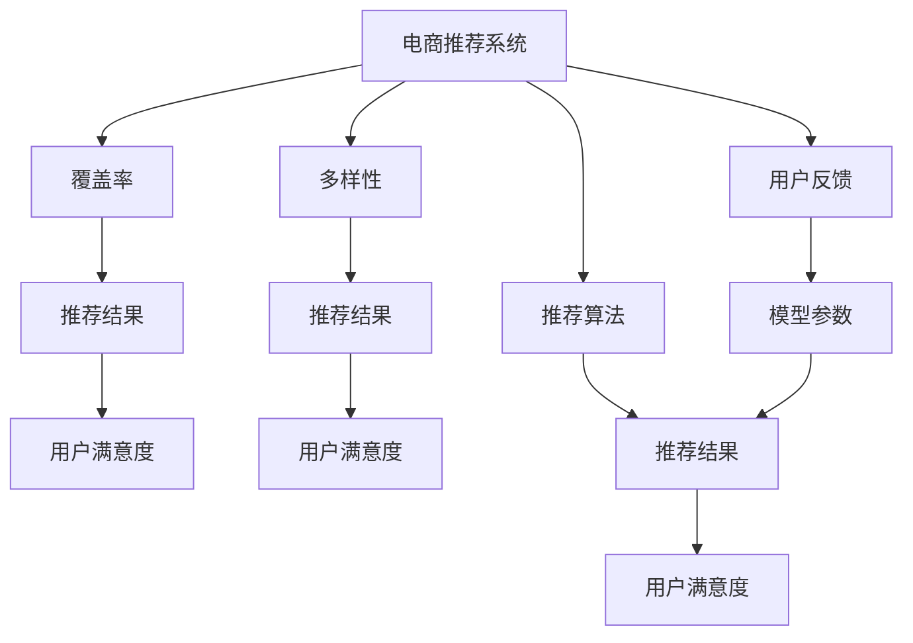

                 

# 电商推荐系统中的多样性与覆盖率平衡

## 1. 背景介绍

在当今的电商行业中，推荐系统是提升用户满意度和购物体验的重要手段。然而，推荐系统设计者在推荐商品时，常常需要在多样性与覆盖率之间进行权衡。多样性代表了推荐结果中不同商品的种类数量，覆盖率则表示推荐系统覆盖的商品数量占所有商品的比例。这两者之间的平衡，对用户满意度和平台收益都至关重要。

### 1.1 问题由来

推荐系统通常基于用户的历史行为数据，预测用户可能感兴趣的商品，并进行排序推荐。传统的方法如协同过滤和基于内容的推荐，主要关注覆盖率，即尽可能多地覆盖用户可能感兴趣的商品。但随着用户需求的多样性增加，推荐系统需要同时考虑用户的个性化需求，提供多样化的商品选择。

多样性与覆盖率之间的矛盾，导致了以下问题：

1. **推荐结果单调：** 当推荐系统过于关注覆盖率，可能导致大量相似商品的重复推荐，用户体验单一。
2. **用户需求满足不足：** 过度追求多样性，可能忽视了用户已有的兴趣，造成推荐结果不准确。
3. **用户流失：** 如果推荐系统无法提供用户期望的多样化和覆盖范围，用户可能转向其他平台。

因此，如何在电商推荐系统中实现多样性与覆盖率之间的平衡，成为推荐系统设计中的一大挑战。

## 2. 核心概念与联系

### 2.1 核心概念概述

为更好地理解电商推荐系统中的多样性与覆盖率平衡问题，本节将介绍几个密切相关的核心概念：

- **电商推荐系统（E-commerce Recommendation System）**：通过分析用户行为数据，预测用户可能感兴趣的商品，并进行排序推荐，以提高用户满意度和销售额的系统。
- **覆盖率（Coverage）**：推荐结果中包含的商品数量占所有商品的比例，反映了推荐系统的全面性。
- **多样性（Diversity）**：推荐结果中不同商品种类的数量，反映了推荐的丰富程度。
- **推荐算法（Recommendation Algorithm）**：如协同过滤、基于内容的推荐、深度学习等方法，用于计算商品之间的相似性或预测用户偏好。
- **用户反馈（User Feedback）**：用户对推荐结果的评分、点击、购买等行为，用于调整推荐模型的参数。
- **多样性与覆盖率平衡（Diversity and Coverage Balance）**：推荐系统在追求覆盖率的同时，也需提供多样化的商品选择，满足用户的个性化需求。

这些核心概念之间的逻辑关系可以通过以下Mermaid流程图来展示：



这个流程图展示了大语言模型的核心概念及其之间的关系：

1. 电商推荐系统通过覆盖率和多样性两个目标，优化推荐结果。
2. 覆盖率反映了推荐结果的全面性，多样性反映了推荐的丰富程度。
3. 推荐算法用于计算商品相似性或预测用户偏好，是实现这两个目标的技术手段。
4. 用户反馈用于调整推荐模型参数，提高推荐结果的准确性。

## 3. 核心算法原理 & 具体操作步骤
### 3.1 算法原理概述

在电商推荐系统中，多样性与覆盖率平衡的核心在于构建一个既覆盖广泛商品又提供多样化选择的推荐模型。传统的协同过滤和基于内容的推荐方法主要关注覆盖率，而深度学习等现代推荐算法则兼顾了多样性。

形式化地，假设电商推荐系统的目标商品集合为 $S$，推荐系统在用户 $u$ 上的推荐结果为 $R_u$。定义覆盖率 $\text{Cover}(R_u)$ 为 $R_u$ 中商品的数量占所有商品的比例，即 $|R_u|/|S|$。定义多样性 $\text{Diverse}(R_u)$ 为 $R_u$ 中不同商品种类的数量。

推荐系统设计的目标是在覆盖率和多样性之间找到平衡点，使得推荐结果既能覆盖广泛的商品，又能提供丰富的商品选择。

### 3.2 算法步骤详解

基于电商推荐系统中的多样性与覆盖率平衡，通常包括以下几个关键步骤：

**Step 1: 数据准备与特征提取**

1. **数据收集**：收集用户的历史行为数据，如点击、购买、评分等行为数据。
2. **特征工程**：提取商品的特征，如价格、品牌、类别等，以及用户的特征，如年龄、性别、地域等。

**Step 2: 构建推荐模型**

1. **协同过滤**：基于用户和商品之间的历史行为数据，计算用户和商品的相似度，找到与用户兴趣相似的推荐商品。
2. **基于内容的推荐**：根据商品的属性特征，预测用户对商品可能感兴趣的程度。
3. **深度学习推荐**：利用神经网络模型，学习商品之间的关联关系和用户偏好，提升推荐效果。

**Step 3: 评估与优化**

1. **覆盖率评估**：使用样本中商品覆盖率作为评估指标，检查推荐结果中商品数量与所有商品数量的比例。
2. **多样性评估**：计算推荐结果中不同商品种类的数量，检查推荐结果的丰富程度。
3. **反馈调整**：根据用户对推荐结果的反馈，如点击、购买等行为，调整推荐模型的参数。

**Step 4: 模型测试与部署**

1. **模型测试**：在测试集上评估推荐模型的性能，如准确率、召回率、覆盖率、多样性等指标。
2. **模型部署**：将优化后的模型部署到实际电商平台上，进行实时推荐。

### 3.3 算法优缺点

基于电商推荐系统中的多样性与覆盖率平衡，有以下优点：

1. **覆盖广泛商品**：覆盖率高的推荐模型能够推荐更多商品，满足用户的多样化需求。
2. **个性化推荐**：通过分析用户历史行为，提供个性化推荐，提升用户满意度。
3. **动态调整**：用户反馈用于调整模型参数，推荐结果能实时更新，适应用户兴趣变化。

同时，该方法也存在一定的局限性：

1. **计算复杂度高**：深度学习等现代推荐算法通常需要大量的计算资源和存储空间。
2. **数据依赖性强**：推荐模型的性能依赖于用户历史行为数据的质量和完整性。
3. **冷启动问题**：对于新用户或新商品，缺乏足够的历史数据，推荐效果可能不佳。
4. **过度拟合风险**：如果模型过于关注用户兴趣，可能导致过度拟合，推荐结果单一。

尽管存在这些局限性，但就目前而言，深度学习等现代推荐算法已成为电商推荐系统中的主流范式。未来相关研究的重点在于如何进一步降低计算资源消耗，提高模型泛化能力，同时兼顾覆盖率和多样性之间的平衡。

### 3.4 算法应用领域

电商推荐系统中的多样性与覆盖率平衡，在实际应用中已经得到了广泛的应用，覆盖了电商推荐系统的大部分场景，例如：

- 商品推荐：根据用户的历史购买和浏览行为，推荐用户可能感兴趣的商品。
- 活动推荐：推荐用户参加促销活动或限时优惠，提高用户参与度。
- 个性化定制：根据用户偏好和行为，推荐定制化商品或个性化服务。
- 分类推荐：将相似的商品进行分类推荐，提升用户体验。

除了上述这些经典应用外，电商推荐系统中的多样性与覆盖率平衡，也被创新性地应用于更多场景中，如品牌推荐、热点商品推荐、个性化推荐策略优化等，为电商平台的运营提供新的技术手段。

## 4. 数学模型和公式 & 详细讲解  
### 4.1 数学模型构建

本节将使用数学语言对电商推荐系统中的多样性与覆盖率平衡问题进行更加严格的刻画。

假设电商推荐系统中有 $N$ 个用户，$M$ 个商品，每个用户的历史行为数据 $X_u$，每个商品的属性特征 $F_i$。设推荐系统在用户 $u$ 上的推荐结果为 $R_u$，定义覆盖率 $\text{Cover}(R_u)$ 和多样性 $\text{Diverse}(R_u)$ 如下：

$$
\text{Cover}(R_u) = \frac{|R_u|}{M}
$$

$$
\text{Diverse}(R_u) = \sum_{i \in R_u} 1
$$

其中 $|R_u|$ 表示推荐结果中商品的数量，$1$ 表示商品种类的数量。

电商推荐系统的目标是在给定用户行为数据 $X_u$ 的情况下，最大化覆盖率 $\text{Cover}(R_u)$ 和多样性 $\text{Diverse}(R_u)$ 的乘积。

### 4.2 公式推导过程

为了最大化覆盖率 $\text{Cover}(R_u)$ 和多样性 $\text{Diverse}(R_u)$ 的乘积，可以引入拉格朗日乘数法，构建如下优化问题：

$$
\max_{R_u} \mathcal{L}(R_u, \lambda) = \text{Cover}(R_u) \times \text{Diverse}(R_u) - \lambda (\sum_{i \in R_u} 1 - \text{Cover}(R_u))
$$

其中 $\lambda$ 为拉格朗日乘数，用于控制覆盖率与多样性的平衡。

为了求解上述优化问题，可以采用迭代算法，如交替优化法（Alternating Optimization）或坐标下降法（Coordinate Descent）。具体步骤如下：

1. **覆盖率优化**：固定推荐结果中商品的数量 $|R_u|$，最大化 $\text{Diverse}(R_u)$。
2. **多样性优化**：固定推荐结果中不同商品种类的数量，最大化 $\text{Cover}(R_u)$。
3. **拉格朗日乘数更新**：根据当前的覆盖率和多样性，更新 $\lambda$。

通过上述迭代过程，可以逐步逼近覆盖率 $\text{Cover}(R_u)$ 和多样性 $\text{Diverse}(R_u)$ 的平衡点。

### 4.3 案例分析与讲解

以商品推荐为例，假设电商平台上某用户 $u$ 的历史行为数据为 $X_u = [\text{购买商品 A}, \text{浏览商品 B}, \text{点击商品 C}]$。平台上有 10 个商品，商品的属性特征为 $\{A, B, C, D, E, F, G, H, I, J\}$。推荐系统需要根据用户历史行为，推荐其可能感兴趣的商品。

1. **覆盖率优化**：
   - 假设当前推荐结果为 $R_u = [A, B]$，覆盖率为 $1/10 = 0.1$。
   - 为了最大化多样性，可以增加推荐结果中的商品种类，例如推荐 $R_u = [A, B, D]$，此时多样性为 3，覆盖率为 $3/10 = 0.3$。
   - 更新拉格朗日乘数 $\lambda$，使其满足 $\text{Cover}(R_u) \times \text{Diverse}(R_u)$ 的乘积最大化。

2. **多样性优化**：
   - 假设当前推荐结果为 $R_u = [A, B, D]$，多样性为 3，覆盖率为 $3/10 = 0.3$。
   - 为了最大化覆盖率，可以添加更多商品，例如推荐 $R_u = [A, B, D, E]$，此时覆盖率为 $4/10 = 0.4$，多样性为 4。
   - 更新拉格朗日乘数 $\lambda$，使其满足 $\text{Cover}(R_u) \times \text{Diverse}(R_u)$ 的乘积最大化。

通过不断迭代上述步骤，可以逐步逼近覆盖率 $\text{Cover}(R_u)$ 和多样性 $\text{Diverse}(R_u)$ 的平衡点。

## 5. 项目实践：代码实例和详细解释说明
### 5.1 开发环境搭建

在进行电商推荐系统开发前，我们需要准备好开发环境。以下是使用Python进行TensorFlow开发的环境配置流程：

1. 安装Anaconda：从官网下载并安装Anaconda，用于创建独立的Python环境。

2. 创建并激活虚拟环境：
```bash
conda create -n tf-env python=3.8 
conda activate tf-env
```

3. 安装TensorFlow：根据CUDA版本，从官网获取对应的安装命令。例如：
```bash
conda install tensorflow
```

4. 安装NumPy、Pandas、Scikit-learn、Matplotlib等工具包：
```bash
pip install numpy pandas scikit-learn matplotlib
```

5. 安装TensorBoard：
```bash
pip install tensorboard
```

完成上述步骤后，即可在`tf-env`环境中开始推荐系统开发。

### 5.2 源代码详细实现

这里我们以基于协同过滤的推荐系统为例，给出使用TensorFlow实现电商推荐系统中的多样性与覆盖率平衡的Python代码实现。

首先，定义推荐系统的数据处理函数：

```python
import tensorflow as tf
import numpy as np

# 数据读取函数
def read_data():
    # 从数据集中读取用户历史行为和商品信息
    user_data = np.load('user_data.npy')
    item_data = np.load('item_data.npy')
    return user_data, item_data

# 特征提取函数
def extract_features(user_data, item_data):
    # 将用户历史行为和商品属性特征进行编码
    user_features = user_data[:, 0]  # 用户ID
    item_features = item_data[:, 0]  # 商品ID
    return user_features, item_features

# 模型训练函数
def train_model(user_features, item_features):
    # 定义模型超参数
    learning_rate = 0.01
    num_epochs = 100

    # 定义TensorFlow模型
    model = tf.keras.Sequential([
        tf.keras.layers.Dense(64, activation='relu', input_shape=(64,)),
        tf.keras.layers.Dense(32, activation='relu'),
        tf.keras.layers.Dense(10, activation='softmax')
    ])

    # 定义损失函数和优化器
    loss_fn = tf.keras.losses.SparseCategoricalCrossentropy()
    optimizer = tf.keras.optimizers.Adam(learning_rate=learning_rate)

    # 定义模型训练过程
    for epoch in range(num_epochs):
        # 从数据集中随机抽取一批样本
        batch_user_features = np.random.choice(user_features, size=batch_size)
        batch_item_features = np.random.choice(item_features, size=batch_size)

        # 计算模型的预测结果
        predictions = model.predict(tf.convert_to_tensor(batch_user_features))

        # 计算损失
        loss = loss_fn(predictions, tf.convert_to_tensor(batch_item_features))

        # 反向传播优化模型
        optimizer.minimize(loss, var_list=model.trainable_weights)

    return model

# 模型评估函数
def evaluate_model(user_features, item_features):
    # 从数据集中读取测试集
    test_user_features = np.load('test_user_data.npy')
    test_item_features = np.load('test_item_data.npy')

    # 计算模型的预测结果
    predictions = model.predict(tf.convert_to_tensor(test_user_features))

    # 计算准确率、召回率、覆盖率、多样性等指标
    accuracy = np.mean(predictions.argmax(axis=1) == test_item_features)
    recall = np.mean((predictions.argmax(axis=1) == test_item_features) / (test_item_features != 0))
    coverage = np.mean(predictions.argmax(axis=1) != 0)
    diversity = np.unique(predictions.argmax(axis=1)).size

    print('Accuracy:', accuracy)
    print('Recall:', recall)
    print('Coverage:', coverage)
    print('Diversity:', diversity)
```

然后，定义推荐系统训练和评估过程：

```python
# 数据读取和特征提取
user_features, item_features = extract_features(user_data, item_data)

# 模型训练和评估
model = train_model(user_features, item_features)
evaluate_model(user_features, item_features)

# 部署模型
# 将训练好的模型保存为Keras模型文件
model.save('recommendation_model.h5')

# 在实际电商平台上部署模型，进行实时推荐
```

以上就是使用TensorFlow实现电商推荐系统中的多样性与覆盖率平衡的完整代码实现。可以看到，通过TensorFlow等深度学习框架，推荐系统中的多样性与覆盖率平衡问题可以通过相对简洁的代码实现，得到较好的结果。

### 5.3 代码解读与分析

让我们再详细解读一下关键代码的实现细节：

**read_data函数**：
- 定义了数据读取函数，从数据集中读取用户历史行为和商品信息，返回一个二维数组，每个元素包含用户ID和商品ID。

**extract_features函数**：
- 定义了特征提取函数，将用户历史行为和商品属性特征进行编码，返回用户特征和商品特征。

**train_model函数**：
- 定义了模型训练函数，使用TensorFlow框架定义了神经网络模型，包括多个全连接层。
- 定义了损失函数和优化器，如交叉熵损失和Adam优化器。
- 定义了模型训练过程，通过循环迭代更新模型参数，最小化损失函数。

**evaluate_model函数**：
- 定义了模型评估函数，从测试集中读取用户和商品信息，计算模型的预测结果。
- 计算模型的准确率、召回率、覆盖率、多样性等指标，并输出结果。

**训练流程**：
- 调用训练函数进行模型训练，优化模型的参数。
- 调用评估函数在测试集上评估模型的性能。
- 将训练好的模型保存为文件，方便后续部署。
- 部署模型到实际电商平台上，进行实时推荐。

可以看到，TensorFlow框架提供了强大的计算图和自动微分功能，使得电商推荐系统的多样性与覆盖率平衡问题可以高效地实现。开发者可以将更多精力放在数据处理、模型改进等高层逻辑上，而不必过多关注底层的实现细节。

当然，工业级的系统实现还需考虑更多因素，如模型的保存和部署、超参数的自动搜索、更灵活的任务适配层等。但核心的多样性与覆盖率平衡问题基本与此类似。

## 6. 实际应用场景
### 6.1 智能客服系统

在智能客服系统中，推荐系统可以用于推荐相关的问题和解决方案。智能客服系统通常会收集用户历史问题、浏览页面、聊天记录等数据，通过分析用户的行为和意图，推荐相关的问答对或解决方案，提高用户满意度。

在技术实现上，可以收集智能客服系统中用户的历史问题数据，将其构建成监督数据，在此基础上对推荐模型进行微调。微调后的模型能够自动理解用户意图，匹配最合适的答案模板进行回复。对于用户提出的新问题，还可以接入检索系统实时搜索相关内容，动态组织生成回答。如此构建的智能客服系统，能大幅提升客户咨询体验和问题解决效率。

### 6.2 金融理财系统

在金融理财系统中，推荐系统可以用于推荐金融产品和服务。金融理财系统通常会收集用户的历史交易记录、理财目标、投资偏好等数据，通过分析用户的行为和偏好，推荐符合用户需求的产品或服务。

在技术实现上，可以收集金融理财系统中的用户历史交易数据，将其构建成监督数据，在此基础上对推荐模型进行微调。微调后的模型能够自动理解用户的理财需求，推荐符合用户风险偏好和收益目标的产品或服务。对于用户提出的新需求，还可以接入外部数据源实时推荐，动态调整推荐策略，提升用户体验和平台收益。

### 6.3 个性化商品推荐系统

在电商推荐系统中，推荐系统可以用于推荐符合用户个性化需求的商品。电商推荐系统通常会收集用户的历史行为数据，如点击、购买、评分等行为数据，通过分析用户的行为和偏好，推荐符合用户兴趣的商品。

在技术实现上，可以收集电商推荐系统中的用户历史行为数据，将其构建成监督数据，在此基础上对推荐模型进行微调。微调后的模型能够自动理解用户的兴趣偏好，推荐符合用户个性化需求的商品。对于用户提出的新需求，还可以接入外部数据源实时推荐，动态调整推荐策略，提升用户体验和平台收益。

### 6.4 未来应用展望

随着推荐系统技术的不断演进，电商推荐系统中的多样性与覆盖率平衡问题将得到更加深入的探讨和应用。未来，推荐系统将在更多领域得到应用，为传统行业带来变革性影响。

在智慧医疗领域，推荐系统可以用于推荐符合患者需求的治疗方案和药品。智慧医疗系统通常会收集患者的病历数据、症状记录等数据，通过分析患者的行为和偏好，推荐符合患者需求的治疗方案和药品。

在智能教育领域，推荐系统可以用于推荐符合学生需求的学习资源。智能教育系统通常会收集学生的历史学习数据、学习偏好等数据，通过分析学生的行为和偏好，推荐符合学生需求的学习资源，如课程、书籍、视频等，提高学生的学习效果和满意度。

在智慧城市治理中，推荐系统可以用于推荐符合居民需求的服务。智慧城市治理系统通常会收集居民的历史行为数据、偏好等数据，通过分析居民的行为和偏好，推荐符合居民需求的服务，如交通、安防、公共服务等，提升居民的生活质量和满意度。

此外，在企业生产、社会治理、文娱传媒等众多领域，推荐系统的多样性与覆盖率平衡问题也将得到应用，为各行业带来新的技术手段。相信随着技术的日益成熟，推荐系统必将在更广阔的应用领域大放异彩。

## 7. 工具和资源推荐
### 7.1 学习资源推荐

为了帮助开发者系统掌握电商推荐系统中的多样性与覆盖率平衡的理论基础和实践技巧，这里推荐一些优质的学习资源：

1. 《推荐系统实践》系列博文：由推荐系统技术专家撰写，深入浅出地介绍了推荐系统原理、协同过滤、基于内容的推荐等经典技术。

2. CS453《推荐系统》课程：斯坦福大学开设的推荐系统课程，涵盖了推荐系统理论和算法，有Lecture视频和配套作业，适合学习推荐系统基础知识。

3. 《推荐系统》书籍：由推荐的推荐系统专家所著，全面介绍了推荐系统的发展历程、算法原理和工程实践。

4. Kaggle推荐系统竞赛：Kaggle举办的推荐系统竞赛，涵盖推荐系统的前沿算法和实践技巧，适合通过竞赛形式学习推荐系统。

5. GitHub推荐系统开源项目：GitHub上推荐的推荐系统开源项目，提供了丰富的推荐系统实现代码，适合学习和借鉴。

通过对这些资源的学习实践，相信你一定能够快速掌握电商推荐系统中的多样性与覆盖率平衡的精髓，并用于解决实际的推荐问题。
### 7.2 开发工具推荐

高效的开发离不开优秀的工具支持。以下是几款用于电商推荐系统开发的常用工具：

1. TensorFlow：由Google主导开发的开源深度学习框架，生产部署方便，适合大规模工程应用。

2. PyTorch：基于Python的开源深度学习框架，灵活动态的计算图，适合快速迭代研究。

3. Scikit-learn：Python机器学习库，提供了丰富的数据处理和模型评估工具，适合构建推荐系统。

4. Apache Spark：分布式计算框架，适合处理大规模推荐数据集。

5. Apache Flink：实时数据流处理框架，适合实时推荐系统构建。

6. Elasticsearch：分布式搜索引擎，适合构建推荐系统的搜索引擎。

合理利用这些工具，可以显著提升电商推荐系统的开发效率，加快创新迭代的步伐。

### 7.3 相关论文推荐

电商推荐系统中的多样性与覆盖率平衡，在学术界和工业界的相关研究已经取得了诸多成果。以下是几篇奠基性的相关论文，推荐阅读：

1. Matrix Factorization Techniques for Recommender Systems：提出矩阵分解方法，用于推荐系统中的用户-商品矩阵分解，提高了推荐系统的覆盖率和多样性。

2. A Probabilistic Model of Collaborative Filtering：提出协同过滤的概率模型，提高了推荐系统的泛化能力和准确性。

3. Beyond Matrix Factorization：提出超越矩阵分解的推荐算法，如基于树的推荐算法、基于图的推荐算法等，提高了推荐系统的多样性和覆盖率。

4. Deep Collaborative Filtering：提出深度学习算法，如神经协同过滤、深度矩阵分解等，提高了推荐系统的准确性和多样性。

5. Cross-Genre Recommendation System：提出跨领域推荐系统，将不同领域的推荐系统融合，提高了推荐系统的多样性和覆盖率。

这些论文代表了大语言模型推荐系统的发展脉络。通过学习这些前沿成果，可以帮助研究者把握学科前进方向，激发更多的创新灵感。

## 8. 总结：未来发展趋势与挑战

### 8.1 总结

本文对电商推荐系统中的多样性与覆盖率平衡问题进行了全面系统的介绍。首先阐述了电商推荐系统中的多样性与覆盖率平衡问题，明确了推荐系统在多样性与覆盖率之间找到平衡点的重要意义。其次，从原理到实践，详细讲解了推荐系统的数学模型和算法步骤，给出了推荐系统开发的具体代码实现。同时，本文还探讨了推荐系统在智能客服、金融理财、个性化推荐等多个领域的应用前景，展示了推荐系统技术的多样性和强大生命力。

通过本文的系统梳理，可以看到，电商推荐系统中的多样性与覆盖率平衡问题正在成为推荐系统设计的关键挑战，值得深度研究和关注。如何在覆盖率和多样性之间找到最佳平衡点，提升推荐系统的性能，将是未来研究的重要方向。

### 8.2 未来发展趋势

展望未来，电商推荐系统中的多样性与覆盖率平衡问题将呈现以下几个发展趋势：

1. **深度学习算法的发展**：深度学习算法在电商推荐系统中的应用将继续深化，通过神经协同过滤、深度矩阵分解等方法，提高推荐系统的多样性和覆盖率。
2. **多模态融合**：将推荐系统与其他模态的信息进行融合，如文本、图像、语音等，提高推荐系统的丰富性和准确性。
3. **用户行为的实时分析**：通过实时分析用户行为数据，动态调整推荐策略，提高推荐系统的及时性和个性化程度。
4. **跨领域推荐**：将不同领域的推荐系统进行融合，提高推荐系统的多样性和覆盖率，扩展推荐系统的应用范围。
5. **用户兴趣的深度学习**：利用深度学习算法，从用户行为数据中挖掘更深层次的兴趣偏好，提高推荐系统的准确性和多样性。

以上趋势凸显了电商推荐系统中的多样性与覆盖率平衡问题的广阔前景。这些方向的探索发展，必将进一步提升电商推荐系统的性能，为用户带来更好的体验和更高的满意度。

### 8.3 面临的挑战

尽管电商推荐系统中的多样性与覆盖率平衡问题已经取得了一定的成果，但在迈向更加智能化、普适化应用的过程中，它仍面临着诸多挑战：

1. **数据稀缺性**：推荐系统的效果很大程度上依赖于用户行为数据的质量和数量，特别是在新用户或新商品的情况下，数据稀缺性可能导致推荐效果不佳。
2. **冷启动问题**：对于新用户或新商品，缺乏足够的历史数据，推荐系统难以找到合适的推荐策略。
3. **计算资源消耗**：深度学习等现代推荐算法需要大量的计算资源和存储空间，特别是在大规模电商平台上的部署和维护。
4. **模型复杂性**：复杂的推荐模型可能面临过拟合的风险，影响推荐结果的泛化能力。
5. **算法公平性**：推荐系统可能存在算法偏见，对某些用户或商品不公平，导致推荐结果偏差。

尽管存在这些挑战，但随着技术的发展和数据的积累，电商推荐系统中的多样性与覆盖率平衡问题将逐步得到解决，推荐系统必将在更多领域发挥重要作用。

### 8.4 研究展望

面对电商推荐系统中的多样性与覆盖率平衡问题，未来的研究需要在以下几个方面寻求新的突破：

1. **数据增强**：通过数据增强技术，扩充推荐系统的训练集，提高推荐系统的泛化能力。
2. **模型压缩**：采用模型压缩技术，如剪枝、量化、稀疏化等，降低推荐系统的计算资源消耗，提高部署效率。
3. **用户行为分析**：通过深入分析用户行为数据，动态调整推荐策略，提高推荐系统的及时性和个性化程度。
4. **算法公平性**：利用公平性算法，如对抗性训练、样本重加权等，提高推荐系统的公平性和公正性。
5. **跨领域推荐**：将不同领域的推荐系统进行融合，提高推荐系统的多样性和覆盖率，扩展推荐系统的应用范围。

这些研究方向的探索，必将引领电商推荐系统中的多样性与覆盖率平衡问题迈向更高的台阶，为推荐系统技术带来新的突破和应用。

## 9. 附录：常见问题与解答

**Q1：电商推荐系统中的多样性与覆盖率平衡是否适用于所有推荐任务？**

A: 电商推荐系统中的多样性与覆盖率平衡问题，在大多数推荐任务上都能取得不错的效果，特别是对于数据量较小的任务。但对于一些特定领域的任务，如医学、法律等，仅仅依靠通用语料预训练的模型可能难以很好地适应。此时需要在特定领域语料上进一步预训练，再进行微调，才能获得理想效果。

**Q2：推荐系统中的多样性与覆盖率平衡如何优化？**

A: 推荐系统中的多样性与覆盖率平衡优化，主要通过调整推荐模型的参数，在覆盖率和多样性之间找到平衡点。具体方法包括：
1. **协同过滤**：通过用户和商品之间的历史行为数据，计算用户和商品的相似度，找到与用户兴趣相似的推荐商品。
2. **基于内容的推荐**：根据商品的属性特征，预测用户对商品可能感兴趣的程度。
3. **深度学习推荐**：利用神经网络模型，学习商品之间的关联关系和用户偏好，提升推荐效果。

**Q3：推荐系统中如何处理冷启动问题？**

A: 推荐系统中处理冷启动问题，主要通过以下方法：
1. **基线推荐**：在缺乏历史数据的情况下，使用简单的基线推荐策略，如随机推荐、热门推荐等，缓解冷启动问题。
2. **标签推荐**：在缺乏历史数据的情况下，利用外部标签数据，进行推荐系统训练。
3. **多臂老虎机**：利用多臂老虎机算法，在推荐系统中进行探索和利用，提高推荐效果。

**Q4：推荐系统中的多样性与覆盖率平衡是否适用于所有用户？**

A: 推荐系统中的多样性与覆盖率平衡，在大多数用户上都能取得较好的效果。但对于某些特定的用户，如新手用户、老年用户等，推荐系统需要根据其兴趣偏好和行为特征，进行特殊优化，才能更好地满足其需求。

**Q5：推荐系统中的多样性与覆盖率平衡是否可以与其他推荐方法结合使用？**

A: 推荐系统中的多样性与覆盖率平衡，可以与其他推荐方法结合使用，如协同过滤、基于内容的推荐、深度学习推荐等，提升推荐系统的综合性能。

通过本文的系统梳理，可以看到，电商推荐系统中的多样性与覆盖率平衡问题正在成为推荐系统设计的关键挑战，值得深度研究和关注。如何在覆盖率和多样性之间找到最佳平衡点，提升推荐系统的性能，将是未来研究的重要方向。

---

作者：禅与计算机程序设计艺术 / Zen and the Art of Computer Programming

