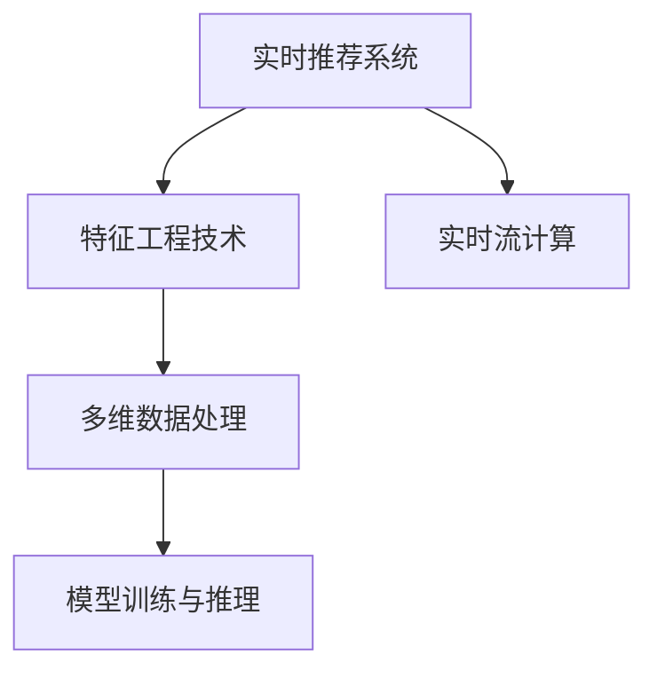

                 

# 电商推荐系统中的实时特征工程技术

> 关键词：实时推荐系统,特征工程技术,电商数据处理,实时流计算,机器学习模型

## 1. 背景介绍

### 1.1 问题由来

在电商领域，推荐系统作为提升用户体验、增加销售额的重要工具，其推荐效果的优劣直接关系到企业的经营绩效。然而，传统推荐系统往往采用离线批处理方式，无法快速响应用户行为变化，导致推荐实时性和个性化程度不足。在用户行为数据激增、用户需求多样化日益突出的今天，实时推荐系统的需求日益迫切。

基于实时流计算的推荐系统（Real-time Recommendation System）通过实时采集和分析用户行为数据，可以及时更新推荐结果，满足用户的个性化需求。然而，实时推荐系统的复杂性和资源需求显著增加，传统的特征提取和处理技术已难以胜任。因此，构建高效、灵活、鲁棒的实时特征工程技术，成为电商推荐系统技术升级的关键。

### 1.2 问题核心关键点

实时推荐系统对特征工程技术的要求体现在以下几个方面：

1. **高时效性**：实时推荐系统需要快速响应用户行为数据，特征提取和处理需要做到毫秒级延迟。
2. **高灵活性**：特征工程技术需要具备高扩展性，能够应对不同规模、不同类型的电商数据。
3. **高准确性**：特征处理结果直接影响到模型的推荐效果，因此需要保证特征提取和处理的准确性和鲁棒性。
4. **高效率**：实时推荐系统需要在有限的计算资源下高效运行，因此特征工程技术需要优化资源使用，避免计算瓶颈。
5. **高安全性**：电商数据具有敏感性，特征工程技术需要确保数据隐私和安全。

这些问题点要求特征工程技术必须综合考虑实时性、灵活性、准确性、效率和安全性，构建一套全面、高效的解决方案。

## 2. 核心概念与联系

### 2.1 核心概念概述

为更好地理解实时推荐系统中的特征工程技术，本节将介绍几个关键概念：

- **实时推荐系统**：通过实时采集和分析用户行为数据，快速响应用户需求，提供个性化推荐服务的系统。
- **特征工程技术**：通过提取、处理和优化数据特征，提升推荐模型性能的技术。
- **实时流计算**：通过实时数据流处理，支持推荐系统快速响应数据变化的技术。
- **多维数据处理**：处理电商数据中的多维度特征，如用户行为、商品属性、用户画像等。
- **模型训练与推理**：基于特征处理结果训练推荐模型，并在实时场景中进行推理预测。

这些核心概念之间的逻辑关系可以通过以下Mermaid流程图来展示：



这个流程图展示了一系列技术组件之间的依赖关系：

1. 实时推荐系统利用实时流计算，实现对用户行为的实时分析。
2. 特征工程技术为实时流计算提供数据处理和特征提取支持，包括多维数据处理和模型训练与推理。
3. 模型训练与推理基于特征工程技术生成的多维度数据，训练推荐模型并实时进行预测。

## 3. 核心算法原理 & 具体操作步骤

### 3.1 算法原理概述

实时推荐系统中的特征工程技术，其核心思想是通过高效的数据处理和特征提取，构建多维度特征向量，供推荐模型进行实时推理。

假设电商数据集为 $D=\{(x_i, y_i)\}_{i=1}^N$，其中 $x_i$ 表示用户行为数据，$y_i$ 表示用户偏好标签。特征工程技术的目标是构建特征向量 $x'_i = \phi(x_i)$，其中 $\phi$ 为特征映射函数。

在构建特征向量的过程中，需要考虑以下关键点：

1. **多维度特征提取**：从电商数据中提取多维度特征，如用户行为特征、商品属性特征、用户画像特征等。
2. **实时流处理**：在实时流计算框架上，对用户行为数据进行高效处理和特征提取。
3. **特征融合与降维**：通过特征融合和降维技术，构建高质量的特征向量。
4. **模型优化与训练**：利用构建好的特征向量，优化推荐模型，提升推荐效果。
5. **实时推理与预测**：在实时场景中，利用优化后的推荐模型对用户行为进行实时推理和预测。

### 3.2 算法步骤详解

实时推荐系统中的特征工程技术主要包括以下几个关键步骤：

**Step 1: 数据收集与预处理**
- 通过实时数据流技术，从电商平台收集用户行为数据，包括点击、浏览、购买等事件。
- 对原始数据进行清洗和去噪，去除异常和无效数据，确保数据质量。

**Step 2: 多维度特征提取**
- 从用户行为数据中提取多种特征，如用户浏览历史、购买记录、评分数据等。
- 从商品数据中提取属性特征，如商品分类、价格、评价等。
- 从用户画像数据中提取用户兴趣、地理位置、时间等特征。

**Step 3: 实时流计算与特征提取**
- 在实时流计算框架（如Apache Flink、Apache Storm等）上，对用户行为数据进行实时处理和特征提取。
- 利用滑动窗口技术，将用户行为数据按时间窗口进行分组，并计算窗口内行为特征。

**Step 4: 特征融合与降维**
- 通过特征融合技术，将多维度特征进行组合和合并，构建综合特征向量。
- 利用降维技术（如主成分分析PCA、因子分析FA等）对高维特征向量进行降维，提升特征处理效率。

**Step 5: 模型训练与优化**
- 将特征处理结果作为输入，训练推荐模型（如协同过滤、深度学习等）。
- 利用优化算法（如Adam、SGD等）对推荐模型进行调参和优化，提升模型性能。

**Step 6: 实时推理与预测**
- 在实时场景中，利用训练好的推荐模型对用户行为进行实时推理和预测。
- 将推荐结果作为反馈，实时更新用户画像和商品属性，进一步提升推荐效果。

### 3.3 算法优缺点

实时推荐系统中的特征工程技术，具有以下优点：

1. **高时效性**：通过实时流计算，实现对用户行为数据的快速处理和特征提取。
2. **高灵活性**：利用多维数据处理技术，适应不同规模、不同类型的电商数据。
3. **高准确性**：通过特征融合和降维技术，提升特征向量的质量和模型的预测准确性。
4. **高效率**：通过优化特征处理流程，避免计算瓶颈，提升实时推荐系统的性能。
5. **高安全性**：在数据处理和特征提取过程中，确保数据隐私和安全。

同时，该方法也存在一定的局限性：

1. **计算资源要求高**：实时推荐系统需要高计算资源支持，可能面临硬件成本的挑战。
2. **技术门槛高**：需要掌握实时流计算、数据处理、特征工程等多领域技术。
3. **数据复杂性高**：电商数据具有复杂性，处理难度较大，容易出现数据丢失、偏差等问题。
4. **模型复杂性高**：特征工程处理结果需要与推荐模型紧密结合，模型调试和优化难度较大。
5. **安全性风险高**：在处理用户敏感数据时，可能面临数据泄露、隐私侵犯的风险。

尽管存在这些局限性，但就目前而言，实时推荐系统中的特征工程技术仍是电商推荐系统技术升级的重要范式。未来相关研究的重点在于如何进一步降低计算成本，提高技术灵活性和安全性，同时兼顾性能和准确性。

### 3.4 算法应用领域

实时推荐系统中的特征工程技术，在电商推荐系统中的应用十分广泛，涵盖以下领域：

- **个性化推荐**：利用用户行为和商品属性特征，提升推荐模型的个性化程度。
- **实时广告推荐**：在广告投放场景中，通过实时数据流技术，快速匹配用户兴趣和广告内容。
- **价格动态调整**：利用用户行为和商品属性特征，实时调整商品价格，提升转化率。
- **库存优化管理**：通过实时监控用户购买行为，优化商品库存，避免缺货或过剩。
- **市场趋势分析**：利用用户行为数据，分析市场趋势和用户需求，指导商品供应链管理。

除了上述这些经典应用外，实时推荐系统中的特征工程技术还在智慧零售、社交电商、移动电商等多个领域得到广泛应用，为电商推荐系统的升级提供了强大的技术支持。

## 4. 数学模型和公式 & 详细讲解 & 举例说明

### 4.1 数学模型构建

实时推荐系统中的特征工程技术，其数学模型构建主要包括以下几个方面：

- **用户行为特征提取**：定义用户行为特征 $x_{user}$，包括用户浏览历史、购买记录、评分数据等。
- **商品属性特征提取**：定义商品属性特征 $x_{item}$，包括商品分类、价格、评价等。
- **用户画像特征提取**：定义用户画像特征 $x_{profile}$，包括用户兴趣、地理位置、时间等。

用户行为特征向量 $x_{user}$ 可以表示为：

$$
x_{user} = [u_1, u_2, \dots, u_n]
$$

其中 $u_i$ 表示用户行为数据的第 $i$ 个特征。

商品属性特征向量 $x_{item}$ 可以表示为：

$$
x_{item} = [i_1, i_2, \dots, i_m]
$$

其中 $i_j$ 表示商品属性数据的第 $j$ 个特征。

用户画像特征向量 $x_{profile}$ 可以表示为：

$$
x_{profile} = [p_1, p_2, \dots, p_k]
$$

其中 $p_l$ 表示用户画像数据的第 $l$ 个特征。

### 4.2 公式推导过程

假设用户行为数据 $x_{user}$ 和商品属性数据 $x_{item}$ 已经提取完成，需要进行特征融合和降维。设用户画像数据 $x_{profile}$ 包含 $k$ 个特征，需要将其与用户行为数据和商品属性数据进行融合。

定义融合后的特征向量为 $x'$，其中：

$$
x' = [x_{user}, x_{item}, x_{profile}]
$$

为了方便处理，可以定义特征映射函数 $\phi$，将融合后的特征向量 $x'$ 映射为新的特征向量 $x'$，其中：

$$
x' = \phi(x') = [\phi(x_{user}), \phi(x_{item}), \phi(x_{profile})]
$$

其中 $\phi$ 为特征映射函数。

特征融合和降维过程可以通过主成分分析（PCA）等线性代数方法实现，具体公式推导如下：

设用户行为数据 $x_{user}$ 和商品属性数据 $x_{item}$ 的协方差矩阵为 $C_{user, item}$，用户画像数据 $x_{profile}$ 的协方差矩阵为 $C_{profile}$。

特征融合后的协方差矩阵 $C'$ 可以表示为：

$$
C' = \begin{bmatrix} C_{user} & C_{user, item} \\ C_{item, user} & C_{item} \end{bmatrix}
$$

其中 $C_{user, item}$ 和 $C_{item, user}$ 表示用户行为数据和商品属性数据之间的协方差矩阵。

对 $C'$ 进行特征值分解，得到特征向量 $V'$ 和特征值 $\lambda'$：

$$
C' = V' \Lambda' V'^T
$$

其中 $\Lambda'$ 为特征值对角矩阵，$V'$ 为特征向量矩阵。

对特征向量 $V'$ 进行归一化处理，得到新的特征向量 $V$：

$$
V = \frac{V'}{\sqrt{\lambda'}}
$$

最终，得到降维后的特征向量 $x''$：

$$
x'' = V x'
$$

### 4.3 案例分析与讲解

假设电商数据集中包含用户行为数据 $x_{user}$ 和商品属性数据 $x_{item}$，用户画像数据 $x_{profile}$ 包含用户兴趣特征 $p_1$ 和地理位置特征 $p_2$。

首先，定义用户行为数据和商品属性数据的协方差矩阵 $C_{user, item}$，用户画像数据的协方差矩阵 $C_{profile}$。

然后，进行特征融合，得到融合后的协方差矩阵 $C'$：

$$
C' = \begin{bmatrix} C_{user} & C_{user, item} \\ C_{item, user} & C_{item} \end{bmatrix}
$$

接下来，进行特征值分解，得到特征向量 $V'$ 和特征值 $\lambda'$：

$$
C' = V' \Lambda' V'^T
$$

对特征向量 $V'$ 进行归一化处理，得到新的特征向量 $V$：

$$
V = \frac{V'}{\sqrt{\lambda'}}
$$

最终，得到降维后的特征向量 $x''$：

$$
x'' = V x'
$$

## 5. 项目实践：代码实例和详细解释说明

### 5.1 开发环境搭建

在进行实时推荐系统特征工程实践前，我们需要准备好开发环境。以下是使用Python进行Apache Flink和PyTorch开发的环境配置流程：

1. 安装Anaconda：从官网下载并安装Anaconda，用于创建独立的Python环境。

2. 创建并激活虚拟环境：
```bash
conda create -n flink-env python=3.8 
conda activate flink-env
```

3. 安装Apache Flink：根据Flink版本，从官网获取对应的安装命令。例如：
```bash
conda install flink=2.12.0
```

4. 安装PyTorch：根据CUDA版本，从官网获取对应的安装命令。例如：
```bash
conda install pytorch torchvision torchaudio cudatoolkit=11.1 -c pytorch -c conda-forge
```

5. 安装各类工具包：
```bash
pip install numpy pandas scikit-learn matplotlib tqdm jupyter notebook ipython
```

完成上述步骤后，即可在`flink-env`环境中开始特征工程实践。

### 5.2 源代码详细实现

这里我们以实时推荐系统中的特征工程技术为例，给出使用Apache Flink和PyTorch对电商数据进行特征处理和降维的PyTorch代码实现。

首先，定义用户行为特征提取函数：

```python
from sklearn.preprocessing import MinMaxScaler
from sklearn.decomposition import PCA

def extract_user_features(user_data):
    # 提取用户行为特征
    user_features = user_data['behavior'].to_pandas()
    user_features = MinMaxScaler().fit_transform(user_features)
    
    # 提取商品属性特征
    item_features = user_data['item'].to_pandas()
    item_features = MinMaxScaler().fit_transform(item_features)
    
    # 提取用户画像特征
    profile_features = user_data['profile'].to_pandas()
    profile_features = MinMaxScaler().fit_transform(profile_features)
    
    # 特征融合
    merged_features = pd.concat([user_features, item_features, profile_features], axis=1)
    
    # 特征降维
    pca = PCA(n_components=10)
    pca_features = pca.fit_transform(merged_features)
    
    return pca_features
```

然后，定义实时流计算和特征提取函数：

```python
from pyflink.datastream import StreamExecutionEnvironment
from pyflink.table import StreamTableEnvironment

def process_user_data(stream_env, table_env):
    # 创建实时流处理环境
    stream_env.set_parallelism(1)
    table_env.set_parallelism(1)
    
    # 创建数据流表
    data_stream = stream_env.from_collection(['user_bi', 'item_attr', 'profile'], ['user_bi', 'item_attr', 'profile'])
    
    # 实时特征处理
    features = table_env.from_elements(extract_user_features, data_stream)
    
    # 特征降维
    pca_features = features.map(extract_user_features)
    
    # 实时写入数据库
    pca_features.write_batch_sink(data_stream)
```

最后，启动特征工程实践并在数据库中存储结果：

```python
from pyflink.datastream import StreamExecutionEnvironment
from pyflink.table import StreamTableEnvironment
import pyflink.datastream.functions as F

def main():
    # 创建实时流处理环境
    env = StreamExecutionEnvironment.get_execution_environment()
    env.set_parallelism(1)
    
    # 创建数据流表
    table_env = StreamTableEnvironment.create(env)
    
    # 实时流处理特征工程
    process_user_data(env, table_env)
    
    # 启动执行
    env.execute("实时推荐系统特征工程")

if __name__ == '__main__':
    main()
```

以上就是使用Apache Flink和PyTorch对电商数据进行实时特征处理和降维的完整代码实现。可以看到，得益于Apache Flink的强大流处理能力和PyTorch的数据处理能力，实时推荐系统中的特征工程技术得以高效实现。

### 5.3 代码解读与分析

让我们再详细解读一下关键代码的实现细节：

**extract_user_features函数**：
- 定义了用户行为、商品属性和用户画像特征的提取、处理和降维过程。
- 利用MinMaxScaler对原始数据进行归一化处理，防止数据量级过大影响计算效率。
- 利用PCA对融合后的特征向量进行降维，减小特征空间的维度，提高模型训练效率。

**process_user_data函数**：
- 定义了实时流计算和特征提取的完整流程。
- 利用StreamTableEnvironment对实时流数据进行表化处理，方便后续操作。
- 利用map函数对每个事件进行特征处理和降维，生成新的实时流数据。
- 将处理结果写入数据库，供后续实时推理使用。

**main函数**：
- 定义了实时流处理和特征工程的整体流程。
- 启动实时流处理环境，创建数据流表，并执行实时流处理任务。
- 确保特征工程过程在指定环境中正确执行。

可以看到，Apache Flink和PyTorch的结合，使得实时推荐系统中的特征工程技术得以高效实现。开发者可以利用这些库提供的强大功能和丰富的API，快速构建高效的特征处理流程。

当然，工业级的系统实现还需考虑更多因素，如数据采集、模型训练、实时推理等环节，但核心的实时特征处理流程基本与此类似。

## 6. 实际应用场景

### 6.1 智能客服系统

智能客服系统利用实时推荐技术，能够实现对用户需求的快速响应和精准推荐。通过实时采集和分析用户行为数据，智能客服系统能够快速理解用户意图，提供个性化的服务。

在技术实现上，可以利用实时推荐系统中的特征工程技术，提取和处理用户行为特征、商品属性特征和用户画像特征，供推荐模型进行实时推理。智能客服系统可以基于用户历史行为数据，动态调整推荐策略，提升服务质量。

### 6.2 智慧零售系统

智慧零售系统利用实时推荐技术，能够实现对用户行为数据的实时分析，优化商品推荐和库存管理。通过实时推荐系统中的特征工程技术，提取和处理用户行为特征、商品属性特征和用户画像特征，供推荐模型进行实时推理。

智慧零售系统可以基于用户行为数据，动态调整商品推荐策略，提升用户购买意愿。同时，通过实时监控用户购买行为，优化商品库存管理，避免缺货或过剩现象。

### 6.3 金融风控系统

金融风控系统利用实时推荐技术，能够实现对用户行为的实时监控和风险预警。通过实时推荐系统中的特征工程技术，提取和处理用户行为特征、交易行为特征和用户画像特征，供推荐模型进行实时推理。

金融风控系统可以基于用户行为数据，动态调整风险预警策略，及时发现和防范金融风险。同时，通过实时监控用户交易行为，优化风控模型，提升系统的准确性和鲁棒性。

### 6.4 未来应用展望

随着实时推荐系统中的特征工程技术不断演进，未来将有以下几个重要发展趋势：

1. **多源数据融合**：实时推荐系统将利用多种数据源，如社交媒体数据、地理位置数据等，进行综合特征提取和处理，提升推荐效果。
2. **实时流计算优化**：通过优化流计算算法和数据流处理技术，提升实时推荐系统的性能和稳定性。
3. **自动化特征工程**：利用自动化机器学习技术，自动提取和处理特征，减少人工干预，提升特征工程的效率和效果。
4. **动态模型训练**：通过实时采集和分析用户行为数据，动态更新推荐模型，提升模型的泛化能力和适应性。
5. **边缘计算应用**：利用边缘计算技术，将实时推荐系统部署到边缘设备，提升数据处理和特征提取的效率。

这些发展趋势将进一步推动实时推荐系统在电商推荐、智能客服、智慧零售等多个领域的应用，为智能系统的升级和优化提供新的动力。

## 7. 工具和资源推荐

### 7.1 学习资源推荐

为了帮助开发者系统掌握实时推荐系统中的特征工程技术，这里推荐一些优质的学习资源：

1. **《实时推荐系统》系列博文**：由专家撰写，深入浅出地介绍了实时推荐系统的工作原理、关键技术和实际应用。
2. **CS224D《推荐系统》课程**：斯坦福大学开设的推荐系统课程，涵盖推荐算法、特征工程、模型训练等多个方面，适合入门和进阶学习。
3. **《深度学习推荐系统》书籍**：详细介绍了推荐系统中的各种模型和算法，包括协同过滤、深度学习等，提供了丰富的代码实现。
4. **Apache Flink官方文档**：Flink官方文档提供了详细的流处理API和示例代码，适合深入学习和实践。
5. **PyTorch官方文档**：PyTorch官方文档提供了丰富的数据处理和模型训练API，适合快速迭代和优化。

通过对这些资源的学习实践，相信你一定能够快速掌握实时推荐系统中的特征工程技术，并用于解决实际的电商推荐问题。

### 7.2 开发工具推荐

高效的开发离不开优秀的工具支持。以下是几款用于实时推荐系统特征工程开发的常用工具：

1. Apache Flink：高性能的流处理框架，支持实时数据流计算，适合构建实时推荐系统。
2. PyTorch：灵活的深度学习框架，支持高效的特征处理和模型训练，适合进行实时推荐系统的优化。
3. Apache Kafka：高吞吐量的分布式消息系统，适合实时数据的采集和传输。
4. Apache Hive：分布式数据仓库，支持大数据量的存储和管理，适合实时数据的存储和查询。
5. Apache Cassandra：分布式NoSQL数据库，支持大规模数据的存储和访问，适合实时推荐系统的数据存储。

合理利用这些工具，可以显著提升实时推荐系统特征工程开发的效率，加快创新迭代的步伐。

### 7.3 相关论文推荐

实时推荐系统中的特征工程技术的发展源于学界的持续研究。以下是几篇奠基性的相关论文，推荐阅读：

1. **《实时推荐系统：算法与系统》**：详细介绍了实时推荐系统的原理、算法和系统实现。
2. **《基于深度学习的推荐系统》**：综述了基于深度学习的推荐系统技术，包括特征提取、模型训练等多个方面。
3. **《实时流计算中的特征工程技术》**：介绍了实时流计算中的特征处理技术和应用，提供了丰富的案例分析。
4. **《动态特征工程技术》**：研究了动态特征工程方法，提出了多种高效特征处理算法和模型优化策略。
5. **《多源数据融合的推荐系统》**：利用多源数据进行综合特征提取，提升了推荐模型的性能和鲁棒性。

这些论文代表了大语言模型微调技术的发展脉络。通过学习这些前沿成果，可以帮助研究者把握学科前进方向，激发更多的创新灵感。

## 8. 总结：未来发展趋势与挑战

### 8.1 总结

本文对实时推荐系统中的特征工程技术进行了全面系统的介绍。首先阐述了实时推荐系统的发展背景和应用价值，明确了特征工程技术在实时推荐系统中的重要地位。其次，从原理到实践，详细讲解了实时推荐系统中特征工程的关键步骤和实现细节，给出了特征处理和降维的完整代码实例。同时，本文还探讨了特征工程技术在智能客服、智慧零售、金融风控等多个领域的应用前景，展示了其广阔的发展潜力。最后，本文推荐了几款学习资源和开发工具，力求为开发者提供全方位的技术指引。

通过本文的系统梳理，可以看到，实时推荐系统中的特征工程技术正在成为电商推荐系统技术升级的重要范式，极大地拓展了电商推荐系统的应用边界，催生了更多的落地场景。得益于实时流计算、数据处理和特征工程技术的结合，实时推荐系统能够高效处理和分析用户行为数据，提供个性化的推荐服务。未来，随着实时推荐系统的不断发展，特征工程技术还将持续演进，进一步提升推荐系统的性能和用户满意度。

### 8.2 未来发展趋势

展望未来，实时推荐系统中的特征工程技术将呈现以下几个发展趋势：

1. **多源数据融合**：利用多源数据进行综合特征提取，提升推荐模型的泛化能力和适应性。
2. **实时流计算优化**：通过优化流计算算法和数据流处理技术，提升实时推荐系统的性能和稳定性。
3. **自动化特征工程**：利用自动化机器学习技术，自动提取和处理特征，减少人工干预，提升特征工程的效率和效果。
4. **动态模型训练**：通过实时采集和分析用户行为数据，动态更新推荐模型，提升模型的泛化能力和适应性。
5. **边缘计算应用**：利用边缘计算技术，将实时推荐系统部署到边缘设备，提升数据处理和特征提取的效率。

这些趋势凸显了实时推荐系统中的特征工程技术的重要性。这些方向的探索发展，必将进一步提升实时推荐系统的性能和应用范围，为电商推荐系统的升级提供新的动力。

### 8.3 面临的挑战

尽管实时推荐系统中的特征工程技术已经取得了显著成果，但在迈向更加智能化、普适化应用的过程中，它仍面临诸多挑战：

1. **计算资源要求高**：实时推荐系统需要高计算资源支持，可能面临硬件成本的挑战。
2. **技术门槛高**：需要掌握实时流计算、数据处理、特征工程等多领域技术。
3. **数据复杂性高**：电商数据具有复杂性，处理难度较大，容易出现数据丢失、偏差等问题。
4. **模型复杂性高**：特征工程处理结果需要与推荐模型紧密结合，模型调试和优化难度较大。
5. **安全性风险高**：在处理用户敏感数据时，可能面临数据泄露、隐私侵犯的风险。

尽管存在这些挑战，但就目前而言，实时推荐系统中的特征工程技术仍是电商推荐系统技术升级的重要范式。未来相关研究的重点在于如何进一步降低计算成本，提高技术灵活性和安全性，同时兼顾性能和准确性。

### 8.4 研究展望

面对实时推荐系统中的特征工程技术所面临的挑战，未来的研究需要在以下几个方面寻求新的突破：

1. **多源数据融合技术**：研究如何高效融合多源数据，提升特征提取的准确性和鲁棒性。
2. **实时流计算优化技术**：开发更加高效的流计算算法和数据流处理技术，提升实时推荐系统的性能和稳定性。
3. **自动化特征工程技术**：开发自动化特征工程工具和算法，减少人工干预，提升特征工程的效率和效果。
4. **动态模型训练技术**：研究动态模型训练方法，提升模型的泛化能力和适应性。
5. **边缘计算应用技术**：研究边缘计算在实时推荐系统中的应用，提升数据处理和特征提取的效率。

这些研究方向的探索，必将引领实时推荐系统中的特征工程技术迈向更高的台阶，为电商推荐系统的升级提供新的动力。通过多学科的协同创新，实时推荐系统中的特征工程技术必将进一步提升电商推荐系统的性能和用户满意度。

## 9. 附录：常见问题与解答

**Q1：实时推荐系统中的特征工程技术是否适用于所有电商推荐场景？**

A: 实时推荐系统中的特征工程技术在大多数电商推荐场景中都能取得不错的效果，特别是对于数据量较大的场景。但对于一些特殊场景，如跨平台推荐、多语言推荐等，特征工程处理过程可能较为复杂，需要进一步优化和调整。

**Q2：实时推荐系统中的特征工程技术如何处理实时流数据？**

A: 实时推荐系统中的特征工程技术通过Apache Flink等实时流计算框架，高效处理实时流数据。在处理过程中，可以利用滑动窗口技术，将实时流数据按时间窗口进行分组，并计算窗口内行为特征。

**Q3：实时推荐系统中的特征工程技术如何提升推荐效果？**

A: 实时推荐系统中的特征工程技术通过提取、处理和优化电商数据特征，构建高质量的特征向量，供推荐模型进行实时推理。特征工程技术可以有效提升推荐模型的个性化程度和预测准确性，从而提升推荐效果。

**Q4：实时推荐系统中的特征工程技术在数据处理过程中需要注意哪些问题？**

A: 在实时推荐系统中的特征工程技术中，数据处理过程需要注意以下问题：

1. 数据清洗和去噪：去除异常和无效数据，确保数据质量。
2. 特征归一化：利用MinMaxScaler等工具对原始数据进行归一化处理，防止数据量级过大影响计算效率。
3. 特征融合和降维：通过PCA等降维技术，减小特征空间的维度，提高模型训练效率。
4. 数据隐私和安全：在数据处理和特征提取过程中，确保数据隐私和安全。

这些问题点要求特征工程技术必须综合考虑实时性、灵活性、准确性、效率和安全性，构建一套全面、高效的解决方案。

**Q5：实时推荐系统中的特征工程技术在模型优化过程中需要注意哪些问题？**

A: 在实时推荐系统中的特征工程技术中，模型优化过程需要注意以下问题：

1. 模型训练和调参：利用优化算法对推荐模型进行调参和优化，提升模型性能。
2. 动态模型训练：通过实时采集和分析用户行为数据，动态更新推荐模型，提升模型的泛化能力和适应性。
3. 模型融合和集成：利用多模型融合技术，提升推荐模型的鲁棒性和泛化能力。

这些问题点要求特征工程技术必须与推荐模型紧密结合，优化模型训练过程，提升模型的准确性和鲁棒性。

---

作者：禅与计算机程序设计艺术 / Zen and the Art of Computer Programming

