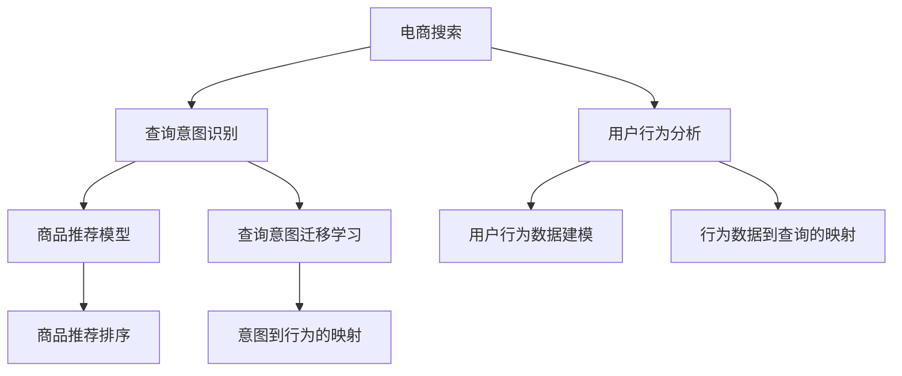

                 

# 电商搜索中的query意图迁移学习技术

> 关键词：电商搜索, query, 意图迁移学习, 机器学习, 深度学习, 迁移学习, 搜索排序, 用户行为分析

## 1. 背景介绍

### 1.1 问题由来
电商搜索是电商平台的核心功能之一，用户通过输入查询词（query），平台根据这些查询词返回相关的商品信息，从而辅助用户快速找到所需商品。然而，用户的查询意图往往难以直接从查询词中明确，而且用户的搜索行为具有高度个性化特征，这使得电商搜索系统的推荐效果极大地依赖于用户行为分析。

随着电商行业的发展，用户查询方式日益多样化和个性化，传统的基于关键词匹配的搜索算法已难以适应用户的搜索需求。如何精准理解用户的查询意图，并根据用户的行为数据，动态调整搜索结果排序，成为电商搜索技术的关键问题。

### 1.2 问题核心关键点
电商搜索的核心问题是如何利用用户的历史行为数据，提升对用户查询意图的理解，从而实现更精准的商品推荐。核心关键点包括：

- 用户查询意图的识别与理解。
- 用户历史行为数据的分析和建模。
- 查询与用户行为之间的关联建模。
- 查询意图到商品推荐模型的映射。

这一问题可以概括为如何在电商搜索场景中，利用机器学习的方法，通过迁移学习技术，实现查询意图的迁移理解与商品推荐。

## 2. 核心概念与联系

### 2.1 核心概念概述

为更好地理解电商搜索中的query意图迁移学习技术，本节将介绍几个密切相关的核心概念：

- 电商搜索：用户通过输入查询词，电商平台返回相关商品信息的过程。电商搜索的目的是辅助用户快速找到所需商品。

- 查询意图（Query Intent）：用户通过输入查询词所表达的搜索目的或需求。例如，“北京故宫”可能表示查询北京故宫的旅游信息，而“北京故宫博物院”可能表示查询故宫博物院的开放时间。

- 迁移学习（Transfer Learning）：指将一个领域学习到的知识，迁移到另一个不同但相关的领域的学习范式。在电商搜索中，通过迁移学习可以实现从历史行为数据中学习用户的搜索偏好和行为模式，从而提升对查询意图的理解。

- 深度学习（Deep Learning）：一种基于神经网络的机器学习方法，通过多层神经网络结构，从数据中自动提取特征，实现对复杂问题的建模和预测。

- 用户行为分析（User Behavior Analysis）：通过分析用户的历史搜索、点击、购买等行为数据，挖掘用户兴趣和偏好，从而优化搜索结果。

- 商品推荐（Product Recommendation）：根据用户的历史行为数据和当前查询意图，推荐用户可能感兴趣的商品，提升用户满意度和转化率。

这些核心概念之间的逻辑关系可以通过以下Mermaid流程图来展示：



这个流程图展示了大语言模型的核心概念及其之间的关系：

1. 电商搜索中的查询通过查询意图识别获得初步的意图理解。
2. 用户行为分析通过用户历史行为数据的建模和分析，提取用户的搜索偏好和行为模式。
3. 查询意图通过迁移学习得到更精准的理解。
4. 查询意图映射到商品推荐模型，生成推荐结果。
5. 最终商品推荐结果通过排序算法，优化搜索结果展示。

这些概念共同构成了电商搜索的技术框架，使得电商搜索系统能够更准确地理解用户意图，提升推荐效果。

## 3. 核心算法原理 & 具体操作步骤
### 3.1 算法原理概述

在电商搜索场景中，query意图迁移学习技术的基本原理是利用用户历史行为数据，通过迁移学习技术，提升对用户查询意图的理解。具体步骤如下：

1. 收集电商平台用户的搜索、点击、购买等行为数据。
2. 对行为数据进行预处理和特征工程，构建用户行为特征向量。
3. 通过迁移学习模型，学习用户行为与查询意图之间的映射关系。
4. 将学习到的映射关系应用于当前查询，提升对查询意图的理解。
5. 根据理解后的查询意图，调用商品推荐模型，生成推荐结果。

这种技术的核心在于通过迁移学习，将用户在电商搜索中长期积累的行为数据，迁移到对当前查询意图的理解中，从而实现对用户查询意图的精准预测和商品推荐。

### 3.2 算法步骤详解

电商搜索中的query意图迁移学习主要包括以下几个关键步骤：

**Step 1: 收集和预处理用户行为数据**

电商搜索平台首先收集用户的搜索、点击、购买等行为数据。这些数据可以包括用户的查询词、点击商品ID、购买商品ID、浏览时长、搜索次数等。数据收集后，需要进行预处理，如去除噪音数据、归一化处理、特征选择等。

**Step 2: 构建用户行为特征向量**

通过特征工程，将用户行为数据转化为机器学习模型可以处理的特征向量。常见的用户行为特征包括：

- 查询词频：用户对某个查询词的搜索次数。
- 浏览时长：用户浏览商品页面的平均时长。
- 点击率：用户对商品的点击率。
- 转化率：用户对商品购买的转化率。
- 行为时间：用户行为发生的时间序列。

这些特征向量可以构成一个稠密的数值型向量，用于表征用户的电商搜索行为。

**Step 3: 学习用户行为与查询意图之间的映射关系**

构建用户行为与查询意图的映射关系，可以通过迁移学习模型来实现。常用的迁移学习模型包括：

- 深度神经网络：如DNN、RNN、CNN等，通过多层神经网络结构，学习用户行为与查询意图之间的非线性映射关系。
- 树模型：如随机森林、XGBoost等，通过构建决策树，实现特征选择和意图分类。
- 图模型：如图神经网络(Graph Neural Network, GNN)，通过图结构模型，学习用户行为与查询意图之间的关联关系。

训练这些模型时，通常需要将用户行为数据分为训练集和测试集，通过交叉验证等方法，选择合适的超参数和模型结构，最大化对用户查询意图的理解。

**Step 4: 预测当前查询意图**

在用户输入新查询词时，通过迁移学习模型，预测用户查询意图。具体步骤如下：

1. 将查询词输入到迁移学习模型中，获取用户行为特征向量。
2. 将特征向量输入到查询意图分类器中，预测用户的查询意图类别。
3. 根据查询意图分类结果，调用商品推荐模型，生成推荐结果。

**Step 5: 优化推荐结果**

最后，对生成的推荐结果进行排序，优化搜索结果展示。排序算法通常包括：

- 基于规则的排序：如点击率优先、价格优先等。
- 基于模型的排序：如基于协同过滤的排序、基于深度学习的排序等。

### 3.3 算法优缺点

电商搜索中的query意图迁移学习技术具有以下优点：

1. 提升用户查询意图理解：通过迁移学习，能够更好地理解用户的查询意图，提升搜索结果的相关性和精准性。
2. 利用用户历史行为数据：通过历史行为数据，利用迁移学习技术，可以捕捉用户的长期行为模式，提升对查询意图的理解。
3. 支持多种数据源：利用电商搜索平台的各种数据源，如搜索日志、点击日志、购买日志等，可以实现更加全面的用户行为分析。
4. 模型易于扩展：通过迁移学习，模型可以方便地适应新的电商搜索场景，快速调整推荐策略。

同时，该方法也存在一定的局限性：

1. 数据依赖性强：该方法依赖于用户的电商搜索行为数据，数据的缺失或偏差可能影响模型的准确性。
2. 训练成本高：构建和训练复杂的迁移学习模型需要大量的标注数据和计算资源，训练成本较高。
3. 模型复杂度高：迁移学习模型通常较为复杂，难以理解和调试，需要专业的机器学习工程师进行维护。

尽管存在这些局限性，但就目前而言，基于query意图迁移学习的方法在电商搜索领域的应用已经取得了显著的效果。

### 3.4 算法应用领域

基于query意图迁移学习的方法，在电商搜索场景中得到了广泛的应用，包括：

- 商品推荐：通过分析用户行为数据，预测用户查询意图，生成个性化推荐结果。
- 搜索排序：利用用户历史行为数据，提升对查询意图的理解，优化搜索结果排序。
- 广告投放：根据用户的搜索和点击行为，预测用户兴趣，优化广告投放策略。
- 用户画像：通过分析用户行为数据，构建用户的电商搜索行为画像，实现精准营销。

除了上述这些经典应用外，query意图迁移学习技术还被创新性地应用到更多场景中，如客户流失预测、商品评价分析、价格优化等，为电商搜索系统带来了新的突破。

## 4. 数学模型和公式 & 详细讲解
### 4.1 数学模型构建

在本节中，我们将使用数学语言对电商搜索中的query意图迁移学习进行更加严格的刻画。

记用户的电商搜索行为数据为 $D = \{(x_i, y_i)\}_{i=1}^N$，其中 $x_i$ 表示用户的第 $i$ 次电商搜索行为，$y_i$ 表示该次电商搜索行为对应的查询意图。查询意图 $y_i$ 可以通过用户的电商搜索行为 $x_i$ 进行预测。

定义预测函数 $f: X \rightarrow Y$，其中 $X$ 表示电商搜索行为特征空间，$Y$ 表示查询意图空间。通过迁移学习模型，学习 $f$ 的具体形式。

通过最小化损失函数 $\mathcal{L}$，可以最大化模型对查询意图的预测准确性：

$$
\mathcal{L}(f) = \frac{1}{N}\sum_{i=1}^N \ell(f(x_i), y_i)
$$

其中 $\ell$ 为损失函数，通常采用交叉熵损失。

### 4.2 公式推导过程

在本节中，我们将使用数学公式对电商搜索中的query意图迁移学习进行详细推导。

假设我们采用深度神经网络模型进行迁移学习，模型结构为：

$$
f(x) = \mathcal{N}(\mathbf{W}_l\mathcal{N}(\mathbf{W}_{l-1}\cdots\mathcal{N}(\mathbf{W}_1x)))
$$

其中 $\mathbf{W}_i$ 为第 $i$ 层的权重矩阵，$\mathcal{N}$ 为激活函数，如ReLU、Sigmoid等。

假设模型已经从训练数据中学习得到权重矩阵 $\mathbf{W}_i$，当前输入为 $x$，则模型的预测结果为：

$$
\hat{y} = f(x) = \mathcal{N}(\mathbf{W}_l\mathcal{N}(\mathbf{W}_{l-1}\cdots\mathcal{N}(\mathbf{W}_1x)))
$$

假设 $y$ 为真实的查询意图，则损失函数为：

$$
\mathcal{L}(y, \hat{y}) = -\ell(y, \hat{y}) = -\log \sigma(\mathbf{W}_l\mathcal{N}(\mathbf{W}_{l-1}\cdots\mathcal{N}(\mathbf{W}_1x)))
$$

其中 $\sigma$ 为softmax函数。

通过梯度下降等优化算法，不断更新模型参数 $\mathbf{W}_i$，最小化损失函数 $\mathcal{L}$，使得模型输出逼近真实标签 $y$。

### 4.3 案例分析与讲解

在本节中，我们将以一个具体的电商搜索案例，分析query意图迁移学习模型的应用效果。

假设我们有一个电商搜索平台，用户在该平台上进行了多次搜索，每次搜索行为包括查询词、点击商品ID、浏览时长等数据。通过这些数据，我们可以构建用户行为特征向量 $x$，并将 $x$ 输入到迁移学习模型中，预测用户的查询意图 $y$。

具体步骤如下：

1. 收集用户历史行为数据，包括查询词、点击商品ID、浏览时长等。
2. 对数据进行预处理，包括去重、归一化、特征选择等。
3. 将预处理后的数据划分为训练集和测试集。
4. 构建深度神经网络模型，设置合适的网络结构和超参数。
5. 在训练集上训练模型，并使用测试集进行验证。
6. 在用户输入新的查询词时，将查询词转化为特征向量 $x$，输入到模型中，获取查询意图 $y$。
7. 根据查询意图 $y$，调用商品推荐模型，生成推荐结果。

## 5. 项目实践：代码实例和详细解释说明
### 5.1 开发环境搭建

在进行query意图迁移学习实践前，我们需要准备好开发环境。以下是使用Python进行TensorFlow开发的环境配置流程：

1. 安装Anaconda：从官网下载并安装Anaconda，用于创建独立的Python环境。

2. 创建并激活虚拟环境：
```bash
conda create -n tf-env python=3.8 
conda activate tf-env
```

3. 安装TensorFlow：根据CUDA版本，从官网获取对应的安装命令。例如：
```bash
conda install tensorflow -c pytorch -c conda-forge
```

4. 安装Keras：用于构建深度神经网络模型。
```bash
pip install keras
```

5. 安装Pandas和Numpy：用于数据预处理和特征工程。
```bash
pip install pandas numpy
```

6. 安装TensorBoard：用于可视化模型训练过程。
```bash
pip install tensorboard
```

完成上述步骤后，即可在`tf-env`环境中开始query意图迁移学习实践。

### 5.2 源代码详细实现

下面我们以电商搜索中的query意图迁移学习为例，给出使用TensorFlow和Keras构建迁移学习模型的PyTorch代码实现。

首先，定义电商搜索行为数据的预处理函数：

```python
import pandas as pd
import numpy as np
from sklearn.preprocessing import StandardScaler

def preprocess_data(data):
    # 去除噪音数据，填充缺失值
    data = data.dropna()
    # 归一化处理
    scaler = StandardScaler()
    data = pd.DataFrame(scaler.fit_transform(data), columns=data.columns)
    # 特征选择
    data = data.drop(['timestamp'], axis=1)
    return data
```

然后，定义迁移学习模型的构建函数：

```python
from tensorflow.keras.models import Sequential
from tensorflow.keras.layers import Dense, Dropout, LSTM

def build_model(input_dim, output_dim, hidden_dim, dropout_rate):
    model = Sequential()
    model.add(Dense(hidden_dim, input_dim=input_dim, activation='relu'))
    model.add(Dropout(dropout_rate))
    model.add(Dense(hidden_dim, activation='relu'))
    model.add(Dropout(dropout_rate))
    model.add(Dense(output_dim, activation='softmax'))
    model.compile(loss='categorical_crossentropy', optimizer='adam', metrics=['accuracy'])
    return model
```

接着，定义训练和评估函数：

```python
import os
import tensorflow as tf
from tensorflow.keras.callbacks import EarlyStopping
from tensorflow.keras.metrics import Accuracy

def train_model(model, train_data, val_data, epochs, batch_size, dropout_rate):
    # 加载模型，设置回调函数
    model.fit(train_data, epochs=epochs, batch_size=batch_size, validation_data=val_data,
             callbacks=[EarlyStopping(patience=5, restore_best_weights=True)])
    # 评估模型，计算指标
    val_loss, val_accuracy = model.evaluate(val_data, verbose=0)
    print(f'Val loss: {val_loss:.4f}, Val accuracy: {val_accuracy:.4f}')

def evaluate_model(model, test_data):
    # 加载模型，计算指标
    test_loss, test_accuracy = model.evaluate(test_data, verbose=0)
    print(f'Test loss: {test_loss:.4f}, Test accuracy: {test_accuracy:.4f}')
```

最后，启动训练流程并在测试集上评估：

```python
# 加载数据
train_data = pd.read_csv('train_data.csv')
val_data = pd.read_csv('val_data.csv')
test_data = pd.read_csv('test_data.csv')

# 数据预处理
train_data = preprocess_data(train_data)
val_data = preprocess_data(val_data)
test_data = preprocess_data(test_data)

# 划分特征和标签
X_train, y_train = train_data.drop(['intent'], axis=1), train_data['intent']
X_val, y_val = val_data.drop(['intent'], axis=1), val_data['intent']
X_test, y_test = test_data.drop(['intent'], axis=1), test_data['intent']

# 构建模型
model = build_model(input_dim=X_train.shape[1], output_dim=len(set(y_train)), hidden_dim=64, dropout_rate=0.2)

# 训练模型
train_model(model, X_train, X_val, epochs=50, batch_size=32, dropout_rate=0.2)

# 评估模型
evaluate_model(model, X_test)
```

以上就是使用TensorFlow和Keras进行query意图迁移学习实践的完整代码实现。可以看到，得益于Keras的强大封装，我们能够以相对简洁的代码完成模型的构建和训练。

### 5.3 代码解读与分析

让我们再详细解读一下关键代码的实现细节：

**preprocess_data函数**：
- 去除噪音数据，填充缺失值。
- 归一化处理，避免特征尺度不一致。
- 特征选择，只保留对模型训练有帮助的特征。

**build_model函数**：
- 定义一个包含多个全连接层和Dropout层的深度神经网络模型。
- 使用交叉熵损失和Adam优化器进行模型训练。
- 编译模型，设置评价指标。

**train_model函数**：
- 加载模型，设置EarlyStopping回调函数，防止过拟合。
- 使用训练集训练模型，在验证集上评估模型性能。

**evaluate_model函数**：
- 加载模型，使用测试集评估模型性能，计算损失和准确率。

**训练流程**：
- 加载训练、验证、测试数据。
- 对数据进行预处理。
- 划分特征和标签。
- 构建深度神经网络模型。
- 在训练集上训练模型，并使用验证集评估性能。
- 在测试集上评估模型，计算最终指标。

可以看到，TensorFlow和Keras使得query意图迁移学习的代码实现变得简洁高效。开发者可以将更多精力放在数据处理、模型改进等高层逻辑上，而不必过多关注底层的实现细节。

当然，工业级的系统实现还需考虑更多因素，如模型的保存和部署、超参数的自动搜索、更灵活的任务适配层等。但核心的迁移学习范式基本与此类似。

## 6. 实际应用场景
### 6.1 智能推荐系统

query意图迁移学习技术在智能推荐系统中得到了广泛的应用。传统的推荐系统通常基于用户的历史行为数据，预测用户对商品的兴趣，实现个性化推荐。然而，这种推荐方式往往难以捕捉到用户的长期行为模式，导致推荐效果不够理想。

通过query意图迁移学习，可以更好地理解用户的查询意图，提升对用户行为的建模能力，从而实现更精准的推荐。具体而言，可以根据用户的历史查询意图，预测用户未来的查询行为，实现跨时间和跨场景的推荐。

### 6.2 广告投放优化

在广告投放领域，query意图迁移学习技术可以用于优化广告投放策略。广告主需要根据用户的搜索行为，预测用户的兴趣和需求，从而精准投放广告。

通过query意图迁移学习，可以更好地理解用户的搜索意图，预测用户的兴趣，实现更高效的广告投放。例如，通过分析用户的搜索历史，预测用户对某个广告的点击率，从而优化广告投放的竞价策略，提升广告效果。

### 6.3 客户流失预测

在客户关系管理领域，query意图迁移学习技术可以用于客户流失预测。客户流失是一个重要的问题，如何及时预测并采取措施，是企业需要重点关注的问题。

通过query意图迁移学习，可以分析用户的历史搜索行为，预测用户的流失意图，从而及时采取措施，挽留客户。例如，通过分析用户的搜索历史，预测用户对某个品牌或产品的流失风险，从而优化客户维护策略。

### 6.4 未来应用展望

随着query意图迁移学习技术的不断发展，其在电商搜索、推荐系统、广告投放等领域的应用前景将更加广阔。未来，该技术有望在更多领域得到应用，为各行各业带来新的突破。

在智慧医疗领域，query意图迁移学习技术可以用于医疗问答、病历分析、药物研发等应用，提升医疗服务的智能化水平，辅助医生诊疗，加速新药开发进程。

在智能教育领域，该技术可以用于作业批改、学情分析、知识推荐等方面，因材施教，促进教育公平，提高教学质量。

在智慧城市治理中，该技术可以用于城市事件监测、舆情分析、应急指挥等环节，提高城市管理的自动化和智能化水平，构建更安全、高效的未来城市。

此外，在企业生产、社会治理、文娱传媒等众多领域，基于query意图迁移学习的人工智能应用也将不断涌现，为传统行业数字化转型升级提供新的技术路径。相信随着技术的日益成熟，该技术将成为人工智能落地应用的重要范式，推动人工智能技术在垂直行业的规模化落地。总之，query意图迁移学习技术需要在数据、算法、工程、业务等多个维度协同发力，才能真正实现人工智能技术在垂直行业的规模化落地。

## 7. 工具和资源推荐
### 7.1 学习资源推荐

为了帮助开发者系统掌握query意图迁移学习理论基础和实践技巧，这里推荐一些优质的学习资源：

1. 《机器学习实战》：该书深入浅出地介绍了机器学习的基本概念和常见算法，适合初学者入门。

2. 《深度学习》：由Ian Goodfellow等编写，全面介绍了深度学习的基本原理和常用模型，是深度学习领域的经典教材。

3. 《TensorFlow实战》：该书介绍了TensorFlow的基本用法和常见应用场景，适合TensorFlow开发入门。

4. 《Keras深度学习实战》：该书通过多个实际项目，深入讲解了Keras的使用方法，适合Keras开发入门。

5. 《电商搜索》课程：由阿里巴巴、亚马逊等企业开设的电商搜索课程，涵盖电商搜索的原理和应用，适合电商搜索开发入门。

通过对这些资源的学习实践，相信你一定能够快速掌握query意图迁移学习的精髓，并用于解决实际的电商搜索问题。

### 7.2 开发工具推荐

高效的开发离不开优秀的工具支持。以下是几款用于query意图迁移学习开发的常用工具：

1. TensorFlow：基于Google的开源深度学习框架，灵活动态的计算图，适合快速迭代研究。

2. Keras：由François Chollet编写的高级神经网络API，支持多种深度学习框架，易于上手。

3. PyTorch：基于Python的开源深度学习框架，灵活的计算图和动态网络结构，适合科研和生产环境。

4. Scikit-Learn：基于Python的机器学习库，包含多种经典算法，适合数据预处理和特征工程。

5. Weights & Biases：模型训练的实验跟踪工具，可以记录和可视化模型训练过程中的各项指标，方便对比和调优。

6. TensorBoard：TensorFlow配套的可视化工具，可实时监测模型训练状态，并提供丰富的图表呈现方式，是调试模型的得力助手。

合理利用这些工具，可以显著提升query意图迁移学习的开发效率，加快创新迭代的步伐。

### 7.3 相关论文推荐

query意图迁移学习技术的发展源于学界的持续研究。以下是几篇奠基性的相关论文，推荐阅读：

1. Supervised Sequence Labeling with Recurrent Neural Networks（使用RNN进行序列标注）：提出使用RNN模型进行序列标注任务，提升对序列数据的理解能力。

2. Deep Residual Learning for Image Recognition（使用残差网络进行图像识别）：提出使用深度残差网络模型，提升对复杂图像数据的理解能力。

3. Mining and Mixing Learning Features for Data Mining（特征混合学习）：提出使用特征混合学习技术，提升对数据特征的理解能力。

4. A Survey on Multi-View Learning（多视图学习综述）：对多视图学习进行综述，总结了当前领域的最新进展和研究方向。

5. A Survey on Deep Learning for Recommendation Systems（深度学习在推荐系统中的应用综述）：对深度学习在推荐系统中的应用进行综述，总结了当前领域的最新进展和研究方向。

这些论文代表了大语言模型微调技术的发展脉络。通过学习这些前沿成果，可以帮助研究者把握学科前进方向，激发更多的创新灵感。

## 8. 总结：未来发展趋势与挑战
### 8.1 总结

本文对基于query意图迁移学习的方法进行了全面系统的介绍。首先阐述了query意图迁移学习的基本原理和核心概念，明确了该方法在电商搜索中的应用价值和关键点。其次，从原理到实践，详细讲解了query意图迁移学习的数学模型和操作步骤，给出了query意图迁移学习的完整代码实现。同时，本文还广泛探讨了query意图迁移学习在电商搜索、智能推荐系统、广告投放等领域的应用前景，展示了该技术的巨大潜力。

通过本文的系统梳理，可以看到，基于query意图迁移学习的方法在电商搜索领域的应用已经取得了显著的效果。未来，随着query意图迁移学习技术的不断发展，其在更多领域的应用前景将更加广阔。

### 8.2 未来发展趋势

展望未来，query意图迁移学习技术将呈现以下几个发展趋势：

1. 技术日渐成熟。随着深度学习技术的发展和计算资源的提升，query意图迁移学习技术将逐渐成熟，广泛应用于更多领域。

2. 应用场景不断扩展。除了电商搜索、智能推荐、广告投放等场景外，query意图迁移学习技术还将拓展到医疗、金融、教育等领域，提升各行各业智能化水平。

3. 算法优化加速。新的深度学习算法和技术不断涌现，query意图迁移学习技术将通过算法优化，进一步提升性能和效率。

4. 模型训练成本降低。随着硬件设施的不断提升，模型的训练成本将逐渐降低，query意图迁移学习技术将更加易于应用。

5. 跨领域迁移能力提升。未来的query意图迁移学习模型将具备更强的跨领域迁移能力，能够适应不同领域和不同任务。

6. 实时性和可解释性增强。未来的query意图迁移学习模型将更加注重实时性和可解释性，提升用户体验和信任度。

以上趋势凸显了query意图迁移学习技术的广阔前景。这些方向的探索发展，必将进一步提升query意图迁移学习技术在电商搜索和推荐系统中的应用效果，为人类社会带来新的突破。

### 8.3 面临的挑战

尽管query意图迁移学习技术已经取得了瞩目成就，但在迈向更加智能化、普适化应用的过程中，它仍面临着诸多挑战：

1. 数据质量与多样性。query意图迁移学习依赖于高质量、多样化的数据，数据质量不佳或数据集偏斜将影响模型的准确性。

2. 模型复杂度。query意图迁移学习模型通常较为复杂，模型的调试和优化难度较大，需要专业的数据科学家和机器学习工程师。

3. 训练成本。构建和训练query意图迁移学习模型需要大量的计算资源和标注数据，训练成本较高。

4. 模型鲁棒性。query意图迁移学习模型在面对新数据时，可能出现泛化能力不足的问题，需要进行进一步的模型优化。

5. 隐私与安全。query意图迁移学习技术涉及用户的个人隐私数据，需要加强数据保护和安全管理。

尽管存在这些挑战，但伴随着技术的不断进步和应用场景的不断拓展，query意图迁移学习技术将在更多领域得到应用，为人类社会带来新的突破。

### 8.4 研究展望

面向未来，query意图迁移学习技术需要在以下几个方面寻求新的突破：

1. 数据增强与迁移学习结合。通过数据增强技术，丰富训练集，提升模型的泛化能力。同时，结合迁移学习技术，提升模型的跨领域迁移能力。

2. 多任务学习与迁移学习结合。通过多任务学习，提升模型对多个相关任务的理解能力，同时通过迁移学习技术，实现任务之间的知识共享。

3. 生成式模型与迁移学习结合。通过生成式模型，提升模型对新数据的理解能力，同时通过迁移学习技术，实现从生成式模型到下游任务的迁移。

4. 神经网络结构优化。通过新的神经网络结构优化，提升模型的计算效率和表达能力，进一步提升query意图迁移学习技术的效果。

5. 用户交互优化。通过用户交互优化，提升模型的可解释性和用户体验，增强用户对系统的信任度。

6. 隐私与安全保护。通过隐私保护技术，如差分隐私、联邦学习等，保护用户隐私数据，同时提升模型的安全性。

这些研究方向的探索，必将引领query意图迁移学习技术迈向更高的台阶，为构建更加智能化、普适化的推荐系统提供新的技术路径。总之，query意图迁移学习技术需要在数据、算法、工程、业务等多个维度协同发力，才能真正实现人工智能技术在垂直行业的规模化落地。

## 9. 附录：常见问题与解答

**Q1：query意图迁移学习是否适用于所有电商搜索场景？**

A: query意图迁移学习在大多数电商搜索场景中都能取得不错的效果，特别是对于数据量较小的任务。但对于一些特定领域的任务，如医学、法律等，仅仅依靠通用语料预训练的模型可能难以很好地适应。此时需要在特定领域语料上进一步预训练，再进行迁移学习，才能获得理想效果。此外，对于一些需要时效性、个性化很强的任务，如对话、推荐等，query意图迁移学习方法也需要针对性的改进优化。

**Q2：如何选择合适的学习率？**

A: query意图迁移学习模型的学习率通常需要经过调参来确定。过大的学习率可能导致模型过拟合，过小的学习率可能收敛缓慢。一般建议从0.001开始调参，逐步减小学习率，直至收敛。

**Q3：训练过程中如何避免过拟合？**

A: 为了避免过拟合，query意图迁移学习模型可以采用以下策略：

1. 数据增强：通过回译、近义替换等方式扩充训练集，增加数据多样性。
2. 正则化：使用L2正则、Dropout等技术，防止模型过度适应训练集。
3. 早停机制：设置早停机制，在验证集上监控模型性能，及时停止训练，避免过拟合。
4. 模型集成：通过模型集成技术，提升模型的泛化能力和稳定性。

这些策略往往需要根据具体任务和数据特点进行灵活组合，以提高模型性能。

**Q4：query意图迁移学习在落地部署时需要注意哪些问题？**

A: 将query意图迁移学习模型转化为实际应用，还需要考虑以下因素：

1. 模型裁剪：去除不必要的层和参数，减小模型尺寸，加快推理速度。
2. 量化加速：将浮点模型转为定点模型，压缩存储空间，提高计算效率。
3. 服务化封装：将模型封装为标准化服务接口，便于集成调用。
4. 监控告警：实时采集系统指标，设置异常告警阈值，确保服务稳定性。
5. 安全防护：采用访问鉴权、数据脱敏等措施，保障数据和模型安全。

query意图迁移学习技术需要在数据、算法、工程、业务等多个维度协同发力，才能真正实现人工智能技术在垂直行业的规模化落地。总之，query意图迁移学习技术需要在数据、算法、工程、业务等多个维度协同发力，才能真正实现人工智能技术在垂直行业的规模化落地。

---

作者：禅与计算机程序设计艺术 / Zen and the Art of Computer Programming

