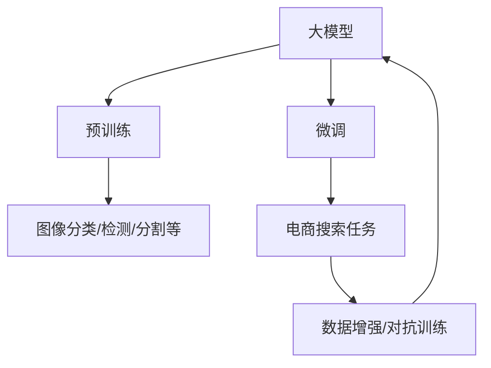

                 

# 电商搜索中的图像识别：AI大模型方案

> 关键词：电商搜索,图像识别,大模型方案,算法原理,具体步骤,应用领域

## 1. 背景介绍

### 1.1 问题由来

在电商行业中，图像识别技术的应用场景非常广泛，从商品推荐到假货识别，再到客户反馈处理，图像识别的准确性和效率对用户体验和商家收益有重要影响。然而，传统的图像识别技术往往依赖于大规模人工标注数据进行训练，需要耗费大量人力和时间，且在实时性和泛化能力上存在不足。

近年来，随着深度学习技术和大模型的发展，大规模预训练的图像识别模型逐渐进入电商企业的视野。这些模型通过在大规模图像数据上进行预训练，学习到丰富的图像语义和特征，能够直接用于电商搜索、质量检测等任务，极大地降低了标注成本和开发难度。

### 1.2 问题核心关键点

大模型在电商搜索中的应用，主要基于两个关键步骤：

1. **预训练**：在大规模无标签图像数据上预训练，学习图像的高级语义和特征。
2. **微调**：在电商任务相关的标注数据上微调，提升模型针对电商搜索任务的性能。

预训练-微调（Pre-training and Fine-tuning, PF）过程是提升大模型在电商搜索中应用效果的有效手段。通过预训练，模型获得了通用的图像表征能力，微调则针对特定任务进行了参数优化，提升了模型的泛化性能和应用效果。

### 1.3 问题研究意义

电商搜索中的图像识别，不仅是提高用户体验的重要手段，也是电商平台降低运营成本、提升服务质量的关键技术。大模型方案通过预训练-微调范式，显著降低了电商企业在图像识别技术上的开发和维护成本，提高了模型实时性和泛化能力，使得电商搜索更加高效、智能和个性化。

## 2. 核心概念与联系

### 2.1 核心概念概述

电商搜索中的图像识别，主要涉及以下几个关键概念：

- **大模型**：基于大规模预训练和微调优化的图像识别模型。典型模型包括Vision Transformer (ViT)、ResNet等，能够在大规模数据上学习到丰富的图像特征。
- **预训练**：在大规模无标签图像数据上进行自监督学习，学习图像的高级语义和特征。常见的预训练任务包括图像分类、对象检测、语义分割等。
- **微调**：在电商搜索相关的标注数据上，有监督地对预训练模型进行参数更新，使其适应电商搜索任务的具体需求。微调过程包括定义任务适配层、损失函数、优化器等。
- **数据增强**：通过图像旋转、缩放、随机裁剪等方式，增加训练集的多样性，提高模型泛化能力。
- **对抗训练**：引入对抗样本，提高模型鲁棒性，减少过拟合风险。

这些概念之间的关系通过以下Mermaid流程图展示：



这个流程图展示了从预训练到微调的完整流程：

1. 在大规模无标签图像数据上预训练。
2. 在电商搜索任务相关的标注数据上微调。
3. 微调过程中加入数据增强和对抗训练，提升模型泛化能力和鲁棒性。

## 3. 核心算法原理 & 具体操作步骤
### 3.1 算法原理概述

电商搜索中的图像识别，主要基于预训练-微调（PF）范式。预训练阶段，大模型通过在大规模无标签图像数据上进行的自监督学习，学习到图像的高级语义和特征表示。微调阶段，在电商搜索相关的标注数据上，有监督地对预训练模型进行参数更新，使其能够针对特定的电商搜索任务进行高效的图像识别。

具体而言，假设预训练模型为 $M_{\theta}$，其中 $\theta$ 为预训练得到的模型参数。电商搜索任务相关的标注数据集为 $D=\{(x_i,y_i)\}_{i=1}^N$，其中 $x_i$ 为图像数据，$y_i$ 为相应的标签。微调的目标是找到新的模型参数 $\hat{\theta}$，使得模型在电商搜索任务上的性能最大化：

$$
\hat{\theta}=\mathop{\arg\min}_{\theta} \mathcal{L}(M_{\theta},D)
$$

其中 $\mathcal{L}$ 为针对电商搜索任务设计的损失函数，用于衡量模型预测输出与真实标签之间的差异。常见的损失函数包括交叉熵损失、均方误差损失等。

### 3.2 算法步骤详解

基于预训练-微调的图像识别算法，通常包括以下几个关键步骤：

**Step 1: 准备预训练模型和数据集**

- 选择合适的预训练图像识别模型 $M_{\theta}$，如ViT、ResNet等。
- 准备电商搜索任务的标注数据集 $D$，包括图像和标签。标注数据应覆盖电商搜索任务的主要类别，例如商品类别、属性标签等。

**Step 2: 添加任务适配层**

- 根据电商搜索任务类型，在预训练模型的顶层设计合适的输出层和损失函数。
- 对于分类任务，通常在顶层添加线性分类器和交叉熵损失函数。
- 对于检测任务，可以使用RoI池化（Region of Interest Pooling）或特征图分割等方法，输出检测框和类别信息。
- 对于分割任务，通常使用像素级别的分类器输出像素级标签。

**Step 3: 设置微调超参数**

- 选择合适的优化算法及其参数，如 AdamW、SGD 等，设置学习率、批大小、迭代轮数等。
- 设置正则化技术及强度，包括权重衰减、Dropout、Early Stopping等。
- 确定冻结预训练参数的策略，如仅微调顶层，或全部参数都参与微调。

**Step 4: 执行梯度训练**

- 将训练集数据分批次输入模型，前向传播计算损失函数。
- 反向传播计算参数梯度，根据设定的优化算法和学习率更新模型参数。
- 周期性在验证集上评估模型性能，根据性能指标决定是否触发 Early Stopping。
- 重复上述步骤直到满足预设的迭代轮数或 Early Stopping 条件。

**Step 5: 测试和部署**

- 在测试集上评估微调后模型 $M_{\hat{\theta}}$ 的性能，对比微调前后的精度提升。
- 使用微调后的模型对新图像进行推理预测，集成到实际的应用系统中。
- 持续收集新的数据，定期重新微调模型，以适应数据分布的变化。

### 3.3 算法优缺点

电商搜索中的图像识别大模型方案具有以下优点：

- **高效泛化**：大模型通过预训练获取通用语义，微调后针对特定任务进行优化，具有高效泛化能力。
- **降低成本**：预训练-微调范式减少了标注数据的需求，大大降低了标注成本。
- **实时性高**：微调后的模型可以直接部署到电商搜索系统中，实时处理图像数据，提升用户体验。
- **鲁棒性好**：通过数据增强和对抗训练，模型能够应对电商搜索任务中的噪声和干扰。

同时，该方案也存在一定的局限性：

- **模型复杂**：大模型参数量庞大，对计算资源和存储需求较高。
- **过拟合风险**：微调过程中需要防止过拟合，特别是标注数据不足的情况下。
- **推理开销大**：微调后的模型推理开销大，需要平衡计算资源和推理速度的需求。
- **模型可解释性差**：大模型通常是黑盒模型，缺乏可解释性。

尽管存在这些局限性，但就目前而言，大模型方案仍是电商搜索图像识别的主流选择。未来相关研究的重点在于如何进一步降低大模型方案的计算和存储需求，提高模型实时性和可解释性，同时兼顾性能和成本。

### 3.4 算法应用领域

电商搜索中的图像识别大模型方案，已经被广泛应用于多个实际场景中，例如：

- **商品推荐**：通过图像识别技术，自动识别商品图片，并根据图片特征推荐相关商品。
- **假冒伪劣检测**：利用图像识别技术检测商品图片中的假货、质量问题等，提升商家品质控制能力。
- **客户反馈分析**：通过分析用户上传的图片，了解用户的购物体验和需求，改善商家服务质量。
- **个性化推荐**：根据用户上传的图片，分析用户偏好，进行个性化商品推荐。
- **库存管理**：利用图像识别技术实时监控仓库中的商品状态，提高库存管理的自动化和智能化水平。

这些应用场景展示了大模型方案在电商搜索中的广泛应用，为电商企业带来了新的商业模式和技术优势。

## 4. 数学模型和公式 & 详细讲解  
### 4.1 数学模型构建

电商搜索中的图像识别，主要基于预训练-微调范式。假设预训练模型为 $M_{\theta}$，其中 $\theta$ 为预训练得到的模型参数。电商搜索任务相关的标注数据集为 $D=\{(x_i,y_i)\}_{i=1}^N$，其中 $x_i$ 为图像数据，$y_i$ 为相应的标签。微调的目标是找到新的模型参数 $\hat{\theta}$，使得模型在电商搜索任务上的性能最大化：

$$
\hat{\theta}=\mathop{\arg\min}_{\theta} \mathcal{L}(M_{\theta},D)
$$

其中 $\mathcal{L}$ 为针对电商搜索任务设计的损失函数，用于衡量模型预测输出与真实标签之间的差异。常见的损失函数包括交叉熵损失、均方误差损失等。

假设模型的输出为 $\hat{y}=M_{\theta}(x_i)$，与真实标签 $y_i$ 的交叉熵损失函数为：

$$
\ell(M_{\theta}(x_i),y_i) = -y_i\log \hat{y}_i - (1-y_i)\log (1-\hat{y}_i)
$$

在微调过程中，通过梯度下降等优化算法更新模型参数，使得损失函数 $\mathcal{L}$ 最小化。常见的优化算法包括 AdamW、SGD 等，学习率 $\eta$、批大小 $b$、迭代轮数 $T$ 等超参数需要根据具体任务和数据集进行调整。

### 4.2 公式推导过程

以下我们以图像分类任务为例，推导交叉熵损失函数及其梯度的计算公式。

假设模型 $M_{\theta}$ 在输入 $x_i$ 上的输出为 $\hat{y}=M_{\theta}(x_i) \in [0,1]$，表示样本属于某个类别的概率。真实标签 $y_i \in \{0,1\}$。则二分类交叉熵损失函数定义为：

$$
\ell(M_{\theta}(x_i),y_i) = -[y_i\log \hat{y}_i + (1-y_i)\log (1-\hat{y}_i)]
$$

将其代入经验风险公式，得：

$$
\mathcal{L}(\theta) = -\frac{1}{N}\sum_{i=1}^N [y_i\log M_{\theta}(x_i)+(1-y_i)\log(1-M_{\theta}(x_i))]
$$

根据链式法则，损失函数对参数 $\theta_k$ 的梯度为：

$$
\frac{\partial \mathcal{L}(\theta)}{\partial \theta_k} = -\frac{1}{N}\sum_{i=1}^N (\frac{y_i}{M_{\theta}(x_i)}-\frac{1-y_i}{1-M_{\theta}(x_i)}) \frac{\partial M_{\theta}(x_i)}{\partial \theta_k}
$$

其中 $\frac{\partial M_{\theta}(x_i)}{\partial \theta_k}$ 可进一步递归展开，利用自动微分技术完成计算。

在得到损失函数的梯度后，即可带入参数更新公式，完成模型的迭代优化。重复上述过程直至收敛，最终得到适应电商搜索任务的最优模型参数 $\hat{\theta}$。

## 5. 项目实践：代码实例和详细解释说明
### 5.1 开发环境搭建

在进行图像识别大模型微调实践前，我们需要准备好开发环境。以下是使用Python进行PyTorch开发的环境配置流程：

1. 安装Anaconda：从官网下载并安装Anaconda，用于创建独立的Python环境。

2. 创建并激活虚拟环境：
```bash
conda create -n pytorch-env python=3.8 
conda activate pytorch-env
```

3. 安装PyTorch：根据CUDA版本，从官网获取对应的安装命令。例如：
```bash
conda install pytorch torchvision torchaudio cudatoolkit=11.1 -c pytorch -c conda-forge
```

4. 安装相关库：
```bash
pip install numpy pandas scikit-learn matplotlib torchvision transformers
```

完成上述步骤后，即可在`pytorch-env`环境中开始微调实践。

### 5.2 源代码详细实现

下面我们以图像分类任务为例，给出使用PyTorch对大模型进行微调的PyTorch代码实现。

首先，定义数据处理函数：

```python
import torch
import torchvision.transforms as transforms
from torch.utils.data import DataLoader
from torchvision import datasets

def load_data(data_path, batch_size=16, num_workers=2):
    transform_train = transforms.Compose([
        transforms.RandomHorizontalFlip(),
        transforms.RandomResizedCrop(224),
        transforms.ToTensor(),
        transforms.Normalize(mean=[0.485, 0.456, 0.406],
                            std=[0.229, 0.224, 0.225])
    ])
    
    transform_test = transforms.Compose([
        transforms.Resize(256),
        transforms.CenterCrop(224),
        transforms.ToTensor(),
        transforms.Normalize(mean=[0.485, 0.456, 0.406],
                            std=[0.229, 0.224, 0.225])
    ])
    
    train_dataset = datasets.ImageFolder(data_path + '/train',
                                        transform=transform_train)
    test_dataset = datasets.ImageFolder(data_path + '/test',
                                       transform=transform_test)
    
    dataloader_train = DataLoader(train_dataset, batch_size=batch_size,
                                 shuffle=True, num_workers=num_workers)
    dataloader_test = DataLoader(test_dataset, batch_size=batch_size,
                                shuffle=False, num_workers=num_workers)
    
    return dataloader_train, dataloader_test
```

然后，定义模型和优化器：

```python
from transformers import ViTForImageClassification, AdamW

model = ViTForImageClassification.from_pretrained('google/vit-base-patch16-224-in21k')
optimizer = AdamW(model.parameters(), lr=5e-5)
```

接着，定义训练和评估函数：

```python
import torch.nn as nn
import torch.optim as optim
import torchvision.models as models

def train_epoch(model, dataloader_train, optimizer, device):
    model.train()
    total_loss = 0
    for images, labels in dataloader_train:
        images, labels = images.to(device), labels.to(device)
        outputs = model(images)
        loss = nn.CrossEntropyLoss()(outputs, labels)
        optimizer.zero_grad()
        loss.backward()
        optimizer.step()
        total_loss += loss.item()
    return total_loss / len(dataloader_train)

def evaluate(model, dataloader_test, device):
    model.eval()
    total_correct = 0
    total_num = 0
    with torch.no_grad():
        for images, labels in dataloader_test:
            images, labels = images.to(device), labels.to(device)
            outputs = model(images)
            _, predicted = torch.max(outputs, 1)
            total_correct += (predicted == labels).sum().item()
            total_num += labels.size(0)
    return total_correct / total_num
```

最后，启动训练流程并在测试集上评估：

```python
epochs = 5
batch_size = 16
num_workers = 2
device = torch.device('cuda') if torch.cuda.is_available() else torch.device('cpu')

for epoch in range(epochs):
    loss = train_epoch(model, dataloader_train, optimizer, device)
    print(f'Epoch {epoch+1}, train loss: {loss:.3f}')
    
    accuracy = evaluate(model, dataloader_test, device)
    print(f'Epoch {epoch+1}, test accuracy: {accuracy:.3f}')
```

以上就是使用PyTorch对ViT模型进行图像分类任务微调的完整代码实现。可以看到，得益于Transformers库的强大封装，我们可以用相对简洁的代码完成ViT模型的加载和微调。

### 5.3 代码解读与分析

让我们再详细解读一下关键代码的实现细节：

**数据加载函数**：
- `load_data`函数：定义图像数据的加载和预处理流程。将数据集分为训练集和测试集，并进行随机水平翻转、随机裁剪、标准化等预处理操作。

**模型定义**：
- `model`定义：使用ViTForImageClassification模型，设定初始化参数。

**优化器设置**：
- `optimizer`定义：设置AdamW优化器及其参数，如学习率等。

**训练函数**：
- `train_epoch`函数：定义训练过程，对训练集进行批次化加载，计算损失并反向传播更新模型参数。

**评估函数**：
- `evaluate`函数：定义测试过程，对测试集进行批次化加载，计算模型在测试集上的准确率。

**训练流程**：
- `epochs`定义：设定总训练轮数。
- `batch_size`定义：设定每次迭代批次大小。
- `num_workers`定义：设定数据加载时的多线程数。
- `device`定义：设定训练和推理时的设备（GPU或CPU）。

可以看到，PyTorch配合Transformers库使得ViT模型微调的代码实现变得简洁高效。开发者可以将更多精力放在数据处理、模型改进等高层逻辑上，而不必过多关注底层的实现细节。

当然，工业级的系统实现还需考虑更多因素，如模型的保存和部署、超参数的自动搜索、更灵活的任务适配层等。但核心的微调范式基本与此类似。

## 6. 实际应用场景
### 6.1 智能客服系统

电商搜索中的图像识别技术，已经成功应用于智能客服系统中。传统客服往往需要配备大量人力，高峰期响应缓慢，且一致性和专业性难以保证。而使用图像识别技术，可以自动识别用户上传的图片，了解用户的购物体验和需求，智能推荐相关商品，从而大大提升客服系统的效率和用户体验。

在技术实现上，可以收集用户上传的商品图片，使用图像识别模型识别图片中的商品类别，并根据商品类别推荐相关商品。对于无法识别的图片，还可以引入人工审核机制，进一步提升系统的准确性和鲁棒性。如此构建的智能客服系统，能大幅提升客户咨询体验和问题解决效率。

### 6.2 质量检测

大模型在电商搜索中的另一个重要应用是质量检测。通过图像识别技术，电商平台能够自动识别商品图片中的质量问题，如划痕、污渍、变形等，从而及时发现并处理商品质量问题，提升用户体验和商家品质控制能力。

具体而言，可以使用大模型对商品图片进行分类识别，将质量问题图片与正常图片分开，并标记相应的质量问题类型。质量问题图片可以通过人工审核进一步确认，确保准确性。对于确认后的质量问题图片，商家可以采取相应的处理措施，避免用户购买到劣质商品。

### 6.3 个性化推荐

电商搜索中的图像识别技术，还可以用于个性化推荐系统。通过分析用户上传的商品图片，可以了解用户的购物偏好和需求，生成个性化的推荐列表。

具体而言，可以使用大模型对用户上传的商品图片进行分类识别，并根据图片中的商品类别生成推荐列表。对于有特殊需求的个性化商品，还可以在推荐列表中单独列出，满足用户的多样化需求。此外，大模型还可以结合用户的浏览历史、购买记录等行为数据，进一步优化推荐结果，提升用户体验。

### 6.4 未来应用展望

随着大模型和图像识别技术的不断发展，基于微调的图像识别方法将在更多领域得到应用，为电商企业带来新的商业模式和技术优势。

在智能家居领域，图像识别技术可以用于智能家居设备的控制和监测，提升用户的生活体验。在医疗健康领域，图像识别技术可以用于疾病诊断和图像分析，提升医疗服务的智能化水平。在智能交通领域，图像识别技术可以用于自动驾驶、交通监测等，提升交通系统的智能化水平。

总之，基于大模型的图像识别技术，具有广泛的应用前景，必将为各行各业带来新的变革和突破。

## 7. 工具和资源推荐
### 7.1 学习资源推荐

为了帮助开发者系统掌握大模型在电商搜索中的应用，这里推荐一些优质的学习资源：

1. 《深度学习与计算机视觉》系列博文：由深度学习专家撰写，深入浅出地介绍了深度学习在计算机视觉中的基本概念和经典算法。

2. 《自然语言处理综述》书籍：涵盖自然语言处理领域的广泛知识，包括图像识别技术在内的多个方向。

3. PyTorch官方文档：提供了完整的PyTorch库的使用说明和实例，适合初学者和进阶开发者使用。

4. TensorFlow官方文档：提供了TensorFlow库的使用说明和实例，适合深度学习初学者使用。

5. Kaggle竞赛：Kaggle平台上有多个图像识别相关的竞赛，可以通过参加竞赛实践大模型的应用。

通过对这些资源的学习实践，相信你一定能够快速掌握大模型在电商搜索中的应用方法，并用于解决实际的电商问题。
###  7.2 开发工具推荐

高效的开发离不开优秀的工具支持。以下是几款用于大模型微调开发的常用工具：

1. PyTorch：基于Python的开源深度学习框架，灵活动态的计算图，适合快速迭代研究。大部分预训练语言模型都有PyTorch版本的实现。

2. TensorFlow：由Google主导开发的开源深度学习框架，生产部署方便，适合大规模工程应用。同样有丰富的预训练语言模型资源。

3. Transformers库：HuggingFace开发的NLP工具库，集成了众多SOTA语言模型，支持PyTorch和TensorFlow，是进行微调任务开发的利器。

4. Weights & Biases：模型训练的实验跟踪工具，可以记录和可视化模型训练过程中的各项指标，方便对比和调优。与主流深度学习框架无缝集成。

5. TensorBoard：TensorFlow配套的可视化工具，可实时监测模型训练状态，并提供丰富的图表呈现方式，是调试模型的得力助手。

6. Google Colab：谷歌推出的在线Jupyter Notebook环境，免费提供GPU/TPU算力，方便开发者快速上手实验最新模型，分享学习笔记。

合理利用这些工具，可以显著提升大模型微调的开发效率，加快创新迭代的步伐。

### 7.3 相关论文推荐

大模型在电商搜索中的应用，是深度学习领域的研究热点。以下是几篇奠基性的相关论文，推荐阅读：

1. ImageNet Classification with Deep Convolutional Neural Networks：提出使用卷积神经网络（CNN）进行图像分类，开创了深度学习在计算机视觉中的先河。

2. Fine-tuning BERT for Sequence Classification Tasks：提出使用BERT模型进行序列分类任务，展示了预训练-微调范式的有效性。

3. ViT: An Image Is Worth 16x16 Words：提出使用ViT模型进行图像分类任务，展示了Transformer在大规模图像识别中的潜力。

4. Big Image Matters: Generalizing Vision Representations with the ImageNet Pre-training and Fine-tuning Paradigm：进一步探讨了预训练-微调范式在大规模图像识别中的应用，展示了其广泛的泛化性能。

5. BigViT: Make Images Talk: Image Transfer Across Datasets, Domains, and Tasks：提出了BigViT模型，通过预训练-微调范式实现了跨数据集、跨领域和跨任务的图片迁移，展示了其在电商搜索中的应用前景。

这些论文代表了大模型在电商搜索中的应用研究趋势，深入浅出地介绍了相关技术和方法，值得系统学习。

## 8. 总结：未来发展趋势与挑战
### 8.1 总结

本文对基于预训练-微调的电商搜索图像识别方法进行了全面系统的介绍。首先阐述了电商搜索中图像识别技术的背景和意义，明确了预训练-微调范式在大模型方案中的核心作用。其次，从原理到实践，详细讲解了电商搜索图像识别大模型的微调过程，给出了微调任务开发的完整代码实例。同时，本文还探讨了大模型方案在电商搜索中的多个实际应用场景，展示了其广泛的应用前景。

通过本文的系统梳理，可以看到，基于大模型的电商搜索图像识别技术已经实现了从理论到实践的突破，为电商企业带来了新的商业模式和技术优势。未来，随着大模型和图像识别技术的不断发展，基于预训练-微调范式的图像识别技术必将在更多领域得到应用，为电商企业带来新的变革和突破。

### 8.2 未来发展趋势

展望未来，电商搜索中的图像识别技术将呈现以下几个发展趋势：

1. **模型规模持续增大**：随着算力成本的下降和数据规模的扩张，预训练语言模型的参数量还将持续增长。超大规模语言模型蕴含的丰富图像特征，有望支撑更加复杂多变的电商搜索任务。

2. **微调方法日趋多样**：除了传统的全参数微调外，未来会涌现更多参数高效的微调方法，如Prompt-Tuning、LoRA等，在固定大部分预训练参数的情况下，只更新极少量的任务相关参数。

3. **持续学习成为常态**：随着数据分布的不断变化，微调模型也需要持续学习新知识以保持性能。如何在不遗忘原有知识的同时，高效吸收新样本信息，将成为重要的研究课题。

4. **标注成本进一步降低**：受启发于提示学习(Prompt-based Learning)的思路，未来的微调方法将更好地利用大模型的语言理解能力，通过更加巧妙的任务描述，在更少的标注样本上也能实现理想的微调效果。

5. **多模态微调崛起**：当前微调主要聚焦于纯文本数据，未来会进一步拓展到图像、视频、语音等多模态数据微调。多模态信息的融合，将显著提升语言模型对现实世界的理解和建模能力。

6. **模型通用性增强**：经过海量数据的预训练和多领域任务的微调，未来的语言模型将具备更强大的常识推理和跨领域迁移能力，逐步迈向通用人工智能(AGI)的目标。

以上趋势凸显了大模型方案在电商搜索中的广泛应用前景。这些方向的探索发展，必将进一步提升电商搜索系统的性能和应用效果，为电商企业带来新的商业模式和技术优势。

### 8.3 面临的挑战

尽管大模型方案在电商搜索中已经取得了显著成效，但在迈向更加智能化、普适化应用的过程中，仍面临以下挑战：

1. **标注成本瓶颈**：虽然微调降低了标注数据的需求，但对于长尾应用场景，难以获得充足的高质量标注数据，成为制约微调性能的瓶颈。如何进一步降低微调对标注样本的依赖，将是一大难题。

2. **模型鲁棒性不足**：当前微调模型面对域外数据时，泛化性能往往大打折扣。对于测试样本的微小扰动，微调模型的预测也容易发生波动。如何提高微调模型的鲁棒性，避免灾难性遗忘，还需要更多理论和实践的积累。

3. **推理效率有待提高**：大规模语言模型虽然精度高，但在实际部署时往往面临推理速度慢、内存占用大等效率问题。如何在保证性能的同时，简化模型结构，提升推理速度，优化资源占用，将是重要的优化方向。

4. **可解释性亟需加强**：当前微调模型更像是"黑盒"系统，缺乏可解释性。对于医疗、金融等高风险应用，算法的可解释性和可审计性尤为重要。如何赋予微调模型更强的可解释性，将是亟待攻克的难题。

5. **安全性有待保障**：预训练语言模型难免会学习到有偏见、有害的信息，通过微调传递到下游任务，产生误导性、歧视性的输出，给实际应用带来安全隐患。如何从数据和算法层面消除模型偏见，避免恶意用途，确保输出的安全性，也将是重要的研究课题。

6. **知识整合能力不足**：现有的微调模型往往局限于任务内数据，难以灵活吸收和运用更广泛的先验知识。如何让微调过程更好地与外部知识库、规则库等专家知识结合，形成更加全面、准确的信息整合能力，还有很大的想象空间。

正视大模型方案在电商搜索中面临的这些挑战，积极应对并寻求突破，将是大模型方案走向成熟的必由之路。相信随着学界和产业界的共同努力，这些挑战终将一一被克服，大模型方案必将在构建人机协同的智能搜索系统上发挥更大的作用。

### 8.4 研究展望

面对大模型方案在电商搜索中面临的挑战，未来的研究需要在以下几个方面寻求新的突破：

1. **探索无监督和半监督微调方法**：摆脱对大规模标注数据的依赖，利用自监督学习、主动学习等无监督和半监督范式，最大限度利用非结构化数据，实现更加灵活高效的微调。

2. **研究参数高效和计算高效的微调范式**：开发更加参数高效的微调方法，在固定大部分预训练参数的同时，只更新极少量的任务相关参数。同时优化微调模型的计算图，减少前向传播和反向传播的资源消耗，实现更加轻量级、实时性的部署。

3. **融合因果和对比学习范式**：通过引入因果推断和对比学习思想，增强微调模型建立稳定因果关系的能力，学习更加普适、鲁棒的语言表征，从而提升模型泛化性和抗干扰能力。

4. **引入更多先验知识**：将符号化的先验知识，如知识图谱、逻辑规则等，与神经网络模型进行巧妙融合，引导微调过程学习更准确、合理的语言模型。同时加强不同模态数据的整合，实现视觉、语音等多模态信息与文本信息的协同建模。

5. **结合因果分析和博弈论工具**：将因果分析方法引入微调模型，识别出模型决策的关键特征，增强输出解释的因果性和逻辑性。借助博弈论工具刻画人机交互过程，主动探索并规避模型的脆弱点，提高系统稳定性。

6. **纳入伦理道德约束**：在模型训练目标中引入伦理导向的评估指标，过滤和惩罚有偏见、有害的输出倾向。同时加强人工干预和审核，建立模型行为的监管机制，确保输出符合人类价值观和伦理道德。

这些研究方向的探索，必将引领大模型方案在电商搜索中的研究迈向更高的台阶，为电商企业带来新的商业模式和技术优势。面向未来，大模型方案需要在数据、算法、工程、业务等多个维度协同发力，共同推动电商搜索系统的进步。

## 9. 附录：常见问题与解答

**Q1：大模型方案适用于所有电商搜索任务吗？**

A: 大模型方案在大多数电商搜索任务上都能取得不错的效果，特别是对于数据量较小的任务。但对于一些特定领域的任务，如医学、法律等，仅仅依靠通用语料预训练的模型可能难以很好地适应。此时需要在特定领域语料上进一步预训练，再进行微调，才能获得理想效果。此外，对于一些需要时效性、个性化很强的任务，如对话、推荐等，微调方法也需要针对性的改进优化。

**Q2：如何选择合适的学习率？**

A: 微调的学习率一般要比预训练时小1-2个数量级，如果使用过大的学习率，容易破坏预训练权重，导致过拟合。一般建议从1e-5开始调参，逐步减小学习率，直至收敛。也可以使用warmup策略，在开始阶段使用较小的学习率，再逐渐过渡到预设值。需要注意的是，不同的优化器(如AdamW、Adafactor等)以及不同的学习率调度策略，可能需要设置不同的学习率阈值。

**Q3：大模型方案对计算和存储资源有哪些要求？**

A: 大模型方案对计算和存储资源的要求较高。大模型参数量庞大，对GPU/TPU等高性能设备的算力、内存、存储空间等资源需求较高。因此，在部署大模型方案时，需要考虑设备资源的配置和优化，合理分配计算和存储资源。

**Q4：如何缓解微调过程中的过拟合问题？**

A: 过拟合是微调面临的主要挑战，尤其是在标注数据不足的情况下。常见的缓解策略包括：
1. 数据增强：通过图像旋转、缩放、随机裁剪等方式，增加训练集的多样性，提高模型泛化能力。
2. 正则化：使用L2正则、Dropout、Early Stopping等避免过拟合。
3. 对抗训练：引入对抗样本，提高模型鲁棒性，减少过拟合风险。

这些策略往往需要根据具体任务和数据特点进行灵活组合。只有在数据、模型、训练、推理等各环节进行全面优化，才能最大限度地发挥大模型方案的性能。

**Q5：大模型方案在实际应用中需要注意哪些问题？**

A: 将大模型方案转化为实际应用，还需要考虑以下因素：
1. 模型裁剪：去除不必要的层和参数，减小模型尺寸，加快推理速度。
2. 量化加速：将浮点模型转为定点模型，压缩存储空间，提高计算效率。
3. 服务化封装：将模型封装为标准化服务接口，便于集成调用。
4. 弹性伸缩：根据请求流量动态调整资源配置，平衡服务质量和成本。
5. 监控告警：实时采集系统指标，设置异常告警阈值，确保服务稳定性。
6. 安全防护：采用访问鉴权、数据脱敏等措施，保障数据和模型安全。

大模型方案在电商搜索中的应用，需要结合实际业务场景，进行合理的设计和优化，才能真正实现大规模部署和应用。

---

作者：禅与计算机程序设计艺术 / Zen and the Art of Computer Programming

