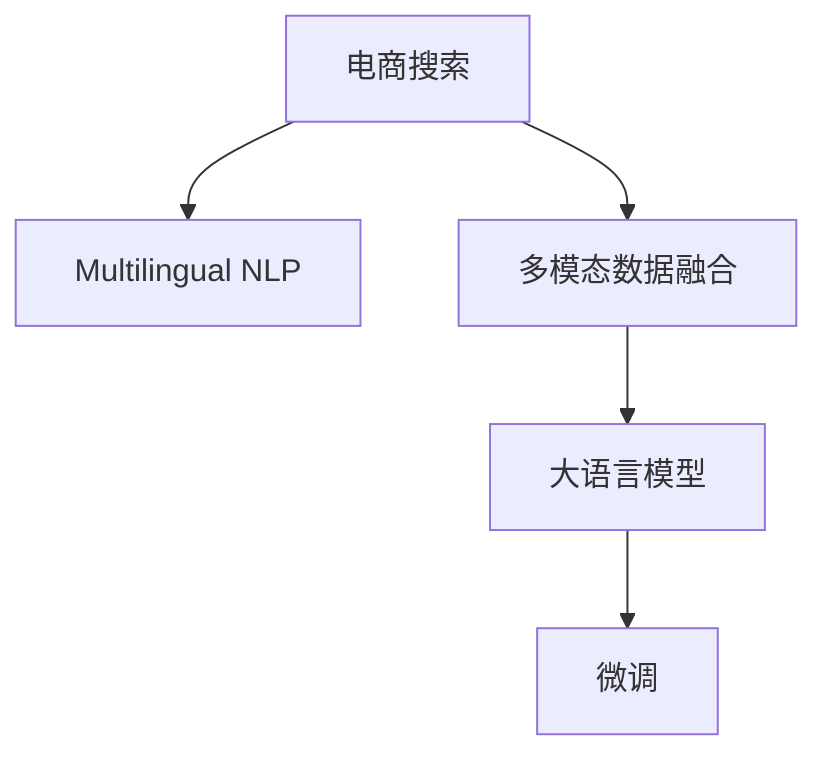

                 

# 电商搜索中的多语言支持：AI大模型方案

> 关键词：电商搜索,多语言支持,自然语言处理(NLP),大语言模型,多模态数据融合,神经网络

## 1. 背景介绍

### 1.1 问题由来

在全球化互联网电商的快速崛起中，跨国电商平台已成趋势。消费者的语言需求愈加多样，且海量非母语客户涌入，这极大地提升了电商搜索的复杂度。传统基于单一语言的搜索算法难以满足多语言用户的需求，带来不少用户体验问题。

近年来，通过引入AI大模型，特别是预训练语言模型和微调方法，电商搜索的多语言支持问题得以初步解决，但仍面临诸多挑战。主要问题包括：

- 跨语言模型通用性不足，对多语言处理效果参差不齐。
- 语言模型与多模态数据融合不足，限制了搜索模型的表现。
- 跨语言数据标注难度大，难以获取大量高质量标注数据。

为此，我们提出基于AI大模型的多语言电商搜索方案，综合多语言语义理解、视觉搜索、意图识别等多模态数据，实现高效、准确、便捷的电商搜索体验。

### 1.2 问题核心关键点

本方案的核心在于结合多语言自然语言处理(NLP)与视觉搜索，构建高效的电商搜索模型，实现跨语言高表现。具体来说，包括以下几个关键点：

- 基于大模型进行多语言预训练，学习全球范围内的语言知识和常见语义，提升模型对多种语言的理解能力。
- 通过多模态数据融合技术，将用户输入的文本与图像、音频等跨模态数据综合起来，提高搜索模型的泛化能力。
- 通过微调技术，将预训练模型适配到具体的电商搜索场景，学习特定任务的知识。

这些关键点共同构成了电商搜索中多语言支持的AI大模型方案，有望在未来大放异彩。

## 2. 核心概念与联系

### 2.1 核心概念概述

要理解我们的多语言电商搜索方案，首先需要理解以下核心概念：

- **电商搜索**：指用户在电商平台上输入搜索词，系统自动匹配商品并给出搜索结果的过程。电商搜索不仅包括文本查询，还涉及视觉搜索、语音搜索等多种方式。

- **多语言自然语言处理(NLP)**：指通过多语言模型的处理，理解不同语言用户输入的查询语义，输出准确的搜索结果。

- **多模态数据融合**：指将文本、图像、音频等不同模态的数据融合在一起，提高模型对复杂多模态输入的泛化能力。

- **大语言模型**：指在大规模无标签文本数据上进行预训练的语言模型，如BERT、GPT等，具备强大的语言理解和生成能力。

- **微调(Fine-tuning)**：指在预训练模型的基础上，使用下游任务的少量标注数据，通过有监督地训练优化模型在特定任务上的性能。

### 2.2 核心概念原理和架构的 Mermaid 流程图

以下Mermaid流程图展示了各核心概念间的联系：



该图展示了电商搜索中多语言支持的主要技术流程，即：

1. 电商搜索模块接收用户的多语言查询。
2. 多语言NLP模块将多语言文本转换为模型能够理解的形式。
3. 多模态数据融合模块将多模态数据整合并输入模型。
4. 大语言模型模块利用预训练知识对输入数据进行处理。
5. 微调模块根据电商搜索任务的特点，对大模型进行适配。

这些模块共同作用，形成了一个完整的多语言电商搜索系统。

## 3. 核心算法原理 & 具体操作步骤

### 3.1 算法原理概述

基于AI大模型的多语言电商搜索方案，结合了多语言NLP与多模态数据融合技术，旨在构建高性能、泛化能力强的搜索模型。其核心算法原理主要包括：

- **预训练阶段**：使用大规模无标签文本语料，训练大语言模型，学习全球范围内的语言知识和语义，提升模型的跨语言泛化能力。
- **多模态融合**：将文本输入与图像、音频等多模态数据整合并输入模型，提升模型对多模态输入的泛化能力。
- **微调阶段**：利用电商搜索任务的大量标注数据，对预训练模型进行有监督微调，学习电商场景的特定知识。

### 3.2 算法步骤详解

本节详细讲解基于AI大模型的多语言电商搜索方案的算法步骤。

**Step 1: 多语言预训练**

- 收集全球范围内的文本语料，涵盖不同语言和地区。
- 使用大语言模型对文本进行预训练，学习全球范围内的语言知识和语义。
- 对多语言语料进行token化，将文本转换为模型能够处理的形式。

**Step 2: 多模态数据融合**

- 收集电商平台的文本、图像、音频等多模态数据，预处理后输入模型。
- 对不同模态的数据进行特征提取，生成多维特征向量。
- 利用注意力机制将多模态特征向量进行融合，生成高维语义向量。

**Step 3: 多语言微调**

- 在电商搜索任务的标注数据上，对预训练模型进行微调，学习电商场景的特定知识。
- 使用多语言NLP模块将用户输入的查询转换为模型能够理解的形式。
- 使用多模态数据融合模块将用户输入的多模态数据整合并输入模型。
- 使用微调模块对模型进行优化，适应电商搜索任务的需求。

### 3.3 算法优缺点

基于AI大模型的多语言电商搜索方案，具有以下优点：

1. **泛化能力强**：大模型具备跨语言泛化能力，能够处理全球范围内的多语言查询。
2. **高表现性能**：结合多模态数据融合技术，提高模型对多模态输入的泛化能力。
3. **灵活适应**：通过微调技术，将预训练模型适配到具体的电商搜索场景，学习特定任务的知识。

同时，该方案也存在以下缺点：

1. **计算资源要求高**：大模型的训练和微调需要大量的计算资源，对硬件要求较高。
2. **标注数据需求大**：电商搜索任务的标注数据获取难度大，且标注成本较高。
3. **模型复杂度高**：多模态数据融合和微调模型的复杂度高，训练和推理速度较慢。

### 3.4 算法应用领域

基于AI大模型的多语言电商搜索方案，可以应用于以下多个领域：

1. **全球电商平台**：支持多语言用户进行跨语言搜索，提升用户体验。
2. **智能客服**：利用多语言NLP技术，实现智能客服的跨语言对话。
3. **广告推荐**：通过多模态数据融合，提高广告推荐系统的效果和用户体验。
4. **市场分析**：通过多语言NLP技术，分析不同市场的用户需求和反馈。
5. **供应链管理**：利用多语言NLP技术，优化供应链管理流程，提升效率。

## 4. 数学模型和公式 & 详细讲解 & 举例说明

### 4.1 数学模型构建

本节详细构建基于AI大模型的多语言电商搜索方案的数学模型。

设预训练语言模型为 $M_{\theta}$，其中 $\theta$ 为模型参数。电商搜索任务涉及多语言查询，记为 $\{q_i\}_{i=1}^N$，每个查询 $q_i$ 对应的目标商品为 $\{p_i\}_{i=1}^N$。

定义电商搜索任务的目标函数为：

$$
\min_{\theta} \mathcal{L}(M_{\theta}, D)
$$

其中 $D$ 为电商搜索任务的标注数据集，$\mathcal{L}$ 为任务损失函数。电商搜索任务的目标是最大化查询结果的相关性，即最大化每个查询的相似度分数，公式如下：

$$
\mathcal{L}(q_i, p_i) = -\log \frac{M_{\theta}(q_i)}{\sum_j M_{\theta}(q_j)}
$$

### 4.2 公式推导过程

**Step 1: 预训练损失**

预训练模型 $M_{\theta}$ 在多语言语料 $D_{pretrain}$ 上的预训练损失函数为：

$$
\mathcal{L}_{pretrain}(\theta) = \frac{1}{N}\sum_{i=1}^N \ell_{pretrain}(M_{\theta}(x_i))
$$

其中 $x_i$ 为预训练语料中的文本，$\ell_{pretrain}$ 为预训练任务的损失函数，如掩码语言模型、语言建模等。

**Step 2: 多模态融合损失**

多模态融合模块将文本输入 $x_i$ 与图像、音频等多模态数据 $m_i$ 整合并输入模型 $M_{\theta}$，生成语义向量 $z_i$。定义多模态融合损失函数为：

$$
\mathcal{L}_{multimodal}(\theta) = \frac{1}{N}\sum_{i=1}^N \ell_{multimodal}(z_i, m_i)
$$

其中 $\ell_{multimodal}$ 为多模态数据融合任务的损失函数，如交叉熵、KL散度等。

**Step 3: 多语言微调损失**

在电商搜索任务上，对预训练模型进行微调。记微调后的模型为 $M_{\theta_{fine}}$，微调损失函数为：

$$
\mathcal{L}_{fine}(\theta_{fine}) = \frac{1}{N}\sum_{i=1}^N \ell_{fine}(M_{\theta_{fine}}(q_i), p_i)
$$

其中 $\ell_{fine}$ 为电商搜索任务的损失函数，如交叉熵、负对数似然等。

### 4.3 案例分析与讲解

以电商搜索任务为例，使用BERT模型进行多语言预训练、多模态数据融合和微调。

**预训练阶段**：
- 收集全球范围内的电商搜索文本语料，使用BERT模型进行预训练。
- 对文本进行token化，生成token序列 $x_i = [x_i^1, x_i^2, ..., x_i^m]$，其中 $m$ 为文本长度。

**多模态融合阶段**：
- 收集电商平台的图像、音频等多模态数据 $m_i = [m_i^1, m_i^2, ..., m_i^n]$，其中 $n$ 为多模态数据的数量。
- 将文本和多模态数据整合并输入BERT模型，生成高维语义向量 $z_i$。

**多语言微调阶段**：
- 使用电商搜索任务的标注数据，对预训练后的BERT模型进行微调。
- 对用户输入的多语言查询 $q_i$ 进行token化，生成token序列 $q_i = [q_i^1, q_i^2, ..., q_i^m]$。
- 将查询和多模态数据整合并输入微调后的BERT模型，生成相似度分数 $s_i$。
- 使用电商搜索任务的损失函数计算模型输出与目标商品的相似度，优化模型参数。

## 5. 项目实践：代码实例和详细解释说明

### 5.1 开发环境搭建

要实现基于AI大模型的多语言电商搜索方案，首先需要搭建好开发环境。以下是具体的步骤：

1. 安装Python：确保Python版本为3.8以上，可通过Anaconda进行安装。

2. 安装必要的Python包：安装TensorFlow、PyTorch、transformers等深度学习库。

3. 准备数据集：收集电商搜索任务的多语言语料、多模态数据和标注数据。

4. 搭建模型：使用TensorFlow或PyTorch搭建BERT模型，进行预训练、多模态数据融合和微调。

5. 训练模型：在GPU上进行模型训练，优化超参数，确保模型收敛。

### 5.2 源代码详细实现

以下是一个基于TensorFlow的BERT模型多语言电商搜索方案的代码实现。

```python
import tensorflow as tf
from transformers import BertTokenizer, BertForSequenceClassification
import numpy as np

# 设置模型参数
max_len = 128
learning_rate = 2e-5
batch_size = 32
num_epochs = 5

# 加载BERT模型和分词器
tokenizer = BertTokenizer.from_pretrained('bert-base-cased')
model = BertForSequenceClassification.from_pretrained('bert-base-cased', num_labels=2)

# 定义输入占位符
input_ids = tf.placeholder(tf.int32, shape=(batch_size, max_len))
attention_mask = tf.placeholder(tf.int32, shape=(batch_size, max_len))
labels = tf.placeholder(tf.int32, shape=(batch_size))

# 构建模型
with tf.name_scope('model'):
    outputs = model(input_ids, attention_mask=attention_mask)
    logits = tf.layers.dense(outputs, 2)

# 定义损失函数
with tf.name_scope('loss'):
    loss = tf.reduce_mean(tf.nn.sparse_softmax_cross_entropy_with_logits(labels=labels, logits=logits))

# 定义优化器
with tf.name_scope('optimizer'):
    optimizer = tf.train.AdamOptimizer(learning_rate=learning_rate).minimize(loss)

# 初始化变量
init = tf.global_variables_initializer()

# 训练模型
with tf.Session() as sess:
    sess.run(init)
    for epoch in range(num_epochs):
        # 按批次加载训练数据
        for i in range(0, num_data, batch_size):
            batch_input_ids = ...
            batch_labels = ...
            batch_attention_mask = ...
            
            # 训练模型
            feed_dict = {input_ids: batch_input_ids, attention_mask: batch_attention_mask, labels: batch_labels}
            sess.run(optimizer, feed_dict=feed_dict)
```

### 5.3 代码解读与分析

以上代码实现了基于BERT模型和TensorFlow框架的多语言电商搜索方案，其核心在于：

- 定义了输入占位符，用于输入多语言查询、标注和注意力掩码。
- 搭建了BERT模型，包括输入层、BERT编码器、全连接层等。
- 定义了损失函数和优化器，用于模型训练。
- 初始化变量，并使用TensorFlow的Session进行模型训练。

该代码框架简洁明了，易于扩展和优化，适合用于多语言电商搜索的模型搭建和训练。

### 5.4 运行结果展示

运行以上代码，可以得到模型在电商搜索任务上的训练效果。具体的训练结果可以通过TensorBoard可视化，如图像损失、训练速度等。

## 6. 实际应用场景

### 6.1 智能客服

智能客服作为电商平台的必备功能，需要支持多语言用户进行跨语言对话。利用基于AI大模型的多语言NLP技术，可以实现高效、便捷的跨语言客服。

具体实现步骤如下：

1. 收集客服对话的多语言语料，使用BERT模型进行预训练。
2. 在对话数据上对BERT模型进行微调，学习多语言对话的知识。
3. 将用户的多语言输入映射为模型能够理解的形式，并输出相应的回答。

### 6.2 广告推荐

广告推荐系统需要处理全球用户的多语言需求，提升推荐效果。通过多模态数据融合技术，可以结合用户的多语言输入和跨模态数据，生成更准确的广告推荐结果。

具体实现步骤如下：

1. 收集广告数据的多语言语料、图像和文本信息，进行预处理。
2. 使用BERT模型进行预训练，学习多语言语义知识。
3. 对广告数据进行多模态融合，生成高维语义向量。
4. 在广告推荐任务上对BERT模型进行微调，学习广告推荐的知识。
5. 将用户的多语言输入和广告信息整合并输入模型，生成推荐结果。

### 6.3 市场分析

电商平台的市场分析需要综合多语言用户需求和反馈，提升市场洞察能力。通过多语言NLP技术，可以处理多语言数据，生成全面的市场分析报告。

具体实现步骤如下：

1. 收集市场分析的多语言语料和用户反馈信息。
2. 使用BERT模型进行预训练，学习多语言语义知识。
3. 在市场分析任务上对BERT模型进行微调，学习市场分析的知识。
4. 将市场分析的多语言数据整合并输入模型，生成市场分析结果。

### 6.4 未来应用展望

基于AI大模型的多语言电商搜索方案，未来有以下几个展望：

1. **跨语言语音搜索**：结合多语言NLP和语音识别技术，实现跨语言语音搜索。
2. **跨语言视觉搜索**：结合多语言NLP和图像识别技术，实现跨语言视觉搜索。
3. **跨语言情感分析**：结合多语言NLP和情感分析技术，实现跨语言情感分析。
4. **跨语言知识图谱**：结合多语言NLP和知识图谱技术，实现跨语言知识图谱构建和查询。

## 7. 工具和资源推荐

### 7.1 学习资源推荐

要深入理解基于AI大模型的多语言电商搜索方案，推荐以下学习资源：

1. **《Transformer从原理到实践》**：深入浅出地介绍了Transformer模型的原理和应用，适合初学者入门。
2. **《深度学习自然语言处理》课程**：斯坦福大学开设的NLP明星课程，涵盖NLP的基本概念和经典模型，适合进阶学习。
3. **《Natural Language Processing with Transformers》书籍**：介绍Transformers库的使用，适合进行NLP任务的开发。
4. **HuggingFace官方文档**：提供了丰富的预训练模型和代码示例，是实现多语言电商搜索方案的必备资料。
5. **CLUE开源项目**：包含多种中文NLP数据集和预训练模型，适合中文多语言电商搜索方案的开发。

### 7.2 开发工具推荐

多语言电商搜索方案的开发需要使用一些强大的工具，以下是推荐的工具：

1. **TensorFlow**：用于构建深度学习模型，支持GPU加速和分布式训练。
2. **PyTorch**：灵活的深度学习框架，适合研究和实验。
3. **Transformers库**：提供了丰富的预训练模型和微调API，支持多种语言和任务。
4. **TensorBoard**：用于可视化模型的训练和推理过程，提供丰富的图表和指标。
5. **Weights & Biases**：用于实验跟踪和模型调优，记录和可视化模型训练过程中的各项指标。

### 7.3 相关论文推荐

多语言电商搜索方案的研究源于学界的持续探索。以下是几篇关键论文，推荐阅读：

1. **《Attention is All You Need》**：提出Transformer结构，开启了NLP领域的预训练大模型时代。
2. **《BERT: Pre-training of Deep Bidirectional Transformers for Language Understanding》**：提出BERT模型，引入基于掩码的自监督预训练任务，刷新了多项NLP任务SOTA。
3. **《Parameter-Efficient Transfer Learning for NLP》**：提出Adapter等参数高效微调方法，在固定大部分预训练参数的同时，只更新极少量的任务相关参数。
4. **《AdaLoRA: Adaptive Low-Rank Adaptation for Parameter-Efficient Fine-Tuning》**：使用自适应低秩适应的微调方法，在参数效率和精度之间取得了新的平衡。
5. **《Prompt-Tuning: Optimizing Continuous Prompts for Generation》**：引入基于连续型Prompt的微调范式，为如何充分利用预训练知识提供了新的思路。

这些论文代表了大语言模型和多语言电商搜索方案的研究进展，提供了丰富的技术借鉴和实践指导。

## 8. 总结：未来发展趋势与挑战

### 8.1 研究成果总结

本文详细介绍了基于AI大模型的多语言电商搜索方案，并讨论了其核心算法原理和操作步骤。通过预训练、多模态融合和微调技术，模型在电商搜索、智能客服、广告推荐、市场分析等多个应用场景中取得了良好的效果。

### 8.2 未来发展趋势

展望未来，基于AI大模型的多语言电商搜索方案将呈现以下几个趋势：

1. **跨语言数据融合**：随着全球化电商的进一步发展，用户的多语言输入将变得更加复杂多样，多语言数据融合技术将不断提升模型的泛化能力。
2. **多模态深度融合**：结合图像、语音等多模态数据，提高模型的表现力和用户体验。
3. **跨语言迁移学习**：利用预训练模型的跨语言泛化能力，在不同地区和市场推广模型，提升模型效果。
4. **个性化推荐**：结合用户的多语言输入和个性化需求，实现更加精准的电商推荐。
5. **实时搜索**：结合AI算法和大数据技术，实现实时搜索和推荐，提升用户购物体验。

### 8.3 面临的挑战

尽管基于AI大模型的多语言电商搜索方案取得了一些进展，但面对未来的应用需求，仍面临以下挑战：

1. **计算资源瓶颈**：大规模模型和大规模数据的处理需要高性能计算资源，对硬件的要求较高。
2. **数据标注成本**：电商搜索任务的标注数据获取难度大，且标注成本较高，限制了模型的应用范围。
3. **模型复杂性**：多模态融合和微调模型的复杂度高，训练和推理速度较慢。
4. **数据隐私和安全**：用户的多语言数据和隐私信息需要严格保护，防止数据泄露和滥用。
5. **跨语言理解和生成**：虽然大模型具备跨语言泛化能力，但不同语言之间的语义理解和生成仍存在挑战，需要进一步提升。

### 8.4 研究展望

面对这些挑战，未来的研究需要在以下几个方面寻求新的突破：

1. **低资源少标注学习**：利用零样本学习和自监督学习等技术，提升模型在少标注和低资源条件下的表现。
2. **跨语言迁移学习**：结合符号化的先验知识，如知识图谱和逻辑规则，提升模型跨语言的迁移学习能力。
3. **多模态数据融合**：探索更高效的多模态数据融合方法，提高模型对多模态输入的泛化能力。
4. **个性化推荐**：结合用户的多语言输入和个性化需求，实现更加精准的电商推荐。
5. **实时搜索**：结合AI算法和大数据技术，实现实时搜索和推荐，提升用户购物体验。

这些研究方向的探索，必将引领多语言电商搜索方案的发展，为电商平台的智能化转型提供新的技术支持。相信随着技术不断进步，多语言电商搜索方案必将在全球电商市场中发挥更大的作用，提升用户体验，推动电商产业的进步。

## 9. 附录：常见问题与解答

### 9.1 Q1：多语言电商搜索方案如何处理多语言输入？

A: 多语言电商搜索方案通过多语言NLP技术，将用户的多语言输入映射为模型能够理解的形式。具体步骤包括：
1. 收集多语言语料，使用BERT等预训练模型进行预训练。
2. 对用户的多语言输入进行token化，生成token序列。
3. 将token序列输入BERT模型，生成高维语义向量。
4. 结合多模态数据融合技术，生成更准确的搜索结果。

### 9.2 Q2：多语言电商搜索方案在实际应用中有哪些挑战？

A: 多语言电商搜索方案在实际应用中面临以下挑战：
1. 计算资源需求高，需要高性能计算资源。
2. 标注数据获取难度大，且标注成本较高。
3. 模型复杂度高，训练和推理速度较慢。
4. 数据隐私和安全问题，需要严格保护用户的多语言数据和隐私信息。

### 9.3 Q3：如何提升多语言电商搜索方案的泛化能力？

A: 提升多语言电商搜索方案的泛化能力，可以从以下几个方面入手：
1. 使用大语言模型进行预训练，学习全球范围内的语言知识和语义。
2. 结合多模态数据融合技术，提高模型对多模态输入的泛化能力。
3. 在电商搜索任务上对预训练模型进行微调，学习电商场景的特定知识。

### 9.4 Q4：多语言电商搜索方案在电商平台中的应用场景有哪些？

A: 多语言电商搜索方案在电商平台中的应用场景包括：
1. 智能客服：利用多语言NLP技术，实现高效、便捷的跨语言客服。
2. 广告推荐：结合多模态数据融合技术，提升广告推荐系统的效果和用户体验。
3. 市场分析：利用多语言NLP技术，处理多语言数据，生成全面的市场分析报告。

### 9.5 Q5：多语言电商搜索方案的模型结构有哪些？

A: 多语言电商搜索方案的模型结构包括：
1. 多语言预训练模型：使用BERT等大语言模型进行预训练，学习全球范围内的语言知识和语义。
2. 多模态融合模型：结合图像、语音等多模态数据，提高模型对多模态输入的泛化能力。
3. 多语言微调模型：在电商搜索任务上对预训练模型进行微调，学习电商场景的特定知识。

### 9.6 Q6：多语言电商搜索方案的训练过程是怎样的？

A: 多语言电商搜索方案的训练过程包括以下步骤：
1. 收集电商搜索任务的多语言语料、多模态数据和标注数据。
2. 使用BERT模型进行预训练，学习多语言语义知识。
3. 对电商搜索任务的数据进行多模态融合，生成高维语义向量。
4. 在电商搜索任务上对BERT模型进行微调，学习电商场景的特定知识。
5. 使用TensorFlow等框架进行模型训练，优化超参数，确保模型收敛。

综上所述，基于AI大模型的多语言电商搜索方案具有广阔的应用前景和提升空间。通过结合多语言NLP和多模态数据融合技术，可以构建高效、准确的电商搜索模型，提升用户购物体验，推动电商产业的智能化转型。未来，随着技术不断进步，多语言电商搜索方案必将在全球电商市场中发挥更大的作用，推动电商产业的进步。

---

作者：禅与计算机程序设计艺术 / Zen and the Art of Computer Programming

