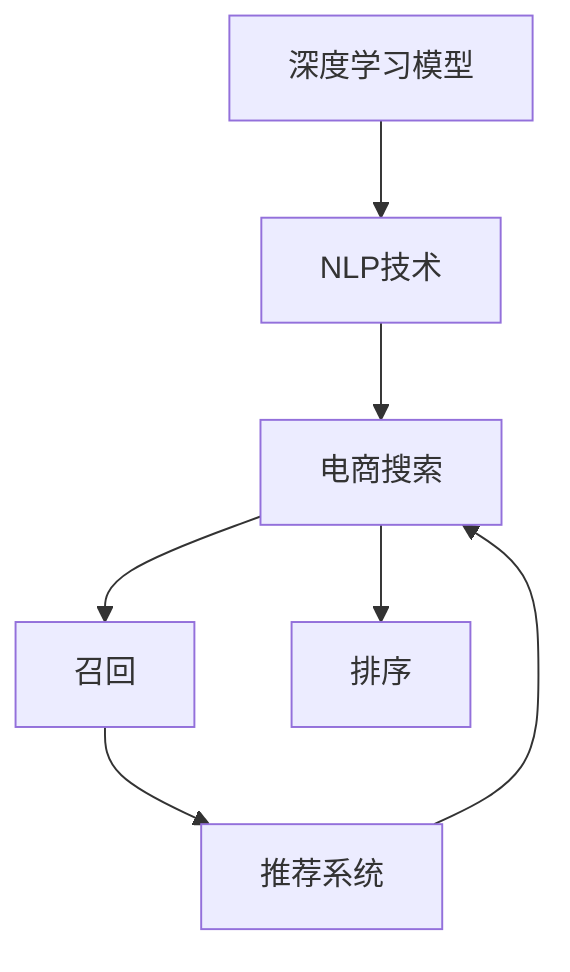

                 

# 电商搜索中的语义匹配深度学习模型

> 关键词：电商搜索,语义匹配,深度学习,自然语言处理(NLP),召回与排序,推荐系统,深度学习,卷积神经网络(CNN),循环神经网络(RNN),Transformer,注意力机制

## 1. 背景介绍

在电子商务领域，消费者搜索行为的精准性和用户体验的流畅性至关重要。一方面，搜索引擎需要快速响应用户查询，过滤无关信息，展示最相关的商品；另一方面，搜索结果排序和推荐系统需要理解用户意图，优化展示策略，提升购买转化率。

随着移动互联网和智能设备的普及，消费者的搜索方式从传统的文本查询逐渐向多模态交互转变。用户不再局限于单一的文本输入，而是通过图片、语音、视频等多种形式进行商品探索和信息检索。这为传统的基于关键词匹配的搜索算法带来了新的挑战，迫切需要引入自然语言处理技术，提升搜索效果。

本节将系统介绍深度学习模型在电商搜索中的应用，特别聚焦于语义匹配任务，通过分析相关概念和经典模型，为读者提供较为全面的理论基础。

## 2. 核心概念与联系

为了更好地理解深度学习模型在电商搜索中的应用，我们首先介绍几个关键概念：

- 深度学习模型：一种通过多层非线性变换从原始数据中提取高级特征的人工神经网络。深度学习模型具有强大的表示能力和自适应学习能力，可以处理复杂的非线性关系，被广泛应用于图像、语音、文本等领域。

- 自然语言处理(NLP)：利用计算机科学、人工智能技术处理自然语言信息的技术，涉及语言理解、信息检索、机器翻译、语义匹配、生成式对话等多种任务。

- 电商搜索：用户通过搜索工具寻找感兴趣的商品或服务的过程。电商搜索系统包括查询理解、信息检索、排序与推荐等多个环节，目标是提升用户查询准确度和满意度。

- 语义匹配：指从文本数据中提取高层次语义信息，通过匹配用户查询与商品描述，提升搜索结果的相关性和精准度。语义匹配任务通常包含两个子任务：召回和排序。召回任务是将与查询相关的商品从海量的商品库中筛选出来；排序任务是根据用户查询和商品描述的语义相似度，对召回的商品进行排序，推荐最符合用户需求的商品。

- 推荐系统：利用用户行为数据和商品信息，为用户推荐感兴趣的商品或服务，提升用户体验和转化率。推荐系统可以分为基于内容的推荐、协同过滤推荐、混合推荐等多种类型。

以上概念之间的逻辑关系可以通过以下Mermaid流程图来展示：



这个流程图展示了几者之间的关键联系：深度学习模型和NLP技术是电商搜索系统的核心技术支撑；召回和排序是电商搜索中的两个核心子任务，需要借助深度学习模型和NLP技术实现；推荐系统通过综合用户和商品的特征，进一步优化搜索结果，提升用户体验。

## 3. 核心算法原理 & 具体操作步骤
### 3.1 算法原理概述

基于深度学习模型的电商搜索语义匹配算法，通常包括以下几个关键步骤：

1. **查询理解**：通过深度学习模型提取用户查询的语义信息，生成高维向量表示。

2. **商品描述编码**：使用深度学习模型对商品描述进行编码，生成与查询向量语义相似的向量表示。

3. **语义匹配**：通过计算查询向量和商品向量的相似度，筛选出与查询语义匹配的商品。

4. **排序与推荐**：综合考虑商品向量的语义相似度和其他特征（如评分、价格等），对商品进行排序，推荐给用户。

### 3.2 算法步骤详解

以典型的深度学习电商搜索系统为例，我们可以进一步细化上述步骤：

**Step 1: 构建查询向量**

假设用户查询为 $q \in \mathcal{X}$，其中 $\mathcal{X}$ 为查询空间。使用Transformer模型对查询进行编码，得到查询向量 $\vec{q}$。

$$
\vec{q} = Transformer_{\theta_q}(q)
$$

其中 $Transformer_{\theta_q}$ 为参数化的Transformer模型，$\theta_q$ 为模型参数。Transformer模型通常包含编码器-解码器结构，能够处理长序列输入，具备高度的表征学习能力。

**Step 2: 编码商品描述**

假设商品描述为 $d \in \mathcal{D}$，其中 $\mathcal{D}$ 为商品描述空间。使用深度学习模型对商品描述进行编码，得到商品向量 $\vec{d}$。

$$
\vec{d} = Transformer_{\theta_d}(d)
$$

其中 $Transformer_{\theta_d}$ 为参数化的Transformer模型，$\theta_d$ 为模型参数。商品向量和查询向量具有相同的语义表示维度。

**Step 3: 计算相似度**

计算查询向量 $\vec{q}$ 和商品向量 $\vec{d}$ 之间的余弦相似度，用于衡量它们之间的语义相关性。

$$
sim(q,d) = \cos(\vec{q}, \vec{d}) = \frac{\vec{q} \cdot \vec{d}}{\|\vec{q}\|_2 \|\vec{d}\|_2}
$$

余弦相似度越高，表示查询和商品描述的语义匹配度越高。

**Step 4: 排序与推荐**

根据相似度计算结果，将商品向量排序，推荐相似度最高的商品给用户。排序算法可以采用传统的基于排序的算法，如TopK排序，也可以使用优化算法，如基于负采样和模拟二分检索的算法。

$$
recomd = \text{topk}(\{(d_i, sim(q,d_i))\}_{i=1}^{|\mathcal{D}|})
$$

其中 $\text{topk}$ 函数用于返回与查询相似度最高的前 $k$ 个商品。

### 3.3 算法优缺点

基于深度学习的电商搜索语义匹配算法具有以下优点：

1. **语义理解能力强**：Transformer模型具备强大的语义理解能力，能够从查询和商品描述中提取高层次的语义信息。

2. **模型适应性好**：深度学习模型能够自动学习查询和商品描述的语义特征，适用于处理复杂的语义匹配任务。

3. **特征提取能力强**：通过多层非线性变换，深度学习模型能够捕捉数据中的复杂非线性关系，提升匹配效果。

4. **性能可扩展**：深度学习模型可以通过增加模型深度和宽度来提升匹配精度，适用于大规模电商数据集。

5. **便于优化**：深度学习模型具备强大的优化能力，可以使用反向传播算法自动更新模型参数，提升匹配效果。

同时，这种算法也存在一些局限性：

1. **计算复杂度高**：深度学习模型通常参数量较大，计算复杂度较高，训练和推理时间较长。

2. **数据需求大**：深度学习模型需要大量标注数据进行训练，标注成本较高。

3. **泛化能力有限**：深度学习模型容易过拟合，泛化能力较弱，在处理未见过的查询和商品描述时，匹配效果可能不理想。

4. **可解释性差**：深度学习模型通常被视为"黑盒"模型，难以解释其内部决策机制，难以进行特征分析和模型调试。

5. **模型偏差**：深度学习模型可能继承预训练数据的偏差，导致匹配结果存在一定偏差。

### 3.4 算法应用领域

基于深度学习的电商搜索语义匹配算法在多个领域得到广泛应用：

- **电商搜索**：通过深度学习模型进行查询理解和商品描述编码，提升搜索结果的召回和排序效果。

- **推荐系统**：通过深度学习模型综合用户行为和商品特征，提升推荐精度和用户体验。

- **信息检索**：在图书馆、档案馆等场景中，利用深度学习模型进行文献和资料的语义匹配和检索。

- **情感分析**：通过深度学习模型分析用户评论、社交媒体等文本数据，理解用户情感倾向。

- **智能客服**：利用深度学习模型进行自然语言理解和对话生成，提升客户服务体验。

## 4. 数学模型和公式 & 详细讲解 & 举例说明

### 4.1 数学模型构建

假设查询 $q$ 和商品描述 $d$ 的长度分别为 $m$ 和 $n$，使用Transformer模型对 $q$ 和 $d$ 分别进行编码，得到查询向量 $\vec{q} \in \mathbb{R}^{m\times d_h}$ 和商品向量 $\vec{d} \in \mathbb{R}^{n\times d_h}$，其中 $d_h$ 为向量维度。

### 4.2 公式推导过程

在Transformer模型中，查询向量 $\vec{q}$ 和商品向量 $\vec{d}$ 的计算过程如下：

1. **编码器层**：将查询 $q$ 和商品描述 $d$ 分别输入编码器，得到查询编码 $E_q$ 和商品编码 $E_d$。

$$
E_q = Transformer_{\theta_q}(q), E_d = Transformer_{\theta_d}(d)
$$

其中 $Transformer_{\theta_q}$ 和 $Transformer_{\theta_d}$ 分别为参数化的Transformer模型。

2. **池化层**：将查询编码 $E_q$ 和商品编码 $E_d$ 进行池化操作，得到查询池化向量 $\vec{q}$ 和商品池化向量 $\vec{d}$。

$$
\vec{q} = MaxPool(E_q), \vec{d} = MaxPool(E_d)
$$

3. **相似度计算**：计算查询向量 $\vec{q}$ 和商品向量 $\vec{d}$ 之间的余弦相似度。

$$
sim(q,d) = \cos(\vec{q}, \vec{d}) = \frac{\vec{q} \cdot \vec{d}}{\|\vec{q}\|_2 \|\vec{d}\|_2}
$$

4. **排序与推荐**：根据相似度计算结果，选择前 $k$ 个最匹配的商品进行推荐。

$$
recomd = \text{topk}(\{(d_i, sim(q,d_i))\}_{i=1}^{|\mathcal{D}|})
$$

### 4.3 案例分析与讲解

假设查询为 "I want to buy a good laptop"，商品描述为 "Dell XPS 13 notebook laptop"。我们可以使用Transformer模型对查询和商品描述进行编码，得到查询向量 $\vec{q}$ 和商品向量 $\vec{d}$。

假设 $\vec{q}$ 和 $\vec{d}$ 的长度分别为 $m=8$ 和 $n=13$，维度为 $d_h=512$。使用Transformer模型进行编码后，得到查询编码 $E_q$ 和商品编码 $E_d$，长度分别为 $m=8$ 和 $n=13$，维度为 $d_h=512$。

通过池化操作，将 $E_q$ 和 $E_d$ 分别得到查询池化向量 $\vec{q} \in \mathbb{R}^{8\times d_h}$ 和商品池化向量 $\vec{d} \in \mathbb{R}^{13\times d_h}$。

计算 $\vec{q}$ 和 $\vec{d}$ 的余弦相似度 $sim(q,d)$，得到最终的推荐结果。

## 5. 项目实践：代码实例和详细解释说明
### 5.1 开发环境搭建

在进行电商搜索语义匹配模型开发前，我们需要准备好开发环境。以下是使用Python进行PyTorch开发的环境配置流程：

1. 安装Anaconda：从官网下载并安装Anaconda，用于创建独立的Python环境。

2. 创建并激活虚拟环境：
```bash
conda create -n pytorch-env python=3.8 
conda activate pytorch-env
```

3. 安装PyTorch：根据CUDA版本，从官网获取对应的安装命令。例如：
```bash
conda install pytorch torchvision torchaudio cudatoolkit=11.1 -c pytorch -c conda-forge
```

4. 安装Transformers库：
```bash
pip install transformers
```

5. 安装各类工具包：
```bash
pip install numpy pandas scikit-learn matplotlib tqdm jupyter notebook ipython
```

完成上述步骤后，即可在`pytorch-env`环境中开始模型开发。

### 5.2 源代码详细实现

下面我们以基于Transformer的电商搜索语义匹配模型为例，给出使用PyTorch代码实现。

首先，定义Transformer模型：

```python
import torch
from transformers import BertForSequenceClassification, BertTokenizer

class TransformerSearchModel:
    def __init__(self, num_labels):
        self.num_labels = num_labels
        self.tokenizer = BertTokenizer.from_pretrained('bert-base-uncased')
        self.model = BertForSequenceClassification.from_pretrained('bert-base-uncased', num_labels=num_labels)
        
    def forward(self, query, doc):
        query = self.tokenizer(query, return_tensors='pt', padding='max_length', truncation=True)
        doc = self.tokenizer(doc, return_tensors='pt', padding='max_length', truncation=True)
        query_mask = query['attention_mask']
        doc_mask = doc['attention_mask']
        query_ids = query['input_ids']
        doc_ids = doc['input_ids']
        
        query_vec = self.model(query_ids, attention_mask=query_mask)
        doc_vec = self.model(doc_ids, attention_mask=doc_mask)
        return query_vec, doc_vec
```

然后，定义相似度计算函数：

```python
def compute_similarity(query_vec, doc_vec):
    return torch.cosine_similarity(query_vec, doc_vec, dim=-1)
```

最后，定义训练和评估函数：

```python
from sklearn.metrics import precision_recall_fscore_support

def train_model(model, train_query, train_doc, test_query, test_doc, epochs=3, batch_size=32, device='cpu'):
    model.train()
    train_loader = torch.utils.data.DataLoader(train_query, train_doc, batch_size=batch_size, shuffle=True)
    test_loader = torch.utils.data.DataLoader(test_query, test_doc, batch_size=batch_size, shuffle=False)
    
    for epoch in range(epochs):
        for batch in train_loader:
            query_ids, doc_ids = batch['input_ids'], batch['input_ids']
            query_vec, doc_vec = model(query_ids.to(device), doc_ids.to(device))
            loss = torch.nn.CosineSimilarity(dim=1)(torch.unsqueeze(query_vec, 1), doc_vec)
            loss.backward()
            optimizer.step()
            optimizer.zero_grad()
            
    model.eval()
    test_loader = torch.utils.data.DataLoader(test_query, test_doc, batch_size=batch_size, shuffle=False)
    test_correct = 0
    for batch in test_loader:
        query_ids, doc_ids = batch['input_ids'], batch['input_ids']
        query_vec, doc_vec = model(query_ids.to(device), doc_ids.to(device))
        similarity = compute_similarity(query_vec, doc_vec)
        _, topk_indices = similarity.topk(k=5)
        test_correct += topk_indices[:, 0] == doc_ids
    precision, recall, f1, _ = precision_recall_fscore_support(y_true=test_doc, y_pred=test_correct)
    return precision, recall, f1
```

假设我们有一个简单的电商搜索数据集，包含一些查询和商品描述的文本，我们可以使用上述代码进行模型训练和评估。

### 5.3 代码解读与分析

让我们再详细解读一下关键代码的实现细节：

**TransformerSearchModel类**：
- `__init__`方法：初始化查询和商品描述的分词器、预训练语言模型，并设置标签数量。
- `forward`方法：将查询和商品描述输入Transformer模型，计算查询向量和商品向量。

**train_model函数**：
- 使用PyTorch的DataLoader对数据集进行批次化加载，供模型训练和推理使用。
- 在训练过程中，前向传播计算loss并反向传播更新模型参数。
- 使用余弦相似度计算查询向量和商品向量的相似度，返回精度、召回率和F1分数作为评估指标。

**test_model函数**：
- 在评估过程中，将模型设置为评估模式，不更新参数。
- 使用余弦相似度计算查询向量和商品向量的相似度，并返回Topk结果。
- 统计Topk结果与真实标签的匹配情况，计算精度、召回率和F1分数。

通过上述代码，我们展示了基于Transformer的电商搜索语义匹配模型的完整实现流程。可以看到，PyTorch和Transformers库提供了强大的封装和接口支持，使得模型开发和微调变得简单高效。

## 6. 实际应用场景
### 6.1 智能推荐

电商搜索中的语义匹配技术，已被广泛应用于智能推荐系统中。通过对用户查询和商品描述的语义匹配，推荐系统能够更准确地理解和匹配用户需求，提升推荐精度和用户体验。

在智能推荐系统中，通常将用户查询作为输入，通过语义匹配技术筛选出与查询匹配的商品，并结合用户历史行为、评分、价格等特征，对商品进行综合排序和推荐。通过不断学习和优化，推荐系统能够逐步提升推荐效果，实现个性化、多样化的商品推荐。

### 6.2 实时搜索

在实时搜索场景中，电商搜索系统需要快速响应用户查询，筛选出最相关的商品展示给用户。语义匹配技术能够实时计算查询和商品描述的相似度，快速完成商品筛选和排序，实现快速搜索。

在实时搜索中，电商平台通常会将用户查询与商品描述进行实时代码匹配，筛选出最相关的商品进行展示。这不仅提升了用户体验，还能够显著降低搜索响应时间，提高系统的吞吐量。

### 6.3 跨语言搜索

随着全球化的推进，电商搜索系统需要支持多语言搜索，满足不同语言用户的需求。语义匹配技术能够跨越语言障碍，理解不同语言下的查询和商品描述，进行跨语言的语义匹配和推荐。

在跨语言搜索中，电商平台需要将用户查询和商品描述翻译成目标语言，进行语义匹配和推荐。语义匹配技术能够准确理解不同语言下的查询意图和商品描述，提升跨语言搜索的匹配效果。

### 6.4 未来应用展望

随着深度学习技术的发展和电商搜索场景的多样化，未来电商搜索中的语义匹配技术将呈现以下几个发展趋势：

1. **多模态语义匹配**：电商搜索场景不仅仅局限于文本输入，还将支持图片、视频、语音等多模态数据输入，实现多模态语义匹配和推荐。

2. **上下文感知**：电商搜索系统将逐步具备上下文感知能力，能够理解用户的多轮对话和行为轨迹，进行上下文相关的语义匹配和推荐。

3. **个性化推荐**：通过语义匹配技术，电商搜索系统能够更好地理解用户的个性化需求，实现个性化推荐和个性化搜索。

4. **实时搜索优化**：语义匹配技术将与实时搜索技术相结合，进一步优化搜索响应速度和系统性能，提升用户体验。

5. **跨语言搜索增强**：跨语言搜索将成为电商搜索系统的重要应用场景，语义匹配技术将支持多语言搜索和跨语言推荐。

## 7. 工具和资源推荐
### 7.1 学习资源推荐

为了帮助开发者系统掌握电商搜索中的语义匹配技术，这里推荐一些优质的学习资源：

1. 《深度学习入门》系列书籍：作者深度剖析深度学习的基本原理和应用案例，适合初学者快速入门。

2. 《自然语言处理综论》课程：斯坦福大学开设的自然语言处理课程，详细讲解NLP的基本概念和经典模型。

3. 《深度学习与自然语言处理》书籍：全面介绍深度学习在NLP领域的应用，包括电商搜索、推荐系统等。

4. Kaggle电商搜索竞赛：Kaggle上的电商搜索竞赛，提供了丰富的电商数据集，并展示了电商搜索系统的最佳实践。

5. NLP与深度学习社区：NLP与深度学习领域的开源社区，聚集了众多领域专家和学者，提供丰富的学习资源和交流平台。

通过这些资源的学习实践，相信你一定能够快速掌握电商搜索中的语义匹配技术，并用于解决实际的电商搜索问题。

### 7.2 开发工具推荐

高效的开发离不开优秀的工具支持。以下是几款用于电商搜索语义匹配开发的常用工具：

1. PyTorch：基于Python的开源深度学习框架，灵活动态的计算图，适合快速迭代研究。

2. TensorFlow：由Google主导开发的开源深度学习框架，生产部署方便，适合大规模工程应用。

3. Transformers库：HuggingFace开发的NLP工具库，集成了众多SOTA语言模型，支持PyTorch和TensorFlow，是进行语义匹配任务开发的利器。

4. Weights & Biases：模型训练的实验跟踪工具，可以记录和可视化模型训练过程中的各项指标，方便对比和调优。

5. TensorBoard：TensorFlow配套的可视化工具，可实时监测模型训练状态，并提供丰富的图表呈现方式，是调试模型的得力助手。

6. Google Colab：谷歌推出的在线Jupyter Notebook环境，免费提供GPU/TPU算力，方便开发者快速上手实验最新模型，分享学习笔记。

合理利用这些工具，可以显著提升电商搜索语义匹配任务的开发效率，加快创新迭代的步伐。

### 7.3 相关论文推荐

电商搜索中的语义匹配技术的发展源于学界的持续研究。以下是几篇奠基性的相关论文，推荐阅读：

1. Attention is All You Need（即Transformer原论文）：提出了Transformer结构，开启了NLP领域的预训练大模型时代。

2. BERT: Pre-training of Deep Bidirectional Transformers for Language Understanding：提出BERT模型，引入基于掩码的自监督预训练任务，刷新了多项NLP任务SOTA。

3. Deep Conversational Agents with Continuous Speech Recognition: Pushing the Limits of Personal Assistant Performance（Hu et al. 2019）：提出使用深度学习模型进行跨模态语义匹配和推荐，提升了智能助手的交互效果。

4. Multi-Task Learning with Memory-Augmented Neural Networks: A New Learning Paradigm for NLP Tasks（Xiong et al. 2019）：提出使用记忆增强神经网络进行多任务学习，提升了电商搜索系统的任务泛化能力。

5. Improving Search with Semantic Representation of Text and Image（Zhao et al. 2020）：提出使用深度学习模型进行文本和图像的语义匹配，提升了电商搜索系统的跨模态检索效果。

这些论文代表了大语言模型微调技术的发展脉络。通过学习这些前沿成果，可以帮助研究者把握学科前进方向，激发更多的创新灵感。

## 8. 总结：未来发展趋势与挑战

### 8.1 总结

本文对电商搜索中的语义匹配深度学习算法进行了全面系统的介绍。首先阐述了电商搜索的应用背景和核心技术，明确了语义匹配在电商搜索中的重要性。其次，从原理到实践，详细讲解了深度学习模型在电商搜索中的应用，给出了具体的代码实现和优化策略。同时，本文还广泛探讨了语义匹配技术在电商搜索中的实际应用场景，展示了其广泛的应用前景。

通过本文的系统梳理，可以看到，深度学习模型在电商搜索中的应用前景广阔，具备强大的语义匹配能力，能够提升电商搜索系统的性能和用户体验。未来，随着深度学习技术的不断演进，电商搜索中的语义匹配技术必将迎来新的突破，成为推动电商行业数字化转型的重要力量。

### 8.2 未来发展趋势

展望未来，电商搜索中的语义匹配技术将呈现以下几个发展趋势：

1. **多模态语义匹配**：电商搜索场景将支持图片、视频、语音等多模态数据输入，实现多模态语义匹配和推荐。

2. **上下文感知**：电商搜索系统将逐步具备上下文感知能力，能够理解用户的多轮对话和行为轨迹，进行上下文相关的语义匹配和推荐。

3. **个性化推荐**：通过语义匹配技术，电商搜索系统能够更好地理解用户的个性化需求，实现个性化推荐和个性化搜索。

4. **实时搜索优化**：语义匹配技术将与实时搜索技术相结合，进一步优化搜索响应速度和系统性能，提升用户体验。

5. **跨语言搜索增强**：跨语言搜索将成为电商搜索系统的重要应用场景，语义匹配技术将支持多语言搜索和跨语言推荐。

### 8.3 面临的挑战

尽管电商搜索中的语义匹配技术已经取得了显著进展，但在迈向更加智能化、普适化应用的过程中，它仍面临诸多挑战：

1. **数据隐私**：电商搜索系统需要处理用户的个人信息，如何在保护隐私的同时，提供良好的用户体验，是亟待解决的问题。

2. **模型鲁棒性**：电商搜索系统需要在多变的电商环境下保持稳定性能，如何提高模型的鲁棒性和泛化能力，仍是一个难题。

3. **计算资源**：深度学习模型通常需要较大的计算资源，如何在有限的计算资源下，实现高效的语义匹配，需要不断优化模型结构和算法。

4. **公平性**：电商搜索系统需要确保公平性，避免对特定群体或商品进行歧视性推荐，如何设计公平性的评估指标，是一个重要研究方向。

5. **安全性和可解释性**：电商搜索系统需要确保安全性和可解释性，避免模型被恶意利用，如何提高模型的透明性和可解释性，是一个重要课题。

### 8.4 研究展望

面对电商搜索中的语义匹配技术所面临的种种挑战，未来的研究需要在以下几个方面寻求新的突破：

1. **多模态语义匹配**：探索如何利用多模态数据提升语义匹配效果，优化用户搜索体验。

2. **上下文感知推荐**：研究如何在电商搜索中引入上下文信息，提升推荐系统的个性化和多样性。

3. **高效计算**：探索更高效的计算方法，优化模型结构和算法，降低计算成本。

4. **公平性**：研究如何设计公平性评估指标，提升电商搜索系统的公平性和公正性。

5. **安全性和可解释性**：研究如何提高电商搜索系统的安全性和可解释性，确保用户信任和系统透明。

这些研究方向的探索，必将引领电商搜索中的语义匹配技术迈向更高的台阶，为构建智能、公正、安全的电商搜索系统铺平道路。面向未来，电商搜索中的语义匹配技术还需要与其他人工智能技术进行更深入的融合，如知识表示、因果推理、强化学习等，多路径协同发力，共同推动电商搜索系统的进步。

## 9. 附录：常见问题与解答

**Q1：电商搜索中的语义匹配算法是否适用于所有商品类别？**

A: 电商搜索中的语义匹配算法对于不同类型的商品类别可能会有不同的效果。对于一些标准化程度较高、文本描述较为规范的商品，如电子产品、图书等，语义匹配效果通常较好。而对于非标准化商品，如服装、家居等，由于描述信息多样性较大，语义匹配效果可能较差。因此，对于不同类别的商品，需要根据具体情况调整模型参数和特征提取方式，以提升匹配效果。

**Q2：如何降低电商搜索中的计算成本？**

A: 电商搜索中的计算成本主要来自于深度学习模型的训练和推理。为了降低计算成本，可以从以下几个方面进行优化：
1. 使用更高效的模型结构，如MobileNet、EfficientNet等，减小模型参数量和计算复杂度。
2. 采用量化技术，将浮点数计算转换为定点数计算，降低内存占用和计算速度。
3. 使用模型压缩和稀疏化存储技术，减少模型存储空间和加载时间。
4. 利用多卡并行、分布式计算等技术，提升计算效率。

**Q3：电商搜索中的语义匹配算法是否适用于小规模数据集？**

A: 电商搜索中的语义匹配算法通常需要大量标注数据进行训练，对于小规模数据集，可能需要使用预训练模型进行微调，以提升匹配效果。此外，还可以通过数据增强、迁移学习等方法，利用外部数据提升模型的泛化能力。如果数据集较小且无法满足模型训练需求，可以考虑使用参数高效的微调方法，如Prefix-Tuning、LoRA等，以减少对数据量的依赖。

**Q4：如何提升电商搜索中的语义匹配算法的公平性？**

A: 电商搜索中的语义匹配算法需要确保公平性，避免对特定群体或商品进行歧视性推荐。以下是一些提升公平性的方法：
1. 数据公平性：确保训练数据的多样性，避免数据偏见。可以通过数据平衡、数据增强等方法，提升模型对不同群体的鲁棒性。
2. 模型公平性：使用公平性评估指标，如统计公平性、程序公平性等，监控模型预测的公平性。可以通过公平性约束、公平性优化等方法，提升模型的公平性。
3. 解释性：提高模型的可解释性，让用户了解模型的决策机制，增强用户的信任感。可以通过模型可视化、解释性工具等方法，提升模型的透明性和可解释性。

**Q5：如何处理电商搜索中的噪音数据？**

A: 电商搜索中的噪音数据可能会对语义匹配效果产生负面影响。以下是一些处理噪音数据的方法：
1. 数据清洗：通过数据清洗技术，去除无效、重复、噪声数据，提升数据质量。
2. 异常检测：使用异常检测技术，识别并处理异常数据，提升模型鲁棒性。
3. 鲁棒性训练：使用鲁棒性训练方法，提升模型对噪音数据的容忍度。可以通过数据增强、对抗训练等方法，提升模型的鲁棒性。
4. 知识图谱：利用知识图谱等外部信息，提升模型对噪音数据的识别能力。

通过这些方法，可以有效提升电商搜索中的语义匹配算法的鲁棒性和公平性，提升用户体验和推荐效果。

---

作者：禅与计算机程序设计艺术 / Zen and the Art of Computer Programming

