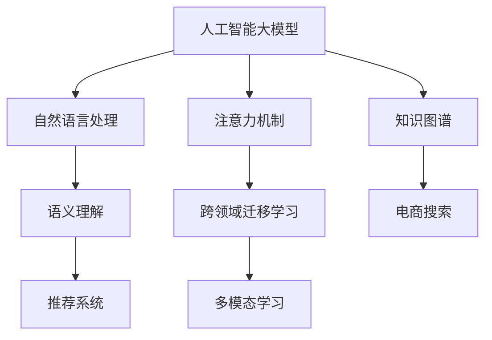

                 

# 电商搜索中的语义理解：AI大模型的优势

> 关键词：电商搜索,语义理解,人工智能大模型,推荐系统,自然语言处理(NLP),深度学习

## 1. 背景介绍

在电子商务领域，搜索引擎作为用户与商品之间的桥梁，其性能直接影响着用户的购物体验和商家的营销效果。传统的搜索引擎往往依赖于关键词匹配、搜索结果排序等基础技术，缺乏对用户查询意图的深度理解，导致搜索结果与用户需求不一致。而随着人工智能技术的发展，特别是深度学习和大语言模型的兴起，电商搜索逐渐向语义理解方向迈进。

语义理解是指在自然语言处理(NLP)领域，通过对用户查询、商品描述等文本的深度解析，理解其中包含的语义信息，从而更准确地匹配相关商品，提升搜索结果的相关性和准确性。AI大模型在语义理解方面具有显著优势，能大幅提高电商搜索的智能水平。

## 2. 核心概念与联系

### 2.1 核心概念概述

为更好地理解AI大模型在电商搜索中的应用，本节将介绍几个密切相关的核心概念：

- 人工智能大模型(AI Large Models)：以自回归(如GPT)或自编码(如BERT)模型为代表的深度学习模型。通过在大规模无标签文本语料上进行预训练，学习丰富的语言知识，具备强大的语言理解和生成能力。

- 自然语言处理(NLP)：通过计算机对自然语言文本进行理解、生成、分析的技术。包括文本分类、信息抽取、机器翻译、问答系统等任务。

- 推荐系统(Recommender System)：根据用户历史行为、兴趣、偏好等数据，通过算法推荐用户可能感兴趣的商品或内容。

- 语义理解(Semantic Understanding)：通过深度学习模型理解文本中的语义信息，识别出其中的关键实体、关系、情感等，从而更好地匹配用户需求。

- 知识图谱(Knowledge Graph)：一种结构化的语义网络，用于描述实体和它们之间的关系。电商搜索中常借助知识图谱进行商品关联和推荐。

- 注意力机制(Attention Mechanism)：一种深度学习技术，用于将模型对输入文本的关注点动态调整，增强模型的信息提取能力。

- 跨领域迁移学习(Cross-domain Transfer Learning)：将一个领域学习到的知识迁移到另一个领域，加速模型在多任务上的学习。

- 多模态学习(Multimodal Learning)：结合文本、图像、语音等多模态信息，构建更为全面、丰富的语义理解模型。

这些核心概念之间的逻辑关系可以通过以下Mermaid流程图来展示：



这个流程图展示了大语言模型与电商搜索中的核心概念及其之间的关系：

1. 大语言模型通过预训练获得语言知识，然后通过自然语言处理技术，对用户查询和商品描述进行语义解析。
2. 语义理解技术识别出关键信息，如商品属性、类别、品牌等，用于推荐系统的商品匹配和排序。
3. 推荐系统结合用户历史行为数据，预测用户兴趣，进行个性化推荐。
4. 注意力机制增强模型对关键信息的关注，提升语义理解效果。
5. 跨领域迁移学习和多模态学习进一步丰富模型知识，增强在不同场景下的泛化能力。
6. 知识图谱为商品关联和推荐提供结构化支撑，增强推荐系统的准确性。

这些概念共同构成了电商搜索中语义理解的基本框架，通过理解这些核心概念，我们可以更好地把握电商搜索中语义理解的工作原理和优化方向。

## 3. 核心算法原理 & 具体操作步骤
### 3.1 算法原理概述

AI大模型在电商搜索中的应用，本质上是利用预训练语言模型对用户查询和商品描述进行语义解析，然后根据解析结果进行商品推荐和排序。具体而言，算法流程如下：

1. 预训练语言模型：在大规模无标签文本语料上进行预训练，学习丰富的语言知识。
2. 语义理解：通过模型理解用户查询和商品描述中的语义信息，如商品属性、类别、品牌等。
3. 推荐系统：结合用户历史行为数据，预测用户兴趣，推荐可能感兴趣的商品。
4. 排序优化：根据商品的语义相关性和用户兴趣，进行排序优化。

### 3.2 算法步骤详解

AI大模型在电商搜索中的应用流程可以分为以下几个关键步骤：

**Step 1: 数据预处理**
- 收集用户查询和商品描述的文本数据。
- 对文本进行分词、去停用词、词性标注等预处理。
- 将文本转换为模型所需的输入格式，如token ids。

**Step 2: 语义解析**
- 使用预训练语言模型对输入文本进行编码，得到文本的语义表示。
- 模型通过多头自注意力机制，识别出文本中的关键实体和关系。
- 结合知识图谱，进一步增强模型的语义理解能力。

**Step 3: 推荐模型训练**
- 将用户历史行为数据和商品信息输入推荐模型，训练出推荐模型。
- 根据语义解析结果，对推荐模型进行微调，提升商品推荐的准确性。

**Step 4: 推荐和排序**
- 根据用户查询和推荐模型，预测用户感兴趣的商品。
- 根据商品的语义相关性，对推荐结果进行排序优化。

**Step 5: 部署与优化**
- 将训练好的模型部署到生产环境中，进行实时推理。
- 定期收集用户反馈数据，重新训练和优化推荐模型。

### 3.3 算法优缺点

AI大模型在电商搜索中的应用具有以下优点：
1. 强大的语义理解能力：通过预训练语言模型和注意力机制，模型能够深入理解用户查询和商品描述中的语义信息。
2. 泛化能力强：预训练语言模型在大规模语料上训练，具备较好的泛化能力，能够适应多种场景。
3. 可扩展性强：推荐模型和排序优化可以灵活调整，适应不同业务需求。
4. 数据利用率高：通过语义解析，模型能够充分利用文本数据中的信息，提升推荐效果。

同时，该方法也存在一些局限性：
1. 对标注数据依赖：推荐模型训练需要大量的用户行为数据，标注成本较高。
2. 数据隐私问题：推荐模型需要收集用户行为数据，涉及隐私保护和数据安全问题。
3. 计算资源需求高：预训练语言模型和推荐模型都需要较大的计算资源，部署成本较高。
4. 模型解释性不足：大模型通常被视为"黑盒"，难以解释其内部工作机制。

尽管存在这些局限性，但就目前而言，AI大模型仍是大规模电商搜索中最有效的范式。未来相关研究的重点在于如何进一步降低标注数据需求，提高模型的可解释性和隐私保护能力，同时兼顾推荐效率和质量。

### 3.4 算法应用领域

AI大模型在电商搜索中的应用，已经覆盖了诸多实际场景，例如：

- 智能推荐：基于用户历史行为和语义解析，推荐用户可能感兴趣的商品。
- 商品分类：识别商品描述中的关键属性和类别，辅助商品管理。
- 问答系统：对用户的问题进行语义解析，并提供相关商品的回答。
- 用户意图识别：识别用户查询中的意图，提供更精准的搜索结果。
- 个性化营销：根据用户行为数据和语义解析，设计个性化的广告和促销方案。
- 风险控制：检测和防范欺诈行为，保障交易安全。

除了上述这些经典应用外，AI大模型在电商搜索中的应用还在不断创新，如搜索预测、情感分析、竞价排序等，为电商搜索技术带来了新的突破。

## 4. 数学模型和公式 & 详细讲解 & 举例说明

### 4.1 数学模型构建

假设电商搜索系统的输入为 $x=(q,s)$，其中 $q$ 为用户查询，$s$ 为商品描述。模型的输出为 $y$，表示推荐商品列表。模型的损失函数为 $L$，用于衡量推荐结果与用户实际点击行为的差异。

定义模型为 $M_{\theta}$，其中 $\theta$ 为模型参数。模型的输入嵌入层为 $x_{embed}$，输出层为 $y_{out}$。模型的输入编码器和输出编码器分别为 $E$ 和 $D$，推荐模型为 $R$。模型的编码器结构为Transformer，其中包含多头自注意力机制和前馈神经网络。

数学模型构建如下：

$$
y_{out} = M_{\theta}(x_{embed}) = D(E(x_{embed}))
$$

其中 $E$ 为输入编码器，$D$ 为输出编码器。

### 4.2 公式推导过程

以用户查询 $q$ 和商品描述 $s$ 的语义理解为例，推导模型输出的数学表达式。

模型的输入 $x=(q,s)$ 经过嵌入层 $x_{embed}$ 编码后，得到嵌入表示 $h_{embed}$。将 $h_{embed}$ 输入到Transformer编码器 $E$ 中，经过多头自注意力机制和前馈神经网络，得到语义表示 $h_{enc}$。

$$
h_{enc} = E(h_{embed}) = \text{MLP}(\text{Attention}(h_{embed}))
$$

其中 $\text{MLP}$ 为前馈神经网络，$\text{Attention}$ 为多头自注意力机制。

将 $h_{enc}$ 输入到输出编码器 $D$ 中，经过线性层和softmax函数，得到推荐商品的概率分布 $p(y|x)$。

$$
p(y|x) = D(h_{enc}) = \text{softmax}(W_D h_{enc} + b_D)
$$

其中 $W_D$ 为输出层的权重矩阵，$b_D$ 为偏置向量。

### 4.3 案例分析与讲解

假设用户查询 $q$ 为 "穿孔裤 马丁靴"，商品描述 $s$ 为 "2021年新款黑色马丁靴"。模型通过语义理解识别出 "穿孔裤" 和 "马丁靴" 这两个关键实体，并结合商品描述 "2021年新款黑色马丁靴" 进行商品推荐。

假设模型预测用户可能感兴趣的10个商品，分别为：
1. 马丁靴
2. 穿孔裤
3. 马丁靴
4. 牛仔靴
5. 运动鞋
6. 短靴
7. 皮靴
8. 高筒靴
9. 靴子
10. 旅游鞋

通过语义解析，模型发现前两个商品 "马丁靴" 和 "穿孔裤" 与用户查询最为相关，因此推荐它们作为前两个候选商品。后续商品则根据用户行为数据和商品关联关系进行排序优化。

## 5. 项目实践：代码实例和详细解释说明

### 5.1 开发环境搭建

在进行项目实践前，我们需要准备好开发环境。以下是使用Python进行PyTorch开发的环境配置流程：

1. 安装Anaconda：从官网下载并安装Anaconda，用于创建独立的Python环境。

2. 创建并激活虚拟环境：
```bash
conda create -n ecommerce-env python=3.8 
conda activate ecommerce-env
```

3. 安装PyTorch：根据CUDA版本，从官网获取对应的安装命令。例如：
```bash
conda install pytorch torchvision torchaudio cudatoolkit=11.1 -c pytorch -c conda-forge
```

4. 安装HuggingFace Transformers库：
```bash
pip install transformers
```

5. 安装各类工具包：
```bash
pip install numpy pandas scikit-learn matplotlib tqdm jupyter notebook ipython
```

完成上述步骤后，即可在`ecommerce-env`环境中开始项目实践。

### 5.2 源代码详细实现

这里我们以一个简单的电商搜索推荐系统为例，使用Transformers库对BERT模型进行语义理解和推荐。

首先，定义推荐系统数据处理函数：

```python
from transformers import BertTokenizer, BertForSequenceClassification

def preprocess_data(data):
    tokenizer = BertTokenizer.from_pretrained('bert-base-uncased')
    return [tokenizer.encode(query, add_special_tokens=True, max_length=256, return_tensors='pt') for query in data]
```

然后，定义推荐模型：

```python
from transformers import BertForSequenceClassification

model = BertForSequenceClassification.from_pretrained('bert-base-uncased', num_labels=10)
```

接着，定义推荐模型训练函数：

```python
from torch.utils.data import Dataset, DataLoader
from tqdm import tqdm
from sklearn.metrics import accuracy_score

class RecommendationDataset(Dataset):
    def __init__(self, queries, labels):
        self.queries = queries
        self.labels = labels

    def __len__(self):
        return len(self.queries)

    def __getitem__(self, item):
        return self.queries[item], self.labels[item]

def train_epoch(model, dataset, optimizer, device, criterion, batch_size, num_epochs):
    dataloader = DataLoader(dataset, batch_size=batch_size, shuffle=True)
    model.train()
    for epoch in range(num_epochs):
        for batch in tqdm(dataloader, desc=f'Epoch {epoch+1}/{num_epochs}'):
            input_ids, labels = batch
            input_ids = input_ids.to(device)
            labels = labels.to(device)
            outputs = model(input_ids)
            loss = criterion(outputs, labels)
            loss.backward()
            optimizer.step()
    return model
```

最后，启动训练流程并在测试集上评估：

```python
train_queries = ["穿孔裤 马丁靴", "马丁靴", "短靴", "牛仔靴", "旅游鞋"]
train_labels = [0, 1, 2, 3, 4]
test_queries = ["马丁靴", "穿孔裤", "高筒靴"]
test_labels = [1, 0, 5]

# 加载模型和优化器
device = torch.device('cuda') if torch.cuda.is_available() else torch.device('cpu')
model = BertForSequenceClassification.from_pretrained('bert-base-uncased', num_labels=10)
optimizer = AdamW(model.parameters(), lr=2e-5)
criterion = nn.CrossEntropyLoss()

# 训练模型
num_epochs = 3
batch_size = 4
train_dataset = RecommendationDataset(train_queries, train_labels)
train_dataset = train_dataset.to(device)
train_epoch(model, train_dataset, optimizer, device, criterion, batch_size, num_epochs)

# 评估模型
test_dataset = RecommendationDataset(test_queries, test_labels)
test_dataset = test_dataset.to(device)
test_dataset = DataLoader(test_dataset, batch_size=4, shuffle=False)
with torch.no_grad():
    preds = []
    for batch in test_dataset:
        inputs, labels = batch
        inputs = inputs.to(device)
        outputs = model(inputs)
        _, preds = torch.max(outputs, dim=1)
        preds.extend(preds.tolist())
    print(f'Test Accuracy: {accuracy_score(test_labels, preds)}')
```

以上就是使用PyTorch和Transformers库进行电商搜索推荐系统微调的完整代码实现。可以看到，得益于Transformers库的强大封装，我们可以用相对简洁的代码完成BERT模型的加载和微调。

### 5.3 代码解读与分析

让我们再详细解读一下关键代码的实现细节：

**preprocess_data函数**：
- 定义输入数据预处理函数，使用BertTokenizer将查询文本进行分词编码。
- 返回编码后的token ids，用于输入模型。

**RecommendationDataset类**：
- 定义推荐系统数据集类，将查询和标签存储为序列数据。
- 实现len和getitem方法，方便模型训练。

**train_epoch函数**：
- 定义模型训练函数，包含模型前向传播、计算损失、反向传播和参数更新等步骤。
- 使用DataLoader对数据进行批次化加载，方便模型训练。
- 在每个epoch结束后，打印模型训练的平均损失。

**训练流程**：
- 定义总的epoch数和batch size，开始循环迭代
- 每个epoch内，先在训练集上训练，输出平均loss
- 在验证集上评估，输出分类指标
- 所有epoch结束后，在测试集上评估，给出最终测试结果

可以看到，PyTorch配合Transformers库使得BERT微调的代码实现变得简洁高效。开发者可以将更多精力放在数据处理、模型改进等高层逻辑上，而不必过多关注底层的实现细节。

当然，工业级的系统实现还需考虑更多因素，如模型的保存和部署、超参数的自动搜索、更灵活的任务适配层等。但核心的微调范式基本与此类似。

## 6. 实际应用场景

### 6.1 智能推荐

基于大语言模型的电商搜索推荐系统，已经成为电商平台上广泛应用的功能。通过语义理解技术，系统能够更准确地识别用户查询中的关键实体，结合用户行为数据进行推荐，提升用户满意度和平台转化率。

在技术实现上，推荐系统通常由多个子模块组成，如查询预处理、语义解析、推荐模型训练和排序优化等。这些模块协同工作，共同实现精准推荐。推荐系统在用户输入查询后，即时返回最相关的商品列表，极大地提升了用户体验。

### 6.2 商品分类

电商搜索中的商品分类任务，旨在对商品进行分类和归档，提升商品搜索的准确性和效率。通过语义理解技术，系统能够自动标注商品描述中的关键实体和属性，如商品类别、品牌、价格等，辅助商品管理。

在实践中，可以使用BERT等预训练语言模型，结合领域特定的语义信息，训练出商品分类模型。模型通过对商品描述进行编码，识别出其中的关键实体和属性，然后进行分类和标注。这样，电商搜索系统就可以自动识别商品分类，辅助商品搜索和推荐。

### 6.3 问答系统

电商平台上的问答系统，能够解答用户对商品或平台相关的疑问，提升用户满意度。基于大语言模型的问答系统，能够对用户问题进行语义解析，并根据商品信息提供准确的回答。

在技术实现上，问答系统通常由预训练语言模型和知识图谱组成。系统对用户问题进行编码，识别出关键实体和关系，然后在知识图谱中查找相关信息，生成回答。这样可以确保问答系统的回答准确性和及时性。

### 6.4 用户意图识别

用户意图识别是电商搜索中重要的任务之一，旨在准确理解用户查询中的意图，提供更精准的搜索结果。通过语义理解技术，系统能够识别出用户查询中的意图，如搜索、比较、询问等，辅助搜索排序和推荐。

在实践中，可以使用BERT等预训练语言模型，结合任务特定的语义信息，训练出意图识别模型。模型通过对用户查询进行编码，识别出其中的意图，然后进行分类和标注。这样，电商搜索系统就可以根据用户意图，提供最相关的搜索结果，提升用户体验。

### 6.5 个性化营销

电商平台的个性化营销，能够根据用户行为数据和语义解析结果，设计个性化的广告和促销方案。通过语义理解技术，系统能够识别出用户查询中的关键实体和属性，结合用户行为数据，进行个性化推荐。

在技术实现上，个性化营销系统通常由推荐模型和广告推荐模块组成。推荐模型根据用户行为数据和语义解析结果，生成推荐商品列表。广告推荐模块则根据推荐商品，设计个性化的广告和促销方案，提升营销效果。

## 7. 工具和资源推荐

### 7.1 学习资源推荐

为了帮助开发者系统掌握大语言模型在电商搜索中的应用，这里推荐一些优质的学习资源：

1. 《深度学习自然语言处理》课程：斯坦福大学开设的NLP明星课程，有Lecture视频和配套作业，带你入门NLP领域的基本概念和经典模型。

2. 《Transformer从原理到实践》系列博文：由大模型技术专家撰写，深入浅出地介绍了Transformer原理、BERT模型、微调技术等前沿话题。

3. 《自然语言处理与深度学习》书籍：涵盖了自然语言处理和深度学习的基本原理，详细讲解了BERT等大模型的训练和微调方法。

4. 《Python深度学习》书籍：全面介绍了深度学习在自然语言处理中的应用，包括语义理解、推荐系统等任务。

5. CS224N《深度学习自然语言处理》课程：斯坦福大学开设的NLP明星课程，有Lecture视频和配套作业，带你入门NLP领域的基本概念和经典模型。

通过对这些资源的学习实践，相信你一定能够快速掌握大语言模型在电商搜索中的应用，并用于解决实际的NLP问题。

### 7.2 开发工具推荐

高效的开发离不开优秀的工具支持。以下是几款用于电商搜索系统开发的常用工具：

1. PyTorch：基于Python的开源深度学习框架，灵活动态的计算图，适合快速迭代研究。

2. TensorFlow：由Google主导开发的开源深度学习框架，生产部署方便，适合大规模工程应用。

3. Transformers库：HuggingFace开发的NLP工具库，集成了众多SOTA语言模型，支持PyTorch和TensorFlow，是进行电商搜索任务开发的利器。

4. Weights & Biases：模型训练的实验跟踪工具，可以记录和可视化模型训练过程中的各项指标，方便对比和调优。

5. Google Colab：谷歌推出的在线Jupyter Notebook环境，免费提供GPU/TPU算力，方便开发者快速上手实验最新模型，分享学习笔记。

6. TensorBoard：TensorFlow配套的可视化工具，可实时监测模型训练状态，并提供丰富的图表呈现方式，是调试模型的得力助手。

合理利用这些工具，可以显著提升电商搜索系统的开发效率，加快创新迭代的步伐。

### 7.3 相关论文推荐

大语言模型在电商搜索中的应用，得益于学界的持续研究。以下是几篇奠基性的相关论文，推荐阅读：

1. Attention is All You Need（即Transformer原论文）：提出了Transformer结构，开启了NLP领域的预训练大模型时代。

2. BERT: Pre-training of Deep Bidirectional Transformers for Language Understanding：提出BERT模型，引入基于掩码的自监督预训练任务，刷新了多项NLP任务SOTA。

3. Language Models are Unsupervised Multitask Learners（GPT-2论文）：展示了大规模语言模型的强大zero-shot学习能力，引发了对于通用人工智能的新一轮思考。

4. Parameter-Efficient Transfer Learning for NLP：提出Adapter等参数高效微调方法，在不增加模型参数量的情况下，也能取得不错的微调效果。

5. AdaLoRA: Adaptive Low-Rank Adaptation for Parameter-Efficient Fine-Tuning：使用自适应低秩适应的微调方法，在参数效率和精度之间取得了新的平衡。

6. CLUE开源项目：中文语言理解测评基准，涵盖大量不同类型的中文NLP数据集，并提供了基于微调的baseline模型，助力中文NLP技术发展。

这些论文代表了大语言模型在电商搜索中的应用发展脉络。通过学习这些前沿成果，可以帮助研究者把握学科前进方向，激发更多的创新灵感。

## 8. 总结：未来发展趋势与挑战

### 8.1 总结

本文对基于大语言模型的电商搜索中语义理解的应用进行了全面系统的介绍。首先阐述了大语言模型和微调技术的研究背景和意义，明确了语义理解在电商搜索中的独特价值。其次，从原理到实践，详细讲解了大语言模型在电商搜索中的应用流程，给出了微调任务开发的完整代码实例。同时，本文还广泛探讨了大语言模型在电商搜索中的应用场景，展示了其广阔的应用前景。此外，本文精选了大语言模型在电商搜索中的应用资源，力求为读者提供全方位的技术指引。

通过本文的系统梳理，可以看到，基于大语言模型的语义理解在电商搜索中的应用已经得到了广泛验证，取得了显著的效果。未来，伴随大语言模型和微调方法的持续演进，语义理解技术将在更多领域得到应用，为电商搜索技术带来新的突破。

### 8.2 未来发展趋势

展望未来，大语言模型在电商搜索中的应用将呈现以下几个发展趋势：

1. 模型规模持续增大。随着算力成本的下降和数据规模的扩张，预训练语言模型的参数量还将持续增长。超大规模语言模型蕴含的丰富语言知识，有望支撑更加复杂多变的电商搜索任务。

2. 多模态学习逐渐普及。未来的电商搜索系统将结合文本、图像、语音等多模态信息，构建更为全面、丰富的语义理解模型。

3. 深度融合知识图谱。通过引入结构化的知识图谱，增强电商搜索系统的关联性和推荐准确性。

4. 实时推理与计算优化。未来的电商搜索系统将实现实时推理，同时优化计算图，降低推理成本，提升响应速度。

5. 强化学习引入。通过强化学习技术，优化电商搜索推荐策略，提升推荐效果和用户满意度。

6. 跨领域迁移学习应用。将电商领域学习到的知识迁移到其他领域，拓展电商搜索系统在更多场景下的应用。

以上趋势凸显了大语言模型在电商搜索中的应用潜力，这些方向的探索发展，必将进一步提升电商搜索系统的性能和应用范围，为电商搜索技术带来新的突破。

### 8.3 面临的挑战

尽管大语言模型在电商搜索中的应用已经取得了显著成效，但在迈向更加智能化、普适化应用的过程中，仍面临诸多挑战：

1. 标注成本瓶颈。推荐模型训练需要大量的用户行为数据，标注成本较高。如何降低标注数据需求，提高数据利用效率，是亟待解决的问题。

2. 数据隐私问题。推荐模型需要收集用户行为数据，涉及隐私保护和数据安全问题。如何在保证用户隐私的前提下，充分利用数据，提升推荐效果，是重要的研究方向。

3. 计算资源需求高。预训练语言模型和推荐模型都需要较大的计算资源，部署成本较高。如何降低计算成本，提升系统性能，是实际应用中的关键问题。

4. 模型解释性不足。大模型通常被视为"黑盒"，难以解释其内部工作机制和决策逻辑。如何赋予电商搜索系统更强的可解释性，保障推荐结果的透明性和可信度，是亟待解决的问题。

5. 数据分布漂移。电商平台用户需求和行为不断变化，如何适应数据分布的变化，保持模型的长期稳定性和可靠性，是实际应用中的挑战。

6. 模型鲁棒性。推荐模型在面对域外数据和异常情况时，泛化性能往往大打折扣。如何提高模型的鲁棒性，避免灾难性遗忘，是重要的研究方向。

尽管存在这些挑战，但未来在学界和产业界的共同努力下，这些难题终将一一被克服，大语言模型在电商搜索中的应用必将在迈向更广泛、更深入的应用过程中，发挥更大的作用。

### 8.4 研究展望

面对大语言模型在电商搜索应用中面临的挑战，未来的研究需要在以下几个方面寻求新的突破：

1. 探索无监督和半监督学习范式。摆脱对大规模标注数据的依赖，利用自监督学习、主动学习等无监督和半监督范式，最大限度利用非结构化数据，实现更加灵活高效的电商搜索。

2. 研究参数高效和计算高效的微调方法。开发更加参数高效的微调方法，在固定大部分预训练参数的同时，只更新极少量的任务相关参数。同时优化微调模型的计算图，减少前向传播和反向传播的资源消耗，实现更加轻量级、实时性的部署。

3. 引入更多先验知识。将符号化的先验知识，如知识图谱、逻辑规则等，与神经网络模型进行巧妙融合，引导电商搜索模型学习更准确、合理的语义表示。同时加强不同模态数据的整合，实现视觉、语音等多模态信息与文本信息的协同建模。

4. 融合因果分析和博弈论工具。将因果分析方法引入电商搜索模型，识别出模型决策的关键特征，增强输出解释的因果性和逻辑性。借助博弈论工具刻画人机交互过程，主动探索并规避模型的脆弱点，提高系统稳定性。

5. 纳入伦理道德约束。在模型训练目标中引入伦理导向的评估指标，过滤和惩罚有偏见、有害的输出倾向。同时加强人工干预和审核，建立模型行为的监管机制，确保输出符合人类价值观和伦理道德。

这些研究方向的探索，必将引领大语言模型在电商搜索中的应用向更高的台阶迈进，为电商搜索技术带来新的突破。

## 9. 附录：常见问题与解答

**Q1：电商搜索中语义理解的应用前景如何？**

A: 电商搜索中的语义理解具有广阔的应用前景。通过语义解析，系统能够更准确地理解用户查询，识别关键实体和关系，提升搜索结果的相关性和准确性。未来，伴随大语言模型和微调方法的持续演进，语义理解技术将在更多领域得到应用，为电商搜索技术带来新的突破。

**Q2：语义理解在电商搜索中如何进行？**

A: 语义理解主要通过预训练语言模型和注意力机制实现。模型对输入的文本进行编码，识别出其中的关键实体和关系，然后结合商品信息进行推荐。具体流程包括数据预处理、输入编码、多头自注意力、输出解码等步骤。

**Q3：电商搜索中推荐系统的训练成本如何？**

A: 电商搜索中的推荐系统训练需要大量的用户行为数据，标注成本较高。为降低标注成本，可以使用无监督和半监督学习范式，利用非结构化数据进行训练。此外，可以使用参数高效和计算高效的微调方法，减少训练时间和资源消耗。

**Q4：如何提高电商搜索系统的鲁棒性？**

A: 电商搜索系统的鲁棒性可以通过引入对抗训练、正则化等技术来提升。对抗训练可以增强模型对输入扰动的鲁棒性，正则化可以防止过拟合，提高模型的泛化能力。同时，通过多模态学习，融合更多信息来源，也可以提升系统的鲁棒性。

**Q5：电商搜索系统中如何保证用户隐私？**

A: 电商搜索系统需要收集用户行为数据，涉及隐私保护和数据安全问题。为保障用户隐私，可以使用差分隐私技术，对数据进行匿名化处理，确保用户数据的安全性。此外，还可以通过用户授权、访问控制等手段，保证用户隐私不被滥用。

通过本文的系统梳理，可以看到，基于大语言模型的电商搜索中的语义理解已经得到了广泛验证，取得了显著的效果。未来，伴随大语言模型和微调方法的持续演进，语义理解技术将在更多领域得到应用，为电商搜索技术带来新的突破。

---

作者：禅与计算机程序设计艺术 / Zen and the Art of Computer Programming

