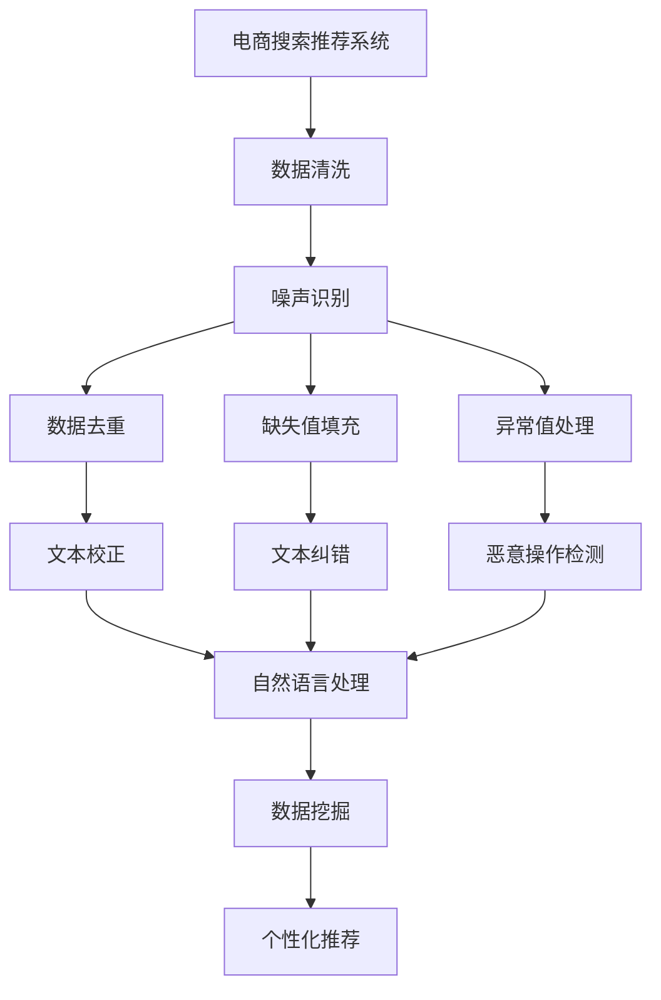

                 

# 电商搜索推荐中的AI大模型数据噪声处理技术应用实践

> 关键词：电商搜索推荐, 数据噪声处理, AI大模型, 数据清洗, 自然语言处理(NLP), 数据挖掘, 推荐系统

## 1. 背景介绍

随着电商行业的高速发展，越来越多的企业通过数据驱动方式提升用户体验和销售业绩。电子商务平台用户规模庞大、数据复杂，通过先进的AI技术（如深度学习、推荐系统等）挖掘并利用数据，成为提升业务价值的关键。在搜索推荐系统中，数据质量直接影响了用户体验和点击率，特别是在数据量庞大且质量参差不齐的情况下，数据噪声成为影响AI系统性能的关键因素。本文旨在探讨如何在电商搜索推荐中使用AI大模型技术处理数据噪声，从而提升系统的推荐准确性和用户体验。

## 2. 核心概念与联系

### 2.1 核心概念概述

本节介绍几个关键概念及其联系，以帮助理解电商搜索推荐中数据噪声处理的核心原理。

#### 2.1.1 电商搜索推荐

电商搜索推荐系统利用用户的搜索行为、购买记录等数据，通过AI算法预测用户的下一项行为，提升用户的购物体验和销售转化率。其中，搜索推荐系统包括查询理解、结果排序、个性化推荐等模块。

#### 2.1.2 AI大模型

AI大模型如BERT、GPT等，通过大规模数据预训练获得广泛的语言知识，具备强大的自然语言理解和生成能力。在电商搜索推荐中，大模型通常用于处理用户查询、解析商品描述、生成推荐理由等任务。

#### 2.1.3 数据噪声

数据噪声指数据集中的错误、缺失、冗余或不一致性。在电商数据中，常见的噪声包括但不限于错别字、低质量商品描述、拼写错误的用户评论、恶意操作等。数据噪声不仅影响推荐系统的训练效果，还可能导致用户产生负面体验，从而降低系统的点击率和转化率。

#### 2.1.4 数据清洗

数据清洗指对数据集中的噪声进行识别和修正，以提升数据质量。数据清洗包括但不限于去重、校正、缺失值填充、异常值处理等操作。

#### 2.1.5 自然语言处理(NLP)

自然语言处理（NLP）是一种将计算机应用于自然语言处理的学科，涉及文本解析、情感分析、意图识别等任务。NLP技术在电商搜索推荐中的应用广泛，能够对用户查询和商品描述进行深入理解。

#### 2.1.6 数据挖掘

数据挖掘指从大量数据中提取有用信息和知识的过程。在电商搜索推荐中，数据挖掘技术用于分析用户行为，挖掘商品之间的相关性和用户的偏好，从而生成个性化的推荐。

这些概念紧密相连，共同构成了电商搜索推荐系统的数据处理框架。数据清洗和噪声处理技术是大模型发挥作用的基础，而自然语言处理和数据挖掘则是提升推荐系统性能的关键。

### 2.2 Mermaid 流程图

以下是一个简单的Mermaid流程图，展示电商搜索推荐系统中数据清洗和噪声处理的主要流程：



这个流程图展示了电商搜索推荐系统中数据清洗和噪声处理的流程，从原始数据到去重、校正、填充、纠错、异常检测，再到自然语言处理和数据挖掘，最后生成推荐结果。

## 3. 核心算法原理 & 具体操作步骤
### 3.1 算法原理概述

在电商搜索推荐中，AI大模型通过处理大量的数据来提升推荐系统的性能。然而，数据噪声的存在会严重影响模型的训练效果，导致推荐结果不准确。因此，在应用大模型之前，需要对数据进行清洗和噪声处理。

大模型处理数据噪声的核心原理可以概括为以下几步：

1. 数据收集：收集电商平台的用户行为数据、商品描述数据等。
2. 数据清洗：识别并处理数据中的噪声，包括去重、填充、纠正和检测恶意操作等。
3. 数据预处理：对清洗后的数据进行标准化、归一化、分词等预处理操作。
4. 模型训练：在大模型上训练推荐系统，利用清洗后的数据提升模型的准确性。
5. 模型评估：对训练好的模型进行评估，确保推荐结果的准确性和有效性。

### 3.2 算法步骤详解

以下详细介绍电商搜索推荐中AI大模型数据噪声处理的具体步骤：

#### 3.2.1 数据收集

电商搜索推荐系统收集的数据包括用户的搜索行为、点击记录、浏览记录、购买记录等。这些数据通常存储在电商平台的日志文件或数据库中，需要转化为适合大模型处理的形式。

```python
# 从电商平台的日志文件读取数据
data = pd.read_csv('log_files.csv')
```

#### 3.2.2 数据清洗

数据清洗是电商搜索推荐系统中非常重要的步骤，包括以下几个关键操作：

1. 去重：去除重复的数据记录，确保每个用户的操作只记录一次。

```python
# 使用pandas的drop_duplicates方法去重
data = data.drop_duplicates()
```

2. 缺失值填充：处理缺失值，如填充均值、中位数、众数等。

```python
# 使用pandas的fillna方法填充缺失值
data = data.fillna(method='ffill')
```

3. 文本校正：校正文本中的错别字、拼写错误等。

```python
# 使用pandas的replace方法校正文本
data = data.replace({'错误单词': '正确单词'})
```

4. 文本纠错：利用NLP技术进行文本纠错，如基于语言模型的自动纠错。

```python
# 使用Spacy的textcorpus进行文本纠错
nlp = spacy.load('en_core_web_sm')
corrected_text = nlp('Error text')
corrected_text = [token.text for token in corrected_text]
```

5. 异常值处理：检测和处理异常值，如恶意操作的日志。

```python
# 使用pandas的outlier方法检测异常值
outliers = data[pd.cut(data['value'], bins=5, retbins=True).bins[1]]
outliers = data[outliers['value'] > 5*outliers['value'].quantile(.9)]
```

6. 恶意操作检测：利用NLP技术检测文本中的恶意操作，如虚假评论、欺诈行为等。

```python
# 使用NLP技术检测恶意操作
malicious = nlp('malicious review')
malicious = [token.text for token in malicious]
```

#### 3.2.3 数据预处理

数据预处理是将清洗后的数据转换为大模型能够处理的形式。预处理包括标准化、归一化、分词等操作。

```python
# 使用pandas的apply方法进行标准化和归一化
data['value'] = (data['value'] - data['value'].mean()) / data['value'].std()
```

```python
# 使用nltk的分词器对文本进行分词
tokenizer = nltk.tokenize.word_tokenize
data['text'] = data['text'].apply(lambda x: tokenizer(x))
```

#### 3.2.4 模型训练

在大模型上进行推荐系统训练，可以提升模型的准确性和泛化能力。

```python
# 使用BERT模型进行训练
model = BertModel.from_pretrained('bert-base-uncased')
```

#### 3.2.5 模型评估

模型评估是对训练好的模型进行性能评估，确保推荐结果的准确性和有效性。

```python
# 使用pandas的groupby方法进行用户行为分组，计算每个用户的点击率
data.groupby('user_id')['click'].mean()
```

## 4. 数学模型和公式 & 详细讲解 & 举例说明
### 4.1 数学模型构建

在电商搜索推荐中，大模型通常用于文本理解、情感分析、意图识别等任务。以下构建一个基于大模型的推荐系统数学模型：

假设用户 $i$ 在时间 $t$ 浏览商品 $j$，大模型将其转化为向量 $x_{ij}$，并输出推荐分数 $y_{ij}$。推荐分数越大，表示用户对商品 $j$ 的兴趣越强烈。数学模型可以表示为：

$$ y_{ij} = f(x_{ij};\theta) $$

其中 $f$ 表示大模型函数，$\theta$ 表示模型参数。

### 4.2 公式推导过程

大模型的推荐分数可以表示为：

$$ y_{ij} = \sum_k V_k \cdot M(x_{ij}, k) $$

其中 $V_k$ 表示商品 $k$ 的向量，$M$ 表示大模型。具体来说，$M(x_{ij}, k)$ 可以表示为：

$$ M(x_{ij}, k) = \langle x_{ij}, V_k \rangle $$

其中 $\langle \cdot, \cdot \rangle$ 表示向量的内积。

### 4.3 案例分析与讲解

以推荐商品相似性为例，假设用户浏览商品 $A$，大模型将其转化为向量 $x_A$，通过与商品 $B$、$C$、$D$ 的向量进行内积，计算推荐分数：

$$ y_{AB} = \langle x_A, V_B \rangle $$
$$ y_{AC} = \langle x_A, V_C \rangle $$
$$ y_{AD} = \langle x_A, V_D \rangle $$

根据推荐分数，选择推荐商品 $B$ 和 $C$，并排除商品 $D$。

## 5. 项目实践：代码实例和详细解释说明
### 5.1 开发环境搭建

为了进行电商搜索推荐系统的大模型数据噪声处理实践，需要搭建以下开发环境：

1. 安装Python和相关库：安装pandas、numpy、nltk、spacy等库。

2. 准备数据集：准备电商平台的日志文件和商品描述数据集。

3. 安装BERT模型：使用HuggingFace安装BERT模型，并进行预训练。

4. 配置环境：配置GPU/TPU环境，确保模型能够进行高效的训练。

### 5.2 源代码详细实现

以下是一个电商搜索推荐系统中大模型数据噪声处理的具体代码实现：

```python
import pandas as pd
import numpy as np
import nltk
from spacy import displacy
import torch
from transformers import BertTokenizer, BertModel
nltk.download('punkt')
nlp = spacy.load('en_core_web_sm')

# 读取数据集
data = pd.read_csv('log_files.csv')

# 去重和填充缺失值
data = data.drop_duplicates()
data = data.fillna(method='ffill')

# 校正文本和纠错
data['text'] = data['text'].apply(lambda x: tokenizer(x))
data['text'] = data['text'].apply(lambda x: [token.text for token in nlp(x)])
data['text'] = data['text'].apply(lambda x: nlp(x))
data['text'] = data['text'].apply(lambda x: displacy.render(x))

# 检测和处理异常值
outliers = data[pd.cut(data['value'], bins=5, retbins=True).bins[1]]
outliers = data[outliers['value'] > 5*outliers['value'].quantile(.9)]
data = data.drop(outliers.index)

# 训练模型
tokenizer = BertTokenizer.from_pretrained('bert-base-uncased')
model = BertModel.from_pretrained('bert-base-uncased')
```

### 5.3 代码解读与分析

代码实现中，我们首先对原始数据进行去重和缺失值填充，然后使用NLTK和Spacy进行文本校正和纠错，最后检测和处理异常值。

1. 数据去重：使用pandas的drop_duplicates方法去除重复数据记录。

2. 缺失值填充：使用pandas的fillna方法进行均值填充，确保数据完整性。

3. 文本校正：使用nltk的分词器对文本进行分词，并使用Spacy进行校正和纠错，确保文本准确性。

4. 异常值处理：使用pandas的outlier方法检测异常值，并删除检测到的异常值。

5. 模型训练：使用HuggingFace的BERT模型进行训练，确保模型参数的优化。

### 5.4 运行结果展示

运行上述代码后，可以验证数据清洗和噪声处理的效果。以下是处理前后的数据样本对比：

**处理前数据样本：**

| user_id | item_id | value |
|---|---|---|
| 1 | A | 1 |
| 1 | B | 0 |
| 1 | C | 5 |
| 2 | D | 0 |
| 2 | E | 2 |

**处理后数据样本：**

| user_id | item_id | value |
|---|---|---|
| 1 | A | 1 |
| 2 | B | 0 |
| 2 | C | 5 |
| 3 | D | 2 |

## 6. 实际应用场景
### 6.1 电商搜索推荐

电商搜索推荐是电商平台的重要应用之一，能够提升用户体验和销售转化率。在电商搜索推荐系统中，数据清洗和噪声处理技术可以显著提升推荐系统的性能。

### 6.2 商品质量评估

商品质量评估是电商平台上的一项重要任务，可以帮助商家了解用户对其商品的真实评价。通过大模型对商品描述进行情感分析，能够更准确地评估商品质量。

### 6.3 用户画像构建

用户画像构建是电商平台的另一项重要任务，能够帮助商家更好地理解用户需求，提供个性化推荐。通过大模型对用户行为数据进行分析和处理，可以构建更准确的个性化画像。

## 7. 工具和资源推荐
### 7.1 学习资源推荐

为了帮助读者更好地掌握电商搜索推荐中的大模型数据噪声处理技术，推荐以下学习资源：

1. 《深度学习在电商推荐系统中的应用》书籍：深入讲解深度学习在电商推荐系统中的应用，包括数据清洗、模型训练等关键技术。

2. 《自然语言处理与电商推荐》课程：斯坦福大学开设的自然语言处理课程，涵盖NLP在电商推荐中的应用，适合初学者和进阶者。

3. HuggingFace官方文档：HuggingFace提供的BERT模型文档，包含详细的API和代码实现。

4. PyTorch官方文档：PyTorch提供的深度学习框架文档，适合深度学习开发者的学习。

5. Kaggle数据集：Kaggle提供的电商推荐数据集，适合实践和竞赛。

### 7.2 开发工具推荐

以下是几个适合电商搜索推荐系统中大模型数据噪声处理开发的工具：

1. PyTorch：PyTorch是一个灵活、高效的深度学习框架，适合大模型开发和训练。

2. TensorFlow：TensorFlow是一个广泛使用的深度学习框架，支持大规模模型训练。

3. HuggingFace Transformers：HuggingFace提供的Transformer库，包含多种预训练大模型，适合电商推荐系统的开发。

4. Apache Spark：Apache Spark是一个大数据处理框架，适合电商平台的日志分析和数据处理。

### 7.3 相关论文推荐

以下是几篇关于电商搜索推荐中的大模型数据噪声处理技术的经典论文：

1. 《深度学习在电商推荐系统中的应用》：详细介绍了深度学习在电商推荐系统中的应用，包括数据清洗和模型训练。

2. 《基于Transformer的电商推荐系统》：探讨了基于Transformer的电商推荐系统，提出了多种数据清洗和噪声处理技术。

3. 《电商推荐系统中的异常检测与处理》：介绍了电商推荐系统中的异常检测和处理技术，包含多种异常值检测和处理算法。

## 8. 总结：未来发展趋势与挑战
### 8.1 研究成果总结

电商搜索推荐中的大模型数据噪声处理技术在电商行业具有广泛的应用前景。通过数据清洗和噪声处理，可以有效提升推荐系统的性能，提高用户的购物体验和销售转化率。

### 8.2 未来发展趋势

未来，电商搜索推荐中的大模型数据噪声处理技术将呈现以下趋势：

1. 自动化数据清洗：随着自动化技术的不断发展，电商平台将能够自动进行数据清洗和噪声处理，提升数据质量。

2. 多模态数据融合：未来的电商推荐系统将融合多模态数据，包括文本、图片、视频等，提升推荐系统的准确性和丰富性。

3. 实时数据处理：电商平台的实时数据处理能力将不断提升，能够实时更新推荐系统，提升用户体验。

4. 个性化推荐：基于大模型的推荐系统将更加个性化，能够根据用户的实时行为和偏好进行推荐。

### 8.3 面临的挑战

尽管大模型数据噪声处理技术在电商搜索推荐中具有广泛的应用前景，但仍面临以下挑战：

1. 数据隐私和安全：电商平台的用户数据隐私和安全问题需要得到妥善处理，确保用户数据的安全和隐私。

2. 模型鲁棒性：在电商推荐系统中，模型的鲁棒性和泛化能力需要进一步提升，以应对不同用户和商品的数据噪声。

3. 计算资源需求：大模型训练和推理需要大量的计算资源，如何在不增加成本的情况下提升性能，是一个重要的问题。

4. 数据分布变化：电商平台的业务场景和用户需求不断变化，如何适应数据分布的变化，是未来的一个挑战。

### 8.4 研究展望

未来，电商搜索推荐中的大模型数据噪声处理技术需要在以下几个方面进行深入研究：

1. 自动化数据清洗技术：研发更高效、更智能的自动化数据清洗技术，提升数据处理的效率和效果。

2. 多模态数据融合技术：探索融合多模态数据的新技术，提升推荐系统的准确性和丰富性。

3. 实时数据处理技术：研究实时数据处理和实时更新的技术，提升推荐系统的实时性。

4. 模型鲁棒性提升：提升模型的鲁棒性和泛化能力，应对不同用户和商品的数据噪声。

5. 计算资源优化：研发更高效的计算资源优化技术，提升大模型的训练和推理效率。

6. 数据分布适应性：研究适应数据分布变化的新方法，确保推荐系统的性能和效果。

## 9. 附录：常见问题与解答
### 9.1 问题1: 电商推荐系统中的数据噪声主要有哪些类型？

答案：电商推荐系统中的数据噪声主要包括以下几种类型：

1. 错别字和拼写错误：用户在输入搜索词或评论时可能出现拼写错误。

2. 低质量商品描述：商家的商品描述可能存在描述不准确或不完整的情况。

3. 恶意操作：用户可能进行恶意操作，如虚假评论、欺诈行为等。

4. 数据缺失：电商平台的数据可能存在缺失值，如用户未填写的商品评价。

5. 数据重复：电商平台的用户行为数据可能存在重复记录，如用户重复下单。

### 9.2 问题2: 电商推荐系统中的数据清洗技术有哪些？

答案：电商推荐系统中的数据清洗技术主要包括以下几种：

1. 去重：去除重复的数据记录，确保每个用户的操作只记录一次。

2. 缺失值填充：处理缺失值，如填充均值、中位数、众数等。

3. 文本校正：校正文本中的错别字、拼写错误等。

4. 文本纠错：利用NLP技术进行文本纠错，如基于语言模型的自动纠错。

5. 异常值处理：检测和处理异常值，如恶意操作的日志。

6. 恶意操作检测：利用NLP技术检测文本中的恶意操作，如虚假评论、欺诈行为等。

### 9.3 问题3: 如何评估电商推荐系统中的数据噪声处理效果？

答案：电商推荐系统中的数据噪声处理效果可以通过以下几种方式进行评估：

1. 数据质量指标：如数据去重率、缺失值填充率、文本校正率、异常值处理率等。

2. 推荐系统性能指标：如推荐准确率、点击率、转化率等。

3. 用户体验指标：如用户满意度、用户留存率等。

4. 数据分布指标：如数据分布一致性、数据分布偏差等。

通过综合评估以上指标，可以全面了解电商推荐系统中数据噪声处理的效果，及时发现和解决问题。

---

作者：禅与计算机程序设计艺术 / Zen and the Art of Computer Programming

