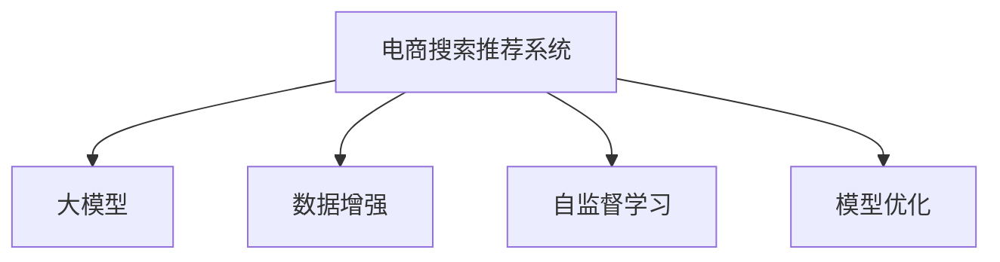

                 

# 电商搜索推荐中的AI大模型数据增强技术应用

> 关键词：电商搜索推荐, 大模型, 数据增强, 自然语言处理(NLP), 自监督学习, 深度学习, 模型优化, 学习率调度

## 1. 背景介绍

### 1.1 问题由来
随着电商平台的快速发展，用户搜索和推荐系统的智能化需求日益增加。如何提升搜索推荐系统的精准度和个性化程度，提升用户体验和转化率，成为各大电商平台亟待解决的难题。

传统基于规则和统计模型的搜索推荐系统，难以处理海量、高维的数据，且缺乏对语言理解的智能。而基于深度学习技术的大模型，特别是自然语言处理(NLP)领域的预训练模型，为电商搜索推荐系统带来了新的解决方案。

### 1.2 问题核心关键点
大模型在电商搜索推荐中的应用，核心在于通过预训练和微调，使得模型具备理解和生成电商相关自然语言的能力。

具体而言，主要包括以下几个关键点：

1. **预训练**：在大规模无标签电商文本数据上，通过自监督学习任务（如掩码语言模型）训练模型，学习通用的电商领域语言表示。
2. **微调**：在电商领域的小规模标注数据上，通过有监督学习任务（如分类、匹配、生成等），进一步优化模型在电商任务上的性能。
3. **数据增强**：通过生成、改写、合成等方法，丰富训练数据的多样性，提升模型泛化能力。
4. **模型优化**：通过调整学习率、正则化、集成等多种方法，优化模型结构和训练过程，提升模型效果。

### 1.3 问题研究意义
大模型在电商搜索推荐中的应用，对于提升搜索推荐系统的精准度和个性化程度，提升用户体验和转化率，具有重要意义：

1. **精准推荐**：通过理解电商用户的搜索意图，生成更加符合用户需求的商品推荐，提升点击率和转化率。
2. **个性推荐**：根据用户的历史行为和偏好，提供更加个性化的商品推荐，提升用户满意度。
3. **智能客服**：通过大模型生成自然语言回答，提供7x24小时不间断的智能客服支持，提升用户体验。
4. **数据驱动**：利用电商数据，训练和优化模型，驱动平台的持续创新和优化。

## 2. 核心概念与联系

### 2.1 核心概念概述

为更好地理解大模型在电商搜索推荐中的应用，本节将介绍几个密切相关的核心概念：

- **电商搜索推荐系统**：利用自然语言处理技术，基于用户搜索查询和行为数据，提供商品推荐和搜索建议的系统。
- **大模型**：如BERT、GPT、MPLM等，通过在大规模无标签数据上预训练，学习到通用的语言表示。
- **数据增强**：通过生成、改写、合成等方法，丰富训练数据的多样性，提升模型泛化能力。
- **自监督学习**：利用无标签数据进行自监督学习，训练模型获得通用语言表示。
- **模型优化**：通过调整学习率、正则化、集成等多种方法，优化模型结构和训练过程，提升模型效果。

这些核心概念之间的逻辑关系可以通过以下Mermaid流程图来展示：



这个流程图展示了大模型在电商搜索推荐中的应用流程：

1. 电商搜索推荐系统通过大模型进行自然语言理解和生成。
2. 通过数据增强技术，丰富训练数据的多样性。
3. 利用自监督学习任务，训练大模型学习通用语言表示。
4. 应用模型优化技术，提升模型效果和性能。

## 3. 核心算法原理 & 具体操作步骤
### 3.1 算法原理概述

大模型在电商搜索推荐中的应用，基于以下核心算法原理：

- **预训练和微调**：利用大模型在大规模无标签电商文本数据上进行预训练，学习通用的电商领域语言表示。然后在电商领域的小规模标注数据上，通过有监督学习任务进行微调，提升模型在电商任务上的性能。
- **数据增强**：通过生成、改写、合成等方法，丰富训练数据的多样性，提升模型泛化能力。
- **模型优化**：通过调整学习率、正则化、集成等多种方法，优化模型结构和训练过程，提升模型效果。

### 3.2 算法步骤详解

大模型在电商搜索推荐中的应用，主要包括以下几个关键步骤：

**Step 1: 数据准备和预处理**
- 收集电商领域的文本数据，包括商品描述、用户评论、搜索查询等。
- 对文本进行分词、清洗、去停用词等预处理，得到模型训练所需的文本数据。

**Step 2: 构建数据增强流程**
- 应用生成式数据增强技术，如文本合成、回译等，生成新的电商文本数据。
- 应用改写式数据增强技术，如近义替换、上下文改写等，改写现有电商文本数据。
- 应用合成式数据增强技术，如生成式预训练任务（如掩码语言模型），合成新的电商文本数据。

**Step 3: 预训练和微调**
- 在电商领域的大规模无标签数据上，利用自监督学习任务（如掩码语言模型）训练大模型，学习通用的电商领域语言表示。
- 在电商领域的小规模标注数据上，利用有监督学习任务（如分类、匹配、生成等）进行微调，提升模型在电商任务上的性能。

**Step 4: 模型优化**
- 调整学习率、正则化等超参数，优化模型结构和训练过程。
- 应用集成技术，如模型融合、模型蒸馏等，提升模型效果和性能。

**Step 5: 模型部署和评估**
- 将优化后的模型部署到电商搜索推荐系统中，实时计算和生成推荐结果。
- 在测试集上评估模型性能，对比微调前后的效果提升。

### 3.3 算法优缺点

大模型在电商搜索推荐中的应用，具有以下优点：

- **泛化能力强**：预训练和微调的过程，使模型能够学习通用的电商领域语言表示，具备较强的泛化能力。
- **个性化推荐**：通过理解电商用户的搜索意图，生成更加符合用户需求的商品推荐，提升用户体验。
- **智能客服**：利用大模型生成自然语言回答，提供7x24小时不间断的智能客服支持，提升用户满意度。
- **动态优化**：模型可以实时更新，根据新的数据和用户反馈进行动态优化，提升推荐精度。

同时，该方法也存在一定的局限性：

- **计算资源需求高**：大模型和微调过程对计算资源的需求较高，需配备高性能的GPU/TPU设备。
- **数据隐私问题**：电商领域涉及用户隐私，数据获取和使用需遵循相关法律法规。
- **模型解释性不足**：大模型作为黑盒模型，难以解释其内部工作机制和决策逻辑。

尽管存在这些局限性，但大模型在电商搜索推荐中的应用，仍然是一种高效、可行的解决方案。

### 3.4 算法应用领域

大模型在电商搜索推荐中的应用，主要应用于以下几个领域：

1. **商品推荐**：根据用户搜索查询，生成符合用户需求的商品推荐，提升点击率和转化率。
2. **智能客服**：利用大模型生成自然语言回答，提供7x24小时不间断的智能客服支持，提升用户体验。
3. **搜索建议**：基于用户输入的搜索查询，生成相关搜索建议，提升搜索精准度。
4. **市场分析**：利用电商数据，训练和优化模型，分析市场趋势和用户行为，驱动平台的持续创新和优化。

## 4. 数学模型和公式 & 详细讲解 & 举例说明

### 4.1 数学模型构建

本节将使用数学语言对大模型在电商搜索推荐中的应用进行更加严格的刻画。

记电商领域的文本数据为 $D=\{(x_i, y_i)\}_{i=1}^N$，其中 $x_i$ 为电商文本，$y_i$ 为标签（如商品ID、分类标签等）。

定义模型 $M_{\theta}$ 在输入 $x_i$ 上的输出为 $\hat{y}=M_{\theta}(x_i) \in \mathcal{Y}$，$\mathcal{Y}$ 为输出空间，$\theta$ 为模型参数。

假设电商领域的文本数据 $D$ 在大模型上进行预训练，学习到通用的电商领域语言表示。然后在电商领域的小规模标注数据上进行微调，优化模型在特定电商任务上的性能。

### 4.2 公式推导过程

**预训练过程**：

假设大模型在大规模无标签电商文本数据上进行预训练，学习到通用的电商领域语言表示。则预训练过程的目标是最小化以下损失函数：

$$
\mathcal{L}_{pre} = \frac{1}{N}\sum_{i=1}^N \mathcal{L}_{pre}(x_i)
$$

其中，$\mathcal{L}_{pre}(x_i)$ 为预训练损失函数，通常为掩码语言模型或自编码器的负对数似然损失。

**微调过程**：

假设电商领域的小规模标注数据为 $D^{*}=\{(x_i^*, y_i^*)\}_{i=1}^N$，则在电商领域的小规模标注数据上进行微调，目标是最小化以下损失函数：

$$
\mathcal{L}_{fin} = \frac{1}{N}\sum_{i=1}^N \mathcal{L}_{fin}(x_i^*, y_i^*)
$$

其中，$\mathcal{L}_{fin}(x_i^*, y_i^*)$ 为微调损失函数，通常为分类、匹配、生成等任务的目标损失函数。

**综合训练过程**：

综合预训练和微调过程，模型的综合训练损失函数为：

$$
\mathcal{L} = \alpha \mathcal{L}_{pre} + (1-\alpha) \mathcal{L}_{fin}
$$

其中，$\alpha$ 为预训练和微调的权衡系数，通常在 $[0,1]$ 之间。

### 4.3 案例分析与讲解

假设电商推荐系统的目标是预测用户对商品的兴趣，即判断用户是否对某个商品感兴趣。模型训练样本为 $D^{*}=\{(x_i^*, y_i^*)\}_{i=1}^N$，其中 $x_i^*$ 为电商文本，$y_i^*$ 为感兴趣标签。

模型在训练样本上进行微调，最小化二分类交叉熵损失函数：

$$
\mathcal{L}_{fin}(x_i^*, y_i^*) = -[y_i^* \log \hat{y}_i + (1-y_i^*) \log (1-\hat{y}_i)]
$$

其中，$\hat{y}_i = M_{\theta}(x_i^*)$。

在测试集上，模型对新的电商文本 $x$ 进行预测，输出为 $\hat{y} = M_{\theta}(x)$。

## 5. 项目实践：代码实例和详细解释说明
### 5.1 开发环境搭建

在进行大模型在电商搜索推荐中的应用实践前，我们需要准备好开发环境。以下是使用Python进行PyTorch开发的环境配置流程：

1. 安装Anaconda：从官网下载并安装Anaconda，用于创建独立的Python环境。

2. 创建并激活虚拟环境：
```bash
conda create -n pytorch-env python=3.8 
conda activate pytorch-env
```

3. 安装PyTorch：根据CUDA版本，从官网获取对应的安装命令。例如：
```bash
conda install pytorch torchvision torchaudio cudatoolkit=11.1 -c pytorch -c conda-forge
```

4. 安装Transformers库：
```bash
pip install transformers
```

5. 安装各类工具包：
```bash
pip install numpy pandas scikit-learn matplotlib tqdm jupyter notebook ipython
```

完成上述步骤后，即可在`pytorch-env`环境中开始大模型在电商搜索推荐中的应用实践。

### 5.2 源代码详细实现

这里我们以BERT模型为例，展示大模型在电商搜索推荐中的应用实践。

首先，定义电商领域的数据处理函数：

```python
from transformers import BertTokenizer
from torch.utils.data import Dataset
import torch

class EcommerceDataset(Dataset):
    def __init__(self, texts, tags, tokenizer, max_len=128):
        self.texts = texts
        self.tags = tags
        self.tokenizer = tokenizer
        self.max_len = max_len
        
    def __len__(self):
        return len(self.texts)
    
    def __getitem__(self, item):
        text = self.texts[item]
        tags = self.tags[item]
        
        encoding = self.tokenizer(text, return_tensors='pt', max_length=self.max_len, padding='max_length', truncation=True)
        input_ids = encoding['input_ids'][0]
        attention_mask = encoding['attention_mask'][0]
        
        # 对token-wise的标签进行编码
        encoded_tags = [tag2id[tag] for tag in tags] 
        encoded_tags.extend([tag2id['O']] * (self.max_len - len(encoded_tags)))
        labels = torch.tensor(encoded_tags, dtype=torch.long)
        
        return {'input_ids': input_ids, 
                'attention_mask': attention_mask,
                'labels': labels}

# 标签与id的映射
tag2id = {'O': 0, '感兴趣': 1}
id2tag = {v: k for k, v in tag2id.items()}

# 创建dataset
tokenizer = BertTokenizer.from_pretrained('bert-base-cased')

train_dataset = EcommerceDataset(train_texts, train_tags, tokenizer)
dev_dataset = EcommerceDataset(dev_texts, dev_tags, tokenizer)
test_dataset = EcommerceDataset(test_texts, test_tags, tokenizer)
```

然后，定义模型和优化器：

```python
from transformers import BertForTokenClassification, AdamW

model = BertForTokenClassification.from_pretrained('bert-base-cased', num_labels=len(tag2id))

optimizer = AdamW(model.parameters(), lr=2e-5)
```

接着，定义训练和评估函数：

```python
from torch.utils.data import DataLoader
from tqdm import tqdm
from sklearn.metrics import classification_report

device = torch.device('cuda') if torch.cuda.is_available() else torch.device('cpu')
model.to(device)

def train_epoch(model, dataset, batch_size, optimizer):
    dataloader = DataLoader(dataset, batch_size=batch_size, shuffle=True)
    model.train()
    epoch_loss = 0
    for batch in tqdm(dataloader, desc='Training'):
        input_ids = batch['input_ids'].to(device)
        attention_mask = batch['attention_mask'].to(device)
        labels = batch['labels'].to(device)
        model.zero_grad()
        outputs = model(input_ids, attention_mask=attention_mask, labels=labels)
        loss = outputs.loss
        epoch_loss += loss.item()
        loss.backward()
        optimizer.step()
    return epoch_loss / len(dataloader)

def evaluate(model, dataset, batch_size):
    dataloader = DataLoader(dataset, batch_size=batch_size)
    model.eval()
    preds, labels = [], []
    with torch.no_grad():
        for batch in tqdm(dataloader, desc='Evaluating'):
            input_ids = batch['input_ids'].to(device)
            attention_mask = batch['attention_mask'].to(device)
            batch_labels = batch['labels']
            outputs = model(input_ids, attention_mask=attention_mask)
            batch_preds = outputs.logits.argmax(dim=2).to('cpu').tolist()
            batch_labels = batch_labels.to('cpu').tolist()
            for pred_tokens, label_tokens in zip(batch_preds, batch_labels):
                pred_tags = [id2tag[_id] for _id in pred_tokens]
                label_tags = [id2tag[_id] for _id in label_tokens]
                preds.append(pred_tags[:len(label_tags)])
                labels.append(label_tags)
                
    print(classification_report(labels, preds))
```

最后，启动训练流程并在测试集上评估：

```python
epochs = 5
batch_size = 16

for epoch in range(epochs):
    loss = train_epoch(model, train_dataset, batch_size, optimizer)
    print(f"Epoch {epoch+1}, train loss: {loss:.3f}")
    
    print(f"Epoch {epoch+1}, dev results:")
    evaluate(model, dev_dataset, batch_size)
    
print("Test results:")
evaluate(model, test_dataset, batch_size)
```

以上就是使用PyTorch对BERT进行电商搜索推荐任务微调的完整代码实现。可以看到，得益于Transformers库的强大封装，我们可以用相对简洁的代码完成BERT模型的加载和微调。

### 5.3 代码解读与分析

让我们再详细解读一下关键代码的实现细节：

**EcommerceDataset类**：
- `__init__`方法：初始化文本、标签、分词器等关键组件。
- `__len__`方法：返回数据集的样本数量。
- `__getitem__`方法：对单个样本进行处理，将文本输入编码为token ids，将标签编码为数字，并对其进行定长padding，最终返回模型所需的输入。

**tag2id和id2tag字典**：
- 定义了标签与数字id之间的映射关系，用于将token-wise的预测结果解码回真实的标签。

**训练和评估函数**：
- 使用PyTorch的DataLoader对数据集进行批次化加载，供模型训练和推理使用。
- 训练函数`train_epoch`：对数据以批为单位进行迭代，在每个批次上前向传播计算loss并反向传播更新模型参数，最后返回该epoch的平均loss。
- 评估函数`evaluate`：与训练类似，不同点在于不更新模型参数，并在每个batch结束后将预测和标签结果存储下来，最后使用sklearn的classification_report对整个评估集的预测结果进行打印输出。

**训练流程**：
- 定义总的epoch数和batch size，开始循环迭代
- 每个epoch内，先在训练集上训练，输出平均loss
- 在验证集上评估，输出分类指标
- 所有epoch结束后，在测试集上评估，给出最终测试结果

可以看到，PyTorch配合Transformers库使得BERT微调的代码实现变得简洁高效。开发者可以将更多精力放在数据处理、模型改进等高层逻辑上，而不必过多关注底层的实现细节。

当然，工业级的系统实现还需考虑更多因素，如模型的保存和部署、超参数的自动搜索、更灵活的任务适配层等。但核心的微调范式基本与此类似。

## 6. 实际应用场景
### 6.1 智能搜索推荐

智能搜索推荐系统是电商搜索推荐系统的典型应用。通过大模型进行电商文本的语义理解，生成符合用户搜索意图的商品推荐，大幅提升用户搜索的精准度和体验。

### 6.2 智能客服

智能客服是电商搜索推荐系统的另一种重要应用。利用大模型生成自然语言回答，提供7x24小时不间断的智能客服支持，提升用户体验和转化率。

### 6.3 市场分析

市场分析是电商搜索推荐系统的另一大应用。通过大模型分析市场趋势和用户行为，为平台提供数据驱动的决策支持，驱动平台的持续创新和优化。

### 6.4 未来应用展望

大模型在电商搜索推荐中的应用前景广阔，未来将向着以下几个方向发展：

1. **个性化推荐**：通过理解电商用户的搜索意图，生成更加符合用户需求的商品推荐，提升用户体验。
2. **智能客服**：利用大模型生成自然语言回答，提供7x24小时不间断的智能客服支持，提升用户满意度。
3. **动态优化**：模型可以实时更新，根据新的数据和用户反馈进行动态优化，提升推荐精度。
4. **多模态融合**：结合电商图片、视频等多模态数据，提升推荐的精准度和效果。
5. **知识图谱**：引入知识图谱，辅助电商推荐，提升推荐的多样性和相关性。

## 7. 工具和资源推荐
### 7.1 学习资源推荐

为了帮助开发者系统掌握大模型在电商搜索推荐中的应用，这里推荐一些优质的学习资源：

1. 《Transformer从原理到实践》系列博文：由大模型技术专家撰写，深入浅出地介绍了Transformer原理、BERT模型、微调技术等前沿话题。

2. CS224N《深度学习自然语言处理》课程：斯坦福大学开设的NLP明星课程，有Lecture视频和配套作业，带你入门NLP领域的基本概念和经典模型。

3. 《Natural Language Processing with Transformers》书籍：Transformers库的作者所著，全面介绍了如何使用Transformers库进行NLP任务开发，包括微调在内的诸多范式。

4. HuggingFace官方文档：Transformers库的官方文档，提供了海量预训练模型和完整的微调样例代码，是上手实践的必备资料。

5. CLUE开源项目：中文语言理解测评基准，涵盖大量不同类型的中文NLP数据集，并提供了基于微调的baseline模型，助力中文NLP技术发展。

通过对这些资源的学习实践，相信你一定能够快速掌握大模型在电商搜索推荐中的应用精髓，并用于解决实际的NLP问题。

### 7.2 开发工具推荐

高效的开发离不开优秀的工具支持。以下是几款用于大模型在电商搜索推荐中的应用开发的常用工具：

1. PyTorch：基于Python的开源深度学习框架，灵活动态的计算图，适合快速迭代研究。大部分预训练语言模型都有PyTorch版本的实现。

2. TensorFlow：由Google主导开发的开源深度学习框架，生产部署方便，适合大规模工程应用。同样有丰富的预训练语言模型资源。

3. Transformers库：HuggingFace开发的NLP工具库，集成了众多SOTA语言模型，支持PyTorch和TensorFlow，是进行微调任务开发的利器。

4. Weights & Biases：模型训练的实验跟踪工具，可以记录和可视化模型训练过程中的各项指标，方便对比和调优。与主流深度学习框架无缝集成。

5. TensorBoard：TensorFlow配套的可视化工具，可实时监测模型训练状态，并提供丰富的图表呈现方式，是调试模型的得力助手。

6. Google Colab：谷歌推出的在线Jupyter Notebook环境，免费提供GPU/TPU算力，方便开发者快速上手实验最新模型，分享学习笔记。

合理利用这些工具，可以显著提升大模型在电商搜索推荐中的应用开发效率，加快创新迭代的步伐。

### 7.3 相关论文推荐

大模型在电商搜索推荐中的应用，源于学界的持续研究。以下是几篇奠基性的相关论文，推荐阅读：

1. Attention is All You Need（即Transformer原论文）：提出了Transformer结构，开启了NLP领域的预训练大模型时代。

2. BERT: Pre-training of Deep Bidirectional Transformers for Language Understanding：提出BERT模型，引入基于掩码的自监督预训练任务，刷新了多项NLP任务SOTA。

3. Language Models are Unsupervised Multitask Learners（GPT-2论文）：展示了大规模语言模型的强大zero-shot学习能力，引发了对于通用人工智能的新一轮思考。

4. Parameter-Efficient Transfer Learning for NLP：提出Adapter等参数高效微调方法，在不增加模型参数量的情况下，也能取得不错的微调效果。

5. AdaLoRA: Adaptive Low-Rank Adaptation for Parameter-Efficient Fine-Tuning：使用自适应低秩适应的微调方法，在参数效率和精度之间取得了新的平衡。

这些论文代表了大模型在电商搜索推荐中的应用的发展脉络。通过学习这些前沿成果，可以帮助研究者把握学科前进方向，激发更多的创新灵感。

## 8. 总结：未来发展趋势与挑战

### 8.1 总结

本文对大模型在电商搜索推荐中的应用进行了全面系统的介绍。首先阐述了大模型和微调技术的研究背景和意义，明确了微调在提升电商搜索推荐系统精准度和个性化程度方面的独特价值。其次，从原理到实践，详细讲解了大模型在电商搜索推荐中的应用过程，给出了微调任务开发的完整代码实例。同时，本文还广泛探讨了大模型在电商搜索推荐中的应用前景，展示了其巨大的潜力。

通过本文的系统梳理，可以看到，大模型在电商搜索推荐中的应用，对于提升电商平台的搜索推荐精度和个性化程度，提升用户体验和转化率，具有重要意义。未来，随着大模型和微调技术的不断发展，基于大模型的电商搜索推荐系统必将在电商领域大放异彩，为电商平台的智能化升级带来新的机遇。

### 8.2 未来发展趋势

展望未来，大模型在电商搜索推荐中的应用将呈现以下几个发展趋势：

1. **模型规模持续增大**：随着算力成本的下降和数据规模的扩张，预训练语言模型的参数量还将持续增长。超大模型具备更丰富的语言知识，能够更好地适应电商领域的复杂多样性，提升推荐精度。

2. **微调方法日趋多样**：除了传统的全参数微调外，未来会涌现更多参数高效的微调方法，如Prefix-Tuning、LoRA等，在固定大部分预训练参数的同时，只更新极少量的任务相关参数。同时，还会出现更多自监督、半监督等数据利用方式，提升模型泛化能力。

3. **持续学习成为常态**：随着电商领域的快速变化，微调模型需要不断学习新知识以保持性能。如何在不遗忘原有知识的同时，高效吸收新样本信息，将是重要的研究课题。

4. **数据增强技术发展**：生成式、改写式、合成式数据增强技术将不断进步，丰富电商领域的训练数据，提升模型泛化能力。

5. **多模态融合**：结合电商图片、视频等多模态数据，提升推荐的精准度和效果。

6. **知识图谱应用**：引入知识图谱，辅助电商推荐，提升推荐的多样性和相关性。

以上趋势凸显了大模型在电商搜索推荐中的应用前景。这些方向的探索发展，必将进一步提升电商搜索推荐系统的精准度和个性化程度，为电商平台的智能化升级带来新的机遇。

### 8.3 面临的挑战

尽管大模型在电商搜索推荐中的应用已经取得了显著成果，但在迈向更加智能化、普适化应用的过程中，仍面临诸多挑战：

1. **计算资源瓶颈**：大模型和微调过程对计算资源的需求较高，需配备高性能的GPU/TPU设备。

2. **数据隐私问题**：电商领域涉及用户隐私，数据获取和使用需遵循相关法律法规。

3. **模型解释性不足**：大模型作为黑盒模型，难以解释其内部工作机制和决策逻辑。

4. **动态优化难题**：模型需要实时更新，根据新的数据和用户反馈进行动态优化，提升推荐精度。

5. **知识图谱整合**：如何将知识图谱与大模型有效结合，提升推荐的精准度和效果，是一个重要的研究方向。

6. **多模态融合**：结合电商图片、视频等多模态数据，提升推荐的精准度和效果，是一个重要的研究方向。

正视大模型在电商搜索推荐应用中面临的这些挑战，积极应对并寻求突破，将是大模型在未来电商领域取得更大成功的关键。

### 8.4 研究展望

面对大模型在电商搜索推荐应用中面临的诸多挑战，未来的研究需要在以下几个方面寻求新的突破：

1. **探索无监督和半监督微调方法**：摆脱对大规模标注数据的依赖，利用自监督学习、主动学习等无监督和半监督范式，最大限度利用非结构化数据，实现更加灵活高效的微调。

2. **研究参数高效和计算高效的微调范式**：开发更加参数高效的微调方法，在固定大部分预训练参数的同时，只更新极少量的任务相关参数。同时优化微调模型的计算图，减少前向传播和反向传播的资源消耗，实现更加轻量级、实时性的部署。

3. **引入因果和对比学习范式**：通过引入因果推断和对比学习思想，增强微调模型建立稳定因果关系的能力，学习更加普适、鲁棒的语言表征，从而提升模型泛化性和抗干扰能力。

4. **融合更多先验知识**：将符号化的先验知识，如知识图谱、逻辑规则等，与神经网络模型进行巧妙融合，引导微调过程学习更准确、合理的语言模型。

5. **结合因果分析和博弈论工具**：将因果分析方法引入微调模型，识别出模型决策的关键特征，增强输出解释的因果性和逻辑性。借助博弈论工具刻画人机交互过程，主动探索并规避模型的脆弱点，提高系统稳定性。

6. **纳入伦理道德约束**：在模型训练目标中引入伦理导向的评估指标，过滤和惩罚有偏见、有害的输出倾向。同时加强人工干预和审核，建立模型行为的监管机制，确保输出符合人类价值观和伦理道德。

这些研究方向的探索，必将引领大模型在电商搜索推荐中的应用走向更高的台阶，为构建安全、可靠、可解释、可控的智能系统铺平道路。面向未来，大模型在电商搜索推荐中的应用还需要与其他人工智能技术进行更深入的融合，如知识表示、因果推理、强化学习等，多路径协同发力，共同推动电商搜索推荐系统的进步。只有勇于创新、敢于突破，才能不断拓展大模型的边界，让智能技术更好地造福电商平台的智能化升级。

## 9. 附录：常见问题与解答

**Q1：大模型在电商搜索推荐中是否适用于所有应用场景？**

A: 大模型在电商搜索推荐中的应用，虽然在大规模数据和复杂任务中表现优异，但在一些特定场景，如长尾商品推荐、个性化推荐系统等，仍需进一步优化和改进。需要根据具体应用场景，选择适合的模型和微调方法。

**Q2：如何缓解大模型在电商搜索推荐中的过拟合问题？**

A: 过拟合是电商搜索推荐中常见的问题，尤其是面对大规模标注数据不足时。缓解过拟合的方法包括数据增强、正则化、模型蒸馏等。

1. **数据增强**：通过生成、改写、合成等方法，丰富训练数据的多样性，提升模型泛化能力。
2. **正则化**：使用L2正则、Dropout等方法，防止模型过度适应训练数据。
3. **模型蒸馏**：通过教师模型和学生模型的结合，减少过拟合风险。

**Q3：电商领域如何保障数据隐私？**

A: 电商领域涉及用户隐私，数据获取和使用需遵循相关法律法规。保障数据隐私的方法包括：

1. **数据匿名化**：对数据进行去标识化处理，保障用户隐私。
2. **差分隐私**：在数据收集和分析过程中，引入随机扰动，保护用户隐私。
3. **数据安全**：采用加密存储、传输等技术，保障数据安全。

**Q4：大模型在电商搜索推荐中的应用如何实时更新？**

A: 实时更新是电商搜索推荐系统的重要需求。大模型在电商搜索推荐中的应用，可以通过以下方法实现实时更新：

1. **模型微调**：根据新的数据和用户反馈，重新微调模型，提升模型性能。
2. **在线学习**：利用在线学习算法，实时更新模型参数，保持模型最新状态。
3. **增量学习**：只更新与新数据相关的参数，避免全量更新带来的资源消耗。

**Q5：电商搜索推荐中如何结合知识图谱？**

A: 知识图谱是一种结构化的知识表示方式，可以辅助电商推荐，提升推荐的多样性和相关性。结合知识图谱的方法包括：

1. **知识增强**：将电商领域的相关知识，如商品分类、品牌信息等，融入知识图谱中。
2. **知识嵌入**：利用知识图谱中的实体和关系，生成商品之间的隐式联系，提升推荐效果。
3. **知识推理**：利用知识图谱进行实体和关系的推理，辅助电商推荐。

这些方法可以结合大模型的语言理解能力，提升电商推荐系统的智能水平。

**Q6：大模型在电商搜索推荐中的应用如何实现多模态融合？**

A: 电商搜索推荐中，结合图片、视频等多模态数据，可以提升推荐的精准度和效果。实现多模态融合的方法包括：

1. **多模态表示学习**：利用多模态融合技术，如多模态自编码器，学习不同模态之间的映射关系。
2. **多模态联合训练**：在电商推荐中，结合文本、图片、视频等多模态数据进行联合训练，提升模型性能。
3. **多模态特征融合**：将不同模态的特征进行融合，生成更加全面、精准的推荐结果。

通过多模态融合，可以提升电商搜索推荐系统的智能水平，提升用户满意度和转化率。

---

作者：禅与计算机程序设计艺术 / Zen and the Art of Computer Programming

