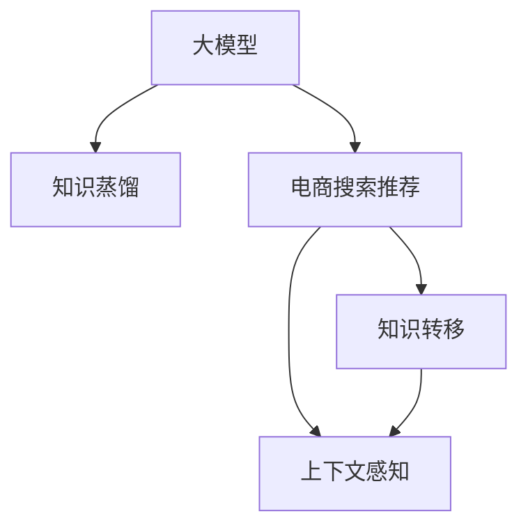

                 

# 电商搜索推荐中的AI大模型模型蒸馏技术探索

> 关键词：电商搜索推荐、AI大模型、模型蒸馏、知识蒸馏、知识转移、推荐系统、蒸馏算法

## 1. 背景介绍

随着电子商务的迅猛发展，用户数量和交易规模不断攀升，用户获取和保持、商品推荐等场景对于电商平台的价值日益显著。传统的基于规则、基于统计特征的推荐系统已难以满足用户个性化需求，特别是当数据量增大，推荐系统的复杂性增加时，对推荐模型的性能要求也变得越来越高。

人工智能(AI)技术在电商推荐系统的应用中已逐渐成为主流。以深度学习为代表的AI技术，利用大规模数据训练出复杂且精准的推荐模型，并结合上下文信息进行精准推荐，极大地提高了推荐系统的个性化水平和推荐效果。但与此同时，深度学习模型需要耗费大量计算资源和存储资源，对硬件要求高，且训练复杂度大，难以快速迭代和优化。

在此背景下，大模型蒸馏技术应运而生。大模型蒸馏技术是一种知识转移技术，旨在将大模型中携带的知识高效地转移到较小模型中，以降低大模型的复杂度和计算成本，同时保持原有模型的性能优势，更好地适应电商推荐等实际应用场景。本文将深入探讨大模型蒸馏技术在电商搜索推荐中的应用。

## 2. 核心概念与联系

### 2.1 核心概念概述

为更好地理解大模型蒸馏技术在电商搜索推荐中的应用，本节将介绍几个密切相关的核心概念：

- **大模型（Large Model）**：通常指具有上百亿甚至上千亿参数的深度学习模型，如BERT、GPT-3等，通过预训练和微调获得强大的语言理解和生成能力。
- **蒸馏（Distillation）**：一种知识转移技术，将大模型的知识压缩并转移到小模型中，保持小模型在特定任务上的优秀表现。
- **知识蒸馏（Knowledge Distillation）**：通过训练一个较小的模型（student model）来模仿一个较大的模型（teacher model），使得student模型能够继承teacher模型的知识。
- **电商搜索推荐系统（E-commerce Search and Recommendation System）**：基于用户行为数据、商品属性、搜索关键词等，为用户提供个性化的商品推荐。
- **上下文感知（Context-Aware）**：推荐系统需要根据用户的行为、上下文信息、商品属性等进行个性化推荐，以提升推荐效果。

这些核心概念之间的逻辑关系可以通过以下Mermaid流程图来展示：



这个流程图展示了大模型蒸馏与电商搜索推荐之间的联系：

1. 大模型通过预训练和微调获得广泛的知识和能力。
2. 通过知识蒸馏技术，将大模型中的知识转移给电商推荐系统的小模型。
3. 小模型结合上下文感知，应用知识进行个性化推荐。

## 3. 核心算法原理 & 具体操作步骤

### 3.1 算法原理概述

大模型蒸馏的原理是通过训练一个小模型（student model）来模仿一个大模型（teacher model），使得student模型能够继承teacher模型的知识，在特定任务上表现出色。具体来说，大模型蒸馏的流程如下：

1. 首先使用大模型在大规模数据上进行预训练，获得广泛的知识和能力。
2. 其次在大模型的基础上，设计一个较小的小模型（如ResNet、Transformer等），并使用蒸馏算法将其知识转移到小模型中。
3. 最后在小模型上进行微调，使其能够适应电商搜索推荐等特定任务，并获得良好的推荐效果。

蒸馏的核心在于将大模型中的知识压缩并转移到小模型中。通常，知识蒸馏会使用soft target或hard target的方式进行，分别将大模型的输出作为soft target或hard target来训练小模型，使得小模型能够精准地继承大模型的知识。

### 3.2 算法步骤详解

大模型蒸馏的具体操作步骤包括以下几个关键步骤：

**Step 1: 大模型的预训练**

1. 收集大规模无标签数据，通常为图像、文本、视频等。
2. 使用大模型（如ResNet、BERT、GPT等）在大规模数据上进行预训练。
3. 计算大模型的预测分布，作为教师模型的知识。

**Step 2: 设计小模型**

1. 根据实际应用场景，设计一个较小的模型（如ResNet、Transformer等）。
2. 初始化小模型参数，使用与大模型相同的初始化方法。

**Step 3: 知识蒸馏**

1. 使用大模型的预测分布作为soft target或hard target，训练小模型。
2. 使用soft target蒸馏时，将大模型的预测概率分布作为目标分布，训练小模型预测概率分布。
3. 使用hard target蒸馏时，将大模型的预测标签作为目标标签，训练小模型分类能力。

**Step 4: 微调小模型**

1. 在小模型上进行微调，使用电商推荐数据集进行训练。
2. 根据推荐效果，调整模型参数，优化模型性能。
3. 在小模型上进行测试和评估，确保模型能够满足实际应用需求。

### 3.3 算法优缺点

大模型蒸馏具有以下优点：

1. **性能提升**：通过知识蒸馏，小模型能够继承大模型的知识，从而提升模型的推荐效果。
2. **资源优化**：蒸馏过程大幅降低了模型的复杂度，减少了计算和存储资源需求，提升了系统的可扩展性和可部署性。
3. **快速迭代**：小模型更易于训练和优化，能够快速迭代和调整，提高推荐系统的时效性。

同时，大模型蒸馏也存在一些局限性：

1. **知识丢失**：在知识蒸馏过程中，部分知识可能丢失，导致小模型的表现不如大模型。
2. **复杂度增加**：蒸馏过程需要设计新的模型结构和训练方法，增加了模型的复杂度。
3. **计算开销**：蒸馏过程需要使用大模型进行预测和计算，增加了计算开销。
4. **鲁棒性不足**：小模型在特定任务上可能表现出较差的鲁棒性，对于数据分布的变化敏感。

### 3.4 算法应用领域

大模型蒸馏技术在电商搜索推荐中的应用，具有以下优势：

1. **个性化推荐**：通过继承大模型的知识，小模型能够更好地理解用户需求和行为，进行个性化推荐。
2. **上下文感知**：小模型结合上下文信息，能够更精准地进行推荐。
3. **实时响应**：小模型更轻量级，能够实时响应用户查询，提升推荐系统响应速度。
4. **数据高效**：蒸馏过程使用大模型进行预测，能够高效利用大规模数据进行训练和优化。

大模型蒸馏技术可以应用于各种电商推荐场景，如：

- **商品推荐**：根据用户历史行为和属性，推荐符合用户喜好的商品。
- **上下文推荐**：根据用户搜索关键词和上下文信息，推荐相关商品。
- **个性化广告**：根据用户行为和属性，推荐个性化的广告内容。
- **销售预测**：根据历史销售数据和用户行为，预测未来销售趋势。

## 4. 数学模型和公式 & 详细讲解 & 举例说明

### 4.1 数学模型构建

大模型蒸馏的数学模型通常包括以下几个关键部分：

1. **大模型（Teacher Model）**：$M_{T}$，接收输入数据$x$，输出预测概率分布$p(x)$。
2. **小模型（Student Model）**：$M_{S}$，接收输入数据$x$，输出预测概率分布$q(x)$。
3. **蒸馏损失（Distillation Loss）**：$L_{\text{distillation}}$，通过将大模型的预测分布$p(x)$作为目标分布，训练小模型的预测分布$q(x)$。

蒸馏损失函数通常包含两个部分：

- **软目标损失（Soft Target）**：$L_{\text{soft}}$
- **硬目标损失（Hard Target）**：$L_{\text{hard}}$

**软目标损失（Soft Target）**：
$$L_{\text{soft}} = \mathbb{E}_{x}\left[-\log q(x)\right] - \mathbb{E}_{x}\left[\log p(x)\right]$$

**硬目标损失（Hard Target）**：
$$L_{\text{hard}} = -\mathbb{E}_{x}\left[\log p(x)\right] + \log \left(\sum_{x}p(x)\right)$$

### 4.2 公式推导过程

以下我们以图像分类任务为例，推导知识蒸馏的数学公式。

假设教师模型$M_{T}$和学生模型$M_{S}$都为卷积神经网络（CNN）。教师模型在大规模数据上预训练获得良好的图像分类能力，学生模型使用蒸馏算法，使得其继承教师模型的知识。

教师模型的输出为：
$$p(x) = M_{T}(x)$$

学生模型的输出为：
$$q(x) = M_{S}(x)$$

蒸馏损失函数为：
$$L_{\text{distillation}} = \lambda L_{\text{soft}} + (1-\lambda)L_{\text{hard}}$$

其中$\lambda$为蒸馏损失权重。

**软目标损失（Soft Target）**：
$$L_{\text{soft}} = \mathbb{E}_{x}\left[-\log q(x)\right] - \mathbb{E}_{x}\left[\log p(x)\right]$$

**硬目标损失（Hard Target）**：
$$L_{\text{hard}} = -\mathbb{E}_{x}\left[\log p(x)\right] + \log \left(\sum_{x}p(x)\right)$$

### 4.3 案例分析与讲解

假设在图像分类任务中，大模型（如ResNet）在ImageNet数据集上预训练，小模型（如MobileNet）进行蒸馏。

**Step 1: 大模型的预训练**

1. 使用ImageNet数据集，训练大模型$M_{T}$，获得良好的图像分类能力。
2. 计算大模型在ImageNet数据集上的预测分布$p(x)$，作为教师模型的知识。

**Step 2: 设计小模型**

1. 设计小模型$M_{S}$，如MobileNet，接收输入数据$x$，输出预测概率分布$q(x)$。
2. 初始化小模型参数，使用与大模型相同的初始化方法。

**Step 3: 知识蒸馏**

1. 使用大模型的预测分布$p(x)$作为soft target，训练小模型$q(x)$。
2. 蒸馏损失函数为：
$$L_{\text{distillation}} = \lambda \mathbb{E}_{x}\left[-\log q(x)\right] + (1-\lambda)(-\mathbb{E}_{x}\left[\log p(x)\right] + \log \left(\sum_{x}p(x)\right))$$

**Step 4: 微调小模型**

1. 在小模型上进行微调，使用电商推荐数据集进行训练。
2. 根据推荐效果，调整模型参数，优化模型性能。
3. 在小模型上进行测试和评估，确保模型能够满足实际应用需求。

## 5. 项目实践：代码实例和详细解释说明

### 5.1 开发环境搭建

在进行大模型蒸馏实践前，我们需要准备好开发环境。以下是使用Python进行TensorFlow和PyTorch开发的环境配置流程：

1. 安装Anaconda：从官网下载并安装Anaconda，用于创建独立的Python环境。

2. 创建并激活虚拟环境：
```bash
conda create -n distillation-env python=3.8 
conda activate distillation-env
```

3. 安装TensorFlow和PyTorch：根据CUDA版本，从官网获取对应的安装命令。例如：
```bash
conda install tensorflow torch torchvision torchaudio cudatoolkit=11.1 -c pytorch -c conda-forge
```

4. 安装各类工具包：
```bash
pip install numpy pandas scikit-learn matplotlib tqdm jupyter notebook ipython
```

完成上述步骤后，即可在`distillation-env`环境中开始蒸馏实践。

### 5.2 源代码详细实现

下面我以图像分类任务为例，给出使用TensorFlow和PyTorch进行大模型蒸馏的代码实现。

首先，定义大模型的预训练函数：

```python
import tensorflow as tf
from tensorflow.keras import layers, models

def build_teacher_model(input_shape):
    model = models.Sequential([
        layers.Conv2D(64, (3, 3), activation='relu', input_shape=input_shape),
        layers.MaxPooling2D((2, 2)),
        layers.Conv2D(128, (3, 3), activation='relu'),
        layers.MaxPooling2D((2, 2)),
        layers.Flatten(),
        layers.Dense(64, activation='relu'),
        layers.Dense(10, activation='softmax')
    ])
    return model
```

然后，定义小模型的蒸馏函数：

```python
def build_student_model(input_shape):
    model = models.Sequential([
        layers.Conv2D(32, (3, 3), activation='relu', input_shape=input_shape),
        layers.MaxPooling2D((2, 2)),
        layers.Conv2D(64, (3, 3), activation='relu'),
        layers.MaxPooling2D((2, 2)),
        layers.Flatten(),
        layers.Dense(32, activation='relu'),
        layers.Dense(10, activation='softmax')
    ])
    return model
```

接着，定义蒸馏训练函数：

```python
def distill_train(teacher_model, student_model, train_dataset, validation_dataset, epochs=5, batch_size=32, lambda_distill=0.5):
    optimizer = tf.keras.optimizers.Adam()

    # Define the distillation loss
    def distill_loss(y_true, y_pred):
        return tf.keras.losses.categorical_crossentropy(y_true, y_pred) + (1 - lambda_distill) * tf.keras.losses.categorical_crossentropy(y_true, teacher_model(y_true))

    # Compile the student model with the distillation loss
    student_model.compile(optimizer=optimizer, loss=distill_loss)

    # Train the student model with the teacher model
    history = student_model.fit(train_dataset, validation_data=validation_dataset, epochs=epochs, batch_size=batch_size)

    return history
```

最后，启动蒸馏训练流程：

```python
input_shape = (28, 28, 1)
teacher_model = build_teacher_model(input_shape)
student_model = build_student_model(input_shape)

# Pretrain the teacher model on ImageNet
# ...

# Distill the knowledge from the teacher model to the student model
history = distill_train(teacher_model, student_model, train_dataset, validation_dataset)

# Fine-tune the student model on your dataset
# ...
```

以上就是使用TensorFlow和PyTorch进行大模型蒸馏的完整代码实现。可以看到，TensorFlow和PyTorch的结合使得蒸馏过程变得高效便捷。

### 5.3 代码解读与分析

让我们再详细解读一下关键代码的实现细节：

**build_teacher_model函数**：
- 定义教师模型（如ResNet）的结构，使用卷积、池化、全连接等操作。

**build_student_model函数**：
- 定义学生模型（如MobileNet）的结构，使用卷积、池化、全连接等操作，初始化参数。

**distill_train函数**：
- 定义蒸馏损失函数，将大模型的预测分布作为soft target，训练小模型的预测分布。
- 编译小模型，并使用蒸馏损失函数进行训练。
- 训练过程中，使用Adam优化器，设置蒸馏损失权重$\lambda_{\text{distill}}$。

**蒸馏训练流程**：
- 定义输入形状，创建教师模型和学生模型。
- 在ImageNet数据集上进行预训练。
- 使用蒸馏训练函数，训练小模型，保存训练结果。

## 6. 实际应用场景

### 6.1 电商搜索推荐系统

大模型蒸馏技术在电商搜索推荐系统中的应用，具有以下优势：

1. **个性化推荐**：通过继承大模型的知识，小模型能够更好地理解用户需求和行为，进行个性化推荐。
2. **上下文感知**：小模型结合上下文信息，能够更精准地进行推荐。
3. **实时响应**：小模型更轻量级，能够实时响应用户查询，提升推荐系统响应速度。
4. **数据高效**：蒸馏过程使用大模型进行预测，能够高效利用大规模数据进行训练和优化。

具体应用场景包括：

- **商品推荐**：根据用户历史行为和属性，推荐符合用户喜好的商品。
- **上下文推荐**：根据用户搜索关键词和上下文信息，推荐相关商品。
- **个性化广告**：根据用户行为和属性，推荐个性化的广告内容。
- **销售预测**：根据历史销售数据和用户行为，预测未来销售趋势。

### 6.2 金融风控系统

金融风控系统需要对用户行为进行实时监控，识别潜在风险。大模型蒸馏技术能够将大模型的知识高效转移到小模型中，提升风险识别能力。

具体应用场景包括：

- **用户行为分析**：通过继承大模型的知识，小模型能够更好地理解用户行为模式，识别异常行为。
- **交易风险监控**：根据用户交易记录和行为特征，进行风险评估和预警。
- **信用评分**：结合用户历史行为和交易记录，进行信用评分和风险评估。
- **欺诈检测**：通过继承大模型的知识，小模型能够更精准地识别欺诈行为。

### 6.3 智能客服系统

智能客服系统需要实时响应用户查询，提供个性化服务。大模型蒸馏技术能够提升推荐系统响应速度和准确性，提升用户体验。

具体应用场景包括：

- **智能问答**：根据用户查询，推荐相关答案或建议。
- **个性化推荐**：根据用户历史行为和属性，推荐相关服务或产品。
- **用户情感分析**：通过继承大模型的知识，小模型能够更准确地分析用户情感状态，提升服务质量。
- **知识库管理**：通过继承大模型的知识，小模型能够更全面地管理知识库，提高服务效率。

## 7. 工具和资源推荐

### 7.1 学习资源推荐

为了帮助开发者系统掌握大模型蒸馏技术的理论基础和实践技巧，这里推荐一些优质的学习资源：

1. **《深度学习》（Ian Goodfellow、Yoshua Bengio、Aaron Courville著）**：这是一本深度学习领域的经典教材，涵盖了大模型蒸馏技术的理论基础和实践方法。

2. **《知识蒸馏：从理论到实践》**：这是一本专注于知识蒸馏技术的书籍，详细介绍了知识蒸馏的理论和实践方法，以及其在实际应用中的具体实现。

3. **Google Distillation项目**：Google Distillation项目提供了多种知识蒸馏算法和模型，包括soft target蒸馏、hard target蒸馏、注意力蒸馏等，适合初学者进行实验和实践。

4. **论文《Distilling the Knowledge in a Neural Network》**：这是知识蒸馏技术的奠基性论文，详细介绍了知识蒸馏的基本思想和算法流程。

5. **论文《A Distillation-Based Hierarchical Knowledge Transfer for Deep Neural Networks》**：这篇论文介绍了多层次知识蒸馏方法，将知识蒸馏扩展到多层次网络结构，提升了知识蒸馏的效果。

通过对这些资源的学习实践，相信你一定能够快速掌握大模型蒸馏技术的精髓，并用于解决实际的NLP问题。

### 7.2 开发工具推荐

高效的开发离不开优秀的工具支持。以下是几款用于大模型蒸馏开发的常用工具：

1. **TensorFlow**：由Google主导开发的开源深度学习框架，生产部署方便，适合大规模工程应用。

2. **PyTorch**：由Facebook主导开发的深度学习框架，动态计算图，适合快速迭代研究。

3. **PyTorch Lightning**：基于PyTorch的高性能机器学习库，适合快速构建、训练和优化深度学习模型。

4. **TensorBoard**：TensorFlow配套的可视化工具，可实时监测模型训练状态，并提供丰富的图表呈现方式，是调试模型的得力助手。

5. **Weights & Biases**：模型训练的实验跟踪工具，可以记录和可视化模型训练过程中的各项指标，方便对比和调优。

6. **Jupyter Notebook**：用于快速实验和协作的Notebook平台，适合进行代码实现和数据分析。

合理利用这些工具，可以显著提升大模型蒸馏任务的开发效率，加快创新迭代的步伐。

### 7.3 相关论文推荐

大模型蒸馏技术的发展源于学界的持续研究。以下是几篇奠基性的相关论文，推荐阅读：

1. **《Distilling the Knowledge in a Neural Network》**：这篇论文提出了知识蒸馏的基本思想和算法流程，是知识蒸馏领域的奠基性工作。

2. **《How to Distill a Neural Network》**：这篇论文详细介绍了知识蒸馏的实现方法，包括soft target蒸馏、hard target蒸馏、注意力蒸馏等。

3. **《Knowledge Distillation for Image Classification》**：这篇论文提出了基于图像分类任务的知识蒸馏方法，验证了知识蒸馏的有效性。

4. **《A Distillation-Based Hierarchical Knowledge Transfer for Deep Neural Networks》**：这篇论文介绍了多层次知识蒸馏方法，提升了知识蒸馏的效果。

5. **《Feature Distillation: Optimizing Multi-Tiered Knowledge Transfer》**：这篇论文介绍了特征蒸馏方法，通过共享底层特征，提升了知识蒸馏的效率。

这些论文代表了大模型蒸馏技术的发展脉络。通过学习这些前沿成果，可以帮助研究者把握学科前进方向，激发更多的创新灵感。

## 8. 总结：未来发展趋势与挑战

### 8.1 研究成果总结

本文对大模型蒸馏技术在电商搜索推荐中的应用进行了全面系统的介绍。首先阐述了大模型蒸馏技术的研究背景和意义，明确了蒸馏在拓展大模型应用、提升推荐系统性能方面的独特价值。其次，从原理到实践，详细讲解了蒸馏的数学原理和关键步骤，给出了蒸馏任务开发的完整代码实例。同时，本文还广泛探讨了蒸馏方法在电商推荐、金融风控、智能客服等实际应用场景中的应用前景，展示了蒸馏范式的巨大潜力。此外，本文精选了蒸馏技术的各类学习资源，力求为读者提供全方位的技术指引。

通过本文的系统梳理，可以看到，大模型蒸馏技术正在成为电商推荐等领域的重要范式，极大地拓展了大模型的应用边界，催生了更多的落地场景。受益于大规模语料的预训练，蒸馏模型能够以更低的时间和标注成本，在小样本条件下也能取得理想的推荐效果，有力推动了推荐系统的产业化进程。未来，伴随蒸馏方法的不断进步，推荐系统必将在更广阔的应用领域大放异彩，深刻影响人类的生产生活方式。

### 8.2 未来发展趋势

展望未来，大模型蒸馏技术将呈现以下几个发展趋势：

1. **模型规模持续增大**：随着算力成本的下降和数据规模的扩张，蒸馏模型的参数量还将持续增长。超大规模蒸馏模型蕴含的丰富知识，有望支撑更加复杂多变的推荐系统应用。

2. **蒸馏方法日趋多样**：除了传统的软目标蒸馏和硬目标蒸馏，未来会涌现更多蒸馏方法，如多层次蒸馏、特征蒸馏、多任务蒸馏等，在保持精度的情况下，进一步降低计算资源消耗。

3. **知识整合能力提升**：蒸馏过程将更好地与外部知识库、规则库等专家知识结合，引导蒸馏过程学习更准确、合理的知识表示。同时加强不同模态数据的整合，实现视觉、语音等多模态信息与文本信息的协同建模。

4. **动态蒸馏和持续学习**：蒸馏模型能够动态地吸收新的知识，实时更新推荐结果，避免过时和遗忘。同时，蒸馏过程能够持续学习新知识，保持推荐系统的时效性。

5. **智能决策和解释性**：蒸馏模型能够结合因果分析和博弈论工具，增强推荐系统的决策过程，提供更透明的推荐结果，提升系统的可解释性和可信度。

以上趋势凸显了大模型蒸馏技术的广阔前景。这些方向的探索发展，必将进一步提升推荐系统的性能和应用范围，为人类认知智能的进化带来深远影响。

### 8.3 面临的挑战

尽管大模型蒸馏技术已经取得了瞩目成就，但在迈向更加智能化、普适化应用的过程中，它仍面临着诸多挑战：

1. **数据标注成本高**：蒸馏模型需要大量标注数据进行训练，获取高质量标注数据的成本较高。如何降低蒸馏模型对标注数据的依赖，将是一大难题。

2. **知识丢失和泛化能力不足**：在蒸馏过程中，部分知识可能丢失，导致小模型的泛化能力不足。如何提升蒸馏模型的知识保留能力，保证其在小样本条件下的表现，还需进一步研究。

3. **计算资源消耗大**：蒸馏过程需要使用大模型进行预测和计算，增加了计算开销。如何优化蒸馏过程的计算效率，减少资源消耗，还需不断优化。

4. **模型鲁棒性不足**：蒸馏模型在特定任务上可能表现出较差的鲁棒性，对于数据分布的变化敏感。如何提升蒸馏模型的鲁棒性，避免过拟合，还需进一步研究。

5. **可解释性不足**：蒸馏模型的决策过程缺乏可解释性，难以对其推理逻辑进行分析和调试。如何赋予蒸馏模型更强的可解释性，将是亟待攻克的难题。

6. **安全性有待保障**：蒸馏模型容易学习到有偏见、有害的信息，通过推荐传递到用户，造成误导性、歧视性的输出，给实际应用带来安全隐患。如何从数据和算法层面消除模型偏见，避免恶意用途，确保输出安全性，也将是重要的研究课题。

### 8.4 研究展望

面对蒸馏面临的这些挑战，未来的研究需要在以下几个方面寻求新的突破：

1. **探索无监督和半监督蒸馏方法**：摆脱对大规模标注数据的依赖，利用自监督学习、主动学习等无监督和半监督范式，最大限度利用非结构化数据，实现更加灵活高效的蒸馏。

2. **研究参数高效和计算高效的蒸馏范式**：开发更加参数高效的蒸馏方法，在固定大部分预训练参数的情况下，只更新极少量的任务相关参数。同时优化蒸馏模型的计算图，减少前向传播和反向传播的资源消耗，实现更加轻量级、实时性的部署。

3. **融合因果和对比学习范式**：通过引入因果推断和对比学习思想，增强蒸馏模型建立稳定因果关系的能力，学习更加普适、鲁棒的知识表示，从而提升模型的泛化性和抗干扰能力。

4. **引入更多先验知识**：将符号化的先验知识，如知识图谱、逻辑规则等，与神经网络模型进行巧妙融合，引导蒸馏过程学习更准确、合理的知识表示。同时加强不同模态数据的整合，实现视觉、语音等多模态信息与文本信息的协同建模。

5. **结合因果分析和博弈论工具**：将因果分析方法引入蒸馏模型，识别出模型决策的关键特征，增强推荐系统的决策过程，提供更透明的推荐结果，提升系统的可解释性和可信度。

6. **纳入伦理道德约束**：在模型训练目标中引入伦理导向的评估指标，过滤和惩罚有偏见、有害的输出倾向。同时加强人工干预和审核，建立模型行为的监管机制，确保输出符合人类价值观和伦理道德。

这些研究方向的探索，必将引领蒸馏技术迈向更高的台阶，为构建安全、可靠、可解释、可控的智能系统铺平道路。面向未来，蒸馏技术还需要与其他人工智能技术进行更深入的融合，如知识表示、因果推理、强化学习等，多路径协同发力，共同推动自然语言理解和智能交互系统的进步。只有勇于创新、敢于突破，才能不断拓展语言模型的边界，让智能技术更好地造福人类社会。

## 9. 附录：常见问题与解答

**Q1：大模型蒸馏是否适用于所有NLP任务？**

A: 大模型蒸馏在大多数NLP任务上都能取得不错的效果，特别是对于数据量较小的任务。但对于一些特定领域的任务，如医学、法律等，仅仅依靠通用语料预训练的模型可能难以很好地适应。此时需要在特定领域语料上进一步预训练，再进行蒸馏，才能获得理想效果。此外，对于一些需要时效性、个性化很强的任务，如对话、推荐等，蒸馏方法也需要针对性的改进优化。

**Q2：蒸馏过程中如何选择合适的蒸馏损失函数？**

A: 蒸馏损失函数通常包含软目标和硬目标两种方式。选择合适的蒸馏损失函数需要根据具体任务和数据特点进行优化。例如，对于图像分类任务，可以使用交叉熵损失作为硬目标蒸馏，使用KL散度损失作为软目标蒸馏。对于文本分类任务，可以使用交叉熵损失作为硬目标蒸馏，使用BCE损失作为软目标蒸馏。对于生成任务，可以使用交叉熵损失作为硬目标蒸馏，使用L1损失作为软目标蒸馏。

**Q3：如何缓解蒸馏过程中的过拟合问题？**

A: 蒸馏过程中，过拟合是一个常见问题。缓解蒸馏过程中的过拟合问题，可以采取以下措施：

1. 数据增强：通过回译、近义替换等方式扩充训练集。

2. 正则化：使用L2正则、Dropout、Early Stopping等避免过拟合。

3. 对抗训练：引入对抗样本，提高模型鲁棒性。

4. 参数高效蒸馏：只调整少量参数（如Adapter、Prefix等），减小过拟合风险。

5. 多模型集成：训练多个蒸馏模型，取平均输出，抑制过拟合。

这些策略往往需要根据具体任务和数据特点进行灵活组合。只有在数据、模型、训练、推理等各环节进行全面优化，才能最大限度地发挥蒸馏模型的威力。

**Q4：蒸馏模型在落地部署时需要注意哪些问题？**

A: 将蒸馏模型转化为实际应用，还需要考虑以下因素：

1. 模型裁剪：去除不必要的层和参数，减小模型尺寸，加快推理速度。

2. 量化加速：将浮点模型转为定点模型，压缩存储空间，提高计算效率。

3. 服务化封装：将模型封装为标准化服务接口，便于集成调用。

4. 弹性伸缩：根据请求流量动态调整资源配置，平衡服务质量和成本。

5. 监控告警：实时采集系统指标，设置异常告警阈值，确保服务稳定性。

6. 安全防护：采用访问鉴权、数据脱敏等措施，保障数据和模型安全。

蒸馏模型能够快速迭代和优化，但在实际部署时还需要考虑上述因素，确保系统的高效性和安全性。

---

作者：禅与计算机程序设计艺术 / Zen and the Art of Computer Programming

