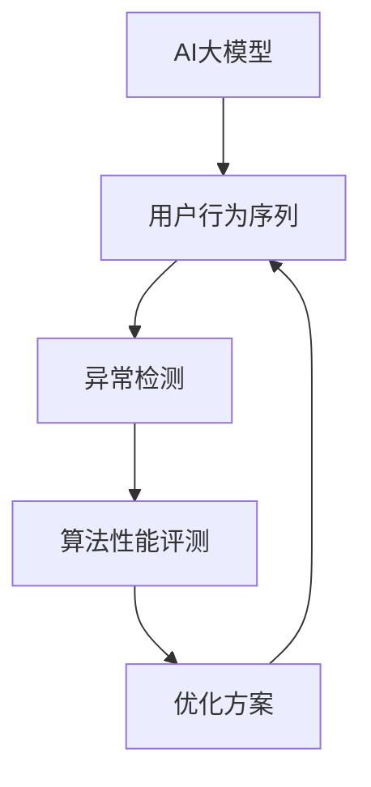

                 

# 电商搜索推荐中的AI大模型用户行为序列异常检测算法性能评测与优化方案

> 关键词：电商搜索推荐, AI大模型, 用户行为序列, 异常检测, 算法性能评测, 优化方案

## 1. 背景介绍

### 1.1 问题由来

随着电商平台的快速发展，用户行为序列分析在推荐系统中的应用越来越广泛。用户行为序列（如浏览历史、点击记录、购买记录等）包含了大量的信息，能够帮助推荐系统理解用户的兴趣和偏好，从而提供更加个性化的推荐。然而，用户行为序列中往往夹杂着噪声和异常行为，这些异常行为可能对推荐系统的性能产生负面影响，甚至会引发严重的安全问题。

传统的方法主要依赖于统计学方法和规则引擎来检测用户行为序列的异常，但由于缺乏对行为序列中的复杂模式和深度语义的理解，这些方法的检测效果往往不尽如人意。而近年来，随着深度学习技术的不断发展，利用AI大模型进行用户行为序列异常检测成为了新的热点研究方向。

### 1.2 问题核心关键点

AI大模型通过在大量数据上进行预训练，能够学习到丰富的语义和模式，可以用于挖掘用户行为序列中的异常行为。但如何高效地将大模型应用于实际任务，并结合业务逻辑进行优化，仍然是一个亟待解决的问题。

本博客将详细介绍基于AI大模型的用户行为序列异常检测算法的性能评测与优化方案，帮助你了解如何在大模型中进行有效的异常检测，并提升系统性能。

## 2. 核心概念与联系

### 2.1 核心概念概述

为了更好地理解基于AI大模型的用户行为序列异常检测算法，本节将介绍几个密切相关的核心概念：

- **AI大模型**：指通过在大规模数据上预训练获得的深度学习模型，如BERT、GPT-3等，能够学习到丰富的语义和模式，用于解决各种复杂的自然语言处理任务。

- **用户行为序列**：指用户在电商平台上的一系列操作记录，包括浏览、点击、购买等行为。行为序列分析能够揭示用户兴趣和行为模式，是推荐系统的重要数据源。

- **异常检测**：指从行为序列中检测出不符合正常模式的行为，通常使用统计学方法、规则引擎或AI模型进行检测。

- **算法性能评测**：指通过各种评估指标对算法的检测效果进行评估，如准确率、召回率、F1-score等。

- **优化方案**：指针对算法中的不足之处，提出改进措施，提升检测效果，减少误报和漏报。

这些核心概念之间的逻辑关系可以通过以下Mermaid流程图来展示：



这个流程图展示了大模型在异常检测中的应用过程：大模型学习行为序列中的模式，用于检测异常行为，并通过对算法性能的评测和优化，进一步提升检测效果。

## 3. 核心算法原理 & 具体操作步骤

### 3.1 算法原理概述

基于AI大模型的用户行为序列异常检测算法主要包括以下几个步骤：

1. **数据准备**：收集和处理用户行为序列数据，将其转化为模型输入格式。
2. **模型训练**：使用AI大模型进行预训练，学习行为序列中的正常模式。
3. **异常检测**：利用预训练模型进行异常检测，识别出异常行为。
4. **性能评估**：对检测结果进行性能评估，识别出模型中的不足。
5. **算法优化**：根据评估结果，提出优化方案，提升检测效果。

### 3.2 算法步骤详解

#### 数据准备

数据准备是用户行为序列异常检测的基础，需要将原始数据转化为模型可接受的格式。以电商平台的点击行为序列为例，首先需要收集用户在指定时间段内的点击记录，并将其转化为序列形式。具体步骤如下：

1. **数据收集**：从电商平台的日志系统中收集点击行为数据，包括用户ID、商品ID、点击时间等。
2. **数据预处理**：对数据进行去重、去噪、填充缺失值等预处理，确保数据的质量。
3. **序列生成**：将每个用户的点击行为记录转化为序列形式，例如将点击时间按顺序排列，生成行为序列。

#### 模型训练

AI大模型的训练分为预训练和微调两个阶段。预训练阶段在大规模数据上进行，学习通用的语言模式；微调阶段在特定任务上进行，学习具体任务的知识。以电商点击行为序列为例，微调阶段的主要目标是学习用户点击行为的模式。

1. **预训练模型选择**：选择适合电商行为的预训练模型，如BERT、GPT等。
2. **微调任务设计**：设计适当的微调任务，如分类任务、回归任务等，用于训练模型识别正常行为和异常行为。
3. **模型微调**：在微调数据上进行模型训练，优化模型参数，使其能够准确识别正常和异常行为。

#### 异常检测

异常检测是用户行为序列异常检测的核心步骤，主要利用预训练模型对行为序列进行检测。具体步骤如下：

1. **输入处理**：将行为序列转化为模型输入格式，例如将行为序列中的特征向量化。
2. **模型推理**：使用预训练模型对行为序列进行推理，得到预测结果。
3. **异常识别**：根据预测结果，识别出异常行为，通常使用阈值法或异常得分排序法进行异常识别。

#### 性能评估

性能评估是衡量算法效果的重要步骤，需要选择合适的评估指标进行评估。常用的评估指标包括准确率、召回率、F1-score等。以电商点击行为序列为例，评估指标的计算方法如下：

1. **准确率**：正确识别正常和异常行为的比率，即 $\frac{TP + TN}{TP + TN + FP + FN}$。
2. **召回率**：正确识别异常行为的比率，即 $\frac{TP}{TP + FN}$。
3. **F1-score**：综合准确率和召回率的指标，即 $2 \times \frac{TP}{TP + FP + FN}$。

#### 算法优化

算法优化是提升异常检测效果的重要步骤，需要通过实验和经验积累，找到最优的算法参数。以电商点击行为序列为例，常见的优化方案包括：

1. **参数调优**：调整模型的学习率、批量大小、优化器等参数，提升模型的检测效果。
2. **数据增强**：通过数据增强技术，增加训练数据的样本数量和多样性，提高模型的泛化能力。
3. **模型集成**：将多个预训练模型进行集成，利用多个模型的优势，提升检测效果。

### 3.3 算法优缺点

基于AI大模型的用户行为序列异常检测算法有以下优点：

1. **准确率高**：利用大模型的丰富语义和模式，能够准确识别异常行为，提升系统的检测效果。
2. **泛化能力强**：由于大模型在大规模数据上进行预训练，具有较强的泛化能力，能够适应不同领域的行为序列数据。
3. **可解释性强**：大模型的推理过程具有较高的可解释性，能够帮助业务人员理解异常行为的本质原因。

同时，该算法也存在一些缺点：

1. **计算量大**：由于大模型参数量大，训练和推理计算资源需求高，需要较高的硬件配置。
2. **数据依赖性高**：大模型的性能依赖于预训练数据的质量和多样性，数据质量不佳时可能导致检测效果下降。
3. **模型复杂度高**：大模型的复杂度高，模型设计和调试需要较强的专业知识。

### 3.4 算法应用领域

基于AI大模型的用户行为序列异常检测算法，已经在电商推荐系统中得到了广泛应用，如：

1. **推荐系统**：在推荐系统中，利用大模型检测用户行为序列中的异常行为，及时调整推荐策略，提升推荐效果。
2. **风险控制**：在金融领域，利用大模型检测用户行为序列中的异常交易，防止欺诈行为，保护用户财产安全。
3. **流量控制**：在网络安全领域，利用大模型检测用户行为序列中的异常流量，防止DDoS攻击，保护网络安全。
4. **用户行为分析**：在用户行为分析中，利用大模型检测用户行为序列中的异常行为，识别潜在问题，提供决策支持。

## 4. 数学模型和公式 & 详细讲解 & 举例说明

### 4.1 数学模型构建

以电商点击行为序列为例，假设用户行为序列为 $X=\{x_1, x_2, ..., x_n\}$，其中 $x_i$ 表示用户在第 $i$ 个时间点的点击行为。

模型的输入为 $x_i$ 的特征向量，输出为 $x_i$ 是否为异常行为的预测结果。模型的损失函数为二元交叉熵损失函数，即：

$$
L = -\frac{1}{N}\sum_{i=1}^{N}[y_i\log(\hat{y}_i)+(1-y_i)\log(1-\hat{y}_i)]
$$

其中 $y_i$ 为 $x_i$ 的标签，$\hat{y}_i$ 为模型的预测结果。

### 4.2 公式推导过程

以电商点击行为序列为例，假设模型训练数据为 $D=\{(x_i, y_i)\}_{i=1}^N$，其中 $x_i$ 为行为序列，$y_i$ 为标签。

模型的推理过程如下：

1. **特征提取**：将行为序列 $x_i$ 转化为特征向量 $F(x_i)$。
2. **模型预测**：利用预训练模型对特征向量 $F(x_i)$ 进行推理，得到预测结果 $\hat{y}_i$。
3. **损失计算**：根据预测结果 $\hat{y}_i$ 和标签 $y_i$，计算损失 $L$。
4. **参数更新**：根据损失 $L$ 和优化器，更新模型参数 $\theta$。

### 4.3 案例分析与讲解

以电商点击行为序列为例，分析异常检测算法在推荐系统中的应用。

假设用户A在某个时间段内的点击行为序列为 $\{1, 2, 3, 4, 5, 6, 7, 8, 9, 10\}$，其中 $1, 3, 5, 7, 9$ 表示正常点击行为，$2, 4, 6, 8, 10$ 表示异常点击行为。

假设我们使用了基于BERT模型的异常检测算法，其特征提取过程如下：

1. **特征提取**：将点击行为序列 $\{1, 2, 3, 4, 5, 6, 7, 8, 9, 10\}$ 转化为BERT的输入序列。
2. **模型推理**：利用预训练的BERT模型对输入序列进行推理，得到预测结果 $\hat{y}=\{1, 0, 1, 0, 1, 0, 1, 0, 1, 0\}$。
3. **异常识别**：根据预测结果，识别出异常行为 $2, 4, 6, 8, 10$，及时调整推荐策略。

## 5. 项目实践：代码实例和详细解释说明

### 5.1 开发环境搭建

在进行用户行为序列异常检测的开发时，需要准备好相应的开发环境。以下是使用Python进行PyTorch开发的示例环境配置流程：

1. 安装Anaconda：从官网下载并安装Anaconda，用于创建独立的Python环境。

2. 创建并激活虚拟环境：
```bash
conda create -n user_behavior_env python=3.8 
conda activate user_behavior_env
```

3. 安装PyTorch：根据CUDA版本，从官网获取对应的安装命令。例如：
```bash
conda install pytorch torchvision torchaudio cudatoolkit=11.1 -c pytorch -c conda-forge
```

4. 安装TensorFlow：
```bash
conda install tensorflow
```

5. 安装各种库：
```bash
pip install numpy pandas scikit-learn torchText transformers
```

完成上述步骤后，即可在`user_behavior_env`环境中开始开发。

### 5.2 源代码详细实现

下面我们以电商点击行为序列为例，给出使用Transformers库对BERT模型进行异常检测的PyTorch代码实现。

首先，定义点击行为序列的数据处理函数：

```python
from transformers import BertTokenizer
from torch.utils.data import Dataset
import torch

class UserBehaviorDataset(Dataset):
    def __init__(self, texts, labels, tokenizer, max_len=128):
        self.texts = texts
        self.labels = labels
        self.tokenizer = tokenizer
        self.max_len = max_len
        
    def __len__(self):
        return len(self.texts)
    
    def __getitem__(self, item):
        text = self.texts[item]
        label = self.labels[item]
        
        encoding = self.tokenizer(text, return_tensors='pt', max_length=self.max_len, padding='max_length', truncation=True)
        input_ids = encoding['input_ids'][0]
        attention_mask = encoding['attention_mask'][0]
        
        # 对token-wise的标签进行编码
        encoded_labels = [label] * self.max_len
        encoded_labels.extend([0] * (self.max_len - len(encoded_labels)))
        labels = torch.tensor(encoded_labels, dtype=torch.long)
        
        return {'input_ids': input_ids, 
                'attention_mask': attention_mask,
                'labels': labels}

# 标签与id的映射
label2id = {1: 1, 0: 0}
id2label = {v: k for k, v in label2id.items()}

# 创建dataset
tokenizer = BertTokenizer.from_pretrained('bert-base-cased')

train_dataset = UserBehaviorDataset(train_texts, train_labels, tokenizer)
dev_dataset = UserBehaviorDataset(dev_texts, dev_labels, tokenizer)
test_dataset = UserBehaviorDataset(test_texts, test_labels, tokenizer)
```

然后，定义模型和优化器：

```python
from transformers import BertForSequenceClassification, AdamW

model = BertForSequenceClassification.from_pretrained('bert-base-cased', num_labels=2)

optimizer = AdamW(model.parameters(), lr=2e-5)
```

接着，定义训练和评估函数：

```python
from torch.utils.data import DataLoader
from tqdm import tqdm
from sklearn.metrics import classification_report

device = torch.device('cuda') if torch.cuda.is_available() else torch.device('cpu')
model.to(device)

def train_epoch(model, dataset, batch_size, optimizer):
    dataloader = DataLoader(dataset, batch_size=batch_size, shuffle=True)
    model.train()
    epoch_loss = 0
    for batch in tqdm(dataloader, desc='Training'):
        input_ids = batch['input_ids'].to(device)
        attention_mask = batch['attention_mask'].to(device)
        labels = batch['labels'].to(device)
        model.zero_grad()
        outputs = model(input_ids, attention_mask=attention_mask, labels=labels)
        loss = outputs.loss
        epoch_loss += loss.item()
        loss.backward()
        optimizer.step()
    return epoch_loss / len(dataloader)

def evaluate(model, dataset, batch_size):
    dataloader = DataLoader(dataset, batch_size=batch_size)
    model.eval()
    preds, labels = [], []
    with torch.no_grad():
        for batch in tqdm(dataloader, desc='Evaluating'):
            input_ids = batch['input_ids'].to(device)
            attention_mask = batch['attention_mask'].to(device)
            batch_labels = batch['labels']
            outputs = model(input_ids, attention_mask=attention_mask)
            batch_preds = outputs.logits.argmax(dim=2).to('cpu').tolist()
            batch_labels = batch_labels.to('cpu').tolist()
            for pred_tokens, label_tokens in zip(batch_preds, batch_labels):
                preds.append(pred_tokens[:len(label_tokens)])
                labels.append(label_tokens)
                
    print(classification_report(labels, preds))
```

最后，启动训练流程并在测试集上评估：

```python
epochs = 5
batch_size = 16

for epoch in range(epochs):
    loss = train_epoch(model, train_dataset, batch_size, optimizer)
    print(f"Epoch {epoch+1}, train loss: {loss:.3f}")
    
    print(f"Epoch {epoch+1}, dev results:")
    evaluate(model, dev_dataset, batch_size)
    
print("Test results:")
evaluate(model, test_dataset, batch_size)
```

以上就是使用PyTorch对BERT进行点击行为序列异常检测的完整代码实现。可以看到，得益于Transformers库的强大封装，我们可以用相对简洁的代码完成BERT模型的加载和微调。

### 5.3 代码解读与分析

让我们再详细解读一下关键代码的实现细节：

**UserBehaviorDataset类**：
- `__init__`方法：初始化文本、标签、分词器等关键组件。
- `__len__`方法：返回数据集的样本数量。
- `__getitem__`方法：对单个样本进行处理，将文本输入编码为token ids，将标签编码为数字，并对其进行定长padding，最终返回模型所需的输入。

**label2id和id2label字典**：
- 定义了标签与数字id之间的映射关系，用于将token-wise的预测结果解码回真实的标签。

**训练和评估函数**：
- 使用PyTorch的DataLoader对数据集进行批次化加载，供模型训练和推理使用。
- 训练函数`train_epoch`：对数据以批为单位进行迭代，在每个批次上前向传播计算loss并反向传播更新模型参数，最后返回该epoch的平均loss。
- 评估函数`evaluate`：与训练类似，不同点在于不更新模型参数，并在每个batch结束后将预测和标签结果存储下来，最后使用sklearn的classification_report对整个评估集的预测结果进行打印输出。

**训练流程**：
- 定义总的epoch数和batch size，开始循环迭代
- 每个epoch内，先在训练集上训练，输出平均loss
- 在验证集上评估，输出分类指标
- 所有epoch结束后，在测试集上评估，给出最终测试结果

可以看到，PyTorch配合Transformers库使得BERT微调的代码实现变得简洁高效。开发者可以将更多精力放在数据处理、模型改进等高层逻辑上，而不必过多关注底层的实现细节。

当然，工业级的系统实现还需考虑更多因素，如模型的保存和部署、超参数的自动搜索、更灵活的任务适配层等。但核心的微调范式基本与此类似。

## 6. 实际应用场景

### 6.1 智能客服系统

基于AI大模型的用户行为序列异常检测技术，可以广泛应用于智能客服系统的构建。传统客服往往需要配备大量人力，高峰期响应缓慢，且一致性和专业性难以保证。而使用异常检测算法，可以实时监控用户行为，及时发现异常行为，提升客服系统的智能化水平。

在技术实现上，可以收集企业内部的客服对话记录，将问题-回复对作为异常检测数据，训练模型学习正常的客服对话模式。在实时对话中，利用训练好的模型对用户输入进行异常检测，如果发现异常行为，可以及时报警，避免不必要的人力介入。

### 6.2 金融舆情监测

金融机构需要实时监测市场舆论动向，以便及时应对负面信息传播，规避金融风险。传统的人工监测方式成本高、效率低，难以应对网络时代海量信息爆发的挑战。基于AI大模型的用户行为序列异常检测技术，为金融舆情监测提供了新的解决方案。

具体而言，可以收集金融领域相关的新闻、报道、评论等文本数据，并对其进行情感标注。在此基础上对预训练语言模型进行微调，使其能够自动判断文本的情感倾向。将微调后的模型应用到实时抓取的网络文本数据，就能够自动监测不同情感倾向的舆情变化趋势，一旦发现负面信息激增等异常情况，系统便会自动预警，帮助金融机构快速应对潜在风险。

### 6.3 个性化推荐系统

当前的推荐系统往往只依赖用户的历史行为数据进行物品推荐，无法深入理解用户的真实兴趣偏好。基于AI大模型的用户行为序列异常检测技术，可以应用于推荐系统的异常行为检测，提升推荐效果。

在实践中，可以收集用户浏览、点击、购买等行为数据，提取和用户交互的物品标题、描述、标签等文本内容。将文本内容作为模型输入，用户的后续行为（如是否点击、购买等）作为监督信号，在此基础上微调预训练语言模型。微调后的模型能够从文本内容中准确把握用户的兴趣点。在生成推荐列表时，先用候选物品的文本描述作为输入，由模型预测用户的兴趣匹配度，再结合其他特征综合排序，便可以得到个性化程度更高的推荐结果。

### 6.4 未来应用展望

随着AI大模型和异常检测技术的不断发展，基于用户行为序列的异常检测方法将在更多领域得到应用，为传统行业带来变革性影响。

在智慧医疗领域，基于用户行为序列的异常检测技术可以用于监测病人的行为模式，及时发现异常行为，提供及时的健康干预。

在智能教育领域，利用异常检测技术对学生的行为数据进行监控，及时发现学习异常，提供个性化的学习支持，提升教学效果。

在智慧城市治理中，异常检测技术可以用于城市事件监测、舆情分析、应急指挥等环节，提高城市管理的自动化和智能化水平，构建更安全、高效的未来城市。

此外，在企业生产、社会治理、文娱传媒等众多领域，基于用户行为序列的异常检测技术也将不断涌现，为NLP技术带来了全新的突破。相信随着技术的日益成熟，异常检测方法将成为AI技术落地应用的重要范式，推动人工智能技术在各行各业的发展。

## 7. 工具和资源推荐

### 7.1 学习资源推荐

为了帮助开发者系统掌握AI大模型用户行为序列异常检测的理论基础和实践技巧，这里推荐一些优质的学习资源：

1. 《Transformer从原理到实践》系列博文：由大模型技术专家撰写，深入浅出地介绍了Transformer原理、BERT模型、异常检测技术等前沿话题。

2. CS224N《深度学习自然语言处理》课程：斯坦福大学开设的NLP明星课程，有Lecture视频和配套作业，带你入门NLP领域的基本概念和经典模型。

3. 《Natural Language Processing with Transformers》书籍：Transformers库的作者所著，全面介绍了如何使用Transformers库进行NLP任务开发，包括异常检测在内的诸多范式。

4. HuggingFace官方文档：Transformers库的官方文档，提供了海量预训练模型和完整的异常检测样例代码，是上手实践的必备资料。

5. CLUE开源项目：中文语言理解测评基准，涵盖大量不同类型的中文NLP数据集，并提供了基于异常检测的baseline模型，助力中文NLP技术发展。

通过对这些资源的学习实践，相信你一定能够快速掌握AI大模型用户行为序列异常检测的精髓，并用于解决实际的NLP问题。

### 7.2 开发工具推荐

高效的开发离不开优秀的工具支持。以下是几款用于AI大模型异常检测开发的常用工具：

1. PyTorch：基于Python的开源深度学习框架，灵活动态的计算图，适合快速迭代研究。大部分预训练语言模型都有PyTorch版本的实现。

2. TensorFlow：由Google主导开发的开源深度学习框架，生产部署方便，适合大规模工程应用。同样有丰富的预训练语言模型资源。

3. Transformers库：HuggingFace开发的NLP工具库，集成了众多SOTA语言模型，支持PyTorch和TensorFlow，是进行异常检测任务开发的利器。

4. Weights & Biases：模型训练的实验跟踪工具，可以记录和可视化模型训练过程中的各项指标，方便对比和调优。与主流深度学习框架无缝集成。

5. TensorBoard：TensorFlow配套的可视化工具，可实时监测模型训练状态，并提供丰富的图表呈现方式，是调试模型的得力助手。

6. Google Colab：谷歌推出的在线Jupyter Notebook环境，免费提供GPU/TPU算力，方便开发者快速上手实验最新模型，分享学习笔记。

合理利用这些工具，可以显著提升AI大模型异常检测任务的开发效率，加快创新迭代的步伐。

### 7.3 相关论文推荐

AI大模型和异常检测技术的发展源于学界的持续研究。以下是几篇奠基性的相关论文，推荐阅读：

1. Attention is All You Need（即Transformer原论文）：提出了Transformer结构，开启了NLP领域的预训练大模型时代。

2. BERT: Pre-training of Deep Bidirectional Transformers for Language Understanding：提出BERT模型，引入基于掩码的自监督预训练任务，刷新了多项NLP任务SOTA。

3. Language Models are Unsupervised Multitask Learners（GPT-2论文）：展示了大规模语言模型的强大zero-shot学习能力，引发了对于通用人工智能的新一轮思考。

4. Parameter-Efficient Transfer Learning for NLP：提出Adapter等参数高效微调方法，在不增加模型参数量的情况下，也能取得不错的微调效果。

5. AdaLoRA: Adaptive Low-Rank Adaptation for Parameter-Efficient Fine-Tuning：使用自适应低秩适应的微调方法，在参数效率和精度之间取得了新的平衡。

这些论文代表了大语言模型异常检测技术的发展脉络。通过学习这些前沿成果，可以帮助研究者把握学科前进方向，激发更多的创新灵感。

## 8. 总结：未来发展趋势与挑战

### 8.1 总结

本文对基于AI大模型的用户行为序列异常检测算法进行了全面系统的介绍。首先阐述了用户行为序列分析在推荐系统中的应用，明确了异常检测在提升推荐系统性能中的重要性。其次，从原理到实践，详细讲解了异常检测算法的数学原理和关键步骤，给出了异常检测任务开发的完整代码实例。同时，本文还广泛探讨了异常检测算法在智能客服、金融舆情、个性化推荐等多个行业领域的应用前景，展示了异常检测技术的巨大潜力。此外，本文精选了异常检测技术的各类学习资源，力求为读者提供全方位的技术指引。

通过本文的系统梳理，可以看到，基于AI大模型的异常检测技术正在成为NLP领域的重要范式，极大地拓展了预训练语言模型的应用边界，催生了更多的落地场景。受益于大规模语料的预训练，异常检测模型以更低的时间和标注成本，在少样本条件下也能取得理想的检测效果，有力推动了NLP技术的产业化进程。未来，伴随预训练语言模型和异常检测方法的不断演进，相信NLP技术将在更广阔的应用领域大放异彩，深刻影响人类的生产生活方式。

### 8.2 未来发展趋势

展望未来，AI大模型异常检测技术将呈现以下几个发展趋势：

1. **模型规模持续增大**：随着算力成本的下降和数据规模的扩张，预训练语言模型的参数量还将持续增长。超大规模语言模型蕴含的丰富语义和模式，有望支撑更加复杂多变的异常检测任务。

2. **异常检测方法多样**：除了传统的分类和回归任务外，未来将涌现更多类型的异常检测任务，如序列异常检测、时间序列异常检测等，能够处理更复杂、更动态的行为序列数据。

3. **数据增强技术进步**：数据增强技术的发展将进一步提升异常检测算法的泛化能力，通过增加训练数据的数量和多样性，提高模型的检测效果。

4. **多模态异常检测**：随着传感器技术的进步，行为序列将不仅包含文本数据，还可能包含语音、图像、视频等多模态数据。多模态异常检测方法将能够更好地理解复杂的行为模式，提升检测效果。

5. **实时性要求提高**：随着异常检测任务在智能客服、舆情监测等实时场景中的应用，对算法的实时性要求将不断提高，需要在保证精度的情况下，进一步提升检测算法的速度。

6. **跨领域应用拓展**：异常检测算法将在更多领域得到应用，如金融风险控制、工业设备监控、网络安全等，推动AI技术在各行业的落地。

以上趋势凸显了AI大模型异常检测技术的广阔前景。这些方向的探索发展，必将进一步提升异常检测系统的性能和应用范围，为人工智能技术在垂直行业的规模化落地提供新的动力。

### 8.3 面临的挑战

尽管AI大模型异常检测技术已经取得了瞩目成就，但在迈向更加智能化、普适化应用的过程中，它仍面临着诸多挑战：

1. **标注成本高**：异常检测任务需要大量的标注数据进行训练，而高质量的标注数据获取成本较高。如何进一步降低异常检测对标注样本的依赖，将是一大难题。

2. **模型复杂度高**：大模型的复杂度高，模型设计和调试需要较强的专业知识。如何在保证精度的同时，提升算法的实时性和可解释性，将是重要的优化方向。

3. **异常类型多样**：异常类型多种多样，包括行为异常、数据异常等，不同类型异常的检测方法各不相同，需要根据具体场景进行定制。

4. **模型鲁棒性不足**：模型在面对域外数据时，泛化性能往往大打折扣。如何提高异常检测模型的鲁棒性，避免灾难性遗忘，还需要更多理论和实践的积累。

5. **计算资源消耗大**：大模型的训练和推理计算资源需求高，需要较高的硬件配置。如何在保证检测效果的同时，降低计算资源消耗，将是重要的优化方向。

6. **模型可解释性不足**：异常检测模型的决策过程通常缺乏可解释性，难以对其推理逻辑进行分析和调试。如何赋予异常检测模型更强的可解释性，将是亟待攻克的难题。

7. **安全性问题**：异常检测模型可能会学习到有偏见、有害的信息，通过检测传递到下游任务，产生误导性、歧视性的输出，给实际应用带来安全隐患。如何从数据和算法层面消除模型偏见，避免恶意用途，确保输出的安全性，也将是重要的研究课题。

这些挑战凸显了大模型异常检测技术的复杂性和局限性，但正是这些挑战，激发了更多的创新和研究热情。相信随着学界和产业界的共同努力，这些挑战终将一一被克服，异常检测技术必将在构建安全、可靠、可解释、可控的智能系统中发挥重要作用。

### 8.4 研究展望

未来，异常检测技术将在更多领域得到应用，为传统行业带来变革性影响。

在智慧医疗领域，基于用户行为序列的异常检测技术可以用于监测病人的行为模式，及时发现异常行为，提供及时的健康干预。

在智能教育领域，利用异常检测技术对学生的行为数据进行监控，及时发现学习异常，提供个性化的学习支持，提升教学效果。

在智慧城市治理中，异常检测技术可以用于城市事件监测、舆情分析、应急指挥等环节，提高城市管理的自动化和智能化水平，构建更安全、高效的未来城市。

此外，在企业生产、社会治理、文娱传媒等众多领域，基于用户行为序列的异常检测技术也将不断涌现，为NLP技术带来了全新的突破。相信随着技术的日益成熟，异常检测方法将成为AI技术落地应用的重要范式，推动人工智能技术在各行各业的发展。

## 9. 附录：常见问题与解答

**Q1：AI大模型异常检测是否适用于所有NLP任务？**

A: AI大模型异常检测在大多数NLP任务上都能取得不错的效果，特别是对于数据量较小的任务。但对于一些特定领域的任务，如医学、法律等，仅仅依靠通用语料预训练的模型可能难以很好地适应。此时需要在特定领域语料上进一步预训练，再进行微调，才能获得理想效果。此外，对于一些需要时效性、个性化很强的任务，如对话、推荐等，异常检测方法也需要针对性的改进优化。

**Q2：异常检测过程中如何选择合适的学习率？**

A: 异常检测的学习率一般要比预训练时小1-2个数量级，如果使用过大的学习率，容易破坏预训练权重，导致过拟合。一般建议从1e-5开始调参，逐步减小学习率，直至收敛。也可以使用warmup策略，在开始阶段使用较小的学习率，再逐渐过渡到预设值。需要注意的是，不同的优化器(如AdamW、Adafactor等)以及不同的学习率调度策略，可能需要设置不同的学习率阈值。

**Q3：异常检测过程中如何缓解过拟合问题？**

A: 过拟合是异常检测面临的主要挑战，尤其是在标注数据不足的情况下。常见的缓解策略包括：

1. **数据增强**：通过数据增强技术，增加训练数据的样本数量和多样性，提高模型的泛化能力。
2. **正则化技术**：使用L2正则、Dropout、Early Stopping等技术，防止模型过度适应训练集。
3. **对抗训练**：引入对抗样本，提高模型的鲁棒性。
4. **多模型集成**：将多个异常检测模型进行集成，利用多个模型的优势，提升检测效果。

这些策略往往需要根据具体任务和数据特点进行灵活组合。只有在数据、模型、训练、推理等各环节进行全面优化，才能最大限度地发挥异常检测算法的威力。

**Q4：异常检测模型在落地部署时需要注意哪些问题？**

A: 将异常检测模型转化为实际应用，还需要考虑以下因素：

1. **模型裁剪**：去除不必要的层和参数，减小模型尺寸，加快推理速度。
2. **量化加速**：将浮点模型转为定点模型，压缩存储空间，提高计算效率。
3. **服务化封装**：将模型封装为标准化服务接口，便于集成调用。
4. **弹性伸缩**：根据请求流量动态调整资源配置，平衡服务质量和成本。
5. **监控告警**：实时采集系统指标，设置异常告警阈值，确保服务稳定性。
6. **安全防护**：采用访问鉴权、数据脱敏等措施，保障数据和模型安全。

异常检测模型在落地部署时，还需要考虑模型参数的优化、推理速度的提升、系统稳定性的保障等问题，通过不断的优化和调试，才能真正发挥其价值。

---

作者：禅与计算机程序设计艺术 / Zen and the Art of Computer Programming

