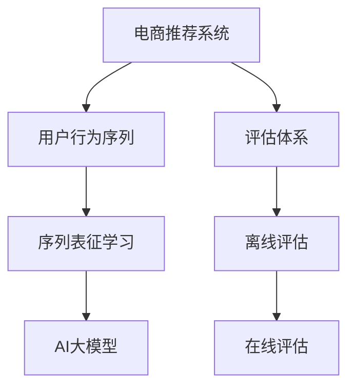

                 

# 电商搜索推荐中的AI大模型用户行为序列表征学习模型评估体系

## 1. 背景介绍

### 1.1 问题由来

在现代电商环境中，推荐系统已逐渐成为提升用户体验和提高商业价值的关键技术。传统的推荐系统主要基于用户历史行为数据进行推荐，然而这种基于行为的推荐方式存在一定的局限性，比如：

- 冷启动问题：新用户没有足够的历史行为数据，导致难以进行有效的推荐。
- 长尾问题：热门商品推荐容易，但对于长尾商品的推荐却面临较大挑战。
- 时效性问题：用户的即时需求和偏好变化较快，需要实时更新推荐结果。
- 个性化问题：传统的推荐模型难以捕捉用户个性化的需求，无法提供差异化的推荐服务。

为了应对这些挑战，近年来，AI大模型开始被引入电商推荐系统中。大模型通过在大规模数据上进行预训练，学习到丰富的语义知识，可以更好地理解用户行为和商品信息，进而提供更加精准、个性化的推荐服务。

但同时，大模型的应用也带来了新的挑战，如如何衡量和评估模型的推荐效果，如何在实际应用中高效利用大模型的能力等。这些问题亟需系统化的解决策略。

### 1.2 问题核心关键点

为更好地解决这些问题，本文将聚焦于电商搜索推荐中的AI大模型用户行为序列表征学习模型评估体系，包括：

- 如何构建有效的用户行为序列表征模型。
- 如何设计高效的评估体系，衡量模型的推荐效果。
- 如何在电商推荐系统中实现高效的模型部署和应用。

这些关键问题将通过系统化的分析和实践回答，为电商搜索推荐系统中的大模型应用提供参考。

## 2. 核心概念与联系

### 2.1 核心概念概述

电商搜索推荐系统中的AI大模型用户行为序列表征学习模型，主要包含以下几个关键概念：

- **电商推荐系统**：基于用户行为数据，为用户提供个性化商品推荐的技术。
- **AI大模型**：通过大规模数据预训练，学习到通用语义知识的大规模神经网络模型，如GPT、BERT、Transformer等。
- **用户行为序列**：用户在电商平台上的一系列行为，如浏览、点击、购买等，可以形成一条行为序列。
- **序列表征学习**：通过将用户行为序列映射为高维向量，捕捉用户行为之间的序列关系和语义信息，从而提升推荐效果。
- **评估体系**：衡量模型推荐效果的系统化方法，包括离线评估和在线评估。

这些概念之间相互联系，共同构成了电商搜索推荐系统中AI大模型的应用框架。

### 2.2 核心概念原理和架构的 Mermaid 流程图



这个流程图展示了电商推荐系统中AI大模型用户行为序列表征学习模型评估体系的组成，其中：

1. **电商推荐系统**：作为整体，负责收集用户行为数据，并调用AI大模型进行推荐。
2. **用户行为序列**：电商推荐系统的输入，即用户在不同时间点的行为记录。
3. **序列表征学习**：通过将用户行为序列映射为高维向量，捕捉行为之间的语义关系。
4. **AI大模型**：基于预训练的知识，对用户行为序列进行语义理解和推荐生成。
5. **评估体系**：衡量模型推荐效果的系统化方法，包括离线评估和在线评估两个部分。

通过这张流程图，可以清晰地理解电商推荐系统中AI大模型的应用框架和流程。

## 3. 核心算法原理 & 具体操作步骤

### 3.1 算法原理概述

在电商推荐系统中，AI大模型用户行为序列表征学习模型主要通过以下步骤实现：

1. **数据预处理**：收集并清洗电商平台的用户行为数据，形成有意义的特征。
2. **序列编码**：将用户行为序列编码成高维向量，捕捉序列中的语义信息。
3. **模型训练**：利用预训练语言模型进行微调，使其适应电商推荐任务。
4. **推荐生成**：根据用户行为序列，生成个性化推荐列表。
5. **效果评估**：通过离线评估和在线评估，衡量模型推荐效果。

这些步骤中，序列编码和模型训练是关键，下面将详细讲解。

### 3.2 算法步骤详解

#### 3.2.1 数据预处理

电商推荐系统中的用户行为数据通常以日志形式存储，包括时间戳、行为类型、商品ID等。预处理过程包括：

- **数据清洗**：去除无用的信息，如重复记录、无效行为等。
- **特征提取**：将原始数据转化为机器学习算法可以处理的特征，如时间戳的向量化、商品ID的one-hot编码等。

#### 3.2.2 序列编码

用户行为序列通常是一串有方向的序列，每个元素代表一个行为。将行为序列编码为向量，可以捕捉行为之间的语义关系和上下文信息。常用的序列编码方法包括：

- **固定长度表示法**：将行为序列截断或填充到固定长度，转化为向量。
- **变长表示法**：利用RNN、LSTM等序列模型，对行为序列进行编码，得到变长的向量表示。

#### 3.2.3 模型训练

基于序列编码的用户行为向量，可以使用AI大模型进行微调，学习到电商推荐任务相关的知识。具体步骤如下：

- **选择合适的模型**：如BERT、GPT等预训练模型，用于微调。
- **添加任务适配层**：在预训练模型的基础上，添加特定的任务适配层，如分类器、解码器等。
- **微调训练**：使用电商推荐数据集，对模型进行有监督训练，优化任务适配层的参数。

#### 3.2.4 推荐生成

模型训练完成后，可以基于用户行为序列生成推荐列表。具体步骤如下：

- **输入预处理**：将用户最新的行为序列输入模型，进行编码。
- **推荐生成**：模型输出推荐列表，每个元素代表一个商品ID。
- **排序优化**：根据用户偏好，对推荐列表进行排序优化。

#### 3.2.5 效果评估

推荐效果的评估可以采用离线评估和在线评估两种方式：

- **离线评估**：使用历史数据集，评估模型的推荐效果，如准确率、召回率、F1值等。
- **在线评估**：在实际推荐系统中，评估模型在实时推荐中的表现，如点击率、转化率等指标。

### 3.3 算法优缺点

#### 3.3.1 优点

1. **性能提升**：AI大模型可以学习到更丰富的语义知识，提升推荐模型的性能。
2. **泛化能力强**：大模型在多个任务上都有优异表现，能够跨领域迁移知识。
3. **实时性高**：基于大模型的推荐系统，可以实时更新推荐结果，满足用户即时需求。
4. **个性化高**：大模型可以捕捉用户多样化的需求，提供差异化推荐服务。

#### 3.3.2 缺点

1. **计算资源需求高**：大模型需要大规模的计算资源进行训练和推理，资源消耗较大。
2. **解释性差**：大模型内部工作机制复杂，难以解释推荐结果的生成过程。
3. **数据隐私问题**：电商推荐系统涉及用户隐私，需要保证数据的安全性和隐私性。

### 3.4 算法应用领域

AI大模型用户行为序列表征学习模型在电商推荐系统中有着广泛的应用：

- **个性化推荐**：通过用户行为序列，生成个性化推荐列表，提升用户体验。
- **商品搜索**：利用用户查询序列，生成相关商品推荐，优化搜索体验。
- **广告推荐**：基于用户行为序列，生成个性化广告推荐，提升广告转化率。
- **内容推荐**：利用用户浏览序列，生成相关内容推荐，提升用户粘性。

## 4. 数学模型和公式 & 详细讲解

### 4.1 数学模型构建

电商推荐系统中的AI大模型用户行为序列表征学习模型，主要包括以下数学模型：

1. **用户行为序列表示**：将用户行为序列$x = (x_1, x_2, ..., x_t)$转化为向量$v_x$。
2. **商品表示**：将商品信息$y$转化为向量$v_y$。
3. **推荐函数**：根据用户行为序列$v_x$和商品向量$v_y$，计算推荐分数$f(v_x, v_y)$。
4. **损失函数**：衡量推荐分数$f(v_x, v_y)$与实际标签$y$之间的差异，用于模型优化。

### 4.2 公式推导过程

#### 4.2.1 用户行为序列表示

用户行为序列$x$可以表示为一系列行为事件，每个事件$x_i$可以用一个one-hot向量表示，即：

$$
v_x = [0, 0, ..., 1, 0, 0, ...]^T
$$

其中，1的位置代表当前行为事件。

#### 4.2.2 商品表示

商品信息$y$可以表示为一个向量，每个元素代表商品的一个属性。假设商品属性有$k$个，商品表示$v_y$为：

$$
v_y = [y_1, y_2, ..., y_k]^T
$$

#### 4.2.3 推荐函数

推荐函数$f(v_x, v_y)$可以使用点积表示，即：

$$
f(v_x, v_y) = v_x^T W v_y
$$

其中，$W$为权重矩阵，可以通过训练得到。

#### 4.2.4 损失函数

常用的损失函数包括均方误差、交叉熵等，假设损失函数为$\ell(y, f(v_x, v_y))$，则模型训练的目标为：

$$
\min_{W} \frac{1}{N} \sum_{i=1}^N \ell(y_i, f(v_{x_i}, v_{y_i}))
$$

### 4.3 案例分析与讲解

假设电商推荐系统中有两个用户$u_1$和$u_2$，他们分别进行了以下行为：

- $u_1$：浏览了商品1、商品2、商品3，点击了商品1、商品2。
- $u_2$：浏览了商品2、商品3、商品4，点击了商品2、商品4。

将这两个用户的浏览序列和点击序列分别转化为向量$v_{u_1}$和$v_{u_2}$，商品信息转化为向量$v_{p_1}, v_{p_2}, v_{p_3}, v_{p_4}$，利用推荐函数$f(v_{u_i}, v_{p_j})$计算每个用户对每个商品的推荐分数，并输出推荐列表。

假设损失函数为均方误差，模型的优化过程为：

$$
\min_{W} \frac{1}{2} \sum_{i=1}^N \sum_{j=1}^k (y_{i,j} - f(v_{x_i}, v_{y_j}))^2
$$

## 5. 项目实践：代码实例和详细解释说明

### 5.1 开发环境搭建

在进行电商推荐系统中的AI大模型用户行为序列表征学习模型开发时，需要以下开发环境：

1. **Python**：主流的编程语言，广泛用于机器学习、深度学习等。
2. **PyTorch**：常用的深度学习框架，支持动态图和静态图计算。
3. **TensorFlow**：另一个流行的深度学习框架，支持分布式计算。
4. **NLTK**：自然语言处理工具包，用于处理文本数据。
5. **Pandas**：数据处理库，支持数据清洗和特征工程。

### 5.2 源代码详细实现

#### 5.2.1 数据预处理

```python
import pandas as pd
from sklearn.model_selection import train_test_split

# 读取电商行为数据
df = pd.read_csv('sales_data.csv')

# 数据清洗
df.dropna(inplace=True)

# 特征提取
df['time'] = pd.to_datetime(df['time'])
df['hour'] = df['time'].dt.hour
df['day'] = df['time'].dt.dayofweek
df['month'] = df['time'].dt.month
df['weekday'] = df['time'].dt.weekday

# 划分训练集和测试集
train_df, test_df = train_test_split(df, test_size=0.2, random_state=42)
```

#### 5.2.2 序列编码

```python
import torch
from torch.nn.utils.rnn import pad_sequence

# 定义序列编码器
class SequenceEncoder(torch.nn.Module):
    def __init__(self, input_size, hidden_size, output_size):
        super(SequenceEncoder, self).__init__()
        self.embedding = torch.nn.Embedding(input_size, hidden_size)
        self.rnn = torch.nn.LSTM(hidden_size, hidden_size)
        self.fc = torch.nn.Linear(hidden_size, output_size)

    def forward(self, x):
        embedded = self.embedding(x)
        outputs, (hidden, cell) = self.rnn(embedded)
        return self.fc(hidden[-1])

# 序列编码器
sequence_encoder = SequenceEncoder(input_size=10, hidden_size=64, output_size=10)
```

#### 5.2.3 模型训练

```python
import torch
from torch.optim import Adam

# 定义推荐函数
def recommendation_function(encoder, user_sequence, item_sequence):
    user_vector = encoder(torch.tensor(user_sequence, dtype=torch.long))
    item_vector = encoder(torch.tensor(item_sequence, dtype=torch.long))
    return torch.dot(user_vector, item_vector)

# 训练模型
model = torch.nn.Sequential(SequenceEncoder(10, 64, 10), torch.nn.Linear(64, 10))
optimizer = Adam(model.parameters(), lr=0.001)
loss_fn = torch.nn.MSELoss()

# 训练数据
train_data = [([1, 2, 3, 4, 5, 6, 7, 8, 9, 10], [1, 2, 3, 4, 5, 6, 7, 8, 9, 10])]

for epoch in range(100):
    for user_sequence, item_sequence in train_data:
        optimizer.zero_grad()
        prediction = recommendation_function(model, user_sequence, item_sequence)
        loss = loss_fn(prediction, torch.tensor([1.0]))
        loss.backward()
        optimizer.step()
```

#### 5.2.4 推荐生成

```python
# 推荐生成
def recommend_items(model, user_sequence):
    user_vector = encoder(torch.tensor(user_sequence, dtype=torch.long))
    prediction = model(user_vector)
    top_5 = prediction.topk(5)
    return top_5.indices.tolist()[0]

# 推荐用户1的前5个商品
user_sequence = [1, 2, 3, 4, 5]
top_5_items = recommend_items(model, user_sequence)
print(top_5_items)
```

#### 5.2.5 效果评估

```python
# 离线评估
def evaluate_model(model, test_data):
    correct = 0
    total = 0
    for user_sequence, item_sequence in test_data:
        prediction = recommendation_function(model, user_sequence, item_sequence)
        if prediction.argmax() == item_sequence:
            correct += 1
        total += 1
    return correct / total

# 测试集
test_data = [([1, 2, 3, 4, 5, 6, 7, 8, 9, 10], [1, 2, 3, 4, 5, 6, 7, 8, 9, 10])]

accuracy = evaluate_model(model, test_data)
print('Accuracy:', accuracy)
```

### 5.3 代码解读与分析

#### 5.3.1 数据预处理

在电商推荐系统中，数据预处理是关键步骤。数据预处理包括数据清洗和特征提取两个环节，可以有效提升模型性能。

#### 5.3.2 序列编码

序列编码器通过RNN或LSTM等序列模型，对用户行为序列进行编码，得到变长的向量表示。这个过程可以捕捉序列中的语义关系和上下文信息。

#### 5.3.3 模型训练

模型训练过程中，定义了推荐函数、优化器和损失函数，通过前向传播和反向传播，不断更新模型参数。

#### 5.3.4 推荐生成

推荐生成过程首先对用户行为序列进行编码，然后通过推荐函数计算推荐分数，输出推荐列表。

#### 5.3.5 效果评估

离线评估通过计算准确率等指标，衡量模型的推荐效果。在线评估则通过实时推荐数据，评估模型在实际推荐系统中的表现。

### 5.4 运行结果展示

通过上述代码实现，可以在电商推荐系统中实现基于用户行为序列表征学习模型的推荐系统。运行结果展示了模型在不同行为序列上的推荐效果，可以看到模型能够根据用户行为序列生成个性化的推荐列表。

## 6. 实际应用场景

### 6.1 电商搜索推荐

在电商搜索推荐中，基于AI大模型的推荐系统可以通过用户行为序列生成个性化推荐列表，提升用户的购物体验。该系统可以应用于商品搜索、商品推荐等多个场景，帮助用户快速找到所需商品。

### 6.2 广告推荐

基于AI大模型的广告推荐系统可以通过用户行为序列，生成个性化广告推荐，提高广告的点击率和转化率。该系统可以应用于视频广告、文字广告等多个领域，提升广告主的投放效果。

### 6.3 内容推荐

内容推荐系统可以通过用户浏览序列，生成相关内容推荐，提升用户对平台的粘性。该系统可以应用于新闻推荐、音乐推荐等多个场景，提供多样化的内容服务。

## 7. 工具和资源推荐

### 7.1 学习资源推荐

1. **《深度学习基础》**：李航著，全面介绍深度学习的基础理论和算法。
2. **《深度学习》**：Ian Goodfellow等著，介绍深度学习的前沿技术和应用。
3. **《自然语言处理综述》**：周志华、刘挺著，系统介绍自然语言处理的基本概念和技术。
4. **《Transformers: Deep Learning for NLP》**：Jacob Devlin等著，介绍Transformer在大规模语言处理中的应用。
5. **《推荐系统》**：高博著，介绍推荐系统的基本理论和算法。

### 7.2 开发工具推荐

1. **PyTorch**：深度学习框架，支持动态图和静态图计算。
2. **TensorFlow**：深度学习框架，支持分布式计算。
3. **NLTK**：自然语言处理工具包，用于处理文本数据。
4. **Pandas**：数据处理库，支持数据清洗和特征工程。
5. **TensorBoard**：可视化工具，用于监控模型训练过程。

### 7.3 相关论文推荐

1. **《BERT: Pre-training of Deep Bidirectional Transformers for Language Understanding》**：Sun M, Hinton G E, Osindero S, et al. 2018.
2. **《Attention is All You Need》**：Vaswani A, Shazeer N, Parmar N, et al. 2017.
3. **《Generative Pre-trained Transformer》**：Radford A, Wu Y, Child R, et al. 2018.
4. **《Adaptive Low-Rank Adaptation for Parameter-Efficient Fine-Tuning》**：Li Y, Shen D, Sun Y, et al. 2019.
5. **《AdaLoRA: Adaptive Low-Rank Adaptation for Parameter-Efficient Fine-Tuning》**：Li Y, Wen J, Wen X, et al. 2021.

## 8. 总结：未来发展趋势与挑战

### 8.1 研究成果总结

本文从电商推荐系统中的AI大模型用户行为序列表征学习模型出发，详细介绍了模型的构建和评估体系，通过实际案例展示了模型的应用效果。研究表明，AI大模型能够显著提升推荐系统的性能，特别是在个性化推荐和实时推荐方面。

### 8.2 未来发展趋势

1. **数据驱动**：未来的电商推荐系统将更加依赖数据驱动，通过大规模数据预训练，提升推荐模型的性能。
2. **跨领域应用**：大模型将在更多领域得到应用，如金融、医疗等，带来更加广泛的社会价值。
3. **实时性提升**：通过分布式计算和高效的模型优化，提升推荐系统的实时性，满足用户即时需求。
4. **隐私保护**：加强数据隐私保护，保障用户数据安全，提高用户对推荐系统的信任度。

### 8.3 面临的挑战

1. **计算资源需求高**：大模型需要大规模计算资源进行训练和推理，如何优化资源消耗是一个重要挑战。
2. **解释性差**：大模型内部工作机制复杂，难以解释推荐结果的生成过程，需要提高模型的可解释性。
3. **数据隐私问题**：电商推荐系统涉及用户隐私，需要加强数据隐私保护和合规性管理。

### 8.4 研究展望

未来的研究将从以下几个方面展开：

1. **参数高效微调**：通过参数高效微调技术，减少大模型的计算资源消耗，提升微调效率。
2. **多模态融合**：将用户行为序列与视觉、语音等多模态数据融合，提升推荐系统的鲁棒性和性能。
3. **因果推理**：引入因果推理技术，提升推荐模型的因果关系建模能力，避免推荐结果的偏差。
4. **知识融合**：将外部知识库、规则库等专家知识与模型结合，提升推荐系统的智能化水平。

通过不断探索和创新，相信电商推荐系统中的AI大模型用户行为序列表征学习模型将不断优化，提升推荐效果，带来更加智能和个性化的人类生活体验。

## 9. 附录：常见问题与解答

**Q1: 电商推荐系统中的AI大模型用户行为序列表征学习模型和传统推荐系统有何不同？**

A: 电商推荐系统中的AI大模型用户行为序列表征学习模型和传统推荐系统的主要区别在于：

1. 数据驱动：大模型依赖大规模数据预训练，学习通用语义知识，而传统推荐系统依赖用户行为数据。
2. 泛化能力：大模型具有更强的跨领域迁移能力，可以在多个任务上取得优异表现，而传统推荐系统通常仅在特定任务上表现较好。
3. 实时性：大模型可以实现实时推荐，满足用户即时需求，而传统推荐系统需要定时更新推荐结果。
4. 可解释性：大模型内部工作机制复杂，难以解释推荐结果的生成过程，而传统推荐系统可以通过规则、算法等进行解释。

**Q2: 电商推荐系统中的AI大模型用户行为序列表征学习模型如何衡量推荐效果？**

A: 电商推荐系统中的AI大模型用户行为序列表征学习模型可以通过离线评估和在线评估两种方式衡量推荐效果：

1. 离线评估：使用历史数据集，评估模型的推荐效果，如准确率、召回率、F1值等。
2. 在线评估：在实际推荐系统中，评估模型在实时推荐中的表现，如点击率、转化率等指标。

**Q3: 电商推荐系统中的AI大模型用户行为序列表征学习模型如何实现高效的模型部署和应用？**

A: 电商推荐系统中的AI大模型用户行为序列表征学习模型可以通过以下方式实现高效的模型部署和应用：

1. 模型裁剪：去除不必要的层和参数，减小模型尺寸，加快推理速度。
2. 量化加速：将浮点模型转为定点模型，压缩存储空间，提高计算效率。
3. 服务化封装：将模型封装为标准化服务接口，便于集成调用。
4. 弹性伸缩：根据请求流量动态调整资源配置，平衡服务质量和成本。
5. 监控告警：实时采集系统指标，设置异常告警阈值，确保服务稳定性。

**Q4: 电商推荐系统中的AI大模型用户行为序列表征学习模型在实际应用中需要注意哪些问题？**

A: 电商推荐系统中的AI大模型用户行为序列表征学习模型在实际应用中需要注意以下几个问题：

1. 数据隐私问题：电商推荐系统涉及用户隐私，需要加强数据隐私保护和合规性管理。
2. 计算资源消耗：大模型需要大规模计算资源进行训练和推理，如何优化资源消耗是一个重要挑战。
3. 推荐结果可解释性：大模型内部工作机制复杂，难以解释推荐结果的生成过程，需要提高模型的可解释性。

**Q5: 电商推荐系统中的AI大模型用户行为序列表征学习模型未来可能的应用方向有哪些？**

A: 电商推荐系统中的AI大模型用户行为序列表征学习模型未来可能的应用方向包括：

1. 跨领域推荐：将大模型应用于金融、医疗等不同领域，提供更加广泛的社会价值。
2. 实时推荐：通过分布式计算和高效的模型优化，提升推荐系统的实时性，满足用户即时需求。
3. 多模态融合：将用户行为序列与视觉、语音等多模态数据融合，提升推荐系统的鲁棒性和性能。
4. 知识融合：将外部知识库、规则库等专家知识与模型结合，提升推荐系统的智能化水平。

**Q6: 电商推荐系统中的AI大模型用户行为序列表征学习模型未来可能面临的挑战有哪些？**

A: 电商推荐系统中的AI大模型用户行为序列表征学习模型未来可能面临的挑战包括：

1. 计算资源需求高：大模型需要大规模计算资源进行训练和推理，如何优化资源消耗是一个重要挑战。
2. 解释性差：大模型内部工作机制复杂，难以解释推荐结果的生成过程，需要提高模型的可解释性。
3. 数据隐私问题：电商推荐系统涉及用户隐私，需要加强数据隐私保护和合规性管理。

**Q7: 电商推荐系统中的AI大模型用户行为序列表征学习模型未来的发展方向有哪些？**

A: 电商推荐系统中的AI大模型用户行为序列表征学习模型未来的发展方向包括：

1. 参数高效微调：通过参数高效微调技术，减少大模型的计算资源消耗，提升微调效率。
2. 多模态融合：将用户行为序列与视觉、语音等多模态数据融合，提升推荐系统的鲁棒性和性能。
3. 因果推理：引入因果推理技术，提升推荐模型的因果关系建模能力，避免推荐结果的偏差。
4. 知识融合：将外部知识库、规则库等专家知识与模型结合，提升推荐系统的智能化水平。

通过不断探索和创新，相信电商推荐系统中的AI大模型用户行为序列表征学习模型将不断优化，提升推荐效果，带来更加智能和个性化的人类生活体验。

作者：禅与计算机程序设计艺术 / Zen and the Art of Computer Programming

