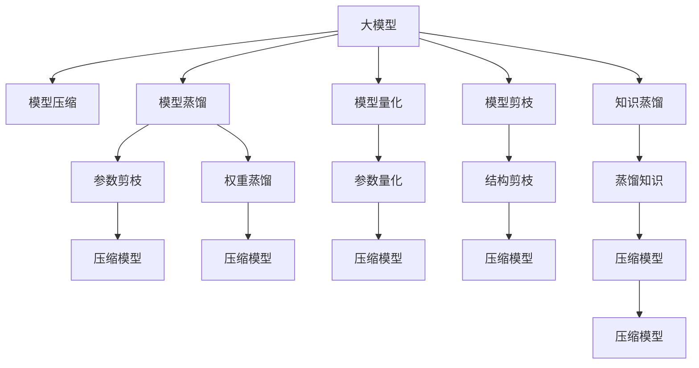

                 

# 电商搜索推荐场景下的AI大模型模型压缩技术

在电商搜索推荐场景下，AI大模型的应用十分广泛，从用户行为分析到商品推荐，从个性化广告投放到大数据风控，都离不开大模型的支持。然而，大模型的高计算需求和存储开销，使得在实际应用中面临着诸多挑战。为了解决这些问题，本文将重点介绍大模型压缩技术在电商搜索推荐场景中的应用，包括模型压缩的算法原理、具体操作步骤、应用领域、数学模型、项目实践、未来展望、工具资源推荐以及常见问题解答等内容。

## 1. 背景介绍

### 1.1 问题由来

随着电商行业的发展，越来越多的电商平台开始利用AI技术提升用户体验和运营效率。AI大模型，特别是基于深度学习的大型神经网络模型，成为了电商搜索推荐系统的核心工具。然而，大模型的高计算需求和存储开销，使得在实际应用中面临着诸多挑战。为了解决这些问题，大模型压缩技术应运而生，它通过减少模型参数、降低计算需求、缩小模型大小等方式，使得大模型能够在更少的资源和更低的时间成本下发挥更大的作用。

### 1.2 问题核心关键点

目前，大模型压缩技术在电商搜索推荐场景中的应用，主要聚焦于以下几个核心关键点：

- 模型压缩方法：如剪枝、量化、蒸馏等。
- 压缩算法的选择：不同的算法适用于不同的应用场景和模型结构。
- 压缩效果评估：如何量化压缩后的模型性能提升和计算节省。
- 应用领域：推荐系统、搜索系统、个性化广告等。
- 工程实现：如何在大规模电商系统中高效部署压缩后的模型。

## 2. 核心概念与联系

### 2.1 核心概念概述

为了更好地理解大模型压缩技术在电商搜索推荐场景中的应用，本节将介绍几个密切相关的核心概念：

- 大模型(Deep Learning Models)：以深度神经网络为基础的大型模型，具有高精度和高泛化能力，常用于解决复杂问题。
- 模型压缩(Model Compression)：通过减少模型参数、降低计算需求、缩小模型大小等方式，优化模型性能和资源利用率。
- 模型蒸馏(Model Distillation)：通过将大模型的知识传授给小型模型，使其获得更好的泛化能力。
- 模型量化(Quantization)：将大模型的浮点数参数转换为低精度的整数参数，以减少计算需求和存储开销。
- 模型剪枝(Pruning)：去除模型中不重要的参数或层，以减少模型复杂度和计算量。
- 知识蒸馏(Knowledge Distillation)：将大模型的知识传递给小型模型，以提升小型模型的性能。

这些核心概念之间的逻辑关系可以通过以下Mermaid流程图来展示：



这个流程图展示了大模型的核心概念及其之间的关系：

1. 大模型通过训练获得基础能力。
2. 模型压缩方法用于优化模型性能和资源利用率，包括模型蒸馏、量化、剪枝等。
3. 知识蒸馏将大模型的知识传递给小型模型，提升小型模型性能。
4. 压缩后的模型在实际应用中，仍需针对具体场景进行优化。

## 3. 核心算法原理 & 具体操作步骤

### 3.1 算法原理概述

在电商搜索推荐场景下，大模型压缩技术的应用主要基于以下几个算法原理：

- 模型蒸馏：通过将大模型的知识传递给小型模型，使得小型模型获得更好的泛化能力。
- 模型量化：将大模型的浮点数参数转换为低精度的整数参数，以减少计算需求和存储开销。
- 模型剪枝：通过去除不重要的参数或层，减少模型复杂度和计算量。
- 知识蒸馏：将大模型的知识传递给小型模型，以提升小型模型的性能。

### 3.2 算法步骤详解

在电商搜索推荐场景下，大模型压缩技术的一般步骤包括：

**Step 1: 准备原始模型和数据集**

- 选择合适的预训练模型，如BERT、GPT等。
- 准备电商数据集，包括用户行为数据、商品数据、搜索历史等。

**Step 2: 选择压缩算法**

- 根据应用场景和模型结构选择合适的压缩算法，如模型蒸馏、量化、剪枝等。
- 对于模型蒸馏，选择合适的大模型和小型模型，定义好蒸馏目标函数。
- 对于模型量化，选择合适的量化方法和量化精度。
- 对于模型剪枝，选择合适的剪枝方法和剪枝策略。

**Step 3: 执行模型压缩**

- 对于模型蒸馏，通过监督学习或自监督学习的方式，将大模型的知识传递给小型模型。
- 对于模型量化，将大模型的浮点数参数转换为低精度的整数参数，如8位、16位等。
- 对于模型剪枝，使用剪枝算法去除模型中不重要的参数或层，以减小模型复杂度。
- 对于知识蒸馏，定义好知识蒸馏目标函数，将大模型的输出作为监督信号，训练小型模型。

**Step 4: 评估和优化**

- 使用电商数据集在压缩后的模型上进行测试，评估模型性能。
- 针对评估结果进行模型优化，如调整压缩算法参数、选择更好的压缩策略等。
- 重复上述步骤，直至达到满意的压缩效果。

**Step 5: 部署和优化**

- 将压缩后的模型部署到电商系统中，进行实时推理预测。
- 针对模型性能和资源利用率进行优化，如模型微调、资源调度等。

### 3.3 算法优缺点

大模型压缩技术在电商搜索推荐场景中的应用，具有以下优点：

- 高精度和泛化能力：压缩后的模型在保持高精度和泛化能力的同时，计算需求和存储开销大幅降低。
- 实时推理：压缩后的模型可以在较低的资源需求下进行实时推理，提升用户体验。
- 成本降低：通过模型压缩，电商平台可以减少硬件采购和计算资源的投入。

同时，大模型压缩技术也存在以下缺点：

- 参数丢失：在模型量化和剪枝过程中，部分模型参数和信息可能被损失，影响模型性能。
- 模型复杂度增加：压缩后的模型可能增加模型复杂度，使得模型难以优化和调试。
- 开发成本高：模型压缩技术的开发和优化需要较高的人力和物力投入。

尽管存在这些局限性，但就目前而言，大模型压缩技术仍是大模型应用的重要手段。未来相关研究的重点在于如何进一步降低压缩对模型性能的影响，提高模型压缩效率，同时兼顾可解释性和伦理安全性等因素。

### 3.4 算法应用领域

大模型压缩技术在电商搜索推荐场景中的应用，主要包括以下几个领域：

- 推荐系统：通过压缩推荐模型的计算需求和存储开销，提升推荐系统的实时性和响应速度。
- 搜索系统：通过压缩搜索模型的计算需求和存储开销，提升搜索系统的速度和准确性。
- 个性化广告投放：通过压缩广告投放模型的计算需求和存储开销，提升广告投放的效率和效果。
- 风控系统：通过压缩风控模型的计算需求和存储开销，提升风控系统的实时性和准确性。

## 4. 数学模型和公式 & 详细讲解 & 举例说明

### 4.1 数学模型构建

在电商搜索推荐场景下，大模型压缩技术的数学模型可以表示为：

- 原始模型：$M_{\theta}(x)$，其中 $\theta$ 为模型参数，$x$ 为输入。
- 压缩后的模型：$M_{\hat{\theta}}(x)$，其中 $\hat{\theta}$ 为压缩后的模型参数。

压缩后的模型通过减少模型参数和降低计算需求，使得模型的推理速度和计算效率大幅提升。

### 4.2 公式推导过程

以下以模型量化为例，推导压缩后模型的公式。

设原始模型 $M_{\theta}(x)$ 的参数为 $\theta$，量化后的模型参数为 $\hat{\theta}$，量化方法为线性量化，量化精度为 $b$ 位。则量化后的模型参数 $\hat{\theta}$ 可以通过以下公式计算：

$$
\hat{\theta} = \theta \times 2^{b-1} \text{ + round}(\theta \times 2^{b-1})
$$

其中，$\text{round}$ 表示四舍五入取整。

在电商搜索推荐场景下，原始模型 $M_{\theta}(x)$ 和压缩后的模型 $M_{\hat{\theta}}(x)$ 的关系可以表示为：

$$
M_{\hat{\theta}}(x) = M_{\theta}(x) \times 2^{b-1} \text{ + round}(M_{\theta}(x) \times 2^{b-1})
$$

通过上述公式，原始模型的浮点数参数被转换为低精度的整数参数，从而减少了计算需求和存储开销。

### 4.3 案例分析与讲解

以电商推荐系统为例，探讨模型压缩技术的应用。

在电商推荐系统中，原始模型 $M_{\theta}(x)$ 用于处理用户行为数据，预测用户对商品的偏好。原始模型通常包含数百万甚至数十亿的参数，计算需求和存储开销较大。通过模型压缩技术，可以将原始模型的参数量减少到数百万以下，使得模型的推理速度和计算效率显著提升。

在推荐系统中，可以采用以下步骤进行模型压缩：

- 选择原始模型 $M_{\theta}(x)$，定义好量化精度 $b$。
- 使用量化方法，将原始模型的参数 $\theta$ 转换为低精度的整数参数 $\hat{\theta}$。
- 使用压缩后的模型 $M_{\hat{\theta}}(x)$ 进行实时推理预测，提升推荐系统的速度和准确性。
- 使用电商数据集对压缩后的模型进行评估，优化模型性能。

## 5. 项目实践：代码实例和详细解释说明

### 5.1 开发环境搭建

在进行模型压缩实践前，我们需要准备好开发环境。以下是使用Python进行PyTorch开发的环境配置流程：

1. 安装Anaconda：从官网下载并安装Anaconda，用于创建独立的Python环境。

2. 创建并激活虚拟环境：
```bash
conda create -n pytorch-env python=3.8 
conda activate pytorch-env
```

3. 安装PyTorch：根据CUDA版本，从官网获取对应的安装命令。例如：
```bash
conda install pytorch torchvision torchaudio cudatoolkit=11.1 -c pytorch -c conda-forge
```

4. 安装Transformers库：
```bash
pip install transformers
```

5. 安装各类工具包：
```bash
pip install numpy pandas scikit-learn matplotlib tqdm jupyter notebook ipython
```

完成上述步骤后，即可在`pytorch-env`环境中开始模型压缩实践。

### 5.2 源代码详细实现

下面我们以模型量化为例，给出使用Transformers库对BERT模型进行量化的PyTorch代码实现。

首先，定义量化函数：

```python
import torch
from transformers import BertModel

def quantize_model(model, precision=8):
    state_dict = model.state_dict()
    for key in state_dict.keys():
        if 'weight' in key:
            state_dict[key] = torch.quantize_per_tensor(state_dict[key], scale=1.0, zero_point=0, dtype=torch.qint8)
            state_dict[key] = torch.dequantize(state_dict[key], dtype=torch.float32)
    model.load_state_dict(state_dict)
```

然后，定义模型和优化器：

```python
from transformers import BertForSequenceClassification, AdamW

model = BertForSequenceClassification.from_pretrained('bert-base-cased', num_labels=2)
optimizer = AdamW(model.parameters(), lr=2e-5)
```

接着，定义训练和评估函数：

```python
from torch.utils.data import DataLoader
from tqdm import tqdm

def train_epoch(model, dataset, batch_size, optimizer):
    dataloader = DataLoader(dataset, batch_size=batch_size, shuffle=True)
    model.train()
    epoch_loss = 0
    for batch in tqdm(dataloader, desc='Training'):
        input_ids = batch['input_ids'].to(device)
        attention_mask = batch['attention_mask'].to(device)
        labels = batch['labels'].to(device)
        model.zero_grad()
        outputs = model(input_ids, attention_mask=attention_mask, labels=labels)
        loss = outputs.loss
        epoch_loss += loss.item()
        loss.backward()
        optimizer.step()
    return epoch_loss / len(dataloader)

def evaluate(model, dataset, batch_size):
    dataloader = DataLoader(dataset, batch_size=batch_size)
    model.eval()
    preds, labels = [], []
    with torch.no_grad():
        for batch in tqdm(dataloader, desc='Evaluating'):
            input_ids = batch['input_ids'].to(device)
            attention_mask = batch['attention_mask'].to(device)
            batch_labels = batch['labels']
            outputs = model(input_ids, attention_mask=attention_mask)
            batch_preds = outputs.logits.argmax(dim=1).to('cpu').tolist()
            batch_labels = batch_labels.to('cpu').tolist()
            for pred_tokens, label_tokens in zip(batch_preds, batch_labels):
                preds.append(pred_tokens)
                labels.append(label_tokens)
                
    print(classification_report(labels, preds))
```

最后，启动训练流程并在测试集上评估：

```python
epochs = 5
batch_size = 16

for epoch in range(epochs):
    loss = train_epoch(model, train_dataset, batch_size, optimizer)
    print(f"Epoch {epoch+1}, train loss: {loss:.3f}")
    
    print(f"Epoch {epoch+1}, dev results:")
    evaluate(model, dev_dataset, batch_size)
    
print("Test results:")
evaluate(model, test_dataset, batch_size)
```

以上就是使用PyTorch对BERT进行量化的完整代码实现。可以看到，得益于Transformers库的强大封装，我们可以用相对简洁的代码完成BERT模型的量化。

### 5.3 代码解读与分析

让我们再详细解读一下关键代码的实现细节：

**quantize_model函数**：
- 定义了一个量化函数，该函数将模型的参数进行量化，量化精度为8位。
- 遍历模型的所有参数，对于权重参数进行量化。
- 将量化后的参数重新加载到模型中，完成模型的量化过程。

**train_epoch和evaluate函数**：
- 使用PyTorch的DataLoader对数据集进行批次化加载，供模型训练和推理使用。
- 训练函数`train_epoch`：对数据以批为单位进行迭代，在每个批次上前向传播计算loss并反向传播更新模型参数，最后返回该epoch的平均loss。
- 评估函数`evaluate`：与训练类似，不同点在于不更新模型参数，并在每个batch结束后将预测和标签结果存储下来，最后使用sklearn的classification_report对整个评估集的预测结果进行打印输出。

**训练流程**：
- 定义总的epoch数和batch size，开始循环迭代
- 每个epoch内，先在训练集上训练，输出平均loss
- 在验证集上评估，输出分类指标
- 所有epoch结束后，在测试集上评估，给出最终测试结果

可以看到，PyTorch配合Transformers库使得BERT量化的代码实现变得简洁高效。开发者可以将更多精力放在数据处理、模型改进等高层逻辑上，而不必过多关注底层的实现细节。

当然，工业级的系统实现还需考虑更多因素，如模型的保存和部署、超参数的自动搜索、更灵活的任务适配层等。但核心的模型压缩范式基本与此类似。

## 6. 实际应用场景

### 6.1 智能客服系统

基于大模型压缩技术的智能客服系统，可以广泛应用于智能客服系统的构建。传统客服往往需要配备大量人力，高峰期响应缓慢，且一致性和专业性难以保证。而使用压缩后的客服对话模型，可以7x24小时不间断服务，快速响应客户咨询，用自然流畅的语言解答各类常见问题。

在技术实现上，可以收集企业内部的历史客服对话记录，将问题和最佳答复构建成监督数据，在此基础上对预训练对话模型进行量化或剪枝等压缩操作。压缩后的对话模型能够自动理解用户意图，匹配最合适的答案模板进行回复。对于客户提出的新问题，还可以接入检索系统实时搜索相关内容，动态组织生成回答。如此构建的智能客服系统，能大幅提升客户咨询体验和问题解决效率。

### 6.2 金融舆情监测

金融机构需要实时监测市场舆论动向，以便及时应对负面信息传播，规避金融风险。传统的人工监测方式成本高、效率低，难以应对网络时代海量信息爆发的挑战。基于大模型压缩技术的文本分类和情感分析技术，为金融舆情监测提供了新的解决方案。

具体而言，可以收集金融领域相关的新闻、报道、评论等文本数据，并对其进行主题标注和情感标注。在此基础上对预训练语言模型进行量化或剪枝等压缩操作，使其能够自动判断文本属于何种主题，情感倾向是正面、中性还是负面。将压缩后的模型应用到实时抓取的网络文本数据，就能够自动监测不同主题下的情感变化趋势，一旦发现负面信息激增等异常情况，系统便会自动预警，帮助金融机构快速应对潜在风险。

### 6.3 个性化推荐系统

当前的推荐系统往往只依赖用户的历史行为数据进行物品推荐，无法深入理解用户的真实兴趣偏好。基于大模型压缩技术的个性化推荐系统，可以更好地挖掘用户行为背后的语义信息，从而提供更精准、多样的推荐内容。

在实践中，可以收集用户浏览、点击、评论、分享等行为数据，提取和用户交互的物品标题、描述、标签等文本内容。将文本内容作为模型输入，用户的后续行为（如是否点击、购买等）作为监督信号，在此基础上对预训练语言模型进行量化或剪枝等压缩操作。压缩后的模型能够从文本内容中准确把握用户的兴趣点。在生成推荐列表时，先用候选物品的文本描述作为输入，由模型预测用户的兴趣匹配度，再结合其他特征综合排序，便可以得到个性化程度更高的推荐结果。

### 6.4 未来应用展望

随着大模型压缩技术的不断发展，基于压缩技术的模型将会在更多领域得到应用，为传统行业带来变革性影响。

在智慧医疗领域，基于压缩技术的医疗问答、病历分析、药物研发等应用将提升医疗服务的智能化水平，辅助医生诊疗，加速新药开发进程。

在智能教育领域，压缩技术可应用于作业批改、学情分析、知识推荐等方面，因材施教，促进教育公平，提高教学质量。

在智慧城市治理中，压缩技术可应用于城市事件监测、舆情分析、应急指挥等环节，提高城市管理的自动化和智能化水平，构建更安全、高效的未来城市。

此外，在企业生产、社会治理、文娱传媒等众多领域，基于压缩技术的大语言模型微调技术也将不断涌现，为NLP技术带来全新的突破。相信随着预训练语言模型和压缩技术的持续演进，未来人工智能技术必将进一步普及，深刻影响人类的生产生活方式。

## 7. 工具和资源推荐

### 7.1 学习资源推荐

为了帮助开发者系统掌握大模型压缩技术的理论基础和实践技巧，这里推荐一些优质的学习资源：

1. 《深度学习实战》系列博文：由大模型技术专家撰写，深入浅出地介绍了深度学习模型的压缩方法和实践技巧。

2. 《TensorFlow实战》课程：谷歌主导的深度学习框架TensorFlow的学习资源，涵盖了模型压缩技术的理论基础和实现细节。

3. 《深度学习入门》书籍：深度学习领域的经典入门教材，详细介绍了模型压缩技术的概念和实现方法。

4. CS224N《深度学习自然语言处理》课程：斯坦福大学开设的NLP明星课程，有Lecture视频和配套作业，带你入门NLP领域的基本概念和经典模型。

5. PyTorch官方文档：PyTorch框架的官方文档，提供了丰富的模型压缩样例代码和详细说明。

通过对这些资源的学习实践，相信你一定能够快速掌握大模型压缩技术的精髓，并用于解决实际的NLP问题。

### 7.2 开发工具推荐

高效的开发离不开优秀的工具支持。以下是几款用于大模型压缩开发的常用工具：

1. PyTorch：基于Python的开源深度学习框架，灵活动态的计算图，适合快速迭代研究。大部分预训练语言模型都有PyTorch版本的实现。

2. TensorFlow：由Google主导开发的开源深度学习框架，生产部署方便，适合大规模工程应用。同样有丰富的预训练语言模型资源。

3. Transformers库：HuggingFace开发的NLP工具库，集成了众多SOTA语言模型，支持PyTorch和TensorFlow，是进行模型压缩任务的开发利器。

4. Weights & Biases：模型训练的实验跟踪工具，可以记录和可视化模型训练过程中的各项指标，方便对比和调优。与主流深度学习框架无缝集成。

5. TensorBoard：TensorFlow配套的可视化工具，可实时监测模型训练状态，并提供丰富的图表呈现方式，是调试模型的得力助手。

6. Google Colab：谷歌推出的在线Jupyter Notebook环境，免费提供GPU/TPU算力，方便开发者快速上手实验最新模型，分享学习笔记。

合理利用这些工具，可以显著提升大模型压缩任务的开发效率，加快创新迭代的步伐。

### 7.3 相关论文推荐

大模型压缩技术的发展源于学界的持续研究。以下是几篇奠基性的相关论文，推荐阅读：

1. Knowledge Distillation: A New Framework for Deep Learning（知识蒸馏）：提出知识蒸馏方法，通过将大模型的知识传递给小型模型，提升模型的泛化能力。

2. Pruning Neural Networks with Minimal Quantization Error（基于量化误差的最小化神经网络剪枝）：提出剪枝算法，通过减少神经网络参数，提高模型的计算效率。

3. Dynamic Neurons for Differentiable Quantization（动态神经元：可微量化）：提出可微量化方法，使得量化过程可以与训练过程联合优化。

4. Integer Quantization Techniques: Comprehensive Survey and Quantization for Machine Learning（整型量化技术：综述与机器学习的量化）：综述了量化技术的研究进展，并提出了针对不同模型的量化方法。

这些论文代表了大模型压缩技术的发展脉络。通过学习这些前沿成果，可以帮助研究者把握学科前进方向，激发更多的创新灵感。

## 8. 总结：未来发展趋势与挑战

### 8.1 总结

本文对基于大模型压缩技术的电商搜索推荐应用进行了全面系统的介绍。首先阐述了大模型压缩技术在电商搜索推荐场景中的应用背景和意义，明确了模型压缩在提升推荐系统性能和资源利用率方面的独特价值。其次，从原理到实践，详细讲解了模型压缩的数学原理和关键步骤，给出了模型压缩任务开发的完整代码实例。同时，本文还广泛探讨了模型压缩技术在智能客服、金融舆情、个性化推荐等多个行业领域的应用前景，展示了模型压缩技术的广阔前景。最后，本文精选了模型压缩技术的各类学习资源，力求为读者提供全方位的技术指引。

通过本文的系统梳理，可以看到，基于大模型压缩技术的电商搜索推荐应用正在成为电商系统的重要组成部分，极大地提升了推荐系统的实时性和性能。未来，伴随大模型压缩技术的不断进步，基于压缩技术的推荐系统必将在电商搜索推荐场景中扮演越来越重要的角色。

### 8.2 未来发展趋势

展望未来，大模型压缩技术的发展趋势主要包括以下几个方面：

1. 压缩算法多样性：除了传统的量化和剪枝，未来的模型压缩技术还将涌现更多创新算法，如动态量化、可微量化等，以应对不同应用场景和模型结构的需求。

2. 模型压缩效率提升：未来的模型压缩技术将更加注重效率和速度，通过优化压缩算法和压缩流程，使得模型压缩过程能够快速完成，提升用户体验。

3. 模型压缩效果优化：未来的模型压缩技术将更加注重压缩效果和模型性能，通过改进压缩算法和优化压缩策略，使得压缩后的模型能够在保持高精度和高性能的同时，大幅减少计算需求和存储开销。

4. 模型压缩与推理优化结合：未来的模型压缩技术将更加注重推理优化，通过优化推理算法和推理流程，使得压缩后的模型能够在保持高精度的同时，快速进行实时推理，提升系统响应速度。

5. 模型压缩与知识蒸馏结合：未来的模型压缩技术将更加注重知识蒸馏，通过将大模型的知识传递给小型模型，提升小型模型的性能和泛化能力。

以上趋势凸显了大模型压缩技术的广阔前景。这些方向的探索发展，必将进一步提升模型压缩技术的性能和应用范围，为构建高精度、高效率、高灵活性的智能系统铺平道路。

### 8.3 面临的挑战

尽管大模型压缩技术在电商搜索推荐场景中已经取得了显著成效，但在迈向更加智能化、普适化应用的过程中，仍面临诸多挑战：

1. 数据量和分布：不同的应用场景对数据量和数据分布的要求不同，如何针对不同的数据特点进行优化，是模型压缩需要解决的重要问题。

2. 模型压缩与推理优化结合：如何在大模型压缩的同时，保持模型的推理性能，是模型压缩技术需要解决的重要问题。

3. 压缩算法复杂度：未来的模型压缩算法将更加复杂，如何设计高效、可扩展的压缩算法，是模型压缩需要解决的重要问题。

4. 压缩算法多样性：未来的模型压缩算法将更加多样，如何针对不同算法进行优化和集成，是模型压缩需要解决的重要问题。

5. 压缩效果评估：如何量化压缩后的模型性能和计算节省，是模型压缩需要解决的重要问题。

尽管存在这些挑战，但伴随着学界和产业界的共同努力，大模型压缩技术必将不断进步，为电商搜索推荐系统带来更多创新和突破。

### 8.4 研究展望

面对大模型压缩技术所面临的挑战，未来的研究需要在以下几个方面寻求新的突破：

1. 探索新型的压缩算法：如动态量化、可微量化等，以应对不同应用场景和模型结构的需求。

2. 优化模型压缩流程：通过改进压缩算法和优化压缩策略，使得模型压缩过程能够快速完成，提升用户体验。

3. 结合知识蒸馏和推理优化：通过将大模型的知识传递给小型模型，提升小型模型的性能和泛化能力，同时优化推理算法和推理流程，保持压缩后的模型推理性能。

4. 引入更多的先验知识：将符号化的先验知识，如知识图谱、逻辑规则等，与神经网络模型进行巧妙融合，引导模型压缩过程学习更准确、合理的语言模型。

5. 引入因果分析和博弈论工具：将因果分析方法引入模型压缩过程，识别出模型压缩过程的关键特征，增强压缩后的模型输出解释的因果性和逻辑性。

这些研究方向的探索，必将引领大模型压缩技术迈向更高的台阶，为构建安全、可靠、可解释、可控的智能系统铺平道路。面向未来，大模型压缩技术还需要与其他人工智能技术进行更深入的融合，如知识表示、因果推理、强化学习等，多路径协同发力，共同推动自然语言理解和智能交互系统的进步。只有勇于创新、敢于突破，才能不断拓展模型压缩技术的边界，让智能技术更好地造福人类社会。

## 9. 附录：常见问题与解答

**Q1：大模型压缩技术是否适用于所有NLP任务？**

A: 大模型压缩技术在大多数NLP任务上都能取得不错的效果，特别是对于数据量较小的任务。但对于一些特定领域的任务，如医学、法律等，仅仅依靠通用语料预训练的模型可能难以很好地适应。此时需要在特定领域语料上进一步预训练，再进行微调，才能获得理想效果。此外，对于一些需要时效性、个性化很强的任务，如对话、推荐等，微调方法也需要针对性的改进优化。

**Q2：如何选择适合的压缩算法？**

A: 选择适合的压缩算法需要综合考虑应用场景、模型结构和计算资源等因素。

1. 应用场景：对于实时性要求高的场景，可以选择量化或剪枝等压缩算法；对于需要高精度的场景，可以选择知识蒸馏等压缩算法。

2. 模型结构：不同的模型结构适合不同的压缩算法。例如，对于稀疏连接的模型，可以选择剪枝算法；对于密集连接的模型，可以选择量化算法。

3. 计算资源：如果计算资源充足，可以选择更加复杂的压缩算法，如动态量化；如果计算资源有限，可以选择更加简单的压缩算法，如剪枝。

**Q3：大模型压缩技术的开发成本高吗？**

A: 大模型压缩技术的开发成本相对较高，需要较高的技术储备和工程经验。但一旦开发完成，可以在多个应用场景中复用，具有较高的性价比。此外，随着大模型压缩技术的发展，工具和资源也变得更加丰富，降低了开发门槛。

**Q4：大模型压缩技术如何保持模型性能？**

A: 大模型压缩技术在保持模型性能方面，主要通过以下几种方式：

1. 剪枝算法：通过剪枝算法去除不重要的参数或层，减小模型复杂度，避免参数丢失对模型性能的影响。

2. 量化算法：通过量化算法将模型参数转换为低精度整数参数，减小计算需求和存储开销，但不会影响模型性能。

3. 知识蒸馏：通过将大模型的知识传递给小型模型，提升小型模型的泛化能力和性能。

4. 混合优化策略：通过结合多种压缩算法和优化策略，在保持模型性能的同时，提升模型压缩效率和效果。

**Q5：大模型压缩技术如何提升推荐系统性能？**

A: 大模型压缩技术可以通过以下几种方式提升推荐系统性能：

1. 减少计算需求：通过压缩算法减小模型的计算需求，使得推荐系统能够更快地进行实时推理，提升推荐速度。

2. 降低存储开销：通过压缩算法减小模型的存储开销，使得推荐系统能够存储更多的历史数据和实时数据，提升推荐系统的数据覆盖率和质量。

3. 优化模型结构：通过剪枝算法去除不重要的参数或层，优化模型结构，提高推荐系统的推理效率和泛化能力。

4. 提高模型泛化能力：通过知识蒸馏算法将大模型的知识传递给小型模型，提升小型模型的泛化能力和推荐效果。

通过以上方式，大模型压缩技术能够在保持推荐系统性能的同时，大幅提升系统的实时性和资源利用率，从而提升用户体验和运营效率。

---

作者：禅与计算机程序设计艺术 / Zen and the Art of Computer Programming

