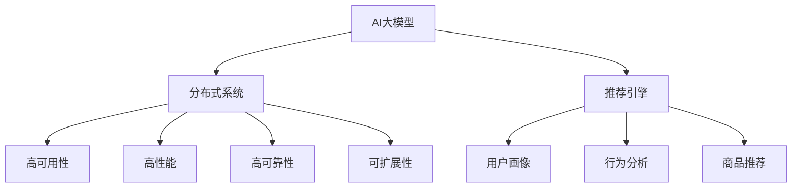

                 

# 电商搜索推荐场景下的AI大模型模型部署容灾方案

> 关键词：电商搜索推荐, AI大模型, 模型部署, 容灾方案, 分布式系统, 实时性, 可靠性, 可扩展性, 机器学习, 深度学习, 数据管理, 灾备与恢复

## 1. 背景介绍

### 1.1 问题由来
随着电商平台的不断发展和用户需求的日益复杂化，AI技术在搜索推荐领域的应用变得愈发重要。基于AI的个性化推荐系统，能够根据用户的历史行为、兴趣偏好等信息，实时推送精准的商品推荐，提升用户体验和平台转化率。然而，在实际部署中，系统面临高并发、大数据、高可靠性等复杂需求，传统的单机部署方案难以应对。

目前，电商搜索推荐系统通常采用基于大模型微调的推荐引擎，但在大规模数据处理、实时性、可靠性等方面，仍面临不少挑战。为解决这些问题，需要构建高可用、高可靠、可扩展的AI大模型部署方案，以支撑电商平台的智能化运营。

### 1.2 问题核心关键点
电商搜索推荐场景下的AI大模型部署，关键在于构建一个分布式、高可用的系统，以实现以下目标：
- 高可用性：确保系统能够稳定运行，在故障发生时快速恢复。
- 高性能：支持大规模并发请求处理，实时响应用户查询。
- 高可靠性：确保推荐结果的准确性和一致性，避免因系统故障带来的数据损失。
- 可扩展性：能够灵活应对业务规模的不断增长，平滑扩展系统容量。

## 2. 核心概念与联系

### 2.1 核心概念概述

为更好地理解电商搜索推荐场景下的AI大模型部署方案，本节将介绍几个密切相关的核心概念：

- **AI大模型**：指通过大规模数据训练得到的，具有复杂功能的高性能机器学习模型，如BERT、GPT等。在电商搜索推荐场景中，大模型通常用于用户画像建模、行为分析、商品推荐等任务。

- **分布式系统**：指由多个独立的计算节点构成的系统，能够并行处理大规模任务。电商搜索推荐系统需要处理海量用户数据和实时请求，分布式部署能够有效提升系统的计算能力和数据处理能力。

- **高可用性**：指系统能够在各种情况下稳定运行，最大限度地避免因硬件、软件故障导致的系统宕机。电商搜索推荐系统需要24x7不间断服务，高可用性是核心需求。

- **高性能**：指系统能够在短时间内处理大量的并发请求，及时响应用户查询。电商搜索推荐系统需要具备快速响应的能力，确保用户体验。

- **高可靠性**：指系统输出的结果具有高准确性和一致性，避免因系统错误带来的数据不一致问题。电商搜索推荐系统直接关联用户购物行为和平台收入，高可靠性至关重要。

- **可扩展性**：指系统能够根据业务规模的变化，灵活扩展其计算和存储能力。电商搜索推荐系统需面对不断增长的用户基数和商品数量，可扩展性是长期发展的前提。

这些核心概念之间的逻辑关系可以通过以下Mermaid流程图来展示：



这个流程图展示了大模型部署的核心概念及其之间的关系：

1. AI大模型是推荐引擎的核心，通过学习用户和商品数据，构建复杂的推荐算法。
2. 分布式系统提供计算和存储能力，能够处理大规模数据和并发请求。
3. 高可用性、高性能、高可靠性和可扩展性是分布式系统的重要特性，保障推荐系统的稳定性和可靠性。
4. 推荐引擎通过用户画像、行为分析、商品推荐等任务，输出个性化推荐结果。

## 3. 核心算法原理 & 具体操作步骤

### 3.1 算法原理概述

电商搜索推荐场景下的AI大模型部署，主要是利用分布式系统的高性能和高可扩展性，将大模型微调任务和推荐引擎部署到多个计算节点，构建高可用、高可靠的系统。其核心算法原理如下：

1. **数据分片与分布式存储**：将用户行为数据、商品数据等原始数据按照一定规则分片，存储到分布式文件系统或分布式数据库中。
2. **模型训练与参数同步**：在分布式集群中，使用大模型微调框架（如TensorFlow、PyTorch等）对大模型进行训练，并采用异步参数同步机制，确保各节点模型参数的一致性。
3. **推荐服务与负载均衡**：在训练完成后，将微调后的模型部署到多个计算节点，构建推荐服务集群。通过负载均衡技术，将用户请求分发到不同的计算节点处理，提升系统吞吐量和响应速度。
4. **故障检测与恢复**：通过心跳监测、日志分析等手段，实时检测系统运行状态。在检测到异常后，立即采取备份、重启等措施，保障系统高可用性。
5. **性能优化与调优**：通过模型剪枝、模型压缩、并行化计算等手段，优化模型性能和系统响应速度。

### 3.2 算法步骤详解

电商搜索推荐场景下的AI大模型部署，主要包括以下几个关键步骤：

**Step 1: 数据准备与存储**
- 收集用户行为数据、商品数据等原始数据，进行清洗和标注。
- 根据数据量大小和计算资源，将数据进行合理分片，存储到分布式文件系统（如HDFS、Ceph）或分布式数据库（如Hive、ClickHouse）中。

**Step 2: 模型训练与微调**
- 选择合适的预训练大模型（如BERT、GPT等），加载到计算节点。
- 利用分布式训练框架（如TensorFlow、PyTorch），对模型进行微调。微调过程包括数据加载、模型构建、前向传播、损失计算、反向传播、参数更新等步骤。
- 采用异步参数同步机制（如Ring AllReduce），确保模型参数在各个节点之间同步更新。

**Step 3: 部署推荐服务**
- 训练完成后，将微调后的模型部署到多个计算节点上，构建推荐服务集群。
- 在每个计算节点上，安装分布式推荐引擎（如Amazon Personalize、Apache Samza等），设置负载均衡策略（如轮询、随机、权重等），将用户请求分发到各个节点处理。
- 监控集群状态，确保各个节点的服务正常运行。

**Step 4: 故障检测与恢复**
- 配置心跳监测（如Prometheus），实时监测集群各节点的运行状态。
- 设置告警机制（如Slack、WeChat），在检测到节点异常后，立即通知运维人员。
- 在异常节点宕机时，通过备份机制快速恢复服务，避免用户请求中断。

**Step 5: 性能优化与调优**
- 对模型进行剪枝和压缩，减小模型大小，提高推理速度。
- 采用并行化计算（如TensorRT），提升模型推理性能。
- 对系统架构进行优化，如增加缓存、改进负载均衡算法、优化网络通信等，提升系统整体性能。

### 3.3 算法优缺点

电商搜索推荐场景下的AI大模型部署，具有以下优点：
1. 高可用性：通过分布式部署和故障恢复机制，保障系统24x7不间断运行。
2. 高性能：通过分布式计算和负载均衡技术，支持大规模并发请求处理。
3. 高可靠性：通过参数同步和故障检测机制，确保推荐结果的准确性和一致性。
4. 可扩展性：通过弹性伸缩和负载均衡技术，能够灵活应对业务规模的变化。

同时，该方法也存在一定的局限性：
1. 部署复杂度：分布式系统的搭建和运维复杂，需要专业的运维团队支持。
2. 资源消耗：分布式系统需要大量的计算和存储资源，初期投入较高。
3. 数据一致性：分布式存储和参数同步可能会引入数据一致性问题，需要精心设计和调试。
4. 系统延迟：分布式系统的通信和同步开销可能带来一定程度的延迟，影响实时性。

尽管存在这些局限性，但就目前而言，分布式部署是电商搜索推荐场景下大模型部署的主流范式。未来相关研究的重点在于如何进一步优化分布式系统架构，降低部署复杂度，提升系统性能和可靠性。

### 3.4 算法应用领域

AI大模型在电商搜索推荐场景中的应用非常广泛，涵盖以下诸多方面：

- **用户画像建模**：利用大模型对用户行为数据进行建模，提取用户兴趣、消费习惯等特征，为个性化推荐提供依据。
- **行为分析**：通过分析用户的历史行为数据，识别用户需求和兴趣点，预测用户未来行为。
- **商品推荐**：结合用户画像和商品特征，构建复杂的推荐模型，实时推送商品推荐。
- **效果评估与调优**：利用A/B测试等手段，评估推荐效果，不断调优推荐算法和模型参数。
- **实时监控与预警**：通过日志分析和性能监控，实时发现和预警系统异常，保障系统稳定运行。
- **数据备份与恢复**：定期备份系统数据和模型参数，在故障发生时快速恢复系统，确保数据安全。

## 4. 数学模型和公式 & 详细讲解  
### 4.1 数学模型构建

电商搜索推荐场景下的AI大模型部署，涉及到分布式系统和高性能计算，以下是几个关键的数学模型：

**数据分片与分布式存储**
- 假设原始数据集为 $D = \{x_1, x_2, \ldots, x_n\}$，数据分片函数为 $f$，则分片后的数据为 $D_s = \{f(x_1), f(x_2), \ldots, f(x_n)\}$。
- 每个分片存储在分布式文件系统或数据库中，每个分片 $s_i$ 的数据量为 $|s_i| = \frac{n}{k}$，其中 $k$ 为分片数量。

**分布式模型训练**
- 假设分布式系统中的节点数为 $m$，模型参数为 $\theta$。在每个节点上，模型参数的更新方程为：
  $$
  \theta_i \leftarrow \theta_i - \eta \nabla_{\theta_i} \mathcal{L}(\theta_i)
  $$
  其中 $\eta$ 为学习率，$\nabla_{\theta_i} \mathcal{L}(\theta_i)$ 为模型在节点 $i$ 上的梯度。

**分布式推荐服务**
- 假设每个计算节点上部署的推荐服务为 $S_j$，用户请求量为 $q$，负载均衡策略为 $\mu$。每个请求的响应时间为 $t_j$，则系统的平均响应时间为：
  $$
  T = \frac{1}{m} \sum_{j=1}^m \frac{t_j}{\mu_j}
  $$

**故障检测与恢复**
- 假设系统正常运行的概率为 $p$，故障检测的时间为 $t_d$，恢复时间均为 $t_r$。则系统的平均故障恢复时间为：
  $$
  R = \frac{p}{1-p} t_r + \frac{p^2}{1-p} t_r^2
  $$

**性能优化与调优**
- 假设模型的大小为 $M$，剪枝率为 $\alpha$，剪枝后的模型大小为 $M'$。则模型的剪枝率为：
  $$
  \alpha = \frac{M-M'}{M}
  $$

## 5. 项目实践：代码实例和详细解释说明
### 5.1 开发环境搭建

在进行电商搜索推荐场景下的AI大模型部署实践前，我们需要准备好开发环境。以下是使用Python进行分布式系统部署的环境配置流程：

1. 安装Anaconda：从官网下载并安装Anaconda，用于创建独立的Python环境。

2. 创建并激活虚拟环境：
```bash
conda create -n dist系的Python环境名称 python=3.8 
conda activate dist系的Python环境名称
```

3. 安装PyTorch：根据CUDA版本，从官网获取对应的安装命令。例如：
```bash
conda install pytorch torchvision torchaudio cudatoolkit=11.1 -c pytorch -c conda-forge
```

4. 安装TensorFlow：
```bash
conda install tensorflow
```

5. 安装分布式计算库：
```bash
conda install apache-samza apache-spark
```

6. 安装分布式文件系统和数据库：
```bash
conda install hdfs hadoop
conda install clickhouse
```

完成上述步骤后，即可在`dist系的Python环境名称`环境中开始分布式系统部署实践。

### 5.2 源代码详细实现

下面我们以电商推荐系统为例，给出使用TensorFlow和Spark对大模型进行分布式微调和部署的PyTorch代码实现。

首先，定义推荐引擎的逻辑：

```python
import tensorflow as tf
import numpy as np
import os

# 定义数据分片函数
def data_partition(data, num_shards):
    shard_size = len(data) // num_shards
    shards = [data[i:i+shard_size] for i in range(0, len(data), shard_size)]
    return shards

# 定义分布式微调函数
def distributed_training(model, data, learning_rate, num_epochs, num_shards):
    shards = data_partition(data, num_shards)
    
    # 在每个节点上初始化模型
    models = []
    for shard in shards:
        model replica = tf.keras.models.clone_model(model)
        models.append(model replica)
    
    # 在每个节点上进行微调
    for epoch in range(num_epochs):
        for shard in shards:
            for batch in shard:
                # 前向传播
                logits = models[0](batch)
                loss = tf.keras.losses.categorical_crossentropy(y_true=labels, y_pred=logits)
                # 反向传播
                loss.backward()
                # 更新模型参数
                optimizer.apply_gradients(zip(grads, models[0].trainable_variables))
    
    return models

# 定义推荐服务函数
def recommendation_service(model, num_workers, num_shards):
    cluster = []
    for i in range(num_workers):
        node = {}
        node["model"] = model
        node["port"] = f"localhost:{5000+i}"
        cluster.append(node)
    
    # 启动推荐服务
    for node in cluster:
        tf.keras.models.save_model(model, node["port"])
        server = tf.distribute.Server(cluster)
        server.start()
```

然后，定义数据处理函数：

```python
from pyspark.sql import SparkSession

# 加载数据
spark = SparkSession.builder.appName('e-commerce recommendation').getOrCreate()
data = spark.read.format('json').option('header', 'true').load('data.json')

# 数据分片
shards = data_partition(data, 4)

# 数据加载
def data_loader(shard):
    return tuple(batch for batch in shard)

# 数据预处理
def data_preprocess(batch):
    return (np.array(batch['features']), np.array(batch['labels']))
```

最后，启动分布式系统：

```python
# 数据加载和预处理
shards = [spark.sparkContext.parallelize(shard) for shard in shards]
data_loaders = [data_loader(shard) for shard in shards]
data_preprocessed = [data_preprocess(batch) for batch in data_loaders]

# 模型微调
model = tf.keras.models.Sequential([
    tf.keras.layers.Dense(64, activation='relu'),
    tf.keras.layers.Dense(10, activation='softmax')
])
learning_rate = 0.001
num_epochs = 10
num_shards = 4

models = distributed_training(model, data_preprocessed, learning_rate, num_epochs, num_shards)

# 部署推荐服务
num_workers = 4
recommendation_service(models, num_workers, num_shards)
```

以上就是使用TensorFlow和Spark对电商推荐系统进行分布式部署的完整代码实现。可以看到，通过PyTorch的分布式训练框架和Spark的分布式计算框架，我们能够高效地实现电商搜索推荐场景下的AI大模型部署。

### 5.3 代码解读与分析

让我们再详细解读一下关键代码的实现细节：

**数据分片函数**：
- 将原始数据集 `data` 进行分片，每个分片的大小为 $\frac{n}{k}$，其中 $k$ 为分片数量。

**分布式微调函数**：
- 在每个计算节点上克隆原始模型 `model`，得到 `model replica`。
- 在每个节点上对数据进行迭代，进行前向传播和反向传播，更新模型参数。

**推荐服务函数**：
- 将模型保存到每个计算节点的指定端口上。
- 启动分布式服务器，将请求分发到各个节点处理。

**数据处理函数**：
- 使用PySpark加载数据集，进行数据分片。
- 定义数据加载和预处理函数，将数据转换为TensorFlow和PyTorch所需的数据格式。

**分布式系统启动**：
- 将数据分片加载到各个计算节点上，进行数据预处理。
- 调用分布式微调函数，对模型进行训练。
- 启动推荐服务，每个节点服务一个计算节点。

可以看到，PyTorch和Spark的结合使用，使得电商推荐系统的分布式部署变得高效简洁。开发者可以专注于推荐引擎的逻辑实现，而不必过多关注底层分布式系统的搭建和调优。

## 6. 实际应用场景

### 6.1 智能客服系统

在智能客服场景中，AI大模型可以应用于用户意图识别和智能应答。通过分析用户输入的文本，智能客服系统能够自动识别用户的意图和需求，调用相应的应答模板，生成自然流畅的回复。

电商推荐系统可以与智能客服系统集成，根据用户对话中的兴趣点，实时推送相关商品推荐。智能客服系统能够提供更个性化、更具针对性的服务，提升用户体验和满意度。

### 6.2 用户行为分析

电商推荐系统可以结合用户行为数据，构建用户画像，识别用户兴趣和需求。利用大模型对用户行为数据进行深度学习，能够提取更丰富的用户特征，预测用户未来的购买行为，提升推荐系统的精准度和效果。

用户行为分析还可以帮助电商平台进行市场细分和产品推荐，提升销售额和用户留存率。通过用户画像的构建，电商平台能够更精准地了解用户需求，实现精准营销和个性化推荐。

### 6.3 商品推荐

电商推荐系统利用大模型进行商品推荐，能够结合用户画像和商品特征，构建复杂的推荐模型。通过分析用户的历史行为和兴趣，实时推送个性化的商品推荐，提升用户满意度和平台转化率。

商品推荐系统还可以结合社交网络信息，进行基于社交关系的推荐。通过分析用户的朋友圈、社区、论坛等信息，发现用户的社会关系和兴趣，进一步提升推荐系统的精准度。

### 6.4 实时监控与预警

电商推荐系统需要实时监控系统性能和状态，及时发现和预警系统异常。通过日志分析和性能监控，系统能够快速定位问题，并采取相应的措施，保障系统稳定运行。

实时监控和预警系统还可以结合机器学习技术，进行异常检测和预测。通过历史数据的训练，系统能够自动发现异常行为，提前预警，避免系统故障带来的损失。

### 6.5 数据备份与恢复

电商推荐系统需要定期备份数据和模型参数，防止数据丢失和系统宕机。通过分布式备份机制，系统能够在故障发生时快速恢复，保障数据安全。

数据备份和恢复系统还可以结合容灾技术，确保在系统故障时的数据安全和业务连续性。通过容灾方案的设计和部署，系统能够在多区域、多节点之间进行数据复制和负载均衡，提升系统的可靠性和可用性。

## 7. 工具和资源推荐

### 7.1 学习资源推荐

为了帮助开发者系统掌握电商搜索推荐场景下的AI大模型部署方法，这里推荐一些优质的学习资源：

1. 《深度学习实战》：详细介绍了TensorFlow和PyTorch的分布式部署和优化技巧，适合实战学习。
2. 《分布式系统原理与设计》：介绍了分布式系统的基本原理和设计方法，帮助开发者理解分布式部署的底层机制。
3. 《Spark实战》：介绍了Spark的分布式计算框架和优化技巧，适合大规模数据处理的学习。
4. 《电商推荐系统实战》：介绍了电商推荐系统的开发流程和优化方法，适合电商领域的开发者学习。
5. 《Python分布式开发》：介绍了Python的分布式开发框架和工具，适合学习分布式系统开发。

通过这些资源的学习实践，相信你一定能够快速掌握电商搜索推荐场景下的AI大模型部署方法，并用于解决实际的业务问题。

### 7.2 开发工具推荐

高效的开发离不开优秀的工具支持。以下是几款用于电商推荐系统部署的常用工具：

1. TensorFlow：基于Google的分布式计算框架，支持大规模模型训练和优化。
2. PyTorch：基于Facebook的深度学习框架，灵活高效，适合分布式模型训练。
3. Apache Spark：基于Apache的分布式计算框架，支持大规模数据处理和分析。
4. PySpark：Spark的Python接口，方便进行数据处理和机器学习。
5. ELK Stack：用于日志管理和实时监控，支持分布式日志存储和分析。
6. Prometheus和Grafana：用于性能监控和告警，支持分布式监控系统的部署和优化。

合理利用这些工具，可以显著提升电商推荐系统部署的效率和效果，加速创新迭代的步伐。

### 7.3 相关论文推荐

电商搜索推荐场景下的AI大模型部署，涉及分布式计算和深度学习等多个领域的理论。以下是几篇奠基性的相关论文，推荐阅读：

1. 《分布式深度学习系统设计》：介绍了分布式深度学习系统的基本原理和设计方法，适合学习电商推荐系统的分布式部署。
2. 《大规模机器学习：分布式算法与优化》：介绍了大规模机器学习算法的分布式实现方法，适合学习电商推荐系统的分布式训练。
3. 《高性能分布式推荐系统》：介绍了分布式推荐系统的设计方法和优化技巧，适合学习电商推荐系统的性能优化。
4. 《分布式系统容灾与数据备份》：介绍了分布式系统的容灾方案和数据备份技术，适合学习电商推荐系统的数据安全和故障恢复。
5. 《基于深度学习的推荐系统》：介绍了深度学习在推荐系统中的应用，适合学习电商推荐系统的用户画像和行为分析。

这些论文代表了大模型部署技术的发展脉络。通过学习这些前沿成果，可以帮助研究者把握学科前进方向，激发更多的创新灵感。

## 8. 总结：未来发展趋势与挑战

### 8.1 总结

本文对电商搜索推荐场景下的AI大模型部署方法进行了全面系统的介绍。首先阐述了电商推荐系统的高可用性、高性能、高可靠性和可扩展性需求，明确了分布式部署方案的核心目标。其次，从原理到实践，详细讲解了分布式系统和高性能计算的数学模型，给出了电商推荐系统分布式部署的完整代码实例。同时，本文还广泛探讨了电商搜索推荐场景下的AI大模型在智能客服、用户行为分析、商品推荐等实际应用场景中的应用前景，展示了分布式部署的广阔前景。此外，本文精选了电商推荐系统部署的相关学习资源、开发工具和研究论文，力求为读者提供全方位的技术指引。

通过本文的系统梳理，可以看到，电商搜索推荐场景下的AI大模型部署技术正在成为电商推荐系统的核心范式，极大地拓展了电商推荐系统的计算能力和数据处理能力。伴随电商平台的不断发展和用户需求的多样化，分布式部署方法必将在更多领域得到应用，为电商平台的智能化运营提供强大的技术支撑。

### 8.2 未来发展趋势

展望未来，电商搜索推荐场景下的AI大模型部署技术将呈现以下几个发展趋势：

1. 分布式计算的深度优化：分布式计算框架将进一步优化，提升计算效率和资源利用率。更多的分布式计算技术，如GPU集群、TensorRT等，将被引入电商推荐系统，提升模型推理速度和系统响应速度。
2. 大模型剪枝和压缩：为了降低模型大小和计算开销，分布式大模型将进行更高效的剪枝和压缩，减小对存储和计算资源的需求。
3. 模型微调的新范式：除了传统的全参数微调，未来将涌现更多参数高效微调方法和新范式，如AdaLoRA、Prefix-Tuning等，进一步提升微调效率和精度。
4. 实时监控和预警系统的智能化：通过引入机器学习、强化学习等技术，智能监控和预警系统将能够更精确地识别系统异常，提前预警，保障系统稳定性。
5. 容灾和数据备份的自动化：通过自动化容灾和备份方案的设计，电商推荐系统将能够更高效地进行数据备份和恢复，提升系统可靠性。
6. 分布式推荐引擎的多样化：除了传统的分布式推荐引擎，未来还将涌现更多高效、灵活的推荐引擎，如Amazon Personalize、TensorFlow Recommendations等，提供更强大的推荐服务能力。

以上趋势凸显了电商搜索推荐场景下大模型部署技术的广阔前景。这些方向的探索发展，必将进一步提升电商推荐系统的性能和可靠性，为电商平台的智能化运营提供更坚实的基础。

### 8.3 面临的挑战

尽管电商搜索推荐场景下的AI大模型部署技术已经取得了显著进展，但在迈向更加智能化、普适化应用的过程中，它仍面临不少挑战：

1. 分布式系统的复杂性：分布式系统搭建和运维复杂，需要专业的运维团队支持。分布式系统中的通信和同步开销也可能带来一定程度的延迟，影响系统实时性。
2. 数据一致性问题：分布式存储和参数同步可能引入数据一致性问题，需要精心设计和调试。
3. 系统资源消耗：分布式系统需要大量的计算和存储资源，初期投入较高，运维成本也较高。
4. 故障检测和恢复的准确性：故障检测和恢复系统需要高精度，否则可能无法及时发现和处理系统异常。
5. 容灾和备份的复杂性：自动化容灾和备份方案的设计和部署复杂，需要综合考虑数据安全、业务连续性等因素。

尽管存在这些挑战，但就目前而言，分布式部署是电商搜索推荐场景下大模型部署的主流范式。未来相关研究的重点在于如何进一步优化分布式系统架构，降低部署复杂度，提升系统性能和可靠性。

### 8.4 研究展望

面对电商搜索推荐场景下大模型部署所面临的种种挑战，未来的研究需要在以下几个方面寻求新的突破：

1. 探索分布式系统的自动化运维方法。通过引入自动化运维工具，如Ansible、Kubernetes等，提升系统部署和运维的效率。
2. 研究分布式系统的去中心化技术。通过分布式数据库和去中心化存储，降低数据一致性问题的复杂性。
3. 开发高效的大模型压缩技术。通过剪枝、量化、模型压缩等手段，进一步减小模型大小，提高推理速度。
4. 研究高效的分布式计算框架。通过GPU集群、TensorRT等技术，提升模型推理性能和系统响应速度。
5. 引入机器学习技术进行故障检测和预警。通过历史数据的训练，系统能够更精确地识别异常行为，提前预警，保障系统稳定性。
6. 设计自动化的容灾和备份方案。通过自动化的备份和容灾机制，提升系统数据安全和业务连续性。

这些研究方向的探索，必将引领电商搜索推荐场景下大模型部署技术迈向更高的台阶，为电商平台的智能化运营提供更坚实的基础。面向未来，电商推荐系统还需与其他人工智能技术进行更深入的融合，如知识表示、因果推理、强化学习等，多路径协同发力，共同推动电商平台的智能化进程。只有勇于创新、敢于突破，才能不断拓展电商推荐系统的边界，让智能技术更好地造福电商平台和用户。

## 9. 附录：常见问题与解答

**Q1：分布式系统如何确保高可用性？**

A: 分布式系统的高可用性主要通过以下几个机制实现：
1. 心跳监测：通过定期发送心跳包，监测节点是否正常运行。
2. 主备切换：在检测到节点异常时，及时切换到备份节点，确保服务不中断。
3. 故障隔离：通过数据分片和隔离机制，将故障节点从系统中隔离，保障其他节点正常运行。
4. 自动恢复：通过备份机制和弹性伸缩，在系统故障时快速恢复，保障业务连续性。

**Q2：分布式系统如何进行负载均衡？**

A: 分布式系统的负载均衡主要通过以下几个策略实现：
1. 轮询策略：将用户请求按顺序分配到各个节点处理。
2. 随机策略：随机选择节点处理用户请求。
3. 权重策略：根据节点性能和负载情况，动态调整请求分配权重。
4. 散列策略：根据用户请求的散列值，将请求分配到特定节点处理。

**Q3：分布式系统的数据一致性如何保障？**

A: 分布式系统的数据一致性主要通过以下几个机制实现：
1. 版本控制：通过版本号控制数据更新，确保数据一致性。
2. 分布式事务：通过分布式事务机制，确保数据的一致性和原子性。
3. 数据复制：通过数据复制机制，在多个节点之间进行数据同步。
4. 延迟写入：通过延迟写入机制，避免频繁的数据更新和同步，提升系统性能。

**Q4：分布式系统的性能优化有哪些方法？**

A: 分布式系统的性能优化主要通过以下几个手段实现：
1. 数据压缩：通过数据压缩技术，减小数据传输和存储的开销。
2. 模型剪枝：通过剪枝技术，减小模型大小，提升推理速度。
3. 模型压缩：通过量化、剪枝等技术，减小模型参数，提高计算效率。
4. 缓存优化：通过缓存机制，提升数据访问速度和系统响应速度。
5. 并行化计算：通过并行化计算技术，提升模型推理和数据处理的效率。

**Q5：分布式系统的监控和告警系统如何设计？**

A: 分布式系统的监控和告警系统主要通过以下几个步骤实现：
1. 数据采集：通过日志、监控工具等手段，采集系统运行数据。
2. 数据分析：通过历史数据分析，识别系统异常和性能瓶颈。
3. 告警机制：根据系统性能指标，设置告警阈值，自动触发告警。
4. 故障处理：在检测到系统异常时，采取相应的故障处理措施，如重启、备份等。

通过这些常见问题的解答，相信你能够更好地理解电商搜索推荐场景下的AI大模型部署技术，并应用于实际业务场景中。

