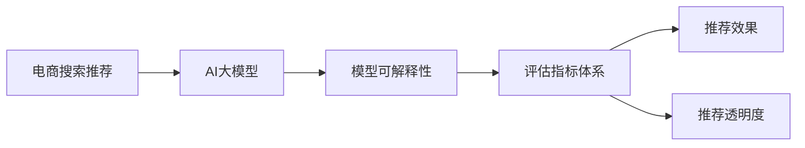
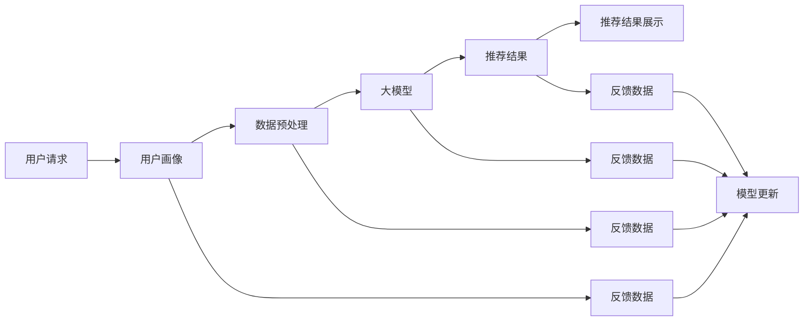

                 

# 电商搜索推荐效果评估中的AI大模型模型可解释性评估指标体系优化

## 1. 背景介绍

### 1.1 问题由来

在电商搜索推荐领域，大模型正逐渐取代传统的协同过滤和深度推荐系统，成为实现个性化推荐的主要技术手段。然而，尽管大模型在表现上有巨大的优势，但在实际应用中，也面临着模型复杂性高、决策过程不透明、难以解释等问题。这些问题在遇到用户投诉、产品下架等关键场景时，给电商平台带来了较大的风险。

为了在提升推荐效果的同时，降低模型的不确定性和提升透明度，电商平台对大模型的可解释性要求日益增强。模型可解释性评估指标体系，成为衡量AI模型在推荐场景中适用性的重要工具。

### 1.2 问题核心关键点

本研究聚焦于电商平台中的AI大模型推荐系统，希望构建一套全面的模型可解释性评估指标体系，用于衡量模型的推荐质量和透明度，降低平台面临的风险。主要关注点如下：

1. 如何构建一个可量化、可操作的指标体系，覆盖模型在推荐任务中的表现。
2. 如何结合电商平台的实际业务需求，设计针对性的评估指标，反映模型的实际效果。
3. 如何在推荐任务中应用模型可解释性技术，提升用户信任，降低决策风险。

## 2. 核心概念与联系

### 2.1 核心概念概述

- **电商搜索推荐**：指电商平台通过AI大模型技术，根据用户的历史行为、兴趣偏好等数据，为用户推荐相关产品，提升购买转化率，提高用户满意度。
- **AI大模型**：指以自回归模型（如GPT）或自编码模型（如BERT）为代表的深度神经网络模型，在大规模无标签数据上进行预训练，学习通用的语言表征。
- **模型可解释性**：指模型输出的预测结果，能够通过某种方式被解释、理解和验证，帮助用户或开发者理解模型的决策过程和依据。
- **评估指标体系**：指一套系统化的标准体系，用于量化和比较不同模型的性能和效果，提供决策依据。
- **推荐效果**：指模型为用户推荐的商品与用户的实际需求、历史偏好之间的匹配程度。
- **推荐透明度**：指模型推荐决策的可解释性和透明性，用户能否理解和信任模型的输出。

这些核心概念通过如下Mermaid流程图呈现：



### 2.2 核心概念原理和架构的 Mermaid 流程图

下图展示了电商平台中AI大模型推荐系统的一般架构，从中我们可以更直观地理解各个核心概念的相互关系：



## 3. 核心算法原理 & 具体操作步骤

### 3.1 算法原理概述

电商平台中的AI大模型推荐系统，通常包括以下几个关键步骤：

1. **用户画像构建**：根据用户的历史行为、兴趣偏好等数据，构建用户画像，描述用户的基本特征和兴趣标签。
2. **数据预处理**：将用户画像和商品信息进行标准化处理，提取特征向量。
3. **大模型输入**：将预处理后的特征向量输入到预训练的AI大模型中，进行多层次的特征提取和表示学习。
4. **推荐结果生成**：基于大模型的输出，生成推荐结果。
5. **推荐结果展示**：将推荐结果展示给用户，完成推荐循环。

模型可解释性评估指标体系，通过量化推荐效果和推荐透明度，对大模型的推荐过程进行全面评估，从而优化推荐系统，提升用户体验。

### 3.2 算法步骤详解

构建电商搜索推荐中的AI大模型模型可解释性评估指标体系，主要包括以下几个步骤：

**Step 1: 数据收集与预处理**
- 收集电商平台的推荐日志、用户行为数据、商品数据等，建立统一的数据格式和标准。
- 对数据进行清洗和标注，生成评估所需的有标签数据集。

**Step 2: 设计评估指标体系**
- 根据电商平台的推荐任务特点，设计多维度的评估指标，包括推荐效果、推荐透明度等。
- 选择合适的模型输出解释方法，如LIME、SHAP等。

**Step 3: 数据划分与模型训练**
- 将数据集划分为训练集、验证集和测试集，设置训练轮数和超参数。
- 在训练集上训练大模型，生成推荐结果。

**Step 4: 模型评估**
- 在验证集上评估模型，计算推荐效果指标，调整超参数。
- 在测试集上再次评估模型，生成评估报告。

**Step 5: 模型优化与反馈**
- 根据评估报告，对模型进行优化，提升推荐效果和透明度。
- 通过用户反馈和行为数据，不断迭代优化模型。

### 3.3 算法优缺点

基于电商搜索推荐的大模型推荐系统，具有以下优点：

1. 强大的特征表示能力：大模型能够从海量数据中提取复杂、多层次的特征表示，提升推荐效果。
2. 灵活的个性化推荐：通过大模型，可以实时动态地调整推荐策略，满足用户的多样化需求。
3. 跨领域泛化能力：大模型在不同领域的数据上表现良好，具有较强的泛化能力。

同时，大模型推荐系统也存在一定的缺点：

1. 模型复杂度高：大模型参数多、计算量大，训练和推理耗时较长。
2. 可解释性不足：大模型的内部决策过程复杂，难以解释和理解。
3. 数据依赖性强：推荐效果依赖于数据的丰富性和质量，存在潜在的偏见和偏差。
4. 推理效率低：大规模数据输入时，大模型的推理效率较低。

### 3.4 算法应用领域

基于电商搜索推荐的大模型推荐系统，已经在各大电商平台得到了广泛的应用，例如：

- 淘宝推荐系统：根据用户行为数据和商品信息，生成个性化推荐。
- 京东推荐系统：结合用户画像和商品数据，实现精准推荐。
- 亚马逊推荐系统：通过分析用户浏览和购买历史，提升推荐效果。
- 拼多多推荐系统：在多商品场景中，实现高效推荐。

除了这些传统应用外，大模型推荐技术还被创新性地应用到更多场景中，如广告投放、内容推荐、搜索优化等，为电商平台带来了全新的业务价值。

## 4. 数学模型和公式 & 详细讲解 & 举例说明

### 4.1 数学模型构建

在电商搜索推荐场景中，模型的输入通常包含用户的特征向量 $x$ 和商品的特征向量 $y$，模型的输出为推荐得分 $s$。

具体而言，模型可以表示为：

$$
s(x, y) = M_\theta(x, y)
$$

其中 $M_\theta$ 表示大模型的参数化表示。

推荐效果可以量化为以下指标：

- **精度 (Precision)**：推荐结果中实际相关的商品数量与推荐总数量之比。
- **召回率 (Recall)**：推荐结果中实际相关的商品数量与所有实际相关商品数量之比。
- **F1 Score**：综合考虑精度和召回率，衡量推荐效果。

推荐透明度的量化可以包含以下指标：

- **可解释性 (Interpretability)**：用户能否理解推荐模型的内部决策过程和依据。
- **可解释度 (Explainability)**：推荐的商品能否被用户接受和理解。
- **可信度 (Trustworthiness)**：用户对推荐结果的信任程度。

### 4.2 公式推导过程

在推荐效果指标的计算中，以 precision 为例，公式如下：

$$
Precision = \frac{TP}{TP + FP}
$$

其中，$TP$ 表示推荐结果中实际相关的商品数量，$FP$ 表示推荐结果中无关的商品数量。

在推荐透明度指标的计算中，以可解释性为例，可以通过 LIME 或 SHAP 等方法，计算模型在每个样本上的局部解释，衡量其可解释性。具体步骤如下：

1. 对模型进行随机采样，生成多个测试样本。
2. 对每个测试样本，生成局部可解释性指标，表示模型在该样本上的预测依据。
3. 对所有测试样本的可解释性指标进行统计，计算平均可解释性。

### 4.3 案例分析与讲解

**案例1：精度计算**

假设我们有一个推荐系统，其推荐结果为商品 $A, B, C$，其中 $A$ 是实际相关的商品，$B, C$ 是无关的。实际相关的商品总数为 5 个，无关的商品总数为 10 个。

模型生成的推荐结果为 $A, B, C$，因此 $TP = 1$，$FP = 2$，计算得到精度：

$$
Precision = \frac{1}{1 + 2} = 0.333
$$

**案例2：可解释性计算**

假设我们使用 LIME 方法，对模型生成的推荐结果进行局部解释。选取一个测试样本，模型预测的商品为 $A, B, C$。LIME 方法计算模型在每个样本上的局部解释，表示模型在推荐决策中的依据。

通过 LIME 生成的局部解释，我们可以观察到模型在推荐时，是否关注了商品的用户评分、类别、价格等因素。如果模型解释清晰，用户可以理解其推荐依据，从而提升推荐透明度和信任度。

## 5. 项目实践：代码实例和详细解释说明

### 5.1 开发环境搭建

在进行项目实践前，我们需要准备好开发环境。以下是使用Python进行PyTorch和Transformers库开发的环境配置流程：

1. 安装Anaconda：从官网下载并安装Anaconda，用于创建独立的Python环境。

2. 创建并激活虚拟环境：
```bash
conda create -n pytorch-env python=3.8 
conda activate pytorch-env
```

3. 安装PyTorch：根据CUDA版本，从官网获取对应的安装命令。例如：
```bash
conda install pytorch torchvision torchaudio cudatoolkit=11.1 -c pytorch -c conda-forge
```

4. 安装Transformers库：
```bash
pip install transformers
```

5. 安装各类工具包：
```bash
pip install numpy pandas scikit-learn matplotlib tqdm jupyter notebook ipython
```

完成上述步骤后，即可在`pytorch-env`环境中开始项目实践。

### 5.2 源代码详细实现

这里以推荐效果指标的计算为例，给出一个使用Transformers库对预训练模型进行推荐效果评估的PyTorch代码实现。

```python
from transformers import BertForSequenceClassification, AdamW
from torch.utils.data import Dataset, DataLoader
from sklearn.metrics import precision_recall_fscore_support
import torch

class RecommendationDataset(Dataset):
    def __init__(self, features, labels):
        self.features = features
        self.labels = labels
        
    def __len__(self):
        return len(self.features)
    
    def __getitem__(self, item):
        return self.features[item], self.labels[item]

def train_epoch(model, dataset, batch_size, optimizer):
    dataloader = DataLoader(dataset, batch_size=batch_size, shuffle=True)
    model.train()
    epoch_loss = 0
    for batch in dataloader:
        input_ids, labels = batch
        model.zero_grad()
        outputs = model(input_ids)
        loss = outputs.loss
        epoch_loss += loss.item()
        loss.backward()
        optimizer.step()
    return epoch_loss / len(dataloader)

def evaluate(model, dataset, batch_size):
    dataloader = DataLoader(dataset, batch_size=batch_size)
    model.eval()
    preds, labels = [], []
    with torch.no_grad():
        for batch in dataloader:
            input_ids, labels = batch
            outputs = model(input_ids)
            preds.append(outputs.logits.argmax(dim=1).tolist())
            labels.append(labels.tolist())
            
    precision, recall, f1, _ = precision_recall_fscore_support(labels, preds, average='binary')
    return precision, recall, f1

# 加载预训练模型
model = BertForSequenceClassification.from_pretrained('bert-base-cased', num_labels=2)

# 定义训练和评估函数
optimizer = AdamW(model.parameters(), lr=2e-5)

# 数据集加载和模型训练
train_dataset = RecommendationDataset(train_features, train_labels)
dev_dataset = RecommendationDataset(dev_features, dev_labels)
test_dataset = RecommendationDataset(test_features, test_labels)

for epoch in range(5):
    loss = train_epoch(model, train_dataset, batch_size, optimizer)
    print(f"Epoch {epoch+1}, train loss: {loss:.3f}")
    
    precision, recall, f1 = evaluate(model, dev_dataset, batch_size)
    print(f"Epoch {epoch+1}, dev results: {precision:.3f} {recall:.3f} {f1:.3f}")
    
precision, recall, f1 = evaluate(model, test_dataset, batch_size)
print(f"Epoch {epoch+1}, test results: {precision:.3f} {recall:.3f} {f1:.3f}")
```

在上述代码中，我们使用了BertForSequenceClassification模型作为推荐模型的底层。在训练函数中，我们定义了推荐效果指标的计算函数evaluate，使用precision_recall_fscore_support计算精度、召回率和F1 Score。

### 5.3 代码解读与分析

让我们再详细解读一下关键代码的实现细节：

**RecommendationDataset类**：
- `__init__`方法：初始化特征和标签。
- `__len__`方法：返回数据集的样本数量。
- `__getitem__`方法：对单个样本进行处理，返回模型所需的输入和标签。

**模型加载与训练**：
- 加载预训练模型，设置优化器。
- 定义训练函数train_epoch，在每个批次上前向传播计算损失，反向传播更新模型参数。
- 定义评估函数evaluate，在测试集上计算推荐效果指标。

在实际应用中，我们还可以进一步结合电商平台的业务场景，定制化设计更具体的评估指标，如推荐的多样性、新鲜度、用户满意度等，以全面评估模型的推荐效果。

## 6. 实际应用场景

### 6.1 电商搜索推荐

在电商搜索推荐中，大模型能够根据用户的搜索行为和浏览历史，生成个性化的搜索结果。通过构建完善的推荐效果评估指标体系，电商平台可以全面了解推荐系统的效果，优化模型，提升用户体验。

### 6.2 广告投放优化

在广告投放场景中，大模型能够根据用户的浏览和点击行为，生成个性化的广告推荐。通过评估广告的相关性和用户满意度，电商平台可以优化广告策略，提高广告转化率。

### 6.3 内容推荐

在内容推荐中，大模型能够根据用户的历史阅读记录和兴趣偏好，生成个性化的内容推荐。通过评估推荐效果和用户满意度，平台可以优化推荐算法，提升用户粘性。

### 6.4 未来应用展望

随着电商平台的业务场景不断扩展，大模型推荐系统将在更多领域得到应用。未来的研究方向包括：

1. **多模态融合**：结合视觉、音频等多模态信息，提升推荐效果。
2. **用户行为建模**：深入挖掘用户的行为数据，提升模型的用户画像和推荐策略。
3. **推荐效果增强**：通过引入推荐多样性、新鲜度等指标，提升推荐效果。
4. **推荐透明度提升**：通过可解释性技术，提升推荐的透明度和可信度。

## 7. 工具和资源推荐

### 7.1 学习资源推荐

为了帮助开发者系统掌握电商搜索推荐中的AI大模型推荐系统，这里推荐一些优质的学习资源：

1. 《深度学习与推荐系统》课程：斯坦福大学开设的推荐系统课程，涵盖推荐算法、评估指标等基础知识。
2. 《推荐系统实战》书籍：实践性很强的推荐系统应用书籍，结合代码实现和案例分析，帮助读者快速上手。
3. HuggingFace官方文档：Transformers库的官方文档，提供了大量预训练模型和微调样例代码，是上手实践的必备资料。
4. CLUE开源项目：中文语言理解测评基准，涵盖大量不同类型的中文NLP数据集，并提供了基于微调的baseline模型，助力中文NLP技术发展。

通过对这些资源的学习实践，相信你一定能够快速掌握电商搜索推荐中的AI大模型推荐系统，并用于解决实际的电商推荐问题。

### 7.2 开发工具推荐

高效的开发离不开优秀的工具支持。以下是几款用于电商搜索推荐开发常用的工具：

1. PyTorch：基于Python的开源深度学习框架，灵活动态的计算图，适合快速迭代研究。大部分预训练语言模型都有PyTorch版本的实现。
2. TensorFlow：由Google主导开发的开源深度学习框架，生产部署方便，适合大规模工程应用。同样有丰富的预训练语言模型资源。
3. Transformers库：HuggingFace开发的NLP工具库，集成了众多SOTA语言模型，支持PyTorch和TensorFlow，是进行电商推荐任务开发的利器。
4. Weights & Biases：模型训练的实验跟踪工具，可以记录和可视化模型训练过程中的各项指标，方便对比和调优。与主流深度学习框架无缝集成。
5. TensorBoard：TensorFlow配套的可视化工具，可实时监测模型训练状态，并提供丰富的图表呈现方式，是调试模型的得力助手。
6. Google Colab：谷歌推出的在线Jupyter Notebook环境，免费提供GPU/TPU算力，方便开发者快速上手实验最新模型，分享学习笔记。

合理利用这些工具，可以显著提升电商推荐系统的开发效率，加快创新迭代的步伐。

### 7.3 相关论文推荐

电商搜索推荐领域的研究正在迅速发展，以下是几篇奠基性的相关论文，推荐阅读：

1. "Recommender Systems"：亚马逊的研究论文，介绍了推荐系统的基础知识和前沿算法。
2. "Neural Recommendation Models"：Facebook的研究论文，介绍了深度学习在推荐系统中的应用。
3. "Adversarial Examples for Evaluation of Recommendation Systems"：Google的研究论文，介绍了对抗性样例在推荐系统中的应用。
4. "A Survey on Recommender Systems"：对推荐系统的全面综述，涵盖了推荐算法、评估指标、应用场景等多个方面。

这些论文代表了大模型推荐技术的发展脉络。通过学习这些前沿成果，可以帮助研究者把握学科前进方向，激发更多的创新灵感。

## 8. 总结：未来发展趋势与挑战

### 8.1 总结

本文对电商平台中的AI大模型推荐系统进行了全面系统的介绍。首先阐述了电商平台对推荐系统的需求和挑战，明确了AI大模型在推荐任务中的适用性和局限性。其次，从原理到实践，详细讲解了电商推荐中的模型可解释性评估指标体系构建方法，并提供了代码实现。最后，本文还广泛探讨了推荐系统在电商、广告、内容推荐等实际场景中的应用前景，展示了模型可解释性评估指标体系在推荐任务中的重要价值。

通过本文的系统梳理，可以看到，基于AI大模型的电商推荐系统在提升推荐效果和推荐透明度方面，具有巨大的潜力。尽管面临数据依赖、模型复杂度等挑战，但通过精心设计的评估指标体系，能够有效量化和优化模型，为电商平台的业务发展提供重要支撑。

### 8.2 未来发展趋势

展望未来，电商推荐系统中的AI大模型将呈现以下几个发展趋势：

1. 数据驱动的个性化推荐：通过更丰富的用户行为数据和商品信息，提升推荐系统的个性化和多样化。
2. 多模态融合的推荐技术：结合视觉、音频等多模态数据，提升推荐效果和用户满意度。
3. 推荐效果的多维度评估：引入推荐相关性、多样性、新鲜度等指标，全面量化推荐效果。
4. 推荐过程的可解释性：通过可解释性技术，提升推荐的透明度和可信度，降低用户投诉和决策风险。
5. 推荐系统的实时优化：结合实时反馈数据，动态调整推荐策略，提升推荐效果。

以上趋势凸显了电商推荐系统的广阔前景。这些方向的探索发展，必将进一步提升推荐系统的效果和透明度，为电商平台带来更优质的用户体验和更高的商业价值。

### 8.3 面临的挑战

尽管电商推荐系统中的AI大模型推荐技术已经取得了瞩目成就，但在迈向更加智能化、普适化应用的过程中，仍面临以下挑战：

1. 数据依赖性强：电商推荐系统高度依赖于用户的搜索和点击行为数据，数据质量和多样性决定了推荐效果。
2. 模型复杂度高：大模型的计算复杂度和推理耗时较高，对硬件资源要求高。
3. 推荐透明性不足：用户对推荐结果的理解和信任度较低，需要进一步提升推荐透明度。
4. 用户满意度不稳定：推荐系统需要在推荐效果和用户满意度之间取得平衡，不同用户对推荐结果的接受度可能不同。
5. 个性化需求多样：不同用户对推荐的需求和偏好各异，需要更加灵活、动态的推荐策略。

这些挑战需要通过技术创新和业务优化，逐步克服。只有在模型、数据、算法、工程等多个维度协同发力，才能真正实现电商推荐系统的智能化、普适化发展。

### 8.4 研究展望

面向未来，电商推荐系统中的AI大模型推荐技术需要在以下几个方面寻求新的突破：

1. 多模态融合推荐技术：结合视觉、音频等多模态数据，提升推荐效果和用户体验。
2. 推荐效果的多维度评估：引入推荐相关性、多样性、新鲜度等指标，全面量化推荐效果。
3. 推荐过程的可解释性：通过可解释性技术，提升推荐的透明度和可信度，降低用户投诉和决策风险。
4. 推荐系统的实时优化：结合实时反馈数据，动态调整推荐策略，提升推荐效果。
5. 用户行为建模：深入挖掘用户的行为数据，提升模型的用户画像和推荐策略。

这些研究方向将进一步推动电商推荐系统的发展，提升电商平台的用户体验和商业价值。同时，也有助于大模型推荐技术在更多领域的落地应用，为经济社会发展注入新的动力。

## 9. 附录：常见问题与解答

**Q1: 电商推荐系统中的AI大模型推荐效果如何评估？**

A: 电商推荐系统中的AI大模型推荐效果评估，主要通过以下几种指标体系进行量化：

1. **推荐效果指标**：如精度、召回率、F1 Score等，衡量模型推荐的准确性和覆盖度。
2. **推荐透明度指标**：如可解释性、可信度、推荐多样性等，衡量模型推荐的透明度和可信度。
3. **用户满意度指标**：如用户点击率、转化率、停留时间等，衡量用户对推荐结果的接受程度。

通过全面评估这些指标，可以全面了解推荐系统的效果，优化模型，提升用户体验。

**Q2: 如何提升电商推荐系统中的AI大模型的推荐效果？**

A: 提升电商推荐系统中的AI大模型的推荐效果，主要通过以下几个方面进行优化：

1. **数据增强**：通过数据扩充、特征工程等方法，提升数据的丰富性和多样性。
2. **模型优化**：通过调整模型参数、引入正则化技术等方法，提升模型的泛化能力和鲁棒性。
3. **推荐策略优化**：结合推荐效果和用户满意度，动态调整推荐策略，提升推荐效果。
4. **多模态融合**：结合视觉、音频等多模态数据，提升推荐效果和用户体验。
5. **用户行为建模**：深入挖掘用户的行为数据，提升模型的用户画像和推荐策略。

通过这些优化方法，可以进一步提升电商推荐系统中的AI大模型的推荐效果，提升用户满意度和平台收益。

**Q3: 电商推荐系统中的AI大模型推荐结果如何解释？**

A: 电商推荐系统中的AI大模型推荐结果的解释，主要通过以下几种方法进行：

1. **LIME (Local Interpretable Model-agnostic Explanations)**：通过生成局部解释，解释模型在每个样本上的决策依据。
2. **SHAP (SHapley Additive exPlanations)**：通过计算SHAP值，解释模型在全局上的贡献和影响。
3. **特征重要性分析**：通过特征重要性分析，了解模型对每个特征的关注程度。

通过这些解释方法，可以提升电商推荐系统中的AI大模型的透明度和可信度，增强用户对推荐结果的理解和接受程度。

**Q4: 电商推荐系统中的AI大模型推荐结果如何优化？**

A: 电商推荐系统中的AI大模型推荐结果的优化，主要通过以下几个方面进行：

1. **数据质量提升**：通过数据清洗、标注等方法，提升数据的丰富性和多样性。
2. **模型参数优化**：通过调整模型参数、引入正则化技术等方法，提升模型的泛化能力和鲁棒性。
3. **推荐策略优化**：结合推荐效果和用户满意度，动态调整推荐策略，提升推荐效果。
4. **多模态融合**：结合视觉、音频等多模态数据，提升推荐效果和用户体验。
5. **用户行为建模**：深入挖掘用户的行为数据，提升模型的用户画像和推荐策略。

通过这些优化方法，可以进一步提升电商推荐系统中的AI大模型的推荐效果，提升用户满意度和平台收益。

---

作者：禅与计算机程序设计艺术 / Zen and the Art of Computer Programming

