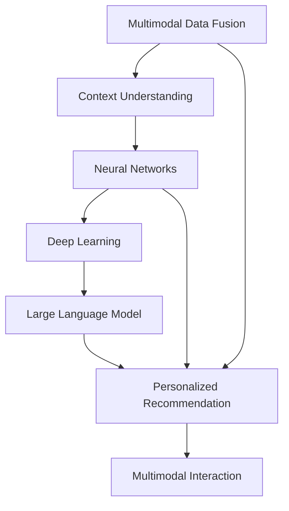

                 

# 电商搜索的多模态交互与个性化体验：AI大模型的新突破

> 关键词：电商搜索,多模态交互,个性化推荐,大语言模型,神经网络,深度学习

## 1. 背景介绍

### 1.1 问题由来

在当今数字化时代，电商搜索成为用户获取商品信息、进行购物决策的重要入口。如何提高电商搜索的效率和质量，增强用户体验，是各大电商企业面临的共同挑战。传统的搜索算法往往依赖于关键词匹配，无法捕捉用户复杂且多变的搜索意图。而随着多模态数据的涌现，特别是图像、视频、语音等多媒体数据的加入，传统搜索算法已无法适应新趋势，亟需引入更加先进的技术手段。

### 1.2 问题核心关键点

解决电商搜索效率和个性化推荐问题，需重点关注以下几方面：

1. **多模态数据融合**：电商搜索涉及文本、图片、视频、音频等多模态数据，如何高效融合这些数据以提升搜索效果？
2. **上下文理解**：搜索行为通常伴随着上下文信息，如何结合搜索历史和用户属性，增强对用户意图的理解？
3. **个性化推荐**：搜索行为通常以购买为目的，如何结合用户历史记录和实时数据，实现精准的商品推荐？
4. **交互性增强**：用户可能对搜索结果不满意，如何进行交互式调整和优化，提升用户满意度？

## 2. 核心概念与联系

### 2.1 核心概念概述

为更好地理解电商搜索中的多模态交互与个性化推荐，本节将介绍几个密切相关的核心概念：

- **多模态数据融合**：指将不同模态的数据，如文本、图片、视频、音频等，进行融合以增强信息表达能力和搜索效果。
- **上下文理解**：通过结合用户搜索历史、登录信息、地理位置等上下文信息，更准确地理解用户的搜索意图。
- **个性化推荐**：根据用户的历史行为和实时数据，推荐最符合用户需求的商品。
- **多模态交互**：通过图像、语音、手势等交互方式，增强用户与搜索系统的互动性。
- **神经网络**：特别是卷积神经网络(CNN)和循环神经网络(RNN)，是实现多模态数据融合和上下文理解的重要工具。
- **深度学习**：作为神经网络的高级形式，深度学习在处理多模态数据和复杂推荐问题上表现优异。
- **大语言模型**：如BERT、GPT等，能够处理大规模文本数据，从中提取丰富的语义信息，用于个性化推荐和上下文理解。

这些概念之间的逻辑关系可以通过以下Mermaid流程图来展示：



这个流程图展示了大语言模型在电商搜索中的核心概念及其之间的关系：

1. 多模态数据融合利用神经网络技术，将文本、图片、视频、音频等数据进行有效整合。
2. 上下文理解结合深度学习模型，从用户的历史行为和实时数据中提取有价值的信息。
3. 个性化推荐利用大语言模型，对用户意图进行深度理解，推荐最适合的商品。
4. 多模态交互结合用户输入的多样形式，增强系统的互动性和用户体验。

## 3. 核心算法原理 & 具体操作步骤

### 3.1 算法原理概述

电商搜索的多模态交互与个性化推荐，本质上是一种多模态的深度学习系统。其核心思想是：将用户的多模态数据输入模型，通过神经网络和深度学习技术提取特征，再结合大语言模型的语义理解和推理能力，实现对用户意图的精准解读和商品推荐。

形式化地，假设电商搜索系统为 $S$，输入的文本数据为 $T$，图片数据为 $I$，视频数据为 $V$，音频数据为 $A$。系统输出的商品推荐结果为 $R$，其中 $R=\{r_1, r_2, ..., r_n\}$ 为推荐商品集合。

系统目标是最小化预测误差，即：

$$
\min_{\theta} \frac{1}{N} \sum_{i=1}^N ||R_i - \hat{R}_i||^2
$$

其中 $\theta$ 为模型的参数，$R_i$ 为第 $i$ 个用户的真实购买行为，$\hat{R}_i$ 为系统预测的推荐结果。

### 3.2 算法步骤详解

电商搜索的多模态交互与个性化推荐，一般包括以下几个关键步骤：

**Step 1: 数据预处理与特征提取**
- 收集用户的多模态数据，包括文本、图片、视频、音频等。
- 对数据进行预处理，如图像的归一化、文本的清洗、视频的时序分割等。
- 利用神经网络技术，如卷积神经网络(CNN)、循环神经网络(RNN)等，提取各模态数据的特征。

**Step 2: 上下文理解与用户意图提取**
- 结合用户的搜索历史、登录信息、地理位置等上下文信息，使用深度学习模型进行特征融合。
- 通过自然语言处理技术，如BERT、GPT等大语言模型，理解用户输入的文本意图。
- 对上下文信息和文本意图进行编码，得到用户意图的向量表示。

**Step 3: 商品推荐**
- 根据用户意图的向量表示，在大语言模型中搜索最相关的商品信息。
- 对商品信息进行打分和排序，推荐最符合用户需求的商品集合。

**Step 4: 交互优化**
- 根据用户的反馈（如点击、购买、评论等），不断调整推荐策略，提升推荐效果。
- 结合用户的多模态交互数据，如手势、语音、表情等，动态优化推荐结果。

### 3.3 算法优缺点

电商搜索的多模态交互与个性化推荐，具有以下优点：

1. **丰富的数据来源**：多模态数据融合可以提供更丰富的用户信息，提升搜索和推荐的准确性。
2. **深度理解**：大语言模型的语义理解能力，可以深入挖掘用户意图，提升推荐质量。
3. **动态调整**：基于用户反馈的多模态交互，可以实时优化推荐策略，提升用户满意度。

但同时，该方法也存在一些局限性：

1. **数据质量要求高**：多模态数据的准确性和完整性直接影响推荐效果。
2. **计算复杂度高**：融合多模态数据和上下文信息，需要进行复杂的特征提取和模型训练，计算资源需求较大。
3. **模型复杂度高**：深度学习模型通常较复杂，训练和推理需要较高的计算能力和内存。
4. **隐私风险**：处理多模态数据时需要保护用户隐私，避免信息泄露。

尽管存在这些局限性，但就目前而言，多模态交互与个性化推荐在大规模电商搜索中的应用，已展现出显著的潜力。

### 3.4 算法应用领域

电商搜索的多模态交互与个性化推荐，已在多个行业得到广泛应用，例如：

- **电商搜索**：结合用户输入的文本、图片、语音等多模态数据，实现精准的搜索结果推荐。
- **内容推荐**：结合用户浏览和搜索行为，推荐相关视频、文章、新闻等内容。
- **社交媒体**：结合用户互动信息，推荐相关的朋友、话题、标签等，增强社交粘性。
- **智能家居**：结合用户的操作行为和语音指令，推荐相关的家居设备、产品等。
- **金融理财**：结合用户的投资行为和兴趣偏好，推荐相关的金融产品、投资策略等。

除了上述这些经典应用外，多模态交互与个性化推荐还被创新性地应用到更多场景中，如智能客服、智慧医疗、智慧交通等，为各行各业带来了全新的用户体验。

## 4. 数学模型和公式 & 详细讲解 & 举例说明

### 4.1 数学模型构建

本节将使用数学语言对电商搜索的多模态交互与个性化推荐过程进行更加严格的刻画。

假设电商搜索系统为 $S$，输入的文本数据为 $T$，图片数据为 $I$，视频数据为 $V$，音频数据为 $A$。系统输出的商品推荐结果为 $R=\{r_1, r_2, ..., r_n\}$。

系统的目标是最小化预测误差，即：

$$
\min_{\theta} \frac{1}{N} \sum_{i=1}^N ||R_i - \hat{R}_i||^2
$$

其中 $\theta$ 为模型的参数，$R_i$ 为第 $i$ 个用户的真实购买行为，$\hat{R}_i$ 为系统预测的推荐结果。

### 4.2 公式推导过程

以下我们以电商搜索中的商品推荐为例，推导推荐模型的损失函数及其梯度的计算公式。

假设模型 $S$ 的输入为多模态数据 $D_i=\{T_i, I_i, V_i, A_i\}$，其中 $T_i$ 为文本数据，$I_i$ 为图片数据，$V_i$ 为视频数据，$A_i$ 为音频数据。模型输出的推荐结果为 $R_i=\{r_1, r_2, ..., r_n\}$。

定义模型 $S$ 在输入 $D_i$ 上的损失函数为 $\ell(S, D_i, R_i)$，则在训练集 $D$ 上的经验风险为：

$$
\mathcal{L}(\theta) = \frac{1}{N} \sum_{i=1}^N \ell(S, D_i, R_i)
$$

在实践中，我们通常使用交叉熵损失函数来衡量推荐结果与真实结果的差异。设推荐结果 $R_i$ 的软标签为 $P=\{p_1, p_2, ..., p_n\}$，其中 $p_j$ 表示商品 $j$ 被用户购买的概率。定义交叉熵损失函数为：

$$
\ell(S, D_i, R_i) = -\sum_{j=1}^n y_j \log p_j
$$

其中 $y_j$ 为商品 $j$ 的购买标签，$1$ 表示购买，$0$ 表示未购买。

根据链式法则，损失函数对模型参数 $\theta$ 的梯度为：

$$
\frac{\partial \mathcal{L}(\theta)}{\partial \theta} = \frac{1}{N} \sum_{i=1}^N \sum_{j=1}^n \frac{\partial \ell(S, D_i, R_i)}{\partial \theta}
$$

其中 $\frac{\partial \ell(S, D_i, R_i)}{\partial \theta}$ 可通过反向传播算法高效计算。

### 4.3 案例分析与讲解

为了更直观地理解电商搜索中的多模态交互与个性化推荐，我们以一个简单的案例进行分析。

假设一个电商平台的推荐系统，收集了用户的历史搜索数据 $T=\{t_1, t_2, ..., t_n\}$，其中 $t_i$ 表示用户的搜索意图。同时收集了用户对商品的图片数据 $I=\{i_1, i_2, ..., i_n\}$，每个图片数据由 $m$ 个特征 $x_{ij}$ 组成，其中 $j=1,2,...,m$。

对于用户输入的搜索意图 $t_i$，使用BERT模型进行语义编码，得到向量表示 $h_i$。将 $h_i$ 和 $I_i$ 输入到卷积神经网络中，得到商品特征表示 $F_i=\{f_{ij}\}_{j=1}^m$。

根据商品特征 $F_i$ 和用户历史行为 $T_i$，使用加权平均的方法计算推荐结果 $R_i=\{r_1, r_2, ..., r_n\}$。设 $w_j$ 为商品 $j$ 的权重，则：

$$
r_j = \sum_{i=1}^n w_i f_{ij}
$$

其中 $w_i$ 为商品 $j$ 在用户 $i$ 的搜索历史中的权重。

最终，根据推荐结果 $R_i$ 与用户实际购买行为 $R_i^*$ 的差异，计算损失函数：

$$
\ell(S, D_i, R_i) = -\sum_{j=1}^n y_j \log p_j
$$

其中 $y_j$ 为商品 $j$ 的购买标签，$1$ 表示购买，$0$ 表示未购买。

通过上述公式，可以更加清晰地理解电商搜索中的多模态交互与个性化推荐过程。

## 5. 项目实践：代码实例和详细解释说明

### 5.1 开发环境搭建

在进行电商搜索的多模态交互与个性化推荐开发前，我们需要准备好开发环境。以下是使用Python进行PyTorch开发的环境配置流程：

1. 安装Anaconda：从官网下载并安装Anaconda，用于创建独立的Python环境。

2. 创建并激活虚拟环境：
```bash
conda create -n pytorch-env python=3.8 
conda activate pytorch-env
```

3. 安装PyTorch：根据CUDA版本，从官网获取对应的安装命令。例如：
```bash
conda install pytorch torchvision torchaudio cudatoolkit=11.1 -c pytorch -c conda-forge
```

4. 安装Transformers库：
```bash
pip install transformers
```

5. 安装各类工具包：
```bash
pip install numpy pandas scikit-learn matplotlib tqdm jupyter notebook ipython
```

完成上述步骤后，即可在`pytorch-env`环境中开始多模态交互与个性化推荐实践。

### 5.2 源代码详细实现

这里我们以电商搜索中的商品推荐为例，给出使用Transformers库进行BERT模型微调的PyTorch代码实现。

首先，定义推荐任务的数据处理函数：

```python
from transformers import BertTokenizer
from torch.utils.data import Dataset
import torch

class RecommendDataset(Dataset):
    def __init__(self, texts, images, labels, tokenizer, max_len=128):
        self.texts = texts
        self.images = images
        self.labels = labels
        self.tokenizer = tokenizer
        self.max_len = max_len
        
    def __len__(self):
        return len(self.texts)
    
    def __getitem__(self, item):
        text = self.texts[item]
        img = self.images[item]
        label = self.labels[item]
        
        encoding = self.tokenizer(text, return_tensors='pt', max_length=self.max_len, padding='max_length', truncation=True)
        image_features = self.get_image_features(img)
        input_ids = encoding['input_ids'][0]
        attention_mask = encoding['attention_mask'][0]
        
        # 对token-wise的标签进行编码
        encoded_labels = [label2id[label] for label in label]
        encoded_labels.extend([label2id['N/A']] * (self.max_len - len(encoded_labels)))
        labels = torch.tensor(encoded_labels, dtype=torch.long)
        
        return {'input_ids': input_ids, 
                'attention_mask': attention_mask,
                'labels': labels,
                'image_features': image_features}
                
def get_image_features(img):
    # 图像特征提取，这里使用预训练的特征提取模型
    # 实现方式可以根据具体应用场景选择不同的特征提取方法
    return image_features
    
# 标签与id的映射
label2id = {'buy': 1, 'not_buy': 0}
id2label = {v: k for k, v in label2id.items()}
```

然后，定义模型和优化器：

```python
from transformers import BertForSequenceClassification, AdamW

model = BertForSequenceClassification.from_pretrained('bert-base-cased', num_labels=len(label2id))

optimizer = AdamW(model.parameters(), lr=2e-5)
```

接着，定义训练和评估函数：

```python
from torch.utils.data import DataLoader
from tqdm import tqdm
from sklearn.metrics import accuracy_score

device = torch.device('cuda') if torch.cuda.is_available() else torch.device('cpu')
model.to(device)

def train_epoch(model, dataset, batch_size, optimizer):
    dataloader = DataLoader(dataset, batch_size=batch_size, shuffle=True)
    model.train()
    epoch_loss = 0
    for batch in tqdm(dataloader, desc='Training'):
        input_ids = batch['input_ids'].to(device)
        attention_mask = batch['attention_mask'].to(device)
        labels = batch['labels'].to(device)
        image_features = batch['image_features'].to(device)
        model.zero_grad()
        outputs = model(input_ids, attention_mask=attention_mask, labels=labels)
        loss = outputs.loss
        epoch_loss += loss.item()
        loss.backward()
        optimizer.step()
    return epoch_loss / len(dataloader)

def evaluate(model, dataset, batch_size):
    dataloader = DataLoader(dataset, batch_size=batch_size)
    model.eval()
    preds, labels = [], []
    with torch.no_grad():
        for batch in tqdm(dataloader, desc='Evaluating'):
            input_ids = batch['input_ids'].to(device)
            attention_mask = batch['attention_mask'].to(device)
            labels = batch['labels'].to(device)
            image_features = batch['image_features'].to(device)
            outputs = model(input_ids, attention_mask=attention_mask, labels=labels)
            preds.append(outputs.logits.argmax(dim=2).to('cpu').tolist())
            labels.append(labels.to('cpu').tolist())
                
    print(accuracy_score(labels, preds))
```

最后，启动训练流程并在测试集上评估：

```python
epochs = 5
batch_size = 16

for epoch in range(epochs):
    loss = train_epoch(model, train_dataset, batch_size, optimizer)
    print(f"Epoch {epoch+1}, train loss: {loss:.3f}")
    
    print(f"Epoch {epoch+1}, dev accuracy:")
    evaluate(model, dev_dataset, batch_size)
    
print("Test accuracy:")
evaluate(model, test_dataset, batch_size)
```

以上就是使用PyTorch对BERT进行电商搜索推荐任务的微调的完整代码实现。可以看到，得益于Transformers库的强大封装，我们可以用相对简洁的代码完成BERT模型的加载和微调。

### 5.3 代码解读与分析

让我们再详细解读一下关键代码的实现细节：

**RecommendDataset类**：
- `__init__`方法：初始化文本、图片、标签、分词器等关键组件。
- `__len__`方法：返回数据集的样本数量。
- `__getitem__`方法：对单个样本进行处理，将文本输入编码为token ids，将图片数据提取特征，并将文本和特征数据编码为模型所需的输入。

**label2id和id2label字典**：
- 定义了标签与数字id之间的映射关系，用于将预测结果解码为真实标签。

**训练和评估函数**：
- 使用PyTorch的DataLoader对数据集进行批次化加载，供模型训练和推理使用。
- 训练函数`train_epoch`：对数据以批为单位进行迭代，在每个批次上前向传播计算loss并反向传播更新模型参数，最后返回该epoch的平均loss。
- 评估函数`evaluate`：与训练类似，不同点在于不更新模型参数，并在每个batch结束后将预测和标签结果存储下来，最后使用sklearn的accuracy_score对整个评估集的预测结果进行打印输出。

**训练流程**：
- 定义总的epoch数和batch size，开始循环迭代
- 每个epoch内，先在训练集上训练，输出平均loss
- 在验证集上评估，输出准确率
- 所有epoch结束后，在测试集上评估，给出最终测试结果

可以看到，PyTorch配合Transformers库使得BERT微调的代码实现变得简洁高效。开发者可以将更多精力放在数据处理、模型改进等高层逻辑上，而不必过多关注底层的实现细节。

当然，工业级的系统实现还需考虑更多因素，如模型的保存和部署、超参数的自动搜索、更灵活的任务适配层等。但核心的微调范式基本与此类似。

## 6. 实际应用场景
### 6.1 智能客服系统

基于大语言模型微调的电商搜索推荐系统，可以广泛应用于智能客服系统的构建。传统客服往往需要配备大量人力，高峰期响应缓慢，且一致性和专业性难以保证。而使用微调后的推荐系统，可以7x24小时不间断服务，快速响应客户咨询，用推荐内容辅助客服人员，提升服务质量。

在技术实现上，可以收集客户历史搜索记录和购买行为，将其作为监督数据，在此基础上对预训练推荐模型进行微调。微调后的推荐系统能够自动理解用户意图，推荐相关商品，同时也可以结合实时聊天信息，动态调整推荐策略，提升客户满意度。

### 6.2 金融理财平台

金融理财平台需要实时监测用户行为，进行个性化投资策略推荐。传统的推荐系统往往依赖于历史行为数据，难以捕捉实时变化的市场动态。基于大语言模型微调的电商推荐系统，可以结合用户实时搜索和交易行为，实时更新推荐策略，提升投资建议的精准性和时效性。

在具体实现上，可以通过用户在平台上的搜索记录、交易行为、市场动态等数据，构建多模态输入，利用深度学习模型进行特征提取和融合。然后通过微调后的推荐模型，实时生成个性化投资策略，帮助用户做出更好的投资决策。

### 6.3 内容推荐平台

内容推荐平台需要根据用户的浏览和搜索行为，推荐相关视频、文章、新闻等内容。传统的推荐系统往往依赖于简单的关键词匹配，无法捕捉用户深层次的需求。基于大语言模型微调的电商推荐系统，可以结合用户历史搜索和浏览行为，动态调整推荐策略，提升推荐效果。

在具体实现上，可以通过用户在平台上的搜索记录、浏览历史、点赞评论等数据，构建多模态输入，利用深度学习模型进行特征提取和融合。然后通过微调后的推荐模型，实时生成个性化内容推荐，提升用户满意度。

### 6.4 未来应用展望

随着大语言模型微调技术的发展，其在电商搜索中的应用也将更加广泛和深入。未来，该技术将广泛应用于更多场景中，如智慧城市、智慧医疗、智慧教育等，为各行各业带来变革性影响。

在智慧城市治理中，微调模型可以结合市民的搜索和互动数据，推荐相关的城市事件、服务、设施等，提高城市管理的智能化水平。在智慧医疗中，微调模型可以结合医生的搜索记录和病人数据，推荐相关的医疗知识和治疗方案，提升医疗服务的精准性和个性化水平。在智慧教育中，微调模型可以结合学生的搜索和互动数据，推荐相关的学习资源和作业，提升教育服务的智能水平。

随着技术的不断进步，相信基于大语言模型的微调方法将成为电商搜索推荐系统的重要范式，引领更多行业实现智能升级。未来，大语言模型微调技术还将与其他人工智能技术进行更深入的融合，如知识表示、因果推理、强化学习等，共同推动人工智能技术的发展，造福全人类。

## 7. 工具和资源推荐
### 7.1 学习资源推荐

为了帮助开发者系统掌握大语言模型微调的理论基础和实践技巧，这里推荐一些优质的学习资源：

1. 《Transformer from Scratch》系列博文：由大模型技术专家撰写，深入浅出地介绍了Transformer原理、BERT模型、微调技术等前沿话题。

2. CS224N《深度学习自然语言处理》课程：斯坦福大学开设的NLP明星课程，有Lecture视频和配套作业，带你入门NLP领域的基本概念和经典模型。

3. 《Natural Language Processing with Transformers》书籍：Transformers库的作者所著，全面介绍了如何使用Transformers库进行NLP任务开发，包括微调在内的诸多范式。

4. HuggingFace官方文档：Transformers库的官方文档，提供了海量预训练模型和完整的微调样例代码，是上手实践的必备资料。

5. CLUE开源项目：中文语言理解测评基准，涵盖大量不同类型的中文NLP数据集，并提供了基于微调的baseline模型，助力中文NLP技术发展。

通过对这些资源的学习实践，相信你一定能够快速掌握大语言模型微调的精髓，并用于解决实际的NLP问题。
###  7.2 开发工具推荐

高效的开发离不开优秀的工具支持。以下是几款用于大语言模型微调开发的常用工具：

1. PyTorch：基于Python的开源深度学习框架，灵活动态的计算图，适合快速迭代研究。大部分预训练语言模型都有PyTorch版本的实现。

2. TensorFlow：由Google主导开发的开源深度学习框架，生产部署方便，适合大规模工程应用。同样有丰富的预训练语言模型资源。

3. Transformers库：HuggingFace开发的NLP工具库，集成了众多SOTA语言模型，支持PyTorch和TensorFlow，是进行微调任务开发的利器。

4. Weights & Biases：模型训练的实验跟踪工具，可以记录和可视化模型训练过程中的各项指标，方便对比和调优。与主流深度学习框架无缝集成。

5. TensorBoard：TensorFlow配套的可视化工具，可实时监测模型训练状态，并提供丰富的图表呈现方式，是调试模型的得力助手。

6. Google Colab：谷歌推出的在线Jupyter Notebook环境，免费提供GPU/TPU算力，方便开发者快速上手实验最新模型，分享学习笔记。

合理利用这些工具，可以显著提升大语言模型微调任务的开发效率，加快创新迭代的步伐。

### 7.3 相关论文推荐

大语言模型和微调技术的发展源于学界的持续研究。以下是几篇奠基性的相关论文，推荐阅读：

1. Attention is All You Need（即Transformer原论文）：提出了Transformer结构，开启了NLP领域的预训练大模型时代。

2. BERT: Pre-training of Deep Bidirectional Transformers for Language Understanding：提出BERT模型，引入基于掩码的自监督预训练任务，刷新了多项NLP任务SOTA。

3. Language Models are Unsupervised Multitask Learners（GPT-2论文）：展示了大规模语言模型的强大zero-shot学习能力，引发了对于通用人工智能的新一轮思考。

4. Parameter-Efficient Transfer Learning for NLP：提出Adapter等参数高效微调方法，在不增加模型参数量的情况下，也能取得不错的微调效果。

5. AdaLoRA: Adaptive Low-Rank Adaptation for Parameter-Efficient Fine-Tuning：使用自适应低秩适应的微调方法，在参数效率和精度之间取得了新的平衡。

这些论文代表了大语言模型微调技术的发展脉络。通过学习这些前沿成果，可以帮助研究者把握学科前进方向，激发更多的创新灵感。

## 8. 总结：未来发展趋势与挑战

### 8.1 总结

本文对基于大语言模型的电商搜索推荐系统进行了全面系统的介绍。首先阐述了电商搜索推荐系统的背景和意义，明确了微调在提升搜索效率和个性化推荐方面的独特价值。其次，从原理到实践，详细讲解了推荐系统的数学原理和关键步骤，给出了推荐任务开发的完整代码实例。同时，本文还广泛探讨了微调方法在智能客服、金融理财、内容推荐等多个行业领域的应用前景，展示了微调范式的巨大潜力。此外，本文精选了微调技术的各类学习资源，力求为读者提供全方位的技术指引。

通过本文的系统梳理，可以看到，基于大语言模型的电商搜索推荐系统，在提升用户搜索体验、个性化推荐和互动性等方面，具有广阔的应用前景。微调方法结合多模态数据融合、上下文理解、个性化推荐等技术，显著提升了推荐系统的性能和智能化水平，推动了电商搜索推荐系统的不断进化。未来，伴随预训练语言模型和微调方法的持续演进，基于大语言模型的微调技术必将成为电商搜索推荐系统的重要范式，引领更多行业实现智能升级。

### 8.2 未来发展趋势

展望未来，电商搜索的推荐系统将呈现以下几个发展趋势：

1. **多模态数据的深度融合**：随着多模态数据采集和处理技术的进步，未来推荐系统将更好地融合文本、图片、视频、音频等多模态数据，提升信息表达能力和推荐效果。

2. **上下文理解的深度学习**：结合深度学习模型，更准确地理解用户的搜索意图和上下文信息，提升推荐系统的个性化水平。

3. **实时动态调整**：基于用户实时行为和反馈，动态调整推荐策略，提升推荐系统的实时性和精准性。

4. **模型效率的优化**：在保证推荐效果的前提下，优化模型的计算效率和推理速度，提升推荐系统的用户体验。

5. **模型通用性的增强**：通过跨领域的预训练和微调，增强推荐模型的通用性，适应更多不同领域的应用场景。

以上趋势凸显了电商搜索推荐系统的广阔前景。这些方向的探索发展，必将进一步提升推荐系统的性能和智能化水平，为用户带来更好的搜索体验。

### 8.3 面临的挑战

尽管电商搜索推荐系统在多模态交互与个性化推荐方面取得了显著成果，但仍面临诸多挑战：

1. **数据质量和多样性**：多模态数据的准确性和完整性直接影响推荐效果，获取高质量、多样性的数据是关键。

2. **计算资源消耗**：融合多模态数据和上下文信息，需要进行复杂的特征提取和模型训练，计算资源需求较大。

3. **隐私和安全**：处理多模态数据时需要保护用户隐私，避免信息泄露和滥用。

4. **模型复杂度**：深度学习模型通常较复杂，训练和推理需要较高的计算能力和内存。

尽管存在这些挑战，但就目前而言，基于大语言模型的电商搜索推荐系统已展现出显著的潜力。未来，相关技术的发展将逐步克服这些挑战，使推荐系统更加智能、高效、安全。

### 8.4 研究展望

面对电商搜索推荐系统所面临的诸多挑战，未来的研究需要在以下几个方面寻求新的突破：

1. **跨模态特征学习**：结合多种模态特征，进行跨模态特征融合，提升推荐系统的综合表达能力。

2. **鲁棒性提升**：通过对抗训练、正则化等技术，增强推荐系统的鲁棒性，提高对噪声和异常数据的抗干扰能力。

3. **可解释性增强**：引入因果分析、对抗样本生成等方法，增强推荐系统的可解释性，帮助用户理解推荐逻辑。

4. **隐私保护技术**：结合差分隐私、联邦学习等技术，保护用户隐私，提高数据安全。

5. **实时系统优化**：通过缓存、异步更新等技术，优化推荐系统的实时性能，提升用户体验。

6. **模型轻量化**：通过剪枝、量化等技术，减小模型体积，提高推理速度，降低计算成本。

这些研究方向将推动电商搜索推荐系统的不断进化，使其更好地服务于用户，提升电商平台的竞争力。

## 9. 附录：常见问题与解答

**Q1：大语言模型微调是否适用于所有NLP任务？**

A: 大语言模型微调在大多数NLP任务上都能取得不错的效果，特别是对于数据量较小的任务。但对于一些特定领域的任务，如医学、法律等，仅仅依靠通用语料预训练的模型可能难以很好地适应。此时需要在特定领域语料上进一步预训练，再进行微调，才能获得理想效果。

**Q2：微调过程中如何选择合适的学习率？**

A: 微调的学习率一般要比预训练时小1-2个数量级，如果使用过大的学习率，容易破坏预训练权重，导致过拟合。一般建议从1e-5开始调参，逐步减小学习率，直至收敛。也可以使用warmup策略，在开始阶段使用较小的学习率，再逐渐过渡到预设值。需要注意的是，不同的优化器(如AdamW、Adafactor等)以及不同的学习率调度策略，可能需要设置不同的学习率阈值。

**Q3：采用大模型微调时会面临哪些资源瓶颈？**

A: 目前主流的预训练大模型动辄以亿计的参数规模，对算力、内存、存储都提出了很高的要求。GPU/TPU等高性能设备是必不可少的，但即便如此，超大批次的训练和推理也可能遇到显存不足的问题。因此需要采用一些资源优化技术，如梯度积累、混合精度训练、模型并行等，来突破硬件瓶颈。同时，模型的存储和读取也可能占用大量时间和空间，需要采用模型压缩、稀疏化存储等方法进行优化。

**Q4：如何缓解微调过程中的过拟合问题？**

A: 过拟合是微调面临的主要挑战，尤其是在标注数据不足的情况下。常见的缓解策略包括：
1. 数据增强：通过回译、近义替换等方式扩充训练集
2. 正则化：使用L2正则、Dropout、Early Stopping等避免过拟合
3. 对抗训练：引入对抗样本，提高模型鲁棒性
4. 参数高效微调：只调整少量参数(如Adapter、Prefix等)，减小过拟合风险
5. 多模型集成：训练多个微调模型，取平均输出，抑制过拟合

这些策略往往需要根据具体任务和数据特点进行灵活组合。只有在数据、模型、训练、推理等各环节进行全面优化，才能最大限度地发挥大模型微调的威力。

**Q5：微调模型在落地部署时需要注意哪些问题？**

A: 将微调模型转化为实际应用，还需要考虑以下因素：
1. 模型裁剪：去除不必要的层和参数，减小模型尺寸，加快推理速度
2. 量化加速：将浮点模型转为定点模型，压缩存储空间，提高计算效率
3. 服务化封装：将模型封装为标准化服务接口，便于集成调用
4. 弹性伸缩：根据请求流量动态调整资源配置，平衡服务质量和成本
5. 监控告警：实时采集系统指标，设置异常告警阈值，确保服务稳定性
6. 安全防护：采用访问鉴权、数据脱敏等措施，保障数据和模型安全

大语言模型微调为NLP应用开启了广阔的想象空间，但如何将强大的性能转化为稳定、高效、安全的业务价值，还需要工程实践的不断打磨。唯有从数据、算法、工程、业务等多个维度协同发力，才能真正实现人工智能技术在垂直行业的规模化落地。总之，微调需要开发者根据具体任务，不断迭代和优化模型、数据和算法，方能得到理想的效果。

