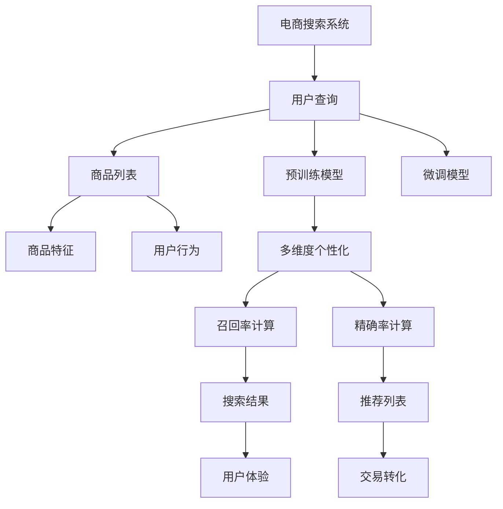

                 

# 电商搜索的多维度个性化：AI大模型的新突破

## 1. 背景介绍

随着电子商务平台的迅猛发展，电商搜索系统已成为了用户与产品互动的桥梁，用户获取商品信息的需求日益提升。电商平台不仅要能快速、准确地匹配用户查询与商品信息，还需在搜索结果中融入个性化推荐，提升用户体验。

由于电商领域海量用户行为数据的存在，使得利用深度学习技术进行电商搜索个性化推荐成为了可能。AI大模型，特别是基于预训练-微调的Transformer模型，逐渐成为电商搜索系统中的重要技术支撑。

## 2. 核心概念与联系

### 2.1 核心概念概述

以下我们介绍几个核心概念及其之间的联系：

- **电商搜索**：用户输入搜索词，电商平台通过检索匹配算法，推荐符合用户需求的产品列表。
- **大模型**：以Transformer为代表，通过大规模语料预训练学习语言表示，具备强大的理解、生成能力。
- **预训练**：在无标签数据上进行自监督学习，构建通用语言表示。
- **微调**：在预训练模型的基础上，利用少量标注数据进行有监督优化，适配特定任务。
- **多维度个性化**：结合用户行为、商品特征、搜索词等多个维度的信息，实现更加精准的推荐。
- **召回率**：搜索结果与用户查询的匹配度，直接影响用户体验。
- **精确率**：搜索结果的准确性，确保推荐产品符合用户真实需求。

这些概念构成了电商搜索推荐系统的重要基础，通过预训练和微调，构建通用的语言理解能力，结合多维度信息，实现多层次的个性化推荐，进而提升用户体验和电商平台的转化率。

### 2.2 核心概念原理和架构的 Mermaid 流程图



以上图表展示了大模型在电商搜索中的作用，预训练模型作为基础，微调模型适配电商搜索任务，结合商品特征和用户行为，实现多维度个性化，并通过召回率和精确率计算，提供最佳推荐。

## 3. 核心算法原理 & 具体操作步骤

### 3.1 算法原理概述

电商搜索的多维度个性化推荐，通过预训练-微调框架，在少量标注数据上微调大模型，实现个性化推荐。其核心算法原理可以概括为以下几步：

1. **预训练阶段**：使用大规模无标签文本数据进行自监督预训练，学习语言表示。
2. **微调阶段**：对预训练模型进行电商搜索任务的微调，学习用户行为、商品特征、搜索词等的多维度信息。
3. **推荐阶段**：结合多维度个性化信息，通过召回率和精确率计算，生成推荐列表。

### 3.2 算法步骤详解

**Step 1: 准备预训练模型和数据集**

- 选择合适的预训练语言模型，如BERT、GPT等。
- 收集电商搜索的标注数据集，包括商品列表、用户行为日志等。

**Step 2: 任务适配层设计**

- 添加电商搜索任务的适配层，包括商品特征向量嵌入、用户行为特征嵌入等。
- 定义分类任务，如商品相关度评分，选择交叉熵损失函数。

**Step 3: 微调超参数设置**

- 选择优化器如AdamW，设置学习率、批大小等。
- 设置正则化技术，如L2正则、Dropout。

**Step 4: 梯度训练**

- 分批次输入训练数据，前向传播计算损失函数。
- 反向传播计算梯度，更新模型参数。
- 周期性评估验证集性能，触发Early Stopping。

**Step 5: 推荐系统构建**

- 根据微调模型，计算召回率和精确率。
- 结合用户搜索词，生成推荐列表。
- 部署推荐系统，实现实时推荐。

### 3.3 算法优缺点

#### 优点

- **高效适配**：大模型通过预训练和微调，可以快速适应电商搜索任务。
- **泛化能力强**：在少量标注数据上也能学习到有效的用户行为和商品特征表示。
- **多维度结合**：结合用户行为、商品特征、搜索词等多个维度的信息，提供个性化推荐。

#### 缺点

- **数据依赖**：需要大量的标注数据进行微调。
- **计算开销大**：大模型参数量大，计算资源需求高。
- **模型复杂**：推荐系统涉及的组件众多，难以调试和优化。

### 3.4 算法应用领域

电商搜索的多维度个性化推荐，不仅在电商平台应用广泛，还在智能客服、社交媒体、广告投放等多个领域得到应用。例如：

- **电商平台**：通过个性化推荐，提高商品曝光率和转化率。
- **智能客服**：通过推荐商品、解决用户问题，提升客户满意度。
- **社交媒体**：通过推荐内容，提高用户黏性和平台活跃度。
- **广告投放**：通过推荐广告，提高广告点击率和转化率。

## 4. 数学模型和公式 & 详细讲解 & 举例说明

### 4.1 数学模型构建

设预训练语言模型为 $M_{\theta}$，其中 $\theta$ 为预训练得到的模型参数。电商搜索任务为二分类任务，即判断商品与用户查询的匹配度。任务的目标是最小化损失函数：

$$
\mathcal{L}(\theta) = -\frac{1}{N}\sum_{i=1}^N (y_i \log M_{\theta}(x_i) + (1-y_i) \log(1-M_{\theta}(x_i)))
$$

其中 $x_i$ 为商品特征，$y_i$ 为标签，$M_{\theta}(x_i)$ 为模型预测的概率。

### 4.2 公式推导过程

在电商搜索任务中，模型的输出层为线性分类器，损失函数为交叉熵损失。其梯度计算公式为：

$$
\frac{\partial \mathcal{L}}{\partial \theta} = -\frac{1}{N}\sum_{i=1}^N \left[ y_i \frac{\partial \log M_{\theta}(x_i)}{\partial \theta} - (1-y_i) \frac{\partial \log(1-M_{\theta}(x_i))}{\partial \theta} \right]
$$

其中 $\frac{\partial \log M_{\theta}(x_i)}{\partial \theta}$ 可通过链式法则和自动微分技术计算。

### 4.3 案例分析与讲解

假设模型 $M_{\theta}$ 在商品特征 $x_i$ 上的输出为 $M_{\theta}(x_i)$，则损失函数的梯度为：

$$
\frac{\partial \mathcal{L}}{\partial \theta} = -\frac{1}{N}\sum_{i=1}^N \left[ y_i \frac{\partial \log M_{\theta}(x_i)}{\partial \theta} - (1-y_i) \frac{\partial \log(1-M_{\theta}(x_i))}{\partial \theta} \right]
$$

在训练过程中，模型参数 $\theta$ 更新如下：

$$
\theta \leftarrow \theta - \eta \frac{\partial \mathcal{L}}{\partial \theta}
$$

其中 $\eta$ 为学习率。通过反向传播和优化算法，最小化损失函数，使模型学习到商品特征和用户查询之间的匹配度。

## 5. 项目实践：代码实例和详细解释说明

### 5.1 开发环境搭建

使用Python和PyTorch搭建电商搜索推荐系统开发环境：

1. 安装Anaconda并创建虚拟环境。
2. 安装PyTorch、transformers等深度学习库。
3. 安装电商推荐系统的相关工具，如Pandas、Numpy、Scikit-Learn等。

### 5.2 源代码详细实现

以电商搜索为例，使用Transformer模型进行微调，实现个性化推荐。

```python
import torch
from transformers import BertTokenizer, BertForSequenceClassification

# 数据预处理
def prepare_data(data_path):
    data = pd.read_csv(data_path)
    tokenizer = BertTokenizer.from_pretrained('bert-base-uncased')
    features = data[['item_name', 'user_browsed', 'search_word']]
    labels = data['match'].apply(lambda x: 1 if x else 0)
    inputs = tokenizer(features['item_name'].tolist(), padding=True, truncation=True, max_length=512)
    return inputs, labels

# 模型构建
def build_model(tokenizer, labels, batch_size):
    model = BertForSequenceClassification.from_pretrained('bert-base-uncased', num_labels=1)
    optimizer = AdamW(model.parameters(), lr=2e-5)
    return model, optimizer

# 模型微调
def fine_tune(model, optimizer, inputs, labels, epochs, batch_size):
    device = torch.device('cuda' if torch.cuda.is_available() else 'cpu')
    model.to(device)
    
    for epoch in range(epochs):
        model.train()
        total_loss = 0
        for batch in tqdm(data_loader):
            inputs, labels = batch.to(device)
            optimizer.zero_grad()
            outputs = model(inputs)
            loss = outputs.loss
            total_loss += loss.item()
            loss.backward()
            optimizer.step()
        print(f'Epoch {epoch+1}, Train Loss: {total_loss/len(data_loader)}')
    
    model.eval()
    with torch.no_grad():
        correct, total = 0, 0
        for batch in data_loader:
            inputs, labels = batch.to(device)
            outputs = model(inputs)
            _, predicted = torch.max(outputs, 1)
            total += labels.size(0)
            correct += (predicted == labels).sum().item()
        print(f'Test Accuracy: {correct/total}')

# 数据加载
def load_data(path, tokenizer, batch_size):
    data = prepare_data(path)
    inputs, labels = data
    inputs = tokenizer(inputs, padding=True, truncation=True, max_length=512, return_tensors='pt')
    data_loader = DataLoader(inputs, labels, batch_size=batch_size, shuffle=True)
    return data_loader

# 运行示例
if __name__ == '__main__':
    data_loader = load_data('data.csv', tokenizer, batch_size=16)
    model, optimizer = build_model(tokenizer, labels, batch_size)
    fine_tune(model, optimizer, inputs, labels, epochs=5, batch_size=16)
```

### 5.3 代码解读与分析

代码实现过程中，数据预处理包括读取数据、分词、创建特征和标签等。模型构建部分使用了BertForSequenceClassification，并定义了AdamW优化器。微调函数通过前向传播、计算损失、反向传播和参数更新实现模型训练。最后，通过评估模型性能，得出模型准确率。

## 6. 实际应用场景

### 6.1 电商搜索个性化推荐

电商搜索个性化推荐是大模型在电商领域的重要应用场景之一。通过微调大模型，结合用户行为、商品特征、搜索词等多个维度信息，生成个性化推荐列表，极大提升用户搜索体验和电商平台的转化率。

以某电商平台为例，通过收集用户浏览历史、购买记录、搜索关键词等数据，构建标注数据集，并使用BERT模型进行微调。微调后的模型能够学习到用户的搜索意图和商品特征，根据用户输入的搜索词，生成相关商品推荐，大幅提高搜索转化率。

### 6.2 智能客服对话

智能客服对话系统同样受益于大模型的微调。通过收集客服对话记录，将问题和最佳答复构建成监督数据，对BERT模型进行微调。微调后的模型能够自动理解用户意图，匹配最合适的答案模板进行回复，极大提升客服效率和用户满意度。

以某电商平台的智能客服为例，通过微调BERT模型，结合用户输入的搜索词和对话历史，生成对话回复。系统不仅能够处理常见问题，还能通过用户行为数据不断优化回答质量，实现更加智能化的客服对话。

### 6.3 广告投放推荐

广告投放推荐是大模型在广告领域的重要应用场景之一。通过微调大模型，结合用户兴趣、搜索历史等数据，生成广告推荐列表，极大提高广告投放的点击率和转化率。

以某在线广告平台为例，通过收集用户浏览记录和搜索关键词，构建标注数据集，并使用BERT模型进行微调。微调后的模型能够学习到用户的兴趣点和搜索习惯，根据用户输入的搜索词，生成相关广告推荐，提升广告投放的ROI。

### 6.4 未来应用展望

未来，电商搜索推荐系统和大模型的结合将更加紧密，进一步拓展应用的深度和广度。以下是对未来应用场景的展望：

- **多模态推荐**：结合视觉、音频等多模态信息，提供更加全面的商品推荐。
- **实时推荐**：通过实时数据更新，动态调整推荐策略，满足用户实时需求。
- **用户行为预测**：通过学习用户行为数据，预测用户未来行为，实现个性化推荐。
- **跨平台推荐**：结合不同平台的商品信息和用户数据，提供跨平台的个性化推荐。

## 7. 工具和资源推荐

### 7.1 学习资源推荐

1. 《深度学习自然语言处理》课程（CS224N）：斯坦福大学开设，涵盖NLP的基本概念和经典模型。
2. 《Natural Language Processing with Transformers》书籍：介绍如何使用Transformers库进行NLP任务开发。
3. HuggingFace官方文档：提供预训练模型和微调样例代码，是学习的最佳实践参考。
4. CLUE开源项目：包含大量中文NLP数据集和微调模型，助力中文NLP技术发展。

### 7.2 开发工具推荐

1. PyTorch：深度学习框架，适合快速迭代研究。
2. TensorFlow：生产部署方便，适合大规模工程应用。
3. Transformers库：提供预训练模型和微调框架，助力模型开发。
4. Weights & Biases：实验跟踪工具，记录和可视化模型训练过程。
5. TensorBoard：可视化工具，实时监测模型训练状态。

### 7.3 相关论文推荐

1. Attention is All You Need：提出Transformer结构，开启预训练大模型时代。
2. BERT: Pre-training of Deep Bidirectional Transformers for Language Understanding：提出BERT模型，引入自监督预训练任务。
3. Parameter-Efficient Transfer Learning for NLP：提出Adapter等参数高效微调方法，减小微调对计算资源的需求。
4. AdaLoRA: Adaptive Low-Rank Adaptation for Parameter-Efficient Fine-Tuning：使用自适应低秩适应的微调方法，平衡参数量和模型性能。
5. Prefix-Tuning: Optimizing Continuous Prompts for Generation：提出基于连续型Prompt的微调范式，提高模型零样本和少样本学习能力。

## 8. 总结：未来发展趋势与挑战

### 8.1 研究成果总结

基于大模型的电商搜索多维度个性化推荐技术，已经显著提高了电商平台的转化率和用户满意度。通过微调预训练模型，结合多维度信息，实现了精准推荐，带来了明显的商业价值。

### 8.2 未来发展趋势

未来电商搜索推荐系统的发展趋势包括：

1. **多模态融合**：结合视觉、音频等多模态信息，提供更加全面的商品推荐。
2. **实时推荐**：通过实时数据更新，动态调整推荐策略，满足用户实时需求。
3. **跨平台推荐**：结合不同平台的商品信息和用户数据，提供跨平台的个性化推荐。
4. **用户行为预测**：通过学习用户行为数据，预测用户未来行为，实现个性化推荐。

### 8.3 面临的挑战

尽管电商搜索推荐系统和大模型结合带来了显著效果，但在落地应用中仍面临以下挑战：

1. **数据隐私**：如何保护用户隐私，防止数据滥用。
2. **模型复杂度**：大模型参数量大，计算资源需求高，如何优化模型结构，降低计算成本。
3. **解释性不足**：模型复杂度高，难以解释其内部工作机制，影响用户信任和接受度。
4. **鲁棒性问题**：模型在面对噪声数据和异常情况时，容易出现误推荐，如何提高模型鲁棒性。

### 8.4 研究展望

未来研究应重点关注以下方向：

1. **参数高效微调**：开发更加参数高效的微调方法，在固定大部分预训练参数的情况下，只更新极少量的任务相关参数。
2. **多模态融合**：结合视觉、音频等多模态信息，提供更加全面的商品推荐。
3. **实时推荐**：通过实时数据更新，动态调整推荐策略，满足用户实时需求。
4. **用户行为预测**：通过学习用户行为数据，预测用户未来行为，实现个性化推荐。

## 9. 附录：常见问题与解答

**Q1: 大模型微调是否适用于所有电商搜索推荐场景？**

A: 大模型微调在电商搜索推荐场景中具有广泛适用性，但需要根据具体场景进行适当调整。例如，对于某些特殊领域的电商推荐，可能需要针对该领域进行预训练，才能取得更好的效果。

**Q2: 电商搜索推荐系统如何保护用户隐私？**

A: 电商搜索推荐系统应遵守数据隐私保护法规，如GDPR等。在数据收集和使用过程中，应明确告知用户，并征得用户同意。同时，需要对数据进行去标识化处理，防止数据泄露和滥用。

**Q3: 如何提高电商搜索推荐系统的鲁棒性？**

A: 可以通过数据增强、对抗训练等方法，提高模型对噪声数据和异常情况的鲁棒性。同时，可以引入更多的监督信号，如商品评分、用户反馈等，进一步提升模型的泛化能力。

**Q4: 电商搜索推荐系统的解释性不足，如何解决？**

A: 可以通过模型的可视化工具，如注意力机制、激活图等，帮助用户理解模型的内部工作机制。此外，可以设计更多的中间层输出，提供更加丰富的模型解释信息，增强用户对模型的信任和接受度。

通过以上详细讨论和分析，我们可以看到，基于大模型的电商搜索推荐系统在实际应用中已经取得了显著的效果，未来还有很大的优化空间和研究方向。随着技术的不断进步，电商搜索推荐系统必将进一步提升用户满意度，推动电商平台的持续发展。

