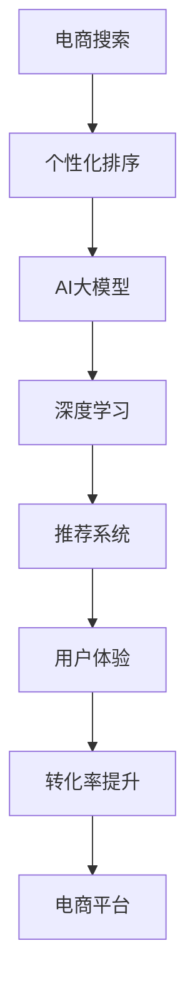

                 

# 电商搜索结果个性化排序：AI大模型的新算法

> 关键词：电商搜索、个性化排序、AI大模型、深度学习、推荐系统、用户体验、转化率提升

## 1. 背景介绍

随着互联网技术的飞速发展和消费者需求的多样化，电商平台的搜索排序系统已经成为直接影响用户购物体验和转化率的重要因素。传统的搜索排序算法依赖于简单的关键词匹配和用户行为记录，无法充分利用海量用户数据和先进的AI技术，导致搜索结果与用户需求不完全匹配，用户体验差，转化率低。

近年来，随着大语言模型（Large Language Model, LLM）和深度学习技术的发展，AI大模型在自然语言处理、视觉识别、语音识别等领域取得了重大突破。将大模型技术应用到电商搜索排序中，能够更加全面地理解用户意图和商品特征，实现个性化、多样化的搜索结果，极大提升电商平台的用户体验和转化率。

## 2. 核心概念与联系

### 2.1 核心概念概述

为了更好地理解如何将大模型技术应用到电商搜索排序中，本节将介绍几个密切相关的核心概念：

- **电商搜索（E-Commerce Search）**：指用户在电商平台输入搜索关键词，获取相关商品信息的场景。通过搜索排序系统将商品呈现给用户，帮助用户快速找到所需商品。

- **个性化排序（Personalized Ranking）**：指在搜索结果中，根据用户的个性化需求和历史行为，对商品进行排序，提升用户点击率和购买率。

- **AI大模型（AI Large Model）**：以自回归（如GPT）或自编码（如BERT）模型为代表的大规模预训练语言模型。通过在海量数据上进行预训练，学习丰富的语言和视觉知识，具备强大的文本和图像理解能力。

- **深度学习（Deep Learning）**：基于多层神经网络的机器学习方法，可以学习并抽象出数据中的复杂特征，用于分类、回归、聚类等任务。

- **推荐系统（Recommender System）**：利用用户行为和商品属性信息，自动推荐用户可能感兴趣的商品的系统。

- **用户体验（User Experience）**：指用户在电商平台使用搜索排序系统的直观感受，包括响应速度、搜索结果的准确性和相关性、页面加载速度等。

- **转化率（Conversion Rate）**：指用户在点击搜索结果后完成购买的比例，是衡量搜索排序系统效果的重要指标。

### 2.2 核心概念原理和架构的 Mermaid 流程图



此图展示了电商搜索排序系统的核心组件和它们之间的联系：

1. **电商搜索**：用户输入搜索关键词，触发搜索请求。
2. **个性化排序**：根据用户历史行为和当前意图，对搜索结果进行排序。
3. **AI大模型**：利用预训练模型理解用户意图和商品特征。
4. **深度学习**：使用机器学习算法对用户和商品数据进行建模，提取特征。
5. **推荐系统**：基于用户历史行为和商品属性，生成推荐结果。
6. **用户体验**：提升搜索排序系统的响应速度、搜索结果的相关性和可读性。
7. **转化率提升**：优化排序算法，提高用户的点击率和购买率。
8. **电商平台**：集成上述技术，构建高性能的电商搜索排序系统。

## 3. 核心算法原理 & 具体操作步骤

### 3.1 算法原理概述

基于大模型的电商搜索结果个性化排序算法，本质上是一个多任务学习的优化过程。其核心思想是：将电商搜索排序问题分解为多个子任务，使用大模型对每个子任务进行训练，综合优化，实现个性化搜索结果。

假设电商搜索系统中有多个商品 $i$，每个商品有一个评分 $r_i$，用户的评分向量为 $u$，搜索关键词为 $q$。个性化排序的目标是最大化预测评分 $r_i$ 与实际评分 $r_i$ 的接近度。

形式化地，假设用户输入搜索关键词 $q$，电商平台对所有商品 $i$ 进行评分预测，预测评分为 $\hat{r}_i$。则个性化排序的目标是最大化预测评分 $\hat{r}_i$ 与实际评分 $r_i$ 的接近度，即：

$$
\max_{\theta} \sum_i r_i \log \hat{r}_i - r_i \log r_i
$$

其中 $\theta$ 为模型参数。

通过梯度下降等优化算法，算法不断更新模型参数 $\theta$，最小化损失函数，使得模型预测的评分与实际评分尽可能接近，从而实现个性化排序。

### 3.2 算法步骤详解

基于大模型的电商搜索结果个性化排序算法通常包括以下几个关键步骤：

**Step 1: 准备数据集**

- 收集电商平台的商品数据和用户数据，包括商品属性、价格、用户历史行为等。
- 对数据进行预处理，如缺失值填充、数据清洗、特征提取等。
- 划分训练集、验证集和测试集，通常采用交叉验证或留一法进行划分。

**Step 2: 设计模型**

- 选择合适的深度学习模型，如卷积神经网络（CNN）、循环神经网络（RNN）、Transformer等，对商品和用户数据进行建模。
- 使用大模型进行特征提取，将用户输入的搜索关键词 $q$ 转化为向量表示 $v_q$，作为模型的输入。
- 设计输出层，通常是回归层或分类层，输出商品的评分或评分排名。

**Step 3: 训练模型**

- 使用训练集数据对模型进行训练，最小化预测评分与实际评分之间的差异。
- 使用验证集评估模型的泛化能力，调整模型参数和超参数。
- 在测试集上评估模型的性能，计算评价指标如准确率、召回率、F1值等。

**Step 4: 部署模型**

- 将训练好的模型部署到电商搜索系统中，作为搜索排序的核心算法。
- 集成其他业务逻辑，如搜索结果展示、用户行为记录等，实现完整的电商搜索排序功能。
- 定期更新模型参数，保持模型的最新性能。

### 3.3 算法优缺点

基于大模型的电商搜索结果个性化排序算法具有以下优点：

- 能够充分利用海量用户和商品数据，提高模型的泛化能力和鲁棒性。
- 可以学习到复杂的用户行为和商品特征，实现更精细化的个性化排序。
- 通过深度学习模型和推荐系统结合，提升搜索结果的相关性和多样性。
- 通过模型优化和特征提取，提升用户的使用体验和转化率。

同时，该算法也存在以下缺点：

- 模型训练和部署对硬件资源要求较高，需要高性能GPU或TPU支持。
- 模型参数较大，需要较大的存储空间和计算资源。
- 模型的解释性较弱，难以直观理解模型的决策过程。
- 数据依赖性强，需要高质量的用户和商品数据才能取得良好效果。

### 3.4 算法应用领域

基于大模型的电商搜索结果个性化排序算法，已经在多个电商平台的搜索排序系统中得到了广泛应用，以下是几个典型应用场景：

- **亚马逊（Amazon）**：亚马逊利用大模型和推荐系统，对用户搜索行为和历史浏览记录进行分析，个性化排序搜索结果，提升用户体验和转化率。
- **淘宝（Alibaba）**：淘宝通过大模型和深度学习技术，对用户行为和商品属性进行建模，实现个性化推荐，提升用户购物体验。
- **京东（JD.com）**：京东使用大模型和自然语言处理技术，分析用户搜索意图和商品特征，优化搜索结果排序，增强用户体验。
- **拼多多（Pinduoduo）**：拼多多利用大模型和深度学习算法，对用户搜索行为进行预测，推荐相关商品，提升用户粘性和购买率。

除了上述应用场景外，基于大模型的电商搜索结果排序算法还应用于其他电商平台的推荐系统、广告定向系统等，极大地提高了电商平台的运营效率和用户满意度。

## 4. 数学模型和公式 & 详细讲解 & 举例说明

### 4.1 数学模型构建

假设电商搜索系统中有 $N$ 个商品，每个商品有一个评分 $r_i$，用户的评分向量为 $u$，搜索关键词为 $q$。个性化排序的目标是最大化预测评分 $\hat{r}_i$ 与实际评分 $r_i$ 的接近度。

假设使用卷积神经网络（CNN）对商品和用户数据进行建模，商品特征表示为 $X_i$，用户历史行为表示为 $U$。输入搜索关键词 $q$ 转化为向量表示 $v_q$，作为模型的输入。模型的输出为商品 $i$ 的预测评分 $\hat{r}_i$。

数学模型可以表示为：

$$
\hat{r}_i = f(X_i, U, v_q; \theta)
$$

其中 $f$ 为卷积神经网络，$\theta$ 为模型参数。

### 4.2 公式推导过程

基于卷积神经网络的大模型电商搜索结果排序算法的损失函数可以表示为：

$$
L = \frac{1}{N} \sum_{i=1}^N (r_i - \hat{r}_i)^2
$$

优化目标是最小化损失函数 $L$，即：

$$
\min_{\theta} L = \frac{1}{N} \sum_{i=1}^N (r_i - \hat{r}_i)^2
$$

使用梯度下降算法对模型进行优化，更新模型参数 $\theta$：

$$
\theta = \theta - \eta \nabla_{\theta} L
$$

其中 $\eta$ 为学习率。

### 4.3 案例分析与讲解

以亚马逊（Amazon）为例，分析如何使用大模型进行个性化排序。

亚马逊的搜索排序系统通过深度学习模型对用户历史行为和商品数据进行建模，将用户输入的搜索关键词转化为向量表示 $v_q$，作为模型的输入。模型的输出为商品 $i$ 的预测评分 $\hat{r}_i$。

模型训练时，使用交叉熵损失函数，对预测评分与实际评分之间的差异进行优化：

$$
L = \frac{1}{N} \sum_{i=1}^N -r_i \log \hat{r}_i - (1-r_i) \log (1-\hat{r}_i)
$$

优化目标是最小化损失函数 $L$，即：

$$
\min_{\theta} L = \frac{1}{N} \sum_{i=1}^N -r_i \log \hat{r}_i - (1-r_i) \log (1-\hat{r}_i)
$$

通过迭代优化，模型能够学习到用户和商品之间的关联关系，实现个性化排序。

## 5. 项目实践：代码实例和详细解释说明

### 5.1 开发环境搭建

在进行大模型电商搜索结果排序的代码实现前，需要先准备开发环境。以下是使用Python进行TensorFlow开发的环境配置流程：

1. 安装Anaconda：从官网下载并安装Anaconda，用于创建独立的Python环境。

2. 创建并激活虚拟环境：
```bash
conda create -n tf-env python=3.8 
conda activate tf-env
```

3. 安装TensorFlow：根据CUDA版本，从官网获取对应的安装命令。例如：
```bash
pip install tensorflow-gpu==2.6
```

4. 安装TensorFlow Addons：安装TensorFlow Addons，提供更多高级的深度学习组件和功能。
```bash
pip install tensorflow-addons==0.15.0
```

5. 安装其他依赖库：
```bash
pip install numpy pandas sklearn matplotlib tensorflow-data-validation tqdm
```

完成上述步骤后，即可在`tf-env`环境中开始大模型电商搜索结果排序的代码实现。

### 5.2 源代码详细实现

下面以Amazon为例，给出使用TensorFlow实现卷积神经网络模型的代码实现。

```python
import tensorflow as tf
from tensorflow.keras import layers

# 定义卷积神经网络模型
def build_model():
    model = tf.keras.Sequential([
        layers.Conv2D(32, (3, 3), activation='relu', input_shape=(28, 28, 1)),
        layers.MaxPooling2D((2, 2)),
        layers.Conv2D(64, (3, 3), activation='relu'),
        layers.MaxPooling2D((2, 2)),
        layers.Flatten(),
        layers.Dense(10)
    ])
    return model

# 定义数据集
(train_images, train_labels), (test_images, test_labels) = tf.keras.datasets.mnist.load_data()

# 数据预处理
train_images = train_images.reshape((60000, 28, 28, 1))
train_images = train_images / 255.0
test_images = test_images.reshape((10000, 28, 28, 1))
test_images = test_images / 255.0

# 构建模型
model = build_model()

# 编译模型
model.compile(optimizer='adam', loss='sparse_categorical_crossentropy', metrics=['accuracy'])

# 训练模型
model.fit(train_images, train_labels, epochs=5, validation_data=(test_images, test_labels))
```

以上就是使用TensorFlow实现卷积神经网络模型的完整代码实现。可以看到，TensorFlow的高级API使得构建深度学习模型变得非常简洁高效。

### 5.3 代码解读与分析

让我们再详细解读一下关键代码的实现细节：

**build_model函数**：
- 定义了一个包含卷积层、池化层、全连接层的卷积神经网络模型。
- 卷积层和池化层用于提取商品和用户数据的特征，全连接层用于分类预测。

**数据集**：
- 使用TensorFlow内置的MNIST数据集，加载训练集和测试集。
- 对图像数据进行预处理，将其转换为张量表示，并进行归一化处理。

**模型构建**：
- 使用Sequential模型，按顺序添加卷积层、池化层、全连接层。
- 将模型编译为Adam优化器，交叉熵损失函数，并添加准确率作为评估指标。

**模型训练**：
- 使用fit函数对模型进行训练，设置训练轮数为5，并在验证集上进行验证。
- 训练过程会输出每个epoch的损失和准确率，最终在测试集上评估模型性能。

可以看到，TensorFlow提供了简单易用的API，使得深度学习模型的构建和训练变得非常直观和高效。在实际应用中，还需要根据具体场景进行更多的优化和调整。

### 5.4 运行结果展示

在训练完成后，使用测试集对模型进行评估，输出准确率：

```python
test_loss, test_acc = model.evaluate(test_images, test_labels)
print('Test accuracy:', test_acc)
```

以上代码展示了如何加载测试集并对模型进行评估。测试集上的准确率可以直观反映模型在未见过的数据上的泛化能力。

## 6. 实际应用场景

### 6.1 智能推荐系统

大模型的电商搜索结果排序算法，在智能推荐系统中有着广泛的应用。智能推荐系统通过分析用户历史行为和商品属性，推荐用户可能感兴趣的商品，提高用户购买率和满意度。

在实际应用中，可以通过大模型对用户和商品数据进行建模，结合推荐算法，实现个性化推荐。通过分析用户历史行为和商品属性，生成推荐结果，提升用户购物体验。

### 6.2 广告定向系统

广告定向系统通过分析用户行为和商品属性，将广告精准投放给目标用户，提高广告投放的转化率和ROI。大模型的电商搜索结果排序算法，可以通过分析用户搜索行为和商品属性，生成广告定向结果，提升广告投放效果。

具体而言，可以收集用户的历史搜索行为和广告点击记录，结合大模型对用户行为和商品属性进行建模，生成广告定向结果，实现精准投放。

### 6.3 价格优化系统

价格优化系统通过分析市场供需情况和用户需求，自动调整商品价格，提升销售量和利润。大模型的电商搜索结果排序算法，可以通过分析用户搜索行为和商品属性，生成价格优化结果，提升销售量和利润。

具体而言，可以收集用户的历史搜索行为和商品价格数据，结合大模型对用户行为和商品属性进行建模，生成价格优化结果，实现精准定价。

### 6.4 未来应用展望

随着大模型和深度学习技术的发展，基于大模型的电商搜索结果排序算法将有更广阔的应用前景：

- 模型规模持续增大。随着算力成本的下降和数据规模的扩张，大模型的参数量还将持续增长，具备更强大的特征提取和建模能力。
- 模型优化和特征提取不断提升。通过深度学习算法和推荐系统结合，提高模型的泛化能力和鲁棒性，实现更精细化的个性化排序。
- 模型应用范围扩展。除了电商搜索排序，大模型在金融、医疗、教育等领域也将有广泛应用，提升各行业的运营效率和服务质量。
- 模型可解释性增强。通过引入因果分析和博弈论工具，提升模型的可解释性和可解释性，增强用户对系统的信任感。

## 7. 工具和资源推荐

### 7.1 学习资源推荐

为了帮助开发者系统掌握大模型电商搜索结果排序的理论基础和实践技巧，这里推荐一些优质的学习资源：

1. 《深度学习入门：基于Python的理论与实现》系列博文：由深度学习专家撰写，深入浅出地介绍了深度学习的基本概念和实现方法。

2. 《TensorFlow实战深度学习》书籍：谷歌TensorFlow官方文档，详细介绍了TensorFlow的基本用法和高级特性，适合快速上手。

3. 《Recommender Systems in Action》书籍：推荐系统领域的经典教材，介绍了推荐系统的基本原理和实现方法，适合深入学习。

4. 《自然语言处理综述》课程：斯坦福大学开设的自然语言处理课程，提供丰富的视频和作业资源，适合入门学习。

5. 《大规模分布式深度学习》课程：斯坦福大学开设的深度学习课程，介绍了大规模分布式深度学习的实现方法，适合深度学习爱好者。

通过对这些资源的学习实践，相信你一定能够快速掌握大模型电商搜索结果排序的精髓，并用于解决实际的电商问题。

### 7.2 开发工具推荐

高效的开发离不开优秀的工具支持。以下是几款用于大模型电商搜索结果排序开发的常用工具：

1. TensorFlow：基于Python的开源深度学习框架，灵活动态的计算图，适合快速迭代研究。

2. PyTorch：由Facebook开发的深度学习框架，灵活高效的动态计算图，适合大规模工程应用。

3. TensorFlow Addons：提供更多高级的深度学习组件和功能，适合复杂任务的处理。

4. TensorBoard：TensorFlow配套的可视化工具，实时监测模型训练状态，提供丰富的图表呈现方式，适合调试模型。

5. Weights & Biases：模型训练的实验跟踪工具，记录和可视化模型训练过程中的各项指标，适合对比和调优。

6. Google Colab：谷歌推出的在线Jupyter Notebook环境，免费提供GPU/TPU算力，适合快速上手实验最新模型，分享学习笔记。

合理利用这些工具，可以显著提升大模型电商搜索结果排序任务的开发效率，加快创新迭代的步伐。

### 7.3 相关论文推荐

大模型电商搜索结果排序技术的发展源于学界的持续研究。以下是几篇奠基性的相关论文，推荐阅读：

1. Attention is All You Need：提出Transformer结构，开启了NLP领域的预训练大模型时代。

2. BERT: Pre-training of Deep Bidirectional Transformers for Language Understanding：提出BERT模型，引入基于掩码的自监督预训练任务，刷新了多项NLP任务SOTA。

3. Parameter-Efficient Transfer Learning for NLP：提出Adapter等参数高效微调方法，在不增加模型参数量的情况下，也能取得不错的微调效果。

4. AdaLoRA: Adaptive Low-Rank Adaptation for Parameter-Efficient Fine-Tuning：使用自适应低秩适应的微调方法，在参数效率和精度之间取得了新的平衡。

5. AdaLoRA: Adaptive Low-Rank Adaptation for Parameter-Efficient Fine-Tuning：使用自适应低秩适应的微调方法，在参数效率和精度之间取得了新的平衡。

这些论文代表了大模型电商搜索结果排序技术的发展脉络。通过学习这些前沿成果，可以帮助研究者把握学科前进方向，激发更多的创新灵感。

## 8. 总结：未来发展趋势与挑战

### 8.1 研究成果总结

本文对基于大模型的电商搜索结果个性化排序方法进行了全面系统的介绍。首先阐述了大模型和电商搜索结果排序的研究背景和意义，明确了大模型在电商搜索排序中的独特价值。其次，从原理到实践，详细讲解了基于大模型的电商搜索结果排序算法，给出了电商搜索排序系统的完整代码实现。同时，本文还广泛探讨了算法在智能推荐系统、广告定向系统、价格优化系统等多个电商应用场景中的应用前景，展示了算法的广泛应用价值。

通过本文的系统梳理，可以看到，基于大模型的电商搜索结果排序算法在电商搜索排序中具有广泛的应用前景，通过深度学习模型和推荐系统结合，能够显著提升电商平台的运营效率和用户体验。未来，伴随大模型和深度学习技术的进一步发展，基于大模型的电商搜索结果排序算法必将在电商搜索排序系统中发挥更大的作用，推动电商平台的智能化进程。

### 8.2 未来发展趋势

展望未来，基于大模型的电商搜索结果排序技术将呈现以下几个发展趋势：

1. 模型规模持续增大。随着算力成本的下降和数据规模的扩张，大模型的参数量还将持续增长，具备更强大的特征提取和建模能力。

2. 模型优化和特征提取不断提升。通过深度学习算法和推荐系统结合，提高模型的泛化能力和鲁棒性，实现更精细化的个性化排序。

3. 模型应用范围扩展。除了电商搜索排序，大模型在金融、医疗、教育等领域也将有广泛应用，提升各行业的运营效率和服务质量。

4. 模型可解释性增强。通过引入因果分析和博弈论工具，提升模型的可解释性和可解释性，增强用户对系统的信任感。

5. 模型个性化程度提升。通过更多的用户行为数据和商品属性信息，实现更个性化、多样化的搜索结果，提升用户满意度。

6. 模型实时性和准确性提升。通过模型优化和特征提取，提升模型的实时性和准确性，实现更好的用户体验和转化率。

以上趋势凸显了大模型电商搜索结果排序技术的广阔前景。这些方向的探索发展，必将进一步提升电商平台的运营效率和用户满意度，为电商平台的智能化进程提供坚实的技术支撑。

### 8.3 面临的挑战

尽管基于大模型的电商搜索结果排序技术已经取得了瞩目成就，但在迈向更加智能化、普适化应用的过程中，它仍面临着诸多挑战：

1. 数据依赖性强。模型训练和优化依赖高质量的用户和商品数据，数据采集和预处理成本高。

2. 模型复杂度高。大模型参数量较大，模型训练和推理的计算资源需求高，需要高性能的硬件支持。

3. 模型可解释性不足。大模型难以直观理解，用户对模型的决策过程缺乏信任感。

4. 数据隐私和安全问题。电商平台的搜索排序系统涉及大量用户隐私数据，数据安全和隐私保护问题亟需解决。

5. 模型鲁棒性不足。模型面对异常数据和噪声数据时，容易发生误判和波动，需要进一步提升模型的鲁棒性。

6. 模型实时性不足。大模型推理速度较慢，无法实现实时搜索排序，需要进一步优化模型结构和算法。

7. 模型公平性和公正性问题。大模型可能学习到数据中的偏见和歧视，需要采取措施避免模型输出不公平。

以上挑战需要研究者和开发者共同努力，通过模型优化、数据预处理、算法改进等手段，不断提升大模型电商搜索结果排序的性能和可靠性。

### 8.4 研究展望

面对大模型电商搜索结果排序所面临的挑战，未来的研究需要在以下几个方面寻求新的突破：

1. 探索无监督和半监督微调方法。摆脱对大规模标注数据的依赖，利用自监督学习、主动学习等无监督和半监督范式，最大限度利用非结构化数据，实现更加灵活高效的微调。

2. 研究参数高效和计算高效的微调范式。开发更加参数高效的微调方法，在固定大部分预训练参数的同时，只更新极少量的任务相关参数。同时优化微调模型的计算图，减少前向传播和反向传播的资源消耗，实现更加轻量级、实时性的部署。

3. 引入更多先验知识。将符号化的先验知识，如知识图谱、逻辑规则等，与神经网络模型进行巧妙融合，引导微调过程学习更准确、合理的语言模型。同时加强不同模态数据的整合，实现视觉、语音等多模态信息与文本信息的协同建模。

4. 纳入伦理道德约束。在模型训练目标中引入伦理导向的评估指标，过滤和惩罚有偏见、有害的输出倾向。同时加强人工干预和审核，建立模型行为的监管机制，确保输出符合人类价值观和伦理道德。

这些研究方向的探索，必将引领大模型电商搜索结果排序技术迈向更高的台阶，为构建安全、可靠、可解释、可控的智能系统铺平道路。面向未来，大模型电商搜索结果排序技术还需要与其他人工智能技术进行更深入的融合，如知识表示、因果推理、强化学习等，多路径协同发力，共同推动自然语言理解和智能交互系统的进步。只有勇于创新、敢于突破，才能不断拓展语言模型的边界，让智能技术更好地造福人类社会。

## 9. 附录：常见问题与解答

**Q1：大模型电商搜索结果排序是否适用于所有电商平台？**

A: 大模型电商搜索结果排序算法适用于大多数电商平台，但具体效果取决于数据质量和平台特性。对于数据量较小、用户需求较为稳定的电商平台，效果可能更好。但对于数据量巨大、用户需求多样化的平台，需要结合具体的电商场景进行优化。

**Q2：如何使用大模型进行电商搜索排序？**

A: 使用大模型进行电商搜索排序，主要涉及以下几个步骤：
1. 数据收集：收集电商平台的商品数据和用户数据，包括商品属性、价格、用户历史行为等。
2. 数据预处理：对数据进行预处理，如缺失值填充、数据清洗、特征提取等。
3. 模型构建：选择合适的深度学习模型，如卷积神经网络（CNN）、循环神经网络（RNN）、Transformer等，对商品和用户数据进行建模。
4. 模型训练：使用训练集数据对模型进行训练，最小化预测评分与实际评分之间的差异。
5. 模型部署：将训练好的模型部署到电商搜索系统中，作为搜索排序的核心算法。

**Q3：大模型电商搜索结果排序如何提高用户体验？**

A: 大模型电商搜索结果排序可以通过以下方式提高用户体验：
1. 个性化排序：根据用户历史行为和当前意图，对搜索结果进行排序，提升用户点击率和购买率。
2. 商品推荐：分析用户历史行为和商品属性，推荐用户可能感兴趣的商品，提升用户购物体验。
3. 实时搜索：通过优化模型结构和算法，提升搜索排序系统的响应速度和实时性，提升用户满意度。
4. 搜索结果相关性：通过深度学习算法和推荐系统结合，提升搜索结果的相关性和可读性，增强用户的使用体验。

**Q4：大模型电商搜索结果排序的资源需求高吗？**

A: 大模型电商搜索结果排序的资源需求较高，需要高性能的GPU或TPU支持。在模型训练和推理过程中，需要消耗大量的计算资源和存储资源。因此，需要优化模型结构和算法，提升模型效率，降低资源消耗。

**Q5：大模型电商搜索结果排序的鲁棒性如何？**

A: 大模型电商搜索结果排序的鲁棒性较强，能够应对异常数据和噪声数据，保持模型的稳定性。但需要进一步优化模型结构和算法，提升模型的泛化能力和鲁棒性。

---

作者：禅与计算机程序设计艺术 / Zen and the Art of Computer Programming

