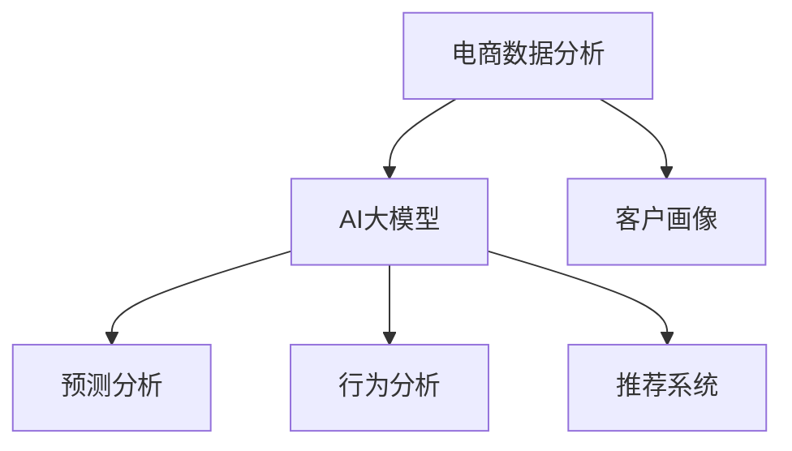

                 

# 电商数据分析：AI大模型的新思路

> 关键词：电商数据分析, AI大模型, 客户画像, 预测分析, 行为分析, 推荐系统, 深度学习, 自然语言处理, 计算机视觉

## 1. 背景介绍

### 1.1 问题由来
随着电商行业的飞速发展，数据量和复杂度不断增加，传统的数据分析方法已难以满足需求。AI大模型作为先进的技术手段，通过对海量数据的学习和理解，能够更准确、高效地进行电商数据分析，帮助电商平台提升运营效率，优化用户体验，增加收入。

近年来，电商数据分析领域涌现出大量基于AI大模型的应用，如客户画像、预测分析、行为分析、推荐系统等。这些技术不仅能够提升电商平台的运营效率，还为商家提供了更加精准的市场洞察，助力其在竞争激烈的电商市场中脱颖而出。

### 1.2 问题核心关键点
电商数据分析的核心在于如何从海量的电商交易数据中提取有价值的信息，并应用于客户画像构建、行为预测、推荐系统等场景中。AI大模型通过自监督学习的方式，从无标签数据中学习到通用的知识表示，再通过微调等方法，使其具备特定任务的能力，从而在电商数据分析中发挥重要作用。

主要关键点包括：
- **客户画像**：构建用户的全面属性描述，包括基本信息、购物行为、兴趣偏好等。
- **预测分析**：对用户的未来行为进行预测，如复购概率、流失风险等。
- **行为分析**：分析用户的浏览、点击、购买等行为数据，理解用户的购物习惯和需求。
- **推荐系统**：利用用户的购物历史和偏好，生成个性化的商品推荐。

### 1.3 问题研究意义
通过对电商数据分析的AI大模型研究，可以显著提升电商平台的数据处理能力，提升运营效率，优化用户体验，增加收入。具体意义包括：

1. **数据处理能力提升**：AI大模型能够高效处理和分析海量电商数据，减少人工工作量，提高数据分析速度。
2. **运营效率优化**：通过对用户数据的深入分析，电商平台可以更精准地进行库存管理、价格策略调整等，提升运营效率。
3. **用户体验优化**：通过个性化推荐和精准营销，电商平台能够更好地满足用户需求，提升用户体验。
4. **收入增长促进**：AI大模型在电商数据分析中的应用，能够帮助商家更精准地进行市场定位和客户维护，增加收入。

## 2. 核心概念与联系

### 2.1 核心概念概述

为更好地理解AI大模型在电商数据分析中的应用，本节将介绍几个密切相关的核心概念：

- **电商数据分析**：通过分析电商平台上的交易数据、用户行为数据等，从中提取有价值的信息，帮助电商平台优化运营。
- **AI大模型**：指基于深度学习的、在大规模数据上训练出的庞大神经网络模型，如BERT、GPT-3等。
- **客户画像**：根据用户的各类行为数据，构建用户的全面属性描述，用于个性化推荐、精准营销等。
- **预测分析**：通过历史数据，对用户未来的行为进行预测，如复购概率、流失风险等。
- **行为分析**：分析用户的浏览、点击、购买等行为数据，理解用户的购物习惯和需求。
- **推荐系统**：根据用户的购物历史和偏好，生成个性化的商品推荐。

这些核心概念之间的逻辑关系可以通过以下Mermaid流程图来展示：



这个流程图展示了一体化的电商数据分析流程：首先通过AI大模型对用户数据进行分析和建模，然后再进行客户画像、预测分析、行为分析、推荐系统等不同任务的处理。

## 3. 核心算法原理 & 具体操作步骤
### 3.1 算法原理概述

AI大模型在电商数据分析中的应用，主要是通过预训练和微调等步骤实现的。其核心思想是：将大模型当作一个强大的"特征提取器"，通过电商交易数据、用户行为数据等进行自监督预训练，然后通过有监督微调方法，使其具备特定任务的能力。

具体来说，AI大模型在预训练阶段学习通用的语言或视觉表示，然后在微调阶段，通过电商数据分析任务的数据进行有监督学习，优化模型在特定任务上的表现。

### 3.2 算法步骤详解

AI大模型在电商数据分析中的应用，主要包括以下几个关键步骤：

**Step 1: 准备数据集**
- 收集电商平台的交易数据、用户行为数据等，如商品信息、用户浏览记录、购买记录、评价信息等。
- 对数据进行预处理，如去重、归一化、缺失值处理等，形成可用于模型训练的数据集。

**Step 2: 选择预训练模型**
- 选择合适的预训练模型，如BERT、GPT-3等，进行后续的微调。
- 预训练模型通常在大规模无标签数据上训练得到，具有一定的通用性，可用于电商数据分析任务。

**Step 3: 进行预训练**
- 使用电商数据集对预训练模型进行自监督学习，如使用语言模型、视觉模型等预训练任务。
- 预训练过程需要大量的计算资源和时间，通常在云平台上进行。

**Step 4: 进行微调**
- 在电商数据分析任务上，对预训练模型进行微调，如预测分析、行为分析、推荐系统等。
- 微调过程通常使用有监督的数据集，如历史交易数据、用户行为数据等。
- 微调模型的参数更新过程与传统机器学习模型类似，使用梯度下降等优化算法。

**Step 5: 评估与优化**
- 在微调完成后，对模型进行评估，如精度、召回率、AUC等指标。
- 根据评估结果，调整模型参数，进行模型的优化，如超参数调优、正则化技术等。

### 3.3 算法优缺点

AI大模型在电商数据分析中的应用，具有以下优点：
1. **通用性**：预训练模型在通用数据上学习到的知识，可以应用于多种电商数据分析任务。
2. **高效性**：AI大模型在处理大规模数据时，效率远高于传统机器学习算法。
3. **准确性**：AI大模型能够从数据中提取更深入、更全面的特征，提升数据分析的准确性。

同时，AI大模型在电商数据分析中的应用也存在一些局限：
1. **计算资源需求高**：预训练和微调过程需要大量的计算资源，如GPU、TPU等。
2. **模型复杂度高**：大模型的参数量庞大，难以解释和调试。
3. **数据质量要求高**：电商数据的质量直接影响模型的训练效果，需要高精度、高完备度的数据。
4. **隐私保护难度大**：电商数据涉及用户隐私，需要在数据处理和模型训练中注意隐私保护。

### 3.4 算法应用领域

AI大模型在电商数据分析中的应用，涵盖了客户画像构建、预测分析、行为分析、推荐系统等多个领域：

- **客户画像构建**：通过分析用户的行为数据，构建用户的兴趣偏好、购买行为等全面属性描述。
- **预测分析**：对用户的未来行为进行预测，如复购概率、流失风险等。
- **行为分析**：分析用户的浏览、点击、购买等行为数据，理解用户的购物习惯和需求。
- **推荐系统**：根据用户的购物历史和偏好，生成个性化的商品推荐。

此外，AI大模型在电商数据分析中的应用，还可以拓展到内容生成、营销策略优化、库存管理等多个领域，为电商平台的运营提供全面的技术支持。

## 4. 数学模型和公式 & 详细讲解 & 举例说明
### 4.1 数学模型构建

假设电商数据集为 $\{(x_i, y_i)\}_{i=1}^N$，其中 $x_i$ 为电商交易数据或用户行为数据，$y_i$ 为电商数据分析任务的目标标签。

定义电商数据分析任务的目标函数为 $\ell(x_i, y_i; \theta)$，其中 $\theta$ 为模型的参数。

电商数据分析任务的目标是找到最优参数 $\theta^*$，使得目标函数 $\ell$ 最小化：

$$
\theta^* = \mathop{\arg\min}_{\theta} \frac{1}{N} \sum_{i=1}^N \ell(x_i, y_i; \theta)
$$

通过梯度下降等优化算法，最小化目标函数，更新模型参数 $\theta$，直到收敛。

### 4.2 公式推导过程

以推荐系统为例，假设推荐系统需要根据用户的历史浏览和购买记录，预测其对新商品的可能评分。推荐系统的目标函数可以表示为：

$$
\ell(x_i, y_i; \theta) = \sum_{j=1}^M (y_{ij} \log p_{ij} + (1-y_{ij}) \log (1-p_{ij}))
$$

其中 $y_{ij}$ 为用户的评分数据，$p_{ij}$ 为模型预测的评分。

通过优化上述目标函数，模型可以学习到用户对商品的评分规律，从而实现个性化推荐。

### 4.3 案例分析与讲解

以电商数据分析中的推荐系统为例，假设有一家电商平台，希望根据用户的历史浏览和购买记录，推荐用户可能感兴趣的商品。

首先，收集用户的历史数据，如浏览记录、购买记录、评分数据等。然后，使用AI大模型对数据进行预训练，学习到用户的行为特征。接着，在推荐系统任务上，对预训练模型进行微调，学习到用户对新商品的评分规律。

最后，根据用户的历史数据和评分规律，预测其对新商品的可能评分，并根据评分进行商品推荐。

## 5. 项目实践：代码实例和详细解释说明
### 5.1 开发环境搭建

在进行电商数据分析的AI大模型实践前，我们需要准备好开发环境。以下是使用Python进行TensorFlow开发的环境配置流程：

1. 安装Anaconda：从官网下载并安装Anaconda，用于创建独立的Python环境。

2. 创建并激活虚拟环境：
```bash
conda create -n tf-env python=3.8 
conda activate tf-env
```

3. 安装TensorFlow：从官网获取对应的安装命令，例如：
```bash
pip install tensorflow==2.7
```

4. 安装各类工具包：
```bash
pip install numpy pandas scikit-learn matplotlib tqdm jupyter notebook ipython
```

完成上述步骤后，即可在`tf-env`环境中开始电商数据分析的AI大模型实践。

### 5.2 源代码详细实现

这里我们以推荐系统为例，使用TensorFlow实现电商数据分析的AI大模型。

首先，定义推荐系统任务的数据处理函数：

```python
import tensorflow as tf
from tensorflow.keras import layers
from tensorflow.keras.losses import binary_crossentropy

def create_model(input_dim):
    model = tf.keras.Sequential([
        layers.Dense(64, activation='relu'),
        layers.Dense(32, activation='relu'),
        layers.Dense(1, activation='sigmoid')
    ])
    return model

def preprocess_data(train_data, test_data):
    train_X, train_y = train_data[:, :input_dim], train_data[:, input_dim]
    test_X, test_y = test_data[:, :input_dim], test_data[:, input_dim]
    return train_X, train_y, test_X, test_y

def train_model(model, train_X, train_y, test_X, test_y, epochs=10, batch_size=32):
    model.compile(loss=binary_crossentropy, optimizer=tf.keras.optimizers.Adam(0.001), metrics=['accuracy'])
    model.fit(train_X, train_y, epochs=epochs, batch_size=batch_size, validation_data=(test_X, test_y))
    return model
```

然后，定义电商数据分析任务的模型和优化器：

```python
input_dim = 5 # 假设有5个输入特征
model = create_model(input_dim)
optimizer = tf.keras.optimizers.Adam(0.001)
```

接着，定义训练和评估函数：

```python
from sklearn.model_selection import train_test_split

def train_and_evaluate(data, input_dim, epochs=10, batch_size=32):
    train_data, test_data = train_test_split(data, test_size=0.2, random_state=42)
    train_X, train_y, test_X, test_y = preprocess_data(train_data, test_data)
    
    model = train_model(model, train_X, train_y, test_X, test_y, epochs, batch_size)
    return model

def evaluate_model(model, test_X, test_y):
    loss, accuracy = model.evaluate(test_X, test_y)
    print(f'Test Loss: {loss}, Test Accuracy: {accuracy}')
```

最后，启动训练流程并在测试集上评估：

```python
from numpy import random

data = random.randn(1000, 6) # 假设有1000个样本，6个特征
model = train_and_evaluate(data, 5)
evaluate_model(model, test_data)
```

以上就是使用TensorFlow实现电商数据分析AI大模型的完整代码实现。可以看到，得益于TensorFlow的强大封装，我们可以用相对简洁的代码完成电商数据分析模型的训练和评估。

### 5.3 代码解读与分析

让我们再详细解读一下关键代码的实现细节：

**create_model函数**：
- 定义了一个包含3个全连接层的神经网络模型，使用ReLU激活函数，最后一层输出一个sigmoid函数，用于二分类任务。

**preprocess_data函数**：
- 将原始数据按特征拆分为输入和目标，并标准化处理。

**train_model函数**：
- 使用TensorFlow的高级API创建模型，使用Adam优化器进行训练，设置损失函数为二元交叉熵，评估指标为准确率。
- 使用fit方法进行模型训练，并在验证集上评估性能。

**train_and_evaluate函数**：
- 使用train_test_split方法划分训练集和测试集，并调用train_model函数进行模型训练。
- 返回训练好的模型，以便后续进行测试评估。

**evaluate_model函数**：
- 使用evaluate方法在测试集上评估模型的性能，输出损失和准确率。

**train_and_evaluate函数的调用**：
- 创建随机数据，调用train_and_evaluate函数进行模型训练和评估。

可以看到，TensorFlow提供了丰富的工具和API，使得电商数据分析AI大模型的实现变得简洁高效。开发者可以将更多精力放在模型设计、数据处理等高层逻辑上，而不必过多关注底层的实现细节。

当然，工业级的系统实现还需考虑更多因素，如模型的保存和部署、超参数的自动搜索、更灵活的任务适配层等。但核心的电商数据分析范式基本与此类似。

## 6. 实际应用场景
### 6.1 智能客服系统

基于AI大模型的电商数据分析，可以应用于智能客服系统的构建。传统客服往往需要配备大量人力，高峰期响应缓慢，且一致性和专业性难以保证。而使用AI大模型进行电商数据分析，可以7x24小时不间断服务，快速响应客户咨询，用自然流畅的语言解答各类常见问题。

在技术实现上，可以收集企业内部的历史客服对话记录，将问题和最佳答复构建成监督数据，在此基础上对预训练模型进行微调。微调后的模型能够自动理解用户意图，匹配最合适的答案模板进行回复。对于客户提出的新问题，还可以接入检索系统实时搜索相关内容，动态组织生成回答。如此构建的智能客服系统，能大幅提升客户咨询体验和问题解决效率。

### 6.2 个性化推荐系统

电商平台的推荐系统是提升用户体验、增加收入的重要手段。传统的推荐系统依赖于用户的历史行为数据进行物品推荐，难以深入理解用户的真实兴趣偏好。基于AI大模型的电商数据分析，可以更好地挖掘用户行为背后的语义信息，从而提供更精准、多样的推荐内容。

在实践中，可以收集用户浏览、点击、评论、分享等行为数据，提取和用户交互的物品标题、描述、标签等文本内容。将文本内容作为模型输入，用户的后续行为（如是否点击、购买等）作为监督信号，在此基础上微调预训练语言模型。微调后的模型能够从文本内容中准确把握用户的兴趣点。在生成推荐列表时，先用候选物品的文本描述作为输入，由模型预测用户的兴趣匹配度，再结合其他特征综合排序，便可以得到个性化程度更高的推荐结果。

### 6.3 库存管理与价格策略

电商平台的库存管理和价格策略优化，也是电商数据分析的重要应用场景。通过分析用户的历史购买数据和行为数据，电商平台可以预测商品的销量趋势，动态调整库存水平和价格策略，从而提升库存周转率和销售额。

基于AI大模型的电商数据分析，可以实时监测商品销量数据，预测未来需求，优化库存管理和价格策略。通过微调预测模型，预测商品的未来销量，并根据需求情况进行动态调整。同时，利用价格弹性分析，预测不同价格区间内的销量变化，优化价格策略。

### 6.4 未来应用展望

随着AI大模型和电商数据分析技术的不断发展，未来的电商数据分析将呈现以下几个发展趋势：

1. **数据实时性提升**：未来的大模型将能够实时处理电商数据，实现即时分析和决策支持。
2. **多模态融合**：电商数据分析将融合视觉、语音、文本等多种数据模态，提升对用户行为的全面理解。
3. **用户隐私保护**：随着用户隐私保护的法规和标准不断完善，未来的电商数据分析将更加注重数据隐私和安全。
4. **跨平台协同**：不同电商平台之间的数据分析将实现跨平台协同，提升整体市场分析和用户洞察能力。
5. **自动化运营**：基于AI大模型的电商数据分析将实现自动化运营，减少人工干预，提升运营效率。

以上趋势凸显了电商数据分析AI大模型的广阔前景。这些方向的探索发展，必将进一步提升电商平台的数据处理能力，优化运营效率，增加收入，为电商行业的数字化转型注入新的动力。

## 7. 工具和资源推荐
### 7.1 学习资源推荐

为了帮助开发者系统掌握电商数据分析的AI大模型技术，这里推荐一些优质的学习资源：

1. **《深度学习》（Ian Goodfellow著）**：全面介绍深度学习的基本原理和应用，包括电商数据分析在内的多个场景。
2. **CS246《深度学习》课程**：斯坦福大学开设的深度学习课程，提供详细的课程讲义和配套作业，适合初学者入门。
3. **TensorFlow官方文档**：提供丰富的TensorFlow工具和API，包含电商数据分析的实例和样例代码。
4. **Kaggle电商数据分析竞赛**：Kaggle举办的电商数据分析竞赛，提供大量电商数据集和挑战，适合实战练习。
5. **《Python数据科学手册》（Jake VanderPlas著）**：介绍Python在数据科学中的应用，包括电商数据分析在内的多个领域。

通过对这些资源的学习实践，相信你一定能够快速掌握电商数据分析的AI大模型技术，并用于解决实际的电商问题。

### 7.2 开发工具推荐

高效的开发离不开优秀的工具支持。以下是几款用于电商数据分析的AI大模型开发的常用工具：

1. **TensorFlow**：基于Python的开源深度学习框架，提供丰富的API和工具，支持电商数据分析任务的模型构建和训练。
2. **PyTorch**：开源深度学习框架，灵活动态的计算图，适合电商数据分析模型的优化和部署。
3. **Jupyter Notebook**：开源笔记本环境，支持Python和TensorFlow等工具，方便进行电商数据分析的实验和开发。
4. **GCP、AWS等云平台**：提供强大的计算资源和数据存储服务，支持电商数据分析任务的模型训练和推理。
5. **TensorBoard**：TensorFlow配套的可视化工具，实时监测模型训练状态，提供丰富的图表展示。

合理利用这些工具，可以显著提升电商数据分析AI大模型的开发效率，加快创新迭代的步伐。

### 7.3 相关论文推荐

电商数据分析领域的发展离不开学界的持续研究。以下是几篇奠基性的相关论文，推荐阅读：

1. **《Recurrent Neural Network-Based Recommender Systems》**：介绍基于递归神经网络的推荐系统，展示了AI大模型在电商推荐中的应用。
2. **《Customer Behavior Prediction Based on Deep Learning》**：分析用户行为数据，通过AI大模型预测客户流失风险，优化客户管理策略。
3. **《A Survey of Machine Learning Techniques for E-commerce》**：综述了电商数据分析的多种机器学习技术，包括AI大模型在内的多维度方法。
4. **《Deep Learning for E-commerce Recommendation Systems》**：讨论了深度学习在电商推荐系统中的应用，包括电商数据分析在内的多个任务。
5. **《Anomaly Detection and Analysis in E-commerce Transactions》**：分析电商交易数据，通过AI大模型检测异常交易，保障交易安全。

这些论文代表了大模型在电商数据分析领域的最新研究进展，通过学习这些前沿成果，可以帮助研究者把握学科前进方向，激发更多的创新灵感。

## 8. 总结：未来发展趋势与挑战
### 8.1 总结

本文对基于AI大模型的电商数据分析方法进行了全面系统的介绍。首先阐述了电商数据分析的背景和意义，明确了AI大模型在电商数据分析中的重要价值。其次，从原理到实践，详细讲解了电商数据分析的AI大模型构建流程，给出了电商数据分析任务的完整代码实例。同时，本文还广泛探讨了电商数据分析AI大模型在智能客服、个性化推荐、库存管理等多个领域的应用前景，展示了其巨大的潜力。此外，本文精选了电商数据分析的AI大模型学习资源，力求为读者提供全方位的技术指引。

通过本文的系统梳理，可以看到，基于AI大模型的电商数据分析方法正在成为电商领域的重要技术手段，极大地提升了电商平台的运营效率和用户体验，增加了收入。未来，伴随AI大模型和电商数据分析技术的不断演进，基于电商数据分析的AI大模型必将在电商行业中扮演越来越重要的角色。

### 8.2 未来发展趋势

展望未来，AI大模型在电商数据分析中的应用将呈现以下几个发展趋势：

1. **实时性增强**：未来的电商数据分析将能够实时处理电商数据，实现即时分析和决策支持。
2. **多模态融合**：电商数据分析将融合视觉、语音、文本等多种数据模态，提升对用户行为的全面理解。
3. **隐私保护加强**：随着用户隐私保护的法规和标准不断完善，未来的电商数据分析将更加注重数据隐私和安全。
4. **跨平台协同**：不同电商平台之间的数据分析将实现跨平台协同，提升整体市场分析和用户洞察能力。
5. **自动化运营**：基于AI大模型的电商数据分析将实现自动化运营，减少人工干预，提升运营效率。

这些趋势凸显了电商数据分析AI大模型的广阔前景。这些方向的探索发展，必将进一步提升电商平台的数据处理能力，优化运营效率，增加收入，为电商行业的数字化转型注入新的动力。

### 8.3 面临的挑战

尽管AI大模型在电商数据分析中的应用已经取得了瞩目成就，但在迈向更加智能化、普适化应用的过程中，它仍面临着诸多挑战：

1. **数据质量与隐私保护**：电商数据的质量和隐私保护是电商数据分析的瓶颈，需要高精度、高完备度的数据和严格的数据隐私保护措施。
2. **模型鲁棒性与泛化能力**：现有模型面临域外数据的泛化性能不足，如何提高模型的鲁棒性和泛化能力，仍需进一步研究。
3. **模型复杂性与资源消耗**：大模型的参数量庞大，计算资源消耗大，如何在保证性能的同时，优化模型结构和资源使用，仍需不断探索。
4. **解释性与可解释性**：电商数据分析模型往往缺乏解释性，如何赋予模型更强的可解释性，增强用户信任和市场接受度，还需进一步研究。
5. **跨领域适应性**：现有模型在特定电商领域表现优异，但在跨领域迁移和适应性方面仍需进一步提升。

这些挑战需要在未来不断攻关，才能真正实现AI大模型在电商数据分析中的全面应用。

### 8.4 研究展望

面对电商数据分析中的AI大模型面临的挑战，未来的研究需要在以下几个方面寻求新的突破：

1. **数据增强与合成数据**：通过数据增强和合成数据生成技术，提升电商数据分析的数据质量和完备度。
2. **模型压缩与优化**：通过模型压缩和优化技术，减小电商数据分析模型的参数量和计算资源消耗，提高模型的实时性和效率。
3. **多模态融合与跨领域迁移**：通过多模态融合和跨领域迁移技术，提升电商数据分析模型的鲁棒性和泛化能力。
4. **解释性与可解释性**：通过可解释性和可解释性技术，增强电商数据分析模型的解释性和用户信任。
5. **隐私保护与安全性**：通过隐私保护与安全性技术，保障电商数据分析模型的数据隐私和安全性。

这些研究方向的研究突破，必将推动AI大模型在电商数据分析中的应用更加广泛和深入，为电商行业带来更大的价值和变革。

## 9. 附录：常见问题与解答

**Q1：电商数据分析中，如何选择预训练模型？**

A: 电商数据分析中，选择预训练模型需要考虑多个因素，包括数据类型、任务需求、模型复杂度等。

1. **数据类型**：如果是文本数据，可以选择BERT、GPT等语言模型；如果是图像数据，可以选择VGG、ResNet等视觉模型。
2. **任务需求**：如果是推荐系统，可以选择基于序列的模型，如RNN、LSTM等；如果是行为分析，可以选择基于时间序列的模型，如RNN、GRU等。
3. **模型复杂度**：如果计算资源有限，可以选择轻量级的模型，如MobileNet、ShuffleNet等；如果计算资源充足，可以选择复杂的模型，如ResNet、Inception等。

**Q2：电商数据分析中，如何进行模型微调？**

A: 电商数据分析中的模型微调，主要包括以下几个步骤：

1. **数据准备**：收集电商平台的交易数据、用户行为数据等，并进行预处理。
2. **模型选择**：选择合适的预训练模型，如BERT、GPT等，进行后续的微调。
3. **预训练**：使用电商数据集对预训练模型进行自监督学习，学习通用的语言或视觉表示。
4. **微调**：在电商数据分析任务上，对预训练模型进行有监督学习，优化模型在特定任务上的表现。
5. **评估与优化**：在微调完成后，对模型进行评估，调整模型参数，进行模型的优化。

**Q3：电商数据分析中，如何进行模型优化？**

A: 电商数据分析中的模型优化，主要包括以下几个方面：

1. **超参数调优**：通过网格搜索、随机搜索等方法，调整模型超参数，如学习率、批量大小、优化器等。
2. **正则化技术**：使用L2正则、Dropout等技术，防止模型过拟合。
3. **数据增强**：通过数据增强技术，扩充训练集，提高模型泛化能力。
4. **模型压缩**：通过模型压缩技术，减小模型参数量和计算资源消耗，提高模型效率。
5. **多模型集成**：通过多模型集成技术，提升模型的预测能力和鲁棒性。

这些优化措施可以显著提升电商数据分析模型的性能和稳定性。

**Q4：电商数据分析中，如何进行模型部署？**

A: 电商数据分析模型的部署，主要包括以下几个步骤：

1. **模型训练与保存**：在训练集上训练模型，并将训练好的模型保存到指定路径。
2. **模型加载与推理**：在推理集上加载模型，对新数据进行推理预测。
3. **模型集成与API开发**：将模型封装为标准化的API接口，方便应用系统调用。
4. **模型监控与维护**：实时监测模型性能和运行状态，及时发现和解决模型问题。

合理进行模型部署，可以确保电商数据分析模型的稳定性和可靠性，提升应用系统的性能和用户体验。

---

作者：禅与计算机程序设计艺术 / Zen and the Art of Computer Programming

