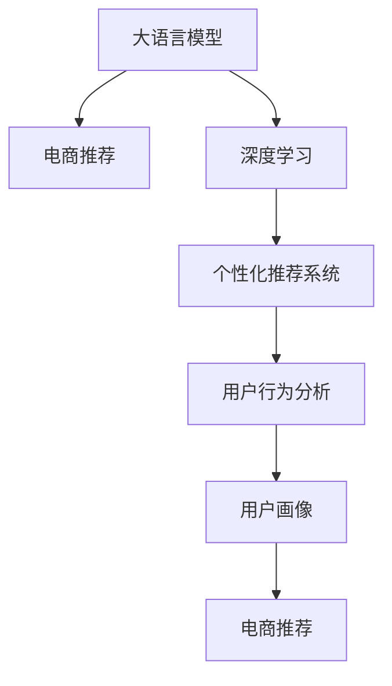

                 

# 电商行业中AI大模型的落地应用案例分析

> 关键词：大语言模型,深度学习,电商推荐,个性化推荐系统,用户行为分析,用户画像,商品推荐

## 1. 背景介绍

随着人工智能技术的快速发展和深度学习算法的不断突破，大语言模型（Large Language Model, LLM）在电商行业中的应用变得愈发重要。通过使用大语言模型，电商企业可以实现从商品推荐、客户服务到订单处理等全链路的智能化升级，从而提升用户体验，增加销售额，优化运营效率。

大语言模型是一类通过大规模无标签文本数据进行预训练的模型，通常具有数十亿或数百亿的参数，如GPT-3、BERT等。这些模型能够学习到通用的语言表示和规律，具备强大的语言理解和生成能力，在电商领域中表现出巨大的潜力。

## 2. 核心概念与联系

### 2.1 核心概念概述

为更好地理解大语言模型在电商行业的落地应用，本节将介绍几个密切相关的核心概念：

- **大语言模型**：一类通过大规模无标签文本数据进行预训练的模型，如GPT-3、BERT等，具备强大的语言理解和生成能力。
- **深度学习**：一类基于神经网络结构的机器学习方法，通过多层神经元进行特征提取和模型训练。
- **电商推荐系统**：一种通过算法推荐系统，根据用户行为、历史数据等对商品进行智能推荐，提升用户体验和转化率。
- **个性化推荐系统**：一种基于用户画像的推荐方法，通过分析用户的行为和兴趣，推荐符合用户偏好的商品。
- **用户行为分析**：对用户浏览、点击、购买等行为进行统计和分析，提取用户特征，用于推荐和广告投放。
- **用户画像**：通过对用户行为数据的分析，构建用户的基本属性、兴趣偏好、消费习惯等信息，以便进行个性化推荐。

这些核心概念之间的逻辑关系可以通过以下Mermaid流程图来展示：



这个流程图展示了大语言模型、深度学习、电商推荐、个性化推荐系统、用户行为分析和用户画像之间的联系：

1. **大语言模型**通过预训练获得基础能力，在电商推荐系统中被用于构建推荐算法。
2. **深度学习**算法在电商推荐系统中被用于模型训练和特征提取。
3. **个性化推荐系统**利用用户画像和行为数据进行商品推荐，基于大语言模型的预训练能力进一步提升推荐效果。
4. **用户行为分析**通过分析用户的行为数据，构建用户画像，为个性化推荐提供依据。
5. **用户画像**通过整合用户行为数据和社交网络信息，为个性化推荐系统提供全面的用户特征。

这些核心概念共同构成了电商行业中使用大语言模型的技术和应用框架，使得大语言模型能够在电商推荐等场景中发挥强大的语言理解和生成能力。

## 3. 核心算法原理 & 具体操作步骤

### 3.1 算法原理概述

电商行业中的大语言模型落地应用，本质上是一种基于深度学习方法的推荐系统。其核心思想是：通过大语言模型学习用户与商品之间的语义关系，结合用户行为数据，构建推荐模型，输出符合用户偏好的商品列表。

具体来说，电商推荐系统包含以下几个步骤：

1. **数据预处理**：收集用户的浏览记录、点击记录、购买记录等行为数据，提取用户特征，构建商品描述、标签等数据。
2. **模型训练**：使用大语言模型预训练特征作为输入，结合用户画像和行为数据，训练推荐模型。
3. **模型推理**：在新的用户行为数据上，使用训练好的推荐模型进行推理，输出商品推荐列表。

### 3.2 算法步骤详解

电商行业中使用大语言模型的推荐系统主要包括以下几个关键步骤：

**Step 1: 数据收集与处理**

- **用户行为数据**：收集用户的浏览、点击、购买等行为数据，构建用户画像。
- **商品数据**：收集商品描述、标签、价格等信息，构建商品特征。
- **数据预处理**：对用户行为数据和商品数据进行清洗、归一化等处理，构建用户行为向量 $U$ 和商品特征向量 $I$。

**Step 2: 大语言模型预训练特征提取**

- **模型选择**：选择合适的大语言模型（如BERT、GPT等），作为预训练特征提取器。
- **特征提取**：使用大语言模型对用户行为数据和商品数据进行预训练特征提取，得到用户行为向量 $U'$ 和商品特征向量 $I'$。

**Step 3: 模型训练与优化**

- **模型选择**：选择合适的推荐模型，如协同过滤、基于深度学习的推荐模型等。
- **损失函数**：设计损失函数，如均方误差损失、交叉熵损失等，衡量模型输出与真实标签之间的差异。
- **优化算法**：选择优化算法（如Adam、SGD等），并设置学习率、批大小、迭代轮数等超参数。
- **训练过程**：使用用户行为向量 $U'$ 和商品特征向量 $I'$ 作为输入，结合优化算法，训练推荐模型，最小化损失函数。

**Step 4: 模型推理与推荐**

- **模型加载**：加载训练好的推荐模型。
- **用户行为数据输入**：输入新的用户行为数据，如用户ID、行为类型、时间戳等。
- **模型推理**：使用训练好的推荐模型，对用户行为数据进行推理，输出商品推荐列表。
- **结果展示**：将推荐列表展示给用户，供用户选择购买。

### 3.3 算法优缺点

电商行业中使用大语言模型的推荐系统具有以下优点：

1. **准确性高**：大语言模型能够学习到用户与商品之间的语义关系，结合用户行为数据，进行精确的推荐。
2. **泛化能力强**：大语言模型在电商行业中的使用，可以有效应对不同场景下的推荐需求，如新用户、新商品、季节性变化等。
3. **灵活性高**：大语言模型可以通过微调、参数共享等方法，实现对不同用户和商品的个性化推荐。

同时，该方法也存在一定的局限性：

1. **计算成本高**：大语言模型的预训练和模型训练需要大量的计算资源和时间。
2. **数据隐私问题**：电商行业中的数据涉及用户隐私，大语言模型需要谨慎处理用户数据，避免泄露隐私。
3. **解释性不足**：大语言模型推荐结果的解释性不足，难以理解其内部的决策逻辑。
4. **模型复杂度高**：大语言模型通常具有高维度、大规模的参数，难以解释和调试。

尽管存在这些局限性，但就目前而言，基于大语言模型的推荐方法在电商行业中的应用依然具有显著的优势，特别是在处理大规模数据和复杂推荐场景时，表现尤为突出。

### 3.4 算法应用领域

大语言模型在电商行业中的应用领域广泛，主要包括以下几个方面：

- **商品推荐**：基于用户行为数据，推荐符合用户兴趣的商品。
- **用户画像**：通过对用户行为数据进行分析，构建用户画像，用于推荐和广告投放。
- **营销活动**：利用大语言模型，设计广告文案、生成推荐理由，提升营销活动效果。
- **客户服务**：使用大语言模型构建聊天机器人，提供24小时客服服务，提升用户体验。
- **库存管理**：基于用户行为数据和历史销售数据，预测商品需求，优化库存管理。

除了上述这些经典应用外，大语言模型还在电商行业中的个性化推荐、情感分析、欺诈检测等多个场景中发挥着重要作用，为电商企业带来了显著的商业价值。

## 4. 数学模型和公式 & 详细讲解 & 举例说明

### 4.1 数学模型构建

电商推荐系统中的大语言模型，本质上是一种基于深度学习的推荐模型。假设用户行为数据为 $U$，商品特征数据为 $I$，推荐模型为 $R$，目标函数为 $f(U, I)$。模型训练的目标是最小化预测结果与真实标签之间的差异，即：

$$
\min_{R} \mathbb{E}_{(U,I)} [\mathcal{L}(R(f(U, I)), Y)]
$$

其中 $\mathcal{L}$ 为损失函数，$Y$ 为真实标签。常见的损失函数包括均方误差损失、交叉熵损失等。

### 4.2 公式推导过程

以基于深度学习的推荐模型为例，其基本结构如图：

```
用户行为数据 U
└──────────────────────────────────────────────────────────────────────────────────────────────────────────────────────────────────────────────────────────────────────────────────────────────────────────────────────────────────────────────────────────────────────────────────────────────────────────────────────────────────────────────────────────────────────────────────────────────────────────────────────────────────────────────────────────────────────────────────────────────────────────────────────────────────────────────────────────────────────────────────────────────────────────────────────────────────────────────────────────────────────────────────────────────────────────────────────────────────────────────────────────────────────────────────────────────────────────────────────────────────────────────────────────────────────────────────────────────────────────────────────────────────────────────────────────────────────────────────────────────────────────────────────────────────────────────────────────────────────────────────────────────────────────────────────────────────────────────────────────────────────────────────────────────────────────────────────────────────────────────────────────────────────────────────────────────────────────────────────────────────────────────────────────────────────────────────────────────────────────────────────────────────────────────────────────────────────────────────────────────────────────────────────────────────────────────────────────────────────────────────────────────────────────────────────────────────────────────────────────────────────────────────────────────────────────────────────────────────────────────────────────────────────────────────────────────────────────────────────────────────────────────────────────────────────────────────────────────────────────────────────────────────────────────────────────────────────────────────────────────────────────────────────────────────────────────────────────────────────────────────────────────────────────────────────────────────────────────────────────────────────────────────────────────────────────────────────────────────────────────────────────────────────────────────────────────────────────────────────────────────────────────────────────────────────────────────────────────────────────────────────────────────────────────────────────────────────────────────────────────────────────────────────────────────────────────────────────────────────────────────────────────────────────────────────────────────────────────────────────────────────────────────────────────────────────────────────────────────────────────────────────────────────────────────────────────────────────────────────────────────────────────────────────────────────────────────────────────────────────────────────────────────────────────────────────────────────────────────────────────────────────────────────────────────────────────────────────────────────────────────────────────────────────────────────────────────────────────────────────────────────────────────────────────────────────────────────────────────────────────────────────────────────────────────────────────────────────────────────────────────────────────────────────────────────────────────────────────────────────────────────────────────────────────────────────────────────────────────────────────────────────────────────────────────────────────────────────────────────────────────────────────────────────────────────────────────────────────────────────────────────────────────────────────────────────────────────────────────────────────────────────────────────────────────────────────────────────────────────────────────────────────────────────────────────────────────────────────────────────────────────────────────────────────────────────────────────────────────────────────────────────────────────────────────────────────────────────────────────────────────────────────────────────────────────────────────────────────────────────────────────────────────────────────────────────────────────────────────────────────────────────────────────────────────────────────────────────────────────────────────────────────────────────────────────────────────────────────────────────────────────────────────────────────────────────────────────────────────────────────────────────────────────────────────────────────────────────────────────────────────────────────────────────────────────────────────────────────────────────────────────────────────────────────────────────────────────────────────────────────────────────────────────────────────────────────────────────────────────────────────────────────────────────────────────────────────────────────────────────────────────────────────────────────────────────────────────────────────────────────────────────────────────────────────────────────────────────────────────────────────────────────────────────────────────────────────────────────────────────────────────────────────────────────────────────────────────────────────────────────────────────────────────────────────────────────────────────────────────────────────────────────────────────────────────────────────────────────────────────────────────────────────────────────────────────────────────────────────────────────────────────────────────────────────────────────────────────────────────────────────────────────────────────────────────────────────────────────────────────────────────────────────────────────────────────────────────────────────────────────────────────────────────────────────────────────────────────────────────────────────────────────────────────────────────────────────────────────────────────────────────────────────────────────────────────────────────────────────────────────────────────────────────────────────────────────────────────────────────────────────────────────────────────────────────────────────────────────────────────────────────────────────────────────────────────────────────────────────────────────────────────────────────────────────────────────────────────────────────────────────────────────────────────────────────────────────────────────────────────────────────────────────────────────────────────────────────────────────────────────────────────────────────────────────────────────────────────────────────────────────────────────────────────────────────────────────────────────────────────────────────────────────────────────────────────────────────────────────────────────────────────────────────────────────────────────────────────────────────────────────────────────────────────────────────────────────────────────────────────────────────────────────────────────────────────────────────────────────────────────────────────────────────────────────────────────────────────────────────────────────────────────────────────────────────────────────────────────────────────────────────────────────────────────────────────────────────────────────────────────────────────────────────────────────────────────────────────────────────────────────────────────────────────────────────────────────────────────────────────────────────────────────────────────────────────────────────────────────────────────────────────────────────────────────────────────────────────────────────────────────────────────────────────────────────────────────────────────────────────────────

