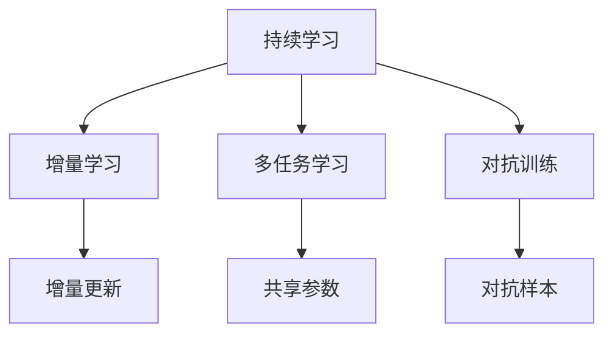

                 

# 电商行业中的持续学习：大模型在动态环境适应中的应用

## 1. 背景介绍

### 1.1 电商行业的发展现状

随着互联网技术的不断进步，电子商务行业呈现出爆炸式增长的态势。电商平台不仅承载着销售、物流、客服等核心功能，还提供了丰富的内容展示、社交互动、个性化推荐等增值服务。然而，电商平台的数据环境极为复杂多变，如商品类别繁多、客户需求快速变化、市场竞争激烈等，都要求其具备强大的动态适应能力。

### 1.2 持续学习的核心意义

持续学习（Continuous Learning）是指模型在数据流中不断学习新知识，同时保留已有知识以维持已有性能的过程。在电商行业中，持续学习能够有效应对不断变化的市场环境，提升系统响应速度和用户体验。通过持续学习，模型能够在新的数据输入下，快速适应变化，优化决策，维持最佳性能。

## 2. 核心概念与联系

### 2.1 核心概念概述

本节将介绍与持续学习和大模型应用相关的一些核心概念及其联系。

- **持续学习**：指模型在不断输入新数据的过程中，通过增量学习、多任务学习等方法，动态更新自身知识库，维持或提升性能。
- **大模型**：指具有巨量参数和强大表现力的深度学习模型，通常用于通用任务，如自然语言理解、图像识别等。
- **增量学习（Incremental Learning）**：指模型在每次新数据输入时，仅更新模型参数以适应新知识，避免全部重训，节省计算资源。
- **多任务学习（Multi-task Learning）**：指模型同时处理多个任务，共享部分模型参数，提高泛化能力和资源利用效率。
- **对抗训练（Adversarial Training）**：指模型通过对抗样本来增强鲁棒性，防止模型在对抗性攻击下产生不稳定性。

这些核心概念通过以下Mermaid流程图相互关联：



该流程图展示了持续学习与增量学习、多任务学习、对抗训练之间的联系与区别。

### 2.2 核心概念原理和架构

#### 增量学习
增量学习是一种典型的持续学习范式，其核心思想是在每次新数据到来时，仅更新模型参数以适应新知识，避免对全部数据进行重训。

在增量学习中，新样本被输入模型，经过前向传播和反向传播，更新模型参数。同时，老样本的预测结果也需要更新，以保证模型的鲁棒性和稳定性。常用的增量学习算法包括：

- **在线梯度下降（Online Gradient Descent, OGD）**：每次新样本到来时，使用SGD算法更新参数，计算速度快，但不保证全局最优解。
- **增量随机梯度下降（Incremental Stochastic Gradient Descent, ISGD）**：每次新样本到来时，使用SGD更新参数，更新过程中使用增量样本逐步累积。
- **基于增量学习的算法（如iADAM、iPSGD等）**：在更新参数时，引入记忆化技巧，加速收敛过程。

#### 多任务学习
多任务学习旨在通过同时处理多个相关任务，共享部分模型参数，提升模型的泛化能力和资源利用效率。其核心思想是利用任务间的相关性，减少冗余训练，提高模型性能。

在多任务学习中，假设模型要处理 $k$ 个相关任务，每个任务有 $n$ 个训练样本。模型的输出为 $y$，输入为 $x$。目标函数可表示为：

$$
\mathcal{L}(y; x) = \frac{1}{N}\sum_{i=1}^N \mathcal{L}_i(y; x)
$$

其中，$\mathcal{L}_i$ 为第 $i$ 个任务的损失函数。通过共享模型参数，不同任务间的数据得到更好的互操作性，提高模型在多个任务上的性能。

常用的多任务学习算法包括：

- **多任务联合学习（Multi-task Joint Learning）**：将多个任务的损失函数加权求和，共同优化模型参数。
- **多任务对抗学习（Multi-task Adversarial Learning）**：在损失函数中引入对抗性项，增加模型鲁棒性。
- **多任务转移学习（Multi-task Transfer Learning）**：在新任务到来时，通过老任务的先验知识进行预训练，加速学习过程。

#### 对抗训练
对抗训练是一种提高模型鲁棒性的有效方法，通过对抗性样本的引入，增强模型对数据扰动的抗干扰能力。其核心思想是利用对抗性样本优化模型，使其在对抗性攻击下仍能保持稳定。

在对抗训练中，假设存在一个对抗样本 $x'$，与原始样本 $x$ 相比，使模型输出的结果 $y'$ 更易受扰动，但保持正确性。目标函数可表示为：

$$
\mathcal{L}(y; x, x') = \max \left\{\mathcal{L}(y; x), \mathcal{L}(y; x', \delta)\right\}
$$

其中，$\delta$ 为扰动量，通常通过梯度下降算法生成。通过对抗性样本训练，模型能够更好地应对现实世界中的噪声和干扰。

## 3. 核心算法原理 & 具体操作步骤

### 3.1 算法原理概述

基于大模型的持续学习，其核心思想是通过增量学习、多任务学习等方法，使模型在动态环境适应中持续优化，维持或提升性能。具体而言，通过以下步骤实现：

1. **预训练**：使用大规模数据对大模型进行预训练，学习到通用的语言表示。
2. **微调**：将预训练模型视作初始化参数，通过有监督或无监督学习对模型进行微调，适应特定任务。
3. **增量学习**：每次新数据到来时，更新模型参数，保持模型动态适应能力。
4. **多任务学习**：通过处理多个相关任务，共享模型参数，提升泛化能力。
5. **对抗训练**：使用对抗性样本训练模型，增强鲁棒性。

### 3.2 算法步骤详解

#### 预训练阶段
预训练阶段通过大规模无标签数据训练模型，学习到通用的语言表示。以BERT模型为例，其预训练过程如下：

1. **数据准备**：使用大规模语料库，如维基百科、新闻、书籍等，对模型进行预训练。
2. **模型初始化**：将模型初始化为随机参数，使用随机梯度下降（SGD）算法进行优化。
3. **自监督任务**：使用掩码语言模型（Masked Language Modeling, MLM）、下一句预测（Next Sentence Prediction, NSP）等自监督任务进行训练。
4. **模型保存**：训练完成后，将模型参数保存，用于后续微调。

#### 微调阶段
微调阶段通过有监督数据，调整模型参数，适应特定任务。以电商领域的商品推荐任务为例，微调过程如下：

1. **数据准备**：收集电商平台的商品销售数据，标注用户对商品的好评、评分等信息。
2. **模型初始化**：使用预训练模型，将模型初始化为保存参数。
3. **任务适配**：添加任务适配层，如全连接层、注意力机制等，输出模型预测。
4. **优化器选择**：选择合适的优化算法，如Adam、Adagrad等，设定学习率。
5. **训练过程**：使用标注数据，进行梯度下降更新参数。
6. **验证与测试**：在验证集和测试集上评估模型性能，防止过拟合。

#### 增量学习阶段
增量学习阶段通过不断输入新数据，更新模型参数，保持模型动态适应能力。以实时推荐系统为例，增量学习过程如下：

1. **数据收集**：实时获取用户行为数据，如点击、购买、浏览记录等。
2. **模型更新**：使用增量更新算法，如ISGD、iADAM等，对模型参数进行更新。
3. **样本处理**：对新样本进行预处理，如特征提取、标准化等。
4. **损失函数**：根据任务特点，选择适合的损失函数，如均方误差、交叉熵等。
5. **模型验证**：在新数据到来时，验证模型性能，调整参数。

#### 多任务学习阶段
多任务学习阶段通过同时处理多个相关任务，共享模型参数，提升模型性能。以电商平台的商品分类和推荐为例，多任务学习过程如下：

1. **任务定义**：定义商品分类和推荐两个任务，分别设定损失函数。
2. **模型初始化**：将模型初始化为保存参数。
3. **任务适配**：对两个任务分别添加适配层，如分类器、生成器等。
4. **共享参数**：共享部分模型参数，如Transformer层的权重。
5. **联合训练**：联合训练两个任务，优化模型参数。
6. **模型评估**：在验证集上评估模型性能，调整参数。

#### 对抗训练阶段
对抗训练阶段通过对抗性样本训练模型，增强鲁棒性。以电商平台的虚假交易检测为例，对抗训练过程如下：

1. **数据准备**：收集虚假交易样本，标注为恶意交易。
2. **模型初始化**：将模型初始化为保存参数。
3. **对抗样本生成**：生成对抗性样本，使模型预测错误。
4. **对抗训练**：使用对抗性样本训练模型，优化损失函数。
5. **模型验证**：在验证集上验证模型性能，调整参数。

### 3.3 算法优缺点

#### 优点
- **高效性**：增量学习、多任务学习等方法，能够有效利用新数据，提高模型性能。
- **泛化能力**：多任务学习通过共享模型参数，提升模型泛化能力。
- **鲁棒性**：对抗训练通过对抗性样本训练，增强模型鲁棒性。
- **动态适应**：持续学习能够动态适应数据变化，提升系统响应速度。

#### 缺点
- **计算资源要求高**：大模型和增量学习等方法需要高计算资源。
- **模型复杂度高**：多任务学习、对抗训练等方法增加了模型复杂度。
- **过拟合风险**：增量学习、对抗训练等方法可能导致过拟合。

### 3.4 算法应用领域

持续学习和多任务学习在电商领域有着广泛的应用场景，具体如下：

- **商品推荐**：通过多任务学习，同时处理商品分类和推荐任务，提升推荐系统效果。
- **价格优化**：通过多任务学习，预测商品价格变化，进行动态调价。
- **反欺诈检测**：通过对抗训练，增强模型对恶意交易的识别能力。
- **客户行为分析**：通过持续学习，实时分析客户行为，提供个性化服务。

## 4. 数学模型和公式 & 详细讲解  
### 4.1 数学模型构建

本节将使用数学语言对基于大模型的持续学习过程进行更加严格的刻画。

记大模型为 $M_{\theta}$，其中 $\theta$ 为模型参数。假设电商平台的商品推荐任务有 $k$ 个相关任务，每个任务有 $n$ 个训练样本。模型的输出为 $y$，输入为 $x$。

定义模型 $M_{\theta}$ 在数据样本 $(x_i, y_i)$ 上的损失函数为 $\ell(M_{\theta}(x_i),y_i)$，则在数据集 $D=\{(x_i,y_i)\}_{i=1}^N$ 上的经验风险为：

$$
\mathcal{L}(\theta) = \frac{1}{N}\sum_{i=1}^N \ell(M_{\theta}(x_i),y_i)
$$

目标函数可表示为：

$$
\min_{\theta} \mathcal{L}(\theta)
$$

在微调阶段，假设标注数据集 $D$ 分为 $k$ 个任务，每个任务有 $m_i$ 个样本，则任务 $i$ 的损失函数为：

$$
\mathcal{L}_i(\theta) = \frac{1}{m_i}\sum_{j=1}^{m_i} \ell_i(M_{\theta}(x_j),y_j)
$$

多任务学习的目标函数为：

$$
\mathcal{L}(\theta) = \sum_{i=1}^k \alpha_i \mathcal{L}_i(\theta)
$$

其中 $\alpha_i$ 为任务 $i$ 的权重系数。

### 4.2 公式推导过程

以电商平台的商品推荐任务为例，进行详细推导。

假设模型 $M_{\theta}$ 在输入 $x$ 上的输出为 $\hat{y}=M_{\theta}(x)$，表示用户对商品的评分。真实标签 $y \in [0,1]$。则推荐任务的交叉熵损失函数定义为：

$$
\ell(M_{\theta}(x),y) = -[y\log \hat{y} + (1-y)\log (1-\hat{y})]
$$

定义任务 $i$ 的损失函数为：

$$
\mathcal{L}_i(\theta) = \frac{1}{m_i}\sum_{j=1}^{m_i} \ell_i(M_{\theta}(x_j),y_j)
$$

多任务学习的目标函数为：

$$
\mathcal{L}(\theta) = \sum_{i=1}^k \alpha_i \mathcal{L}_i(\theta)
$$

目标函数对模型参数 $\theta$ 的梯度为：

$$
\frac{\partial \mathcal{L}(\theta)}{\partial \theta} = \sum_{i=1}^k \alpha_i \frac{\partial \mathcal{L}_i(\theta)}{\partial \theta}
$$

在训练过程中，每次新数据到来时，使用增量更新算法更新模型参数：

$$
\theta \leftarrow \theta - \eta \frac{\partial \mathcal{L}(\theta)}{\partial \theta}
$$

其中 $\eta$ 为学习率。通过多次迭代，优化模型参数，使模型适应新任务。

### 4.3 案例分析与讲解

#### 电商商品推荐
电商平台的商品推荐任务，通常涉及多个相关任务，如商品分类、商品评分、商品标签等。通过多任务学习，将多个任务共享模型参数，能够提升模型性能。

假设模型要处理 $k=3$ 个任务，分别为商品分类、商品评分、商品标签。每个任务有 $m_i$ 个样本，目标函数为：

$$
\mathcal{L}(\theta) = \alpha_1 \mathcal{L}_1(\theta) + \alpha_2 \mathcal{L}_2(\theta) + \alpha_3 \mathcal{L}_3(\theta)
$$

其中 $\alpha_i$ 为任务 $i$ 的权重系数。

#### 电商反欺诈检测
电商平台的反欺诈检测任务，通常需要处理恶意交易、虚假交易等多种类型。通过对抗训练，增强模型对恶意交易的识别能力。

假设模型要处理 $k=2$ 个任务，分别为正常交易、恶意交易。每个任务有 $m_i$ 个样本，目标函数为：

$$
\mathcal{L}(\theta) = \alpha_1 \mathcal{L}_1(\theta) + \alpha_2 \mathcal{L}_2(\theta)
$$

其中 $\alpha_i$ 为任务 $i$ 的权重系数。

## 5. 项目实践：代码实例和详细解释说明

### 5.1 开发环境搭建

在进行电商大模型的持续学习实践前，我们需要准备好开发环境。以下是使用Python进行PyTorch开发的环境配置流程：

1. 安装Anaconda：从官网下载并安装Anaconda，用于创建独立的Python环境。

2. 创建并激活虚拟环境：
```bash
conda create -n pytorch-env python=3.8 
conda activate pytorch-env
```

3. 安装PyTorch：根据CUDA版本，从官网获取对应的安装命令。例如：
```bash
conda install pytorch torchvision torchaudio cudatoolkit=11.1 -c pytorch -c conda-forge
```

4. 安装transformers库：
```bash
pip install transformers
```

5. 安装各类工具包：
```bash
pip install numpy pandas scikit-learn matplotlib tqdm jupyter notebook ipython
```

完成上述步骤后，即可在`pytorch-env`环境中开始持续学习实践。

### 5.2 源代码详细实现

下面我们以电商平台的商品推荐任务为例，给出使用Transformers库进行BERT微调的PyTorch代码实现。

首先，定义任务适配层：

```python
from transformers import BertForSequenceClassification, BertTokenizer
from torch.utils.data import Dataset, DataLoader

class BERTRecommenderDataset(Dataset):
    def __init__(self, texts, labels, tokenizer, max_len=128):
        self.texts = texts
        self.labels = labels
        self.tokenizer = tokenizer
        self.max_len = max_len
        
    def __len__(self):
        return len(self.texts)
    
    def __getitem__(self, item):
        text = self.texts[item]
        label = self.labels[item]
        
        encoding = self.tokenizer(text, return_tensors='pt', max_length=self.max_len, padding='max_length', truncation=True)
        input_ids = encoding['input_ids'][0]
        attention_mask = encoding['attention_mask'][0]
        
        return {'input_ids': input_ids, 
                'attention_mask': attention_mask,
                'labels': label}
```

然后，定义模型和优化器：

```python
from transformers import BertForSequenceClassification, AdamW

model = BertForSequenceClassification.from_pretrained('bert-base-cased', num_labels=2)

optimizer = AdamW(model.parameters(), lr=2e-5)
```

接着，定义训练和评估函数：

```python
from tqdm import tqdm
from sklearn.metrics import accuracy_score

device = torch.device('cuda') if torch.cuda.is_available() else torch.device('cpu')
model.to(device)

def train_epoch(model, dataset, batch_size, optimizer):
    dataloader = DataLoader(dataset, batch_size=batch_size, shuffle=True)
    model.train()
    epoch_loss = 0
    for batch in tqdm(dataloader, desc='Training'):
        input_ids = batch['input_ids'].to(device)
        attention_mask = batch['attention_mask'].to(device)
        labels = batch['labels'].to(device)
        model.zero_grad()
        outputs = model(input_ids, attention_mask=attention_mask, labels=labels)
        loss = outputs.loss
        epoch_loss += loss.item()
        loss.backward()
        optimizer.step()
    return epoch_loss / len(dataloader)

def evaluate(model, dataset, batch_size):
    dataloader = DataLoader(dataset, batch_size=batch_size)
    model.eval()
    preds, labels = [], []
    with torch.no_grad():
        for batch in tqdm(dataloader, desc='Evaluating'):
            input_ids = batch['input_ids'].to(device)
            attention_mask = batch['attention_mask'].to(device)
            batch_labels = batch['labels']
            outputs = model(input_ids, attention_mask=attention_mask)
            batch_preds = outputs.logits.argmax(dim=2).to('cpu').tolist()
            batch_labels = batch_labels.to('cpu').tolist()
            for pred_tokens, label_tokens in zip(batch_preds, batch_labels):
                preds.append(pred_tokens)
                labels.append(label_tokens)
                
    print('Accuracy: {:.2f}%'.format(accuracy_score(labels, preds)))
```

最后，启动训练流程并在测试集上评估：

```python
epochs = 5
batch_size = 16

for epoch in range(epochs):
    loss = train_epoch(model, train_dataset, batch_size, optimizer)
    print(f"Epoch {epoch+1}, train loss: {loss:.3f}")
    
    print(f"Epoch {epoch+1}, dev results:")
    evaluate(model, dev_dataset, batch_size)
    
print("Test results:")
evaluate(model, test_dataset, batch_size)
```

以上就是使用PyTorch对BERT进行商品推荐任务微调的完整代码实现。可以看到，得益于Transformers库的强大封装，我们可以用相对简洁的代码完成BERT模型的加载和微调。

### 5.3 代码解读与分析

让我们再详细解读一下关键代码的实现细节：

**BERTRecommenderDataset类**：
- `__init__`方法：初始化文本、标签、分词器等关键组件。
- `__len__`方法：返回数据集的样本数量。
- `__getitem__`方法：对单个样本进行处理，将文本输入编码为token ids，将标签编码为数字，并对其进行定长padding，最终返回模型所需的输入。

**优化器选择**：
- 选择合适的优化算法，如Adam、Adagrad等，设定学习率。

**训练函数**：
- 使用PyTorch的DataLoader对数据集进行批次化加载，供模型训练和推理使用。
- 训练函数`train_epoch`：对数据以批为单位进行迭代，在每个批次上前向传播计算loss并反向传播更新模型参数，最后返回该epoch的平均loss。
- 验证函数`evaluate`：与训练类似，不同点在于不更新模型参数，并在每个batch结束后将预测和标签结果存储下来，最后使用sklearn的accuracy_score对整个评估集的预测结果进行打印输出。

**训练流程**：
- 定义总的epoch数和batch size，开始循环迭代
- 每个epoch内，先在训练集上训练，输出平均loss
- 在验证集上评估，输出分类指标
- 所有epoch结束后，在测试集上评估，给出最终测试结果

可以看到，PyTorch配合Transformers库使得BERT微调的代码实现变得简洁高效。开发者可以将更多精力放在数据处理、模型改进等高层逻辑上，而不必过多关注底层的实现细节。

当然，工业级的系统实现还需考虑更多因素，如模型的保存和部署、超参数的自动搜索、更灵活的任务适配层等。但核心的持续学习范式基本与此类似。

## 6. 实际应用场景
### 6.1 电商推荐系统

电商推荐系统是电商平台的核心功能之一，通过分析用户行为数据，推荐用户可能感兴趣的商品。基于大模型的持续学习，电商推荐系统能够更好地适应用户行为变化，提升推荐效果。

在技术实现上，可以收集用户的历史浏览、点击、购买记录等数据，使用多任务学习对BERT等大模型进行微调。微调后的模型能够同时学习商品分类、评分、标签等任务，提升推荐系统的综合性能。同时，通过增量学习，模型能够实时接收新数据，动态更新推荐结果，保持推荐系统的新鲜性和时效性。

### 6.2 价格优化系统

价格优化系统是电商平台的利润最大化工具，通过分析用户对商品价格的需求变化，自动调整商品价格，实现最优销售策略。基于大模型的持续学习，价格优化系统能够更好地适应市场变化，提高价格调整的精准度。

在技术实现上，可以收集历史价格数据、销售数据、用户反馈数据等，使用多任务学习对BERT等大模型进行微调。微调后的模型能够同时学习价格预测、销量预测等任务，提升价格优化系统的综合性能。同时，通过对抗训练，模型能够增强鲁棒性，防止因价格变化导致的误判。

### 6.3 反欺诈检测系统

电商平台的反欺诈检测系统，通过分析用户行为，识别并拦截恶意交易。基于大模型的持续学习，反欺诈检测系统能够更好地适应欺诈行为的变化，提高识别准确率。

在技术实现上，可以收集历史欺诈数据、交易数据、用户行为数据等，使用多任务学习对BERT等大模型进行微调。微调后的模型能够同时学习欺诈检测、交易分类等任务，提升系统的综合性能。同时，通过对抗训练，模型能够增强鲁棒性，防止因欺诈行为变化导致的误判。

## 7. 工具和资源推荐
### 7.1 学习资源推荐

为了帮助开发者系统掌握大模型在电商领域的应用，这里推荐一些优质的学习资源：

1. **《深度学习与推荐系统》课程**：由清华大学开设的线上课程，涵盖推荐系统原理、算法及应用，适合系统学习。
2. **《Python深度学习》书籍**：由Francois Chollet所著，详细介绍了TensorFlow、PyTorch等深度学习框架的使用。
3. **《电商平台深度学习实践》课程**：由阿里巴巴技术团队开设的线上课程，介绍了电商领域深度学习的典型应用。
4. **《推荐系统实战》书籍**：由王斌所著，介绍了推荐系统架构、算法及实际应用案例。

通过对这些资源的学习实践，相信你一定能够快速掌握电商领域的大模型持续学习技术，并用于解决实际的推荐问题。
### 7.2 开发工具推荐

高效的开发离不开优秀的工具支持。以下是几款用于电商大模型持续学习开发的常用工具：

1. **PyTorch**：基于Python的开源深度学习框架，灵活动态的计算图，适合快速迭代研究。大部分预训练语言模型都有PyTorch版本的实现。
2. **TensorFlow**：由Google主导开发的开源深度学习框架，生产部署方便，适合大规模工程应用。同样有丰富的预训练语言模型资源。
3. **Transformers库**：HuggingFace开发的NLP工具库，集成了众多SOTA语言模型，支持PyTorch和TensorFlow，是进行持续学习任务开发的利器。
4. **Weights & Biases**：模型训练的实验跟踪工具，可以记录和可视化模型训练过程中的各项指标，方便对比和调优。与主流深度学习框架无缝集成。
5. **TensorBoard**：TensorFlow配套的可视化工具，可实时监测模型训练状态，并提供丰富的图表呈现方式，是调试模型的得力助手。
6. **Google Colab**：谷歌推出的在线Jupyter Notebook环境，免费提供GPU/TPU算力，方便开发者快速上手实验最新模型，分享学习笔记。

合理利用这些工具，可以显著提升电商领域的大模型持续学习任务的开发效率，加快创新迭代的步伐。

### 7.3 相关论文推荐

大模型在电商领域的持续学习应用源于学界的持续研究。以下是几篇奠基性的相关论文，推荐阅读：

1. **《基于深度学习的价格预测与优化》**：提出深度学习模型在电商价格优化中的应用，展示了多任务学习的效果。
2. **《推荐系统中的协同过滤与深度学习》**：介绍了推荐系统中深度学习模型的应用，涵盖了基于多任务学习、对抗训练等方法的推荐系统。
3. **《电商平台的反欺诈检测》**：研究了深度学习在电商反欺诈检测中的应用，展示了多任务学习和对抗训练的效果。
4. **《电商推荐系统的实时推荐》**：提出了基于增量学习的实时推荐系统，展示了增量学习在推荐系统中的应用。

这些论文代表了大模型在电商领域持续学习技术的发展脉络。通过学习这些前沿成果，可以帮助研究者把握学科前进方向，激发更多的创新灵感。

## 8. 总结：未来发展趋势与挑战

### 8.1 总结

本文对基于大模型的持续学习方法进行了全面系统的介绍。首先阐述了电商行业的发展现状和持续学习的核心意义，明确了持续学习在电商领域的重要价值。其次，从原理到实践，详细讲解了持续学习的数学原理和关键步骤，给出了电商推荐系统、价格优化系统、反欺诈检测系统等多个电商任务下的代码实现。同时，本文还广泛探讨了持续学习在电商领域的应用前景，展示了持续学习范式的巨大潜力。最后，本文精选了持续学习技术的各类学习资源，力求为读者提供全方位的技术指引。

通过本文的系统梳理，可以看到，基于大模型的持续学习方法在电商领域有着广泛的应用前景，极大地提升了电商系统的动态适应能力，优化了用户体验。随着大模型和持续学习方法的持续演进，相信电商系统能够更好地应对市场变化，实现智能化、高效化的运营目标。

### 8.2 未来发展趋势

展望未来，大模型在电商领域的持续学习技术将呈现以下几个发展趋势：

1. **模型规模持续增大**：随着算力成本的下降和数据规模的扩张，电商领域的大模型参数量还将持续增长。超大规模语言模型蕴含的丰富语言知识，将进一步提升电商系统的动态适应能力。
2. **持续学习技术日趋多样**：除了传统的增量学习、多任务学习外，未来会涌现更多持续学习技术，如在线学习、迁移学习等，提高模型灵活性和资源利用效率。
3. **鲁棒性增强**：对抗训练、生成对抗网络（GANs）等技术的应用，将使大模型在电商领域具备更强的鲁棒性和泛化能力。
4. **多模态融合**：未来的电商平台不仅需要文本数据，还需要图像、视频、语音等多模态数据。多模态融合技术将使电商平台具备更强的信息整合能力和用户理解能力。
5. **实时性提升**：基于增量学习的推荐系统、实时价格优化系统等技术将使电商系统具备更高的实时性和响应速度。

以上趋势凸显了大模型在电商领域持续学习技术的广阔前景。这些方向的探索发展，必将进一步提升电商系统的性能和应用范围，为电子商务行业带来革命性影响。

### 8.3 面临的挑战

尽管大模型在电商领域的持续学习技术已经取得了瞩目成就，但在迈向更加智能化、普适化应用的过程中，它仍面临着诸多挑战：

1. **数据隐私问题**：电商平台的交易数据涉及用户隐私，如何在保护隐私的前提下，利用数据进行持续学习，是一个重要挑战。
2. **模型复杂度高**：电商领域的大模型通常包含数亿参数，训练和推理资源消耗较大。如何降低模型复杂度，优化资源使用，是一个需要解决的问题。
3. **计算资源需求高**：大模型在电商领域的持续学习需要高计算资源，如何降低计算成本，提高模型训练效率，是一个需要解决的问题。
4. **对抗性攻击风险**：电商平台面临的恶意攻击形式多种多样，如何设计模型防御策略，防止对抗性攻击，是一个重要挑战。
5. **模型解释性不足**：电商平台的推荐系统等应用需要解释模型的决策过程，但目前大模型通常缺乏可解释性，如何提高模型可解释性，是一个重要挑战。

这些挑战需要在算法、数据、工程等多个层面进行系统化的研究和优化。只有不断突破技术瓶颈，才能实现大模型在电商领域的广泛应用。

### 8.4 研究展望

面对大模型在电商领域的持续学习所面临的挑战，未来的研究需要在以下几个方面寻求新的突破：

1. **隐私保护技术**：研究如何在大数据应用中保护用户隐私，如差分隐私、联邦学习等技术。
2. **模型压缩与优化**：研究如何通过模型压缩、稀疏化等技术降低模型复杂度，提高资源利用效率。
3. **实时学习技术**：研究如何实现实时数据驱动的持续学习，提高模型动态适应能力。
4. **对抗性防御**：研究如何设计模型防御策略，防止对抗性攻击。
5. **可解释性增强**：研究如何提高模型的可解释性，增强用户信任度。

这些研究方向的探索，必将引领大模型在电商领域的持续学习技术迈向更高的台阶，为构建安全、可靠、可解释、可控的智能电商系统铺平道路。面向未来，大模型在电商领域的持续学习技术还需要与其他人工智能技术进行更深入的融合，如知识表示、因果推理、强化学习等，多路径协同发力，共同推动电商系统的智能化升级。

## 9. 附录：常见问题与解答

**Q1：电商推荐系统如何处理长尾商品？**

A: 电商推荐系统通常使用基于协同过滤、基于内容的推荐方法，但长尾商品数据较少，难以覆盖。基于大模型的推荐系统可以通过多任务学习，同时处理长尾商品和热门商品，提高推荐效果。

**Q2：电商平台的反欺诈检测如何应对新型的欺诈手段？**

A: 电商平台的反欺诈检测系统需要不断更新模型，以应对新型欺诈手段。可以通过增量学习，实时接收新数据，动态更新模型参数。同时，可以使用对抗训练，增强模型对对抗性攻击的鲁棒性。

**Q3：电商平台的价格优化系统如何平衡价格和销量？**

A: 电商平台的价格优化系统需要综合考虑价格和销量，使用多任务学习，同时预测价格和销量，提高决策精准度。通过对抗训练，增强模型鲁棒性，防止价格变化带来的误判。

**Q4：电商平台的数据处理如何保护用户隐私？**

A: 电商平台的数据处理需要遵守相关法律法规，如GDPR等。可以通过差分隐私、联邦学习等技术，在保护用户隐私的前提下，利用数据进行持续学习。

**Q5：电商推荐系统的实时性如何提升？**

A: 电商推荐系统的实时性可以通过增量学习、多任务学习等技术实现。每次新数据到来时，使用增量更新算法更新模型参数，提升模型响应速度。

通过这些问题的回答，可以看到大模型在电商领域的持续学习技术不仅具有广泛应用前景，同时也面临着诸多挑战和研究方向。只有不断突破技术瓶颈，才能实现大模型在电商领域的广泛应用，为电商行业带来革命性变化。

---

作者：禅与计算机程序设计艺术 / Zen and the Art of Computer Programming

