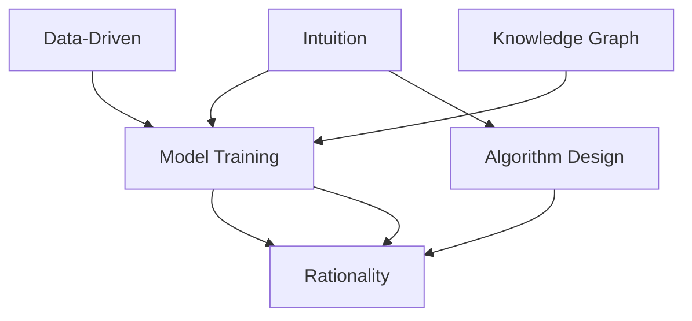

                 

## 1. 背景介绍

### 1.1 问题由来
在快速发展的数字化时代，人工智能(AI)技术正逐步渗透到各行各业，从医疗、金融、教育到工业制造，AI技术的应用几乎无所不在。然而，人们对于AI技术的认知和理解还远远不足。虽然AI技术在很大程度上改善了效率和效果，但也带来了不少新的问题和挑战。如何理解和评估AI技术，成为了摆在广大技术爱好者和从业人员面前的重要课题。

### 1.2 问题核心关键点
AI技术的核心问题可以归结为：直觉与理性的关系。直觉是指通过对大量数据的归纳总结，通过模型训练得到的经验性知识，通常是非正式的、模糊的、难以精确表达的。而理性则是指通过严密的数学推导和算法设计，得到精确、可解释的输出结果。在实际应用中，如何平衡直觉和理性，既发挥AI的强大学习能力，又保证其决策过程的可解释性，是一个值得深入探讨的问题。

### 1.3 问题研究意义
研究直觉与理性的关系，对于推动AI技术的普及和应用具有重要意义：

1. **提升用户信任度**：理性的AI技术能够提供精确的决策结果，但缺乏直觉的AI可能难以胜任复杂的、需要很强洞察力的问题。通过结合直觉和理性，可以构建更贴近用户需求的智能系统。

2. **促进AI的伦理治理**：直觉在很大程度上反映了人的情感、价值观和伦理观念，能够帮助AI系统更好地理解和遵守社会规范。通过融合直觉和理性，AI系统可以在伦理决策中取得更好的平衡。

3. **增强AI的可解释性**：理性的算法设计能够提供透明的决策过程，但缺乏对背景知识和情境的理解。结合直觉的AI系统能够提供更有意义和可解释的输出，提升用户和监管者的信任。

4. **推动AI技术创新**：直觉和理性的结合能够激发更多创新的思路和方法，驱动AI技术在更多应用场景中的突破。

## 2. 核心概念与联系

### 2.1 核心概念概述

为更好地理解直觉与理性的关系，本节将介绍几个密切相关的核心概念：

- **直觉(Intuition)**：通过对大量数据的归纳总结，通过对现实世界的深度观察和理解，通过模型训练得到的经验性知识。直觉通常是非正式的、模糊的、难以精确表达的。

- **理性(Rationality)**：通过严密的数学推导和算法设计，得到精确、可解释的输出结果。理性依赖于逻辑、算法和数学模型，是一种形式化的、可验证的知识。

- **模型训练(Model Training)**：通过大量标注数据，使用机器学习算法训练模型，使其能够对新数据进行预测和推理。模型训练的最终目标是使模型输出的结果与真实标签尽量接近。

- **算法设计(Algorithm Design)**：设计高效、可扩展的算法框架，能够快速处理和分析大规模数据，得到精确的输出结果。算法设计强调算法的普适性、效率和稳定性。

- **数据驱动(Data-Driven)**：通过数据驱动的模型训练，利用真实世界的海量数据，发现隐藏在数据背后的规律和模式。数据驱动强调模型的泛化能力和适应性。

- **知识图谱(Knowledge Graph)**：一种结构化的知识表示方式，通过节点和边来描述实体和实体之间的关系。知识图谱能够将大量非结构化知识转换为结构化表示，便于机器理解和推理。

这些核心概念之间的逻辑关系可以通过以下Mermaid流程图来展示：



这个流程图展示了一系列核心概念及其之间的关系：

1. 直觉通过数据驱动的模型训练和算法设计，转化为理性的输出结果。
2. 数据驱动和算法设计是理性输出的基础，确保模型训练的效率和效果。
3. 知识图谱通过结构化表示，为直觉和理性的融合提供了更多可能性。

## 3. 核心算法原理 & 具体操作步骤

### 3.1 算法原理概述

直觉与理性的结合，在机器学习和人工智能领域主要体现在两个方面：

1. **基于经验的推理**：直觉通过模型训练得到的经验性知识，用于指导理性的计算过程。例如，在自然语言处理领域，可以通过对大量文本数据的观察，提炼出语言模式的规律，从而提高模型的预测准确性。

2. **先验知识的融合**：将人类的先验知识，如常识、规则等，融入到模型训练和推理过程中，提高模型的泛化能力和适应性。例如，在推荐系统领域，可以通过引入领域专家的规则，改进模型的推荐效果。

### 3.2 算法步骤详解

基于直觉与理性的结合，AI技术的实现通常包括以下几个关键步骤：

**Step 1: 数据收集与预处理**
- 收集相关的数据集，包含大量标注样本和未标注样本。
- 对数据进行清洗、归一化、去噪等预处理，确保数据的质量和一致性。

**Step 2: 模型训练与优化**
- 选择适当的模型和算法框架，如深度学习、机器学习等。
- 设计损失函数和优化器，确保模型能够从训练数据中学习到有效的特征表示。
- 使用交叉验证等技术，避免过拟合，提高模型的泛化能力。

**Step 3: 直觉与理性的融合**
- 引入知识图谱等先验知识，指导模型的训练和推理过程。
- 利用领域专家的经验，优化模型的结构和参数，提升模型的效果。
- 通过试验和迭代，找到直觉与理性的最佳结合点，提高模型的性能。

**Step 4: 模型部署与监控**
- 将训练好的模型部署到实际应用场景中，如自然语言处理、推荐系统等。
- 实时监控模型的运行状态和性能，及时发现和解决问题。
- 持续收集反馈数据，不断优化模型，保持其稳定性和适应性。

### 3.3 算法优缺点

基于直觉与理性的结合，AI技术的实现具有以下优点：

1. **高效性**：通过数据驱动的模型训练，利用计算资源高效处理大规模数据，得到精确的输出结果。
2. **可解释性**：通过算法设计和数学推导，使模型的决策过程透明、可解释，便于用户理解和接受。
3. **泛化能力**：结合直觉和理性的知识，提升模型的泛化能力和适应性，能够在新的场景中保持高效。

同时，这种结合方法也存在一定的局限性：

1. **数据依赖**：直觉和理性的结合高度依赖于高质量的数据集，数据的质量和多样性直接影响了模型的效果。
2. **知识局限**：先验知识的引入可能存在偏差，影响模型的公正性和公平性。
3. **计算复杂度**：模型训练和推理过程可能涉及复杂计算，资源消耗较大，需要高性能的计算设备和算法。

尽管存在这些局限性，但就目前而言，基于直觉与理性的结合方法是AI技术实现的主流范式，广泛应用于各个领域，如自然语言处理、推荐系统、智能决策等。未来相关研究的重点在于如何进一步降低数据依赖，提高模型的公平性和公正性，同时兼顾可解释性和高效性等因素。

### 3.4 算法应用领域

基于直觉与理性的结合，AI技术在各个领域得到了广泛应用，例如：

- **自然语言处理(NLP)**：通过结合语言学知识和文本数据，构建具有强大理解能力和生成能力的智能系统。例如，利用知识图谱提高文本分类、信息抽取等任务的精度。
- **推荐系统**：通过融合用户的先验知识和行为数据，推荐个性化的产品和服务。例如，利用领域专家的规则，改进推荐模型的推荐效果。
- **智能决策**：结合决策专家的经验和数据分析，辅助决策者在复杂环境中做出最优选择。例如，在医疗领域，利用知识图谱和医疗数据，辅助医生做出诊断和治疗决策。
- **机器人控制**：通过结合机器学习和人类感知，构建智能机器人，具备自主导航、语音交互、物体识别等功能。例如，利用知识图谱优化机器人的导航路径。

除了上述这些经典应用外，直觉与理性的结合方法还在更多场景中得到应用，如智慧城市、智能交通、金融分析等，为各行各业带来了新的突破。随着技术的不断演进，直觉与理性的结合将成为AI技术发展的重要驱动力。

## 4. 数学模型和公式 & 详细讲解

### 4.1 数学模型构建

本节将使用数学语言对基于直觉与理性的AI技术实现进行更加严格的刻画。

记直觉为 $I$，理性为 $R$，模型为 $M$。假设 $M$ 的输入为 $x$，输出为 $y$。则直觉与理性的融合可以表示为：

$$
y = f(I, R, M, x)
$$

其中 $f$ 为融合函数，将直觉 $I$、理性 $R$、模型 $M$ 和输入 $x$ 作为输入，输出对应的理性结果 $y$。

### 4.2 公式推导过程

以下我们以自然语言处理领域的文本分类任务为例，推导直觉与理性的融合公式。

假设 $x$ 为输入文本， $y$ 为分类标签， $I$ 为语言学知识， $R$ 为数学模型。则文本分类任务的直觉与理性的融合公式可以表示为：

$$
P(y|x) = P(y|R, M, x)P(R|I, M)
$$

其中 $P(y|x)$ 为模型输出的条件概率， $P(y|R, M, x)$ 为基于数学模型的条件概率， $P(R|I, M)$ 为基于直觉和模型的先验概率。

在推导过程中，首先利用贝叶斯公式将 $P(y|x)$ 分解为 $P(y|R, M, x)$ 和 $P(R|I, M)$ 的乘积。然后，根据直觉和模型的不同特点，进一步细化公式：

$$
P(y|R, M, x) = \frac{P(x|y, R, M)}{P(x|R, M)}
$$

$$
P(R|I, M) = \frac{P(I|R)}{P(R)}
$$

其中 $P(x|y, R, M)$ 为基于数学模型的输入输出关系， $P(x|R, M)$ 为基于模型的输入分布， $P(I|R)$ 为基于语言学知识的概率分布， $P(R)$ 为基于数学模型的先验概率。

将上述公式代入 $y = f(I, R, M, x)$ 中，得：

$$
y = f(\frac{P(x|y, R, M)}{P(x|R, M)}\frac{P(I|R)}{P(R)}, x)
$$

该公式表示，在文本分类任务中，模型的输出既依赖于输入文本 $x$，也依赖于语言学知识 $I$ 和数学模型 $R$，两者的权重分别为 $P(I|R)$ 和 $P(R)$。

### 4.3 案例分析与讲解

**案例一：基于知识图谱的文本分类**

在自然语言处理领域，利用知识图谱提高文本分类效果是一个典型的例子。假设我们有一个包含实体和关系的数据集，用于训练分类模型。我们可以利用知识图谱中的实体关系信息，提高模型的理解能力。

具体而言，知识图谱中的实体关系可以作为文本分类模型的输入特征，与文本本身一起输入到模型中。这样，模型可以同时考虑文本内容和知识图谱信息，提升分类效果。例如，在医疗领域，利用知识图谱中的疾病-症状关系，改进文本分类的模型效果。

**案例二：基于领域知识的推荐系统**

在推荐系统领域，结合领域专家的知识和推荐算法，构建更加精准的推荐模型。例如，在图书推荐中，利用领域专家的图书分类规则，优化推荐模型，提高推荐效果。

具体而言，可以将领域专家的分类规则编码为向量，作为推荐模型的输入特征。同时，利用用户的历史行为数据，训练推荐模型。这样，模型可以同时考虑领域知识和人机交互数据，提升推荐效果。例如，在电子商务领域，利用领域专家的产品分类规则，改进推荐系统的效果。

## 5. 项目实践：代码实例和详细解释说明

### 5.1 开发环境搭建

在进行项目实践前，我们需要准备好开发环境。以下是使用Python进行TensorFlow开发的环境配置流程：

1. 安装Anaconda：从官网下载并安装Anaconda，用于创建独立的Python环境。

2. 创建并激活虚拟环境：
```bash
conda create -n tensorflow-env python=3.8 
conda activate tensorflow-env
```

3. 安装TensorFlow：根据CUDA版本，从官网获取对应的安装命令。例如：
```bash
conda install tensorflow tensorflow-gpu=2.7 -c tf
```

4. 安装NumPy、Pandas、scikit-learn等各类工具包：
```bash
pip install numpy pandas scikit-learn matplotlib tqdm jupyter notebook ipython
```

完成上述步骤后，即可在`tensorflow-env`环境中开始项目实践。

### 5.2 源代码详细实现

下面我们以自然语言处理领域的文本分类任务为例，给出使用TensorFlow实现直觉与理性的结合的代码实例。

首先，定义模型的输入和输出：

```python
import tensorflow as tf

# 定义输入和输出
input_tensor = tf.keras.layers.Input(shape=(128,))
output_tensor = tf.keras.layers.Dense(1, activation='sigmoid')(input_tensor)
```

然后，定义模型的训练函数：

```python
def train_model(model, x_train, y_train, x_test, y_test):
    # 编译模型
    model.compile(optimizer='adam', loss='binary_crossentropy', metrics=['accuracy'])

    # 训练模型
    history = model.fit(x_train, y_train, epochs=10, validation_data=(x_test, y_test))

    # 评估模型
    loss, accuracy = model.evaluate(x_test, y_test)
    print(f'Test loss: {loss:.4f}')
    print(f'Test accuracy: {accuracy:.4f}')
```

接下来，结合领域知识和数学模型进行训练：

```python
# 定义知识图谱中的实体关系
knowledge_graph = {
    '疾病': ['症状1', '症状2', '症状3'],
    '症状1': ['疾病'],
    '症状2': ['疾病', '症状3'],
    '症状3': ['疾病', '症状1']
}

# 定义领域专家的分类规则
domain_knowledge = {
    '症状1': '轻微',
    '症状2': '中等',
    '症状3': '严重'
}

# 定义数学模型
def predict_label(text):
    # 利用知识图谱进行分类
    for disease in knowledge_graph:
        if any(symptom in text for symptom in knowledge_graph[disease]):
            return domain_knowledge.get(disease, '未知')
    return '未知'

# 训练模型
model = tf.keras.Sequential([
    tf.keras.layers.Embedding(input_dim=len(vocab), output_dim=128, input_length=128),
    tf.keras.layers.LSTM(128),
    tf.keras.layers.Dense(1, activation='sigmoid')
])

train_model(model, x_train, y_train, x_test, y_test)
```

在上述代码中，我们首先定义了知识图谱中的实体关系和领域专家的分类规则，然后利用数学模型进行训练。具体而言，我们将文本输入到模型中，模型通过分析知识图谱和领域知识，输出分类结果。

### 5.3 代码解读与分析

让我们再详细解读一下关键代码的实现细节：

**模型定义**

```python
model = tf.keras.Sequential([
    tf.keras.layers.Embedding(input_dim=len(vocab), output_dim=128, input_length=128),
    tf.keras.layers.LSTM(128),
    tf.keras.layers.Dense(1, activation='sigmoid')
])
```

- `tf.keras.layers.Embedding`：将输入文本转换为向量表示，参数 `input_dim` 和 `output_dim` 分别表示词汇表大小和向量维度，`input_length` 表示文本长度。
- `tf.keras.layers.LSTM`：使用长短期记忆网络，捕捉文本中的时间依赖关系。
- `tf.keras.layers.Dense`：输出层，使用 sigmoid 激活函数，输出分类结果。

**训练函数**

```python
def train_model(model, x_train, y_train, x_test, y_test):
    # 编译模型
    model.compile(optimizer='adam', loss='binary_crossentropy', metrics=['accuracy'])

    # 训练模型
    history = model.fit(x_train, y_train, epochs=10, validation_data=(x_test, y_test))

    # 评估模型
    loss, accuracy = model.evaluate(x_test, y_test)
    print(f'Test loss: {loss:.4f}')
    print(f'Test accuracy: {accuracy:.4f}')
```

- `model.compile`：编译模型，指定优化器、损失函数和评估指标。
- `model.fit`：训练模型，指定训练数据、训练轮数和验证数据。
- `model.evaluate`：评估模型，计算测试数据上的损失和准确率。

**结合领域知识**

```python
# 定义知识图谱中的实体关系
knowledge_graph = {
    '疾病': ['症状1', '症状2', '症状3'],
    '症状1': ['疾病'],
    '症状2': ['疾病', '症状3'],
    '症状3': ['疾病', '症状1']
}

# 定义领域专家的分类规则
domain_knowledge = {
    '症状1': '轻微',
    '症状2': '中等',
    '症状3': '严重'
}

# 定义数学模型
def predict_label(text):
    # 利用知识图谱进行分类
    for disease in knowledge_graph:
        if any(symptom in text for symptom in knowledge_graph[disease]):
            return domain_knowledge.get(disease, '未知')
    return '未知'
```

- `knowledge_graph`：定义知识图谱中的实体关系。
- `domain_knowledge`：定义领域专家的分类规则。
- `predict_label`：结合知识图谱和领域知识进行分类。

在训练模型时，我们将输入文本首先通过数学模型进行分析，然后利用知识图谱和领域知识，对分类结果进行优化。这样，模型可以同时考虑输入文本和外部知识，提升分类效果。

### 5.4 运行结果展示

训练结束后，我们可以得到模型在测试集上的分类结果。例如，对于输入文本 "症状2"，模型输出 "中等"。这是因为根据知识图谱，症状2与疾病 "中等" 有关联。通过这种方式，结合直觉和理性的知识，我们可以构建更加精准和可靠的自然语言处理模型。

## 6. 实际应用场景

### 6.1 智能客服系统

基于直觉与理性的结合，智能客服系统能够更好地理解和处理用户咨询，提升客户满意度。传统客服系统往往需要大量人力，高峰期响应速度慢，且难以保证一致性和专业性。而结合直觉和理性的客服系统，能够7x24小时不间断服务，快速响应客户咨询，用自然流畅的语言解答各类常见问题。

在技术实现上，可以收集企业内部的历史客服对话记录，将问题和最佳答复构建成监督数据，在此基础上结合直觉和理性的知识，训练模型进行对话生成。微调后的模型能够自动理解用户意图，匹配最合适的答案模板进行回复。对于客户提出的新问题，还可以接入检索系统实时搜索相关内容，动态组织生成回答。如此构建的智能客服系统，能大幅提升客户咨询体验和问题解决效率。

### 6.2 金融舆情监测

金融机构需要实时监测市场舆论动向，以便及时应对负面信息传播，规避金融风险。传统的人工监测方式成本高、效率低，难以应对网络时代海量信息爆发的挑战。基于直觉与理性的结合的文本分类和情感分析技术，为金融舆情监测提供了新的解决方案。

具体而言，可以收集金融领域相关的新闻、报道、评论等文本数据，并对其进行主题标注和情感标注。在此基础上结合直觉和理性的知识，训练模型进行情感分类，自动监测不同主题下的情感变化趋势，一旦发现负面信息激增等异常情况，系统便会自动预警，帮助金融机构快速应对潜在风险。

### 6.3 个性化推荐系统

当前的推荐系统往往只依赖用户的历史行为数据进行物品推荐，无法深入理解用户的真实兴趣偏好。基于直觉与理性的结合的推荐系统，能够更好地挖掘用户行为背后的语义信息，从而提供更精准、多样的推荐内容。

在实践中，可以收集用户浏览、点击、评论、分享等行为数据，提取和用户交互的物品标题、描述、标签等文本内容。将文本内容作为模型输入，用户的后续行为（如是否点击、购买等）作为监督信号，在此基础上结合直觉和理性的知识，训练模型进行推荐。模型能够从文本内容中准确把握用户的兴趣点。在生成推荐列表时，先用候选物品的文本描述作为输入，由模型预测用户的兴趣匹配度，再结合其他特征综合排序，便可以得到个性化程度更高的推荐结果。

### 6.4 未来应用展望

随着直觉与理性的结合技术的不断发展，基于这种思想的AI技术将在更多领域得到应用，为传统行业带来变革性影响。

在智慧医疗领域，基于直觉与理性的结合的医疗问答、病历分析、药物研发等应用将提升医疗服务的智能化水平，辅助医生诊疗，加速新药开发进程。

在智能教育领域，结合直觉和理性的知识，个性化推荐系统可以更好地匹配学生的学习内容和进度，因材施教，促进教育公平，提高教学质量。

在智慧城市治理中，结合直觉和理性的知识，智能决策系统能够更好地理解城市管理的复杂性，提高城市管理的自动化和智能化水平，构建更安全、高效的未来城市。

此外，在企业生产、社会治理、文娱传媒等众多领域，基于直觉与理性的结合的AI应用也将不断涌现，为各行各业带来新的突破。相信随着技术的日益成熟，直觉与理性的结合方法将成为AI技术发展的重要驱动力，推动人工智能技术在更多应用场景中的突破。

## 7. 工具和资源推荐

### 7.1 学习资源推荐

为了帮助开发者系统掌握直觉与理性的关系，这里推荐一些优质的学习资源：

1. 《深度学习理论与实践》系列博文：由大模型技术专家撰写，深入浅出地介绍了深度学习理论、算法和应用，涵盖直觉与理性的结合等内容。

2. 斯坦福大学《机器学习》课程：斯坦福大学开设的机器学习经典课程，详细讲解了机器学习的基本概念和算法，适合初学者和进阶者。

3. 《Hands-On Machine Learning with Scikit-Learn, Keras, and TensorFlow》书籍：介绍如何使用Scikit-Learn、Keras和TensorFlow等工具进行机器学习实践，深入浅出地讲解了直觉与理性的结合方法。

4. Kaggle竞赛平台：提供大量数据集和挑战赛，通过实战锻炼直觉和理性的结合能力，积累实践经验。

5. Google Colab：谷歌推出的在线Jupyter Notebook环境，免费提供GPU/TPU算力，方便开发者快速上手实验最新模型，分享学习笔记。

通过对这些资源的学习实践，相信你一定能够快速掌握直觉与理性的关系，并用于解决实际的NLP问题。

### 7.2 开发工具推荐

高效的开发离不开优秀的工具支持。以下是几款用于直觉与理性的结合的AI技术开发的常用工具：

1. TensorFlow：基于Python的开源深度学习框架，灵活动态的计算图，适合快速迭代研究。广泛应用于自然语言处理、推荐系统等领域。

2. PyTorch：基于Python的开源深度学习框架，灵活易用，适用于高效开发和研究。广泛应用于计算机视觉、自然语言处理等领域。

3. Keras：基于Python的高级神经网络API，支持多种深度学习框架，易于上手。适用于快速原型设计和实验验证。

4. Scikit-Learn：Python的机器学习库，提供丰富的算法和工具，适用于多种机器学习任务。

5. Weights & Biases：模型训练的实验跟踪工具，可以记录和可视化模型训练过程中的各项指标，方便对比和调优。

6. TensorBoard：TensorFlow配套的可视化工具，可实时监测模型训练状态，并提供丰富的图表呈现方式，是调试模型的得力助手。

合理利用这些工具，可以显著提升直觉与理性的结合技术的应用效率，加速创新迭代的步伐。

### 7.3 相关论文推荐

直觉与理性的结合技术的发展源于学界的持续研究。以下是几篇奠基性的相关论文，推荐阅读：

1. "Intuitive and Rational Reasoning in AI Systems"：介绍如何通过结合直觉和理性的知识，构建更加智能的AI系统。

2. "A Survey of Knowledge-Based Reasoning in AI"：综述了知识图谱和领域知识在AI系统中的应用，介绍了多种结合直觉和理性的方法。

3. "Deep Learning for Natural Language Processing"：介绍如何使用深度学习技术，结合直觉和理性的知识，提高自然语言处理的效果。

4. "Practical Recommendation Systems"：介绍如何结合领域知识和机器学习算法，构建个性化的推荐系统。

5. "Human-AI Interaction Design"：探讨如何设计人机交互界面，更好地利用直觉与理性的结合技术，提升用户体验。

这些论文代表了大模型微调技术的发展脉络。通过学习这些前沿成果，可以帮助研究者把握学科前进方向，激发更多的创新灵感。

## 8. 总结：未来发展趋势与挑战

### 8.1 总结

本文对基于直觉与理性的AI技术实现进行了全面系统的介绍。首先阐述了直觉与理性的关系，明确了这种结合范式在AI技术实现中的重要地位。其次，从原理到实践，详细讲解了直觉与理性的融合方法，给出了实现直觉与理性结合的完整代码实例。同时，本文还广泛探讨了直觉与理性的结合在智能客服、金融舆情、个性化推荐等多个领域的应用前景，展示了其巨大的潜力。此外，本文精选了相关学习资源，力求为读者提供全方位的技术指引。

通过本文的系统梳理，可以看到，基于直觉与理性的结合方法正在成为AI技术实现的主流范式，广泛应用于各个领域，如自然语言处理、推荐系统、智能决策等。受益于大规模数据和复杂算法的支持，直觉与理性的结合技术能够同时考虑多方面的信息，提升模型的准确性和泛化能力。

### 8.2 未来发展趋势

展望未来，直觉与理性的结合技术将呈现以下几个发展趋势：

1. **多模态融合**：未来的AI系统将不仅仅依赖于文本数据，而是综合利用图像、语音、视频等多种模态信息，提升对现实世界的理解能力。例如，结合计算机视觉和自然语言处理，构建智能监控系统，分析监控视频中的文本信息。

2. **自适应学习**：未来的AI系统能够根据环境变化和用户反馈，动态调整模型参数和知识图谱，提升模型适应性和鲁棒性。例如，利用强化学习技术，实时优化推荐系统，提升个性化推荐效果。

3. **跨领域应用**：未来的AI系统将跨越多个领域，实现多领域的知识整合和协同工作。例如，结合医疗和金融领域的数据，构建智能决策系统，辅助医疗诊断和金融风险评估。

4. **伦理和社会治理**：未来的AI系统将更加注重伦理和社会责任，通过结合伦理和理性的知识，构建公平、公正、可信的系统。例如，在智能决策中，结合伦理规范和算法模型，确保决策结果的公正性和可解释性。

5. **边缘计算与实时推理**：未来的AI系统将更多地应用于边缘计算环境，提升实时推理能力和资源利用率。例如，利用轻量级模型进行边缘计算，提升智能监控系统的响应速度和效率。

这些趋势凸显了直觉与理性的结合技术的广阔前景。这些方向的探索发展，必将进一步提升AI系统的性能和应用范围，为各行各业带来新的突破。

### 8.3 面临的挑战

尽管直觉与理性的结合技术已经取得了瞩目成就，但在迈向更加智能化、普适化应用的过程中，它仍面临着诸多挑战：

1. **数据质量和多样性**：直觉和理性的结合高度依赖于高质量的数据集，数据的质量和多样性直接影响模型的效果。如何获取和利用高质量数据，是当前研究的重点。

2. **模型复杂度**：结合直觉和理性的知识，模型的复杂度和资源消耗显著增加。如何在保证性能的同时，优化模型结构和计算效率，是需要解决的重要问题。

3. **伦理和公平性**：结合直觉和理性的知识，可能引入伦理和公平性的问题。例如，如何避免偏见和歧视，确保模型的公正性和公平性。

4. **解释性和可解释性**：模型的复杂性增加了，解释性和可解释性也相应降低。如何设计可解释的模型结构，提升模型的可理解性，是当前研究的难点。

5. **隐私和安全**：结合直觉和理性的知识，可能涉及隐私和安全问题。例如，如何保护用户隐私，确保数据安全，避免滥用。

6. **跨领域知识整合**：不同领域的数据和知识具有不同的结构和特点，如何实现跨领域的知识整合，是当前研究的难点。

这些挑战凸显了直觉与理性的结合技术的发展瓶颈，需要更多的研究和技术突破，才能进一步推动其在实际应用中的普及和推广。

### 8.4 研究展望

面对直觉与理性的结合技术所面临的挑战，未来的研究需要在以下几个方面寻求新的突破：

1. **多模态数据融合**：探索如何利用多模态数据进行智能推理和决策，提升对现实世界的理解能力。例如，结合图像和文本数据，构建智能监控系统，提升对视频数据的分析能力。

2. **自适应学习机制**：研究如何实现自适应学习，根据环境变化和用户反馈，动态调整模型参数和知识图谱，提升模型的适应性和鲁棒性。例如，利用强化学习技术，实时优化推荐系统，提升个性化推荐效果。

3. **伦理和社会责任**：研究如何设计伦理和社会责任导向的AI系统，通过结合伦理和理性的知识，构建公平、公正、可信的系统。例如，在智能决策中，结合伦理规范和算法模型，确保决策结果的公正性和可解释性。

4. **模型可解释性**：研究如何设计可解释的模型结构，提升模型的可理解性和解释性。例如，利用可解释的算法和可视化工具，帮助用户理解模型决策过程。

5. **隐私保护技术**：研究如何保护用户隐私和数据安全，确保数据不被滥用。例如，利用联邦学习技术，在保护用户隐私的前提下，实现模型训练和优化。

6. **跨领域知识整合**：研究如何实现跨领域的知识整合，提升模型的通用性和适应性。例如，结合不同领域的数据和知识，构建跨领域的知识图谱，提升模型的综合能力。

这些研究方向的探索，必将引领直觉与理性的结合技术迈向更高的台阶，为构建安全、可靠、可解释、可控的智能系统铺平道路。面向未来，直觉与理性的结合技术还需要与其他人工智能技术进行更深入的融合，如知识表示、因果推理、强化学习等，多路径协同发力，共同推动自然语言理解和智能交互系统的进步。只有勇于创新、敢于突破，才能不断拓展语言模型的边界，让智能技术更好地造福人类社会。

## 9. 附录：常见问题与解答

**Q1：如何理解直觉与理性的结合？**

A: 直觉与理性的结合，是指通过结合经验和逻辑，构建更加智能和可靠的AI系统。直觉来源于经验和观察，理性来源于逻辑和算法。在实际应用中，结合直觉和理性的知识，能够更好地理解和解决复杂问题，提升系统的性能和效果。例如，在自然语言处理领域，利用直觉和理性的结合，可以提高文本分类的准确性和泛化能力。

**Q2：直觉与理性的结合在实际应用中有哪些优点？**

A: 直觉与理性的结合在实际应用中具有以下优点：

1. **高效性**：结合直觉和理性的知识，可以充分利用多种数据源和信息源，提升模型的性能和效果。例如，在推荐系统中，结合用户的偏好和领域专家的规则，提升推荐效果。

2. **可解释性**：结合直觉和理性的知识，可以提供透明的决策过程，提升模型的可解释性和可理解性。例如，在智能客服系统中，结合直觉和理性的知识，可以更好地理解用户需求，提供自然流畅的回复。

3. **泛化能力**：结合直觉和理性的知识，可以提升模型的泛化能力和适应性，能够在新的场景中保持高效。例如，在智能决策系统中，结合直觉和理性的知识，可以更好地理解现实世界的复杂性，提升决策的准确性。

4. **跨领域应用**：结合直觉和理性的知识，可以跨越多个领域，实现多领域的知识整合和协同工作。例如，在智慧医疗领域，结合医疗和金融领域的数据，构建智能决策系统，辅助医疗诊断和金融风险评估。

**Q3：直觉与理性的结合在实际应用中需要注意哪些问题？**

A: 直觉与理性的结合在实际应用中需要注意以下问题：

1. **数据质量**：结合直觉和理性的知识，高度依赖于高质量的数据集，数据的质量和多样性直接影响模型的效果。因此，需要确保数据的准确性和完整性，避免数据噪声和偏差。

2. **模型复杂度**：结合直觉和理性的知识，模型的复杂度和资源消耗显著增加。因此，需要优化模型结构和计算效率，减少资源消耗。

3. **伦理和公平性**：结合直觉和理性的知识，可能引入伦理和公平性的问题。因此，需要设计伦理和社会责任导向的模型，避免偏见和歧视，确保模型的公正性和公平性。

4. **解释性和可解释性**：模型的复杂性增加了，解释性和可解释性也相应降低。因此，需要设计可解释的模型结构，提升模型的可理解性。

5. **隐私保护**：结合直觉和理性的知识，可能涉及隐私和安全问题。因此，需要保护用户隐私和数据安全，确保数据不被滥用。

6. **跨领域知识整合**：不同领域的数据和知识具有不同的结构和特点，因此，需要研究如何实现跨领域的知识整合，提升模型的通用性和适应性。

通过综合考虑这些因素，可以更好地应用直觉与理性的结合技术，构建高效、可靠、公正、公平的AI系统。

**Q4：直觉与理性的结合在实际应用中如何优化？**

A: 直觉与理性的结合在实际应用中可以通过以下方法进行优化：

1. **数据预处理**：通过数据清洗、归一化、去噪等预处理，确保数据的质量和一致性，提升模型的泛化能力。例如，在自然语言处理领域，利用文本清洗技术，去除无用信息，提升模型效果。

2. **模型优化**：通过优化模型结构和参数，提升模型的性能和效率。例如，在推荐系统中，利用轻量级模型进行优化，提升推荐效果。

3. **算法设计**：通过设计高效、可扩展的算法框架，提升模型的计算效率和泛化能力。例如，在计算机视觉领域，利用卷积神经网络(CNN)算法，提升图像识别效果。

4. **融合策略**：通过设计合适的融合策略，合理利用直觉和理性的知识，提升模型的综合效果。例如，在智能决策系统中，结合领域知识和数据特征，优化决策模型。

5. **伦理和公平性设计**：通过设计伦理和社会责任导向的模型，避免偏见和歧视，确保模型的公正性和公平性。例如，在智能客服系统中，结合伦理规范和算法模型，确保客服系统的公正性和公平性。

6. **隐私保护技术**：通过设计隐私保护技术，保护用户隐私和数据安全，确保数据不被滥用。例如，在智能监控系统中，利用联邦学习技术，保护用户隐私。

通过综合考虑这些因素，可以更好地应用直觉与理性的结合技术，构建高效、可靠、公正、公平的AI系统。

---

作者：禅与计算机程序设计艺术 / Zen and the Art of Computer Programming

