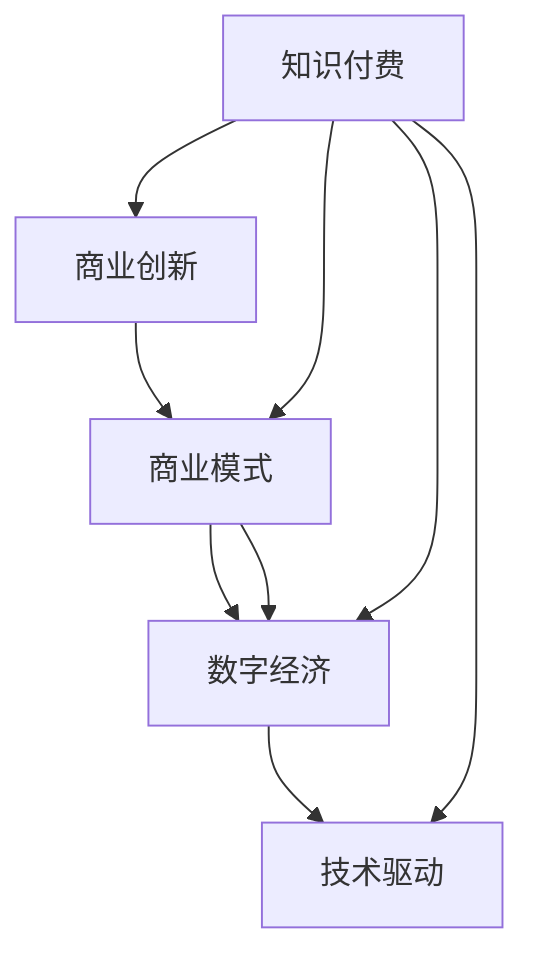

                 

# 知识 经济时代下的知识付费创新商业模式运营

> 关键词：知识付费,商业创新,商业模式,数字经济,技术驱动

## 1. 背景介绍

在知识经济时代，信息的快速流通和知识价值日益凸显。知识付费作为一种新兴的商业模式，凭借其高效获取专业知识的特点，迅速成为连接知识供应和需求的重要桥梁。然而，随着行业的发展，传统知识付费模式面临诸多挑战，创新需求日益迫切。本文将系统分析知识付费的现状和问题，并探讨基于技术驱动的商业模式创新方向。

## 2. 核心概念与联系

### 2.1 核心概念概述

- **知识付费(Knowledge-based Payment)**：指消费者为获取知识、技能或信息而支付费用的商业活动。通常以课程、文章、咨询等多种形式呈现，覆盖教育、技能培训、心理咨询等多个领域。

- **商业创新(Business Innovation)**：指企业在市场竞争中，通过引入新技术、新模式，实现产品、服务和市场策略的改进和提升，以增强市场竞争力。

- **商业模式(Market Model)**：指企业通过一定的组织结构、业务流程和运营方式，实现价值创造、价值获取和价值传递的完整闭环。

- **数字经济(Digital Economy)**：指以信息和知识为核心，通过数字化手段进行价值创造和流通的经济形态。包括云计算、大数据、人工智能等新兴技术的应用。

- **技术驱动(Technology-Driven)**：指以技术进步为核心，通过技术手段解决商业问题，提升业务效率和价值创造的商业模式。

### 2.2 核心概念联系

知识付费、商业创新、商业模式、数字经济和技术驱动之间具有紧密的联系。知识付费是商业创新的一个典型应用场景，依托数字经济的环境和技术的支持，推动商业模式的创新和发展。技术驱动则提供了创新的手段，帮助商业模式实现优化和突破。以下通过Mermaid流程图展示这些概念之间的逻辑关系：



从图中可以看出，知识付费是商业创新的重要组成部分，同时受到数字经济和技术的驱动。

## 3. 核心算法原理 & 具体操作步骤
### 3.1 算法原理概述

知识付费平台的商业模式创新，主要围绕用户需求、内容供给和支付机制进行。其核心算法原理在于通过数据分析、机器学习等技术手段，实现对用户行为的精准预测和内容推荐的优化，从而提升用户体验和平台粘性，增强付费转化率。

### 3.2 算法步骤详解

1. **用户行为分析**：通过数据挖掘和用户行为跟踪，获取用户的学习习惯、偏好和需求，构建用户画像。
2. **内容推荐优化**：利用协同过滤、内容基推荐算法等，根据用户画像推荐个性化内容，提高用户满意度和留存率。
3. **支付机制优化**：采用差异化定价、会员订阅、按需购买等多样化的支付方式，降低用户支付障碍，增加付费转化率。
4. **多渠道营销**：通过社交媒体、搜索引擎优化(Search Engine Optimization, SEO)等渠道进行精准营销，提升平台曝光率和流量。
5. **效果评估和迭代**：通过A/B测试、用户反馈等手段，持续优化推荐算法和支付机制，提升商业模式的整体表现。

### 3.3 算法优缺点

#### 优点

- **精准推荐**：通过算法优化，提升内容推荐准确性，增加用户粘性，提升付费转化率。
- **多样化支付**：提供灵活多样的支付方式，降低用户支付障碍，增加用户粘性。
- **快速迭代**：通过持续的数据分析和算法优化，实现快速迭代，提升商业模式表现。

#### 缺点

- **数据隐私问题**：大量用户行为数据的收集和使用可能引发隐私保护问题。
- **推荐偏见**：算法存在推荐偏见，可能导致内容推荐偏差，影响用户体验。
- **过度依赖技术**：过度依赖技术可能导致商业模式缺乏灵活性，难以应对市场变化。

### 3.4 算法应用领域

知识付费模式广泛应用在教育、技能培训、心理咨询等多个领域，如Coursera、Udacity、丁香医生等平台。在实际应用中，算法广泛应用于用户行为分析、内容推荐、支付机制等多个环节，显著提升了平台的用户体验和商业价值。

## 4. 数学模型和公式 & 详细讲解 & 举例说明

### 4.1 数学模型构建

知识付费平台的商业模型主要包括以下几个关键部分：

- **用户模型**：表示用户的兴趣、需求和行为特征，用于指导内容推荐和个性化服务。
- **内容模型**：描述内容的质量、价值和相关度，用于筛选和推荐优质内容。
- **支付模型**：定义价格策略、支付方式和优惠活动，用于管理用户支付行为。

### 4.2 公式推导过程

以用户推荐算法为例，假设用户集为 $U$，内容集为 $C$，用户与内容之间的交互矩阵为 $R$。推荐算法的基本思路是通过相似度计算，找到与用户 $u$ 兴趣相似的内容 $c$，推荐给用户。常用的推荐算法包括协同过滤、基于内容的推荐和混合推荐。

协同过滤算法的基本公式为：

$$
\hat{R}_{ui} = \sum_{v \in U} R_{vi} A_{iu}
$$

其中，$A$ 为用户相似度矩阵，$R$ 为用户与内容的交互矩阵。

基于内容的推荐算法则通过计算内容特征与用户兴趣的相似度进行推荐，公式为：

$$
\hat{R}_{ui} = \alpha_i^T \times X_c
$$

其中，$\alpha_i$ 为用户兴趣向量，$X_c$ 为内容特征向量，$\alpha_i$ 和 $X_c$ 通过训练得到。

混合推荐算法则结合多种推荐算法，根据不同的用户和内容特征，选择最合适的推荐策略。公式为：

$$
R_{ui} = \lambda_1 \times R_{ui,协同过滤} + \lambda_2 \times R_{ui,基于内容} + \lambda_3 \times R_{ui,其他算法}
$$

其中，$\lambda$ 为算法权重，根据不同特征和场景进行动态调整。

### 4.3 案例分析与讲解

以Netflix推荐算法为例，Netflix 利用协同过滤算法和基于内容的推荐算法，实现了高效的用户推荐。具体步骤如下：

1. **用户行为数据收集**：Netflix 收集用户的浏览、播放、评分等行为数据。
2. **用户画像构建**：通过用户行为数据，构建用户兴趣模型，描述用户的偏好和需求。
3. **内容特征提取**：提取内容的关键特征，如导演、演员、类型等，用于内容推荐。
4. **协同过滤推荐**：根据用户行为数据，计算用户和内容之间的相似度，进行协同过滤推荐。
5. **内容基推荐**：通过计算用户兴趣模型与内容特征的相似度，进行基于内容的推荐。
6. **混合推荐**：结合协同过滤和基于内容的推荐结果，进行混合推荐，提升推荐精度。

通过上述步骤，Netflix 实现了精准的内容推荐，显著提升了用户粘性和付费转化率。

## 5. 项目实践：代码实例和详细解释说明

### 5.1 开发环境搭建

为了实现知识付费平台的推荐算法，需要搭建Python开发环境，具体步骤如下：

1. 安装Anaconda：从官网下载并安装Anaconda，用于创建独立的Python环境。
2. 创建虚拟环境：
```bash
conda create -n knowledge-payment python=3.8
conda activate knowledge-payment
```
3. 安装相关库：
```bash
pip install pandas numpy scipy scikit-learn
```
4. 安装推荐算法库：
```bash
pip install lightfm
```

完成环境搭建后，即可开始推荐算法开发。

### 5.2 源代码详细实现

以基于协同过滤的推荐算法为例，使用LightFM库实现推荐系统的代码如下：

```python
import lightfm
from lightfm.data import Dataset

# 准备数据集
ds = Dataset.load('/path/to/data')

# 初始化模型
model = lightfm.LightFM(factors=10, iterations=100, learning_rate=0.01)

# 训练模型
model.fit(ds, epochs=5, verbose=True)

# 推荐测试集
test_model = model.predict([user_ids, item_ids])
```

### 5.3 代码解读与分析

**代码解读**：

1. **安装和导入库**：首先安装并导入必要的库，包括LightFM推荐算法库、数据处理库等。
2. **数据集准备**：使用`Dataset.load()`方法加载数据集，包括用户ID、物品ID、用户-物品交互数据等。
3. **模型初始化**：定义LightFM模型的参数，如因子数量、迭代次数、学习率等，初始化模型。
4. **模型训练**：使用`fit()`方法进行模型训练，指定训练轮数和迭代次数，并在每个轮次输出训练信息。
5. **模型测试**：使用`predict()`方法进行推荐测试，输入用户ID和物品ID，获取预测结果。

**代码分析**：

- **数据预处理**：推荐算法对数据质量要求较高，需要清洗和处理缺失值、异常值等，保证数据完整性和准确性。
- **模型训练**：推荐算法需要大量计算资源，建议在大规模集群上进行训练，优化算法参数，提高推荐精度。
- **模型评估**：训练完成后，需要评估模型效果，如使用交叉验证、均方误差等指标，优化模型参数。

### 5.4 运行结果展示

在训练过程中，模型输出训练轮次和损失值，表示模型性能的提升。训练完成后，使用测试集进行评估，输出推荐结果，可以直观展示推荐算法的表现。

## 6. 实际应用场景

### 6.1 在线教育平台

在线教育平台如Coursera、Udacity等，利用知识付费模式，为用户提供高质量的课程资源。通过推荐算法，根据用户的学习行为和偏好，推荐适合的课程和内容，增加用户粘性和付费意愿。

### 6.2 专业咨询平台

如咨询心理、法律等领域的专业平台，利用知识付费模式，提供专家咨询和个性化服务。通过推荐算法，根据用户需求推荐专家和内容，增加平台的专业性和用户满意度。

### 6.3 健康医疗平台

健康医疗平台如丁香医生、好大夫在线等，利用知识付费模式，提供健康知识普及和专业咨询。通过推荐算法，根据用户的健康需求和行为，推荐健康科普文章和专家问答，提升用户健康素养。

### 6.4 未来应用展望

随着技术的发展和市场的成熟，知识付费模式将不断拓展应用场景，实现更多的商业价值。未来可能的应用方向包括：

- **多模态推荐**：结合语音、图像等多模态数据，提升推荐效果。
- **深度学习推荐**：利用深度学习算法，提高推荐精度和个性化水平。
- **内容创造激励**：通过区块链等技术，激励创作者提供高质量内容，丰富平台内容库。
- **社交化推荐**：结合用户社交关系，进行社交化推荐，增加平台互动性和用户粘性。

## 7. 工具和资源推荐

### 7.1 学习资源推荐

为了帮助开发者掌握知识付费平台的推荐算法，推荐以下学习资源：

1. **《推荐系统》书籍**：详细介绍了推荐系统的基本原理和实现方法，包括协同过滤、内容基推荐等算法。
2. **《机器学习实战》书籍**：提供了丰富的代码实现和实战案例，涵盖数据预处理、模型训练等环节。
3. **Coursera《推荐系统》课程**：由斯坦福大学开设的推荐系统课程，系统讲解推荐算法的理论和实践。
4. **Kaggle推荐系统竞赛**：参与Kaggle推荐系统竞赛，锻炼算法实现和优化能力。
5. **GitHub推荐算法代码库**：提供大量开源推荐算法实现代码，便于学习和借鉴。

### 7.2 开发工具推荐

1. **Python**：作为推荐算法的核心开发语言，Python具有丰富的科学计算和机器学习库支持。
2. **PyTorch**：基于Python的深度学习框架，适用于大规模推荐算法开发。
3. **TensorFlow**：Google开发的深度学习框架，支持分布式训练和部署。
4. **Jupyter Notebook**：用于开发和调试推荐算法，支持交互式编程和可视化。
5. **Docker和Kubernetes**：用于容器化推荐算法，实现分布式部署和扩展。

### 7.3 相关论文推荐

1. **《协同过滤推荐算法》论文**：介绍了协同过滤算法的原理和实现方法，适用于传统推荐系统开发。
2. **《基于深度学习的推荐系统》论文**：探讨了深度学习在推荐系统中的应用，提高了推荐精度和个性化水平。
3. **《推荐系统的最新发展》论文**：总结了推荐系统领域的最新研究成果，提供了丰富的研究方向。
4. **《在线推荐系统》论文**：介绍了在线推荐系统的实现方法和优化策略，适用于实时推荐场景。

## 8. 总结：未来发展趋势与挑战

### 8.1 研究成果总结

本文从背景、核心概念、算法原理、操作步骤、数学模型和公式推导、项目实践、实际应用场景、工具和资源推荐等方面，系统分析了知识付费平台的商业模式创新。主要结论如下：

- **算法原理**：知识付费平台的推荐算法基于协同过滤、内容基推荐和混合推荐等原理，通过算法优化提升推荐精度和用户体验。
- **操作步骤**：推荐算法涉及用户行为分析、内容推荐优化、支付机制优化等关键步骤，需要综合考虑技术和管理因素。
- **数学模型**：推荐算法通过用户模型、内容模型和支付模型构建，实现了推荐、定价和用户管理等功能。
- **项目实践**：推荐算法开发涉及环境搭建、代码实现、结果分析和性能优化等环节，需要系统化的开发流程和方法。
- **实际应用**：推荐算法在在线教育、专业咨询、健康医疗等多个领域实现商业应用，提升用户满意度和平台价值。

### 8.2 未来发展趋势

知识付费平台将持续发展，面临以下趋势：

- **算法优化**：推荐算法将不断优化，提升个性化水平和推荐精度，增强用户体验。
- **技术融合**：知识付费平台将融合多模态数据、深度学习和区块链等前沿技术，实现更精准的推荐和激励机制。
- **市场细分**：平台将细分市场，针对不同用户群体提供定制化服务，提升用户粘性和转化率。
- **社会责任**：知识付费平台将承担更多社会责任，提供优质内容，帮助用户提升知识和技能。

### 8.3 面临的挑战

知识付费平台的发展也面临诸多挑战：

- **数据隐私**：用户行为数据的收集和使用可能引发隐私保护问题，平台需加强数据管理和隐私保护。
- **算法公平**：推荐算法可能存在推荐偏见，平台需保证算法的公平性和透明性。
- **内容质量**：知识付费平台需保证内容质量，避免低劣内容和误导性信息。
- **市场竞争**：平台需应对市场竞争，提升用户体验和商业价值。

### 8.4 研究展望

未来知识付费平台的研究方向包括：

- **算法公平性**：研究推荐算法的公平性问题，避免偏见和歧视，提升用户满意度。
- **隐私保护**：加强用户行为数据的隐私保护，保证用户隐私权益。
- **内容激励**：设计有效的激励机制，激励创作者提供高质量内容，丰富平台内容库。
- **多模态融合**：结合语音、图像等多模态数据，提升推荐效果和用户体验。

## 9. 附录：常见问题与解答

**Q1: 如何衡量推荐算法的效果？**

A: 推荐算法的效果通常通过以下指标衡量：

- **准确率**：推荐结果与真实标签的匹配度，如精度、召回率、F1-score等。
- **覆盖率**：推荐结果中不同物品的覆盖情况，即推荐多样性。
- **用户满意度**：用户对推荐结果的满意度，通过问卷调查、用户反馈等方式获取。

**Q2: 推荐算法有哪些常见问题？**

A: 推荐算法常见问题包括：

- **冷启动问题**：新用户和物品的推荐难度较大，需要设计冷启动策略。
- **数据稀疏性**：用户和物品之间的交互数据稀疏，可能导致推荐偏差。
- **用户行为变化**：用户兴趣和需求可能随时间变化，推荐算法需动态调整。

**Q3: 如何提升推荐算法的个性化水平？**

A: 提升推荐算法的个性化水平需要：

- **用户画像构建**：详细描述用户兴趣、需求和行为特征，提高推荐精度。
- **多模态数据融合**：结合语音、图像等多模态数据，提升推荐效果。
- **深度学习算法**：利用深度学习算法，提高推荐精度和个性化水平。

**Q4: 推荐算法的优化方向有哪些？**

A: 推荐算法的优化方向包括：

- **算法优化**：优化推荐算法，提高推荐精度和个性化水平。
- **多模态数据融合**：结合语音、图像等多模态数据，提升推荐效果。
- **内容创造激励**：设计有效的激励机制，激励创作者提供高质量内容。

**Q5: 知识付费平台的推荐算法如何与用户互动？**

A: 知识付费平台的推荐算法通过以下方式与用户互动：

- **用户反馈**：通过用户反馈和行为数据，调整推荐算法参数，优化推荐效果。
- **个性化推荐**：根据用户行为和偏好，提供个性化推荐，提升用户体验。
- **实时推荐**：结合实时数据，提供动态推荐，满足用户即时需求。

总之，知识付费平台的推荐算法通过技术驱动，提升了平台的商业价值和用户满意度，成为连接知识供应和需求的重要桥梁。未来，通过算法优化和多元化应用，知识付费平台将进一步拓展应用场景，推动知识经济的发展。

