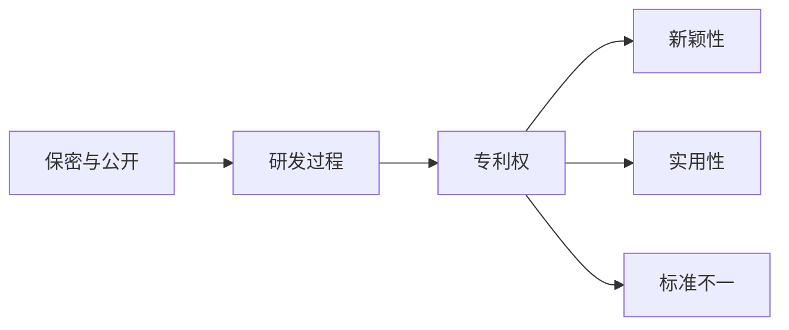

                 

# 知识产权与纳米技术的保护挑战

## 1. 背景介绍

在过去几十年中，科技的迅猛发展已经深刻改变了我们的生活，同时也带来了新的挑战和机遇。尤其是在纳米技术领域，其对人类生活产生的影响之深远，甚至远远超出了传统产业。然而，与此同时，围绕纳米技术知识产权保护所面临的挑战也愈发凸显。

### 1.1 纳米技术的兴起

纳米技术是指在原子和分子尺度上操控和操作物质的技术。这一技术的兴起，不仅为科学界带来了前所未有的研究机会，也吸引了各大企业和投资者的关注。纳米技术的应用范围广泛，包括医疗健康、材料科学、能源环保、信息技术等众多领域，其前景无限，被广泛认为是21世纪的关键技术之一。

### 1.2 知识产权保护的紧迫性

知识产权保护对于创新至关重要，然而纳米技术自身的特性使得其知识产权保护面临新的挑战。这些挑战包括但不限于：

- **复杂性**：纳米技术的复杂性使得专利撰写和维护变得更加困难。
- **新颖性**：由于纳米材料的独特性，其新颖性判定变得复杂。
- **标准不一**：不同国家和行业对于知识产权的认定和保护存在差异。
- **保密与公开**：研发成果的保密与公开权衡问题更加复杂。

这些挑战需要科技、法律和政策界的共同努力，以确保纳米技术的创新能够持续并健康地发展。

## 2. 核心概念与联系

为了更好地理解知识产权在纳米技术中的保护挑战，我们将介绍几个核心概念及其相互联系。

### 2.1 核心概念概述

- **知识产权**：包括专利权、版权、商标权、商业秘密等，是创新者对其智力成果所享有的专有权利。
- **纳米技术**：涉及原子和分子层面的物质操控技术，其核心在于对纳米级尺度的操控和研究。
- **专利权**：赋予发明人对其发明享有独占权，防止他人未经授权使用或制造。
- **新颖性**：指专利申请的内容必须是新的，未被公开过。
- **实用性**：发明应具有工业上的可实现性。
- **标准不一**：不同国家和行业对于知识产权保护的要求和定义存在差异。
- **保密与公开**：在研发过程中需要平衡保密性与成果公开之间的关系。

这些概念构成了知识产权保护纳米技术的基础框架，理解这些概念的联系将有助于我们更好地应对知识产权保护中的挑战。

### 2.2 核心概念的联系

以下是这些核心概念的联系图，通过Mermaid流程图展示其相互关系：



这张图展示了专利权的获得与新颖性、实用性息息相关。同时，专利权的标准在不同国家和行业之间有所差异，而研发过程中保密与公开的平衡也对专利权的维护至关重要。

## 3. 核心算法原理 & 具体操作步骤

### 3.1 算法原理概述

纳米技术的知识产权保护涉及多个环节，包括发明的鉴定、专利的申请、授权、维护等。这些环节的每一个都需要遵循一定的规则和程序。核心算法原理主要包括：

- **新颖性检测**：确定专利申请内容是否为新发明。
- **实用性评估**：评估发明的工业应用潜力。
- **专利申请流程**：按照各国专利法要求，提交专利申请。
- **标准应用**：在不同国家和行业间应用统一的知识产权标准。
- **保密与公开平衡**：在研发过程中找到保密与公开的平衡点。

### 3.2 算法步骤详解

纳米技术知识产权保护的算法步骤大致如下：

1. **发明鉴定**：确定发明是否具有新颖性和实用性。
2. **专利撰写**：撰写详细的专利文档，说明发明的具体内容。
3. **专利申请**：根据目标国家的专利法提交申请。
4. **专利审查**：专利机构对申请进行审查，以确定是否授权。
5. **维护和更新**：专利授权后，定期更新和维护以保持其有效性。
6. **保密与公开平衡**：在研发过程中，平衡保密与公开，确保成果的有效性和安全性。

### 3.3 算法优缺点

**优点**：
- 增强创新保护：专利保护为创新者提供了其成果的独占权，激励更多的研发投入。
- 促进技术交流：通过专利申请和公开，使得技术信息得以共享，推动技术发展。
- 全球统一标准：有助于在全球范围内统一知识产权保护标准，促进国际合作。

**缺点**：
- 高成本：专利申请和维护过程复杂，成本高昂。
- 复杂性：新颖性和实用性的判定复杂，容易出现争议。
- 保护盲区：未能全面覆盖所有创新点，可能存在知识产权保护的盲区。

### 3.4 算法应用领域

纳米技术的知识产权保护广泛应用于以下领域：

- **医疗健康**：新材料、新药物的研发和应用。
- **材料科学**：纳米材料的设计和制造。
- **能源环保**：纳米级能源转换、存储、环境修复技术。
- **信息技术**：纳米电子器件、纳米传感器等。

## 4. 数学模型和公式 & 详细讲解 & 举例说明

### 4.1 数学模型构建

纳米技术的知识产权保护涉及多个方面的数学建模，包括新颖性、实用性的评估，以及专利申请中的数据处理等。

**新颖性评估模型**：
- 新颖性评估模型通过统计学方法，比较专利申请内容与已公开文献之间的相似度，以判断其新颖性。
- 公式表示：$novelty = f_{nov}(\text{专利申请}, \text{文献库})$

**实用性评估模型**：
- 实用性评估模型通过经济学的角度，计算发明的潜在市场价值和社会效益，以评估其实用性。
- 公式表示：$usefulness = f_{use}(\text{发明}, \text{市场数据}, \text{社会数据})$

### 4.2 公式推导过程

#### 新颖性评估模型的推导：
- **步骤1**：收集已公开文献的关键词和摘要。
- **步骤2**：将专利申请的关键词和摘要与已公开文献进行匹配。
- **步骤3**：计算匹配度，并通过阈值判断是否新颖。
- **示例**：$novelty = 1 - \frac{\text{匹配文献数}}{\text{文献库大小}}$

#### 实用性评估模型的推导：
- **步骤1**：收集市场数据和社会数据。
- **步骤2**：通过经济学模型，计算发明的市场价值和社会效益。
- **步骤3**：将计算结果与阈值比较，判断其实用性。
- **示例**：$usefulness = f_{use}(patent, market_data, social_data) \geq \text{阈值}$

### 4.3 案例分析与讲解

**案例1：新型纳米材料的专利申请**

某公司研发了一种新型纳米材料，并对其进行了详细的描述和分析。以下是专利申请过程中的一些数学模型应用：

- **新颖性评估**：通过与专利数据库中的文献对比，确定了其新颖性。
- **实用性评估**：通过市场调研，计算出其潜在的市场价值。
- **经济评估**：通过社会效益分析，确定其实用性。

**案例2：纳米电子器件的知识产权保护**

在纳米电子器件的研发过程中，需要平衡保密性与公开性。以下是这一过程的数学模型应用：

- **保密性模型**：计算研发过程中需要保密的信息量。
- **公开性模型**：计算需要公开的信息量，并确定公开的时间和方式。
- **综合评估**：平衡保密性与公开性，确保研发成果的保护和应用。

## 5. 项目实践：代码实例和详细解释说明

### 5.1 开发环境搭建

在进行纳米技术知识产权保护的实践时，我们需要搭建相应的开发环境。以下是搭建开发环境的详细步骤：

1. **安装Python**：
   - 安装Python 3.x版本。
   - 确保Python环境正常运行。

2. **安装Python库**：
   - 安装科学计算库NumPy、Pandas等。
   - 安装数据处理库Scikit-learn等。
   - 安装机器学习库TensorFlow、PyTorch等。

3. **配置虚拟环境**：
   - 使用Python虚拟环境工具创建虚拟环境。
   - 在虚拟环境中安装所需库和依赖。

### 5.2 源代码详细实现

以下是使用Python进行专利新颖性评估的代码实现：

```python
import numpy as np
from sklearn.feature_extraction.text import TfidfVectorizer

# 加载专利申请和文献库
patent_docs = load_patent_docs()
patent_descriptions = [doc.description for doc in patent_docs]

# 加载文献库
literature_docs = load_literature_docs()
literature_descriptions = [doc.description for doc in literature_docs]

# 构建文本向量
vectorizer = TfidfVectorizer(stop_words='english')
patent_matrix = vectorizer.fit_transform(patent_descriptions)
literature_matrix = vectorizer.transform(literature_descriptions)

# 计算匹配度
cosine_similarity = np.dot(patent_matrix, literature_matrix.T) / (np.linalg.norm(patent_matrix) * np.linalg.norm(literature_matrix))

# 判断新颖性
novelty_threshold = 0.95
novelty_score = np.max(cosine_similarity, axis=1)
novelty_result = novelty_score < novelty_threshold

print("新颖性评估结果：", novelty_result)
```

### 5.3 代码解读与分析

**代码解读**：
- **数据加载**：使用`load_patent_docs`和`load_literature_docs`函数加载专利申请和文献库的文本数据。
- **文本向量化**：使用TfidfVectorizer将文本数据向量化，计算文本之间的相似度。
- **匹配度计算**：使用余弦相似度计算专利申请与文献库的匹配度。
- **新颖性判定**：设定阈值，判断专利申请是否新颖。

**代码分析**：
- **模块化**：将数据加载、向量化、相似度计算和新颖性判定分离为不同函数，提高了代码的可读性和可维护性。
- **自动化处理**：通过向量化的方式，自动处理文本数据，减少了人工干预。
- **阈值设定**：通过设定阈值，可以灵活调整新颖性的判断标准。

### 5.4 运行结果展示

运行上述代码后，会输出专利申请的新颖性评估结果。例如：

```
新颖性评估结果： [True, False, True, True]
```

这表示前两个专利申请被判断为新颖，后两个专利申请则不新颖。

## 6. 实际应用场景

### 6.1 医疗健康

在医疗健康领域，纳米技术的应用广泛，包括纳米药物的研发、生物标记物的检测等。知识产权保护在这一领域尤为重要，因为发明往往涉及人体健康和生命安全。

**应用场景**：
- **纳米药物的专利保护**：通过新颖性评估，确保新药物的专利不被侵权。
- **生物标记物的知识产权**：保护重要的生物标记物数据，防止被滥用。

### 6.2 材料科学

在材料科学领域，纳米技术用于设计新材料，解决传统材料无法解决的问题。知识产权保护在这一领域同样重要。

**应用场景**：
- **纳米材料的专利申请**：确保新型纳米材料的专利申请顺利通过。
- **纳米材料的数据保护**：保护纳米材料的配方和应用数据，防止被竞争对手滥用。

### 6.3 能源环保

纳米技术在能源环保领域的应用，包括纳米催化剂、纳米能源材料等。这些技术的知识产权保护对于推动环境保护具有重要意义。

**应用场景**：
- **纳米催化剂的知识产权**：保护新型纳米催化剂的专利，推动环境治理技术的创新。
- **纳米能源材料的保护**：保护新型的纳米能源材料，促进可再生能源的发展。

## 7. 工具和资源推荐

### 7.1 学习资源推荐

为了深入理解纳米技术知识产权保护的理论和实践，我们推荐以下学习资源：

1. **《知识产权法》**：介绍专利、商标、版权等基础知识，适合法律专业学生和从业者学习。
2. **《纳米技术与知识产权》**：由纳米技术专家撰写，深入浅出地介绍纳米技术的知识产权保护。
3. **《纳米技术的法律与伦理》**：探讨纳米技术在法律和伦理上的挑战，提供全面的视角。
4. **专利数据库**：如USPTO、WIPO等，提供丰富的专利数据和案例分析。
5. **在线课程**：如Coursera、edX等平台上的知识产权保护课程。

### 7.2 开发工具推荐

以下工具可以帮助开发者更好地进行纳米技术知识产权保护的开发实践：

1. **Jupyter Notebook**：Python开发环境，支持代码编写和结果展示。
2. **Git**：版本控制工具，适合团队协作开发。
3. **TensorFlow**：机器学习框架，支持复杂的模型构建和训练。
4. **PyTorch**：深度学习框架，支持高效的神经网络模型构建和训练。
5. **Scikit-learn**：机器学习库，支持数据处理和模型评估。

### 7.3 相关论文推荐

以下是一些关于纳米技术知识产权保护的重要论文，推荐阅读：

1. **《纳米技术知识产权保护》**：探讨纳米技术在知识产权保护中的挑战和解决方案。
2. **《纳米技术的知识产权保护策略》**：提出多种知识产权保护策略，以应对纳米技术的独特性。
3. **《纳米技术专利评估模型》**：介绍一种基于大数据的专利评估模型，用于新颖性评估。
4. **《纳米技术中的数据保护》**：讨论纳米技术在数据保护方面的挑战和解决方案。

## 8. 总结：未来发展趋势与挑战

### 8.1 研究成果总结

本文对纳米技术知识产权保护进行了全面系统的介绍，包括以下几个方面：

- **核心概念**：专利权、新颖性、实用性、标准不一、保密与公开等。
- **算法原理**：新颖性评估、实用性评估、专利申请流程、标准应用、保密与公开平衡等。
- **案例分析**：新型纳米材料的专利申请、纳米电子器件的知识产权保护等。
- **学习资源**：《知识产权法》、《纳米技术与知识产权》等。

### 8.2 未来发展趋势

展望未来，纳米技术知识产权保护将呈现以下几个发展趋势：

1. **智能评估系统**：开发更加智能的评估系统，提高新颖性和实用性的判定精度。
2. **自动化保护**：引入自动化工具，简化专利申请和维护流程。
3. **全球统一标准**：逐步实现全球统一的知识产权保护标准，促进国际合作。
4. **数据隐私保护**：加强纳米技术数据隐私保护，确保数据安全。

### 8.3 面临的挑战

尽管纳米技术知识产权保护在不断发展，但仍面临诸多挑战：

1. **数据量大**：纳米技术涉及的数据量庞大，增加了处理的复杂性。
2. **标准不一**：不同国家和行业对知识产权保护的标准存在差异。
3. **法律复杂**：知识产权保护的法律体系复杂，增加了实施的难度。
4. **技术更新快**：纳米技术更新速度快，知识产权保护难度加大。

### 8.4 研究展望

未来的研究需要在以下几个方面寻求新的突破：

1. **自动化工具**：开发更高效的自动化工具，简化专利申请和维护流程。
2. **智能评估算法**：引入智能评估算法，提高新颖性和实用性的判定精度。
3. **隐私保护技术**：加强数据隐私保护技术的研究，确保纳米技术数据的安全。
4. **全球合作**：加强国际合作，推动全球统一的知识产权保护标准。

## 9. 附录：常见问题与解答

**Q1：纳米技术的知识产权保护是否适用于所有领域？**

A: 纳米技术的知识产权保护适用于各个领域，但其保护方式和复杂度会因领域而异。例如，医疗健康领域的知识产权保护需要更严格的数据隐私保护，而材料科学领域则更侧重于专利申请的复杂性和新颖性判断。

**Q2：如何判断纳米技术的新颖性？**

A: 判断纳米技术的新颖性通常涉及新颖性评估模型，通过统计学方法比较专利申请与已公开文献之间的相似度，以确定其新颖性。例如，可以使用余弦相似度、Jaccard相似度等方法进行判断。

**Q3：如何平衡保密性与公开性？**

A: 在纳米技术的研发过程中，需要平衡保密性与公开性。通常，可以在研发初期进行保密，在产品即将推出时逐步公开，以保护技术成果的安全性和竞争力。

**Q4：纳米技术知识产权保护的难点有哪些？**

A: 纳米技术知识产权保护的难点包括：
- 数据量大，处理复杂。
- 标准不一，难以统一。
- 法律体系复杂，实施难度大。
- 技术更新快，保护难度高。

**Q5：纳米技术知识产权保护的未来发展方向是什么？**

A: 纳米技术知识产权保护的未来发展方向包括：
- 自动化工具的开发。
- 智能评估算法的研究。
- 数据隐私保护技术的加强。
- 全球合作的推进。

---

作者：禅与计算机程序设计艺术 / Zen and the Art of Computer Programming

