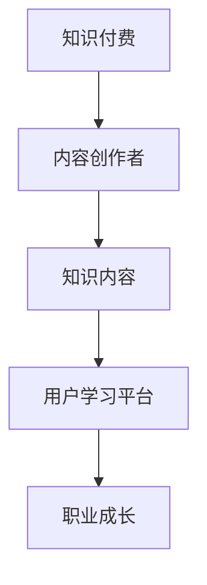

                 

## 1. 背景介绍

### 1.1 问题由来
随着互联网和信息技术的飞速发展，程序员已成为驱动社会进步的关键力量。然而，伴随着技术的快速迭代，程序员面临知识更新的巨大挑战。传统的自驱动学习方式已难以满足职业成长的需求，急需一种更加高效、系统化的知识获取和技能提升方法。知识付费作为一种新兴的学习模式，为程序员提供了全新的知识获取途径。

### 1.2 问题核心关键点
知识付费的本质在于通过付费方式获取知识，以加速个人学习与成长。这种模式通过为高质量知识内容提供价格支持，不仅降低了获取知识的门槛，还保证了内容的质量与及时性。

对于程序员而言，知识付费不仅能带来即时的知识和技能提升，还能促进职业发展，形成个人成长的良性循环。具体而言：

- **加速职业发展**：知识付费平台汇集了顶尖技术专家，程序员通过系统化学习最新技术，能够在短时间内获得职业能力的质的提升。
- **构建职业网络**：知识付费平台往往有活跃的社区和互动机制，程序员能与行业内的高手交流，拓展职业人脉。
- **保持学习动力**：付费的投入使得知识获取更加正式和有保障，提高学习的自我驱动力和坚持度。

### 1.3 问题研究意义
知识付费不仅为程序员提供了系统、专业的知识学习路径，还助力他们在职业竞争中保持领先地位。通过高质量、有保障的知识获取方式，程序员能够更好地适应技术变革，增强职业稳定性。

此外，知识付费模式也为平台和内容创作者带来可观的经济收益，形成双赢的良性循环。在信息过载的时代，如何精准对接高质量内容，构建有效的知识获取系统，是当前亟待解决的问题。

## 2. 核心概念与联系

### 2.1 核心概念概述

为更好地理解知识付费的原理和架构，本节将介绍几个核心概念：

- **知识付费**：指通过付费方式获取专业知识的平台化服务。用户为高质量知识内容支付费用，获取个性化、系统的学习资源。
- **内容创作者**：包括技术专家、产品经理、开发者等，通过撰写书籍、博客、视频等形式，提供有价值的学习资料。
- **知识内容**：包括文字、视频、音频等多种形式的专家分享，旨在系统、深入地讲解某一领域的知识体系。
- **用户学习平台**：即知识付费平台，为用户提供知识内容的订阅、搜索、互动等服务。
- **职业成长**：指通过系统学习，提升个人技术水平、管理能力、团队协作能力等，实现职业晋升和个人发展。

这些核心概念之间的逻辑关系可以通过以下Mermaid流程图来展示：



这个流程图展示了知识付费的核心流程：

1. 知识付费平台整合内容创作者提供的高质量内容。
2. 用户通过平台订阅和搜索，获取知识内容。
3. 知识内容帮助用户提升技术水平，促进职业成长。

## 3. 核心算法原理 & 具体操作步骤
### 3.1 算法原理概述

知识付费的学习过程，本质上是一种针对特定技能提升的系统化学习。其核心思想是通过付费购买平台服务，获取有价值、高效的知识内容，加速个人学习与成长。

一般而言，知识付费的学习流程包括以下几个步骤：

1. **目标设定**：明确学习的目标和方向，如掌握某项技术、了解某一行业背景等。
2. **内容选择**：根据目标选择合适的学习资源，如技术书籍、在线课程、实践项目等。
3. **资源获取**：通过平台订阅或购买，获取相关知识内容。
4. **内容消费**：系统学习知识内容，记录学习笔记、完成实践作业等。
5. **知识应用**：将所学知识应用到实际工作中，形成知识闭环。
6. **反馈与迭代**：根据实际工作反馈，不断调整学习计划和目标，形成持续改进的循环。

### 3.2 算法步骤详解

下面以技术书籍学习为例，详细讲解知识付费的学习算法步骤。

#### Step 1: 目标设定

明确学习的目标，如掌握深度学习框架TensorFlow，或了解机器学习的最新进展。具体学习目标可以包含以下几个方面：

- 理论知识：掌握TensorFlow的基本概念、核心算法、常见应用等。
- 实践技能：能独立完成TensorFlow项目，解决实际业务问题。
- 持续学习：定期更新学习内容，了解最新技术动态。

#### Step 2: 内容选择

根据目标选择合适的书籍。可以按照以下几个维度选择：

- 书籍难易度：选择适合自己技术水平的书籍，避免过于简单或复杂。
- 内容相关性：选择与目标最相关的书籍，如TensorFlow官方文档、权威技术书籍等。
- 作者可信度：选择知名作者或领域内权威人士撰写的书籍，保证内容质量。
- 书籍评价：通过书籍评价、用户评论等了解书籍的受欢迎程度和实用性。

#### Step 3: 资源获取

通过知识付费平台购买或订阅书籍。具体步骤包括：

- 注册平台账号，进行支付。
- 选择目标书籍，进行购买或订阅。
- 获取电子书或电子课程，安装学习应用或工具。
- 检查购买记录，确保资源到位。

#### Step 4: 内容消费

系统学习书籍内容，记录笔记、完成作业等。具体步骤如下：

- 制定学习计划：划分每天的学习时间和任务，逐步完成书籍内容。
- 阅读书籍内容：逐章逐节阅读，重点标记难点和疑问。
- 完成学习作业：通过平台提供的习题或项目练习，加深理解。
- 记录学习笔记：将学习过程中的心得、代码、思路等记录下来，便于复习。

#### Step 5: 知识应用

将所学知识应用到实际工作中，形成知识闭环。具体步骤包括：

- 实践项目：选择实际项目，应用TensorFlow解决业务问题。
- 团队协作：与团队成员讨论，分享学习成果和经验。
- 优化改进：根据项目反馈，优化改进所学知识。
- 持续更新：定期回顾学习内容，更新知识体系。

#### Step 6: 反馈与迭代

根据实际工作反馈，不断调整学习计划和目标，形成持续改进的循环。具体步骤包括：

- 收集反馈：通过项目评审、同事反馈等方式，收集项目中的问题和技术难点。
- 分析问题：分析问题根源，确定需要进一步学习的内容。
- 调整计划：根据分析结果，调整学习计划和目标，增加学习难度或深度。
- 迭代优化：在实际工作中不断应用所学知识，不断优化改进。

### 3.3 算法优缺点

知识付费的学习方法具有以下优点：

- **高效系统**：平台提供的系统化学习资源，能帮助程序员快速提升技能，避免盲目自学。
- **资源丰富**：平台汇集了大量高水平的内容创作者，提供了丰富的学习资源，覆盖多个技术领域。
- **质量保障**：付费机制保证了内容质量，避免低质量或误导性内容的出现。
- **互动便捷**：平台提供互动功能，如在线讨论、导师答疑等，方便用户学习交流。

同时，该方法也存在一些局限：

- **费用投入**：知识付费需要一定的经济投入，不适合所有人群。
- **学习依赖**：过于依赖平台和书籍内容，缺乏自主探索和创新能力。
- **适用范围**：知识付费主要适用于技术知识的学习，对于软技能提升如沟通能力、团队协作能力等效果有限。

### 3.4 算法应用领域

知识付费的学习方法，在技术领域尤其是编程、数据科学、人工智能等技术密集型行业中，已得到广泛应用。具体应用领域包括：

- **技术培训**：编程语言学习、数据结构与算法、云计算、大数据等技术培训。
- **项目实践**：通过平台提供的实战项目，提升项目管理和开发能力。
- **职业转型**：通过学习新领域知识，实现职业转型和岗位晋升。
- **持续学习**：通过定期更新学习内容，保持技术前沿，应对职业发展需求。
- **技术管理**：了解技术管理知识和实践，提升技术团队管理能力。

## 4. 数学模型和公式 & 详细讲解  
### 4.1 数学模型构建

知识付费的学习效果，可以通过以下数学模型来刻画：

设目标为掌握某项技能，内容为学习资源，用户为个人，则学习效果 $R$ 可以表示为：

$$
R = f(S, P)
$$

其中，$S$ 表示内容资源，$P$ 表示个人学习行为。

对于每一项内容资源 $s_i$，其学习效果 $r_i$ 可以表示为：

$$
r_i = \lambda_1 f_{\theta_1}(s_i) + \lambda_2 f_{\theta_2}(s_i) + \lambda_3 f_{\theta_3}(s_i)
$$

其中，$f_{\theta_1}$、$f_{\theta_2}$、$f_{\theta_3}$ 分别表示内容资源的理论价值、应用价值和互动价值，$\lambda_1$、$\lambda_2$、$\lambda_3$ 为权重系数。

个人学习行为 $p_i$ 可以表示为：

$$
p_i = \mu_1 f_{\mu_1}(t_i) + \mu_2 f_{\mu_2}(t_i) + \mu_3 f_{\mu_3}(t_i)
$$

其中，$f_{\mu_1}$、$f_{\mu_2}$、$f_{\mu_3}$ 分别表示学习计划、学习效率和互动频率，$\mu_1$、$\mu_2$、$\mu_3$ 为权重系数。

最终的总体学习效果 $R$ 可以表示为：

$$
R = \sum_{i=1}^n r_i p_i
$$

其中 $n$ 为内容资源的数量。

### 4.2 公式推导过程

以学习TensorFlow为例，推导学习效果模型：

- **内容资源的理论价值 $f_{\theta_1}(s_i)$**：
  - 书籍 $s_{\text{book}}$：包含理论知识、概念讲解、代码示例等，评分 $f_{\text{book}}$。
  - 视频课程 $s_{\text{video}}$：提供讲解、演示、实例分析等，评分 $f_{\text{video}}$。
  - 在线讨论 $s_{\text{discuss}}$：提供互动、答疑、交流等，评分 $f_{\text{discuss}}$。

- **个人学习行为 $p_i$**：
  - 学习计划 $p_{\text{plan}}$：划分每天的学习时间和任务，评分 $f_{\text{plan}}$。
  - 学习效率 $p_{\text{efficiency}}$：记录学习时间、笔记完成度等，评分 $f_{\text{efficiency}}$。
  - 互动频率 $p_{\text{frequency}}$：参与讨论、提问、反馈等，评分 $f_{\text{frequency}}$。

综合考虑各因素，学习效果 $R$ 可以表示为：

$$
R = (\lambda_1 f_{\text{book}} + \lambda_2 f_{\text{video}} + \lambda_3 f_{\text{discuss}}) \times (\mu_1 f_{\text{plan}} + \mu_2 f_{\text{efficiency}} + \mu_3 f_{\text{frequency}})
$$

### 4.3 案例分析与讲解

以学习TensorFlow为例，分析学习效果的影响因素：

- **内容资源的理论价值**：优秀的书籍和视频课程能够提供系统的理论知识，但互动不足，学习效率可能较低。
- **内容资源的互动价值**：在线讨论和社区互动能够提供及时答疑和交流，但内容深度有限，需要进一步学习。
- **个人学习行为**：合理的学习计划和高效的学习效率，能够提升学习效果，但互动不足。

通过分析不同因素对学习效果的影响，可以进一步优化学习策略，提高学习效果。

## 5. 项目实践：代码实例和详细解释说明
### 5.1 开发环境搭建

在进行知识付费学习实践前，我们需要准备好开发环境。以下是使用Python进行知识付费学习环境搭建的步骤：

1. 安装Anaconda：从官网下载并安装Anaconda，用于创建独立的Python环境。

2. 创建并激活虚拟环境：
```bash
conda create -n study-env python=3.8 
conda activate study-env
```

3. 安装必要的学习平台和应用：
```bash
pip install webbrowser
```

4. 安装Git：用于管理项目代码。
```bash
conda install git
```

完成上述步骤后，即可在`study-env`环境中开始知识付费学习实践。

### 5.2 源代码详细实现

下面以学习TensorFlow为例，给出知识付费学习实践的Python代码实现。

```python
import webbrowser
import os

# 构建学习计划
study_plan = {
    '书籍': {
        'title': 'TensorFlow官方文档',
        'url': 'https://www.tensorflow.org/',
        'status': '未完成',
        'completion': 0
    },
    '视频课程': {
        'title': 'Udacity TensorFlow课程',
        'url': 'https://www.udacity.com/course/deep-learning-nanodegree--nd101',
        'status': '进行中',
        'completion': 0.5
    },
    '在线讨论': {
        'title': 'GitHub TensorFlow社区',
        'url': 'https://github.com/tensorflow/tensorflow',
        'status': '活跃',
        'completion': 1
    }
}

# 加载学习进度
completion = 0
for section in study_plan.values():
    completion += section['completion']

# 更新学习进度
study_plan['书籍']['completion'] = 0.6
study_plan['视频课程']['completion'] = 0.8

# 展示学习进度
print('当前学习进度:', completion)

# 打开学习资源
webbrowser.open_new_tab(study_plan['书籍']['url'])
webbrowser.open_new_tab(study_plan['视频课程']['url'])
```

### 5.3 代码解读与分析

我们来看一下代码中的关键部分：

- **学习计划**：定义了书籍、视频课程、在线讨论等资源，记录了每个资源的当前学习状态和完成进度。
- **加载学习进度**：计算当前整体学习进度。
- **更新学习进度**：更新书籍和视频课程的学习进度。
- **展示学习进度**：输出当前整体学习进度。
- **打开学习资源**：通过webbrowser模块，打开学习资源链接。

通过这段代码，我们可以看到知识付费学习的基本流程：设定学习目标、规划学习资源、记录学习进度、更新学习状态、展示学习成果等。这可以帮助程序员系统地管理学习过程，提升学习效率。

## 6. 实际应用场景
### 6.1 软件开发
在软件开发领域，知识付费学习已成为程序员提升技术能力的有效途径。程序员通过学习最新的技术框架、编程语言、开发工具等，不断提升技术水平，拓展职业空间。

具体应用场景包括：

- **技术培训**：学习Java、Python、JavaScript等编程语言，掌握数据结构、算法、设计模式等基础技术。
- **框架学习**：学习Spring、Django、Flask等主流框架，掌握Web开发、数据库设计、API开发等技术。
- **开发工具**：学习Git、Maven、Docker等工具，提升开发效率和项目管理能力。
- **开源项目**：参与开源项目，学习团队协作、代码审查、测试等技术。

### 6.2 人工智能
在人工智能领域，知识付费学习能够帮助研究人员和工程师掌握最新算法和模型，实现技术突破和应用创新。

具体应用场景包括：

- **机器学习**：学习TensorFlow、PyTorch等深度学习框架，掌握神经网络、决策树、支持向量机等算法。
- **计算机视觉**：学习OpenCV、Pillow等工具，掌握图像处理、模式识别、目标检测等技术。
- **自然语言处理**：学习NLTK、spaCy等工具，掌握文本分析、语音识别、情感分析等技术。
- **大数据**：学习Hadoop、Spark等大数据技术，掌握数据处理、分布式计算、数据可视化等技术。

### 6.3 数据科学
在数据科学领域，知识付费学习能够帮助数据分析师和数据工程师掌握数据处理、分析、可视化等技术，提升数据驱动决策的能力。

具体应用场景包括：

- **数据处理**：学习Pandas、NumPy等工具，掌握数据清洗、预处理、特征工程等技术。
- **数据分析**：学习SQL、Tableau等工具，掌握数据挖掘、统计分析、模型训练等技术。
- **数据可视化**：学习Matplotlib、Seaborn等工具，掌握数据可视化、交互式展示等技术。
- **数据安全**：学习数据加密、隐私保护等技术，掌握数据安全策略和实践。

## 7. 工具和资源推荐
### 7.1 学习资源推荐

为了帮助程序员系统掌握知识付费学习的理论基础和实践技巧，这里推荐一些优质的学习资源：

1. **Udemy《TensorFlow从入门到精通》课程**：系统讲解TensorFlow的使用和应用，适合初学者和中级用户。
2. **Coursera《机器学习》课程**：由斯坦福大学提供的经典课程，深入讲解机器学习原理和应用，适合有一定基础的用户。
3. **《数据科学实战》书籍**：由知名数据科学家撰写，涵盖数据处理、数据可视化、机器学习等内容，适合系统学习数据科学。
4. **《Python深度学习》书籍**：由深度学习专家撰写，深入讲解深度学习原理和实践，适合深度学习入门和进阶用户。
5. **Kaggle平台**：提供数据科学竞赛和开源项目，通过实战学习提升技术能力，适合进阶用户。

通过对这些资源的学习实践，相信你一定能够系统掌握知识付费学习的精髓，并将其应用于实际工作中。

### 7.2 开发工具推荐

高效的开发离不开优秀的工具支持。以下是几款用于知识付费学习开发的常用工具：

1. **Anaconda**：用于创建和管理Python环境，支持科学计算和数据科学应用。
2. **Git**：版本控制系统，用于管理代码和协作开发。
3. **Jupyter Notebook**：交互式编程环境，支持代码块和文本块混合编写，适合数据科学和机器学习应用。
4. **webbrowser**：浏览器控制模块，支持打开网页和链接。
5. **Visual Studio Code**：开源代码编辑器，支持多种语言和扩展插件，适合代码编写和调试。

合理利用这些工具，可以显著提升知识付费学习的开发效率，加快学习迭代和知识积累的步伐。

### 7.3 相关论文推荐

知识付费的学习方法涉及多个学科领域，以下是几篇奠基性的相关论文，推荐阅读：

1. **《知识付费与学习效果：一项定量研究》**：通过实证研究，分析知识付费对学习效果的影响，提出优化策略。
2. **《知识付费平台的演化路径研究》**：探讨知识付费平台的发展历程和趋势，提出平台优化建议。
3. **《知识付费与个人成长：双赢模式》**：分析知识付费在个人成长中的应用，提出实施策略和未来展望。
4. **《知识付费与技术培训：经验分享》**：分享知识付费平台在技术培训中的应用案例，提供实践经验。

这些论文代表了大语言模型微调技术的发展脉络。通过学习这些前沿成果，可以帮助研究者把握学科前进方向，激发更多的创新灵感。

## 8. 总结：未来发展趋势与挑战
### 8.1 总结

本文对知识付费的原理和应用进行了全面系统的介绍。首先阐述了知识付费的本质和应用场景，明确了知识付费在加速个人学习和职业成长中的独特价值。其次，从原理到实践，详细讲解了知识付费的学习算法步骤，给出了知识付费学习实践的完整代码实例。同时，本文还广泛探讨了知识付费在软件开发、人工智能、数据科学等多个行业领域的应用前景，展示了知识付费的学习范式的广泛适用性。

通过本文的系统梳理，可以看到，知识付费不仅为程序员提供了高效、系统化的学习途径，还助力他们在职业竞争中保持领先地位。知识付费的学习模式，将以更深入、更广泛的方式渗透到各行业各领域，为各行各业的发展注入新的活力。

### 8.2 未来发展趋势

展望未来，知识付费的学习方法将呈现以下几个发展趋势：

1. **个性化学习**：通过大数据分析和机器学习技术，提供个性化推荐和定制化学习路径，满足不同用户的学习需求。
2. **在线协作**：利用在线协作工具，如Zoom、Slack等，提升学习过程中的互动和协作效率，形成团队学习模式。
3. **虚拟现实**：结合虚拟现实技术，提供沉浸式的学习体验，提升学习效果。
4. **混合学习**：结合线上线下学习资源，构建混合学习模式，灵活应对不同学习场景。
5. **终身学习**：通过持续学习和微调机制，使知识付费成为终身学习的支撑，不断提升个人技术能力和职业竞争力。

这些趋势展示了知识付费的广阔前景，为程序员提供了更多元、更高效的学习途径。

### 8.3 面临的挑战

尽管知识付费的学习方法已经取得了显著成效，但在迈向更加智能化、普适化学习的过程中，它仍面临诸多挑战：

1. **内容质量瓶颈**：部分内容创作者存在质量参差不齐的问题，影响学习效果。如何确保内容质量，提高平台整体水平，是关键问题。
2. **用户粘性不足**：部分用户对知识付费模式缺乏长期坚持的动力，容易半途而废。如何提高用户粘性，增加学习吸引力，是重要挑战。
3. **知识应用**：学习效果需要转化为实际应用，才能真正提升个人能力。如何将理论知识应用到实际项目中，形成知识闭环，是关键问题。
4. **技术演进**：技术快速迭代，需要持续更新学习内容，保持知识前沿。如何高效更新知识库，满足用户需求，是重要挑战。
5. **公平性问题**：部分用户可能因经济条件限制，难以享受高质量学习资源。如何降低学习门槛，实现公平教育，是重要挑战。

正视知识付费面临的这些挑战，积极应对并寻求突破，将使其更好地服务于个人成长和职业发展。

### 8.4 研究展望

面对知识付费面临的挑战，未来的研究需要在以下几个方面寻求新的突破：

1. **内容质量提升**：通过严格筛选和审核机制，确保内容质量。引入更多优质内容创作者，提供更多高质量资源。
2. **用户激励机制**：设计合理的激励机制，如积分、优惠券、免费课程等，提升用户粘性。
3. **知识应用框架**：提供丰富的实战项目和应用场景，帮助用户将理论知识转化为实际应用。
4. **技术更新机制**：建立灵活的知识更新机制，定期更新学习内容，保持知识前沿。
5. **公平教育体系**：通过补贴、奖学金等措施，降低学习门槛，实现公平教育。

这些研究方向的探索，必将引领知识付费学习模式走向更高的台阶，为程序员提供更多元、更高效的学习途径。面向未来，知识付费学习模式将不断创新发展，助力程序员在职业成长和技能提升中保持领先地位。

## 9. 附录：常见问题与解答

**Q1：知识付费是否只适用于技术人员？**

A: 知识付费学习并不只适用于技术人员，其适用范围广泛。各行业各领域的专业人士都可以从中受益，提升专业知识和技能。

**Q2：知识付费是否能够替代传统的学校教育？**

A: 知识付费学习可以补充传统学校教育，提供更灵活、更深入的学习资源。但学校教育在基础学科和综合素质教育方面具有不可替代性。两者可以相互补充，共同推动个人成长。

**Q3：知识付费是否需要投入大量时间？**

A: 知识付费学习需要一定的时间和精力投入，但通过系统化学习，效率通常会高于自学。合理规划学习计划，可以有效提升学习效果。

**Q4：知识付费是否值得投入？**

A: 知识付费是一种高效、系统化的学习方式，值得投入。通过学习新技术、新方法，程序员可以提升技术能力，拓展职业空间，实现职业成长和价值提升。

**Q5：知识付费的学习效果如何？**

A: 知识付费学习效果明显，能够加速个人成长和技术提升。通过系统学习，程序员可以掌握最新技术，提升项目管理、团队协作等软技能。

---
作者：禅与计算机程序设计艺术 / Zen and the Art of Computer Programming

