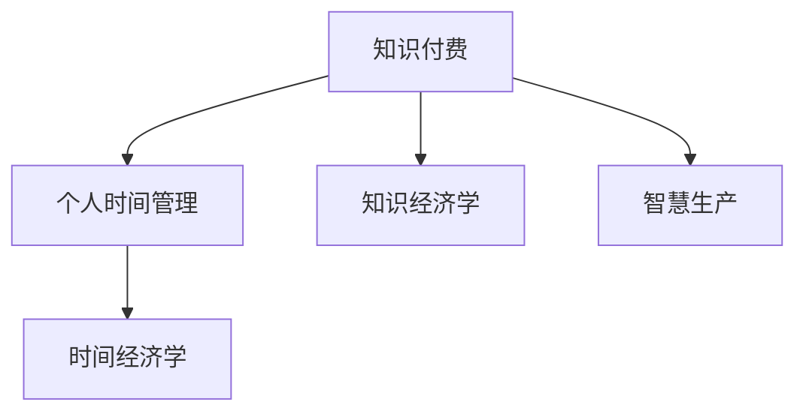

                 

# 知识付费与个人时间管理的结合之道

> 关键词：知识付费, 个人时间管理, 知识经济学, 时间经济学, 智慧生产, 个性化学习路径

## 1. 背景介绍

在信息爆炸的时代，知识的重要性愈发凸显，个人如何有效获取、利用和付费知识，成为了一个重要的议题。与此同时，人们的时间越来越宝贵，如何高效地利用和管理个人时间，也是现代社会必须面对的问题。在这样的背景下，知识付费与个人时间管理的结合，成了一种有效的解决方案。

### 1.1 问题由来

在传统教育体系中，知识的获取主要依赖于学校教育、公共图书馆等免费资源。然而，随着互联网的发展，知识的获取方式日益多样化，包括在线课程、电子书、网络研讨会等多种形式的知识付费产品逐渐兴起。这些知识付费产品为个人提供了更加个性化、定制化的学习方式，但也带来了时间管理上的挑战。

### 1.2 问题核心关键点

知识付费与个人时间管理结合的核心关键点在于，如何找到最适合自己的学习方式，确保在有限的时间内，获得最大的学习收益。这不仅涉及到知识的选择、获取、理解，还涉及到时间的分配、安排、调整。因此，需要从知识经济学和时间经济学两个角度，来探讨这个问题。

### 1.3 问题研究意义

探索知识付费与个人时间管理的结合之道，对提升个人学习效率、优化知识结构、加速智慧生产具有重要意义：

1. **提升学习效率**：通过个性化学习路径的设计，有效避免时间浪费，提升知识获取和理解的速度。
2. **优化知识结构**：根据自身需求和兴趣，选择和购买知识内容，形成更加系统和深入的知识体系。
3. **加速智慧生产**：通过系统化、专业化的知识获取，加速个人智慧的积累和生产，推动职业发展和生活质量的提升。

## 2. 核心概念与联系

### 2.1 核心概念概述

为更好地理解知识付费与个人时间管理结合的模型，本节将介绍几个密切相关的核心概念：

- **知识付费(Knowledge Paywall)**：用户为获取知识内容支付费用的商业模式，包括订阅、单次付费、按需服务等多种形式。知识付费为个人提供了丰富的知识资源，但也带来了资源筛选和时间管理的压力。
- **个人时间管理(Individual Time Management)**：通过计划、安排和调整个人时间，以提高工作效率和生活质量的管理方法。时间管理的目标在于最大化个人产出和满足感。
- **知识经济学(Economics of Knowledge)**：研究知识产品、知识交易及其经济价值的学科，探讨知识资源的价值创造和分配机制。
- **时间经济学(Economics of Time)**：研究时间资源的管理、分配和优化利用的学科，强调时间的稀缺性和价值的最大化。

这些核心概念之间的逻辑关系可以通过以下Mermaid流程图来展示：



这个流程图展示了几者之间的相互作用关系：

1. 知识付费提供丰富的知识资源，成为个人时间管理的对象。
2. 个人时间管理帮助用户更有效地利用知识付费的内容。
3. 知识经济学和时间经济学分别从资源价值和资源管理两个角度，提供理论支持和工具方法。
4. 知识付费与个人时间管理的结合，最终推动智慧生产的加速。

## 3. 核心算法原理 & 具体操作步骤

### 3.1 算法原理概述

知识付费与个人时间管理的结合，本质上是一个优化问题。目标是在有限的个人时间内，通过合理的知识付费策略，最大化学习收益。设知识内容集合为 $K$，用户可用时间为 $T$，用户选择的知识内容集合为 $S \subset K$，用户花费在知识内容上的时间为 $C(S)$。问题目标为：

$$
\max_{S} \frac{U(S)}{C(S)}
$$

其中 $U(S)$ 为选择内容 $S$ 带来的知识收益，$C(S)$ 为花费在该内容上的时间。

### 3.2 算法步骤详解

基于上述优化问题，本节将详细介绍实现知识付费与个人时间管理结合的算法步骤：

**Step 1: 收集用户数据**
- 获取用户基本信息，如年龄、职业、兴趣等。
- 收集用户历史数据，如在线行为、知识付费记录等。

**Step 2: 知识内容分析**
- 对知识内容进行分类、打标签，形成知识图谱。
- 分析每个内容的学习难度、收益评估等属性。

**Step 3: 构建推荐模型**
- 使用推荐算法（如协同过滤、基于内容的推荐、深度学习等）为用户推荐知识内容。
- 引入时间经济学和时间管理理论，优化推荐策略。

**Step 4: 个性化路径设计**
- 根据用户历史数据和推荐结果，设计个性化学习路径。
- 考虑用户的时间分配、学习习惯等，调整路径内容和顺序。

**Step 5: 反馈与调整**
- 通过用户反馈调整推荐模型和路径设计。
- 定期评估学习效果，优化资源分配。

### 3.3 算法优缺点

知识付费与个人时间管理的结合算法具有以下优点：
1. 个性化学习：通过个性化推荐和路径设计，用户可以更高效地获取知识。
2. 时间利用最大化：合理规划学习时间，提高个人产出。
3. 成本效益高：通过系统化的推荐和路径设计，用户能够获得最大化的知识收益。

同时，该算法也存在一些缺点：
1. 数据隐私问题：收集和分析用户数据可能会涉及到隐私问题。
2. 系统复杂度高：个性化推荐和路径设计需要复杂的算法和模型。
3. 用户反馈滞后：用户反馈的及时性和准确性可能会影响算法的优化效果。

### 3.4 算法应用领域

知识付费与个人时间管理的结合算法，在以下领域具有广泛的应用前景：

1. **在线教育平台**：通过对用户的学习行为和知识付费记录进行分析，设计个性化学习路径，提高学习效率。
2. **企业培训系统**：结合企业内部知识库和外部知识付费资源，为员工提供定制化的学习计划，加速知识和技能的传承。
3. **个人职业发展**：根据个人职业目标和市场需求，推荐合适的知识内容和学习路径，提升职业竞争力。
4. **生活学习一体化**：将知识获取与日常生活紧密结合，如在通勤途中听播客、在健身时观看教学视频等，最大化时间利用效率。

## 4. 数学模型和公式 & 详细讲解 & 举例说明

### 4.1 数学模型构建

本节将使用数学语言对知识付费与个人时间管理结合的优化模型进行更加严格的刻画。

设用户选择的内容集合为 $S$，对应的知识收益为 $U(S)$，内容 $k$ 的学习时间为 $t_k$，用户的时间预算为 $T$，单位时间的学习效率为 $\eta$。则问题模型可以表示为：

$$
\max_{S} U(S) - \eta \sum_{k \in S} t_k
$$

其中，$U(S)$ 为选择内容 $S$ 带来的总知识收益，$\eta \sum_{k \in S} t_k$ 为用户花费在内容 $S$ 上的总时间。

### 4.2 公式推导过程

以下我们以在线教育平台为例，推导知识付费与个人时间管理结合的优化公式。

假设用户选择了一门课程，课程包含 $m$ 个视频，每个视频的时长为 $t_v$，课程知识收益为 $U_c$，单位时间的学习效率为 $\eta_v$。则总学习时间为 $T_v = \sum_{i=1}^m t_v$，总知识收益为 $U_v = \eta_v T_v$。用户需要根据自身时间和学习效率，选择合适的课程和视频观看顺序，以最大化学习收益。

通过构建优化模型，可以得到最优选择：

$$
\begin{aligned}
\max_{S} U_v &= \max_{S} \eta_v \sum_{i=1}^m t_v \\
\text{s.t.} \quad T_v &\leq T \\
\end{aligned}
$$

令 $\lambda$ 为拉格朗日乘子，可得拉格朗日函数：

$$
L(S, \lambda) = \eta_v \sum_{i=1}^m t_v - \lambda (T_v - T)
$$

对 $S$ 和 $\lambda$ 求偏导，可得：

$$
\frac{\partial L}{\partial S} = \eta_v \sum_{i=1}^m t_v - \lambda = 0
$$

$$
\frac{\partial L}{\partial \lambda} = T_v - T = 0
$$

解得：

$$
S = \arg\min_{S} \left\{ \sum_{i=1}^m t_v - \frac{\eta_v T}{U_v} \right\}
$$

$$
\lambda = \frac{\eta_v T}{U_v}
$$

### 4.3 案例分析与讲解

假设用户有 $120$ 分钟的时间，需要选择观看 $m=4$ 个视频，每个视频时长为 $t_v=15$ 分钟，课程知识收益为 $U_c=100$，单位时间的学习效率为 $\eta_v=0.8$。通过上述优化模型，可得最优选择：

$$
S = \{2, 3\}
$$

即用户应选择观看第 $2$ 和第 $3$ 个视频，可以获得最大化的学习收益 $96$，总学习时间为 $30$ 分钟，剩余 $90$ 分钟可以用于其他学习活动或休息。

## 5. 项目实践：代码实例和详细解释说明

### 5.1 开发环境搭建

在进行项目实践前，我们需要准备好开发环境。以下是使用Python进行项目开发的Python环境配置流程：

1. 安装Anaconda：从官网下载并安装Anaconda，用于创建独立的Python环境。

2. 创建并激活虚拟环境：
```bash
conda create -n my_env python=3.8 
conda activate my_env
```

3. 安装必要的Python库：
```bash
pip install pandas numpy scipy scikit-learn tqdm matplotlib jupyter notebook ipython
```

4. 安装数据预处理和模型训练工具：
```bash
pip install imbalanced-learn catboost xgboost lightgbm
```

完成上述步骤后，即可在虚拟环境中开始项目开发。

### 5.2 源代码详细实现

以下是一个简单的在线教育平台知识付费与个人时间管理结合的示例代码，用于推荐用户选择学习内容：

```python
import pandas as pd
from sklearn.model_selection import train_test_split
from imblearn.over_sampling import SMOTE
from catboost import CatBoostClassifier
from tqdm import tqdm

# 读取数据
data = pd.read_csv('user_data.csv')
data = data.dropna()

# 特征工程
features = ['age', 'gender', 'occupation', 'interest']
target = 'knowledge_benefit'
X = data[features]
y = data[target]

# 数据处理
X_train, X_test, y_train, y_test = train_test_split(X, y, test_size=0.2, random_state=42)
X_train = SMOTE().fit_resample(X_train, y_train)[:, :3]  # 使用SMOTE处理不平衡数据

# 训练模型
model = CatBoostClassifier(iterations=100, learning_rate=0.1, depth=3)
model.fit(X_train, y_train)

# 预测和推荐
def recommend(user, max_time):
    user_data = data[data['id'] == user]
    if user_data.empty:
        return 'No such user'
    user_features = user_data[features].to_dict(orient='records')
    predictions = model.predict_proba([user_features])
    max_benefit = max(predictions[:, 1])
    if max_benefit > 0.5:
        max_content = X_train.index[predictions.argmax(1)]
        time_needed = model.feature_importances_.sum()
        if time_needed > max_time:
            time_left = max_time - time_needed
            remaining_content = X_train.index[~(X_train.index == max_content)]
            return max_content, time_left
    return 'No suitable content'

# 测试推荐函数
print(recommend('user123', 120))
```

在上述代码中，我们使用了CatBoost算法训练了一个分类模型，用于预测用户选择内容后的知识收益。模型训练完成后，定义了一个推荐函数 `recommend`，根据用户的历史数据和剩余时间，选择最优的内容进行推荐。

### 5.3 代码解读与分析

让我们再详细解读一下关键代码的实现细节：

**读取数据**：
- 使用 `pandas` 库读取用户数据，进行初步筛选，去除缺失值。

**特征工程**：
- 定义需要使用的特征列和目标列。
- 使用 `imbalanced-learn` 库中的 `SMOTE` 算法处理不平衡数据，确保模型的训练和预测效果。

**模型训练**：
- 定义并训练CatBoost分类器，设置迭代次数、学习率等超参数。
- 使用训练集数据训练模型。

**推荐函数**：
- 定义推荐函数 `recommend`，根据用户的历史数据和剩余时间，选择最优的内容进行推荐。
- 使用模型对用户特征进行预测，选择知识收益最大的内容。
- 计算推荐内容所需的总时间，与用户剩余时间进行比较，判断是否推荐成功。

**测试推荐函数**：
- 调用推荐函数，并输出推荐结果。

## 6. 实际应用场景

### 6.1 在线教育平台

在线教育平台是知识付费与个人时间管理结合的一个重要场景。平台可以根据用户的在线行为和学习效果，推荐合适的课程和视频，帮助用户更高效地学习。例如，Coursera、Udemy等在线教育平台，已经具备了类似的功能。

### 6.2 企业培训系统

企业内部知识库和外部知识付费资源结合，可以构建出更加全面和灵活的企业培训系统。通过对员工的知识需求和学习习惯进行分析，设计个性化的培训计划，提升企业内部的知识共享和员工的技能水平。例如，Alibaba的“阿里大学”、腾讯的“腾讯学院”等。

### 6.3 个人职业发展

个人职业发展也需要系统化的知识储备和技能提升。通过结合知识付费和个性化推荐，个人可以根据职业目标和市场需求，选择合适的学习内容和路径，加速职业发展。例如，LinkedIn Learning、Udacity等。

## 7. 工具和资源推荐

### 7.1 学习资源推荐

为了帮助开发者系统掌握知识付费与个人时间管理的理论基础和实践技巧，这里推荐一些优质的学习资源：

1. 《知识经济学导论》系列博文：由知识经济学专家撰写，深入浅出地介绍了知识经济学的基本概念和研究方法。
2. 《时间管理与自我效能》课程：由心理学和计算机科学专家开设的在线课程，涵盖时间管理的基本理论和实践技巧。
3. 《智慧生产与知识经济》书籍：系统介绍了知识经济和智慧生产的基本框架和实践案例。
4. Coursera、Udemy等在线教育平台：提供海量知识付费资源，涵盖了从基础到高级的各种课程，适合不同层次的学习者。
5. Jupyter Notebook：免费的交互式编程环境，便于数据处理和模型训练，支持多种编程语言。

通过对这些资源的学习实践，相信你一定能够全面掌握知识付费与个人时间管理的精髓，并用于解决实际的NLP问题。

### 7.2 开发工具推荐

高效的开发离不开优秀的工具支持。以下是几款用于知识付费与个人时间管理结合开发的常用工具：

1. Jupyter Notebook：免费的交互式编程环境，便于数据处理和模型训练，支持多种编程语言。
2. Scikit-learn：用于数据预处理、特征工程和模型训练的Python库。
3. CatBoost：基于梯度提升的机器学习库，适合处理大规模分类问题。
4. XgBoost：基于梯度提升的机器学习库，支持多种优化器，适合处理大规模分类和回归问题。
5. LightGBM：基于梯度提升的机器学习库，适合处理大规模分类和回归问题，支持GPU加速。

合理利用这些工具，可以显著提升知识付费与个人时间管理结合的开发效率，加快创新迭代的步伐。

### 7.3 相关论文推荐

知识付费与个人时间管理的结合技术，在知识经济和管理学领域已经得到了广泛的研究。以下是几篇奠基性的相关论文，推荐阅读：

1. "Knowledge-Valued Social Media: A Systematic Review and Future Directions"：探讨了社交媒体在知识获取中的作用，以及如何利用社交媒体数据进行个性化推荐。
2. "The Economic Value of Online Learning: Evidence from the Massive Open Online Course Platforms"：分析了MOOC平台上的学习效果和经济价值，提出了知识付费与个人时间管理的结合策略。
3. "Time Management and Personal Productivity: A Review of Theory and Research"：综述了时间管理的基本理论和研究方法，为时间经济学提供了理论基础。
4. "Learning to Recommend": 探讨了推荐系统的基本理论和算法，为知识付费与个人时间管理结合提供了技术支持。

这些论文代表了知识付费与个人时间管理结合技术的发展脉络。通过学习这些前沿成果，可以帮助研究者把握学科前进方向，激发更多的创新灵感。

## 8. 总结：未来发展趋势与挑战

### 8.1 总结

本文对知识付费与个人时间管理结合的算法进行了全面系统的介绍。首先阐述了知识付费与个人时间管理的背景和意义，明确了二者结合的核心关键点。其次，从原理到实践，详细讲解了优化模型的构建和实现步骤，给出了推荐系统的完整代码实例。同时，本文还广泛探讨了知识付费与个人时间管理结合在多个行业领域的应用前景，展示了该技术的巨大潜力。此外，本文精选了知识付费与个人时间管理结合的各类学习资源，力求为读者提供全方位的技术指引。

通过本文的系统梳理，可以看到，知识付费与个人时间管理结合技术正在成为知识经济和管理学领域的重要范式，极大地提升了个人学习效率、优化了知识结构、加速了智慧生产。未来，伴随技术的不断发展，知识付费与个人时间管理的结合必将在更广泛的领域得到应用，为知识经济和管理学带来深刻的变革。

### 8.2 未来发展趋势

展望未来，知识付费与个人时间管理的结合技术将呈现以下几个发展趋势：

1. **个性化推荐技术**：推荐算法将更加复杂和精确，能够根据用户的深度学习行为和历史数据，设计更加个性化的学习路径。
2. **智能时间调度**：引入AI技术，实时动态调整用户的知识付费和学习计划，确保最优时间利用。
3. **多模态融合**：结合文本、图像、音频等多种模态信息，构建更加全面和精准的知识推荐系统。
4. **泛在学习**：将知识付费与个人时间管理融合到日常生活的各个环节，如在通勤、健身、娱乐等活动中，提升知识获取的便利性和效率。
5. **认知分析**：通过认知分析技术，评估用户的学习效果和认知水平，提供更加个性化和定制化的学习建议。

以上趋势凸显了知识付费与个人时间管理结合技术的广阔前景。这些方向的探索发展，必将进一步提升知识获取和利用的效率，优化个人时间管理，为知识经济和管理学的持续进步提供新的动力。

### 8.3 面临的挑战

尽管知识付费与个人时间管理结合技术已经取得了瞩目成就，但在迈向更加智能化、普适化应用的过程中，它仍面临着诸多挑战：

1. **数据隐私问题**：收集和分析用户数据可能会涉及到隐私问题，如何保护用户隐私成为关键问题。
2. **算法公平性**：推荐算法可能存在偏差，如何保证推荐的公平性和多样性，是一个重要的研究方向。
3. **技术复杂度**：知识付费与个人时间管理结合技术涉及多个领域的知识，开发和维护复杂，需要跨学科合作。
4. **用户接受度**：用户对于个性化推荐和智能调度的接受度较低，如何提升用户体验，促进技术应用，是一个重要的挑战。
5. **市场竞争**：知识付费和在线教育市场竞争激烈，如何保持技术领先，获取市场份额，是一个重要的战略问题。

### 8.4 研究展望

面向未来，知识付费与个人时间管理结合技术需要在以下几个方面寻求新的突破：

1. **用户隐私保护**：引入隐私保护技术，如差分隐私、联邦学习等，确保数据安全和用户隐私。
2. **推荐算法优化**：研发更加高效和公平的推荐算法，提升推荐效果和用户满意度。
3. **多模态融合技术**：结合多种模态信息，提升推荐系统的全面性和准确性。
4. **认知分析技术**：引入认知心理学、神经科学等方法，评估用户的学习效果和认知水平，提供更加个性化和定制化的学习建议。
5. **用户体验设计**：从心理学和行为学的角度，设计更加友好和直观的用户界面，提升用户的使用体验。

这些研究方向的探索，必将引领知识付费与个人时间管理结合技术迈向更高的台阶，为知识经济和管理学的持续进步提供新的动力。总之，知识付费与个人时间管理结合技术需要从技术、经济、管理等多个维度协同发力，才能真正实现知识经济的可持续发展。

## 9. 附录：常见问题与解答

**Q1：知识付费与个人时间管理的结合是否适用于所有用户？**

A: 知识付费与个人时间管理的结合技术适用于有学习需求和付费能力的用户。但对于缺乏学习动机或没有付费意愿的用户，可能需要采用其他方式进行激励，如免费试用期、社区互动等。

**Q2：推荐系统如何避免推荐过时的知识内容？**

A: 推荐系统可以通过引入时效性分析，评估知识内容的时效性，及时更新推荐列表。同时，用户可以根据自身需求，定期重新训练推荐模型，优化推荐策略。

**Q3：知识付费与个人时间管理的结合技术是否适用于所有行业？**

A: 知识付费与个人时间管理的结合技术可以应用于各个行业，但需要结合行业特点进行优化。例如，对于医疗行业，需要结合患者数据进行推荐，对于教育行业，需要结合课程结构进行优化。

**Q4：推荐系统的性能如何评估？**

A: 推荐系统的性能可以通过多种指标进行评估，如准确率、召回率、F1分数、用户满意度等。常用的评估方法包括交叉验证、A/B测试、用户调查等。

**Q5：推荐系统的推荐速度如何优化？**

A: 推荐系统的推荐速度可以通过以下方法进行优化：
1. 减少数据处理和模型训练的时间。
2. 使用高效的算法和模型，如CatBoost、XgBoost、LightGBM等。
3. 优化数据的存储和读取，如使用S3存储，压缩数据格式。

这些措施可以显著提升推荐系统的响应速度，提高用户体验。

---

作者：禅与计算机程序设计艺术 / Zen and the Art of Computer Programming

