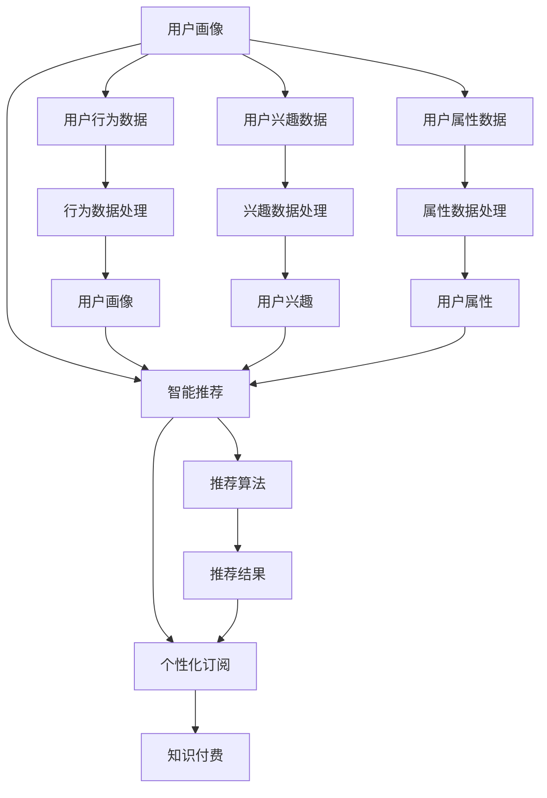

                 

# 知识付费与智能推荐相结合的个性化订阅

> 关键词：知识付费, 智能推荐, 个性化订阅, 用户画像, 内容推荐系统, 深度学习

## 1. 背景介绍

### 1.1 问题由来
在数字经济时代，知识付费已逐渐成为各行各业获取新知、加速创新的重要方式。用户通过订阅各类课程、文章、音频等付费内容，获取高质量的信息和专业知识，从而在职场竞争中占据优势。然而，现有的知识付费平台往往以内容为王，缺乏对用户个性化需求的细致理解，内容推荐系统建设不足，导致用户体验与付费价值之间的差距。

为了提升用户满意度和平台收益，亟需构建一套高效的知识付费与智能推荐相结合的个性化订阅系统。通过智能推荐系统，平台能够精准匹配用户需求与优质内容，减少用户选择成本，提升用户订阅意愿。在此基础上，结合知识付费模式，用户可以更加便捷地获取高质量的个性化知识服务，实现知识获取与付费机制的有效结合。

### 1.2 问题核心关键点
本文聚焦于如何构建一套基于深度学习的知识付费与智能推荐相结合的个性化订阅系统。核心关键点包括：
- 如何构建全面的用户画像，精确描述用户兴趣和行为特征。
- 如何基于用户画像，构建高效的内容推荐算法，提升推荐质量。
- 如何结合推荐系统，设计灵活多变的知识付费模式，实现精准订阅。
- 如何对推荐系统进行深度学习建模，并部署到大规模应用中。

## 2. 核心概念与联系

### 2.1 核心概念概述

为更好地理解知识付费与智能推荐结合的个性化订阅系统，本节将介绍几个关键概念及其相互联系：

- **知识付费(Subscription-Based Content)**：基于订阅模式的知识付费，用户通过支付费用，获取持续性的高质量内容，实现知识的深度积累与技能提升。
- **智能推荐(Recommendation System)**：通过分析用户历史行为、兴趣等特征，自动推荐符合用户需求的内容，提升用户满意度。
- **个性化订阅(Personalized Subscription)**：结合智能推荐，为用户提供量身定制的个性化订阅方案，满足其特定需求。
- **用户画像(User Profile)**：通过对用户行为数据的分析和挖掘，构建全面的用户画像，精确描述用户特征和需求。
- **深度学习(Deep Learning)**：一种基于神经网络的机器学习方法，擅长处理复杂、高维度的数据，在智能推荐中具有广泛应用。

这些概念之间的逻辑关系可以通过以下Mermaid流程图来展示：



这个流程图展示了几大核心概念及其相互关系：

1. 用户画像通过对用户行为、兴趣、属性等数据进行全面分析，构建出用户特征。
2. 智能推荐系统以用户画像为输入，利用深度学习算法自动推荐符合用户需求的内容。
3. 个性化订阅系统根据推荐结果，设计灵活多样的付费模式，满足用户特定的订阅需求。
4. 深度学习技术为推荐系统提供高效的数据处理和模型训练手段，提升推荐精度。

## 3. 核心算法原理 & 具体操作步骤
### 3.1 算法原理概述

知识付费与智能推荐相结合的个性化订阅系统，其核心算法原理在于通过深度学习模型构建用户画像，并在此基础上进行智能推荐。

算法流程大致如下：
1. 收集用户行为数据，包括浏览历史、搜索记录、评论互动等。
2. 利用深度学习模型，如CTR(点击率预测)、MF(矩阵分解)、DNN(深度神经网络)等，对用户行为数据进行建模，生成用户画像。
3. 构建推荐模型，将用户画像作为输入，预测用户可能感兴趣的内容。
4. 结合推荐结果，设计个性化订阅方案，如固定周期、按需订阅、按内容订阅等。
5. 将推荐系统部署到大规模应用中，持续优化推荐效果，提升用户满意度。

### 3.2 算法步骤详解

#### 3.2.1 数据收集

智能推荐系统首先需要大量用户行为数据作为输入。这些数据包括但不限于：
- 浏览记录：用户访问过的文章、视频、课程等。
- 搜索记录：用户在平台搜索的关键词、问题。
- 评论记录：用户在内容下方发表的评论、评分。
- 互动记录：用户与其他用户或内容创作者之间的点赞、回复、关注等互动。

数据收集过程需要保证数据的全面性和时效性。为保证数据质量，可以采用以下策略：
1. 采用分布式存储技术，如Hadoop、Spark，进行大规模数据存储和处理。
2. 利用日志管理工具，如ElasticSearch、Fluentd，收集和存储实时日志数据。
3. 结合数据清洗工具，如OpenRefine、Trifacta，对数据进行清洗、转换和整合。

#### 3.2.2 用户画像构建

用户画像的构建是智能推荐系统的基础。其目的是从海量用户行为数据中，抽取出用户兴趣、偏好、行为模式等信息，精确描述用户特征。

用户画像的构建主要包含以下几个步骤：
1. 数据预处理：对收集到的行为数据进行清洗、去噪、填充缺失值等预处理操作。
2. 特征工程：从原始数据中提取有意义的特征，如浏览时长、互动频率、搜索关键词等。
3. 建模分析：利用深度学习模型，如BERT、CTR等，对用户行为数据进行建模，生成用户兴趣和行为特征。
4. 特征融合：将不同来源的特征进行融合，构建更为全面的用户画像。

#### 3.2.3 智能推荐系统设计

智能推荐系统以用户画像为输入，利用深度学习算法，生成推荐结果。以下是推荐系统的关键步骤：
1. 数据处理：对用户画像进行归一化、标准化等预处理操作，保证输入数据的格式一致。
2. 特征嵌入：利用词嵌入、稠密嵌入等方法，将用户画像转换为向量表示。
3. 模型训练：选择合适的深度学习模型，如CinDNN、ALFM、XGBoost等，进行模型训练，生成推荐结果。
4. 推荐排序：根据推荐结果的得分，对推荐内容进行排序，生成最终推荐列表。

#### 3.2.4 个性化订阅方案设计

结合智能推荐结果，设计灵活多变的个性化订阅方案，如固定周期订阅、按需订阅、按内容订阅等。以下是一种订阅方案的设计思路：
1. 订阅套餐设计：根据用户画像和推荐结果，设计多个订阅套餐，如初级、中级、高级等，满足不同层次用户的需求。
2. 订阅策略优化：利用A/B测试等方法，对不同订阅策略进行评估和优化，提升用户订阅转化率。
3. 推荐内容更新：根据用户反馈和订阅行为，动态调整推荐模型和订阅方案，实现内容精准推荐和订阅优化。

#### 3.2.5 系统部署与优化

智能推荐系统构建完成后，需要部署到大规模应用中，并不断优化推荐效果。以下是一套系统部署的策略：
1. 采用云服务：利用AWS、阿里云等云服务，搭建推荐系统架构，实现分布式部署。
2. 负载均衡：通过负载均衡器，如Nginx、HAProxy，平衡系统负载，保证系统稳定运行。
3. 实时更新：利用流计算框架，如Apache Flink、Apache Spark Streaming，实现实时数据处理和系统优化。
4. 模型优化：采用模型压缩、量化等技术，优化模型结构，提升推理效率。

### 3.3 算法优缺点

#### 3.3.1 优点

基于深度学习的智能推荐系统，具有以下优点：
1. 高精度：深度学习模型通过复杂特征的建模，能够实现高精度的推荐结果。
2. 灵活性：深度学习模型可以根据用户画像进行动态调整，生成个性化的推荐结果。
3. 可扩展性：深度学习模型可以在大规模数据集上训练，支持大规模推荐系统的构建。

#### 3.3.2 缺点

深度学习推荐系统也存在以下不足：
1. 高复杂度：深度学习模型需要大量计算资源进行训练和推理，对硬件和算力要求较高。
2. 黑盒性：深度学习模型的内部机制复杂，难以解释和调试。
3. 冷启动问题：新用户缺乏行为数据，难以构建准确的推荐模型。

## 4. 数学模型和公式 & 详细讲解 & 举例说明

### 4.1 数学模型构建

在本节中，我们将详细介绍智能推荐系统的数学模型构建过程。

假设用户画像为 $X=\{x_1, x_2, \ldots, x_n\}$，其中 $x_i$ 表示第 $i$ 个用户行为特征。推荐系统以用户画像为输入，生成推荐结果 $Y=\{y_1, y_2, \ldots, y_m\}$，其中 $y_i$ 表示推荐内容。

推荐系统的目标是最小化预测误差：
$$
\min_{\theta} \sum_{i=1}^N \ell(y_i, \hat{y}_i)
$$
其中 $\ell$ 为损失函数，$\hat{y}_i$ 为模型预测结果。

常见损失函数包括：
- 均方误差（MSE）：
$$
\ell(y_i, \hat{y}_i) = \frac{1}{2}(y_i - \hat{y}_i)^2
$$
- 交叉熵（CE）：
$$
\ell(y_i, \hat{y}_i) = -y_i\log \hat{y}_i - (1-y_i)\log (1-\hat{y}_i)
$$

### 4.2 公式推导过程

以下以交叉熵损失函数为例，推导推荐模型的训练公式。

假设推荐系统使用深度学习模型 $M_{\theta}$ 进行预测，输入用户画像 $X$，输出推荐结果 $Y$。则模型的训练目标为：
$$
\min_{\theta} \sum_{i=1}^N \ell(Y_i, M_{\theta}(X_i))
$$

其中 $X_i$ 表示第 $i$ 个用户画像，$Y_i$ 表示第 $i$ 个推荐内容。

使用随机梯度下降（SGD）算法更新模型参数，推导过程如下：
1. 对数据集 $D$ 进行批处理，划分训练集和测试集。
2. 对训练集进行前向传播，计算预测结果 $Y_i = M_{\theta}(X_i)$。
3. 计算交叉熵损失函数 $\ell(Y_i, Y_i)$。
4. 计算梯度 $\frac{\partial \ell}{\partial \theta}$。
5. 更新模型参数 $\theta$。

最终，训练后的推荐模型能够生成高质量的推荐结果，提升用户满意度。

### 4.3 案例分析与讲解

#### 4.3.1 均方误差（MSE）

均方误差（MSE）是常见的推荐系统损失函数之一。在实际应用中，MSE适用于连续性特征的推荐模型，如基于回归模型的推荐系统。

假设推荐系统使用线性回归模型 $M_{\theta}$，输入用户画像 $X$，输出推荐结果 $Y$。则模型的训练目标为：
$$
\min_{\theta} \sum_{i=1}^N (Y_i - M_{\theta}(X_i))^2
$$

推导过程与交叉熵损失函数类似，仅在梯度计算和模型更新公式上有细微差别。

#### 4.3.2 交叉熵（CE）

交叉熵（CE）是推荐系统中最常用的损失函数之一。在实际应用中，CE适用于分类特征的推荐模型，如基于分类模型的推荐系统。

假设推荐系统使用分类模型 $M_{\theta}$，输入用户画像 $X$，输出推荐结果 $Y$。则模型的训练目标为：
$$
\min_{\theta} \sum_{i=1}^N \ell(Y_i, M_{\theta}(X_i))
$$

其中 $\ell$ 为交叉熵损失函数，$Y_i$ 表示第 $i$ 个推荐内容的真实标签，$M_{\theta}(X_i)$ 表示模型对第 $i$ 个用户画像的预测结果。

推导过程与交叉熵损失函数类似，仅在损失函数和梯度计算上有细微差别。

## 5. 项目实践：代码实例和详细解释说明

### 5.1 开发环境搭建

#### 5.1.1 安装Python环境

推荐系统开发需要Python作为主要开发语言。以下是一套常见的Python环境搭建流程：

1. 安装Python：从官网下载并安装Python 3.x版本。
2. 安装PyTorch：使用pip或conda命令安装PyTorch深度学习框架。
3. 安装TensorBoard：使用pip或conda命令安装TensorBoard可视化工具。
4. 安装TensorFlow：使用pip或conda命令安装TensorFlow深度学习框架。
5. 安装scikit-learn：使用pip命令安装scikit-learn机器学习库。
6. 安装numpy：使用pip命令安装numpy数学库。

#### 5.1.2 安装深度学习库

除了上述常用库外，还需要安装深度学习相关的库：

1. 安装PyTorch：使用pip或conda命令安装PyTorch深度学习框架。
2. 安装TensorFlow：使用pip或conda命令安装TensorFlow深度学习框架。
3. 安装Keras：使用pip命令安装Keras深度学习框架。
4. 安装TensorFlow-DS：使用pip命令安装TensorFlow-DS深度学习库。

#### 5.1.3 安装推荐系统库

推荐系统开发还需要一些推荐系统相关的库：

1. 安装LightFM：使用pip命令安装LightFM推荐系统库。
2. 安装Surprise：使用pip命令安装Surprise推荐系统库。
3. 安装PYRISM：使用pip命令安装PYRISM推荐系统库。
4. 安装Recsys：使用pip命令安装Recsys推荐系统库。

### 5.2 源代码详细实现

#### 5.2.1 数据预处理

推荐系统开发中，数据预处理是关键步骤。以下是一个简单的数据预处理示例：

```python
import pandas as pd
import numpy as np
from sklearn.preprocessing import MinMaxScaler

# 读取数据
df = pd.read_csv('user_browsing_data.csv')

# 数据清洗
df = df.dropna().drop_duplicates()

# 特征选择
selected_features = ['browsed_articles', 'search_query', 'average_time']

# 数据标准化
scaler = MinMaxScaler(feature_range=(0, 1))
df[selected_features] = scaler.fit_transform(df[selected_features])

# 数据划分
train_data = df.sample(frac=0.8, random_state=1)
test_data = df.drop(train_data.index)
```

#### 5.2.2 特征工程

推荐系统开发中，特征工程是提升推荐效果的重要手段。以下是一个简单的特征工程示例：

```python
import pandas as pd
import numpy as np
from sklearn.preprocessing import OneHotEncoder

# 读取数据
df = pd.read_csv('user_browsing_data.csv')

# 特征选择
selected_features = ['browsed_articles', 'search_query', 'average_time']

# 数据标准化
scaler = MinMaxScaler(feature_range=(0, 1))
df[selected_features] = scaler.fit_transform(df[selected_features])

# 特征编码
encoder = OneHotEncoder()
encoded_features = encoder.fit_transform(df[['browsed_articles', 'search_query']]).toarray()

# 数据合并
features = np.hstack((encoded_features, df[['average_time']]))
```

#### 5.2.3 模型训练

推荐系统开发中，模型训练是提升推荐效果的核心步骤。以下是一个简单的模型训练示例：

```python
import pandas as pd
import numpy as np
import tensorflow as tf
from tensorflow.keras.layers import Input, Dense
from tensorflow.keras.models import Model

# 定义输入层
input_layer = Input(shape=(features.shape[1],))

# 定义隐藏层
hidden_layer = Dense(64, activation='relu')(input_layer)

# 定义输出层
output_layer = Dense(1, activation='sigmoid')(hidden_layer)

# 定义模型
model = Model(inputs=input_layer, outputs=output_layer)

# 编译模型
model.compile(optimizer='adam', loss='binary_crossentropy', metrics=['accuracy'])

# 训练模型
model.fit(x=train_data, y=train_labels, epochs=10, batch_size=32)
```

#### 5.2.4 模型评估

推荐系统开发中，模型评估是优化推荐效果的关键步骤。以下是一个简单的模型评估示例：

```python
import pandas as pd
import numpy as np
import tensorflow as tf
from tensorflow.keras.metrics import Precision, Recall, AUC

# 读取数据
df = pd.read_csv('user_browsing_data.csv')

# 数据划分
train_data = df.sample(frac=0.8, random_state=1)
test_data = df.drop(train_data.index)

# 模型训练
model.fit(x=train_data, y=train_labels, epochs=10, batch_size=32)

# 模型评估
test_labels = model.predict(test_data)
test_predictions = np.round(test_labels)

# 计算指标
precision = Precision()
recall = Recall()
auc = AUC()

precision.update_state(test_predictions, test_labels)
recall.update_state(test_predictions, test_labels)
auc.update_state(test_predictions, test_labels)

print(f'Precision: {precision.result().numpy()}, Recall: {recall.result().numpy()}, AUC: {auc.result().numpy()}')
```

### 5.3 代码解读与分析

#### 5.3.1 数据预处理

数据预处理是推荐系统开发的基础。数据预处理的目的是对原始数据进行清洗、标准化、特征选择等操作，保证数据质量。

- 数据清洗：对缺失值、重复值、异常值等进行处理，保证数据完整性。
- 数据标准化：对特征进行标准化操作，使其在相同尺度下进行比较。
- 特征选择：选择对推荐效果有显著影响的特征，减少计算复杂度。

#### 5.3.2 特征工程

特征工程是推荐系统开发的关键步骤。特征工程的目的在于从原始数据中提取有意义的特征，提升推荐效果。

- 特征选择：选择与推荐目标相关性高的特征，减少计算复杂度。
- 特征编码：对离散特征进行编码操作，使其可以输入模型。
- 特征构建：对原始特征进行变换、组合等操作，生成新的特征。

#### 5.3.3 模型训练

模型训练是推荐系统开发的核心步骤。模型训练的目的是通过优化模型参数，提升推荐效果。

- 模型定义：定义模型结构，包括输入层、隐藏层、输出层等。
- 模型编译：设置优化器、损失函数、评价指标等。
- 模型训练：使用训练数据集进行模型训练，调整模型参数。

#### 5.3.4 模型评估

模型评估是推荐系统开发的重要步骤。模型评估的目的是对训练后的模型进行评估，调整模型参数，提升推荐效果。

- 模型预测：使用测试数据集进行模型预测，生成推荐结果。
- 指标计算：计算推荐模型的评价指标，如精度、召回率、AUC等。

## 6. 实际应用场景

### 6.1 智能推荐系统

智能推荐系统是知识付费与智能推荐相结合的个性化订阅系统的重要组成部分。通过智能推荐系统，平台能够精准匹配用户需求与优质内容，减少用户选择成本，提升用户满意度。

智能推荐系统在知识付费中的应用场景包括：
- 课程推荐：根据用户浏览、搜索、互动行为，推荐符合用户兴趣的课程。
- 文章推荐：根据用户阅读、评论、分享行为，推荐符合用户兴趣的文章。
- 视频推荐：根据用户观看、点赞、分享行为，推荐符合用户兴趣的视频。

### 6.2 个性化订阅方案

个性化订阅方案是知识付费与智能推荐相结合的个性化订阅系统的另一重要组成部分。通过个性化订阅方案，平台能够设计灵活多变的订阅套餐，满足用户特定需求，提升用户订阅转化率。

个性化订阅方案在知识付费中的应用场景包括：
- 按需订阅：用户根据需求选择订阅时间、频率、内容等，灵活获取知识服务。
- 按内容订阅：用户根据兴趣选择订阅内容，获得更精准的知识服务。
- 固定周期订阅：用户选择固定周期进行订阅，获得持续的知识服务。

### 6.3 用户画像构建

用户画像构建是智能推荐系统的基础。通过用户画像，推荐系统能够精确描述用户兴趣和行为特征，生成个性化的推荐结果。

用户画像在知识付费中的应用场景包括：
- 用户画像描述：构建全面的用户画像，精确描述用户特征和需求。
- 用户画像更新：根据用户行为数据，动态更新用户画像，提升推荐精度。
- 用户画像分析：对用户画像进行分析和挖掘，生成用户兴趣和行为特征。

## 7. 工具和资源推荐

### 7.1 学习资源推荐

为了帮助开发者系统掌握知识付费与智能推荐相结合的个性化订阅系统，这里推荐一些优质的学习资源：

1. 《深度学习推荐系统》一书：介绍深度学习在推荐系统中的应用，涵盖用户画像、推荐模型、评价指标等核心概念。
2. 《Python推荐系统》一书：介绍Python在推荐系统中的应用，涵盖数据预处理、特征工程、模型训练等技术细节。
3. 《推荐系统实战》一书：介绍推荐系统从理论到实践的全流程，涵盖用户画像、推荐模型、系统部署等环节。
4. 《推荐系统》课程：斯坦福大学开设的推荐系统课程，系统讲解推荐系统的理论基础和实践技巧。
5. 《推荐系统实践》博客：介绍推荐系统从理论到实践的全流程，涵盖数据处理、模型训练、系统部署等技术细节。

通过这些资源的学习实践，相信你一定能够快速掌握知识付费与智能推荐相结合的个性化订阅系统的精髓，并用于解决实际的推荐问题。

### 7.2 开发工具推荐

为了提高知识付费与智能推荐相结合的个性化订阅系统的开发效率，这里推荐一些实用的开发工具：

1. PyTorch：基于Python的开源深度学习框架，灵活便捷，支持动态图计算。
2. TensorFlow：由Google主导开发的开源深度学习框架，生产部署方便，支持静态图计算。
3. TensorBoard：TensorFlow配套的可视化工具，实时监测模型训练状态，提供丰富的图表呈现方式。
4. HuggingFace Transformers：NLP领域最流行的开源库，集成了众多预训练语言模型，支持微调、推理等功能。
5. Apache Spark：分布式计算框架，支持大规模数据处理和机器学习任务。
6. Jupyter Notebook：开源的交互式计算环境，支持Python、R等多种语言，便于调试和共享代码。

### 7.3 相关论文推荐

知识付费与智能推荐相结合的个性化订阅系统的发展离不开学界的持续研究。以下是几篇奠基性的相关论文，推荐阅读：

1. 《基于深度学习的推荐系统》：介绍深度学习在推荐系统中的应用，涵盖用户画像、推荐模型、评价指标等核心概念。
2. 《知识付费推荐系统研究》：介绍知识付费领域推荐系统的发展现状和未来方向，涵盖用户画像、推荐模型、评价指标等技术细节。
3. 《基于协同过滤的推荐系统》：介绍协同过滤在推荐系统中的应用，涵盖用户行为分析、推荐模型构建等技术细节。
4. 《个性化推荐系统研究综述》：介绍个性化推荐系统的发展现状和未来方向，涵盖用户画像、推荐模型、评价指标等核心概念。
5. 《基于知识图谱的推荐系统》：介绍知识图谱在推荐系统中的应用，涵盖用户画像、推荐模型、评价指标等技术细节。

## 8. 总结：未来发展趋势与挑战

### 8.1 总结

本文对知识付费与智能推荐相结合的个性化订阅系统进行了全面系统的介绍。首先阐述了知识付费与智能推荐相结合的个性化订阅系统的研究背景和意义，明确了推荐系统在提升用户体验、优化付费模式方面的独特价值。其次，从原理到实践，详细讲解了推荐系统的数学模型和核心算法，给出了推荐系统开发的完整代码实例。同时，本文还探讨了推荐系统在知识付费中的应用场景，展示了推荐系统在提升平台收益、优化用户体验等方面的巨大潜力。最后，本文精选了推荐系统的学习资源、开发工具和相关论文，力求为开发者提供全方位的技术指引。

通过本文的系统梳理，可以看到，知识付费与智能推荐相结合的个性化订阅系统具有广阔的应用前景，能够为用户提供更加高效、精准的知识服务，实现知识获取与付费机制的有效结合。

### 8.2 未来发展趋势

面向未来，知识付费与智能推荐相结合的个性化订阅系统将呈现以下几个发展趋势：

1. 推荐模型自动化：利用自动化机器学习（AutoML）技术，自动构建推荐模型，优化模型参数，提升推荐效果。
2. 多模态推荐：结合文本、图像、音频等多模态数据，构建更为全面的用户画像，提升推荐精度。
3. 实时推荐：利用流计算技术，实现实时推荐，提高推荐响应速度和用户满意度。
4. 跨平台推荐：结合多平台数据，构建跨平台的推荐系统，提升推荐效果。
5. 个性化推荐策略：结合用户行为、兴趣、情感等多维特征，设计个性化的推荐策略，提升推荐精度。

### 8.3 面临的挑战

尽管知识付费与智能推荐相结合的个性化订阅系统取得了显著进展，但在迈向更加智能化、普适化应用的过程中，仍面临诸多挑战：

1. 数据隐私与安全：推荐系统需要大量用户数据，如何保障用户数据隐私与安全，避免数据泄露风险，需要更多技术和管理手段。
2. 冷启动问题：新用户缺乏行为数据，难以构建准确的推荐模型，需要结合主动学习、半监督学习等技术，提升冷启动效果。
3. 资源消耗：推荐系统涉及大量数据处理和模型训练，对计算资源和存储资源需求较大，需要更多技术手段进行优化。
4. 系统稳定性：推荐系统在大规模部署时，如何保证系统稳定性和高效性，需要更多技术手段进行优化。
5. 推荐偏见：推荐系统可能存在偏见，导致推荐结果不公，需要更多技术手段进行优化，确保推荐公正性。

### 8.4 研究展望

面向未来，知识付费与智能推荐相结合的个性化订阅系统需要在以下几个方面寻求新的突破：

1. 冷启动优化：结合主动学习、半监督学习等技术，提升冷启动效果，解决新用户推荐问题。
2. 跨模态推荐：结合文本、图像、音频等多模态数据，构建更为全面的用户画像，提升推荐精度。
3. 实时推荐优化：利用流计算技术，实现实时推荐，提高推荐响应速度和用户满意度。
4. 系统优化：采用分布式计算、模型压缩等技术，优化推荐系统资源消耗，提升系统性能。
5. 推荐公平性：结合公平性算法、数据脱敏等技术，确保推荐公正性，避免推荐偏见。

## 9. 附录：常见问题与解答

**Q1：知识付费与智能推荐相结合的个性化订阅系统如何提升用户满意度？**

A: 知识付费与智能推荐相结合的个性化订阅系统通过智能推荐，精准匹配用户需求与优质内容，减少用户选择成本，提升用户满意度。同时，结合个性化订阅方案，满足用户特定需求，提升用户订阅转化率。具体而言，该系统能够根据用户历史行为和兴趣，生成个性化的推荐结果，用户可以快速找到自己感兴趣的内容，减少选择成本，提升使用体验。

**Q2：推荐系统如何处理冷启动问题？**

A: 推荐系统在面对新用户时，由于缺乏行为数据，难以构建准确的推荐模型，这被称为冷启动问题。解决冷启动问题的方法包括：
1. 利用内容标签：利用用户填写的兴趣标签或从内容标签中抽取特征，生成初步的用户画像。
2. 利用协同过滤：利用用户已有行为数据和相似用户的行为数据，推荐相似内容。
3. 利用主动学习：利用用户少量行为数据和先验知识，主动获取新数据，提升推荐效果。
4. 利用半监督学习：利用少量标注数据和大量未标注数据，提升推荐模型效果。

**Q3：推荐系统如何实现实时推荐？**

A: 推荐系统实现实时推荐需要利用流计算技术，如Apache Flink、Apache Spark Streaming等，对实时数据进行处理和分析，生成推荐结果。具体而言，推荐系统需要利用数据流处理框架，实现对实时数据流的处理和分析，生成实时推荐结果。同时，需要结合模型压缩、量化等技术，优化模型结构，提升推理效率，实现高效实时推荐。

**Q4：推荐系统如何处理推荐偏见问题？**

A: 推荐系统处理推荐偏见问题需要从数据和算法两方面进行优化：
1. 数据处理：对数据进行清洗、去噪、标准化等操作，保证数据质量。
2. 算法优化：采用公平性算法，如公平排名算法、多标签分类器等，确保推荐公正性。
3. 用户反馈：利用用户反馈数据，调整推荐模型，消除偏见。
4. 数据脱敏：对敏感数据进行脱敏处理，避免推荐偏见。

---

作者：禅与计算机程序设计艺术 / Zen and the Art of Computer Programming

