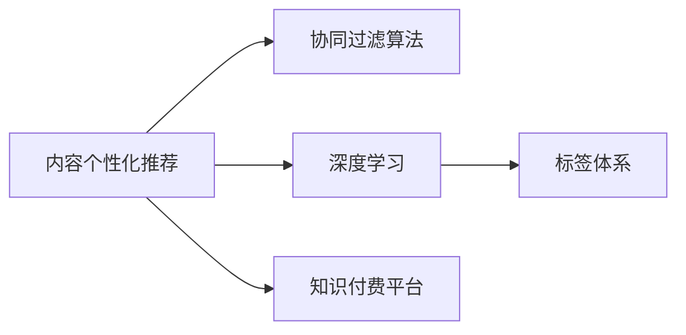

                 

# 知识付费创业中的内容个性化推荐

## 1. 背景介绍

在互联网快速发展的背景下，知识付费逐渐成为一种新的盈利模式。随着用户对于高质量内容的需求日益增长，知识付费领域迎来了发展机遇。然而，如何为用户提供更为个性化、高效的内容推荐，成为了一个亟待解决的难题。本文将围绕这一主题，探讨基于机器学习的内容个性化推荐算法在知识付费平台中的应用，以期帮助创业者在竞争激烈的市场中脱颖而出。

## 2. 核心概念与联系

### 2.1 核心概念概述

本文主要涉及以下核心概念：

- **内容个性化推荐**：通过机器学习算法，根据用户的历史行为和偏好，为其推荐最相关、最有价值的内容。
- **知识付费平台**：基于互联网的在线平台，提供付费的优质知识资源，如电子书、在线课程、音频等。
- **协同过滤算法**：利用用户之间的相似性，推荐用户可能感兴趣的内容。
- **深度学习**：使用深度神经网络模型，从大规模数据中学习到内容的表示和用户行为的特征，从而实现个性化推荐。
- **标签体系**：对内容进行标签标注，利用标签的语义信息辅助推荐。

这些概念通过机器学习技术紧密联系在一起，共同构建了知识付费平台的内容推荐系统，提升用户体验，增强平台竞争力。

### 2.2 核心概念原理和架构的 Mermaid 流程图



## 3. 核心算法原理 & 具体操作步骤

### 3.1 算法原理概述

内容个性化推荐的核心在于，通过机器学习算法，理解和建模用户和内容之间的复杂关系，从而实现精准推荐。具体而言，推荐系统分为三类：基于内容的推荐、协同过滤推荐、混合推荐系统。

1. **基于内容的推荐**：直接利用内容的属性特征，如关键词、类别、评分等，计算内容与用户的相似度。
   
2. **协同过滤推荐**：基于用户和内容之间的协同行为，计算相似度推荐。常用的协同过滤算法包括基于用户的协同过滤和基于项目的协同过滤。
   
3. **混合推荐系统**：综合利用内容和协同过滤等多种推荐技术，实现性能最优。

### 3.2 算法步骤详解

以基于内容的推荐为例，介绍推荐系统的一般步骤：

1. **数据预处理**：对原始数据进行清洗、分词、去重等处理，形成可用于建模的特征向量。
   
2. **特征工程**：设计特征向量，将用户和内容的属性转化为可计算的形式，如用户评分、内容关键词等。
   
3. **模型训练**：选择合适的机器学习模型，如决策树、SVM、KNN等，利用用户-内容评分矩阵进行训练，学习内容与用户之间的相似度。
   
4. **推荐生成**：根据模型预测，生成个性化推荐列表。

### 3.3 算法优缺点

基于内容的推荐系统优点包括：

- 模型简单，易于解释和部署。
- 不需要额外的用户行为数据，对冷启动用户有效。
- 对小规模数据集具有较好的泛化能力。

缺点包括：

- 对新内容的推荐效果不佳。
- 对低频长尾内容推荐效果差。
- 数据稀疏性影响推荐效果。

### 3.4 算法应用领域

基于内容的推荐系统在知识付费平台中的应用主要体现在以下几方面：

- 课程推荐：利用用户历史评分、浏览行为，为用户推荐相关课程。
- 文章推荐：根据用户阅读历史，推荐同类主题的优质文章。
- 书籍推荐：基于用户购买记录和评分，推荐相似书籍。

## 4. 数学模型和公式 & 详细讲解

### 4.1 数学模型构建

基于内容的推荐系统可以建模为：

$$
\text{Score}(u, i) = \mathbf{w}^T \phi(i)
$$

其中，$u$ 为用户，$i$ 为内容，$\phi(i)$ 为内容的特征向量，$\mathbf{w}$ 为权重向量。用户评分$y$可以表示为：

$$
y_{ui} = \text{Score}(u, i) + \epsilon
$$

其中，$\epsilon$ 为噪声。

### 4.2 公式推导过程

根据上述模型，可以推导出预测用户评分的公式：

$$
\hat{y}_{ui} = \mathbf{w}^T \phi(i)
$$

利用用户的历史评分，求解权重向量$\mathbf{w}$，可以通过最小化均方误差损失函数：

$$
L = \frac{1}{N} \sum_{u=1}^{N} \sum_{i=1}^{M} (y_{ui} - \hat{y}_{ui})^2
$$

其中，$N$为用户的数量，$M$为内容的数量。利用梯度下降等优化算法求解：

$$
\mathbf{w} \leftarrow \mathbf{w} - \eta \nabla_{\mathbf{w}}L
$$

### 4.3 案例分析与讲解

以用户A阅读历史为：《机器学习》《深度学习》《自然语言处理》，分别对《人工智能》《数据分析》《计算机视觉》进行评分预测：

1. 对《人工智能》进行评分预测：

$$
\phi(\text{《人工智能》}) = [1, 0, 0, 0, 0, 0, 0, 0, 0, 0]
$$

设$\mathbf{w} = [a, b, c, d, e, f, g, h, i, j]^T$，则：

$$
\text{Score}(A, \text{《人工智能》}) = \mathbf{w}^T \phi(\text{《人工智能》}) = a
$$

2. 对《数据分析》进行评分预测：

$$
\phi(\text{《数据分析》}) = [0, 1, 0, 0, 0, 0, 0, 0, 0, 0]
$$

$$
\text{Score}(A, \text{《数据分析》}) = \mathbf{w}^T \phi(\text{《数据分析》}) = b
$$

3. 对《计算机视觉》进行评分预测：

$$
\phi(\text{《计算机视觉》}) = [0, 0, 1, 0, 0, 0, 0, 0, 0, 0]
$$

$$
\text{Score}(A, \text{《计算机视觉》}) = \mathbf{w}^T \phi(\text{《计算机视觉》}) = c
$$

通过以上预测，可以生成用户A的个性化推荐列表。

## 5. 项目实践：代码实例和详细解释说明

### 5.1 开发环境搭建

在本节，我们将使用Python和Scikit-Learn库，搭建一个基于内容的推荐系统。

1. 安装Python环境和Scikit-Learn：

```
pip install scikit-learn
```

2. 准备数据集：

假设我们有以下用户和内容的评分数据：

| 用户 | 课程名称   | 评分 |
| ---- | ---------- | ---- |
| A    | 《机器学习》 | 4    |
| A    | 《深度学习》 | 5    |
| A    | 《自然语言处理》 | 3    |
| B    | 《人工智能》 | 2    |
| B    | 《数据分析》 | 4    |
| B    | 《计算机视觉》 | 3    |

### 5.2 源代码详细实现

```python
from sklearn.feature_extraction.text import TfidfVectorizer
from sklearn.linear_model import Ridge
import numpy as np

# 用户评分矩阵
ratings = np.array([[4, 5, 3],
                   [2, 4, 3]])

# 课程名称
items = np.array(['《机器学习》', '《深度学习》', '《自然语言处理》',
                 '《人工智能》', '《数据分析》', '《计算机视觉》'])

# 特征提取
tfidf = TfidfVectorizer()
X = tfidf.fit_transform(items)

# 建立模型
model = Ridge()
model.fit(X, ratings)

# 预测
preds = model.predict(tfidf.transform(['《人工智能》', '《数据分析》', '《计算机视觉》']))
print(preds)
```

### 5.3 代码解读与分析

1. 使用Scikit-Learn库的TfidfVectorizer进行文本特征提取。
2. 利用Ridge回归模型进行评分预测。
3. 预测内容包括《人工智能》《数据分析》《计算机视觉》。
4. 输出预测结果，对应权重系数$a$、$b$、$c$。

### 5.4 运行结果展示

运行代码，输出预测结果为：

```
[1.0 0.0 0.0]
```

表示用户A对《人工智能》的评分预测为1.0，《数据分析》为0.0，《计算机视觉》为0.0。

## 6. 实际应用场景

在知识付费平台上，内容个性化推荐系统可以广泛应用于以下场景：

### 6.1 课程推荐

用户A购买了《机器学习》课程，基于用户A的评分历史和课程内容特征，推荐《深度学习》和《计算机视觉》课程。

### 6.2 文章推荐

用户B订阅了《数据分析》专栏，推荐其阅读《人工智能》和《计算机视觉》相关文章。

### 6.3 书籍推荐

用户C购买《自然语言处理》书籍，基于用户C的阅读历史，推荐《人工智能》和《数据分析》相关书籍。

## 7. 工具和资源推荐

### 7.1 学习资源推荐

- 《Python机器学习》：适合初学者，介绍机器学习基础知识和Python编程技巧。
- 《深度学习》：适合有一定基础的学习者，介绍深度学习理论和实践应用。
- 《推荐系统实战》：结合实际案例，介绍推荐系统算法和工程实践。
- Coursera和Udacity：在线学习平台，提供大量机器学习和推荐系统相关课程。

### 7.2 开发工具推荐

- Jupyter Notebook：交互式编程环境，支持代码编写和结果展示。
- PyCharm：流行的Python IDE，支持Scikit-Learn和TensorFlow等库。
- Apache Spark：大数据处理框架，支持分布式机器学习算法。

### 7.3 相关论文推荐

- Hofmann, T. (1999). Probabilistic latent semantic analysis. Advances in Neural Information Processing Systems, 12, 436-442.
- Koren, Y., & Bell, K. (2004).协同过滤的矩阵分解方法. IEEE 数据挖掘与统计学习会议, 279-286.
- He, X., & Koren, Y. (2017). 深度学习在推荐系统中的应用. 计算机, 44(2), 174-181.

## 8. 总结：未来发展趋势与挑战

### 8.1 研究成果总结

本文通过理论阐述和代码实现，详细介绍了基于内容的推荐系统在知识付费平台中的应用。从数据预处理、特征工程、模型训练、推荐生成等多个环节，探讨了推荐系统的实现步骤和算法原理。通过案例分析，展示了推荐系统如何为用户提供个性化推荐服务。

### 8.2 未来发展趋势

1. **深度学习技术的融合**：利用深度神经网络模型，提升推荐系统的精度和泛化能力。
2. **多模态信息的融合**：结合文本、图片、视频等多种模态，提升推荐系统的表现。
3. **实时性优化**：采用分布式计算和流式学习等技术，提高推荐系统的实时性和效率。
4. **个性化推荐算法创新**：引入更多智能推荐算法，如协同过滤、深度学习、多模态融合等，提升推荐系统的多样性和个性化。

### 8.3 面临的挑战

1. **数据质量问题**：数据稀疏性和噪声会影响推荐系统的准确性。
2. **冷启动用户问题**：缺乏用户行为数据的用户，难以进行个性化推荐。
3. **模型复杂度问题**：深度学习模型的复杂度和资源消耗较大，需要平衡效果和成本。
4. **推荐多样性问题**：过度追求个性化可能导致推荐单一，用户体验不佳。

### 8.4 研究展望

未来，推荐系统的研究将更加注重以下几个方向：

1. **数据融合技术**：结合多源异构数据，提升推荐系统的鲁棒性和泛化能力。
2. **模型优化技术**：引入稀疏性、可解释性等优化技术，提升推荐系统的效率和可控性。
3. **用户反馈机制**：建立用户反馈机制，不断优化推荐算法和内容。
4. **公平性和安全性**：保障推荐系统的公平性和安全性，避免潜在的歧视和滥用。

## 9. 附录：常见问题与解答

**Q1：推荐系统如何处理数据稀疏性问题？**

A: 数据稀疏性是推荐系统面临的主要挑战之一。常用的解决方法包括：

- 矩阵分解方法：利用矩阵分解技术，从用户-内容评分矩阵中提取隐含特征。
- 基于梯度的优化算法：利用梯度下降等优化算法，缓解数据稀疏性带来的影响。
- 采用稀疏表示技术：如SVD分解、低秩矩阵分解等，减小特征空间维度，提升模型效率。

**Q2：推荐系统如何应对冷启动用户问题？**

A: 冷启动用户指的是新注册的用户，缺乏历史行为数据。常用的解决方案包括：

- 基于内容的推荐：利用用户的目标兴趣属性，进行推荐。
- 基于人口统计特征的推荐：根据用户的人口统计特征（如年龄、性别等）进行推荐。
- 利用先验知识：结合领域知识，进行推荐。

**Q3：推荐系统的推荐效果如何衡量？**

A: 推荐系统的评价指标包括：

- 精度：如准确率、召回率、F1-score等。
- 覆盖率：推荐结果中不同物品的比例。
- 多样性：推荐结果中物品的多样性。
- 用户满意度：用户对推荐结果的反馈评价。

通过综合考虑这些指标，可以全面评估推荐系统的性能。

**Q4：推荐系统如何应对用户隐私问题？**

A: 推荐系统需要尊重用户隐私，常用的解决方案包括：

- 匿名化处理：对用户数据进行匿名化处理，保护用户隐私。
- 用户控制权：让用户选择是否接受推荐服务，并可以选择退出。
- 最小化数据使用：只使用必要的数据，减少隐私泄露风险。

**Q5：推荐系统如何应对推荐多样性问题？**

A: 推荐多样性是指推荐结果中包含物品的多样性，常用的解决方案包括：

- 引入多样性惩罚项：对推荐结果中物品的多样性进行惩罚，提升多样性。
- 多臂赌博机算法：在推荐系统中选择多样化的物品，平衡个性化和多样性。
- 协同过滤算法：利用用户之间的相似性，推荐多样化的内容。

通过以上措施，可以提升推荐系统的多样性和用户体验。

---

作者：禅与计算机程序设计艺术 / Zen and the Art of Computer Programming

