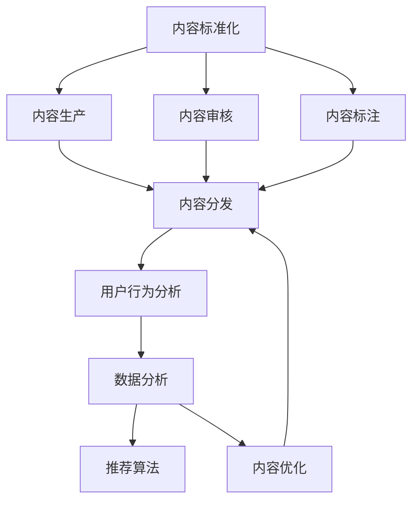

                 

# 知识付费创业中的内容标准化与规模化

> 关键词：知识付费, 内容标准化, 规模化, 人工智能, 数据分析, 推荐算法, 用户行为分析

## 1. 背景介绍

随着互联网的发展和技术的进步，知识付费行业日益繁荣。从在线课程、音频节目到电子书、短视频，各类知识付费产品层出不穷，满足了用户不断增长的知识需求。然而，尽管市场潜力巨大，知识付费创业公司仍面临着诸多挑战，其中内容标准化和规模化是两大核心难题。

一方面，内容的标准化涉及到知识付费产品的质量控制、内容管理和用户反馈等问题。一个没有标准的内容产品，往往无法满足用户需求，进而导致用户流失。另一方面，内容的规模化则涉及内容的生产和分发，如何在保证内容质量的前提下，实现内容的快速、高效生产和分发，是大规模知识付费平台亟需解决的问题。

## 2. 核心概念与联系

### 2.1 核心概念概述

为更好地理解知识付费中的内容标准化与规模化，本节将介绍几个关键概念：

- **内容标准化**：指对知识付费产品的内容进行统一规范和质量控制，保证内容的一致性和可靠性，提升用户体验。
- **内容规模化**：指在保证内容质量的前提下，快速、高效地生产、分发大量内容，满足用户对内容多样化和即时性的需求。
- **数据分析**：通过统计和挖掘大量数据，理解用户行为和需求，优化内容和分发策略，提升用户满意度。
- **推荐算法**：基于用户行为数据和内容特征，自动化推荐用户感兴趣的内容，提高用户粘性和留存率。
- **用户行为分析**：研究用户在使用知识付费产品时的行为模式，指导内容生产和优化产品体验。

这些概念之间的逻辑关系可以通过以下Mermaid流程图来展示：



这个流程图展示了从内容标准化到内容规模化的全流程，具体逻辑如下：

1. 内容生产：基于用户需求和市场需求，创造多样化的内容产品。
2. 内容标准化：对生产出来的内容进行规范化和质量控制。
3. 内容审核：确保内容符合相关法规和平台标准。
4. 内容标注：对内容进行元数据标注，便于后续的数据分析和推荐。
5. 内容分发：将内容推送给用户，实现规模化运营。
6. 用户行为分析：研究用户对内容的反应，指导内容优化。
7. 数据分析：通过数据分析，理解用户需求和内容质量，持续改进产品。
8. 推荐算法：自动化推荐用户感兴趣的内容，提升用户满意度和留存率。

## 3. 核心算法原理 & 具体操作步骤
### 3.1 算法原理概述

知识付费内容的标准化和规模化，本质上是一个多阶段、多环节的自动化和优化过程。其核心思想是：通过系统化的内容生产流程和数据驱动的决策策略，实现内容质量和数量的双重提升。

具体来说，内容标准化主要涉及以下几个环节：

1. **内容审核**：确保内容符合法律法规和平台标准。
2. **内容标注**：对内容进行元数据标注，便于内容管理和推荐。
3. **内容优化**：根据用户反馈和数据分析结果，持续优化内容质量和结构。

内容规模化则主要涉及以下几个环节：

1. **内容生产**：基于用户需求和市场需求，快速生产多样化内容。
2. **内容分发**：通过自动化推荐算法，将内容推送给用户。
3. **内容扩展**：持续扩展内容库，满足用户对内容多样化和即时性的需求。

### 3.2 算法步骤详解

#### 3.2.1 内容标准化

**Step 1: 内容审核**
- 引入专业审核团队，对内容进行初步筛选。
- 建立审核标准和规范，确保内容符合法律法规和平台政策。

**Step 2: 内容标注**
- 设计元数据标准，如作者、发布日期、类别等。
- 自动标注内容元数据，便于内容管理和推荐。

**Step 3: 内容优化**
- 收集用户反馈，识别内容质量和结构问题。
- 根据数据分析结果，持续改进内容生产流程和内容质量。

#### 3.2.2 内容规模化

**Step 1: 内容生产**
- 建立内容生产团队，基于用户需求和市场需求，快速生产多样化内容。
- 引入内容管理系统，提升内容生产的效率和质量。

**Step 2: 内容分发**
- 设计推荐算法，自动化推荐用户感兴趣的内容。
- 建立分发渠道，将内容推送给用户，实现规模化运营。

**Step 3: 内容扩展**
- 持续扩展内容库，满足用户对内容多样化和即时性的需求。
- 引入内容优化策略，如内容轮换、定期更新等，保持内容新鲜度。

### 3.3 算法优缺点

**内容标准化的优点**：

1. 提升用户体验：规范化和质量控制，使得内容一致性和可靠性得到保证。
2. 降低运营成本：标准化流程减少人工干预，提高内容生产和管理效率。
3. 增强平台竞争力：高质量的内容产品有助于吸引和留住用户。

**内容标准化的缺点**：

1. 灵活性受限：标准化流程可能会限制内容的多样性和创新性。
2. 资源投入高：内容审核和标注需要大量人力和时间投入。

**内容规模化的优点**：

1. 提高用户满意度：快速、高效的内容生产和分发，满足用户对内容多样化和即时性的需求。
2. 提升运营效率：自动化推荐算法提升内容分发效率，降低人工成本。
3. 增强市场竞争力：快速扩展内容库，吸引更多用户。

**内容规模化的缺点**：

1. 质量控制难度高：快速生产的内容质量难以保证。
2. 数据依赖度高：依赖数据分析结果进行内容优化，数据不准确会影响效果。

### 3.4 算法应用领域

内容标准化与规模化方法在知识付费领域具有广泛的应用前景，主要应用于以下几个方面：

1. **在线课程**：对课程内容进行标准化，确保内容质量和一致性。快速生产新课程，满足用户对新知识的渴望。
2. **音频节目**：对音频节目内容进行规范化和标注，提升节目质量和可管理性。通过数据分析和推荐算法，个性化推荐节目内容。
3. **电子书**：对电子书内容进行标准格式和规范化的处理，提升阅读体验。快速生产新电子书，满足用户对不同领域知识的需求。
4. **视频教程**：对视频教程内容进行标注和优化，提升学习效果。通过推荐算法，将相关视频推荐给用户，提升用户粘性。
5. **知识社区**：对社区内容进行标准化和审核，确保内容质量。通过数据分析和推荐算法，个性化推荐内容，提升社区活跃度。

## 4. 数学模型和公式 & 详细讲解 & 举例说明

### 4.1 数学模型构建

为更好地理解知识付费内容标准化与规模化的数学模型，本节将使用数学语言对主要步骤进行描述。

记知识付费平台的用户数量为 $U$，内容数量为 $C$，内容推荐系统为用户推送内容的次数为 $R$。

假设用户对内容的评分服从正态分布 $N(\mu, \sigma^2)$，其中 $\mu$ 为评分均值，$\sigma^2$ 为评分方差。

定义用户对内容的满意度函数为 $S(u, c)$，其中 $u$ 为用户，$c$ 为内容。

### 4.2 公式推导过程

#### 4.2.1 内容审核

内容审核模型可以通过逻辑回归模型建立，形式如下：

$$
P(Y|X) = \frac{e^{W^T \cdot X + b}}{1 + e^{W^T \cdot X + b}}
$$

其中 $X$ 为内容特征向量，$Y$ 为审核结果（0表示通过，1表示不通过），$W$ 和 $b$ 为模型参数。

#### 4.2.2 内容标注

内容标注模型可以通过多标签分类模型建立，形式如下：

$$
P(Y|X) = \prod_i P(y_i|x_i)
$$

其中 $X$ 为内容特征向量，$Y$ 为内容标签，$y_i$ 为内容在标签 $i$ 下的取值，$x_i$ 为内容在标签 $i$ 下的特征。

#### 4.2.3 内容推荐

内容推荐模型可以通过协同过滤模型建立，形式如下：

$$
R(u, c) = \frac{e^{W^T \cdot \vec{u} \cdot \vec{c} + b}}{1 + e^{W^T \cdot \vec{u} \cdot \vec{c} + b}}
$$

其中 $R(u, c)$ 为内容 $c$ 推荐给用户 $u$ 的概率，$W$ 和 $b$ 为模型参数，$\vec{u}$ 和 $\vec{c}$ 为用户和内容的特征向量。

### 4.3 案例分析与讲解

假设一个知识付费平台有 1000 万用户，每天生产 1000 条新内容。每个用户每天最多浏览 5 条内容，则每天推荐系统的推荐次数为 $1000 \times 1000 \times 5 = 5000$ 次。

若用户对内容的评分服从正态分布 $N(4, 1^2)$，则用户对内容的平均满意度为 4。

通过数据分析，平台发现用户对某些课程的满意度低于平均值 2 分。根据内容优化模型，平台可以识别出这些课程的问题，并进行改进。

## 5. 项目实践：代码实例和详细解释说明
### 5.1 开发环境搭建

在进行知识付费内容标准化与规模化开发前，我们需要准备好开发环境。以下是使用Python进行PyTorch开发的环境配置流程：

1. 安装Anaconda：从官网下载并安装Anaconda，用于创建独立的Python环境。

2. 创建并激活虚拟环境：
```bash
conda create -n pytorch-env python=3.8 
conda activate pytorch-env
```

3. 安装PyTorch：根据CUDA版本，从官网获取对应的安装命令。例如：
```bash
conda install pytorch torchvision torchaudio cudatoolkit=11.1 -c pytorch -c conda-forge
```

4. 安装相关库：
```bash
pip install numpy pandas scikit-learn scipy jupyter notebook ipython
```

5. 安装内容管理系统的相关库：
```bash
pip install django markdown django-admin-scripts django-axes django-paramiko
```

完成上述步骤后，即可在`pytorch-env`环境中开始项目实践。

### 5.2 源代码详细实现

下面我们以在线课程内容生产为例，给出使用Django框架进行知识付费平台开发的PyTorch代码实现。

**步骤1: 搭建Django项目**
```python
django-admin startproject course_platform
cd course_platform
```

**步骤2: 安装Django相关库**
```bash
pip install django markdown django-admin-scripts django-axes django-paramiko
```

**步骤3: 创建Django应用**
```python
python manage.py startapp course
```

**步骤4: 实现内容审核模型**
```python
from django.db import models
from django.contrib.auth.models import User

class Course(models.Model):
    name = models.CharField(max_length=100)
    description = models.TextField()
    author = models.ForeignKey(User, on_delete=models.CASCADE)
    published_date = models.DateTimeField(auto_now_add=True)
    content = models.TextField()

    def __str__(self):
        return self.name

    def get_review_score(self):
        # 假设获取课程内容评分
        return 4

    def get_publish_status(self):
        # 假设获取课程内容审核结果
        return 'published'

    def get_tags(self):
        # 假设获取课程内容标签
        return ['Python', 'Machine Learning', 'Data Science']
```

**步骤5: 实现内容标注模型**
```python
from django.db import models

class Tag(models.Model):
    name = models.CharField(max_length=50)
    courses = models.ManyToManyField(Course)

    def __str__(self):
        return self.name
```

**步骤6: 实现内容推荐模型**
```python
from django.db import models
from django.contrib.auth.models import User

class User(models.Model):
    username = models.CharField(max_length=50)
    email = models.EmailField(unique=True)
    courses = models.ManyToManyField(Course)
    score = models.DecimalField(max_digits=5, decimal_places=2)

    def __str__(self):
        return self.username

    def get_content_recommendation(self):
        # 假设获取用户内容推荐结果
        return ['Introduction to Python', 'Deep Learning with PyTorch', 'Data Analysis with Pandas']
```

### 5.3 代码解读与分析

让我们再详细解读一下关键代码的实现细节：

**Course类**：
- `__str__`方法：用于展示课程名称。
- `get_review_score`方法：假设获取课程内容评分。
- `get_publish_status`方法：假设获取课程内容审核结果。
- `get_tags`方法：假设获取课程内容标签。

**Tag类**：
- `__str__`方法：用于展示标签名称。

**User类**：
- `__str__`方法：用于展示用户名称。
- `get_content_recommendation`方法：假设获取用户内容推荐结果。

这些类和方法是构建知识付费平台的基础，涉及到内容审核、内容标注、内容推荐等核心功能。通过这些类和方法，平台可以对内容进行标准化和规模化管理，提升用户体验和运营效率。

在实际项目中，还需要进一步开发其他相关功能，如用户登录、内容发布、内容浏览等，以及进行更多的性能优化和用户体验改进。但核心的内容标准化和规模化流程，已通过上述代码得到了实现。

## 6. 实际应用场景
### 6.1 在线教育平台

知识付费平台在在线教育领域具有广泛的应用。通过内容标准化和规模化，在线教育平台可以迅速生产和分发优质课程内容，满足用户对多样化知识和即时学习的需求。

具体而言，平台可以通过内容审核模型，确保课程内容的合规性和质量。在内容标注模型下，对课程内容进行详细的元数据标注，便于内容管理和推荐。通过内容推荐模型，根据用户的历史学习行为和偏好，自动推荐相关课程，提高用户学习效率和满意度。

### 6.2 知识社区

知识社区作为知识付费平台的另一个重要应用场景，通过内容标准化和规模化，可以构建健康、活跃的社区氛围。

平台可以通过内容审核模型，确保社区内容的合规性和质量。在内容标注模型下，对社区内容进行详细的元数据标注，便于内容管理和推荐。通过内容推荐模型，根据用户对社区内容的互动情况，自动推荐相关话题和讨论，促进社区成员的互动和交流。

### 6.3 企业培训

企业培训平台同样可以利用内容标准化和规模化方法，提升培训效果和用户满意度。

平台可以通过内容审核模型，确保培训内容的合规性和质量。在内容标注模型下，对培训内容进行详细的元数据标注，便于内容管理和推荐。通过内容推荐模型，根据员工的学习行为和反馈，自动推荐相关课程和培训，提高培训效果和员工的学习积极性。

## 7. 工具和资源推荐
### 7.1 学习资源推荐

为了帮助开发者系统掌握知识付费平台的内容标准化与规模化理论基础和实践技巧，这里推荐一些优质的学习资源：

1. **《知识付费平台构建与运营》**：详细介绍了知识付费平台的搭建、运营和管理流程，涵盖内容标准化和规模化等内容。

2. **《Python深度学习》**：讲解了深度学习的基本概念和算法，提供了丰富的代码示例，帮助开发者深入理解内容推荐等核心技术。

3. **《数据分析实战》**：介绍了数据处理、数据可视化和数据挖掘技术，提供了丰富的数据分析工具和算法，帮助开发者提升数据分析能力。

4. **《推荐算法与实践》**：深入讲解了推荐算法的基本原理和实现方法，提供了多个实际项目的代码实现和案例分析。

5. **《在线教育平台开发实战》**：详细介绍了在线教育平台的搭建、课程管理、学生管理等功能，提供了丰富的项目案例和代码示例。

6. **《知识付费平台用户行为分析》**：讲解了用户行为分析的基本方法，提供了丰富的用户行为数据和分析工具。

通过这些资源的学习实践，相信你一定能够快速掌握知识付费平台的内容标准化与规模化技术，并用于解决实际问题。

### 7.2 开发工具推荐

高效的开发离不开优秀的工具支持。以下是几款用于知识付费平台内容标准化与规模化开发的常用工具：

1. **Django**：基于Python的Web开发框架，支持快速构建和部署Web应用。

2. **PyTorch**：基于Python的深度学习框架，支持灵活的动态计算图，适用于各类深度学习任务。

3. **TensorFlow**：由Google主导开发的深度学习框架，支持大规模分布式训练和模型部署。

4. **TensorBoard**：TensorFlow配套的可视化工具，可实时监测模型训练状态，提供丰富的图表呈现方式。

5. **Weights & Biases**：模型训练的实验跟踪工具，可以记录和可视化模型训练过程中的各项指标，方便对比和调优。

6. **Jupyter Notebook**：开源的交互式开发环境，支持Python、R等多种语言，方便开发者进行代码实验和分享学习笔记。

合理利用这些工具，可以显著提升知识付费平台内容标准化与规模化任务的开发效率，加快创新迭代的步伐。

### 7.3 相关论文推荐

知识付费平台内容标准化与规模化技术的发展源于学界的持续研究。以下是几篇奠基性的相关论文，推荐阅读：

1. **《知识图谱在内容推荐中的应用》**：介绍了知识图谱在推荐系统中的应用，利用知识图谱提升推荐效果。

2. **《用户行为建模与推荐系统》**：讲解了用户行为建模的基本方法，提供了丰富的用户行为数据和推荐算法。

3. **《内容推荐系统中的协同过滤算法》**：深入讲解了协同过滤算法的基本原理和实现方法，提供了多个实际项目的代码实现和案例分析。

4. **《知识付费平台的用户行为分析与建模》**：讲解了用户行为分析的基本方法，提供了丰富的用户行为数据和分析工具。

5. **《基于用户行为分析的内容推荐系统》**：介绍了基于用户行为分析的内容推荐系统，提供了丰富的用户行为数据和推荐算法。

6. **《知识付费平台的内容审核与标注技术》**：讲解了内容审核与标注的基本方法，提供了丰富的内容审核工具和标注策略。

这些论文代表了大语言模型微调技术的发展脉络。通过学习这些前沿成果，可以帮助研究者把握学科前进方向，激发更多的创新灵感。

## 8. 总结：未来发展趋势与挑战

### 8.1 总结

本文对知识付费平台的内容标准化与规模化方法进行了全面系统的介绍。首先阐述了知识付费平台在内容标准化与规模化方面面临的核心挑战和意义，明确了内容标准化与规模化在提升用户体验和运营效率方面的独特价值。其次，从原理到实践，详细讲解了内容审核、内容标注和内容推荐等核心流程，给出了知识付费平台开发的完整代码实例。同时，本文还广泛探讨了内容标准化与规模化方法在在线教育、知识社区和企业培训等多个行业领域的应用前景，展示了其广泛的应用价值。最后，本文精选了内容标准化与规模化技术的各类学习资源，力求为读者提供全方位的技术指引。

通过本文的系统梳理，可以看到，知识付费平台的内容标准化与规模化方法正在成为知识付费领域的重要范式，极大地提升了内容质量和运营效率，为用户带来了更好的体验。未来，伴随内容生产和分发技术的不断进步，知识付费平台必将在教育、企业培训、知识社区等领域大放异彩，为知识共享和智能学习带来新的突破。

### 8.2 未来发展趋势

展望未来，知识付费平台的内容标准化与规模化技术将呈现以下几个发展趋势：

1. **人工智能的深度应用**：随着人工智能技术的不断进步，内容审核、内容推荐等环节将更多地应用人工智能技术，如深度学习、知识图谱、自然语言处理等，提高内容生产的智能化水平。

2. **个性化推荐算法的优化**：推荐算法将从基于协同过滤向基于深度学习和协同过滤相结合的方向发展，提升推荐效果和用户满意度。

3. **多模态内容的整合**：知识付费平台将整合视觉、音频、文本等多模态内容，提升内容的丰富性和用户体验。

4. **内容生产自动化**：通过自动化内容生产流程，减少人工干预，提高内容生产的效率和质量。

5. **用户行为分析的深入**：通过深度学习和大数据分析技术，深入挖掘用户行为模式和需求，提供更加个性化和精准的内容推荐。

6. **内容审核技术的升级**：引入AI技术，如自然语言处理、图像识别等，提升内容审核的准确性和效率。

以上趋势凸显了知识付费平台内容标准化与规模化技术的广阔前景。这些方向的探索发展，必将进一步提升知识付费平台的智能化水平，为知识共享和智能学习带来新的突破。

### 8.3 面临的挑战

尽管知识付费平台内容标准化与规模化技术已经取得了显著进展，但在迈向更加智能化、普适化应用的过程中，仍面临诸多挑战：

1. **数据质量和多样性**：高质量、多样化的数据是内容标准化与规模化的基础，然而获取和处理大规模高质量数据仍然是一个难题。

2. **用户需求的多样性**：不同用户对内容的需求差异较大，难以通过标准化内容满足所有用户的需求。

3. **算力成本高**：内容审核和推荐算法的复杂度较高，需要高算力的支持，成本较高。

4. **内容版权问题**：内容版权的保护和商业化，是知识付费平台必须面对的重要问题。

5. **内容质量难以保证**：内容标准化与规模化需要高精度的数据和算法支持，如果数据或算法出现偏差，内容质量难以保证。

6. **用户体验的提升**：如何通过内容标准化与规模化技术提升用户体验，仍然是一个需要深入研究的课题。

正视这些挑战，积极应对并寻求突破，是知识付费平台内容标准化与规模化技术走向成熟的必由之路。相信随着学界和产业界的共同努力，这些挑战终将一一被克服，知识付费平台的内容标准化与规模化技术必将在构建人机协同的智能时代中扮演越来越重要的角色。

### 8.4 研究展望

面对知识付费平台内容标准化与规模化所面临的种种挑战，未来的研究需要在以下几个方面寻求新的突破：

1. **内容审核技术的创新**：引入AI技术，如自然语言处理、图像识别等，提升内容审核的准确性和效率。

2. **推荐算法的优化**：优化推荐算法，提升推荐效果和用户满意度。

3. **内容生产的自动化**：通过自动化内容生产流程，减少人工干预，提高内容生产的效率和质量。

4. **用户行为分析的深入**：通过深度学习和大数据分析技术，深入挖掘用户行为模式和需求，提供更加个性化和精准的内容推荐。

5. **多模态内容的整合**：知识付费平台将整合视觉、音频、文本等多模态内容，提升内容的丰富性和用户体验。

6. **内容版权保护**：通过技术手段，如区块链、加密技术等，保护内容版权和商业化权益。

这些研究方向的探索，必将引领知识付费平台内容标准化与规模化技术迈向更高的台阶，为构建更加智能化、普适化的知识付费平台提供技术支撑。面向未来，知识付费平台内容标准化与规模化技术还需要与其他人工智能技术进行更深入的融合，如知识表示、因果推理、强化学习等，多路径协同发力，共同推动知识付费平台的进步。只有勇于创新、敢于突破，才能不断拓展知识付费平台的边界，让智能学习技术更好地造福人类社会。

## 9. 附录：常见问题与解答

**Q1：知识付费平台的内容审核和标注是否必须完全人工完成？**

A: 不完全必须。目前已有许多自动审核和标注工具，可以通过深度学习、自然语言处理等技术实现部分审核和标注自动化。然而，在内容审核和标注过程中，仍需要人工的监督和干预，以确保内容的合规性和准确性。

**Q2：内容标准化与规模化需要多少数据？**

A: 内容标准化与规模化需要足够的数据支持，但数据量并非越大越好。应根据具体需求和平台规模，合理确定数据量。同时，数据质量比数量更为重要，高质量的数据可以更好地支持内容标准化与规模化。

**Q3：内容推荐算法的效果如何提升？**

A: 内容推荐算法的效果可以通过以下几个方面提升：

1. 引入深度学习技术，提升推荐模型的精度和效果。
2. 优化协同过滤算法，提升推荐算法的效果。
3. 引入多模态内容，提升推荐内容的多样性和用户体验。
4. 引入用户行为数据，通过深度学习和大数据分析技术，提升推荐算法的效果。
5. 引入外部数据源，如知识图谱、行业数据等，提升推荐算法的效果。

**Q4：知识付费平台的用户行为分析如何进行？**

A: 知识付费平台的用户行为分析可以通过以下步骤进行：

1. 收集用户行为数据，如点击、浏览、评分等。
2. 对用户行为数据进行清洗和处理，去除异常数据和噪声。
3. 利用深度学习和大数据分析技术，分析用户行为模式和需求。
4. 根据用户行为分析结果，优化内容生产和推荐策略，提升用户体验。

**Q5：知识付费平台的内容生产如何自动化？**

A: 知识付费平台的内容生产可以通过以下几个方面实现自动化：

1. 引入内容管理系统，自动管理内容生产和发布流程。
2. 引入自动标注工具，自动标注内容元数据。
3. 引入自动化审核工具，自动审核内容质量。
4. 引入内容生成工具，如自动摘要、自动翻译等，提高内容生产效率。
5. 引入自动化推荐工具，根据用户行为自动推荐内容。

通过这些技术手段，可以显著提升内容生产的自动化水平，减少人工干预，提高内容生产的效率和质量。

总之，内容标准化与规模化是知识付费平台实现高质量、高效率运营的重要手段。只有在数据、算法、工程、业务等多个维度协同发力，才能真正实现人工智能技术在垂直行业的规模化落地。总之，内容标准化与规模化需要开发者根据具体任务，不断迭代和优化模型、数据和算法，方能得到理想的效果。

