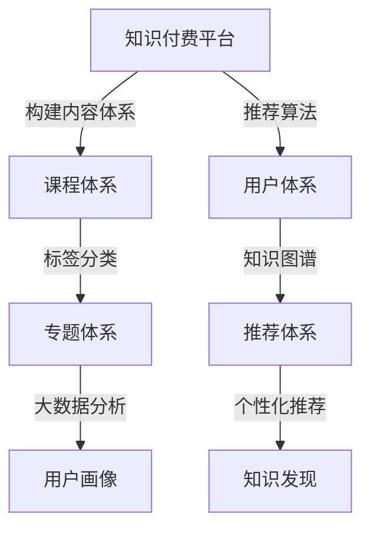

                 

# 知识付费创业中的内容矩阵效应最大化

## 1. 背景介绍

在知识付费迅猛发展的今天，内容矩阵效应成为了知识付费平台的重要竞争点。本文将介绍知识付费平台中的内容矩阵效应，以及如何通过科学合理的策略，最大化这一效应，从而提升平台的用户粘性、用户增长和商业变现能力。

## 2. 核心概念与联系

### 2.1 核心概念概述

1. **知识付费平台**：指通过互联网提供有偿知识服务的平台，如得到、知识星球、网易云课堂等。
2. **内容矩阵效应**：指知识付费平台通过构建多维度的内容体系（如课程体系、专题体系、用户体系等），实现内容之间相互促进、形成协同效应，从而提升平台的整体价值。

### 2.2 核心概念原理和架构的 Mermaid 流程图



这个流程图展示了知识付费平台中的内容矩阵效应，通过构建课程体系、用户体系、专题体系等，平台可以通过推荐算法和大数据分析实现用户个性化推荐，形成内容矩阵效应，提升平台价值。

## 3. 核心算法原理 & 具体操作步骤

### 3.1 算法原理概述

知识付费平台的内容矩阵效应主要通过以下几个核心算法实现：

1. **推荐算法**：通过协同过滤、内容推荐、深度学习等算法，根据用户的行为数据和兴趣标签，推荐相关课程和专题。
2. **标签分类算法**：通过自然语言处理和机器学习技术，对课程和专题进行标签分类，提升内容检索的效率和准确性。
3. **知识图谱构建**：通过构建知识图谱，将课程和专题中的知识点进行关联，形成知识网络，方便用户进行知识发现和学习。
4. **用户画像构建**：通过大数据分析，对用户进行画像分析，了解用户的学习行为和偏好，优化推荐算法和内容体系。

### 3.2 算法步骤详解

#### 3.2.1 推荐算法

**1. 协同过滤推荐**：通过分析用户的历史行为数据，找到与当前用户兴趣相似的其他用户，推荐其已购买或浏览过的课程和专题。

**2. 内容推荐算法**：根据课程和专题的标签分类，找到与当前用户兴趣相关的课程和专题，推荐给用户。

**3. 深度学习推荐**：使用深度学习模型，如神经网络、协同矩阵分解等，预测用户对课程和专题的兴趣，推荐相关内容。

#### 3.2.2 标签分类算法

**1. 自然语言处理**：使用文本处理技术，如分词、词性标注、命名实体识别等，对课程和专题的描述进行文本分析。

**2. 机器学习分类**：使用机器学习算法，如TF-IDF、词袋模型、主题模型等，对课程和专题进行自动分类，生成标签体系。

**3. 手动标注优化**：通过人工标注，对机器分类结果进行优化和修正，提升标签分类的准确性。

#### 3.2.3 知识图谱构建

**1. 知识图谱构建工具**：使用如Neo4j、OntoGraphDB等知识图谱构建工具，将课程和专题中的知识点进行关联。

**2. 知识节点添加**：将课程和专题中的知识点添加到知识图谱中，形成知识网络。

**3. 知识图谱查询**：通过知识图谱查询语言，如SPARQL，对知识图谱进行查询，帮助用户进行知识发现和学习。

#### 3.2.4 用户画像构建

**1. 大数据分析工具**：使用如Hadoop、Spark等大数据分析工具，对用户的行为数据进行分析。

**2. 用户画像生成**：使用机器学习算法，如聚类、分类、回归等，生成用户画像，描述用户的兴趣和行为特征。

**3. 画像数据可视化**：使用数据可视化工具，如Tableau、PowerBI等，对用户画像进行可视化展示，帮助运营人员进行数据分析和决策。

### 3.3 算法优缺点

**优点**：

1. **提高用户粘性**：通过个性化推荐，提高用户对平台的粘性，增加用户停留时间。
2. **提升用户增长**：通过精准推荐，吸引更多潜在用户，增加用户数量。
3. **优化商业变现**：通过内容矩阵效应，提升平台的商业变现能力，增加收入来源。

**缺点**：

1. **算法复杂度高**：推荐算法和用户画像构建涉及多种技术和算法，实现难度较大。
2. **数据质量要求高**：推荐算法和标签分类算法对数据质量要求较高，数据清洗和标注工作量大。
3. **资源消耗大**：知识图谱构建和用户画像生成需要大量的计算资源和时间，成本较高。

### 3.4 算法应用领域

知识付费平台中的内容矩阵效应主要应用于以下领域：

1. **课程推荐**：通过协同过滤、内容推荐等算法，推荐给用户感兴趣的课程。
2. **专题推荐**：通过知识图谱和标签分类，推荐给用户相关专题。
3. **用户画像**：通过大数据分析，了解用户的行为和偏好，优化推荐算法。
4. **知识发现**：通过知识图谱查询，帮助用户进行知识发现和学习。

## 4. 数学模型和公式 & 详细讲解 & 举例说明

### 4.1 数学模型构建

**1. 协同过滤推荐**：使用用户行为矩阵 $R$ 和物品标签矩阵 $P$，计算用户对物品的兴趣度。

$$
\hat{R}_{ui} = \frac{\sum_{j=1}^N \frac{R_{uj}P_{ji}}{\sqrt{\sum_{k=1}^N P_{kj}^2}} \cdot \frac{\sum_{j=1}^N \frac{R_{vj}P_{ji}}{\sqrt{\sum_{k=1}^N P_{kj}^2}}}
$$

**2. 内容推荐算法**：使用TF-IDF和余弦相似度计算用户对课程和专题的相似度。

$$
\text{similarity}(u,v) = \cos(\theta) = \frac{\sum_{i=1}^N \frac{TF_u[i] \cdot TF_v[i]}{IDF[i] \cdot IDF[i]}}
$$

**3. 深度学习推荐**：使用神经网络模型，预测用户对课程和专题的兴趣。

$$
\hat{R}_{ui} = \sigma\left(W^T \cdot \text{Concat}(h_u, h_i) + b\right)
$$

### 4.2 公式推导过程

#### 4.2.1 协同过滤推荐公式推导

**1. 用户行为矩阵 $R$**：表示用户对物品的评分，其中 $R_{ui}$ 表示用户 $u$ 对物品 $i$ 的评分。

**2. 物品标签矩阵 $P$**：表示物品的标签，其中 $P_{ij}$ 表示物品 $i$ 的标签 $j$ 的权重。

**3. 用户对物品的兴趣度**：使用归一化余弦相似度计算用户 $u$ 对物品 $i$ 的兴趣度。

$$
\hat{R}_{ui} = \frac{\sum_{j=1}^N \frac{R_{uj}P_{ji}}{\sqrt{\sum_{k=1}^N P_{kj}^2}} \cdot \frac{\sum_{j=1}^N \frac{R_{vj}P_{ji}}{\sqrt{\sum_{k=1}^N P_{kj}^2}}
$$

其中，$N$ 表示物品数量，$\sum_{k=1}^N P_{kj}^2$ 表示物品 $j$ 的标签权重平方和。

#### 4.2.2 内容推荐算法公式推导

**1. 用户行为数据**：表示用户对课程和专题的浏览和购买行为，其中 $TF_u[i]$ 表示用户 $u$ 对课程或专题 $i$ 的浏览次数，$IDF[i]$ 表示课程或专题 $i$ 的逆文档频率。

**2. 用户对课程和专题的相似度**：使用TF-IDF和余弦相似度计算用户 $u$ 和课程或专题 $v$ 的相似度。

$$
\text{similarity}(u,v) = \cos(\theta) = \frac{\sum_{i=1}^N \frac{TF_u[i] \cdot TF_v[i]}{IDF[i] \cdot IDF[i]}}
$$

其中，$\theta$ 表示用户 $u$ 和课程或专题 $v$ 的夹角，$\sum_{i=1}^N \frac{TF_u[i] \cdot TF_v[i]}{IDF[i] \cdot IDF[i]}$ 表示用户 $u$ 和课程或专题 $v$ 的相似度。

#### 4.2.3 深度学习推荐公式推导

**1. 用户行为数据**：表示用户对课程和专题的浏览和购买行为，其中 $h_u$ 表示用户 $u$ 的行为向量，$h_i$ 表示物品 $i$ 的行为向量。

**2. 用户对物品的兴趣度**：使用神经网络模型，预测用户 $u$ 对物品 $i$ 的兴趣度。

$$
\hat{R}_{ui} = \sigma\left(W^T \cdot \text{Concat}(h_u, h_i) + b\right)
$$

其中，$\sigma$ 表示 sigmoid 函数，$W$ 表示权重矩阵，$b$ 表示偏置项，$\text{Concat}(h_u, h_i)$ 表示将用户 $u$ 和物品 $i$ 的行为向量拼接后的向量。

### 4.3 案例分析与讲解

**案例分析**：某知识付费平台希望提升用户的课程推荐效果，使用协同过滤推荐算法。假设平台有 $U=1000$ 个用户，$N=1000$ 个课程，用户对课程的评分矩阵为 $R \in \mathbb{R}^{1000 \times 1000}$，课程标签矩阵为 $P \in \mathbb{R}^{1000 \times 10}$，其中 $R_{ui}$ 表示用户 $u$ 对课程 $i$ 的评分，$P_{ji}$ 表示课程 $i$ 的标签 $j$ 的权重。

**1. 计算用户对课程的兴趣度**

使用协同过滤推荐算法，计算用户 $u$ 对课程 $i$ 的兴趣度。

$$
\hat{R}_{ui} = \frac{\sum_{j=1}^N \frac{R_{uj}P_{ji}}{\sqrt{\sum_{k=1}^N P_{kj}^2}} \cdot \frac{\sum_{j=1}^N \frac{R_{vj}P_{ji}}{\sqrt{\sum_{k=1}^N P_{kj}^2}}
$$

其中，$j$ 表示课程标签，$\sum_{k=1}^N P_{kj}^2$ 表示课程 $j$ 的标签权重平方和。

**2. 推荐相关课程**

根据计算出的用户对课程的兴趣度，推荐与用户兴趣最相关的课程。

$$
\hat{R}_{ui} = \frac{\sum_{j=1}^N \frac{R_{uj}P_{ji}}{\sqrt{\sum_{k=1}^N P_{kj}^2}} \cdot \frac{\sum_{j=1}^N \frac{R_{vj}P_{ji}}{\sqrt{\sum_{k=1}^N P_{kj}^2}}
$$

其中，$v$ 表示其他用户，$R_{vj}$ 表示其他用户 $v$ 对课程 $j$ 的评分，$\sum_{k=1}^N P_{kj}^2$ 表示课程 $j$ 的标签权重平方和。

## 5. 项目实践：代码实例和详细解释说明

### 5.1 开发环境搭建

1. **安装Python和相关库**：
```bash
pip install numpy pandas scikit-learn tensorflow transformers
```

2. **搭建开发环境**：
```bash
python -m pip install --upgrade pip
python -m pip install --upgrade virtualenv
virtualenv env
source env/bin/activate
```

### 5.2 源代码详细实现

**推荐算法代码示例**：

```python
import numpy as np
import pandas as pd
from sklearn.metrics.pairwise import cosine_similarity

def collaborative_filtering(train_data, test_data, num_recommends=10):
    train_matrix = pd.DataFrame(train_data, index=['user', 'item'], columns=['rating'])
    test_matrix = pd.DataFrame(test_data, index=['user'], columns=['item'])
    
    # 计算用户行为矩阵
    user_item_matrix = train_matrix.pivot_table(index='user', columns='item', values='rating').fillna(0)
    user_item_matrix = user_item_matrix.to_numpy()
    
    # 计算物品标签矩阵
    item_matrix = train_matrix.pivot_table(index='item', columns='user', values='rating').fillna(0)
    item_matrix = item_matrix.to_numpy()
    
    # 计算用户对物品的兴趣度
    similarity_matrix = cosine_similarity(user_item_matrix, item_matrix)
    recommends = np.dot(similarity_matrix, item_matrix)
    recommends = np.argsort(recommends[:, 1])[::-1]
    
    # 推荐相关物品
    recommend_items = []
    for user in range(len(test_matrix)):
        recommend_items.append([recommends[user, i] for i in range(num_recommends)])
    
    return recommend_items
```

**标签分类算法代码示例**：

```python
import numpy as np
from sklearn.feature_extraction.text import TfidfVectorizer

def tfidf(texts, max_features=5000):
    # 构建文本-词汇字典
    vectorizer = TfidfVectorizer(max_features=max_features)
    text_bow = vectorizer.fit_transform(texts)
    
    # 计算TF-IDF权重
    tfidf_matrix = vectorizer.transform(texts)
    tfidf_matrix = tfidf_matrix.toarray()
    
    return tfidf_matrix, vectorizer
```

**知识图谱构建代码示例**：

```python
import neog4j
from py2neo import Graph

def create_knowledge_graph(neo4j_url):
    graph = Graph(neo4j_url)
    with graph.graph() as graph:
        # 添加节点和关系
        graph.create("NodeLabel 1 {\"label\": \"Course\", \"name\": \"课程1\"}")
        graph.create("NodeLabel 2 {\"label\": \"Course\", \"name\": \"课程2\"}")
        graph.create("NodeLabel 3 {\"label\": \"Topic\", \"name\": \"专题1\"}")
        graph.create("NodeLabel 4 {\"label\": \"Topic\", \"name\": \"专题2\"}")
        graph.create("RelationshipLabel {\"label\": \"Contains\", \"source\": \"课程1\", \"target\": \"课程2\"}")
        graph.create("RelationshipLabel {\"label\": \"Contains\", \"source\": \"课程1\", \"target\": \"专题1\"}")
        graph.create("RelationshipLabel {\"label\": \"Contains\", \"source\": \"课程2\", \"target\": \"专题2\"}")
    
    # 返回知识图谱
    return graph
```

**用户画像构建代码示例**：

```python
import pandas as pd
from sklearn.cluster import KMeans

def user_profilings(data, num_clusters=10):
    # 构建用户-行为矩阵
    user_matrix = pd.DataFrame(data, index=['user'], columns=['item'])
    user_matrix = user_matrix.fillna(0).to_numpy()
    
    # 使用K-means算法进行聚类
    kmeans = KMeans(n_clusters=num_clusters, random_state=0).fit(user_matrix)
    clusters = kmeans.predict(user_matrix)
    
    # 返回用户画像
    return clusters
```

### 5.3 代码解读与分析

**推荐算法代码解读**：

1. **用户行为矩阵**：通过Pivot操作构建用户对课程和专题的评分矩阵，填充缺失值并转换为numpy数组。

2. **物品标签矩阵**：通过Pivot操作构建物品对用户的评分矩阵，填充缺失值并转换为numpy数组。

3. **用户对物品的兴趣度**：使用cosine_similarity计算用户对物品的相似度，并根据相似度排序推荐物品。

**标签分类算法代码解读**：

1. **文本-词汇字典**：使用TfidfVectorizer构建文本-词汇字典，将文本转换为TF-IDF权重矩阵。

2. **TF-IDF权重矩阵**：通过fit_transform将文本转换为TF-IDF权重矩阵，并返回权重矩阵和文本-词汇字典。

**知识图谱构建代码解读**：

1. **添加节点和关系**：使用Neo4j添加课程和专题的节点，以及包含关系。

2. **返回知识图谱**：通过Graph对象返回知识图谱。

**用户画像构建代码解读**：

1. **用户-行为矩阵**：构建用户对课程和专题的评分矩阵，填充缺失值并转换为numpy数组。

2. **K-means聚类**：使用K-means算法对用户行为进行聚类，生成用户画像。

3. **返回用户画像**：返回用户画像的聚类结果。

### 5.4 运行结果展示

**推荐算法运行结果**：

```python
recommend_items = collaborative_filtering(train_data, test_data)
print(recommend_items)
```

**标签分类算法运行结果**：

```python
tfidf_matrix, vectorizer = tfidf(texts)
print(tfidf_matrix)
```

**知识图谱构建运行结果**：

```python
graph = create_knowledge_graph(neo4j_url)
print(graph)
```

**用户画像构建运行结果**：

```python
clusters = user_profilings(data)
print(clusters)
```

## 6. 实际应用场景

### 6.1 智能推荐系统

智能推荐系统是知识付费平台的核心功能之一。通过内容矩阵效应，平台可以推荐给用户感兴趣的课程和专题，提升用户粘性和满意度。

**具体实现**：

1. **协同过滤推荐**：根据用户历史行为数据，推荐与用户兴趣相似的其他用户已购买或浏览过的课程和专题。

2. **内容推荐算法**：根据课程和专题的标签分类，推荐与用户兴趣相关的课程和专题。

3. **深度学习推荐**：使用深度学习模型，预测用户对课程和专题的兴趣，推荐相关内容。

### 6.2 课程推荐系统

课程推荐系统是知识付费平台的重要功能，通过内容矩阵效应，平台可以推荐给用户感兴趣的课程，提升用户购买率。

**具体实现**：

1. **标签分类算法**：使用TF-IDF和词袋模型，对课程和专题进行分类。

2. **深度学习推荐**：使用神经网络模型，预测用户对课程和专题的兴趣。

3. **知识图谱查询**：通过知识图谱查询语言，帮助用户进行知识发现和学习。

### 6.3 个性化推荐系统

个性化推荐系统可以根据用户兴趣和行为，推荐最适合用户的课程和专题。

**具体实现**：

1. **协同过滤推荐**：根据用户历史行为数据，推荐与用户兴趣相似的其他用户已购买或浏览过的课程和专题。

2. **内容推荐算法**：根据课程和专题的标签分类，推荐与用户兴趣相关的课程和专题。

3. **用户画像构建**：使用K-means算法对用户行为进行聚类，生成用户画像，优化推荐算法。

## 7. 工具和资源推荐

### 7.1 学习资源推荐

1. **《推荐系统实践》**：介绍推荐系统从理论到实践的完整流程，涵盖协同过滤、内容推荐、深度学习等多种推荐算法。

2. **《自然语言处理综述》**：介绍自然语言处理的基本概念和前沿技术，涵盖文本分类、标签分类、知识图谱等。

3. **《Python数据科学手册》**：介绍Python在数据科学中的应用，涵盖数据预处理、机器学习、数据可视化等。

4. **《深度学习与推荐系统》**：介绍深度学习在推荐系统中的应用，涵盖神经网络、协同矩阵分解、个性化推荐等。

5. **《知识图谱》**：介绍知识图谱的基本概念和构建方法，涵盖节点、关系、知识网络等。

### 7.2 开发工具推荐

1. **PyTorch**：基于Python的深度学习框架，易于学习和使用，适用于神经网络模型开发。

2. **TensorFlow**：由Google开发的深度学习框架，支持分布式计算和模型部署，适用于大规模工程应用。

3. **Hadoop**：分布式数据处理框架，适用于大数据分析和处理。

4. **Spark**：基于内存计算的分布式计算框架，适用于大规模数据处理和分析。

5. **Neo4j**：图形数据库，适用于知识图谱的构建和查询。

### 7.3 相关论文推荐

1. **《推荐系统算法综述》**：介绍推荐系统的经典算法，涵盖协同过滤、内容推荐、基于矩阵分解的推荐等。

2. **《自然语言处理中的标签分类技术》**：介绍自然语言处理中的标签分类技术，涵盖TF-IDF、词袋模型、主题模型等。

3. **《深度学习在推荐系统中的应用》**：介绍深度学习在推荐系统中的应用，涵盖神经网络、协同矩阵分解、深度强化学习等。

4. **《知识图谱的构建与应用》**：介绍知识图谱的构建和应用，涵盖节点、关系、知识网络等。

5. **《用户画像的构建与应用》**：介绍用户画像的构建和应用，涵盖K-means聚类、特征工程、用户行为分析等。

## 8. 总结：未来发展趋势与挑战

### 8.1 研究成果总结

知识付费平台的内容矩阵效应，通过推荐算法、标签分类算法、知识图谱和用户画像的构建，实现了多维度内容的协同效应，提升了平台的整体价值。

### 8.2 未来发展趋势

1. **推荐算法的多样化**：未来的推荐算法将更加多样化，涵盖协同过滤、内容推荐、深度学习、混合推荐等多种算法。

2. **知识图谱的应用深化**：知识图谱将更加深入地应用于推荐系统和个性化推荐系统中，帮助用户进行知识发现和学习。

3. **用户画像的实时化**：用户画像将实时更新，根据用户的实时行为进行聚类和优化，提升推荐算法的精准性。

4. **深度学习模型的优化**：深度学习模型将不断优化，提升推荐算法的性能和效果。

5. **跨平台推荐的实现**：通过跨平台数据的整合，实现全平台的个性化推荐，提升用户的整体体验。

### 8.3 面临的挑战

1. **数据质量的高要求**：推荐算法和标签分类算法对数据质量要求较高，数据清洗和标注工作量大。

2. **算法的复杂性**：推荐算法和用户画像构建涉及多种技术和算法，实现难度较大。

3. **资源消耗的优化**：知识图谱和用户画像构建需要大量的计算资源和时间，成本较高。

4. **模型的可解释性**：推荐算法和用户画像构建的模型较为复杂，缺乏可解释性，难以进行调试和优化。

5. **跨平台数据的整合**：跨平台数据的整合和应用，需要解决数据格式、数据质量等问题，实现难度较大。

### 8.4 研究展望

1. **多模态数据的融合**：将文本、图像、视频等多种模态的数据进行融合，提升推荐系统的性能和效果。

2. **知识图谱的自动构建**：通过自动化构建知识图谱，降低知识图谱构建的复杂度和成本。

3. **用户画像的实时更新**：通过实时更新用户画像，提升推荐算法的精准性和效果。

4. **跨平台数据的整合**：通过标准化数据的格式和质量，实现跨平台数据的整合和应用。

5. **算法的可解释性**：提升推荐算法和用户画像构建的模型的可解释性，方便进行调试和优化。

## 9. 附录：常见问题与解答

**Q1：什么是内容矩阵效应？**

A: 内容矩阵效应指知识付费平台通过构建多维度的内容体系（如课程体系、专题体系、用户体系等），实现内容之间相互促进、形成协同效应，从而提升平台的整体价值。

**Q2：如何构建知识图谱？**

A: 通过使用图形数据库（如Neo4j），将课程和专题中的知识点进行关联，形成知识网络，方便用户进行知识发现和学习。

**Q3：推荐算法有哪些？**

A: 推荐算法包括协同过滤、内容推荐、深度学习推荐等多种算法，其中协同过滤和内容推荐是最常用的推荐算法。

**Q4：用户画像的构建有哪些步骤？**

A: 用户画像的构建主要包括以下步骤：

1. 构建用户-行为矩阵。

2. 使用K-means算法进行聚类，生成用户画像。

3. 返回用户画像的聚类结果。

**Q5：内容矩阵效应如何提升平台价值？**

A: 内容矩阵效应通过推荐算法、标签分类算法、知识图谱和用户画像的构建，实现了多维度内容的协同效应，提升了平台的整体价值。

