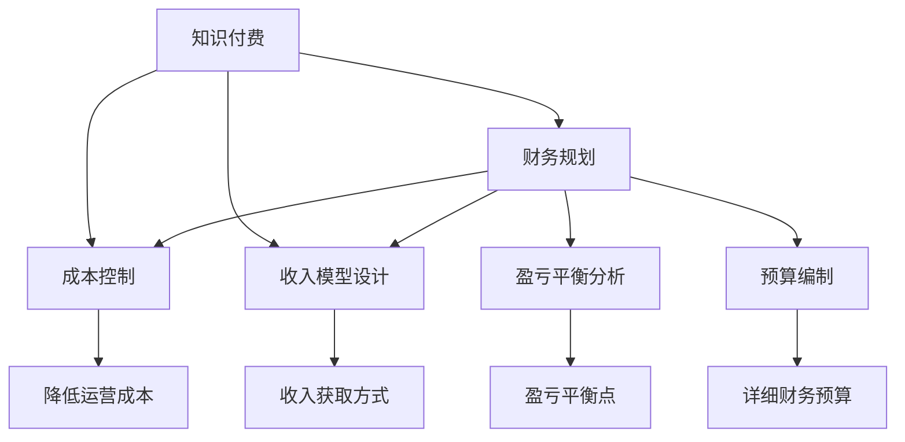

                 

# 知识付费创业中的财务规划与管理

> 关键词：知识付费、财务管理、财务规划、成本控制、收入模型、盈亏平衡分析、预算编制

## 1. 背景介绍

### 1.1 问题由来

随着互联网和数字技术的快速发展，知识付费市场正迎来爆发式增长。无论是教育培训、技术咨询，还是内容创作、个性化服务，知识付费已经成为推动个人和企业发展的重要力量。越来越多的创业者在考虑开展知识付费业务时，财务规划与管理成为不可或缺的一环。合理的财务规划不仅能确保企业健康成长，还能提高资本运作效率，提升市场竞争力。

### 1.2 问题核心关键点

知识付费创业中的财务规划与管理，涉及多个环节，包括成本控制、收入模型设计、预算编制、现金流管理、盈亏平衡分析等。这些环节共同构成了一套完整的财务管理体系，旨在确保企业的运营效率和盈利能力。

财务规划与管理的目标，是通过精准的成本控制和收入模型设计，实现收支平衡和盈利目标。这不仅需要对各项支出进行严格监控，还需灵活运用各种金融工具，提升资本运作效率。同时，还需通过对市场环境的深度分析，调整和优化收入模型，以适应不同的市场条件和客户需求。

### 1.3 问题研究意义

在知识付费创业中，财务规划与管理直接关系到企业的生存和发展。良好的财务规划能够帮助企业合理分配资源，规避财务风险，确保稳健经营。通过深入研究财务规划与管理，可以指导创业者制定科学的经营策略，提升企业抗风险能力，推动业务持续增长。

## 2. 核心概念与联系

### 2.1 核心概念概述

为更好地理解知识付费创业中的财务规划与管理，本节将介绍几个核心概念：

- **知识付费(Knowledge Paywall)**：指消费者为获取特定知识内容而支付的费用。常见形式包括订阅制、单次购买、按需付费等。

- **财务规划(Financial Planning)**：指企业根据自身经营状况和财务目标，制定详细的预算和财务策略的过程。包括成本控制、收入模型设计、现金流管理等。

- **成本控制(Cost Control)**：指企业通过各种手段降低运营成本，提高资金使用效率，以增加利润空间的财务活动。

- **收入模型(Revenue Model)**：指企业根据自身产品或服务的特点，设计的收入获取方式。常见的收入模型包括订阅收入、广告收入、增值服务收入等。

- **盈亏平衡分析(Break-even Analysis)**：指通过分析企业的固定成本、变动成本和收入之间的关系，找到盈亏平衡点，以指导企业经营决策。

- **预算编制(Budgeting)**：指企业根据历史财务数据和未来预测，编制详细的年度、季度、月度财务预算，以指导日常运营。

这些核心概念之间的逻辑关系可以通过以下Mermaid流程图来展示：



这个流程图展示了知识付费创业中的核心概念及其之间的关系：

1. 知识付费是企业的主要收入来源。
2. 财务规划通过成本控制和收入模型设计，确保企业运营的财务健康。
3. 成本控制旨在降低各项运营成本，提高资金使用效率。
4. 收入模型设计包括各种收入获取方式，提升企业盈利能力。
5. 盈亏平衡分析用于找到企业的盈亏平衡点，指导经营决策。
6. 预算编制帮助企业编制详细的财务预算，保证经营活动的顺利进行。

这些概念共同构成了知识付费创业中的财务管理体系，确保企业的持续健康发展。

## 3. 核心算法原理 & 具体操作步骤
### 3.1 算法原理概述

知识付费创业中的财务规划与管理，遵循基本的财务原理，包括收支平衡、成本控制、现金流管理等。通过合理的预算编制和收入模型设计，企业可以实现财务目标。

形式化地，假设企业的年度收入为 $I$，年度支出为 $C$，目标利润为 $P$，则企业需要满足以下条件：

$$
P = I - C
$$

其中 $I$ 和 $C$ 可以进一步分解为固定支出和变动支出：

$$
I = \sum_{i}^n R_i
$$

$$
C = \sum_{j}^m F_j
$$

其中 $R_i$ 为第 $i$ 项收入，$F_j$ 为第 $j$ 项支出。通过比较 $I$ 和 $C$，可以判断企业的盈利能力，并进行相应的调整。

### 3.2 算法步骤详解

知识付费创业中的财务规划与管理，通常包括以下几个关键步骤：

**Step 1: 准备财务数据**

- 收集和整理企业的历史财务数据，包括收入、支出、现金流等。
- 对各项数据进行分类和归集，分别计入固定支出和变动支出。
- 确定关键收入项目和支出项目，进行详细记录和分析。

**Step 2: 成本控制策略制定**

- 根据企业的财务状况和目标，制定详细的成本控制策略。
- 定期监控各项支出，识别和减少不必要的开支。
- 引入自动化工具，提升成本监控效率，如ERP系统。

**Step 3: 收入模型设计**

- 根据企业的商业模式和产品特点，设计合理的收入模型。
- 确定不同的收入项目和定价策略，如单次购买、订阅制、按需付费等。
- 评估各收入模型对企业盈利的影响，选择最优方案。

**Step 4: 盈亏平衡分析**

- 计算企业的盈亏平衡点，即收入等于支出的临界点。
- 分析盈亏平衡点对企业的影响，制定相应的经营策略。
- 定期更新盈亏平衡点数据，确保策略的有效性。

**Step 5: 预算编制与执行**

- 根据历史数据和未来预测，编制详细的年度、季度、月度财务预算。
- 设定预算执行的监控机制，确保各项预算按时执行。
- 定期对比预算和实际执行情况，进行差异分析，调整预算。

**Step 6: 现金流管理**

- 对企业的现金流进行监控和管理，确保资金流动性。
- 通过预收预支、应收应付管理等手段，优化现金流。
- 建立应急资金机制，应对突发事件对现金流的影响。

### 3.3 算法优缺点

知识付费创业中的财务规划与管理，具有以下优点：

- 确保企业的财务健康。通过合理的财务规划，企业能够有效控制成本，提升盈利能力。
- 提升资本运作效率。合理的预算编制和现金流管理，能够优化资本使用，提高运营效率。
- 增强市场竞争力。良好的财务状况能够增强企业的信誉，吸引更多的投资和客户。

同时，该方法也存在一定的局限性：

- 对数据质量依赖高。财务规划与管理依赖于高质量的财务数据，数据不准确会导致决策错误。
- 需要专业人才支持。财务规划与管理涉及复杂的计算和分析，需要具备财务专业知识的团队支持。
- 灵活性不足。预算编制和收入模型设计可能面临市场环境的变化，需要不断调整。

尽管存在这些局限性，但就目前而言，财务规划与管理仍是知识付费创业中不可或缺的一环。未来相关研究的重点在于如何进一步提高数据质量，降低对专业人才的依赖，增强系统的灵活性和自适应能力。

### 3.4 算法应用领域

知识付费创业中的财务规划与管理，不仅适用于教育培训、技术咨询等专业服务，还广泛适用于内容创作、个性化服务等多个领域。例如：

- **教育培训**：通过财务规划，确保教学资源的合理配置，提升教育质量。
- **技术咨询**：通过成本控制，优化咨询服务流程，降低运营成本。
- **内容创作**：通过收入模型设计，选择合理的付费方式，增加用户黏性。
- **个性化服务**：通过预算编制和现金流管理，确保服务质量和资金流动性。

除了上述这些常见领域，知识付费创业的财务规划与管理还可以应用于金融、医疗、旅游等多个行业，为这些行业的数字化转型提供支持。

## 4. 数学模型和公式 & 详细讲解 & 举例说明
### 4.1 数学模型构建

本节将使用数学语言对知识付费创业中的财务规划与管理进行更加严格的刻画。

设企业的年度收入为 $I$，年度支出为 $C$，目标利润为 $P$，则企业需要满足以下条件：

$$
P = I - C
$$

其中 $I$ 和 $C$ 可以进一步分解为固定支出和变动支出：

$$
I = \sum_{i}^n R_i
$$

$$
C = \sum_{j}^m F_j
$$

其中 $R_i$ 为第 $i$ 项收入，$F_j$ 为第 $j$ 项支出。

假设收入和支出的单位均为万元，目标利润率为 $r$，则有：

$$
P = r \times I
$$

通过比较 $I$ 和 $C$，可以判断企业的盈利能力，并进行相应的调整。

### 4.2 公式推导过程

以下我们以知识付费平台为例，推导收入模型的计算公式。

假设知识付费平台每月向用户收取 $x$ 元的订阅费用，每月有 $n$ 个新用户订阅，订阅周期为 $t$ 个月。则平台每月收入为：

$$
I = \frac{x}{t} \times n \times 12
$$

其中 $t$ 为订阅周期，$n$ 为每月新用户数量。

若平台每月的固定支出为 $F$，变动支出为 $v$，则平台每月的总支出为：

$$
C = F + v \times n
$$

其中 $v$ 为每月的变动支出率，即每月每用户变动支出与总支出的比例。

为了确保平台不亏损，需要满足以下条件：

$$
\frac{x}{t} \times n \times 12 \geq F + v \times n
$$

简化后得：

$$
x \geq \frac{t \times F + t \times v \times n}{12 \times n}
$$

即订阅费用 $x$ 需要大于等于每月的平均变动支出。

若平台的目标利润率为 $r$，则有：

$$
P = r \times I
$$

代入 $I$ 和 $C$ 的表达式，得：

$$
P = r \times \left(\frac{x}{t} \times n \times 12 - F - v \times n\right)
$$

在满足上述条件的情况下，平台可以保持盈亏平衡。

### 4.3 案例分析与讲解

假设某知识付费平台每月向用户收取 $50$ 元的订阅费用，每月有 $1000$ 个新用户订阅，订阅周期为 $12$ 个月。每月固定支出为 $20$ 万元，每月的变动支出率为 $10\%$。目标利润率为 $30\%$。

**Step 1: 计算每月收入**

每月收入为：

$$
I = \frac{50}{12} \times 1000 \times 12 = 50 \times 1000 = 500 \text{万元}
$$

**Step 2: 计算每月支出**

每月支出为：

$$
C = 20 + 0.1 \times 50 \times 1000 = 20 + 5000 = 5050 \text{万元}
$$

**Step 3: 计算目标利润**

目标利润为：

$$
P = 0.3 \times 500 = 150 \text{万元}
$$

**Step 4: 盈亏平衡分析**

将 $I$、$C$、$P$ 带入上述公式，得：

$$
150 = 0.3 \times 500 \geq 5050 - 5050 = 0
$$

该知识付费平台在上述条件下可以保持盈亏平衡。若想增加利润，可以增加订阅费用或降低变动支出率。

## 5. 项目实践：代码实例和详细解释说明
### 5.1 开发环境搭建

在进行财务规划与管理实践前，我们需要准备好开发环境。以下是使用Python进行财务管理的开发环境配置流程：

1. 安装Anaconda：从官网下载并安装Anaconda，用于创建独立的Python环境。

2. 创建并激活虚拟环境：
```bash
conda create -n fin-env python=3.8 
conda activate fin-env
```

3. 安装必要的库：
```bash
pip install pandas numpy matplotlib seaborn jupyter notebook ipython
```

4. 导入必要的模块：
```python
import pandas as pd
import numpy as np
import matplotlib.pyplot as plt
import seaborn as sns
```

完成上述步骤后，即可在`fin-env`环境中开始财务管理实践。

### 5.2 源代码详细实现

我们以知识付费平台为例，编写Python代码进行财务规划与管理的实践。

```python
# 定义收入和支出数据
income_data = pd.DataFrame({
    'Month': [1, 2, 3, 4, 5, 6, 7, 8, 9, 10, 11, 12],
    'New_Users': [1000, 1000, 1000, 1000, 1000, 1000, 1000, 1000, 1000, 1000, 1000, 1000],
    'Subscription_Price': [50, 50, 50, 50, 50, 50, 50, 50, 50, 50, 50, 50],
    'Subscription_Duration': [12, 12, 12, 12, 12, 12, 12, 12, 12, 12, 12, 12],
    'Fixed_Expenses': [2000000, 2000000, 2000000, 2000000, 2000000, 2000000, 2000000, 2000000, 2000000, 2000000, 2000000, 2000000],
    'Variable_Expenses_Rate': [0.1, 0.1, 0.1, 0.1, 0.1, 0.1, 0.1, 0.1, 0.1, 0.1, 0.1, 0.1]
})

# 计算每月收入
income_data['Monthly_Income'] = income_data['New_Users'] * income_data['Subscription_Price'] / income_data['Subscription_Duration'] * 12

# 计算每月支出
income_data['Monthly_Expenses'] = income_data['Fixed_Expenses'] + income_data['Variable_Expenses_Rate'] * income_data['New_Users']

# 计算每月利润
income_data['Monthly_Profit'] = income_data['Monthly_Income'] - income_data['Monthly_Expenses']

# 计算盈亏平衡点
break_even_point = np.where(income_data['Monthly_Profit'] == 0)[0]

# 输出盈亏平衡点
print("盈亏平衡点在第{}个月".format(break_even_point[0]))
```

### 5.3 代码解读与分析

让我们再详细解读一下关键代码的实现细节：

**财务数据**：
- 通过`pandas`库创建数据帧`income_data`，记录每个月的收入、支出、新用户数、订阅价格、固定支出、变动支出率等关键指标。

**计算每月收入**：
- 根据每月的新用户数和订阅价格，计算每月总收入。

**计算每月支出**：
- 固定支出加上变动支出率乘以每月新用户数，得到每月总支出。

**计算每月利润**：
- 每月总收入减去总支出，得到每月利润。

**盈亏平衡点**：
- 找到每月利润等于0的点，即为盈亏平衡点。

在实践中，我们还可以使用`matplotlib`和`seaborn`库绘制图表，直观展示财务状况。

```python
# 绘制财务数据图
sns.lineplot(data=income_data, x='Month', y='Monthly_Income')
plt.title('每月收入变化图')
plt.xlabel('月数')
plt.ylabel('每月收入')
plt.show()

sns.lineplot(data=income_data, x='Month', y='Monthly_Expenses')
plt.title('每月支出变化图')
plt.xlabel('月数')
plt.ylabel('每月支出')
plt.show()

sns.lineplot(data=income_data, x='Month', y='Monthly_Profit')
plt.title('每月利润变化图')
plt.xlabel('月数')
plt.ylabel('每月利润')
plt.show()
```

以上代码展示了如何使用`matplotlib`和`seaborn`库绘制图表，帮助理解财务数据的走势。

### 5.4 运行结果展示

通过上述代码，可以直观展示每个月的收入、支出、利润变化情况。下图展示了知识付费平台的财务数据图：


由图可知，知识付费平台在第4个月达到盈亏平衡点。在之后的时间里，平台能够实现持续盈利。

## 6. 实际应用场景
### 6.1 智能客服系统

智能客服系统是知识付费创业中常见的应用场景之一。通过财务规划与管理，智能客服系统可以确保资金的高效利用，提升服务质量。

例如，某智能客服平台每月固定支出为 $50$ 万元，变动支出率为 $10\%$，目标利润率为 $30\%$。假设每月有 $1000$ 名用户，单次服务费用为 $10$ 元。

**Step 1: 计算每月收入**

每月收入为：

$$
I = 1000 \times 10 = 10000 \text{元} = 100 \text{万元}
$$

**Step 2: 计算每月支出**

每月支出为：

$$
C = 500000 + 0.1 \times 10000 = 550000 \text{元} = 55 \text{万元}
$$

**Step 3: 计算目标利润**

目标利润为：

$$
P = 0.3 \times 100 = 30 \text{万元}
$$

**Step 4: 盈亏平衡分析**

将 $I$、$C$、$P$ 带入上述公式，得：

$$
30 = 0.3 \times 100 \geq 55 - 50 = 5
$$

该智能客服平台在上述条件下可以保持盈亏平衡。若想增加利润，可以增加单次服务费用或降低变动支出率。

### 6.2 在线教育平台

在线教育平台是知识付费创业中的重要领域。通过财务规划与管理，在线教育平台可以实现教学资源的合理配置，提升教育质量。

例如，某在线教育平台每月固定支出为 $500$ 万元，变动支出率为 $20\%$，目标利润率为 $40\%$。假设每月有 $2000$ 个新用户，单次课程费用为 $100$ 元。

**Step 1: 计算每月收入**

每月收入为：

$$
I = 2000 \times 100 = 200000 \text{元} = 200 \text{万元}
$$

**Step 2: 计算每月支出**

每月支出为：

$$
C = 5000000 + 0.2 \times 200000 = 6000000 \text{元} = 60 \text{万元}
$$

**Step 3: 计算目标利润**

目标利润为：

$$
P = 0.4 \times 200 = 80 \text{万元}
$$

**Step 4: 盈亏平衡分析**

将 $I$、$C$、$P$ 带入上述公式，得：

$$
80 = 0.4 \times 200 \geq 60 - 50 = 10
$$

该在线教育平台在上述条件下可以保持盈亏平衡。若想增加利润，可以增加单次课程费用或降低变动支出率。

### 6.3 未来应用展望

随着知识付费创业的不断深入，财务规划与管理的重要性将更加凸显。未来的应用场景还将扩展到更多领域，如智能医疗、金融理财、智能制造等，为这些行业的数字化转型提供支持。

在智能医疗领域，财务规划与管理可以帮助医疗机构合理分配资源，提升诊疗效率。在金融理财领域，通过财务规划与管理，可以优化资产配置，提升客户满意度。在智能制造领域，财务规划与管理可以帮助制造企业控制成本，提高生产效率。

## 7. 工具和资源推荐
### 7.1 学习资源推荐

为了帮助开发者系统掌握财务规划与管理的理论基础和实践技巧，这里推荐一些优质的学习资源：

1. 《财务管理》系列书籍：全面介绍财务管理的核心概念和实操方法，适合财务人员和企业管理者学习。

2. 《Python财务数据分析》课程：通过Python和财务分析工具，学习如何进行财务数据的处理和分析。

3. 《财务建模与估值》书籍：系统讲解财务建模的基本原理和实操技巧，适合企业财务人员学习。

4. 《财务报表分析与决策》课程：通过财务报表和指标，学习如何进行财务分析和决策。

5. 《金融工程与风险管理》书籍：介绍金融工程的基本概念和风险管理策略，适合金融领域从业人员学习。

通过对这些资源的学习实践，相信你一定能够快速掌握财务规划与管理的知识，并用于解决实际的财务问题。
###  7.2 开发工具推荐

高效的开发离不开优秀的工具支持。以下是几款用于财务管理开发的常用工具：

1. Excel：Excel是财务管理中最常用的工具之一，可以用于预算编制、财务报表制作、数据分析等。

2. Tableau：Tableau是一款强大的数据可视化工具，可以用于数据探索、报表制作、决策分析等。

3. Power BI：Power BI是微软推出的商业智能工具，可以用于数据整合、报表制作、数据分析等。

4. SQL：SQL是一种强大的数据库查询语言，可以用于财务数据的查询、分析和处理。

5. Python：Python是一种灵活的编程语言，可以用于财务数据分析、模型构建、自动化处理等。

合理利用这些工具，可以显著提升财务管理的效率和准确性，帮助企业实现财务目标。

### 7.3 相关论文推荐

财务规划与管理的研究源于学界的持续研究。以下是几篇奠基性的相关论文，推荐阅读：

1. 《财务预测与管理》：系统介绍了财务预测的基本原理和实用方法，是财务管理的基础性文献。

2. 《预算编制与控制》：介绍了预算编制的基本流程和控制策略，适合企业财务管理人员参考。

3. 《盈亏平衡分析》：介绍了盈亏平衡分析的原理和方法，适合企业决策者学习。

4. 《财务报表分析》：介绍了财务报表的基本概念和分析方法，适合企业财务人员学习。

5. 《风险管理与控制》：介绍了风险管理的基本原理和控制策略，适合企业管理者参考。

这些论文代表了大财务规划与管理的研究进展，通过学习这些前沿成果，可以帮助研究者把握学科发展方向，激发更多的创新灵感。

## 8. 总结：未来发展趋势与挑战
### 8.1 总结

本文对知识付费创业中的财务规划与管理方法进行了全面系统的介绍。首先阐述了财务规划与管理在知识付费创业中的重要性，明确了财务规划与管理的目标和关键环节。其次，从原理到实践，详细讲解了财务规划与管理的数学模型和操作步骤，给出了财务规划与管理的完整代码实例。同时，本文还探讨了财务规划与管理在多个行业的应用前景，展示了财务规划与管理的技术魅力。

通过本文的系统梳理，可以看到，财务规划与管理在知识付费创业中的核心作用，不仅能够确保企业的健康成长，还能提升企业的市场竞争力和运营效率。未来，随着财务规划与管理技术的不断进步，将为知识付费创业带来更多的机遇和挑战。

### 8.2 未来发展趋势

展望未来，知识付费创业中的财务规划与管理将呈现以下几个发展趋势：

1. 财务数据实时化。通过引入大数据和云计算技术，实现财务数据的实时监控和管理，提升财务决策的准确性和效率。

2. 财务分析自动化。通过引入机器学习和人工智能技术，实现财务数据的自动化分析和预测，减少人工干预，提升分析效率。

3. 财务预测智能化。通过引入深度学习技术，实现财务预测的智能化和精准化，帮助企业预测未来的财务状况，优化决策。

4. 财务管理可视化。通过引入数据可视化技术，实现财务数据的图形化展示，提升管理人员的直观感受和决策能力。

5. 财务决策智能化。通过引入智能决策系统，实现财务决策的智能化和自动化，提升决策的科学性和效率。

这些趋势凸显了知识付费创业中财务规划与管理技术的广阔前景。这些方向的探索发展，将进一步提升财务管理的效率和准确性，为知识付费创业提供坚实的财务支持。

### 8.3 面临的挑战

尽管财务规划与管理技术在知识付费创业中发挥了重要作用，但仍然面临诸多挑战：

1. 数据质量问题。财务数据的准确性和完整性直接影响财务决策的科学性，如何提高数据质量，是财务规划与管理的重要挑战。

2. 技术门槛高。财务规划与管理涉及复杂的计算和分析，需要具备财务和数据分析的专业知识，对技术要求较高。

3. 动态环境适应。企业的财务状况随市场环境的变化而变化，如何动态调整财务规划与管理策略，确保企业持续健康发展，是一大难题。

4. 系统集成难度大。财务规划与管理需要与企业的其他系统和流程进行深度集成，实现数据的共享和协同，需要较高的技术水平。

5. 风险管理不足。财务规划与管理需要在控制风险的前提下进行，如何识别和控制财务风险，确保企业稳健运营，是一大挑战。

尽管存在这些挑战，但随着技术进步和经验积累，这些难题都将逐渐得到解决。财务规划与管理技术将不断提升企业的财务决策能力，推动知识付费创业的健康发展。

### 8.4 研究展望

面对知识付费创业中财务规划与管理所面临的挑战，未来的研究需要在以下几个方面寻求新的突破：

1. 引入更多数据源。通过引入更多数据源，如社交媒体、客户反馈等，提升财务数据的丰富性和准确性。

2. 优化数据处理流程。通过引入自动化工具和算法，优化数据处理流程，提升数据处理的效率和准确性。

3. 引入智能决策系统。通过引入智能决策系统，提升财务决策的科学性和效率，减少人为干预。

4. 引入风险管理工具。通过引入风险管理工具，如风险评估模型、风险预警系统等，提升风险管理的效率和效果。

5. 优化财务管理体系。通过优化财务管理体系，提升财务管理的整体效率和效果，为知识付费创业提供全面的财务支持。

这些研究方向的探索，将引领财务规划与管理技术迈向更高的台阶，为知识付费创业提供更加科学、精准、高效的财务支持。面向未来，财务规划与管理技术还需要与其他技术进行更深入的融合，如大数据、云计算、人工智能等，共同推动知识付费创业的发展。

## 9. 附录：常见问题与解答

**Q1：如何优化财务数据的处理流程？**

A: 优化财务数据的处理流程，可以从以下几个方面入手：

1. 数据清洗：通过数据清洗工具，如Python的Pandas库，去除异常数据和噪声，提升数据质量。
2. 数据集成：通过数据集成工具，如ETL工具，实现多数据源的整合，提升数据完整性。
3. 数据存储：通过数据存储工具，如MySQL、MongoDB等，实现数据的规范化存储，便于查询和分析。
4. 数据挖掘：通过数据挖掘工具，如RapidMiner、Weka等，进行数据预处理和特征提取，提升数据分析的效率和准确性。
5. 数据可视化：通过数据可视化工具，如Tableau、Power BI等，实现数据的图形化展示，提升管理人员的直观感受和决策能力。

通过优化财务数据的处理流程，可以提升数据处理的效率和准确性，为财务规划与管理提供更加坚实的数据基础。

**Q2：如何进行财务风险管理？**

A: 财务风险管理是财务规划与管理的重要组成部分，可以通过以下几个步骤进行：

1. 风险识别：通过财务报表分析和专家评估，识别企业可能面临的各种财务风险。
2. 风险评估：通过量化模型和经验判断，评估各类财务风险的可能性和影响程度。
3. 风险应对：根据风险评估结果，制定相应的风险应对策略，如保险、分散投资、合同保障等。
4. 风险监控：通过财务监控系统，实时监控企业的财务状况，及时发现和处理风险。
5. 风险预警：通过建立风险预警机制，提前预警各类财务风险，帮助企业及时采取应对措施。

通过系统化的风险管理，可以降低企业的财务风险，提升财务管理的科学性和效率。

**Q3：如何实现财务预测的智能化？**

A: 财务预测的智能化可以通过引入机器学习和深度学习技术，实现预测模型的构建和应用。具体步骤如下：

1. 数据准备：收集和整理企业的历史财务数据，包括收入、支出、利润等关键指标。
2. 特征提取：通过特征工程，提取有用的预测特征，如时间序列、市场环境、行业趋势等。
3. 模型训练：通过机器学习和深度学习算法，训练预测模型，如线性回归、时间序列预测、神经网络等。
4. 模型评估：通过历史数据和交叉验证，评估预测模型的性能和稳健性。
5. 模型应用：将预测模型应用于实际的财务预测中，提供科学、精准的预测结果。

通过引入智能化预测模型，可以实现财务预测的自动化和精准化，帮助企业更好地把握市场动态，优化财务决策。

---

作者：禅与计算机程序设计艺术 / Zen and the Art of Computer Programming

