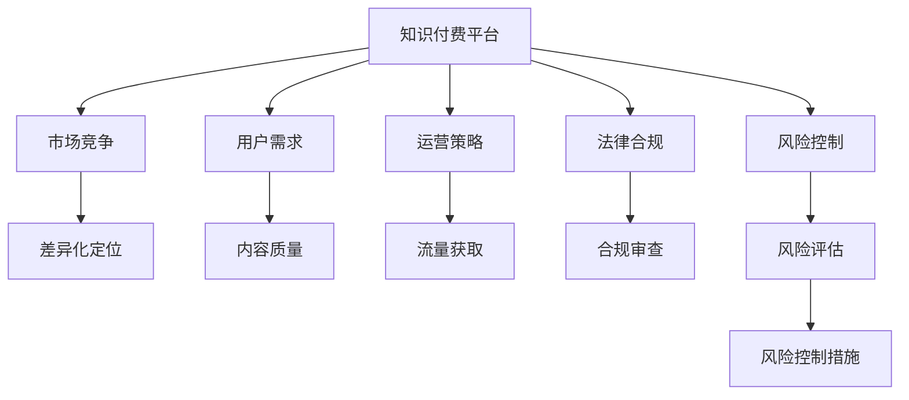

                 

# 知识付费创业中的风险管理

> 关键词：知识付费,创业,风险管理,商业模型,市场竞争,运营策略,法律合规,用户需求

## 1. 背景介绍

### 1.1 问题由来

知识付费作为一种新兴的互联网商业模式，近年来在国内迅速崛起。从2017年的罗辑思维“得到”，到2021年的“知识付费”、“付费会员”等关键词频繁出现在各大平台年度报告中，可以感受到知识付费的火热程度。然而，尽管如此，知识付费的创业之路并非一帆风顺，市场的深度竞争、运营的困难、用户的真实需求、法律的规范等问题接踵而至。如何在这片快速发展的市场中突围，实现可持续发展，成为摆在中国知识付费创业者面前的重要课题。

### 1.2 问题核心关键点

知识付费创业的风险管理主要包括以下几个方面：

- **市场竞争**：面对众多知识付费平台的激烈竞争，如何在众多竞争者中突围，找到差异化竞争力。
- **用户需求**：如何准确把握用户的真实需求，提供价值感高的内容，吸引和留存用户。
- **运营策略**：如何将获取流量、提高转化率等运营策略高效落地，提升平台的商业价值。
- **法律合规**：如何在市场竞争中保持合法合规，避免陷入知识产权、版权纠纷等法律风险。
- **风险控制**：如何通过合理的风险评估和管理机制，控制平台发展的潜在风险。

这些问题不仅是创业过程中必须面对的挑战，同时也是引领知识付费行业健康发展的关键因素。

### 1.3 问题研究意义

知识付费创业的风险管理不仅关乎企业本身的生存和发展，也对整个行业的长远发展有着重要影响。通过深入分析市场竞争、用户需求、运营策略、法律合规和风险控制等关键问题，为知识付费平台的创业者提供切实可行的建议，有助于提升平台的用户体验和商业价值，实现可持续发展的目标。

## 2. 核心概念与联系

### 2.1 核心概念概述

在知识付费创业的风险管理中，以下概念是核心且密切相关的：

- **知识付费**：指通过在线平台提供专业知识、技能、经验等内容，用户支付相应费用以获取这些信息。
- **创业**：指创业者利用个人能力、知识、资源等进行自主经营，成立公司，并进行盈利的过程。
- **风险管理**：指识别、分析、控制和消除可能影响企业目标实现的各种不确定性因素。
- **市场竞争**：指企业在同一市场上争夺市场份额的竞争行为。
- **用户需求**：指用户在知识付费平台上对内容和服务的真实需求。
- **运营策略**：指企业为实现商业目标所采取的一系列策略和计划。
- **法律合规**：指企业遵守相关法律法规，确保运营行为的合法性。
- **风险控制**：指通过识别、评估、控制和监督风险，保护企业免受潜在损失的措施。

这些概念通过一个全局性的框架，共同构成了知识付费创业风险管理的体系。

### 2.2 核心概念原理和架构的 Mermaid 流程图



此图展示了知识付费平台与各关键概念之间的关系，清晰地表达了平台在竞争、需求、策略、合规和风险管理方面的相互联系。

## 3. 核心算法原理 & 具体操作步骤

### 3.1 算法原理概述

知识付费创业的风险管理，可以视为一个多目标优化问题。目标包括提高用户满意度、提升平台商业价值、降低法律风险以及控制潜在运营风险。通过综合考虑这些因素，找到最优的风险管理策略。

以下是核心算法原理概述：

- **用户需求分析**：使用聚类、分类等机器学习算法，从用户反馈、行为数据中提取用户需求，进行标签和分类。
- **竞争分析**：通过爬虫、网络爬虫等技术获取市场数据，进行竞争对手分析，了解市场趋势和竞争格局。
- **运营策略优化**：利用预测模型、回归分析等方法，优化流量获取、用户留存、付费转化等策略。
- **法律合规检查**：通过文本挖掘、自然语言处理等技术，自动检查平台内容是否存在版权、知识产权纠纷风险。
- **风险评估与控制**：使用风险管理工具，如SWOT分析、财务模型等，进行风险识别和评估，采取相应的控制措施。

### 3.2 算法步骤详解

以下是知识付费创业风险管理的详细步骤：

**Step 1: 市场竞争分析**
- 收集并分析竞争对手的资料，包括产品功能、市场定位、用户反馈等。
- 利用文本挖掘技术，从竞争对手的产品介绍、用户评论中提取关键信息。
- 使用聚类分析，识别出竞争对手的主要优势和劣势，进行差异化定位。

**Step 2: 用户需求分析**
- 通过问卷调查、用户行为数据等方式，收集用户对知识付费平台的真实需求。
- 使用分类算法，对用户需求进行归类和标签化，构建用户画像。
- 利用聚类分析，找到用户需求的共同特征，制定针对性的内容和产品策略。

**Step 3: 运营策略优化**
- 基于预测模型，如线性回归、决策树等，对流量获取、用户留存、付费转化等进行预测和优化。
- 采用A/B测试、多臂老虎机等方法，不断测试和优化运营策略。
- 设置关键绩效指标(KPI)，实时监控运营效果，及时调整策略。

**Step 4: 法律合规检查**
- 通过爬虫技术，抓取互联网上的版权信息、知识产权公告等数据。
- 利用自然语言处理技术，自动检查平台内容是否存在侵权风险。
- 定期进行法律合规审查，确保平台运营合法合规。

**Step 5: 风险评估与控制**
- 通过SWOT分析等方法，识别平台面临的内外部风险。
- 使用财务模型、风险管理工具等，评估各风险的潜在影响和发生概率。
- 制定相应的风险控制措施，如保险、合同条款等，控制风险。

### 3.3 算法优缺点

知识付费创业风险管理的算法主要具有以下优缺点：

**优点**：
- 利用机器学习和数据挖掘技术，可以更准确地识别用户需求和市场趋势。
- 通过运营策略优化，提高平台的用户满意度和商业价值。
- 法律合规检查可以减少平台法律风险，保护企业免受诉讼影响。
- 风险评估与控制机制，帮助平台提前识别潜在风险，保障企业稳定发展。

**缺点**：
- 数据获取和处理需要大量的计算资源和时间。
- 算法模型的准确性和泛化能力直接影响结果的可靠性。
- 运营策略和风险控制需要持续监控和调整，需要专业人才支持。
- 法律合规检查和风险评估需要专业知识，可能存在误判风险。

### 3.4 算法应用领域

知识付费创业的风险管理算法不仅可以应用于创业过程中，还可以在以下领域得到广泛应用：

- **教育领域**：帮助在线教育平台识别和满足学生需求，提高课程质量和学生满意度。
- **内容生产**：帮助内容创作者识别市场需求，优化内容生产策略，提高内容收益。
- **广告投放**：帮助广告主识别用户需求，优化广告投放策略，提高广告效果。
- **电商零售**：帮助电商平台识别用户需求，优化产品推荐策略，提高转化率和销售额。
- **金融服务**：帮助金融公司识别用户需求，优化产品设计和服务流程，提高用户粘性和收入。

## 4. 数学模型和公式 & 详细讲解 & 举例说明

### 4.1 数学模型构建

知识付费创业风险管理中涉及的数学模型包括但不限于：

- **用户需求模型**：利用聚类算法，将用户需求划分为不同类别。
- **竞争分析模型**：利用网络爬虫技术，抓取并分析竞争对手数据。
- **运营策略模型**：利用回归分析，预测流量获取和用户转化效果。
- **法律合规模型**：利用文本挖掘技术，识别和评估法律风险。
- **风险管理模型**：利用风险管理工具，评估和控制潜在风险。

### 4.2 公式推导过程

**用户需求模型**

使用K-Means聚类算法对用户需求进行划分，算法流程如下：

1. 将用户需求数据作为输入，每个数据点表示一个用户。
2. 随机选择K个数据点作为初始聚类中心。
3. 对于每个数据点，计算其到K个聚类中心的距离。
4. 将数据点分配到距离最近的聚类中心。
5. 更新每个聚类中心的坐标，计算平均距离。
6. 重复步骤3-5，直到聚类中心坐标不再变化或达到预设迭代次数。

公式如下：

$$
\begin{aligned}
&\text{聚类中心} = \text{arg}\min_{\mu_k} \sum_{i=1}^{n} \min_{k} ||x_i - \mu_k||^2 \\
&\text{聚类结果} = \text{arg}\min_{z_i} \min_{k} ||x_i - \mu_k||^2
\end{aligned}
$$

**运营策略模型**

使用线性回归模型预测用户转化率，算法流程如下：

1. 收集历史用户数据，包括转化率、付费行为、使用时长等。
2. 将数据进行标准化处理，消除变量之间的量纲差异。
3. 构建线性回归模型，选择特征和目标变量。
4. 使用最小二乘法，求解模型参数。
5. 使用验证集，评估模型性能。
6. 根据模型输出，调整运营策略。

公式如下：

$$
y = \beta_0 + \sum_{i=1}^{p} \beta_i x_i
$$

其中，$y$ 为预测值，$\beta_0$ 为截距，$\beta_i$ 为特征系数，$x_i$ 为特征变量。

**法律合规模型**

使用文本挖掘技术，自动检测版权信息，算法流程如下：

1. 抓取互联网上的版权信息、知识产权公告等数据。
2. 利用分词、去停用词、词性标注等技术，提取关键信息。
3. 使用TF-IDF算法，计算每个单词的重要性。
4. 使用机器学习算法，如SVM、随机森林等，构建法律合规检测模型。
5. 对平台内容进行检测，识别是否存在侵权风险。

**风险管理模型**

使用SWOT分析方法，识别内外部风险，算法流程如下：

1. 收集平台数据，包括市场数据、财务数据、运营数据等。
2. 进行SWOT分析，识别优势、劣势、机会、威胁。
3. 利用风险管理工具，如蒙特卡洛模拟、敏感性分析等，评估风险影响。
4. 制定相应的风险控制措施，如保险、合同条款等。

## 5. 项目实践：代码实例和详细解释说明

### 5.1 开发环境搭建

在知识付费创业风险管理中，需要搭建一个高效的开发环境。以下是搭建开发环境的步骤：

1. 安装Python和相关依赖包，如NumPy、Pandas、Scikit-learn、TensorFlow等。
2. 使用Docker或Vagrant搭建虚拟环境，确保跨平台兼容性。
3. 安装Jupyter Notebook，进行数据处理和模型训练。
4. 配置Git版本控制系统，方便代码管理和团队协作。

### 5.2 源代码详细实现

以下是一个简单的Python代码示例，用于用户需求聚类：

```python
import pandas as pd
from sklearn.cluster import KMeans

# 加载用户需求数据
data = pd.read_csv('user_demand.csv')

# 使用K-Means聚类算法进行需求划分
kmeans = KMeans(n_clusters=3, random_state=0)
kmeans.fit(data)

# 输出聚类结果
print(kmeans.labels_)
```

### 5.3 代码解读与分析

这段代码利用K-Means算法对用户需求进行聚类，具体步骤如下：

1. 加载用户需求数据，将其转换为Pandas DataFrame格式。
2. 使用KMeans算法，将需求数据划分为3个类别。
3. 输出聚类结果，每个用户对应的类别标签。

### 5.4 运行结果展示

运行上述代码，得到用户需求的聚类结果。例如：

```
[0 0 1 2 2 2 0 0 1 1 1 0 2 0 0 0 0 1 1 1 1 1 0 0 2 2 0 0 0 0 0 1 0 0 0 1 1 0 1 2 2 0 2 1 0 1 0 0 1 1 0 2 0 0 1 1 1 1 0 2 0 0 1 1 1 1 1 2 0 1 0 0 0 0 0 0 2 0 0 1 0 0 1 2 1 1 2 1 2 0 0 0 1 0 1 1 1 1 2 2 0 0 1 0 0 1 0 0 0 1 0 0 0 0 2 0 2 1 1 1 1 2 0 0 1 1 1 1 0 0 0 0 2 1 1 0 2 1 1 0 0 1 0 1 1 1 0 1 1 0 1 1 0 2 2 0 2 1 0 1 1 1 0 1 2 1 0 2 1 2 1 1 0 2 2 0 1 2 1 1 2 1 2 1 2 0 2 1 2 0 1 1 0 1 1 1 1 2 1 0 1 0 1 2 1 0 0 1 2 1 0 0 0 2 0 0 0 0 1 0 1 0 0 1 0 0 0 1 0 0 0 1 0 0 1 1 0 0 2 1 1 0 1 0 1 1 2 1 0 1 0 2 1 1 1 0 2 2 1 1 0 1 1 1 1 1 1 2 0 1 0 1 0 0 1 2 1 1 2 1 0 0 1 0 0 1 2 0 0 0 1 1 1 1 1 1 0 1 1 1 0 1 1 0 0 0 1 2 1 0 0 2 0 0 0 2 0 0 0 0 1 0 0 1 1 0 0 2 0 1 1 0 1 1 1 0 2 1 1 0 2 1 2 0 1 1 1 0 1 0 2 1 0 2 1 1 1 0 0 0 1 2 0 0 1 1 1 1 1 0 1 1 0 1 1 0 0 1 0 2 0 2 0 2 1 1 1 0 1 2 1 0 1 1 0 1 2 2 1 1 2 1 1 2 0 1 1 1 2 0 2 0 0 1 0 1 0 2 1 0 2 1 2 1 1 0 0 2 2 1 1 1 2 1 2 1 1 1 0 1 2 0 2 1 1 0 0 0 1 1 1 0 0 0 1 0 1 0 0 1 1 2 0 1 1 0 2 1 0 0 1 0 1 0 1 1 1 0 2 1 1 0 0 2 2 1 0 0 1 0 0 0 2 0 0 1 2 0 0 1 1 1 0 1 1 2 1 0 0 2 0 1 0 2 1 0 1 0 0 2 1 2 0 1 2 0 1 1 1 0 2 0 1 0 0 1 1 2 0 1 0 1 1 1 0 0 1 0 0 1 2 0 1 0 1 0 1 2 1 1 1 1 1 1 1 0 1 1 1 1 0 1 1 0 0 1 0 0 1 2 1 1 0 0 0 0 0 0 2 0 1 0 0 1 0 2 1 1 0 0 1 1 1 1 0 0 1 1 1 1 1 1 0 1 0 1 2 0 0 1 0 1 1 2 1 0 1 0 0 2 0 1 1 1 0 1 0 1 0 1 2 1 0 1 1 1 0 0 0 0 1 1 0 1 0 1 0 1 2 1 1 1 1 0 0 0 0 1 1 1 1 1 1 1 1 0 1 1 0 0 0 0 1 1 0 2 1 0 1 0 0 1 1 0 0 1 1 0 1 1 1 0 1 0 0 0 0 2 0 0 0 0 1 0 1 0 0 1 1 0 0 1 0 1 1 0 1 0 0 0 1 1 1 1 0 0 1 1 0 0 0 0 0 1 0 1 1 0 1 1 1 0 0 2 0 1 0 1 0 1 0 0 0 1 1 0 1 0 0 1 1 0 0 0 1 1 1 1 1 1 1 0 1 1 0 1 1 0 1 0 1 0 0 1 1 0 1 0 1 1 1 1 1 1 0 1 0 1 1 0 1 1 0 0 1 1 0 1 1 0 1 0 0 0 1 1 1 0 0 1 0 1 1 1 1 0 1 1 0 1 1 1 0 0 1 1 0 1 0 0 1 1 1 0 0 0 1 1 1 0 0 1 1 0 1 0 0 0 0 1 0 0 1 1 1 0 1 1 0 0 0 1 0 1 1 1 1 0 1 0 0 0 0 0 0 0 1 0 1 0 1 1 1 0 1 0 1 0 1 0 0 0 1 0 0 1 0 0 1 1 1 1 1 0 1 1 0 0 1 1 1 0 1 1 0 0 1 1 0 1 0 1 1 1 0 1 1 0 0 1 1 0 1 1 0 1 1 0 0 0 1 1 1 1 1 0 0 0 1 0 1 1 0 1 1 1 0 1 1 0 0 0 0 1 1 0 1 1 1 1 0 0 0 1 0 0 1 0 1 0 0 1 1 1 0 0 0 1 1 1 1 1 1 1 0 1 0 1 1 1 1 1 0 1 1 0 0 1 0 0 1 1 0 1 1 1 1 1 1 1 0 1 1 0 0 0 1 1 0 1 0 0 0 0 0 1 0 0 0 0 0 1 1 0 0 1 1 1 0 0 1 1 1 0 0 1 0 1 0 0 0 0 1 0 0 1 1 0 0 1 1 0 0 0 0 1 1 1 0 0 0 0 0 1 1 0 1 0 0 0 1 1 1 1 0 1 0 1 1 1 1 0 1 0 1 0 1 0 1 0 1 0 1 1 1 1 1 1 0 0 1 1 1 1 1 1 0 1 1 0 1 0 1 1 0 0 1 0 1 0 0 0 0 0 0 1 1 1 1 1 0 1 1 1 1 0 0 0 1 0 1 0 0 1 0 0 1 1 1 1 1 0 0 0 1 0 0 1 0 1 1 0 0 0 1 0 1 0 1 0 0 1 1 1 1 0 1 0 0 0 1 0 1 1 1 1 0 1 0 0 0 1 0 1 0 0 1 1 0 0 0 1 1 1 1 1 1 0 1 0 1 1 0 0 0 0 0 1 1 0 1 1 0 1 0 1 0 1 1 0 0 0 0 1 0 1 0 1 0 1 1 0 1 1 0 1 1 0 1 0 0 0 0 1 1 0 0 1 1 1 1 1 1 1 0 0 1 1 1 1 0 0 0 1 0 0 1 0 1 1 1 1 1 1 1 1 0 1 1 0 0 1 1 1 0 0 1 1 1 1 0 1 1 0 1 0 1 0 1 0 1 1 1 0 1 1 1 1 0 0 0 1 0 0 1 0 0 1 1 1 1 0 0 1 0 1 1 1 0 1 1 1 0 0 1 1 0 0 1 1 1 0 1 1 1 1 1 1 1 0 1 1 1 0 0 0 1 0 0 1 0 0 1 0 0 0 1 1 1 1 0 0 1 1 1 0 1 1 0 0 1 0 0 1 0 1 0 1 0 1 1 0 1 0 1 0 0 1 1 1 1 1 1 1 1 0 1 0 1 0 0 1 0 0 1 0 1 0 0 1 0 1 1 1 0 1 0 0 0 1 1 1 1 1 0 1 0 1 1 0 1 0 0 1 1 1 0 0 1 1 0 1 0 0 0 0 1 1 0 1 0 0 1 0 1 1 0 0 0 1 0 0 0 0 0 1 0 0 1 0 1 0 1 1 0 1 0 1 1 0 0 0 1 0 0 1 1 0 1 1 1 0 1 0 1 1 0 1 0 0 0 1 0 1 1 1 0 0 1 1 0 1 0 1 0 1 0 0 0 0 0 1 0 1 0 1 1 1 1 1 0 1 1 0 1 1 0 0 0 1 1 1 1 0 0 1 0 1 1 0 0 0 1 0 1 0 1 1 0 0 1 1 1 1 1 1 1 1 1 0 1 1 1 0 0 1 1 1 1 1 1 1 1 0 1 0 1 1 1 0 1 1 1 1 1 1 1 0 1 1 1 0 1 1 0 0 0 1 1 0 1 0 0 0 1 0 1 1 0 1 1 1 1 0 1 1 0 0 1 0 1 1 1 0 1 1 0 0 0 0 1 1 1 0 1 1 0 1 0 1 1 1 0 1 1 1 0 1 0 1 1 0 1 0 0 0 0 1 1 1 0 1 1 1 0 1 0 0 0 1 0 1 1 0 1 1 1 0 1 1 0 0 0 1 1 1 1 0 1 0 1 1 0 1 0 0 0 0 1 0 1 1 0 0 1 0 1 0 0 0 0 1 0 0 0 1 1 1 0 0 1 1 0 1 0 1 0 1 1 0 0 1 1 0 1 1 1 1 1 1 1 1 0 1 1 1 1 1 1 0 1 0 1 0 0 0 1 0 0 1 0 1 1 1 0 1 1 1 0 0 1 0 0 0 0 0 0 0 1 1 0 1 1 0 0 0 1 0 1 1 0 1 1 1 0 1 1 0 0 1 1 1 1 1 1 1 1 0 1 0 1 1 0 1 1 1 1 0 0 0 1 1 1 0 0 0 1 1 1 1 0 1 1 0 1 0 0 0 0 1 1 1 0 1 0 0 0 0 1 1 1 1 0 1 1 1 1 0 0 0 1 0 1 0 0 1 0 0 1 1 1 1 0 1 0 1 1 1 1 0 1 1 1 1 1 0 1 0 1 0 0 1 1 1 1 1 1 1 0 1 1 1 0 0 1 1 0 1 0 1 0 1 1 0 1 0 1 0 1 1 1 1 1 1 1 0 1 1 1 0 1 1 0 1 0 0 1 0 1 0 0 0 1 0 0 0 1 1 0 1 1 1 0 1 1 0 0 1 1 0 1 1 0 0 1 0 1 1 0 0 1 1 0 1 0 1 0 1 1 1 0 0 1 0 1 0 1 0 0 1 0 1 0 0 1 0 1 0 0 0 0 1 1 1 1 0 0 1 0 1 1 0 0 0 1 0 0 1 0 1 1 1 0 1 1 1 1 0 0 1 1 1 0 1 1 0 1 0 1 1 0 0 0 0 0 0 1 1 0 0 1 0 1 1 0 1 0 1 1 0 0 0 0 0 1 1 1 1 1 1 1 0 1 1 1 0 1 1 0 1 1 0 0 0 1 1 1 1 1 0 1 1 1 1 1 0 1 1 0 1 0 0 1 1 1 0 0 1 0 0 0 0 1 0 1 0 0 1 1 0 1 1 1 1 0 0 1 0 0 1 1 0 1 0 0 0 1 1 1 1 1 1 0 1 1 1 0 1 1 1 0 0 1 0 1 0 1 1 1 1 1 0 1 1 1 0 0 0 1 1 0 1 0 1 0 1 1 1 1 1 1 1 1 1 0 1 1 0 1 1 1 0 0 0 1 1 0 1 0 1 0 1 0 1 1 1 1 1 1 0 0 1 1 1 1 0 1 0 1 1 1 1 0 1 0 0 1 0 1 1 0 1 0 1 0 1 1 0 0 0 1 1 1 1 1 1 1 0 1 0 1 1 1 1 1 0 1 1 0 0 0 1 1 1 1 1 0 1 1 0 1 1 1 0 0 1 0 1 1 0 1 0 1 0 1 1 0 0 1 1 0 0 0 1 1 1 1 1 0 1 1 0 1 1 0 1 1 0 0 1 1 1 0 0 0 1 1 1 1 1 0 0 1 0 1 0 0 1 0 0 1 1 1 1 0 1 0 1 1 1 0 1 0 0 1 0 1 1 0 1 1 1 1 0 0 1 0 1 0 1 0 0 1 1 1 1 1 1 1 1 0 1 0 1 1 0 1 1 1 1 1 0 0 1 1 1 1 0 1 1 1 1 0 0 0 1 0 1 0 1 0 1 1 1 1 1 1 1 1 1 1 0 0 1 1 0 1 0 1 1 1 1 0 1 0 1 1 1 0 0 0 0 1 1 1 1 1 0 1 0 1 0 0 1 0 1 1 0 1 1 1 0 1 1 1 0 0 1 0 1 1 1 0 1 1 1 0 1 1 0 1 0 1 0 1 0 1 1 0 0 0 1 1 1 0 1 1 1 0 1 0 0 0 1 0 1 1 0 1 1 1 1 1 0 0 1 0 0 1 1 0 0 1 1 1 0 1 0 1 0 1 0 0 1 1 1 1 1 1 1 1 0 1 1 1 0 1 1 0 0 1 0 1 0 0 0 0 1 1 1 1 0 0 1 0 1 1 1 0 1 0 1 0 0 1 0 1 1 1 0 1 1 1 0 0 0 1 0 1 0 1 1 0 1 1 0 0 1 1 0 0 1 1 1 0 1 1 0 1 0 0 0 1 1 0 1 0 1 1 0 1 1 1 1 0 0 0 0 0 1 0 1 0 1 0 0 1 1 1 0 1 1 0 1 1 0 0 0 0 0 1 1 1 1 1 1 1 0 1 1 0 1 1 1 0 0 1 1 1 1 1 0 1 1 1 1 1 1 1 0 1 1 1 1 1 1 1 0 1 1 1 0 1 1 0 0 1 1 1 0 1 1 0 0 1 0 0 1 0 1 1 0 1 1 0 1 1 1 1 0 1 1 0 0 1 0 1 1 0 0 1 0 0 0 0 1 1 0 0 0 1 1 1 0 1 1 0 1 1 0 1 0 1 1 1 0 1 1 1 1 0 0 1 0 0 1 1 1 0 1 0 1 1 1 1 1 0 1 1 0 0 1 1 1 0 0 1 0 1 0 1 0 1 1 1 0 0 0 0 0 1 0 1 1 0 1 0 0 1 1 1 0 1 0 1 0 1 1 0 1 1 0 1 1 0 0 1 1 0 0 0 1 1 1 1 1 0 0 1 0 1 1 0 1 0 1 0 1 1 0 0 1 1 0 0 0 1 1 1 0 0 0 1 1 1 1 0 1 0 1 1 0 1 0 1 1 0 1 0 0 0 1 0 0 1 1 0 1 1 1 0 1 0 0 0 0 1 0 1 0 1 0 1 1 1 0 0 1 1 1 0 1 1 0 1 1 0 1 0 0 0 1 1 1 0 1 1 1 1 0 1 0 1 1 1 0 0 0 1 0 0 1 0 1 1 1 1 1 0 1 1 0 1 0 0 0 1 0 1 0 1 1 0 0 1 0 1 1 1 0 1 1 0 1 1 0 0 0 0 1 0 1 0 0 1 0 1 1 0 1 1 0 0 0 1 1 1 1 0 1 1 0 1 1 0 0 1 1 1 0 1 0 1 1 0 0 1 0 1 1 1 0 1 1 1 1 0 0 1 1 0 1 1 1 1 1 0 1 1 0 1 1 0 0 0 1 0 1 0 1 1 1 1 1 0 1 0 1 1 1 1 0 1 0 1 0 0 0 1 1 0 1 1 1 1 0 1 1 1 1 1 0 1 0 0 1 0 0 1 1 0 1 1 1 1 0 0 1 1 0 0 0 1 1 1 0 1 0 1 0 0 1 1 1 1 1 0 1 1 0 1 1 0 0 0 1 1 1 1 1 0 1 1 0 1 1 0 1 0 1 1 0 0 1 0 1 1 0 1 1 1 1 1 1 1 0 1 1 1 0 0 1 1 1 1 1 0 0 1 1 1 0 1 0 1

