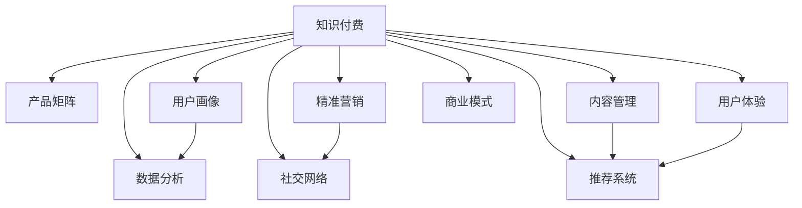

                 

# 知识付费创业的产品矩阵构建

> 关键词：知识付费, 产品矩阵, 用户画像, 精准营销, 社交网络, 内容管理, 数据分析, 人工智能, 推荐系统, 用户体验, 商业模式

## 1. 背景介绍

随着知识经济的兴起，知识付费平台逐渐成为互联网的重要组成部分。知识付费不仅可以帮助用户快速获取所需信息，还可以为内容创作者提供稳定的收入，促进知识共享和创新。但同时，知识付费平台也面临内容同质化、用户体验不佳、营销手段单一等诸多挑战。

如何构建一个稳定、高效、盈利的产品矩阵，成为知识付费创业者亟待解决的问题。本文将从用户画像、精准营销、社交网络、内容管理、数据分析等多个维度，深入探讨知识付费产品的构建思路，并提供实用的技术方案。

## 2. 核心概念与联系

### 2.1 核心概念概述

为更好地理解知识付费创业的产品矩阵构建方法，本节将介绍几个密切相关的核心概念：

- 知识付费(Knowledge-based Subscription)：指用户为获取特定信息或知识而支付费用的服务模式。典型平台如知乎、得到、喜马拉雅等，用户可订阅优质内容或课程，获取价值信息。

- 产品矩阵(Product Portfolio)：指一家企业或创业团队旗下推出的多款产品组合。产品矩阵旨在通过协同互补，提升整体市场份额和盈利能力。

- 用户画像(User Persona)：指对目标用户群体的详细描述，包括人口统计、兴趣偏好、行为模式等。用户画像有助于产品设计和精准营销。

- 精准营销(Precision Marketing)：指通过数据分析和算法优化，精准触达目标用户，提升转化率和用户满意度。

- 社交网络(Social Network)：指基于用户互动和关系构建的网络。社交网络有助于内容推荐、用户留存和社区活跃度提升。

- 内容管理(Content Management)：指对知识付费平台上的内容进行创建、组织、发布和管理的过程。内容管理直接影响平台内容的丰富度和质量。

- 数据分析(Data Analytics)：指通过统计学和算法手段，对平台数据进行深度挖掘和分析，以指导产品优化和运营决策。

- 推荐系统(Recommendation System)：指利用机器学习算法，为用户推荐感兴趣的内容。推荐系统是知识付费平台的关键技术之一。

- 用户体验(User Experience)：指用户使用平台时的主观感受和满意度。良好的用户体验可以提升用户留存率和口碑传播。

- 商业模式(Commercial Model)：指知识付费平台的盈利方式，包括广告、会员订阅、课程销售等。商业模式设计直接影响平台收入和成本。

这些核心概念之间的逻辑关系可以通过以下Mermaid流程图来展示：



这个流程图展示了几类核心概念及其之间的关系：

1. 知识付费平台需要构建产品矩阵，涵盖不同类型和功能的产品。
2. 用户画像和精准营销是构建产品矩阵的基础，通过深入了解用户需求，提升产品适配性。
3. 社交网络和推荐系统是提升用户体验和留存率的关键，通过增强用户互动和内容推荐，形成良性循环。
4. 内容管理和数据分析是保障平台内容质量和运营效率的重要手段，通过数据驱动的内容优化和运营决策，保持平台竞争力。
5. 最终，这些技术和手段共同支撑平台的商业模式设计，实现盈利最大化。

## 3. 核心算法原理 & 具体操作步骤

### 3.1 算法原理概述

知识付费平台的产品矩阵构建，本质上是一个综合性的系统工程，涉及用户画像、精准营销、社交网络、内容管理、数据分析等多个环节。其核心思想是通过算法和技术手段，实现各环节的协同优化，提升平台整体效能。

具体来说，知识付费平台的产品矩阵构建包括以下几个关键步骤：

1. 用户画像构建：通过收集和分析用户行为数据，生成用户画像，用于指导产品设计和精准营销。
2. 精准营销策略：利用机器学习算法和数据分析技术，精准触达目标用户，提升转化率和用户满意度。
3. 社交网络优化：构建基于用户互动和关系的网络，增强用户粘性和平台活跃度。
4. 内容管理与推荐：对平台内容进行高效组织和管理，利用推荐系统为用户推荐高质量内容。
5. 数据分析与优化：通过深度数据分析，评估产品效果和运营效率，指导产品迭代和运营调整。

### 3.2 算法步骤详解

#### 3.2.1 用户画像构建

用户画像的构建是知识付费平台产品矩阵构建的基础。其步骤如下：

1. 数据收集：收集用户的各类行为数据，如浏览历史、购买记录、互动评论等，构建用户特征向量。
2. 特征提取：使用机器学习算法提取用户特征，包括兴趣偏好、行为模式、社交关系等。
3. 画像生成：基于提取的特征，使用聚类、分类等方法生成用户画像。

#### 3.2.2 精准营销策略

精准营销的目的是在有限的预算内，最大化触达目标用户，提升转化率和用户满意度。其步骤如下：

1. 用户细分：基于用户画像，将用户细分成不同的目标群体。
2. 渠道选择：选择最适合目标群体的营销渠道，如邮件、社交媒体、搜索引擎等。
3. 内容定制：根据目标群体的兴趣偏好，定制针对性的营销内容。
4. 效果评估：使用A/B测试、转化率等指标，评估营销效果，调整策略。

#### 3.2.3 社交网络优化

社交网络优化可以增强用户粘性和平台活跃度，其步骤如下：

1. 关系网络构建：建立用户之间的互动关系网络，如好友、关注、点赞等。
2. 社区管理：通过算法优化社区内容，如话题热门度、推荐算法等，提升社区活跃度。
3. 互动引导：通过奖励机制、话题讨论等方式，引导用户积极参与互动。

#### 3.2.4 内容管理与推荐

内容管理与推荐是知识付费平台的核心功能，其步骤如下：

1. 内容创建与审核：鼓励优质内容创作，进行内容审核，保障内容质量。
2. 内容组织与展示：对内容进行分类、标签化，构建知识图谱，提升内容可发现性。
3. 推荐算法优化：利用协同过滤、基于内容的推荐算法等，提升推荐效果。

#### 3.2.5 数据分析与优化

数据分析与优化是知识付费平台运营的重要环节，其步骤如下：

1. 数据收集与清洗：收集平台各项运营数据，并进行清洗处理。
2. 数据挖掘与分析：使用统计学、机器学习等方法，挖掘数据背后的规律和趋势。
3. 运营调整：基于数据分析结果，指导产品迭代和运营决策。

### 3.3 算法优缺点

知识付费平台的产品矩阵构建方法具有以下优点：

1. 用户满意度提升：通过精准营销和个性化推荐，提升用户满意度和粘性。
2. 运营效率提高：利用数据分析和算法优化，提升运营效率，降低成本。
3. 市场竞争力增强：通过多样化的产品矩阵，满足不同用户需求，提升市场份额。

同时，该方法也存在一定的局限性：

1. 数据隐私问题：用户数据的收集和处理需要遵守相关法律法规，保护用户隐私。
2. 算法公平性：推荐算法需要避免算法偏见，确保公平性。
3. 内容审核难度：优质内容的筛选和审核，需要投入大量人力和技术。

尽管存在这些局限性，但就目前而言，基于数据和算法的产品矩阵构建方法，仍是知识付费平台的主要发展方向。未来相关研究的重点在于如何进一步提升算法效率和效果，降低数据隐私风险，保障内容质量。

### 3.4 算法应用领域

基于数据和算法的产品矩阵构建方法，在知识付费平台、在线教育、社交媒体等多个领域得到了广泛应用，取得显著效果。具体应用场景包括：

1. 在线教育平台：通过精准营销和个性化推荐，提升用户学习体验和转化率。
2. 社交媒体平台：通过社交网络优化和内容推荐，提升用户粘性和平台活跃度。
3. 知识付费平台：通过用户画像构建和数据分析，提升产品适配性和运营效率。
4. 电商零售平台：通过精准营销和个性化推荐，提升销售额和用户体验。

这些领域的成功应用，证明了数据和算法驱动的产品矩阵构建方法，具有广泛的适用性和实用性。

## 4. 数学模型和公式 & 详细讲解 & 举例说明

### 4.1 数学模型构建

为更好地理解基于数据和算法的产品矩阵构建方法，本节将使用数学语言对相关算法进行严格刻画。

假设知识付费平台的用户群体为 $U$，每个用户 $u$ 的特征向量为 $\mathbf{x}_u$，平台的推荐算法为 $R$。平台的推荐目标为最大化用户满意度，即最大化目标函数：

$$
\max_{R} \sum_{u \in U} f(\mathbf{x}_u, R(\mathbf{x}_u))
$$

其中 $f$ 为用户满意度的度量函数，如点击率、转化率、满意度评分等。

### 4.2 公式推导过程

以下我们以推荐系统为例，推导基于协同过滤的推荐公式。

假设用户 $u$ 对物品 $i$ 的评分向量为 $\mathbf{r}_u$，物品 $i$ 的评分向量为 $\mathbf{r}_i$，用户 $u$ 和物品 $i$ 的评分矩阵为 $R_{ui}$。则协同过滤算法的推荐公式为：

$$
\hat{R}_{ui} = \sum_{j=1}^n \frac{\mathbf{r}_u \cdot \mathbf{r}_j}{||\mathbf{r}_j||} \cdot \frac{R_{uj}}{\sqrt{\sum_{k=1}^n (\mathbf{r}_j \cdot \mathbf{r}_k)^2}} + b
$$

其中 $n$ 为物品数量，$||\cdot||$ 为向量的范数，$b$ 为偏差项。

### 4.3 案例分析与讲解

假设某知识付费平台有 10 万用户，平台上的课程内容为 5000 门，每门课程的评分向量为 50 维。根据协同过滤算法，平台为用户 $u$ 推荐课程 $i$ 的预测评分 $\hat{R}_{ui}$，具体步骤如下：

1. 收集用户 $u$ 对课程的评分数据，得到评分向量 $\mathbf{r}_u$。
2. 计算用户 $u$ 和物品 $i$ 的评分矩阵 $R_{ui}$。
3. 对于用户 $u$ 感兴趣的物品 $j$，计算 $\mathbf{r}_u \cdot \mathbf{r}_j$ 和 $R_{uj}$。
4. 计算物品 $i$ 的预测评分 $\hat{R}_{ui}$，作为推荐结果。

## 5. 项目实践：代码实例和详细解释说明

### 5.1 开发环境搭建

在进行产品矩阵构建实践前，我们需要准备好开发环境。以下是使用Python进行PyTorch开发的环境配置流程：

1. 安装Anaconda：从官网下载并安装Anaconda，用于创建独立的Python环境。

2. 创建并激活虚拟环境：
```bash
conda create -n pytorch-env python=3.8 
conda activate pytorch-env
```

3. 安装PyTorch：根据CUDA版本，从官网获取对应的安装命令。例如：
```bash
conda install pytorch torchvision torchaudio cudatoolkit=11.1 -c pytorch -c conda-forge
```

4. 安装TensorFlow：
```bash
conda install tensorflow==2.4
```

5. 安装各类工具包：
```bash
pip install numpy pandas scikit-learn matplotlib tqdm jupyter notebook ipython
```

完成上述步骤后，即可在`pytorch-env`环境中开始产品矩阵构建实践。

### 5.2 源代码详细实现

下面我们以推荐系统为例，给出使用PyTorch进行协同过滤推荐算法的PyTorch代码实现。

首先，定义协同过滤算法的核心函数：

```python
import torch
import torch.nn as nn
import torch.nn.functional as F

class CollaborativeFiltering(nn.Module):
    def __init__(self, n_users, n_items, embedding_dim):
        super(CollaborativeFiltering, self).__init__()
        self.user_embedding = nn.Embedding(n_users, embedding_dim)
        self.item_embedding = nn.Embedding(n_items, embedding_dim)
        self.dot_product = nn.Linear(embedding_dim, 1)
    
    def forward(self, user_ids, item_ids):
        user_embed = self.user_embedding(user_ids)
        item_embed = self.item_embedding(item_ids)
        dot_product = self.dot_product((user_embed * item_embed).sum(dim=1))
        return torch.sigmoid(dot_product)
```

然后，定义训练和评估函数：

```python
from torch.utils.data import TensorDataset, DataLoader

def train_model(model, train_data, train_user_ids, train_item_ids, epochs=10, batch_size=64, learning_rate=0.001):
    criterion = nn.BCELoss()
    optimizer = torch.optim.Adam(model.parameters(), lr=learning_rate)
    
    for epoch in range(epochs):
        for user_id, item_id in train_data:
            user_ids = torch.tensor(user_id).to(device)
            item_ids = torch.tensor(item_id).to(device)
            optimizer.zero_grad()
            output = model(user_ids, item_ids)
            loss = criterion(output, train_labels)
            loss.backward()
            optimizer.step()
    
    return model

def evaluate_model(model, test_data, test_user_ids, test_item_ids):
    user_ids = torch.tensor(test_user_ids).to(device)
    item_ids = torch.tensor(test_item_ids).to(device)
    output = model(user_ids, item_ids)
    accuracy = (output > 0.5).float().mean().item()
    return accuracy
```

最后，启动训练流程并在测试集上评估：

```python
# 假设训练集和测试集均为 [(user_id, item_id), (user_id, item_id), ...] 列表格式
train_data = [(train_user_ids[i], train_item_ids[i]) for i in range(len(train_user_ids))]
test_data = [(test_user_ids[i], test_item_ids[i]) for i in range(len(test_user_ids))]
device = torch.device('cuda' if torch.cuda.is_available() else 'cpu')

# 训练模型
model = CollaborativeFiltering(n_users, n_items, embedding_dim)
model = model.to(device)
model.train()
train_model(model, train_data, train_user_ids, train_item_ids)

# 在测试集上评估模型
model.eval()
accuracy = evaluate_model(model, test_data, test_user_ids, test_item_ids)
print(f"Test accuracy: {accuracy}")
```

以上就是使用PyTorch进行协同过滤推荐算法的完整代码实现。可以看到，在PyTorch的强大封装下，协同过滤算法的代码实现变得简洁高效。

### 5.3 代码解读与分析

让我们再详细解读一下关键代码的实现细节：

**CollaborativeFiltering类**：
- `__init__`方法：初始化用户嵌入和物品嵌入层，以及线性层。
- `forward`方法：计算用户和物品的向量乘积，然后通过线性层和 sigmoid 函数进行评分预测。

**train_model函数**：
- 定义损失函数为交叉熵损失，使用Adam优化器进行模型训练。
- 在每个epoch内，循环遍历训练集，进行前向传播、反向传播和参数更新。

**evaluate_model函数**：
- 使用测试集数据进行模型推理，计算预测评分和真实评分的匹配度，得到准确率。

**训练流程**：
- 定义总的epoch数和batch size，开始循环迭代。
- 在每个epoch内，先在训练集上训练模型，输出准确率。
- 在测试集上评估模型，输出最终结果。

可以看到，PyTorch提供了简单易用的API接口，使得协同过滤推荐算法的实现变得非常高效。开发者可以将更多精力放在模型改进和数据处理上，而不必过多关注底层实现细节。

当然，工业级的系统实现还需考虑更多因素，如模型的保存和部署、超参数的自动搜索、更灵活的推荐策略等。但核心的推荐算法基本与此类似。

## 6. 实际应用场景

### 6.1 智慧教育

基于推荐系统的智慧教育平台，可以为学生提供个性化的学习资源和建议，提升学习效率。在实际应用中，可以收集学生的学习行为数据，如浏览记录、笔记内容、考试成绩等，生成学生画像。利用推荐算法，为学生推荐适合的课程和习题，实时调整学习计划，提供有针对性的辅导。

### 6.2 金融理财

基于推荐系统的金融理财平台，可以为用户提供个性化的理财建议和产品推荐，提升用户体验和满意度。在实际应用中，可以收集用户的历史投资数据、风险偏好、财务目标等，生成用户画像。利用推荐算法，为用户推荐适合的理财产品和投资组合，提供投资咨询和风险预警，帮助用户实现财务自由。

### 6.3 电商零售

基于推荐系统的电商零售平台，可以提升用户的购物体验和购买转化率。在实际应用中，可以收集用户的历史购物记录、浏览行为、评价反馈等，生成用户画像。利用推荐算法，为用户推荐适合的商品和促销活动，提供个性化建议和优惠券，增加用户粘性和复购率。

### 6.4 未来应用展望

随着推荐算法的不断演进和数据技术的进步，基于推荐系统的应用场景将不断拓展，为各行各业带来新的变革。未来，推荐系统将在以下领域发挥更大作用：

1. 医疗健康：为患者推荐个性化的治疗方案和康复计划，提升医疗服务质量。
2. 媒体娱乐：为用户推荐适合的影视作品、音乐和书籍，提升用户体验和内容消费量。
3. 智能制造：为制造企业推荐适合的设备和技术，优化生产流程，降低成本。
4. 智能交通：为司机推荐适合的路线和出行建议，提升交通效率和安全性。

以上领域的应用前景，展示了推荐系统在各行各业中的强大潜力和应用价值。

## 7. 工具和资源推荐

### 7.1 学习资源推荐

为了帮助开发者系统掌握推荐系统的理论和实践，这里推荐一些优质的学习资源：

1. 《推荐系统实践》系列书籍：介绍了推荐系统的基本原理、算法优化和实际应用。

2. 《深度学习中的推荐系统》课程：由斯坦福大学开设的推荐系统课程，讲解推荐系统的主要方法和应用场景。

3. 《Python推荐系统实战》书籍：使用Python实现推荐系统的完整实践教程。

4. Coursera《Machine Learning for Recommendation Systems》课程：深度学习推荐系统的实战课程，涵盖协同过滤、矩阵分解等经典算法。

5. Udacity《Recommender Systems》课程：涵盖推荐系统的前沿技术，如深度学习、对抗训练等。

通过对这些资源的学习实践，相信你一定能够快速掌握推荐系统的精髓，并用于解决实际的业务问题。

### 7.2 开发工具推荐

高效的开发离不开优秀的工具支持。以下是几款用于推荐系统开发的常用工具：

1. Apache Spark：开源分布式计算框架，可以处理大规模数据集，适合进行推荐系统的训练和推理。

2. TensorFlow：由Google主导开发的深度学习框架，适合进行复杂推荐算法的实现。

3. Keras：基于TensorFlow的高级API，提供简单易用的API接口，适合快速原型设计和实验。

4. Hadoop：开源分布式计算平台，可以处理大规模数据集，适合进行推荐系统的训练和推理。

5. MXNet：由亚马逊开发的深度学习框架，支持多种语言和硬件平台，适合进行分布式推荐系统开发。

6. RapidMiner：数据科学平台，提供可视化界面和组件，适合进行数据预处理和模型训练。

合理利用这些工具，可以显著提升推荐系统的开发效率，加快创新迭代的步伐。

### 7.3 相关论文推荐

推荐系统的研究源于学界的持续探索。以下是几篇奠基性的相关论文，推荐阅读：

1. ICML 2007: RankNet: A Neural Network for Large-scale Ranking - 提出神经网络模型用于大规模排序任务。

2. NIPS 2008: Matrix Factorization Techniques for Recommender Systems - 提出矩阵分解算法，用于推荐系统建模。

3. KDD 2010: Factorization Machines with Liblinear Solver: A Double Edge Sword for Recommender Systems - 提出因子机模型，用于推荐系统优化。

4. NeurIPS 2017: Attention Is All You Need - 提出Transformer模型，用于推荐系统的神经网络架构。

5. ICML 2018: On the Spectrum of Implicit Feedback for Recommender Systems - 研究隐式反馈对推荐系统的效果影响。

这些论文代表了大推荐系统的发展脉络。通过学习这些前沿成果，可以帮助研究者把握学科前进方向，激发更多的创新灵感。

## 8. 总结：未来发展趋势与挑战

### 8.1 总结

本文对基于数据和算法的产品矩阵构建方法进行了全面系统的介绍。首先阐述了知识付费平台的背景和产品矩阵构建的必要性，明确了推荐系统在产品矩阵构建中的核心作用。其次，从用户画像、精准营销、社交网络、内容管理、数据分析等多个维度，详细讲解了推荐系统的构建思路和实现方法。最后，本文还探讨了推荐系统在未来各领域的应用前景，提供了实用的开发工具和资源推荐。

通过本文的系统梳理，可以看到，基于推荐系统的产品矩阵构建方法，在知识付费平台、在线教育、金融理财等多个领域具有广泛的适用性和实用性。这些技术手段和实践经验，为知识付费平台的构建提供了有力支撑，推动了行业的持续创新和发展。

### 8.2 未来发展趋势

展望未来，推荐系统的发展趋势将呈现以下几个方向：

1. 模型复杂化：未来的推荐系统将引入更多的深度学习模型，如RNN、LSTM、Transformer等，提升推荐效果。

2. 数据多样化：未来的推荐系统将利用多样化的数据源，如社交网络、移动设备等，提升用户画像的丰富度和准确性。

3. 算法协同化：未来的推荐系统将综合利用协同过滤、深度学习、强化学习等多种算法，形成多模态协同推荐。

4. 用户体验优化：未来的推荐系统将更加注重用户交互体验，通过动态调整和个性化推荐，提升用户满意度和粘性。

5. 跨领域应用：未来的推荐系统将突破特定领域限制，应用于更多场景，如医疗、金融、智能制造等，提升各行业智能化水平。

以上趋势展示了推荐系统在未来的广阔前景。这些方向的探索发展，必将进一步提升推荐系统的精准性和效果，推动各行业领域的智能化转型。

### 8.3 面临的挑战

尽管推荐系统已经取得了显著的成就，但在迈向更加智能化、普适化应用的过程中，它仍面临诸多挑战：

1. 数据隐私问题：用户数据的收集和处理需要遵守相关法律法规，保护用户隐私。

2. 算法公平性：推荐算法需要避免算法偏见，确保公平性。

3. 内容审核难度：优质内容的筛选和审核，需要投入大量人力和技术。

4. 推荐算法复杂度：大规模推荐系统的算法复杂度较高，对计算资源和存储资源有较高要求。

5. 实时性和可扩展性：推荐系统需要具备实时性和可扩展性，以适应用户流量变化和数据增长。

6. 多模态数据融合：未来的推荐系统需要综合利用多模态数据，如文本、图像、语音等，实现多模态协同推荐。

7. 推荐效果评估：推荐系统的评估指标需要更加全面和科学，涵盖个性化推荐和多样性推荐。

8. 用户反馈机制：未来的推荐系统需要建立有效的用户反馈机制，及时获取用户反馈，优化推荐效果。

正视推荐系统面临的这些挑战，积极应对并寻求突破，将使推荐系统在未来持续保持竞争力和创新性。相信随着技术的不断进步和应用的深入，推荐系统必将在各行业领域发挥更大的作用，带来更智能、更高效、更个性化的服务体验。

### 8.4 研究展望

面对推荐系统面临的挑战，未来的研究需要在以下几个方面寻求新的突破：

1. 数据隐私保护：研究高效的数据隐私保护技术，如差分隐私、联邦学习等，确保用户数据的安全和隐私。

2. 公平性算法：开发更加公平的推荐算法，避免算法偏见，提升推荐系统的社会价值。

3. 实时推荐系统：研究高效实时推荐算法，提升推荐系统的响应速度和用户体验。

4. 多模态协同推荐：研究多模态数据的融合和协同推荐算法，提升推荐系统的多样性和个性化。

5. 个性化推荐算法：研究更加精准的个性化推荐算法，提升推荐系统的用户满意度。

6. 用户反馈机制：建立有效的用户反馈机制，实时调整和优化推荐系统，提升推荐效果。

这些研究方向将推动推荐系统的发展，使其在更广泛的领域中发挥更大作用，带来更高的用户满意度和业务价值。

## 9. 附录：常见问题与解答

**Q1：推荐系统是否适用于所有产品和服务？**

A: 推荐系统可以适用于多种产品和服务，但不同的应用场景需要不同的推荐策略和算法。例如，电商推荐系统与社交网络推荐系统，其数据源和用户行为模式有很大差异，需要定制化设计和优化。

**Q2：如何提高推荐系统的准确率和覆盖率？**

A: 提高推荐系统的准确率和覆盖率，需要综合考虑数据质量、算法模型、系统架构等多个因素。以下是一些具体方法：

1. 数据清洗：通过数据清洗和特征工程，提升数据质量和特征丰富度。
2. 算法优化：使用深度学习、协同过滤、矩阵分解等算法，提升推荐效果。
3. 多模态融合：综合利用文本、图像、语音等多模态数据，提升推荐系统的多样性和准确性。
4. 实时更新：通过实时数据更新和模型迭代，提升推荐系统的实时性和覆盖率。

**Q3：推荐系统在数据稀疏情况下如何优化？**

A: 在数据稀疏情况下，推荐系统的推荐效果往往较差。以下是一些优化方法：

1. 模型稀疏化：使用稀疏矩阵和稀疏算法，降低计算量和内存消耗。
2. 协同过滤：使用协同过滤算法，利用用户间的相似性进行推荐。
3. 模型扩展：引入深度学习模型，如KNN、LSTM等，提升模型复杂度和表现力。
4. 多模态融合：综合利用多模态数据，提升推荐系统的多样性和准确性。

**Q4：推荐系统如何处理用户恶意行为？**

A: 推荐系统需要防范用户恶意行为，如恶意点击、虚假评分等。以下是一些防范措施：

1. 数据清洗：通过数据清洗和特征筛选，去除异常和恶意数据。
2. 异常检测：使用异常检测算法，识别和过滤恶意行为。
3. 用户惩罚：对恶意行为的用户进行惩罚和限制，如降权、封号等。
4. 反馈机制：建立有效的用户反馈机制，及时获取用户反馈，优化推荐系统。

这些防范措施可以帮助推荐系统规避恶意行为，保障系统的公平性和稳定性。

通过本文的系统梳理，可以看到，基于推荐系统的产品矩阵构建方法，在知识付费平台、在线教育、金融理财等多个领域具有广泛的适用性和实用性。这些技术手段和实践经验，为知识付费平台的构建提供了有力支撑，推动了行业的持续创新和发展。未来，随着技术的不断进步和应用的深入，推荐系统必将在各行业领域发挥更大的作用，带来更智能、更高效、更个性化的服务体验。

