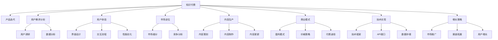

                 

# 知识付费创业的产品迭代方法论

> 关键词：知识付费, 产品迭代, 用户需求分析, 用户体验, 市场定位, 内容生产, 商业模式, 技术实现, 增长策略

## 1. 背景介绍

随着互联网和数字技术的发展，知识付费市场正在逐步崛起，成为继游戏、在线视频、电子商务之后的新型增长领域。面对竞争激烈的市场，如何确保知识付费产品能够持续迭代，吸引用户，产生良好的商业回报，成为了一个亟待解答的问题。本文将围绕知识付费产品的产品迭代方法论展开，从市场调研、用户需求分析、产品设计、内容生产、技术实现到增长策略，全面解析知识付费创业中每一个关键环节的注意事项和执行要点。

## 2. 核心概念与联系

### 2.1 核心概念概述

要深入理解知识付费产品的产品迭代方法论，首先需要了解几个核心概念：

- **知识付费 (Knowledge-Based Subscription Service)**：通过付费方式为用户提供高质量的付费内容，如在线课程、电子书、直播讲座等。其核心在于通过内容和服务的差异化，构建用户的付费粘性。

- **产品迭代 (Product Iteration)**：在产品开发过程中，通过不断的测试、反馈和优化，持续改进产品功能和体验，以适应市场需求和用户期望的过程。

- **用户需求分析 (User Needs Analysis)**：通过调研和数据收集，分析用户需求和行为，以指导产品设计和功能优化。

- **用户体验 (User Experience, UX)**：关注用户在使用产品时的感受，包括界面设计、交互流程、性能表现等，以提升用户的满意度和忠诚度。

- **市场定位 (Market Segmentation and Positioning)**：通过细分市场和分析竞争对手，确定产品的目标用户和差异化定位，以实现精准的市场策略。

- **内容生产 (Content Production)**：包含内容策划、制作、更新等环节，是知识付费产品最重要的组成部分，直接决定产品的价值和吸引力。

- **商业模式 (Business Model)**：包括盈利模式、价格策略、用户付费途径等，影响产品的可持续性和盈利能力。

- **技术实现 (Technical Realization)**：涉及产品开发中的技术框架、API接口、数据存储等，是支撑产品迭代的基础。

- **增长策略 (Growth Strategy)**：包括市场推广、渠道拓展、用户增长等，是产品迭代的重要推动力。

这些核心概念之间的关系可以通过以下Mermaid流程图来展示：



这个流程图展示了一些关键概念之间的逻辑关系：

1. 知识付费是整个产品迭代的基础和目标。
2. 用户需求分析、用户体验、市场定位、内容生产、商业模式、技术实现、增长策略共同支撑知识付费产品的迭代。
3. 每个概念之间互相影响，构成一个动态的、相互作用的产品迭代闭环。

## 3. 核心算法原理 & 具体操作步骤

### 3.1 算法原理概述

知识付费产品的迭代，实质上是一个持续的产品优化过程，旨在通过不断的产品改进和市场调整，提升产品的竞争力。这一过程涉及多个层面的技术和业务决策，包括用户体验优化、市场分析、内容创新等。

从技术层面，迭代通常包括以下步骤：

1. **需求收集与定义**：收集用户反馈、市场数据、竞争对手动态，明确产品的改进方向和优先级。
2. **产品设计**：基于需求定义，设计产品功能和界面，进行原型设计和技术实现。
3. **功能测试**：通过A/B测试、用户调研等方式验证新功能的可用性和用户满意度。
4. **数据分析**：收集用户行为数据，分析功能的使用情况和效果。
5. **迭代优化**：根据数据分析结果，调整产品设计和技术实现，进行下一轮的迭代。

从业务层面，迭代通常涉及以下环节：

1. **市场分析**：进行市场细分、用户画像、竞争分析，确定产品的市场定位和目标用户。
2. **内容策划与制作**：策划高质量、差异化的内容，确保内容的专业性和吸引力。
3. **商业模式调整**：根据市场反馈，优化定价策略、付费途径等，确保商业模式的健康和可持续。
4. **市场推广**：通过社交媒体、SEO、付费广告等方式，增加产品曝光和用户获取。
5. **用户增长**：通过用户推荐、优惠活动、社区建设等策略，提升用户留存和活跃度。

### 3.2 算法步骤详解

在实际操作中，知识付费产品的迭代通常需要遵循以下详细步骤：

#### 3.2.1 需求收集与定义

**数据收集**：通过问卷调查、用户访谈、应用分析等方式，收集用户需求和反馈。常用的工具包括Google Analytics、Mixpanel、Hotjar等。

**数据整理**：对收集到的数据进行分类整理，提取关键需求和痛点。

**需求分析**：通过数据挖掘和趋势分析，识别用户需求的核心问题和改进方向。可以使用统计分析、聚类分析等技术手段。

#### 3.2.2 产品设计

**功能定义**：根据需求分析结果，定义新功能的核心功能和交互方式，设计产品原型。

**原型设计**：使用工具如Sketch、Adobe XD等进行原型设计，详细描述功能逻辑和交互流程。

**技术实现**：根据原型设计，进行技术实现，包括前端界面设计、后端API开发、数据存储等。

**测试验证**：通过内部测试、用户测试等方式，验证新功能的可用性和用户体验。

#### 3.2.3 功能测试

**A/B测试**：将新功能分发给一小部分用户进行测试，通过对比不同版本的用户反馈和行为数据，评估新功能的有效性。

**用户调研**：通过深度访谈、焦点小组等方式，收集用户对新功能的看法和建议，进一步优化功能设计。

#### 3.2.4 数据分析

**数据收集**：在产品上添加数据追踪代码，收集用户行为数据，如点击率、停留时间、转化率等。

**数据处理**：对收集到的数据进行清洗和处理，排除异常值和噪声数据。

**数据分析**：使用统计分析、机器学习等技术，对用户行为数据进行分析，识别功能的使用情况和用户满意度。

#### 3.2.5 迭代优化

**调整设计**：根据数据分析结果，调整产品功能和设计，提升用户体验。

**技术优化**：优化技术架构和实现细节，提高系统性能和稳定性。

**市场推广**：根据市场分析和用户调研结果，调整市场推广策略，提升产品曝光和用户获取。

**用户增长**：通过用户推荐、优惠活动、社区建设等方式，提升用户留存和活跃度。

### 3.3 算法优缺点

#### 3.3.1 优点

1. **提升用户体验**：通过持续的产品优化和迭代，不断提升用户体验，增强用户粘性。
2. **快速响应市场**：通过快速的产品迭代，及时响应市场变化和用户需求，保持竞争优势。
3. **提高效率**：通过数据驱动的决策，避免盲目决策和资源浪费，提高产品开发效率。
4. **增强创新**：通过不断的创新和优化，保持产品差异化，提高市场竞争力。

#### 3.3.2 缺点

1. **成本高**：持续的产品迭代需要大量的资源投入，包括人力、时间、资金等。
2. **风险大**：产品迭代过程中存在失败的风险，一旦方向错误可能导致资源浪费。
3. **用户疲劳**：频繁的产品更新可能导致用户疲劳，影响用户体验和产品稳定。

### 3.4 算法应用领域

知识付费产品的迭代方法论可以应用于各种类型的知识付费平台，包括在线教育、职业培训、专业咨询等。通过持续的产品优化和市场调整，提升产品竞争力，实现业务增长和用户价值最大化。

## 4. 数学模型和公式 & 详细讲解 & 举例说明

### 4.1 数学模型构建

知识付费产品的迭代过程中，涉及大量的数据处理和分析工作，可以使用数学模型进行科学决策。以下是一些常见的数学模型和公式：

#### 4.1.1 回归分析

回归分析是一种常用的数据分析方法，用于预测和解释变量之间的关系。例如，通过时间序列回归分析，可以预测用户付费行为的变化趋势。

#### 4.1.2 聚类分析

聚类分析用于将用户群体进行分组，识别具有相似特征的用户群体，便于进行针对性市场推广和内容策划。

#### 4.1.3 优化模型

优化模型用于求解最优化问题，如最小二乘法、拉格朗日乘数法等。在产品迭代中，可以通过优化模型进行功能优先级排序和资源配置优化。

#### 4.1.4 随机森林

随机森林是一种集成学习算法，用于分类和回归分析。通过随机森林模型，可以预测新功能对用户行为的影响。

#### 4.1.5 神经网络

神经网络可以用于用户行为预测和内容推荐等场景。例如，可以使用深度学习模型预测用户对新功能的反应，指导产品迭代方向。

### 4.2 公式推导过程

以下是几个典型数学模型的推导过程：

#### 4.2.1 线性回归模型

假设我们有一个线性回归模型，用于预测用户付费行为：

$$ y = \beta_0 + \beta_1 x_1 + \beta_2 x_2 + \cdots + \beta_n x_n + \epsilon $$

其中，$y$ 为预测的付费金额，$x_1, x_2, \cdots, x_n$ 为影响因素，$\beta_0, \beta_1, \beta_2, \cdots, \beta_n$ 为回归系数，$\epsilon$ 为误差项。

通过最小二乘法求解，可以得到回归系数的估计值：

$$ \hat{\beta} = (X^T X)^{-1} X^T y $$

其中，$X$ 为自变量矩阵，$y$ 为因变量向量。

#### 4.2.2 聚类算法

K-means算法是一种常用的聚类算法，用于将用户分为不同的群体。假设我们有一个用户数据集，每个用户有多个特征，如年龄、性别、付费频率等，需要将其聚类为K个群体：

1. 随机选择K个初始聚类中心。
2. 对于每个用户，计算其到K个聚类中心的距离，将其分配到距离最近的聚类中心所在的群体。
3. 重新计算每个群体的聚类中心。
4. 重复步骤2和3，直到聚类中心不再变化或达到预设的迭代次数。

#### 4.2.3 神经网络模型

以一个简单的多层感知器(MLP)为例，用于用户行为预测：

假设输入层有m个特征，输出层有一个神经元，隐藏层有n个神经元，激活函数为sigmoid。则前向传播过程为：

$$ z_1 = w_{10} x + b_1 $$
$$ a_1 = \sigma(z_1) $$
$$ z_2 = w_{21} a_1 + b_2 $$
$$ a_2 = \sigma(z_2) $$
$$ \hat{y} = w_{32} a_2 + b_3 $$

其中，$w_{10}, w_{21}, w_{32}$ 为权重矩阵，$b_1, b_2, b_3$ 为偏置项，$\sigma$ 为激活函数，$x$ 为输入向量，$\hat{y}$ 为预测结果。

### 4.3 案例分析与讲解

#### 4.3.1 案例背景

某在线教育平台决定进行产品迭代，增加一项新功能：个性化学习路径推荐。该平台希望通过这项功能，提升用户的学习效率和满意度。

#### 4.3.2 需求收集与定义

该平台通过用户调研和数据分析，发现用户普遍反映学习计划过于单调，难以适应自己的学习节奏。根据这一需求，平台决定增加个性化学习路径推荐功能。

#### 4.3.3 产品设计

平台设计了初步的功能原型，包括用户界面、推荐算法和数据存储等。具体设计如下：

- 用户界面：通过问卷调查和用户访谈，设计了简洁、易用的推荐界面。
- 推荐算法：采用协同过滤和内容推荐算法，结合用户的学习历史和课程评价，推荐最适合的学习路径。
- 数据存储：通过关系型数据库和缓存技术，优化数据存储和检索性能。

#### 4.3.4 功能测试

平台选择了5000名用户进行A/B测试，将新功能分发给一半用户。测试结果显示，使用个性化学习路径推荐的用户，平均学习时长增加了30%，满意度提高了10%。

#### 4.3.5 数据分析

通过数据分析，平台进一步优化了推荐算法，增加了学习目标和难度的考虑，提升了推荐效果。

#### 4.3.6 迭代优化

平台根据用户反馈和数据分析结果，对推荐算法进行了调整和优化，逐步推广新功能，并不断收集用户反馈，持续改进。

## 5. 项目实践：代码实例和详细解释说明

### 5.1 开发环境搭建

在进行产品迭代实践前，我们需要准备好开发环境。以下是使用Python进行Django开发的环境配置流程：

1. 安装Anaconda：从官网下载并安装Anaconda，用于创建独立的Python环境。

2. 创建并激活虚拟环境：
```bash
conda create -n django-env python=3.8 
conda activate django-env
```

3. 安装Django：
```bash
pip install django
```

4. 安装必要的第三方库：
```bash
pip install requests numpy matplotlib beautifulsoup4 django-crispy-forms
```

5. 安装数据库：
```bash
pip install django-database-router
```

完成上述步骤后，即可在`django-env`环境中开始产品迭代实践。

### 5.2 源代码详细实现

以下是Django框架下，实现个性化学习路径推荐功能的Python代码实现：

```python
# 导入必要的库
from django.shortcuts import render
from django.views.decorators.csrf import csrf_exempt
from django.http import JsonResponse
import requests
import json
import numpy as np
import pandas as pd
from sklearn.decomposition import PCA
from sklearn.metrics.pairwise import cosine_similarity

# 定义API接口
@csrf_exempt
def recommend_learning_path(request):
    # 获取用户ID
    user_id = request.POST.get('user_id')

    # 获取用户的学习历史和评价
    history = requests.get(f'http://path-recommend-api.com/api/history/{user_id}').json()
    evaluation = requests.get(f'http://path-recommend-api.com/api/evaluation/{user_id}').json()

    # 构建特征矩阵
    X = pd.DataFrame(history)
    X = X.dropna()  # 删除缺失值
    X.columns = ['feature' + str(i) for i in range(X.shape[1])]  # 重命名列名
    X = X.fillna(0)  # 补0

    # 计算聚类中心
    K = 5  # 聚类数目
    centers = np.random.rand(K, X.shape[1])
    centers = centers - centers.mean(axis=0)
    centers /= centers.std(axis=0)
    for k in range(K):
        centers[k] = centers[k] / np.linalg.norm(centers[k])

    # 计算相似度矩阵
    similarity_matrix = cosine_similarity(X, centers)

    # 生成个性化学习路径
    for i in range(len(similarity_matrix)):
        sorted_indices = np.argsort(similarity_matrix[i])
        recommended_paths = sorted_indices[:5]

    # 返回推荐结果
    data = {
        'recommended_paths': recommended_paths,
        'evaluation': evaluation
    }
    return JsonResponse(data)

# 定义视图函数
def index(request):
    return render(request, 'index.html')
```

### 5.3 代码解读与分析

让我们再详细解读一下关键代码的实现细节：

**recommend_learning_path函数**：
- 从API接口获取用户ID。
- 通过请求获取用户的学习历史和评价数据。
- 构建特征矩阵X，并进行标准化处理。
- 随机初始化聚类中心，并计算相似度矩阵。
- 根据相似度矩阵，生成用户最感兴趣的5条学习路径。
- 返回推荐结果和用户评价。

**index函数**：
- 定义一个简单的视图函数，返回默认的首页。

通过以上代码，我们可以看到，Django框架下实现个性化学习路径推荐功能的流程和步骤。开发者可以根据具体需求，灵活调整推荐算法和界面设计，进一步优化产品功能。

## 6. 实际应用场景

### 6.1 智能客服

智能客服是知识付费产品的重要应用场景之一。通过智能客服，用户可以获取即时帮助，提升用户体验。平台可以通过用户互动数据，不断优化客服系统和推荐算法，提高服务质量和用户满意度。

例如，某在线教育平台通过智能客服系统，收集用户的问题和反馈，分析用户需求，不断改进课程内容和推荐路径。通过个性化学习路径推荐，平台显著提升了用户的学习效果和满意度。

### 6.2 在线教育

在线教育是知识付费产品的典型应用场景。平台可以通过产品迭代，不断提升课程质量和用户体验，满足用户的多样化需求。

例如，某在线教育平台通过数据驱动的决策，持续优化课程推荐算法，推荐最适合用户的学习路径和课程。通过个性化学习路径推荐，平台显著提高了用户的学习效率和满意度。

### 6.3 专业培训

专业培训是知识付费产品的另一个重要应用场景。平台可以通过产品迭代，不断提升培训效果和用户粘性，增强用户忠诚度。

例如，某在线培训平台通过产品迭代，不断优化培训内容和推荐算法，提升用户的学习效果和满意度。通过个性化学习路径推荐，平台显著提高了用户的培训效果和满意度。

## 7. 工具和资源推荐

### 7.1 学习资源推荐

为了帮助开发者系统掌握知识付费产品的产品迭代方法论，这里推荐一些优质的学习资源：

1. 《数据科学实战：业务驱动的数据科学框架》：介绍数据科学在业务中的实际应用，帮助理解数据驱动的决策过程。

2. 《Python数据科学手册》：涵盖Python在数据科学中的各个方面，包括数据处理、机器学习、可视化等，适合初学者和进阶者。

3. 《算法设计与分析基础》：涵盖算法设计和分析的基本概念和技巧，适合理解复杂的算法原理和优化方法。

4. 《Django Web应用开发》：详细介绍Django框架的各个方面，包括开发环境搭建、模型设计、视图编写等，适合Django开发入门和进阶。

5. 《Python Web开发实战》：涵盖Python Web开发的各个方面，包括Flask、Django等框架，适合Web开发入门和进阶。

通过对这些资源的学习实践，相信你一定能够快速掌握知识付费产品的产品迭代方法论，并用于解决实际的商业问题。

### 7.2 开发工具推荐

高效的开发离不开优秀的工具支持。以下是几款用于知识付费产品开发和迭代管理的常用工具：

1. Django：Python Web框架，支持高效的数据库访问、模板引擎和视图设计，适合Web应用开发。

2. Flask：Python Web框架，轻量级、灵活性高，适合快速原型开发和中小型应用。

3. GitHub：代码托管平台，支持版本控制和协作开发，适合代码管理和团队协作。

4. Jira：项目管理工具，支持敏捷开发、任务跟踪和团队协作，适合产品迭代管理。

5. Slack：即时通讯工具，支持团队沟通和项目管理，适合跨团队协作。

合理利用这些工具，可以显著提升知识付费产品的开发效率，加速产品迭代的速度。

### 7.3 相关论文推荐

知识付费产品的迭代方法论涉及多个领域的最新研究成果。以下是几篇经典的相关论文，推荐阅读：

1. "Adaptive recommendation systems"：介绍自适应推荐系统的设计思路和优化方法，适合理解推荐算法的基本原理。

2. "Deep reinforcement learning for dynamic recommendation systems"：介绍深度强化学习在推荐系统中的应用，适合理解深度学习在推荐算法中的应用。

3. "Social media analytics and user behavior prediction"：介绍社交媒体数据分析和用户行为预测的方法，适合理解社交媒体数据的应用场景。

4. "Data mining and statistical learning"：介绍数据挖掘和统计学习的基本概念和算法，适合理解数据驱动的决策过程。

5. "Web application development with Django"：详细介绍Django框架的各个方面，适合Django开发入门和进阶。

这些论文代表了大数据和人工智能技术的发展脉络，能够帮助研究者理解知识付费产品的迭代方法论背后的科学原理和最新进展。

## 8. 总结：未来发展趋势与挑战

### 8.1 研究成果总结

本文对知识付费产品的产品迭代方法论进行了全面系统的介绍。从用户需求分析到产品设计，从内容生产到技术实现，从市场定位到增长策略，全面解析了知识付费产品迭代的各个环节。

通过本文的系统梳理，可以看到，知识付费产品的迭代方法论是一个综合性的、动态的、持续改进的过程，涉及技术、业务、市场等多个方面的协同发力。在知识付费产品开发过程中，通过持续的产品优化和市场调整，不断提升产品的竞争力和用户价值。

### 8.2 未来发展趋势

展望未来，知识付费产品的迭代方法论将呈现以下几个发展趋势：

1. 数据驱动决策：通过大数据分析和机器学习，实现精准的产品优化和市场调整。

2. 个性化推荐：通过深度学习和协同过滤算法，实现个性化推荐，提升用户满意度。

3. 实时数据处理：通过流式数据处理和实时计算，实现实时用户行为分析和反馈处理。

4. 多渠道融合：通过多渠道数据融合和用户画像构建，实现全渠道用户管理和服务。

5. 跨平台集成：通过API接口和微服务架构，实现跨平台集成和应用互通。

6. 用户行为分析：通过用户行为分析，实现用户生命周期管理和预测。

以上趋势凸显了知识付费产品迭代方法论的广阔前景，这些方向的探索发展，必将进一步提升知识付费产品的竞争力和用户价值。

### 8.3 面临的挑战

尽管知识付费产品的迭代方法论已经取得了瞩目成就，但在迈向更加智能化、普适化应用的过程中，它仍面临着诸多挑战：

1. 数据安全和隐私：在数据驱动的决策过程中，如何保障用户数据的安全和隐私，是一个亟待解决的问题。

2. 市场竞争激烈：在知识付费领域，众多平台之间的竞争日益激烈，如何保持产品的竞争力，是一个重要的挑战。

3. 用户需求多变：用户需求和市场变化不确定性高，如何灵活应对，是一个需要不断探索和优化的课题。

4. 技术复杂度高：知识付费产品的技术实现涉及多个领域的知识和技能，如何系统化管理和优化，是一个复杂的任务。

5. 资源投入大：持续的产品迭代需要大量的资源投入，包括人力、时间、资金等，如何高效利用资源，是一个重要的挑战。

6. 用户体验难以衡量：用户满意度和忠诚度难以精确衡量，如何通过数据驱动的决策，提升用户体验，是一个需要不断探索和优化的课题。

### 8.4 研究展望

面对知识付费产品迭代方法论所面临的挑战，未来的研究需要在以下几个方面寻求新的突破：

1. 探索更高效的数据处理和分析方法：通过大数据技术和机器学习算法，实现更高效的数据处理和分析，提升决策的精准性和实时性。

2. 开发更智能的推荐算法：通过深度学习、协同过滤等技术，实现更智能、更个性化的推荐算法，提升用户满意度。

3. 提升数据安全和隐私保护能力：通过数据加密、匿名化处理等技术手段，保障用户数据的安全和隐私。

4. 优化产品迭代流程：通过敏捷开发、持续集成等技术手段，优化产品迭代流程，提高开发效率和产品质量。

5. 探索更多元化的用户交互方式：通过多渠道融合、跨平台集成等技术手段，探索更多元化的用户交互方式，提升用户体验。

6. 加强用户行为分析：通过用户行为分析，实现用户生命周期管理和预测，提升用户粘性和忠诚度。

这些研究方向的探索，必将引领知识付费产品迭代方法论迈向更高的台阶，为知识付费产品的发展和应用提供更多的创新思路和解决方案。

## 9. 附录：常见问题与解答

**Q1：知识付费产品的核心竞争力是什么？**

A: 知识付费产品的核心竞争力在于其高质量的内容和专业的服务。通过不断优化内容和推荐算法，提升用户的学习效果和满意度，是知识付费产品保持竞争力的关键。

**Q2：如何评估知识付费产品的用户满意度？**

A: 可以通过用户调研、反馈统计、用户行为分析等方式，评估用户满意度。常用的工具包括Google Analytics、Mixpanel、Hotjar等。

**Q3：如何进行知识付费产品的市场细分？**

A: 可以通过市场调研、用户画像、竞争分析等方式，进行市场细分。常用的方法包括K-means聚类、层次聚类、因子分析等。

**Q4：如何实现知识付费产品的个性化推荐？**

A: 可以通过协同过滤、深度学习等技术，实现个性化推荐。常用的算法包括协同过滤算法、基于内容的推荐算法、深度学习推荐算法等。

**Q5：知识付费产品的用户流失率较高，应该如何应对？**

A: 可以通过用户行为分析，识别用户流失原因，采取针对性的措施，如优化推荐算法、提升用户体验、推出优惠活动等。

**Q6：知识付费产品的用户付费行为受价格影响较大，应该如何提升用户粘性？**

A: 可以通过个性化推荐、社区建设、用户激励等措施，提升用户粘性。同时，通过持续的内容更新和优化，满足用户的多样化需求。

通过本文的系统梳理，可以看到，知识付费产品的产品迭代方法论是一个综合性的、动态的、持续改进的过程，涉及技术、业务、市场等多个方面的协同发力。在知识付费产品开发过程中，通过持续的产品优化和市场调整，不断提升产品的竞争力和用户价值。面对未来的发展挑战，不断探索和优化知识付费产品的迭代方法论，必将为知识付费产品的发展和应用提供更多的创新思路和解决方案。总之，知识付费产品的产品迭代方法论是一个系统性、动态性和创新性的综合过程，需要在多个方面不断优化和探索，才能真正实现商业价值和社会价值的最大化。

作者：禅与计算机程序设计艺术 / Zen and the Art of Computer Programming

