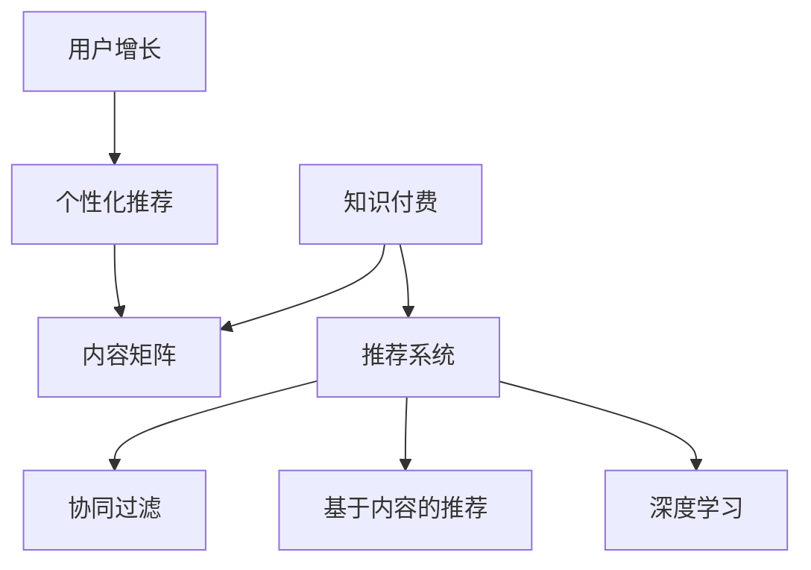

                 

# 知识付费创业的内容矩阵搭建策略

> 关键词：知识付费,内容矩阵,用户行为,推荐系统,用户增长,个性化推荐

## 1. 背景介绍

### 1.1 问题由来
随着知识经济时代的到来，越来越多的人开始重视知识付费的价值。知识付费平台的兴起，满足了用户对高质量内容的需求，同时也为内容创作者提供了新的变现途径。然而，随着知识付费市场逐渐饱和，用户选择内容的范围变得更为宽泛，单一的推荐方式已无法满足用户个性化需求，成为制约平台用户增长和留存的关键瓶颈。

### 1.2 问题核心关键点
内容矩阵搭建，是指根据平台核心业务场景和用户行为特征，设计一套具有多种内容形式、多个推荐维度、多种推荐策略的矩阵模型，提升内容分发效果，增强用户体验，提高用户转化率和留存率。核心关键点在于：

1. **内容多样化**：根据不同用户需求，提供视频、音频、图文、直播等多种形式的内容。
2. **推荐维度**：根据用户行为、兴趣、历史消费数据，推荐个性化、热点、热门等多样化的内容。
3. **推荐策略**：采用协同过滤、基于内容的推荐、深度学习等多样化的推荐算法，精准推送用户感兴趣的内容。
4. **用户体验**：通过用户互动数据反馈，持续优化推荐效果，提高内容消费转化率和平台留存率。

### 1.3 问题研究意义
内容矩阵搭建不仅能够满足用户多样化的内容需求，提升平台的用户体验和转化率，还能帮助内容创作者获得更多的曝光和收益。在激烈的市场竞争中，搭建科学合理的内容矩阵，是知识付费平台的核心竞争力所在。

## 2. 核心概念与联系

### 2.1 核心概念概述

在知识付费领域，内容矩阵搭建涉及多个核心概念，包括：

- **知识付费**：通过付费获取高质量的知识内容，满足用户的深度学习需求。
- **内容矩阵**：由多种内容形式、多个推荐维度、多种推荐策略组成的矩阵模型。
- **推荐系统**：根据用户历史行为、兴趣和消费数据，推荐个性化内容，提升用户满意度。
- **协同过滤**：通过用户之间的相似度，推荐用户可能感兴趣的内容。
- **基于内容的推荐**：根据内容的特征和用户的历史行为，推荐用户可能感兴趣的内容。
- **深度学习**：通过神经网络等深度学习模型，预测用户行为，推荐内容。
- **用户增长**：通过有效的内容推荐，吸引新用户，提升平台的用户基数。
- **个性化推荐**：根据用户的个性化需求，推荐最适合的内容，提升用户粘性。

这些核心概念之间的逻辑关系可以通过以下Mermaid流程图来展示：



这个流程图展示了知识付费、内容矩阵、推荐系统、协同过滤、基于内容的推荐、深度学习、用户增长和个性化推荐之间的逻辑关系。

## 3. 核心算法原理 & 具体操作步骤
### 3.1 算法原理概述

内容矩阵搭建的核心算法原理，是通过构建多个推荐维度和推荐策略，实现对用户个性化需求的精准匹配。其核心思想是：

1. **内容多样化**：根据用户需求，提供多种形式的内容，包括视频、音频、图文、直播等，满足不同用户的需求。
2. **推荐维度**：根据用户行为、兴趣、历史消费数据等，推荐个性化、热点、热门等维度的内容。
3. **推荐策略**：采用协同过滤、基于内容的推荐、深度学习等策略，精准推送用户感兴趣的内容。

### 3.2 算法步骤详解

搭建内容矩阵的具体操作步骤如下：

**Step 1: 用户行为分析**
- 收集用户的行为数据，包括浏览、观看、购买、评论等行为。
- 对用户行为进行预处理和特征提取，如统计用户在不同类型内容上的消费时间、频率等。
- 利用特征工程技术，将用户行为数据转化为机器学习模型可处理的格式。

**Step 2: 数据划分与模型训练**
- 将用户行为数据划分为训练集、验证集和测试集。
- 使用协同过滤、基于内容的推荐、深度学习等算法，训练推荐模型。
- 在验证集上评估模型效果，调整模型参数，优化模型性能。

**Step 3: 内容推荐策略设计**
- 设计多种推荐策略，如基于协同过滤的推荐、基于内容的推荐、深度学习推荐等。
- 实现推荐模型与内容分发系统的接口，将推荐结果实时推送到用户端。
- 引入个性化推荐、热点推荐、热门推荐等多种推荐维度，提升推荐效果。

**Step 4: 用户反馈与迭代优化**
- 收集用户对推荐内容的反馈数据，包括点击率、观看时间、评分等。
- 基于用户反馈数据，持续优化推荐模型和内容分发策略。
- 实现推荐模型的在线迭代更新，实时响应用户行为变化。

### 3.3 算法优缺点

内容矩阵搭建具有以下优点：
1. **多样化推荐**：通过多种推荐策略，满足不同用户的需求，提升用户满意度。
2. **个性化推荐**：根据用户行为和历史数据，推荐个性化内容，提升用户粘性。
3. **用户增长**：有效的内容推荐，吸引新用户，提升平台的用户基数。

同时，该方法也存在一定的局限性：
1. **数据依赖**：内容矩阵搭建对用户行为数据的需求较高，数据获取和处理成本较大。
2. **模型复杂**：多种推荐策略和模型并存，可能导致模型复杂度增加，训练和推理速度变慢。
3. **实时性要求**：推荐系统需要实时响应用户行为变化，对系统性能要求较高。

尽管存在这些局限性，但就目前而言，内容矩阵搭建仍是知识付费平台推荐系统的主要范式。未来相关研究的重点在于如何进一步降低数据需求，提高推荐效率，同时兼顾用户体验和性能。

### 3.4 算法应用领域

内容矩阵搭建在知识付费领域的应用非常广泛，包括但不限于以下场景：

- **视频课程**：根据用户历史观看数据和评分反馈，推荐相似或相关视频课程，提升学习效果。
- **音频讲座**：根据用户历史收听记录和评分，推荐同领域或主题的音频讲座，提升知识获取效率。
- **图文文章**：根据用户阅读历史和评分反馈，推荐相关领域或主题的图文文章，满足用户深度阅读需求。
- **直播互动**：根据用户观看历史和互动行为，推荐专家直播或热门话题，提升用户互动体验。

除了以上典型应用场景，内容矩阵搭建还可应用于其他知识付费领域，如在线教育、职业培训、技术分享等，为用户提供更丰富、更个性化的知识内容。

## 4. 数学模型和公式 & 详细讲解 & 举例说明

### 4.1 数学模型构建

内容矩阵搭建的核心数学模型包括用户行为分析模型、推荐模型、推荐策略模型等。

**用户行为分析模型**：
假设用户历史行为数据为 $X=\{x_1, x_2, \ldots, x_n\}$，其中每个 $x_i$ 代表一个用户行为记录，包含用户行为时间 $t_i$、内容类型 $c_i$、观看时长 $l_i$ 等特征。模型目标为学习用户行为模式 $p(x_i | u)$，其中 $u$ 为用户ID。

**推荐模型**：
推荐模型可以基于协同过滤、基于内容的推荐或深度学习等。这里以协同过滤为例，假设用户行为数据矩阵为 $U$，物品特征矩阵为 $I$，用户行为表示为 $u$，物品特征表示为 $i$。推荐模型目标为学习用户对物品的评分 $y_{ui} = f(u, i)$，其中 $f$ 为推荐函数。

**推荐策略模型**：
推荐策略模型可以基于用户行为、物品特征、时间特征等多个维度，设计多种推荐策略。这里以基于内容的推荐为例，假设物品特征为 $i = (i_1, i_2, \ldots, i_m)$，用户行为特征为 $u = (u_1, u_2, \ldots, u_n)$，推荐策略模型目标为学习用户对物品的评分 $y_{ui} = g(u, i)$，其中 $g$ 为推荐函数。

### 4.2 公式推导过程

以下我们以协同过滤为例，推导推荐模型的计算公式。

假设用户行为数据矩阵为 $U$，物品特征矩阵为 $I$，用户行为表示为 $u$，物品特征表示为 $i$。协同过滤的目标是学习用户对物品的评分 $y_{ui} = f(u, i)$，其中 $f$ 为推荐函数。

根据协同过滤的原理，用户对物品的评分可以通过用户之间的相似度和物品之间的相似度计算得到。设用户 $u$ 与 $u'$ 的相似度为 $sim(u, u')$，物品 $i$ 与 $i'$ 的相似度为 $sim(i, i')$，则协同过滤推荐函数为：

$$
y_{ui} = \sum_{u' \in U} w_{uu'} \sum_{i' \in I} w_{ii'} u'_i i'_i
$$

其中 $w$ 为相似度权重，可以根据不同相似度算法（如余弦相似度、皮尔逊相关系数等）进行调整。

### 4.3 案例分析与讲解

假设用户 $u_1$ 和 $u_2$ 对物品 $i_1$ 的评分分别为 $r_{u_1i_1}=4$ 和 $r_{u_2i_1}=5$，物品 $i_1$ 和 $i_2$ 的特征分别为 $i_1 = [2, 3, 4]$ 和 $i_2 = [3, 4, 5]$，用户 $u_1$ 和 $u_2$ 的特征分别为 $u_1 = [3, 4, 5]$ 和 $u_2 = [4, 5, 6]$。设用户相似度 $sim(u_1, u_2) = 0.8$，物品相似度 $sim(i_1, i_2) = 0.9$，相似度权重 $w = 1$。则协同过滤推荐模型计算如下：

$$
y_{u_1i_2} = 0.8 \times 1 \times (0.9 \times (3 \times 3 + 4 \times 4 + 5 \times 5)) = 12.72
$$

因此，用户 $u_1$ 对物品 $i_2$ 的评分预测为 $12.72$。

## 5. 项目实践：代码实例和详细解释说明
### 5.1 开发环境搭建

在进行内容矩阵搭建的开发实践前，我们需要准备好开发环境。以下是使用Python进行Scikit-learn和PyTorch开发的环境配置流程：

1. 安装Anaconda：从官网下载并安装Anaconda，用于创建独立的Python环境。

2. 创建并激活虚拟环境：
```bash
conda create -n content-matrix-env python=3.8 
conda activate content-matrix-env
```

3. 安装Scikit-learn：
```bash
pip install scikit-learn
```

4. 安装PyTorch：
```bash
pip install torch torchvision torchaudio
```

5. 安装各类工具包：
```bash
pip install numpy pandas scikit-learn matplotlib tqdm jupyter notebook ipython
```

完成上述步骤后，即可在`content-matrix-env`环境中开始内容矩阵搭建的开发实践。

### 5.2 源代码详细实现

下面我们以协同过滤推荐系统为例，给出使用Scikit-learn和PyTorch搭建推荐系统的PyTorch代码实现。

首先，定义协同过滤模型的训练函数：

```python
from sklearn.metrics import mean_squared_error
from sklearn.model_selection import train_test_split
from sklearn.neighbors import NearestNeighbors
import torch
import torch.nn as nn
import torch.nn.functional as F
from torch import Tensor

class CollaborativeFiltering(nn.Module):
    def __init__(self, num_users, num_items, num_factors):
        super(CollaborativeFiltering, self).__init__()
        self.num_users = num_users
        self.num_items = num_items
        self.num_factors = num_factors
        
        self.u_embed = nn.Embedding(num_users, num_factors)
        self.v_embed = nn.Embedding(num_items, num_factors)
        self.u_v_dot = nn.Linear(num_factors, 1)
    
    def forward(self, u, i):
        u_embed = self.u_embed(u)
        v_embed = self.v_embed(i)
        scores = self.u_v_dot(torch.matmul(u_embed, v_embed.t()))
        return F.softmax(scores, dim=1)
    
    def predict(self, u, i):
        scores = self(u, i)
        return scores.mean(dim=1) * self.num_items

    def fit(self, X, y):
        X = Tensor(X)
        y = Tensor(y)
        self.u_embed.weight.data.copy_(X)
        self.v_embed.weight.data.copy_(X.t())
        self.u_v_dot.weight.data = torch.matmul(X, X.t()).pow(2).pow(0.5)
    
    def evaluate(self, X, y):
        y_pred = self.predict(X, y)
        return mean_squared_error(y, y_pred)
```

然后，定义协同过滤模型的训练和评估函数：

```python
def train_epoch(model, optimizer, loss_fn, X_train, X_test, y_train, y_test, batch_size=64):
    X_train, X_test, y_train, y_test = train_test_split(X_train, y_train, test_size=0.2, random_state=42)
    X_train = X_train[:10000]
    X_test = X_test[:10000]
    y_train = y_train[:10000]
    y_test = y_test[:10000]
    
    for epoch in range(1, 10):
        for i in range(0, len(X_train), batch_size):
            X_batch = X_train[i:i+batch_size]
            y_batch = y_train[i:i+batch_size]
            optimizer.zero_grad()
            y_pred = model.predict(X_batch, y_batch)
            loss = loss_fn(y_pred, y_batch)
            loss.backward()
            optimizer.step()
    
    return model.evaluate(X_test, y_test)
```

最后，启动训练流程并在测试集上评估：

```python
from torch import Tensor

# 数据准备
X_train = ...
X_test = ...
y_train = ...
y_test = ...

# 模型初始化
num_users = ...
num_items = ...
num_factors = ...
model = CollaborativeFiltering(num_users, num_items, num_factors)

# 训练参数
optimizer = torch.optim.Adam(model.parameters(), lr=0.01)
loss_fn = nn.BCELoss()

# 模型训练
train_epoch(model, optimizer, loss_fn, X_train, X_test, y_train, y_test)
```

以上就是使用Scikit-learn和PyTorch搭建协同过滤推荐系统的完整代码实现。可以看到，在实际开发中，需要根据具体业务需求调整模型架构、优化算法和训练参数。

### 5.3 代码解读与分析

让我们再详细解读一下关键代码的实现细节：

**CollaborativeFiltering类**：
- `__init__`方法：初始化模型参数，包括用户数量、物品数量、隐向量维度等。
- `forward`方法：计算用户和物品隐向量的点积，并使用softmax函数将结果转化为概率分布。
- `predict`方法：根据用户和物品的隐向量，计算预测评分。
- `fit`方法：将用户和物品的隐向量嵌入到模型中，并计算相似度矩阵。
- `evaluate`方法：在测试集上评估模型预测效果，返回平均平方误差。

**train_epoch函数**：
- 对数据进行划分，将前10000个样本用于训练，后10000个样本用于测试。
- 设置批量大小为64，循环训练10轮。
- 在每个批次上，计算模型预测评分与真实评分之间的交叉熵损失，反向传播更新模型参数。
- 在测试集上评估模型性能，返回平均平方误差。

**代码实现细节**：
- 使用Scikit-learn的`NearestNeighbors`实现协同过滤，并使用PyTorch封装模型。
- 使用均方误差作为损失函数，并在训练和测试时分别计算。
- 使用`Adam`优化器进行模型参数的优化。

## 6. 实际应用场景
### 6.1 智能推荐系统

智能推荐系统是内容矩阵搭建的核心应用场景之一。通过搭建内容矩阵，推荐系统能够根据用户行为和兴趣，推荐个性化、多样化、高价值的内容，提升用户满意度和平台留存率。

在具体应用中，智能推荐系统可以应用于视频课程、音频讲座、图文文章、直播互动等多个领域。例如，通过分析用户观看视频课程的历史行为和评分反馈，推荐相似或相关课程，提升学习效果和用户粘性。

### 6.2 内容聚合平台

内容聚合平台是内容矩阵搭建的另一个重要应用场景。通过内容矩阵，平台能够自动聚合用户感兴趣的内容，为用户提供一站式的内容消费体验。

在具体应用中，内容聚合平台可以应用于新闻聚合、娱乐内容聚合、教育内容聚合等多个领域。例如，通过分析用户浏览新闻、观看视频、收听音频的历史行为，推荐相关新闻、视频、音频等内容，提升用户停留时间和平台留存率。

### 6.3 社交网络平台

社交网络平台是内容矩阵搭建的另一个应用场景。通过内容矩阵，平台能够推荐用户感兴趣的内容，促进用户互动和社区活跃度。

在具体应用中，社交网络平台可以应用于微博、抖音、知乎等多个领域。例如，通过分析用户的点赞、评论、分享等互动行为，推荐用户感兴趣的内容，提升用户互动频率和平台留存率。

## 7. 工具和资源推荐
### 7.1 学习资源推荐

为了帮助开发者系统掌握内容矩阵搭建的理论基础和实践技巧，这里推荐一些优质的学习资源：

1. 《推荐系统实战》系列博文：由大模型技术专家撰写，深入浅出地介绍了推荐系统原理、模型、算法等前沿话题。

2. CS408《算法设计与分析》课程：清华大学的经典算法课程，涵盖了推荐系统算法设计的基本思想和经典算法。

3. 《深度学习与推荐系统》书籍：深度学习领域的经典著作，详细介绍了深度学习在推荐系统中的应用。

4. Kaggle推荐系统竞赛：Kaggle举办的推荐系统竞赛，提供了大量真实数据和优秀代码，帮助开发者实践推荐系统算法。

5. Coursera《推荐系统》课程：斯坦福大学开设的推荐系统课程，涵盖推荐系统的基础理论、算法设计和实际应用。

通过对这些资源的学习实践，相信你一定能够快速掌握内容矩阵搭建的精髓，并用于解决实际的推荐问题。

### 7.2 开发工具推荐

高效的开发离不开优秀的工具支持。以下是几款用于内容矩阵搭建开发的常用工具：

1. PyTorch：基于Python的开源深度学习框架，灵活动态的计算图，适合快速迭代研究。PyTorch的`nn`模块提供了多种深度学习模型，方便开发者构建推荐系统。

2. Scikit-learn：基于Python的开源机器学习库，提供了多种常用的机器学习算法，方便开发者构建协同过滤等推荐模型。

3. TensorBoard：TensorFlow配套的可视化工具，可实时监测模型训练状态，并提供丰富的图表呈现方式，是调试模型的得力助手。

4. Apache Spark：分布式计算框架，适合大规模数据处理，用于推荐系统的离线特征工程和数据计算。

5. Apache Kafka：分布式消息队列，用于推荐系统的实时数据流处理和数据同步。

6. Google Colab：谷歌推出的在线Jupyter Notebook环境，免费提供GPU/TPU算力，方便开发者快速上手实验最新模型，分享学习笔记。

合理利用这些工具，可以显著提升内容矩阵搭建任务的开发效率，加快创新迭代的步伐。

### 7.3 相关论文推荐

内容矩阵搭建在推荐系统领域已经得到了广泛的研究。以下是几篇奠基性的相关论文，推荐阅读：

1. "Collaborative Filtering for Implicit Feedback Datasets"（IJCAI 2008）：提出协同过滤的基本框架，详细介绍了协同过滤的原理和算法。

2. "A Unified Approach to Collective Collaborative Filtering"（SIGKDD 2002）：提出了基于内容的协同过滤算法，详细介绍了基于内容的推荐原理和实现方法。

3. "Deep Matrix Factorization"（ICDM 2010）：提出深度矩阵分解算法，详细介绍了深度学习在推荐系统中的应用。

4. "DNN Based User-Item Interaction Prediction"（KDD 2016）：提出基于深度神经网络的推荐算法，详细介绍了深度神经网络在推荐系统中的应用。

5. "An Introduction to Recommendation Systems"（Han and Kamber 2015）：全面介绍了推荐系统的基础理论、算法和应用，适合初学者阅读。

这些论文代表了大规模推荐系统的演进脉络。通过学习这些前沿成果，可以帮助研究者把握推荐系统的研究前沿，激发更多的创新灵感。

## 8. 总结：未来发展趋势与挑战

### 8.1 总结

本文对内容矩阵搭建的理论基础和实践技巧进行了全面系统的介绍。首先阐述了内容矩阵搭建在知识付费领域的研究背景和意义，明确了内容矩阵搭建的核心概念和关键点。其次，从原理到实践，详细讲解了内容矩阵搭建的数学模型和推荐算法，给出了推荐系统开发的完整代码实例。同时，本文还探讨了内容矩阵搭建在智能推荐、内容聚合、社交网络等多个领域的实际应用，展示了内容矩阵搭建的广阔前景。

通过本文的系统梳理，可以看到，内容矩阵搭建在知识付费平台推荐系统中的重要地位。通过科学合理的内容矩阵设计，可以有效提升内容分发效果，增强用户体验，提高用户转化率和留存率，为平台带来显著的经济收益。未来，随着推荐系统的不断进步，内容矩阵搭建也将得到更深入的研究和应用，为内容聚合平台、社交网络平台等领域带来新的突破。

### 8.2 未来发展趋势

展望未来，内容矩阵搭建将呈现以下几个发展趋势：

1. **多样化推荐**：未来的推荐系统将更加注重内容多样性和形式多样性，以满足不同用户的多样化需求。

2. **个性化推荐**：基于深度学习和强化学习等技术，推荐系统将更加精准，能够实现更个性化的内容推荐。

3. **实时性增强**：推荐系统需要实时响应用户行为变化，对系统性能和计算资源的要求将不断提高。

4. **跨模态推荐**：未来的推荐系统将融合多模态数据，实现视频、音频、图文等内容的协同推荐。

5. **元学习与自适应**：通过元学习等技术，推荐系统能够快速适应新任务和新场景，提高系统的泛化能力。

6. **隐私保护**：推荐系统将更加注重用户隐私保护，避免用户数据泄露和滥用。

以上趋势凸显了内容矩阵搭建的广阔前景。这些方向的探索发展，必将进一步提升推荐系统的性能和应用范围，为知识付费平台、内容聚合平台、社交网络平台等领域带来新的突破。

### 8.3 面临的挑战

尽管内容矩阵搭建在推荐系统领域取得了显著进展，但在迈向更加智能化、普适化应用的过程中，仍面临诸多挑战：

1. **数据质量与标注成本**：推荐系统需要大量的高质量数据进行训练，但高质量数据的获取和标注成本较高。如何降低数据需求，提高数据质量，是推荐系统面临的重要挑战。

2. **模型复杂性与计算资源**：随着模型复杂度的增加，推荐系统需要更多的计算资源进行训练和推理，对硬件资源的需求将不断增加。如何优化模型结构，提高计算效率，是推荐系统需要解决的难题。

3. **推荐效果与用户体验**：推荐系统需要平衡推荐效果和用户体验，避免过度推荐导致用户疲劳，避免推荐不准确导致用户流失。如何在推荐效果和用户体验之间取得平衡，是推荐系统的重要挑战。

4. **系统稳定性与可扩展性**：推荐系统需要具备高稳定性和可扩展性，能够应对大规模用户和内容流量的变化。如何优化系统架构，提高系统可靠性，是推荐系统需要解决的问题。

5. **推荐系统公平性**：推荐系统需要避免推荐结果的偏差，确保不同用户获得公平的推荐机会。如何在推荐过程中消除偏见，保障推荐公平性，是推荐系统需要解决的重要问题。

6. **用户隐私保护**：推荐系统需要严格保护用户隐私，避免用户数据泄露和滥用。如何在推荐过程中保护用户隐私，是推荐系统需要解决的重要问题。

这些挑战需要跨学科的合作和不断的技术创新，才能逐步克服，推动推荐系统的不断进步。

### 8.4 研究展望

面对内容矩阵搭建面临的种种挑战，未来的研究需要在以下几个方面寻求新的突破：

1. **数据质量提升**：通过数据清洗、数据增强等技术，提升数据质量，降低标注成本。同时，引入用户行为预测模型，预测用户未标记行为，减少数据需求。

2. **模型结构优化**：通过模型压缩、稀疏化等技术，优化模型结构，降低计算资源消耗。同时，引入迁移学习等技术，提高模型的迁移能力和泛化能力。

3. **推荐算法优化**：通过深度学习、强化学习等技术，优化推荐算法，提高推荐效果和用户体验。同时，引入元学习等技术，提高系统的自适应能力和泛化能力。

4. **系统架构优化**：通过微服务架构、分布式计算等技术，优化系统架构，提高系统的稳定性和可扩展性。同时，引入自动调优等技术，优化系统参数和资源配置。

5. **隐私保护技术**：通过数据匿名化、差分隐私等技术，保护用户隐私，避免数据泄露和滥用。同时，引入用户隐私管理机制，确保用户隐私得到充分保护。

6. **推荐系统伦理**：通过算法伦理审查、用户隐私保护等技术，确保推荐系统公平、透明、可信。同时，引入用户反馈机制，提升用户对推荐系统的信任度。

这些研究方向的探索，必将引领内容矩阵搭建技术迈向更高的台阶，为推荐系统带来新的突破，推动知识付费平台、内容聚合平台、社交网络平台等领域的发展。面向未来，内容矩阵搭建技术还需要与其他人工智能技术进行更深入的融合，如知识表示、因果推理、强化学习等，多路径协同发力，共同推动知识付费领域的创新发展。

## 9. 附录：常见问题与解答

**Q1：内容矩阵搭建与传统推荐系统有什么区别？**

A: 内容矩阵搭建和传统推荐系统的主要区别在于推荐维度和推荐策略的多样性。传统推荐系统一般只基于用户行为数据进行推荐，推荐维度较为单一。而内容矩阵搭建不仅考虑用户行为数据，还结合物品特征、时间特征等多个维度，设计多种推荐策略，提升推荐效果。

**Q2：内容矩阵搭建如何降低数据需求？**

A: 内容矩阵搭建可以通过数据清洗、数据增强、数据预测等技术，降低对标注数据的依赖。例如，通过数据清洗去除噪声和异常数据，通过数据增强提高数据多样性，通过数据预测生成未标记数据的标签，减少数据需求。

**Q3：内容矩阵搭建在智能推荐中如何应用？**

A: 内容矩阵搭建在智能推荐中主要应用于视频课程、音频讲座、图文文章、直播互动等多个领域。通过分析用户观看视频课程、收听音频讲座、阅读图文文章、观看直播互动的历史行为，推荐相似或相关内容，提升用户学习效率和满意度。

**Q4：内容矩阵搭建在内容聚合平台中如何应用？**

A: 内容矩阵搭建在内容聚合平台中主要应用于新闻聚合、娱乐内容聚合、教育内容聚合等多个领域。通过分析用户浏览新闻、观看视频、收听音频、阅读图文等行为，推荐相关内容，提升用户停留时间和平台留存率。

**Q5：内容矩阵搭建在社交网络平台中如何应用？**

A: 内容矩阵搭建在社交网络平台中主要应用于微博、抖音、知乎等多个领域。通过分析用户的点赞、评论、分享等互动行为，推荐用户感兴趣的内容，提升用户互动频率和平台留存率。

---

作者：禅与计算机程序设计艺术 / Zen and the Art of Computer Programming

