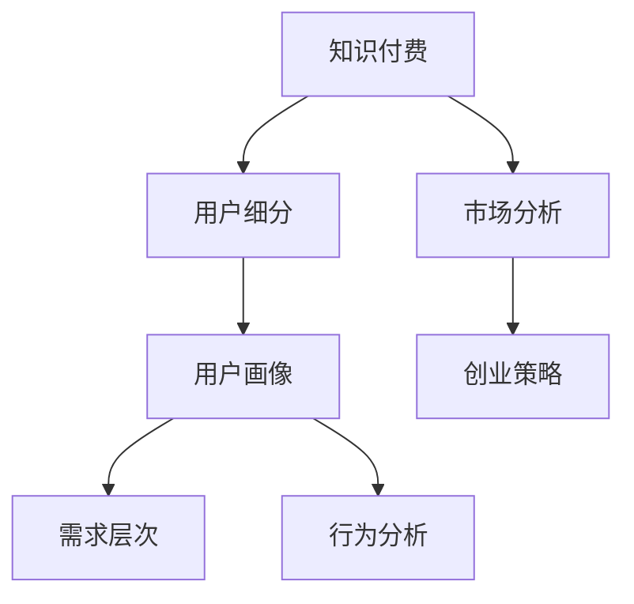

                 

# 知识付费创业的用户群体细分

> 关键词：知识付费,用户细分,用户画像,市场分析,创业策略

## 1. 背景介绍

### 1.1 问题由来

近年来，知识付费市场发展迅猛，用户对有价值知识的需求日益增加，各种知识付费平台如雨后春笋般涌现。然而，在知识付费创业的浪潮中，并非所有创业项目都能获得成功。成功的关键在于能否精准识别并满足目标用户群体的需求，有效提升用户黏性并实现商业变现。因此，对用户群体进行深入细分，成为知识付费创业中不可或缺的一环。

### 1.2 问题核心关键点

知识付费创业中用户群体细分的核心关键点主要包括以下几个方面：

- **目标用户分析**：了解潜在用户的需求和偏好，包括职业背景、兴趣爱好、消费能力等，从而制定精准的市场定位。
- **需求层次划分**：将用户需求划分为不同层次，包括信息获取、技能提升、职业发展等，以便于提供个性化内容和服务。
- **行为分析**：分析用户的在线行为模式，如学习时间、消费习惯、内容偏好等，从而优化产品功能和用户体验。
- **市场细分策略**：基于用户细分结果，制定差异化的市场策略和运营计划，提高用户转化率和忠诚度。

通过深入分析这些关键点，可以更好地理解和把握知识付费创业中用户群体细分的重要性，制定出科学合理的用户细分方案。

## 2. 核心概念与联系

### 2.1 核心概念概述

为更好地理解用户群体细分的核心概念，本节将介绍几个密切相关的核心概念：

- **知识付费**：指用户通过付费获取有价值知识服务的商业模式。涵盖音频、视频、图文等多种形式，旨在满足用户学习提升和专业发展的需求。
- **用户细分**：指根据用户特性和行为，将目标用户划分成不同子群体的过程。每个子群体具有相似的需求和行为特征，便于制定有针对性的市场策略。
- **用户画像**：指对用户基本信息、行为偏好、消费习惯等进行全面描述，以形成具有代表性和实用性的用户画像。
- **需求层次**：指用户需求按满足程度分为多个层次，包括信息需求、技能提升、职业发展等，有助于提供定制化服务。
- **行为分析**：指对用户在线行为模式进行分析，包括学习时间、互动频率、内容消费等，以便于优化产品功能和运营策略。

这些核心概念之间的逻辑关系可以通过以下Mermaid流程图来展示：



这个流程图展示的知识付费创业中用户群体细分的核心概念及其之间的关系：

1. 知识付费通过提供知识服务满足用户需求，进而进行市场分析。
2. 用户细分是将目标用户划分成不同子群体，以便于制定差异化策略。
3. 用户画像是根据用户特征和行为构建的代表用户画像。
4. 需求层次将用户需求划分为不同层次，提供个性化内容和服务。
5. 行为分析是对用户在线行为模式进行分析，优化产品功能和运营策略。
6. 创业策略基于用户细分和市场分析，制定切实可行的商业计划。

这些核心概念共同构成了知识付费创业的用户群体细分框架，有助于更好地理解和满足用户需求。

## 3. 核心算法原理 & 具体操作步骤
### 3.1 算法原理概述

用户群体细分的算法原理主要基于数据挖掘和机器学习技术，通过分析用户数据，挖掘潜在用户特征和行为模式，从而进行科学合理的用户划分。

具体而言，可以采用聚类算法、分类算法、关联规则挖掘等机器学习技术，对用户数据进行建模和分析。常用的算法包括：

- **K-means聚类**：根据用户特征相似度，将用户划分为多个群组。
- **决策树分类**：基于用户属性和行为，构建分类模型进行用户划分。
- **关联规则挖掘**：发现用户行为中的相关规则，用于关联分析和推荐系统。

### 3.2 算法步骤详解

基于数据挖掘和机器学习技术，用户群体细分的具体操作步骤如下：

**Step 1: 数据收集与预处理**
- 收集目标用户的基本信息、行为数据和消费数据。
- 对数据进行清洗和标准化处理，去除噪声和异常值，保证数据质量。

**Step 2: 特征工程**
- 提取有意义的特征，如用户年龄、职业、学习时间、消费习惯等。
- 对特征进行编码和归一化处理，转换为模型可接受的格式。

**Step 3: 模型选择与训练**
- 根据数据特点选择适合的聚类、分类或关联规则挖掘算法。
- 对模型进行训练，使用用户数据作为训练集，得到用户分群模型。

**Step 4: 模型评估与优化**
- 使用交叉验证等方法评估模型效果，确保划分结果的准确性和稳定性。
- 根据评估结果优化模型参数，提高划分效果。

**Step 5: 用户细分与策略制定**
- 根据模型结果，将用户分为不同子群体，并构建用户画像。
- 制定差异化的市场策略和运营计划，提升用户转化率和忠诚度。

### 3.3 算法优缺点

用户群体细分的算法具有以下优点：

- **高效精准**：通过数据挖掘和机器学习技术，实现自动化用户细分，提高效率和准确性。
- **个性化服务**：针对不同用户群体，提供差异化内容和服务，提升用户满意度。
- **决策支持**：为创业策略制定提供数据支持，辅助产品开发和市场推广。

同时，该方法也存在一些局限性：

- **数据依赖性高**：细分的准确性依赖于数据质量和完整性，数据缺失或噪声会影响结果。
- **模型复杂度高**：复杂的数据挖掘算法需要大量计算资源，提高模型训练成本。
- **用户隐私风险**：用户数据隐私保护是重要问题，需要严格遵守数据保护法规。
- **动态性不足**：用户需求和行为随时间变化，需要定期重新进行用户细分和策略调整。

尽管存在这些局限性，但基于数据挖掘的用户群体细分方法仍是大规模知识付费创业中的重要手段。未来相关研究的重点在于如何进一步降低数据依赖，提高模型的动态适应性，同时兼顾用户隐私和安全性等因素。

### 3.4 算法应用领域

用户群体细分方法在知识付费创业中具有广泛的应用场景，具体如下：

- **内容推荐**：通过用户画像和行为分析，推荐个性化的学习内容，提升用户黏性和满意度。
- **产品定价**：根据不同用户群体的消费能力和需求层次，制定差异化的定价策略，最大化商业价值。
- **营销策略**：针对不同用户群体，制定精准的营销推广策略，提高用户转化率。
- **用户体验优化**：分析用户行为模式，优化产品功能和界面设计，提升用户体验。
- **用户增长**：通过用户细分，找到潜在的高价值用户群体，进行精准的渠道推广和市场扩张。

除了上述这些主要应用外，用户群体细分还可以在客户细分、市场洞察、用户忠诚度管理等方面发挥重要作用，为知识付费创业提供全方位的支持。

## 4. 数学模型和公式 & 详细讲解 & 举例说明

### 4.1 数学模型构建

用户群体细分的数学模型主要基于聚类分析和分类算法，通过优化目标函数，实现对用户数据的聚类或分类。

以K-means聚类算法为例，其数学模型为：

$$
\min_{K,C,\mu} \sum_{i=1}^n \sum_{k=1}^K (y_i = k) \Vert x_i - \mu_k \Vert^2
$$

其中，$x_i$ 为第$i$个用户特征向量，$\mu_k$ 为第$k$个聚类的中心点，$y_i$ 为用户的聚类标签。

### 4.2 公式推导过程

K-means算法的基本思想是通过迭代优化，将用户划分为K个簇，每个簇的质心即为簇的平均值。推导过程如下：

1. 初始化K个质心$\mu_k$。
2. 对每个用户$x_i$，计算其与每个质心的距离$d_k$。
3. 将用户$x_i$分配到距离最近的簇$k_i$。
4. 重新计算每个簇的质心$\mu_k$。
5. 重复步骤2-4，直到质心不再变化或达到预设迭代次数。

### 4.3 案例分析与讲解

假设某知识付费平台收集了用户的基本信息（如年龄、职业）和行为数据（如学习时间、内容消费）。使用K-means算法对用户进行聚类，发现用户可以划分为以下三个群体：

- **学生群体**：主要关注职业技能提升，学习时间集中在周末，偏爱视频和互动式课程。
- **职场人士**：需求多样化，兼顾职业发展和技能提升，学习时间较为分散，偏好音频和文档类内容。
- **自由职业者**：以技能提升为主，学习时间灵活，消费能力强，偏好深度学习和大数据等高阶内容。

通过用户细分，平台可以制定针对性策略，如：

- 为学生群体提供定制化的职业发展规划课程。
- 对职场人士推出灵活的上下班学习计划和多样化课程组合。
- 对自由职业者推出高端定制化服务，满足其高阶学习需求。

## 5. 项目实践：代码实例和详细解释说明
### 5.1 开发环境搭建

在进行用户群体细分项目开发前，需要先搭建开发环境。以下是使用Python进行Scikit-learn开发的环境配置流程：

1. 安装Anaconda：从官网下载并安装Anaconda，用于创建独立的Python环境。

2. 创建并激活虚拟环境：
```bash
conda create -n user细分 python=3.8 
conda activate user细分
```

3. 安装Scikit-learn：
```bash
pip install scikit-learn
```

4. 安装各类工具包：
```bash
pip install numpy pandas scikit-learn matplotlib tqdm jupyter notebook ipython
```

完成上述步骤后，即可在`user细分`环境中开始项目开发。

### 5.2 源代码详细实现

下面以K-means聚类为例，给出使用Scikit-learn进行用户群体细分的Python代码实现。

首先，准备数据集：

```python
from sklearn.datasets import make_blobs

X, y = make_blobs(n_samples=1000, centers=3, random_state=42)
```

然后，定义K-means聚类模型：

```python
from sklearn.cluster import KMeans

kmeans = KMeans(n_clusters=3, random_state=42)
kmeans.fit(X)
```

最后，输出聚类结果：

```python
y_pred = kmeans.predict(X)
print(y_pred)
```

以上就是使用Scikit-learn进行K-means聚类的完整代码实现。可以看到，通过Scikit-learn的封装，我们可以用简洁的代码实现复杂的聚类算法，极大提升了开发效率。

### 5.3 代码解读与分析

让我们再详细解读一下关键代码的实现细节：

**make_blobs函数**：
- 生成3个聚类中心的模拟数据集，用于聚类模型的训练和测试。

**KMeans类**：
- 实例化KMeans聚类模型，设置聚类数为3。
- 使用`fit`方法对数据集进行聚类，得到用户分群结果。

**predict方法**：
- 使用聚类模型对新样本进行预测，得到每个用户的聚类标签。

**print输出**：
- 输出每个样本的聚类标签，展示聚类结果。

可以看到，Scikit-learn提供了简洁易用的API接口，使得用户群体细分等机器学习任务的开发变得简单高效。开发者可以更多地关注算法原理和业务逻辑，而不必过多关注底层实现细节。

当然，工业级的系统实现还需考虑更多因素，如模型的存储和部署、超参数的自动搜索、更灵活的聚类策略等。但核心的用户群体细分流程基本与此类似。

## 6. 实际应用场景
### 6.1 智能推荐系统

用户群体细分技术可以广泛应用于智能推荐系统中，根据用户画像和行为分析，提供个性化的内容推荐。

在实际应用中，平台可以收集用户的学习历史、行为数据和反馈信息，构建用户画像。通过K-means聚类等算法，将用户分为不同群体，并根据不同群体的需求和偏好，推荐相应的学习内容。此外，平台还可以利用关联规则挖掘技术，发现用户之间的行为关联，进一步优化推荐效果。

### 6.2 课程定价策略

通过用户细分，平台可以制定差异化的课程定价策略，最大化商业价值。

例如，平台可以根据不同用户群体的消费能力和需求层次，设置不同的课程价格。对于学生群体，可以提供价格优惠的课程包，吸引其长期订阅。对于职场人士，可以推出灵活的按需购买方案，满足其多变的学习需求。对于自由职业者，可以提供高端定制化服务，提升其支付意愿。

### 6.3 个性化营销推广

用户群体细分还可以用于个性化营销推广，提高用户转化率和忠诚度。

平台可以通过分析用户群体特征和行为，制定针对性的营销策略。例如，对于学生群体，可以推广与其专业相关的技能提升课程，通过社交媒体和校园合作等方式进行精准推广。对于职场人士，可以推出职场发展课程和技能认证，通过职业认证和公司内推等方式提升转化率。对于自由职业者，可以推广高阶定制化课程，通过高端社区和VIP会员等方式吸引其加入。

### 6.4 用户忠诚度管理

用户群体细分还可以用于提升用户忠诚度，增加用户粘性。

通过聚类分析，平台可以识别出对平台高度依赖的用户群体，制定相应的忠诚度管理策略。例如，可以提供个性化学习计划、专属课程推荐、VIP特权服务等方式，满足不同用户群体的需求，提升其对平台的粘性和忠诚度。

### 6.5 市场洞察与趋势预测

用户群体细分还可以用于市场洞察和趋势预测，帮助平台制定长远发展战略。

通过分析用户群体的特征和行为，平台可以发现市场中的潜在需求和机会。例如，可以发现用户对特定技能或内容的需求趋势，及时调整课程设置和内容更新，满足用户需求。同时，平台还可以利用用户分群数据，进行市场竞争分析和趋势预测，制定更加科学合理的发展战略。

## 7. 工具和资源推荐
### 7.1 学习资源推荐

为了帮助开发者系统掌握用户群体细分的理论基础和实践技巧，这里推荐一些优质的学习资源：

1. 《数据科学导论》系列书籍：全面介绍了数据科学的基本概念和常用算法，包括聚类分析、分类算法等。

2. Coursera《数据科学专项课程》：由约翰霍普金斯大学开设的系列课程，系统讲解了数据科学的核心技能和应用。

3. Kaggle官方论坛：Kaggle社区是数据科学和机器学习领域的交流平台，提供了大量学习资源和实践案例。

4. Scikit-learn官方文档：Scikit-learn库的官方文档，提供了丰富的算法实现和实例代码，是进行机器学习开发的必备资料。

5. Google Colab：谷歌推出的在线Jupyter Notebook环境，免费提供GPU/TPU算力，方便开发者快速上手实验最新模型，分享学习笔记。

通过对这些资源的学习实践，相信你一定能够快速掌握用户群体细分的精髓，并用于解决实际的NLP问题。

### 7.2 开发工具推荐

高效的开发离不开优秀的工具支持。以下是几款用于用户群体细分开发的常用工具：

1. Scikit-learn：基于Python的开源机器学习库，提供了丰富的算法实现和实用工具，是进行用户群体细分开发的利器。

2. Pandas：基于Python的数据处理库，提供高效的数据清洗、处理和分析功能，是数据预处理的重要工具。

3. Jupyter Notebook：免费的交互式编程环境，支持多种编程语言，适合开发和分享数据科学项目。

4. Weights & Biases：模型训练的实验跟踪工具，可以记录和可视化模型训练过程中的各项指标，方便对比和调优。与主流深度学习框架无缝集成。

5. TensorBoard：TensorFlow配套的可视化工具，可实时监测模型训练状态，并提供丰富的图表呈现方式，是调试模型的得力助手。

合理利用这些工具，可以显著提升用户群体细分任务的开发效率，加快创新迭代的步伐。

### 7.3 相关论文推荐

用户群体细分技术的发展源于学界的持续研究。以下是几篇奠基性的相关论文，推荐阅读：

1. "K-means: A method for clustering in fixed sample spaces"（K-means聚类算法）：提出了K-means聚类算法的基本思想和实现流程，成为聚类分析的基石。

2. "The Cure for the Curse of Dimensionality"（解决高维数据问题）：提出了降维方法和高维数据分析的思路，为聚类算法在高维数据中的应用提供了新的方向。

3. "An Introduction to Instance-Based Learning with Examples in Python"（实例学习简介）：通过Python实现实例学习算法，包括K-means聚类和KNN等，适合初学者入门学习。

4. "Towards a Generalized Theory of Causal Relationships"（因果关系理论）：提出了因果推断和因果分析方法，为知识付费内容推荐提供了新的思路。

5. "Knowledge-Based Decision Systems for the Recommendation of Music Channels"（基于知识的决策系统）：将知识图谱应用于推荐系统，提升了推荐效果和用户满意度。

这些论文代表了大数据用户群体细分的技术演进脉络。通过学习这些前沿成果，可以帮助研究者把握学科前进方向，激发更多的创新灵感。

## 8. 总结：未来发展趋势与挑战
### 8.1 总结

本文对用户群体细分方法进行了全面系统的介绍。首先阐述了用户群体细分的背景和意义，明确了其在知识付费创业中的重要性。其次，从原理到实践，详细讲解了用户群体细分的数学原理和操作步骤，给出了项目开发的完整代码实例。同时，本文还广泛探讨了用户群体细分的应用场景，展示了其在推荐系统、课程定价、营销推广等方面的巨大潜力。此外，本文精选了用户群体细分的各类学习资源，力求为开发者提供全方位的技术指引。

通过本文的系统梳理，可以看到，用户群体细分在知识付费创业中具有重要的战略价值，是实现个性化服务、提高用户转化率、提升商业价值的关键。未来，随着数据科学和机器学习技术的不断进步，用户群体细分将更加精准、高效，为知识付费创业提供更强大的技术支持。

### 8.2 未来发展趋势

展望未来，用户群体细分的技术将呈现以下几个发展趋势：

1. **自动化与智能化**：通过机器学习算法，实现自动化用户细分，提高效率和准确性。未来将进一步引入AI技术，实现更加智能化的用户细分和策略制定。

2. **跨平台融合**：用户群体细分将不再局限于单一平台，而是跨平台进行多维度数据融合。例如，结合社交媒体、电商平台等数据，进行更加全面的用户画像和行为分析。

3. **实时化与动态性**：用户需求和行为随时间变化，需要实时动态更新用户细分结果。未来将进一步引入流计算和大数据技术，实现实时化用户细分和策略调整。

4. **多模态融合**：用户群体细分将结合语音、视频、文本等多种模态数据，进行更加全面、精准的用户分析。例如，结合语音情感分析、视频行为识别等技术，提升用户群体细分的准确性和适用性。

5. **隐私保护与安全**：用户群体细分涉及大量敏感数据，需要严格遵守数据保护法规，引入隐私保护和安全技术，保障用户数据安全。

6. **个性化推荐与营销**：结合用户群体细分结果，进行更加精准的个性化推荐和营销推广，提升用户转化率和平台盈利能力。

以上趋势凸显了用户群体细分的广阔前景。这些方向的探索发展，必将进一步提升知识付费系统的性能和应用范围，为平台带来更大的商业价值和用户满意度。

### 8.3 面临的挑战

尽管用户群体细分技术已经取得了瞩目成就，但在迈向更加智能化、普适化应用的过程中，它仍面临着诸多挑战：

1. **数据质量与完整性**：用户群体细分依赖于高质量的数据，数据缺失、噪声和异常值会影响细分结果的准确性。如何保证数据质量，成为亟待解决的问题。

2. **算法复杂度与成本**：复杂的算法模型需要大量计算资源，训练和维护成本较高。如何降低算法复杂度，提高模型训练和部署效率，仍需进一步研究。

3. **用户隐私与数据安全**：用户群体细分涉及大量敏感数据，数据隐私和安全保护至关重要。如何平衡数据利用和隐私保护，成为用户群体细分的关键挑战。

4. **动态性与实时性**：用户需求和行为随时间变化，需要实时更新用户细分结果。如何在动态变化的数据中，快速更新用户细分策略，仍需深入研究。

5. **模型解释性与可理解性**：用户群体细分的模型往往较为复杂，难以解释其内部工作机制和决策逻辑。如何提高模型的可解释性和可理解性，增强用户信任，是未来研究的重要方向。

6. **多平台数据融合**：用户群体细分需要跨平台数据融合，但不同平台的数据格式和结构各异，如何实现高效的数据整合，仍需进一步优化。

正视用户群体细分面临的这些挑战，积极应对并寻求突破，将是大数据用户群体细分技术的成熟之路。相信随着技术的不断进步和应用实践的积累，用户群体细分必将在知识付费创业中发挥更加重要的作用，为平台带来更大的商业价值和用户满意度。

### 8.4 研究展望

面对用户群体细分所面临的种种挑战，未来的研究需要在以下几个方面寻求新的突破：

1. **自动化与智能化**：引入AI技术，实现自动化用户细分，提升效率和准确性。例如，结合深度学习和强化学习技术，构建自适应、自优化用户细分模型。

2. **多模态融合**：结合语音、视频、文本等多种模态数据，进行更加全面、精准的用户分析。例如，结合语音情感分析、视频行为识别等技术，提升用户群体细分的准确性和适用性。

3. **实时化与动态性**：引入流计算和大数据技术，实现实时化用户细分和策略调整。例如，利用实时数据流进行动态更新用户细分，提高平台响应速度和用户粘性。

4. **隐私保护与安全**：引入隐私保护和安全技术，保障用户数据安全。例如，采用差分隐私技术、数据匿名化等手段，确保用户数据隐私和安全。

5. **可解释性与可理解性**：提高模型的可解释性和可理解性，增强用户信任。例如，引入可解释性算法和可视化技术，提供模型内部工作机制和决策逻辑的解释。

6. **跨平台数据融合**：优化跨平台数据整合流程，提高数据融合效率和质量。例如，采用数据联邦技术，实现多平台数据的无缝对接和整合。

这些研究方向的探索，必将引领用户群体细分技术迈向更高的台阶，为知识付费创业提供更加精准、高效、安全的技术支持。面向未来，用户群体细分技术需要在数据质量、算法复杂度、隐私保护、实时性、可解释性和跨平台融合等方面不断优化，才能更好地满足用户需求，推动知识付费创业的持续发展。

## 9. 附录：常见问题与解答

**Q1：用户群体细分的目的是什么？**

A: 用户群体细分的目的是通过分析用户数据，挖掘潜在用户特征和行为模式，将目标用户划分成不同子群体，以便于制定有针对性的市场策略。

**Q2：用户群体细分的数据来源有哪些？**

A: 用户群体细分的数据来源包括用户基本信息（如年龄、职业）、行为数据（如学习时间、内容消费）、反馈数据（如评价、推荐等）。这些数据可以来自平台自身数据、第三方数据源、社交媒体等。

**Q3：如何选择合适的聚类算法？**

A: 选择合适的聚类算法需要考虑数据特点和业务需求。例如，K-means适用于简单聚类任务，GMM适用于正态分布数据，Hierarchical聚类适用于树形结构数据。需要根据具体情况选择合适的算法。

**Q4：用户群体细分的效果如何评估？**

A: 用户群体细分的评估可以从多个维度进行，包括聚类质量（如簇内凝聚度、簇间分离度）、用户满意度（如转化率、忠诚度）、商业价值（如营收增长、用户粘性）等。评估结果可以用于优化模型参数和策略制定。

**Q5：用户群体细分在知识付费中的作用是什么？**

A: 用户群体细分在知识付费中的作用包括：提供个性化的内容推荐、制定差异化的课程定价策略、优化用户忠诚度管理、提升市场洞察与趋势预测等。通过用户群体细分，可以更好地理解用户需求和行为，制定更加精准、高效的运营策略。

---

作者：禅与计算机程序设计艺术 / Zen and the Art of Computer Programming

