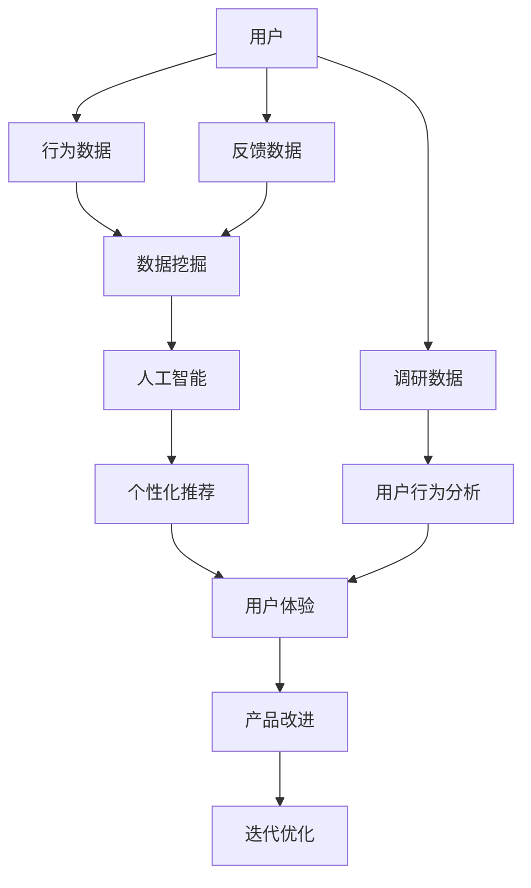

                 

# 知识付费创业的用户需求挖掘技巧

> 关键词：知识付费, 用户需求, 数据挖掘, 人工智能, 个性化推荐, 用户体验, 用户行为分析

## 1. 背景介绍

随着互联网的普及和信息技术的发展，知识付费成为一种新型的知识获取方式。相较于传统的免费信息，付费内容因其专业性、深度和实用性，越来越受到大众的青睐。但与此同时，知识付费市场的竞争也日益激烈，用户需求的多样性和个性化要求越来越高，这对创业者和开发者提出了新的挑战。如何深度挖掘用户需求，提供满足用户期待的知识付费产品，成为当下知识付费领域亟需解决的问题。本文将围绕“知识付费创业的用户需求挖掘技巧”，从背景、核心概念与联系、核心算法原理、项目实践、实际应用场景、工具和资源推荐、总结与展望、常见问题与解答等维度进行详细阐述。

## 2. 核心概念与联系

### 2.1 核心概念概述

为深入理解知识付费创业中的用户需求挖掘技巧，本节将介绍几个关键概念：

- **知识付费**：指消费者为获取知识或信息而支付费用的商业模式，包括但不限于电子书、在线课程、音频讲座、专业咨询等。

- **用户需求挖掘**：指通过数据分析、用户调研等方式，深入挖掘用户对知识付费产品的真实需求，为其提供个性化的知识内容和服务。

- **数据挖掘**：从大量数据中提取有价值信息的过程，包括用户行为、偏好、反馈等数据。

- **人工智能**：通过算法和大数据技术，使机器能够模拟人类智能行为，如自然语言处理、图像识别、推荐系统等。

- **个性化推荐**：利用机器学习等技术，根据用户的历史行为和偏好，为其推荐个性化的内容和服务。

- **用户体验**：用户在使用产品或服务过程中的感受和满意度，包括界面设计、内容呈现、交互方式等方面。

- **用户行为分析**：通过数据分析方法，了解用户的行为模式和心理特征，为产品改进提供依据。

这些核心概念共同构成了知识付费创业的用户需求挖掘基础，理解这些概念可以帮助我们更好地应对知识付费市场的多变需求，为用户提供优质的内容和服务。

### 2.2 核心概念原理和架构的 Mermaid 流程图



该流程图展示了用户需求挖掘的关键流程，从用户数据收集到人工智能应用，再到个性化推荐和用户体验提升，最终实现产品迭代优化。每个环节相辅相成，共同支撑知识付费产品的开发和优化。

## 3. 核心算法原理 & 具体操作步骤

### 3.1 算法原理概述

知识付费创业中的用户需求挖掘，通常涉及用户行为数据的收集、分析和应用。核心算法原理包括：

- **数据收集**：通过用户注册、浏览、购买、评论等行为数据，建立用户画像。
- **数据清洗**：处理缺失值、异常值和重复数据，提升数据质量。
- **特征提取**：将原始数据转化为模型可以处理的特征向量，如用户活跃度、内容偏好、购买频率等。
- **用户建模**：利用机器学习模型，建立用户行为预测模型，预测用户需求。
- **个性化推荐**：结合用户行为数据和内容属性，为不同用户推荐最合适的知识内容。

这些步骤构成了知识付费创业用户需求挖掘的核心算法框架。

### 3.2 算法步骤详解

以推荐系统为例，以下是具体的算法步骤：

**Step 1: 数据收集**
- 从知识付费平台收集用户行为数据，包括注册信息、浏览记录、购买历史、评价反馈等。

**Step 2: 数据预处理**
- 对数据进行清洗和转换，去除重复、缺失、异常值。
- 将文本数据转换为数字向量，如使用TF-IDF或Word2Vec等。

**Step 3: 特征工程**
- 提取用户特征，如活跃度、浏览时长、付费频率等。
- 提取内容特征，如作者、主题、长度、评分等。

**Step 4: 用户建模**
- 使用协同过滤、矩阵分解等方法，建立用户行为预测模型。
- 利用决策树、随机森林等模型，预测用户对特定内容的兴趣。

**Step 5: 个性化推荐**
- 根据用户行为数据和预测结果，生成个性化推荐列表。
- 使用A/B测试等方法，优化推荐效果。

**Step 6: 模型评估**
- 使用准确率、召回率、F1分数等指标，评估推荐系统效果。
- 通过用户反馈和行为数据，持续优化模型。

### 3.3 算法优缺点

知识付费创业中的用户需求挖掘算法，具有以下优点：

- **高效性**：利用大数据和机器学习技术，快速处理大量用户数据，提供个性化的推荐服务。
- **准确性**：通过多种算法模型，减少推荐误差，提升用户体验。
- **可扩展性**：模型可以不断扩展和优化，适应更多的业务需求。

同时，也存在一些缺点：

- **数据隐私**：用户数据涉及隐私，需要严格保护。
- **数据质量**：数据质量直接影响模型效果，需注意数据清洗和处理。
- **算法复杂度**：多种算法模型，增加了系统复杂度和维护难度。

### 3.4 算法应用领域

知识付费创业中的用户需求挖掘，主要应用于以下几个领域：

- **在线课程推荐**：根据用户历史行为和评分，推荐适合的在线课程。
- **电子书推荐**：分析用户购买记录和评价，推荐相关电子书。
- **个性化学习路径**：根据用户学习进度和反馈，提供定制化的学习计划。
- **内容优化**：分析用户内容消费行为，指导内容制作和发布。
- **广告投放**：利用用户行为数据，优化广告投放策略。

这些领域的应用，展示了知识付费创业中用户需求挖掘的广阔前景。

## 4. 数学模型和公式 & 详细讲解 & 举例说明

### 4.1 数学模型构建

知识付费创业中的用户需求挖掘，涉及多个数学模型，其中协同过滤(Collaborative Filtering, CF)是典型的推荐系统算法。

协同过滤模型通常基于用户-物品评分矩阵 $R_{U \times I}$，其中 $U$ 为用户集合，$I$ 为物品集合。模型的目标是通过用户的历史评分，预测用户对新物品的评分。

假设用户 $u$ 对物品 $i$ 的评分未知，记为 $r_{ui}$，利用协同过滤模型预测如下：

$$
r_{ui} = \sum_{j \in N_u} \frac{\alpha}{\alpha+\beta} r_{uj} r_{ji} + \frac{\beta}{\alpha+\beta} \bar{r}_j
$$

其中 $N_u$ 为与用户 $u$ 相似的用户集合，$\alpha$ 和 $\beta$ 为调节因子，$\bar{r}_j$ 为物品 $j$ 的平均评分。

### 4.2 公式推导过程

协同过滤模型的公式推导基于矩阵分解和用户相似性计算。以基于用户的协同过滤为例，其公式推导如下：

**Step 1: 用户相似性计算**

计算用户之间的相似性，常用的方法包括余弦相似度和皮尔逊相关系数。以余弦相似度为例，用户 $u$ 和 $v$ 的相似度 $sim(u,v)$ 计算如下：

$$
sim(u,v) = \frac{\sum_{i \in I} r_{ui} r_{vi}}{\sqrt{\sum_{i \in I} r_{ui}^2} \sqrt{\sum_{i \in I} r_{vi}^2}}
$$

**Step 2: 预测用户评分**

将用户相似度矩阵 $S_{U \times U}$ 和物品评分矩阵 $R_{U \times I}$ 结合，预测用户对新物品的评分。假设用户 $u$ 对物品 $i$ 的评分未知，利用 $S$ 和 $R$ 计算如下：

$$
\hat{r}_{ui} = \sum_{j \in N_u} S_{u,j} \frac{\alpha}{\alpha+\beta} r_{uj} + \frac{\beta}{\alpha+\beta} \bar{r}_j
$$

其中 $N_u$ 为与用户 $u$ 相似的用户集合，$\alpha$ 和 $\beta$ 为调节因子，$\bar{r}_j$ 为物品 $j$ 的平均评分。

### 4.3 案例分析与讲解

以豆瓣读书推荐系统为例，其协同过滤推荐模型具体实现步骤如下：

**Step 1: 数据收集**

从豆瓣读书平台收集用户评分数据，建立用户-物品评分矩阵 $R$。

**Step 2: 数据预处理**

对数据进行清洗和转换，去除重复、缺失、异常值。

**Step 3: 特征提取**

提取用户特征，如活跃度、评分分布等。提取物品特征，如作者、题材、评分等。

**Step 4: 用户建模**

使用基于用户的协同过滤模型，预测用户对新物品的评分。

**Step 5: 个性化推荐**

根据用户评分预测结果，生成个性化推荐列表。

**Step 6: 模型评估**

使用准确率、召回率、F1分数等指标，评估推荐系统效果。

以上案例展示了协同过滤模型在知识付费创业中的实际应用，说明了用户需求挖掘的关键步骤和核心算法。

## 5. 项目实践：代码实例和详细解释说明

### 5.1 开发环境搭建

在进行用户需求挖掘项目实践前，需要先搭建好开发环境。以下是使用Python进行推荐系统开发的环境配置流程：

1. 安装Anaconda：从官网下载并安装Anaconda，用于创建独立的Python环境。

2. 创建并激活虚拟环境：
```bash
conda create -n recommendation-env python=3.8 
conda activate recommendation-env
```

3. 安装Python库：
```bash
conda install numpy scipy scikit-learn matplotlib pandas
```

4. 安装推荐系统库：
```bash
pip install surprise
```

5. 安装Scikit-learn库：
```bash
pip install scikit-learn
```

6. 安装TensorFlow或PyTorch库：
```bash
pip install tensorflow
```

7. 安装Django或Flask等Web框架：
```bash
pip install django flask
```

完成上述步骤后，即可在`recommendation-env`环境中开始推荐系统开发。

### 5.2 源代码详细实现

以下是使用Python和Surprise库实现协同过滤推荐系统的代码示例：

```python
from surprise import Reader, Dataset
from surprise import SVD
from surprise.model_selection import train_test_split
from surprise import accuracy
from surprise.prediction_algorithms.svd import SVD
from surprise.model_selection import cross_validate
import pandas as pd

# 数据读取
df = pd.read_csv('ratings.csv')

# 数据预处理
reader = Reader(rating_scale=(1, 5))
data = Dataset.load_from_df(df[['user_id', 'item_id', 'rating']], reader)

# 数据分割
trainset, testset = train_test_split(data, test_size=0.2, random_state=42)

# 模型训练
algo = SVD()

# 模型评估
trainset = trainset.build_full_trainset()
algo.fit(trainset)

testset = testset.build_full_testset()
predictions = algo.test(testset)
accuracy.rmse(predictions)

# 模型应用
user = 'user1'
item = 'item1'
prediction = algo.predict(user, item)
print(prediction.est)

# 模型优化
best_algo = cross_validate(algo, data, measures=['RMSE', 'MAE'], cv=5)
```

这段代码展示了推荐系统从数据读取、预处理、模型训练、评估和应用的全过程。具体步骤如下：

1. 数据读取：从CSV文件中读取用户评分数据。
2. 数据预处理：使用Surprise库的Reader类，将原始数据转换为推荐系统可用的格式。
3. 数据分割：将数据集分为训练集和测试集，用于模型训练和评估。
4. 模型训练：使用Surprise库的SVD算法，训练协同过滤模型。
5. 模型评估：使用RMSE（均方根误差）和MAE（平均绝对误差）评估模型效果。
6. 模型应用：根据用户和物品ID，预测用户对物品的评分。
7. 模型优化：使用交叉验证，优化模型参数，提升模型效果。

### 5.3 代码解读与分析

推荐系统的代码实现包括数据处理、模型训练和评估等多个环节，具体如下：

1. 数据读取：使用Pandas库读取CSV文件，保存用户评分数据。
2. 数据预处理：使用Surprise库的Reader类，将数据转换为推荐系统可用的格式。
3. 数据分割：使用train_test_split函数，将数据集分为训练集和测试集。
4. 模型训练：使用SVD算法，训练协同过滤模型。
5. 模型评估：使用accuracy库的RMSE和MAE函数，评估模型效果。
6. 模型应用：使用predict函数，预测用户对物品的评分。
7. 模型优化：使用cross_validate函数，优化模型参数，提升模型效果。

## 6. 实际应用场景

### 6.1 在线课程推荐

在线课程推荐是知识付费创业中常见的应用场景。根据用户的历史浏览记录和评分，推荐最合适的在线课程，提高用户满意度和购买率。

**案例分析**：某在线教育平台收集用户的历史浏览记录和课程评分数据，利用协同过滤算法，为用户推荐感兴趣的在线课程。系统通过分析用户行为，发现用户对数据科学课程的评分高于其他课程，因此为用户推荐相关课程。用户反馈良好，推荐效果显著。

### 6.2 电子书推荐

电子书推荐同样应用广泛，用户可以通过浏览记录和评分，找到最感兴趣的电子书。

**案例分析**：某电子书平台收集用户的历史浏览记录和电子书评分数据，利用协同过滤算法，为用户推荐相关电子书。系统根据用户偏好，推荐了《深度学习》一书，用户反馈称该书籍内容丰富、结构清晰，推荐效果良好。

### 6.3 个性化学习路径

个性化学习路径是指根据用户学习进度和反馈，提供定制化的学习计划，提升学习效果。

**案例分析**：某在线学习平台收集用户的学习进度和反馈数据，利用协同过滤算法，为用户推荐个性化学习路径。系统通过分析用户的学习情况，推荐用户继续学习《机器学习基础》课程，用户反馈称课程内容契合其学习需求，推荐效果良好。

### 6.4 未来应用展望

随着人工智能技术的不断进步，知识付费创业中的用户需求挖掘将具备更多可能：

- **多模态推荐**：结合文本、图像、音频等多模态数据，提供更丰富的推荐内容。
- **实时推荐**：利用流式数据和实时计算技术，提供更实时的推荐服务。
- **跨领域推荐**：结合不同领域的知识，提供跨领域的推荐内容，拓宽推荐范围。
- **动态调整**：根据用户行为变化，动态调整推荐策略，提升推荐效果。
- **个性化内容生成**：利用生成对抗网络(GAN)等技术，生成个性化内容，提升用户体验。

这些未来应用场景，展示了知识付费创业中的用户需求挖掘的巨大潜力。

## 7. 工具和资源推荐

### 7.1 学习资源推荐

为了帮助开发者系统掌握知识付费创业中的用户需求挖掘技巧，这里推荐一些优质的学习资源：

1. 《推荐系统实战》系列博文：由大模型技术专家撰写，深入浅出地介绍了推荐系统的原理和实践技巧。

2. CS229《机器学习》课程：斯坦福大学开设的机器学习课程，涵盖推荐系统等前沿话题，有Lecture视频和配套作业。

3. 《推荐系统》书籍：推荐系统领域经典著作，全面介绍了推荐系统的各种算法和技术。

4. Surprise官方文档：Surprise库的官方文档，提供了丰富的推荐算法和样例代码。

5. Kaggle推荐系统竞赛：通过参加Kaggle推荐系统竞赛，积累实际项目经验，提升推荐系统开发能力。

通过对这些资源的学习实践，相信你一定能够快速掌握知识付费创业中的用户需求挖掘技巧，并应用于实际项目中。

### 7.2 开发工具推荐

高效的开发离不开优秀的工具支持。以下是几款用于推荐系统开发的常用工具：

1. PyTorch：基于Python的开源深度学习框架，适合快速迭代研究。

2. TensorFlow：由Google主导开发的开源深度学习框架，适合大规模工程应用。

3. Surprise：推荐系统库，提供了丰富的推荐算法和模型评估工具。

4. TensorBoard：TensorFlow配套的可视化工具，可实时监测模型训练状态，提供图表展示。

5. Scikit-learn：机器学习库，提供了多种数据预处理和特征工程工具。

6. Django或Flask：Web框架，适合快速搭建推荐系统后台服务。

合理利用这些工具，可以显著提升知识付费创业中用户需求挖掘的开发效率，加快创新迭代的步伐。

### 7.3 相关论文推荐

知识付费创业中的用户需求挖掘，源于学界的持续研究。以下是几篇奠基性的相关论文，推荐阅读：

1. C. B. Burges, "A Tutorial on Support Vector Machines for Pattern Recognition", Data Mining and Knowledge Discovery, 2000.
2. D. Forsyth and N. Papanikolopoulos, "The Recommender Systems Handbook", 2009.
3. Y. Koren, "Collaborative Filtering for Implicit Feedback Datasets", ACM Transactions on Information Systems, 2008.
4. S. Lee et al., "Adaptive Matrix Factorization with Multiple Interactions", KDD, 2010.
5. D. J. Evans et al., "Design and Implementation of a Recommendation System", Communications of the ACM, 2011.

这些论文代表了大规模推荐系统的发展脉络，通过学习这些前沿成果，可以帮助研究者把握推荐系统的技术前沿，激发更多的创新灵感。

## 8. 总结：未来发展趋势与挑战

### 8.1 总结

本文对知识付费创业中的用户需求挖掘技巧进行了全面系统的介绍。首先阐述了知识付费创业的背景和核心概念，明确了用户需求挖掘在知识付费中的重要性和应用价值。其次，从原理到实践，详细讲解了协同过滤推荐算法的数学模型和具体操作步骤，给出了推荐系统开发的完整代码实例。同时，本文还广泛探讨了推荐系统在在线课程、电子书、个性化学习路径等多个场景中的应用前景，展示了推荐系统的广阔应用范围。此外，本文精选了推荐系统的学习资源，力求为读者提供全方位的技术指引。

通过本文的系统梳理，可以看到，协同过滤推荐算法在知识付费创业中的重要性和实用性，成为推荐系统开发的关键组成部分。它不仅提供了高效、准确的推荐服务，还能够根据用户反馈不断优化推荐策略，提高用户体验。未来，随着人工智能技术的进一步发展，推荐系统将具备更多可能，为用户需求挖掘提供更强大的技术支持。

### 8.2 未来发展趋势

展望未来，知识付费创业中的用户需求挖掘技术将呈现以下几个发展趋势：

1. **多模态推荐**：结合文本、图像、音频等多模态数据，提供更丰富的推荐内容。
2. **实时推荐**：利用流式数据和实时计算技术，提供更实时的推荐服务。
3. **跨领域推荐**：结合不同领域的知识，提供跨领域的推荐内容，拓宽推荐范围。
4. **动态调整**：根据用户行为变化，动态调整推荐策略，提升推荐效果。
5. **个性化内容生成**：利用生成对抗网络(GAN)等技术，生成个性化内容，提升用户体验。
6. **用户反馈循环**：建立用户反馈机制，通过用户反馈不断优化推荐系统，提高推荐精度。

以上趋势凸显了知识付费创业中用户需求挖掘技术的广阔前景。这些方向的探索发展，必将进一步提升推荐系统的性能和应用范围，为知识付费市场带来更多创新价值。

### 8.3 面临的挑战

尽管推荐系统在知识付费创业中取得了一定的成果，但在迈向更加智能化、普适化应用的过程中，它仍面临着诸多挑战：

1. **数据隐私**：用户数据涉及隐私，需要严格保护，避免泄露。
2. **数据质量**：数据质量直接影响推荐效果，需注意数据清洗和处理。
3. **推荐偏差**：推荐算法存在偏见，需要解决算法公平性和透明性问题。
4. **推荐鲁棒性**：推荐系统面对新用户或新物品时，易出现推荐偏差，需要提升推荐鲁棒性。
5. **推荐多样性**：推荐系统易出现推荐同质化，需要提升推荐多样性。
6. **冷启动问题**：新用户或新物品缺乏历史数据，推荐效果不佳，需要解决冷启动问题。

### 8.4 研究展望

面对知识付费创业中推荐系统面临的挑战，未来的研究需要在以下几个方面寻求新的突破：

1. **数据隐私保护**：利用差分隐私等技术，保护用户隐私，避免数据泄露。
2. **算法公平性**：引入公平性约束，优化推荐算法，提升推荐公平性。
3. **推荐鲁棒性**：利用对抗样本等技术，提升推荐系统的鲁棒性。
4. **推荐多样性**：结合多样性约束，优化推荐算法，提升推荐多样性。
5. **冷启动问题**：利用冷启动优化算法，提升新用户和新物品的推荐效果。

这些研究方向的探索，必将引领推荐系统走向更高的台阶，为知识付费市场带来更多创新价值。

## 9. 附录：常见问题与解答

**Q1: 推荐系统中的协同过滤算法有哪些？**

A: 推荐系统中的协同过滤算法主要分为基于用户的协同过滤和基于物品的协同过滤两种。基于用户的协同过滤算法通过计算用户间的相似性，预测用户对新物品的评分。基于物品的协同过滤算法通过计算物品间的相似性，预测物品对新用户的评分。

**Q2: 如何评估推荐系统的效果？**

A: 推荐系统的评估指标包括准确率、召回率、F1分数、均方根误差(RMSE)和平均绝对误差(MAE)等。准确率衡量推荐系统的准确性，召回率衡量推荐系统覆盖用户或物品的能力，F1分数综合了准确率和召回率，RMSE和MAE衡量推荐系统的预测误差。

**Q3: 推荐系统中常用的特征工程方法有哪些？**

A: 推荐系统中常用的特征工程方法包括TF-IDF、Word2Vec、LSI等。TF-IDF用于文本特征提取，Word2Vec用于将文本转换为向量表示，LSI用于降维和特征提取。

**Q4: 推荐系统中如何解决冷启动问题？**

A: 推荐系统中常用的冷启动解决方法包括基于内容的推荐、混合推荐、利用外部知识库推荐等。基于内容的推荐利用物品的属性特征进行推荐，混合推荐结合多种推荐算法，利用外部知识库推荐结合外部知识库进行推荐。

**Q5: 推荐系统中如何保护用户隐私？**

A: 推荐系统中常用的用户隐私保护方法包括差分隐私、匿名化、假名化等。差分隐私通过加入噪声保护用户隐私，匿名化通过将数据去标识化保护用户隐私，假名化通过替换用户标识保护用户隐私。

以上这些问题和解答，展示了知识付费创业中推荐系统面临的实际问题和解决方法，为开发者提供了实用的技术参考。

---

作者：禅与计算机程序设计艺术 / Zen and the Art of Computer Programming

