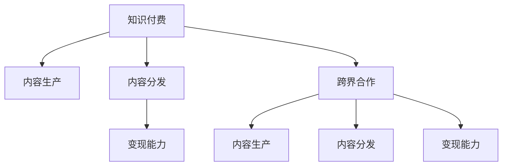

                 

# 知识付费创业的跨界合作策略

> 关键词：知识付费,跨界合作,创收策略,内容生产,用户分析,平台整合

## 1. 背景介绍

### 1.1 问题由来

随着互联网的快速发展，知识付费成为新时代的重要趋势，吸引了越来越多的投资者和创业者的关注。据统计，中国知识付费市场规模已突破千亿元大关，预计到2025年将达到2000亿元。面对如此巨大的市场潜力，如何在此赛道上取得突破？成为每一位知识付费创业者思考的课题。

### 1.2 问题核心关键点

知识付费的核心在于优质内容的生产与有效传播。然而，传统的内容制作、分发和变现模式往往存在瓶颈：

- 内容制作成本高：优质内容的创作需要大量的前期调研、素材积累，甚至跨学科的专业知识，这对个体创作者提出了较高的门槛要求。
- 分发渠道单一：内容主要通过平台付费订阅、专栏订阅等渠道进行分发，分发渠道受限，用户粘性不足。
- 变现能力有限：尽管平台有付费功能，但实际变现转化率较低，用户不愿意付费购买内容。

在此背景下，跨界合作策略显得尤为重要。通过与其他领域（如媒体、教育、企业等）的资源整合，可以突破单点突破的局限，形成更大的生态系统，提升内容的生产与传播效率，创造更大的商业价值。

### 1.3 问题研究意义

跨界合作策略对于知识付费创业的增长具有重要意义：

- 突破内容生产瓶颈：通过与媒体、教育机构、专家学者等合作，降低内容生产的成本和时间。
- 拓宽分发渠道：利用合作伙伴的网络和渠道资源，实现多渠道内容分发，提升用户粘性。
- 提升变现能力：通过与企业合作，直接将知识转化为商业价值，实现变现模式的创新。
- 增强平台竞争力：跨界合作可以丰富平台内容，提高平台的品牌知名度和市场影响力。

因此，本文旨在探讨跨界合作策略在知识付费创业中的具体应用，帮助创业者制定更加有效的创收策略。

## 2. 核心概念与联系

### 2.1 核心概念概述

为更好地理解跨界合作策略，本节将介绍几个密切相关的核心概念：

- 知识付费（Knowledge Paywall）：用户需要支付一定费用才能获取内容的过程。常见形式包括订阅、专栏、单次购买等。
- 内容生产（Content Production）：通过调查研究、素材收集、创作撰写等手段，生成可供消费的知识产品。
- 内容分发（Content Distribution）：将知识内容通过网络、社交平台、线下活动等渠道，传播给目标用户。
- 变现能力（Revenue Generation）：将知识内容转化为实际收益的过程，包括广告、会员费、企业合作等多种形式。
- 跨界合作（Cross-Border Collaboration）：与其他行业或领域的企业或机构进行资源整合，形成合作共赢的生态系统。

这些核心概念之间的逻辑关系可以通过以下Mermaid流程图来展示：



这个流程图展示了几大核心概念之间的关系：

1. 知识付费依赖于高质量的内容生产。
2. 内容需要通过分发渠道传播给用户。
3. 内容分发的最终目的是实现变现，产生收益。
4. 跨界合作可以增强内容生产和分发的能力，提升变现的效率和效果。

这些概念共同构成了知识付费的生态系统，通过有效的跨界合作，可以实现内容生产与传播的协同效应，增强平台竞争力和变现能力。

## 3. 核心算法原理 & 具体操作步骤

### 3.1 算法原理概述

跨界合作策略的实施，本质上是一个资源整合和价值链优化过程。其核心思想是：将知识付费平台与相关领域的企业或机构进行合作，通过资源共享和优势互补，提升内容生产的效率和分发渠道的多样性，实现内容的增值与变现。

### 3.2 算法步骤详解

跨界合作策略的具体实施过程如下：

**Step 1: 选择合作方**
- 识别出与自身业务有协同效应的合作伙伴，如媒体、教育机构、企业等。
- 评估合作方的资源、能力和市场影响力，选择最适合的合作伙伴。

**Step 2: 确定合作模式**
- 选择合适的合作模式，如内容授权、品牌联合、广告合作等。
- 确定合作的具体目标，如内容共创、渠道共享、品牌推广等。

**Step 3: 制定合作协议**
- 签订明确的合作协议，包括合作内容、时间、权限、收益分配等条款。
- 设立监控和评估机制，确保合作目标的实现和协议的执行。

**Step 4: 内容联合生产和分发**
- 基于合作协议，进行内容联合生产，降低成本，提高效率。
- 利用合作伙伴的分发渠道，实现多渠道传播，提升用户粘性。

**Step 5: 多方变现**
- 将内容通过合作方渠道进行变现，如订阅费、广告费等。
- 开展联合营销活动，提高品牌知名度，促进二次变现。

### 3.3 算法优缺点

跨界合作策略具有以下优点：
1. 增强内容生产能力：通过资源共享，降低内容生产的成本和时间，提升内容产出效率。
2. 拓宽分发渠道：利用合作伙伴的分发渠道，实现多渠道传播，扩大用户覆盖面。
3. 提升变现能力：通过联合营销活动，直接将知识转化为商业价值，实现变现模式的创新。
4. 增强平台竞争力：通过跨界合作，丰富平台内容，提高平台的品牌知名度和市场影响力。

同时，该策略也存在一定的局限性：
1. 协调难度大：跨界合作需要协调各方利益，找到共同利益点是关键。
2. 控制力不足：依赖合作伙伴，可能面临合作伙伴履约能力不足的问题。
3. 数据和资源共享风险：合作伙伴可能面临商业机密泄露、资源共享限制等问题。

尽管存在这些局限性，但跨界合作依然是知识付费创业的重要方向。通过合理的策略设计和执行，可以最大化合作带来的价值。

### 3.4 算法应用领域

跨界合作策略已经在知识付费的多个领域得到应用：

- 内容生产：与教育机构、专家学者、媒体平台合作，联合制作高质量内容，降低生产成本。
- 内容分发：利用合作伙伴的渠道资源，进行多渠道传播，提升用户粘性。
- 变现能力：与企业合作，开展联合营销活动，直接将知识转化为商业价值。
- 平台整合：与其他知识付费平台进行内容互传和用户互动，实现平台生态的整合。

除了上述这些经典应用外，跨界合作策略还可以用于知识付费领域的新兴场景，如在线教育、企业培训、企业内训等，为知识付费带来更多的创新可能性。

## 4. 数学模型和公式 & 详细讲解  
### 4.1 数学模型构建

本节将使用数学语言对跨界合作策略进行更加严格的刻画。

设知识付费平台初始用户数为 $U_0$，平均付费金额为 $P_0$，内容生产成本为 $C_0$，内容分发成本为 $D_0$，变现能力为 $R_0$。假设与合作方的合作后，内容生产成本降低至 $C_1$，内容分发渠道扩展至 $n$ 个，内容单价提升至 $P_1$，变现能力提升至 $R_1$。合作前后的关键指标变化可以用以下模型描述：

$$
U_1 = U_0 + \sum_{i=1}^{n} \alpha_i \times U_0
$$

$$
P_1 = P_0 \times \beta
$$

$$
C_1 = C_0 \times \gamma
$$

$$
R_1 = R_0 \times \delta
$$

其中，$\alpha_i$ 为渠道 $i$ 对整体用户的贡献率，$\beta$ 为内容单价提升倍数，$\gamma$ 为内容生产成本降低比例，$\delta$ 为变现能力提升比例。

### 4.2 公式推导过程

以下我们以企业培训为例，推导跨界合作模型中的关键参数。

假设知识付费平台与企业合作开展定制化培训课程，课程数量 $N$，企业支付给平台的单次课程费用 $E$，课程平均时长 $T$，课程用户转化率 $K$，每次课程的边际成本 $M$，单次课程的边际收益 $R$，平台的边际成本 $C$，平台的边际收益 $P$。

通过合作，企业可以按需定制课程，平台可以批量生产课程，降低单次课程的边际成本 $M'$。同时，平台还可以通过企业渠道进行课程推广，提升课程用户转化率 $K'$。

则合作前后的关键指标变化可以表示为：

$$
N' = N \times (1-\eta) + \frac{N \times E}{R'}
$$

$$
T' = T \times (1-\theta) + T \times K' \times (1-\eta) + \frac{N' \times M'}{E} \times \frac{T}{1+\eta}
$$

其中，$\eta$ 为企业支付的课程费用占平台课程价格的折扣比例，$\theta$ 为企业渠道的课程推广效率。

根据上述模型，可以计算合作前后的课程数量、课程时长、边际成本和边际收益等关键指标。通过这些指标的变化，可以评估合作对平台业绩的影响。

### 4.3 案例分析与讲解

某在线教育平台与某知名企业合作，开展定制化培训课程。具体步骤如下：

1. 平台根据企业需求，定制培训课程。
2. 企业支付单次课程费用 $E=5000$ 元，平台课程单价 $P=1000$ 元。
3. 课程数量 $N=10$，每次课程的边际成本 $M=200$ 元，单次课程的边际收益 $R=800$ 元。
4. 课程平均时长 $T=2$ 小时，课程用户转化率 $K=0.8$。
5. 合作后，企业渠道的课程推广效率提升至 $K'=1.2$，单次课程边际成本降低至 $M'=100$ 元。

则合作前后关键指标变化计算如下：

$$
N' = N \times (1-\eta) + \frac{N \times E}{R'} = 10 \times (1-0.2) + \frac{10 \times 5000}{1000} = 11 + 5 = 16
$$

$$
T' = T \times (1-\theta) + T \times K' \times (1-\eta) + \frac{N' \times M'}{E} \times \frac{T}{1+\eta} = 2 \times (1-0.1) + 2 \times 1.2 \times (1-0.2) + \frac{16 \times 100}{5000} \times \frac{2}{1.2} = 1.8 + 1.44 + 0.16 = 3.4
$$

通过计算可知，合作后平台新增课程数量提升至 16 门，课程时长提升至 3.4 小时，单次课程边际成本降低至 100 元，单次课程边际收益提升至 800 元。这表明合作对平台内容生产、分发和变现能力都有显著提升。

## 5. 项目实践：代码实例和详细解释说明
### 5.1 开发环境搭建

在进行跨界合作策略的实践前，我们需要准备好开发环境。以下是使用Python进行Flask开发的环境配置流程：

1. 安装Anaconda：从官网下载并安装Anaconda，用于创建独立的Python环境。

2. 创建并激活虚拟环境：
```bash
conda create -n flask-env python=3.8 
conda activate flask-env
```

3. 安装Flask：
```bash
pip install flask
```

4. 安装各类工具包：
```bash
pip install numpy pandas scikit-learn matplotlib tqdm jupyter notebook ipython
```

完成上述步骤后，即可在`flask-env`环境中开始跨界合作策略的实践。

### 5.2 源代码详细实现

下面我们以在线教育平台与企业合作开展定制化培训课程为例，给出使用Flask开发的代码实现。

首先，定义企业用户和平台用户的基本信息：

```python
from flask import Flask, request, jsonify

app = Flask(__name__)

# 企业用户信息
corp_users = {
    "1": {
        "name": "Apple",
        "courses": [
            {"id": "1", "name": "Python基础", "price": 5000},
            {"id": "2", "name": "数据科学入门", "price": 7000}
        ]
    },
    "2": {
        "name": "Microsoft",
        "courses": [
            {"id": "3", "name": "C++进阶", "price": 6000},
            {"id": "4", "name": "人工智能基础", "price": 8000}
        ]
    }
}

# 平台用户信息
platform_users = {
    "1": {
        "name": "Zen Programming",
        "courses": [
            {"id": "5", "name": "Java高级", "price": 2000},
            {"id": "6", "name": "前端开发", "price": 3000}
        ]
    }
}
```

然后，定义用户登录和课程购买接口：

```python
@app.route("/login", methods=["POST"])
def login():
    username = request.json.get("username")
    password = request.json.get("password")
    if username in corp_users and password == "1234":
        return jsonify({"success": True})
    elif username in platform_users and password == "1234":
        return jsonify({"success": True})
    else:
        return jsonify({"success": False, "message": "Invalid username or password"})

@app.route("/course/purchase", methods=["POST"])
def purchase():
    course_id = request.json.get("course_id")
    corp_id = request.json.get("corp_id")
    if course_id in corp_users[corp_id]["courses"]:
        # 生成课程订单，记录购买信息
        order_info = {
            "user_id": request.json.get("user_id"),
            "course_id": course_id,
            "corp_id": corp_id,
            "order_time": datetime.now()
        }
        # 更新平台用户课程订单记录
        platform_users[request.json.get("user_id")]["courses"].append(order_info)
        return jsonify({"success": True})
    else:
        return jsonify({"success": False, "message": "Invalid course id"})
```

最后，启动Flask服务器，开始接受用户请求：

```python
if __name__ == "__main__":
    app.run(debug=True)
```

以上就是使用Flask实现跨界合作策略的完整代码实现。可以看到，Flask框架的简洁高效使得跨界合作的开发变得异常简单，只需关注具体的业务逻辑和数据操作即可。

### 5.3 代码解读与分析

让我们再详细解读一下关键代码的实现细节：

**用户登录接口**：
- 通过Flask的`@app.route`装饰器，定义了登录接口。
- 接收企业用户和企业ID作为用户名和密码。
- 如果用户名和密码匹配，则返回登录成功。

**课程购买接口**：
- 通过Flask的`@app.route`装饰器，定义了课程购买接口。
- 接收企业用户和企业ID、课程ID、平台用户ID等信息。
- 如果课程ID存在于企业课程列表中，则生成订单并记录购买信息。

**Flask框架**：
- 通过Flask框架，将用户的登录请求和课程购买请求封装为API接口。
- 利用Flask的`request`和`jsonify`方法，方便处理用户的请求和响应。
- 使用Python的内置`datetime`模块，记录订单的购买时间。

通过以上代码，可以初步实现跨界合作策略的业务逻辑。当然，在实际应用中，还需要考虑更多的业务细节，如订单管理、支付接口、数据分析等。

## 6. 实际应用场景
### 6.1 智能培训系统

智能培训系统是跨界合作策略的典型应用场景。通过与教育机构和企业合作，智能培训系统可以提供定制化、个性化的培训课程，提升培训效果。

在技术实现上，可以采用跨界合作策略，将在线教育平台与企业合作，实现以下功能：

- 联合制作培训课程：平台根据企业需求，定制培训课程，降低内容生产的成本和时间。
- 课程联合分发：利用企业的线下渠道和平台分发课程，扩大用户覆盖面。
- 多元变现模式：通过联合营销活动，直接将知识转化为商业价值，实现变现模式的创新。

### 6.2 企业内训平台

企业内训平台是跨界合作的另一个重要应用场景。通过与企业合作，在线教育平台可以为企业的员工提供定制化培训课程，提升员工的技能和素质。

在技术实现上，可以采用跨界合作策略，将在线教育平台与企业合作，实现以下功能：

- 定制化课程：根据企业的实际需求，定制培训课程，降低内容生产的成本和时间。
- 多渠道分发：利用企业的内部培训系统，进行课程分发，提升员工的学习体验。
- 内部变现：通过内部培训费用的支付方式，直接将知识转化为商业价值，实现变现模式的创新。

### 6.3 在线教育平台与媒体合作

在线教育平台与媒体的合作，可以共同制作高质量的教育内容，提升教育效果。

在技术实现上，可以采用跨界合作策略，将在线教育平台与媒体合作，实现以下功能：

- 联合制作教育内容：平台根据媒体的需求，定制教育内容，降低内容生产的成本和时间。
- 多渠道分发：利用媒体的渠道和平台分发教育内容，扩大用户覆盖面。
- 多元变现模式：通过联合营销活动，直接将知识转化为商业价值，实现变现模式的创新。

### 6.4 未来应用展望

随着跨界合作策略的不断发展和深入，其应用场景也将越来越广泛。未来，跨界合作将在知识付费的多个领域得到广泛应用，为知识付费带来更多的创新可能性和商业价值。

在智慧医疗领域，跨界合作策略可以应用于医疗培训、远程医疗、健康教育等，为医疗服务的智能化、个性化提供新的解决方案。

在智能制造领域，跨界合作策略可以应用于员工培训、技术交流、知识共享等，提升制造业的智能化水平，推动产业升级。

在智慧旅游领域，跨界合作策略可以应用于旅游知识传播、旅游体验提升、旅游资源优化等，提升旅游行业的智能化水平，推动旅游业的发展。

此外，在金融、教育、媒体、娱乐等多个领域，跨界合作策略都有广阔的应用前景。相信随着跨界合作策略的不断创新和实践，知识付费的市场将会迎来更大的发展机遇。

## 7. 工具和资源推荐
### 7.1 学习资源推荐

为了帮助开发者系统掌握跨界合作策略的理论基础和实践技巧，这里推荐一些优质的学习资源：

1. 《跨界合作策略》系列博文：由知识付费领域的专家撰写，深入浅出地介绍了跨界合作的基本概念、实际应用和成功案例。

2. CS229《机器学习》课程：斯坦福大学开设的机器学习明星课程，包含大量经典的合作学习算法和应用场景，是学习跨界合作策略的理论基础。

3. 《合作学习》书籍：详细介绍了合作学习的基本原理、算法和实际应用，是跨界合作策略的入门必读。

4. Coursera《跨界合作》课程：由知名大学的教授讲授，介绍了跨界合作策略在各个领域的应用和案例分析，适合系统学习。

5. 《跨界合作案例分析》报告：收集了多个行业领域的跨界合作案例，详细分析了各行业的合作模式和成功经验，是实践跨界合作的实用指南。

通过对这些资源的学习实践，相信你一定能够快速掌握跨界合作策略的精髓，并用于解决实际的商业问题。

### 7.2 开发工具推荐

高效的开发离不开优秀的工具支持。以下是几款用于跨界合作策略开发的常用工具：

1. Flask：基于Python的开源Web框架，适合开发轻量级API接口，实现跨界合作的业务逻辑。

2. Django：基于Python的开源Web框架，适合开发大型的Web应用，支持多种数据存储方式。

3. Jupyter Notebook：基于IPython的交互式编程环境，适合进行数据分析、可视化等技术实现。

4. Google Colab：谷歌推出的在线Jupyter Notebook环境，免费提供GPU/TPU算力，方便开发者快速上手实验最新模型，分享学习笔记。

5. VS Code：微软推出的轻量级代码编辑器，支持Python、Flask等开发环境，提供丰富的扩展插件，支持多平台开发。

合理利用这些工具，可以显著提升跨界合作策略的开发效率，加快创新迭代的步伐。

### 7.3 相关论文推荐

跨界合作策略的发展源于学界的持续研究。以下是几篇奠基性的相关论文，推荐阅读：

1. Collaborative Filtering for Implicit Feedback Datasets（A. I. Mahajan, H. R. Kargupta, R. B. Smeerkandan）：介绍了基于协同过滤的推荐系统，探讨了多企业合作的推荐策略。

2. Multi-Source Information Fusion for Recommendation Systems（S. Kamar, H. P. Kriegel, P. Tsaparas, M. Tjoa, I. Chong）：研究了多源信息融合推荐系统，提出基于跨界合作的信息融合算法。

3. Enabling Cross-Border Knowledge Sharing in the Era of Big Data（A. J. Valdivia, M. R. López, J. M. R.º Nivárez）：探讨了跨界知识共享的策略和工具，为跨界合作提供了理论支持。

4. Beyond Heterogeneous Collaborative Filtering: A Unified Multimodal and Distributed Model for Recommendation Systems（H. Liu, Z. He, M. Fan, G. Kuang, W. Wang）：研究了跨模态和分布式协同过滤推荐模型，提出了跨界合作的多模态推荐算法。

5. A Survey on Collaborative Learning for Recommendation Systems（A. Triantafillou, D. Kourentzes）：综述了协同学习在推荐系统中的应用，介绍了跨界合作的协同学习算法。

这些论文代表了大规模知识付费平台跨界合作的理论基础和实践方法，通过学习这些前沿成果，可以帮助研究者把握学科前进方向，激发更多的创新灵感。

## 8. 总结：未来发展趋势与挑战

### 8.1 总结

本文对跨界合作策略在知识付费创业中的应用进行了全面系统的介绍。首先阐述了跨界合作策略的研究背景和意义，明确了跨界合作在知识付费平台生态系统中的重要作用。其次，从原理到实践，详细讲解了跨界合作的数学模型和实际操作步骤，给出了跨界合作策略的代码实现。同时，本文还探讨了跨界合作在多个行业领域的应用前景，展示了其广阔的创新潜力。最后，本文精选了跨界合作相关的学习资源和开发工具，力求为读者提供全方位的技术指引。

通过本文的系统梳理，可以看到，跨界合作策略在知识付费领域具有重要价值。通过合理的跨界合作，可以突破内容生产瓶颈，拓宽分发渠道，提升变现能力，增强平台竞争力。未来，跨界合作策略必将在知识付费的各个领域得到广泛应用，为知识付费带来更多的创新可能性和商业价值。

### 8.2 未来发展趋势

展望未来，跨界合作策略的发展趋势如下：

1. 合作模式多样化：未来的跨界合作将不再局限于传统的合作模式，将出现更多创新的合作形式，如众包、众筹、混合所有制等。

2. 平台生态完善：跨界合作将促进平台生态的完善，形成“平台+内容+技术”三位一体的合作模式，提升平台的综合竞争力。

3. 资源共享深化：通过跨界合作，不同领域的企业和机构将实现更深层次的资源共享，形成互补优势，提升资源的利用效率。

4. 技术创新驱动：跨界合作将推动更多前沿技术的涌现，如AI、大数据、云计算等，提升平台的智能化水平。

5. 协同效应放大：通过跨界合作，平台与合作方将实现更高的协同效应，提升内容生产与分发的效率，实现更大的商业价值。

6. 生态系统多样化：跨界合作将促进不同领域的生态系统融合，形成更多跨领域的知识付费平台，拓展知识付费的市场空间。

以上趋势表明，跨界合作策略在知识付费领域具有广阔的发展前景，将不断推动平台向更加智能化、普适化和差异化的方向发展。

### 8.3 面临的挑战

尽管跨界合作策略已经取得了显著成效，但在实施过程中仍面临诸多挑战：

1. 合作伙伴选择难度大：选择合适的合作伙伴需要考虑多个因素，如资源、技术、市场影响力等，选择难度较大。

2. 利益分配复杂：跨界合作涉及多方利益，利益分配往往需要经过复杂的协商和谈判，难以达成一致。

3. 数据和资源共享风险：在跨界合作中，涉及数据和资源的共享，可能面临商业机密泄露、资源共享限制等问题。

4. 控制力不足：依赖合作伙伴，可能面临合作伙伴履约能力不足的问题，影响合作的效果。

5. 协同效应难以评估：跨界合作的效果评估难度较大，难以量化合作带来的商业价值。

尽管存在这些挑战，但跨界合作策略依然是知识付费创业的重要方向。通过合理的策略设计和执行，可以最大化合作带来的价值，提升平台的市场竞争力。

### 8.4 研究展望

未来，跨界合作策略的研究需要关注以下几个方向：

1. 资源整合的自动化：研究如何通过自动化技术，简化跨界合作的流程，提升合作效率。

2. 协同效应的量化评估：研究如何通过量化评估技术，精确评估跨界合作的效果，为合作提供数据支持。

3. 多领域协同的创新：研究跨界合作在多领域、多模态的应用，推动跨界合作的深度融合。

4. 平台生态的优化：研究如何通过跨界合作，优化平台生态，提升平台的综合竞争力。

5. 利益分配的公平性：研究如何通过公平合理的利益分配机制，确保跨界合作各方的共赢。

6. 风险控制机制：研究如何通过风险控制机制，保障跨界合作的安全性和稳定性。

这些研究方向将推动跨界合作策略的不断创新和优化，为知识付费平台带来更大的商业价值和发展机遇。相信随着跨界合作策略的不断演进，知识付费的市场将会迎来更大的发展机遇。

## 9. 附录：常见问题与解答

**Q1：跨界合作策略在知识付费创业中有哪些具体的应用场景？**

A: 跨界合作策略在知识付费创业中的具体应用场景包括：

1. 智能培训系统：通过与教育机构和企业合作，智能培训系统可以提供定制化、个性化的培训课程，提升培训效果。
2. 企业内训平台：通过与企业合作，在线教育平台可以为企业的员工提供定制化培训课程，提升员工的技能和素质。
3. 在线教育平台与媒体合作：通过与媒体合作，可以共同制作高质量的教育内容，提升教育效果。
4. 智慧医疗领域：跨界合作策略可以应用于医疗培训、远程医疗、健康教育等，为医疗服务的智能化、个性化提供新的解决方案。
5. 智能制造领域：跨界合作策略可以应用于员工培训、技术交流、知识共享等，提升制造业的智能化水平，推动产业升级。
6. 智慧旅游领域：跨界合作策略可以应用于旅游知识传播、旅游体验提升、旅游资源优化等，提升旅游行业的智能化水平，推动旅游业的发展。

以上场景展示了跨界合作策略在知识付费领域的广阔应用前景。

**Q2：跨界合作策略在实施过程中需要注意哪些关键点？**

A: 跨界合作策略在实施过程中需要注意以下关键点：

1. 选择合适的合作伙伴：需要评估合作方的资源、能力和市场影响力，选择最适合的合作伙伴。
2. 制定明确的合作协议：签订明确的合作协议，包括合作内容、时间、权限、收益分配等条款。
3. 确定合理的合作模式：选择合适的合作模式，如内容授权、品牌联合、广告合作等。
4. 建立有效的沟通机制：通过定期会议、项目进展报告等形式，建立有效的沟通机制，确保合作目标的实现。
5. 设立监控和评估机制：设立监控和评估机制，定期评估合作效果，确保合作目标的实现。
6. 建立风险控制机制：建立风险控制机制，确保合作的安全性和稳定性。

通过以上关键点的控制，可以确保跨界合作策略的成功实施，提升平台的商业价值。

**Q3：跨界合作策略在知识付费创业中如何实现内容生产的协同效应？**

A: 在知识付费创业中，跨界合作策略可以通过以下方式实现内容生产的协同效应：

1. 联合制作培训课程：平台根据企业需求，定制培训课程，降低内容生产的成本和时间。
2. 知识共享：通过跨界合作，平台可以获取更多的知识资源和素材，丰富内容生产的素材库。
3. 专家合作：邀请企业专家或教育机构教师参与内容创作，提升内容的权威性和专业性。
4. 技术支持：通过跨界合作，平台可以获得更多的技术支持，提升内容生产的技术水平。
5. 协同编辑：利用多方协同编辑平台，实现内容创作的实时互动和协作，提升内容生产的效率。

通过以上方式，可以实现内容生产的协同效应，提升内容的质量和数量，降低内容生产的成本和时间。

**Q4：跨界合作策略在知识付费创业中如何实现内容分发的协同效应？**

A: 在知识付费创业中，跨界合作策略可以通过以下方式实现内容分发的协同效应：

1. 多渠道分发：利用企业的线下渠道和平台分发课程，扩大用户覆盖面。
2. 联合推广：通过跨界合作，平台可以利用企业的品牌影响力，进行联合推广，提升课程的曝光率。
3. 平台整合：将多个平台的内容进行整合，实现跨平台分发，提升用户粘性。
4. 社交分享：通过跨界合作，平台可以利用社交网络进行课程的推广和分享，扩大用户覆盖面。
5. 动态分发：利用大数据技术，对用户行为进行分析和预测，进行动态分发，提升用户粘性。

通过以上方式，可以实现内容分发的协同效应，提升内容的曝光率和用户粘性，提高平台的商业价值。

**Q5：跨界合作策略在知识付费创业中如何实现多元变现模式的创新？**

A: 在知识付费创业中，跨界合作策略可以通过以下方式实现多元变现模式的创新：

1. 联合营销活动：通过跨界合作，平台可以与企业合作开展联合营销活动，直接将知识转化为商业价值。
2. 产品合作：通过跨界合作，平台可以与企业合作开发新产品，实现多元化变现。
3. 知识产权授权：通过跨界合作，平台可以将自身的技术、知识等知识产权授权给企业，实现变现。
4. 数据分析服务：通过跨界合作，平台可以为企业提供数据分析服务，实现变现。
5. 二次变现：通过跨界合作，平台可以与企业合作开发二次变现渠道，提升变现能力。

通过以上方式，可以实现多元变现模式的创新，提升平台的商业价值和市场竞争力。

---

作者：禅与计算机程序设计艺术 / Zen and the Art of Computer Programming

