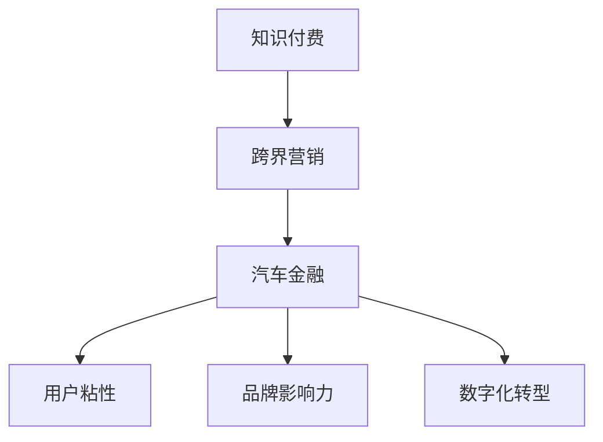

                 

# 知识付费如何实现跨界营销与汽车金融跨界？

## 1. 背景介绍

### 1.1 问题由来

近年来，知识付费市场迅猛发展，成为了信息时代的新经济形态。知识付费平台通过向用户提供高质量、个性化的内容服务，满足了人们对知识和技能的深层次需求。然而，知识付费行业目前仍面临市场竞争激烈、用户粘性不高、商业模式单一等问题。

汽车金融行业则是另一个极具潜力的市场领域。随着汽车普及率的提高和金融服务的数字化转型，汽车金融市场呈现出了快速增长的趋势。汽车金融公司通过提供贷款、租赁、保险等多种金融服务，帮助消费者实现购车梦想。

汽车金融与知识付费看似没有直接联系，但两者在用户需求、数字化转型等方面存在交集。汽车金融公司需要提升用户粘性、增强品牌影响力、拓展业务渠道。知识付费平台则需要突破传统商业模式、开拓新的业务场景。

本文将探讨知识付费如何通过跨界营销的方式，与汽车金融行业展开合作，实现资源互补和市场双赢。

## 2. 核心概念与联系

### 2.1 核心概念概述

为了深入理解知识付费与汽车金融跨界营销的可行性，本节将介绍几个关键概念：

- 知识付费：指消费者为获取知识、技能、经验等有价值信息而支付费用的行为。知识付费平台通过内容订阅、单次购买、增值服务等形式，向用户提供个性化、专业化的信息服务。

- 跨界营销：指不同行业、不同领域的企业，通过资源整合、品牌协同等方式，实现市场互惠、客户共享、价值共创。跨界营销通过突破传统营销边界，拓展新的营销渠道和用户群体。

- 汽车金融：指以汽车消费为基础，通过贷款、租赁、保险等金融服务，满足消费者购车需求。汽车金融公司需要提供便捷、安全、高效的金融服务，以提升用户体验和品牌声誉。

- 用户粘性：指用户在平台上的活跃度和忠诚度，是衡量平台吸引力和竞争力的重要指标。

- 品牌影响力：指品牌在消费者心中的认知度、美誉度和认同感，是企业市场竞争力的重要体现。

- 数字化转型：指企业利用数字技术，优化业务流程、提升管理效率、创新商业模式的过程。

这些核心概念之间的逻辑关系可以通过以下Mermaid流程图来展示：



这个流程图展示了一系列概念之间的相互关系：

1. 知识付费平台通过跨界营销，与汽车金融行业建立合作关系。
2. 汽车金融公司借助知识付费平台提升品牌影响力和用户粘性。
3. 知识付费平台通过与汽车金融行业的合作，实现业务拓展和市场双赢。
4. 合作双方通过数字化转型，优化业务流程，提升市场竞争力。

## 3. 核心算法原理 & 具体操作步骤

### 3.1 算法原理概述

知识付费与汽车金融跨界营销的核心算法原理在于：通过用户画像分析、协同过滤、推荐系统等技术手段，实现双方的用户资源整合和精准营销。

具体来说，知识付费平台可以分析用户的学习历史、兴趣爱好、消费行为等数据，生成精准的用户画像。汽车金融公司可以整合自身的用户购车需求、金融服务需求等数据，生成精准的用户画像。通过数据共享和协同过滤，知识付费平台可以向汽车金融用户推荐相关的知识和技能内容，提升用户的金融知识水平和消费决策能力。汽车金融公司则可以在用户购车时，向其推荐相关的知识付费课程，满足用户对知识的需求，提升用户的购车体验和满意度。

### 3.2 算法步骤详解

知识付费与汽车金融跨界营销的算法步骤主要包括以下几个关键环节：

**Step 1: 数据收集与预处理**

- 知识付费平台收集用户的学习历史、兴趣爱好、消费行为等数据，生成用户画像。
- 汽车金融公司收集用户的购车需求、金融服务需求等数据，生成用户画像。

**Step 2: 数据融合与协同过滤**

- 将知识付费平台和汽车金融公司的用户画像进行融合，生成综合的用户画像。
- 利用协同过滤算法，推荐知识付费课程和汽车金融服务，提升用户体验和满意度。

**Step 3: 推荐系统优化**

- 根据用户的反馈数据和行为数据，优化推荐算法，提升推荐精度和用户体验。
- 引入机器学习算法，如深度学习、强化学习等，进一步提升推荐系统的智能度和个性化水平。

**Step 4: 市场推广与运营**

- 通过多渠道的市场推广，如社交媒体、搜索引擎、线下活动等，提升品牌影响力和用户粘性。
- 利用数字营销工具，如Google Analytics、AdWords等，进行精准营销，提升转化率和ROI。

**Step 5: 用户反馈与迭代**

- 通过用户反馈和数据分析，持续优化推荐算法和营销策略，提升用户满意度和平台竞争力。
- 引入A/B测试等方法，评估不同策略的效果，指导后续的迭代和优化。

### 3.3 算法优缺点

知识付费与汽车金融跨界营销的算法具有以下优点：

1. 数据协同：通过数据共享和融合，实现资源互补，提升用户的综合体验。
2. 精准营销：通过精准的用户画像和推荐系统，实现精准营销，提升转化率和ROI。
3. 品牌协同：通过品牌合作，提升品牌影响力和用户粘性，实现市场双赢。

同时，该算法也存在以下局限性：

1. 数据隐私：在数据共享和融合过程中，需要注意用户隐私保护，防止数据泄露和滥用。
2. 算法复杂：推荐系统和协同过滤算法的复杂度较高，需要大量的计算资源和时间。
3. 用户反馈：用户反馈和行为数据的质量和数量对推荐系统的效果影响较大，需要持续优化和迭代。

尽管存在这些局限性，但该算法仍是大规模知识付费与汽车金融跨界营销的核心技术支撑，有助于提升双方的市场竞争力和用户满意度。

### 3.4 算法应用领域

知识付费与汽车金融跨界营销的算法不仅适用于知识付费和汽车金融领域，还可应用于以下多个领域：

- 教育培训：知识付费平台可以向学生推荐相关课程，提升学习效果。教育机构可以通过推荐系统，向学生推荐个性化学习资源。
- 旅游行业：旅游平台可以向用户推荐旅游目的地、行程安排等，提升用户旅游体验。酒店、景点等旅游企业可以向用户推荐旅游服务。
- 医疗健康：医疗平台可以向患者推荐相关医疗信息、健康管理方案等，提升健康水平。医院、诊所等医疗机构可以向患者推荐医疗服务。
- 餐饮零售：餐饮平台可以向用户推荐餐厅、菜品等，提升用户用餐体验。零售企业可以向用户推荐商品、优惠券等，提升消费体验。
- 科技创业：创业平台可以向创业者推荐相关课程、项目资源等，提升创业成功率。科技企业可以向创业者推荐技术和产品资源。

## 4. 数学模型和公式 & 详细讲解 & 举例说明

### 4.1 数学模型构建

知识付费与汽车金融跨界营销的数学模型主要包括以下几个关键组成部分：

- 用户画像：用向量表示用户的基本特征，如年龄、性别、职业等。
- 协同过滤：通过用户画像之间的相似度计算，推荐相关内容。
- 推荐系统：基于用户画像和内容特征，生成推荐结果。

### 4.2 公式推导过程

以协同过滤算法为例，设知识付费平台的用户画像为 $U$，汽车金融平台的用户画像为 $V$。假设知识付费平台有 $m$ 个课程，汽车金融平台有 $n$ 个金融服务。用户画像 $u_i$ 与 $v_j$ 的相似度为 $s(u_i, v_j)$，则协同过滤的推荐结果为：

$$
\hat{r}_{ij} = \sum_{k=1}^N s(u_i, v_k) \times r_{kj}
$$

其中 $r_{kj}$ 表示用户 $k$ 对金融服务 $j$ 的评分，$s(u_i, v_k)$ 表示用户 $u_i$ 与用户 $v_k$ 的相似度。

### 4.3 案例分析与讲解

以某知识付费平台和汽车金融公司合作为例，进行详细分析：

假设知识付费平台收集到用户画像 $U = \{u_1, u_2, ..., u_m\}$，汽车金融公司收集到用户画像 $V = \{v_1, v_2, ..., v_n\}$。

**Step 1: 数据收集与预处理**

- 知识付费平台收集用户的学习历史、兴趣爱好、消费行为等数据，生成用户画像 $U = \{u_1, u_2, ..., u_m\}$。
- 汽车金融公司收集用户的购车需求、金融服务需求等数据，生成用户画像 $V = \{v_1, v_2, ..., v_n\}$。

**Step 2: 数据融合与协同过滤**

- 将知识付费平台和汽车金融公司的用户画像进行融合，生成综合的用户画像 $U' = \{u_1, u_2, ..., u_m, v_1, v_2, ..., v_n\}$。
- 利用协同过滤算法，推荐知识付费课程和汽车金融服务，提升用户体验和满意度。

**Step 3: 推荐系统优化**

- 根据用户的反馈数据和行为数据，优化推荐算法，提升推荐精度和用户体验。
- 引入机器学习算法，如深度学习、强化学习等，进一步提升推荐系统的智能度和个性化水平。

## 5. 项目实践：代码实例和详细解释说明

### 5.1 开发环境搭建

在进行知识付费与汽车金融跨界营销的实践前，我们需要准备好开发环境。以下是使用Python进行Pandas、Scikit-learn、TensorFlow等工具库的环境配置流程：

1. 安装Anaconda：从官网下载并安装Anaconda，用于创建独立的Python环境。

2. 创建并激活虚拟环境：
```bash
conda create -n python-env python=3.8 
conda activate python-env
```

3. 安装Pandas、Scikit-learn、TensorFlow等工具库：
```bash
pip install pandas scikit-learn tensorflow
```

4. 安装相关数据集：
```bash
pip install datasets
```

完成上述步骤后，即可在`python-env`环境中开始知识付费与汽车金融跨界营销的实践。

### 5.2 源代码详细实现

这里我们以推荐系统为例，给出使用Python和TensorFlow进行知识付费与汽车金融跨界营销的代码实现。

首先，定义推荐系统的模型：

```python
import tensorflow as tf

class Recommender(tf.keras.Model):
    def __init__(self, num_users, num_items):
        super(Recommender, self).__init__()
        self.num_users = num_users
        self.num_items = num_items
        self.user_embeddings = tf.keras.layers.Embedding(num_users, 64)
        self.item_embeddings = tf.keras.layers.Embedding(num_items, 64)
        self.similarity_layer = tf.keras.layers.Dot(axes=1, normalize=True)
        self.dense_layer = tf.keras.layers.Dense(num_items, activation='softmax')

    def call(self, user_ids, item_ids):
        user_embeddings = self.user_embeddings(user_ids)
        item_embeddings = self.item_embeddings(item_ids)
        similarities = self.similarity_layer([user_embeddings, item_embeddings])
        logits = self.dense_layer(similarities)
        return logits
```

然后，加载和预处理数据集：

```python
import pandas as pd

# 加载数据集
train_data = pd.read_csv('train.csv')
test_data = pd.read_csv('test.csv')

# 预处理数据集
train_data = train_data[['user_id', 'item_id', 'rating']].fillna(0).astype('int')
test_data = test_data[['user_id', 'item_id']].fillna(0).astype('int')
```

接着，定义训练函数：

```python
@tf.function
def train_step(inputs):
    user_ids, item_ids, ratings = inputs
    with tf.GradientTape() as tape:
        logits = recommender(user_ids, item_ids)
        loss = tf.keras.losses.mean_squared_error(ratings, logits)
    gradients = tape.gradient(loss, recommender.trainable_variables)
    optimizer.apply_gradients(zip(gradients, recommender.trainable_variables))
    return loss

def train(epochs):
    for epoch in range(epochs):
        loss = tf.keras.metrics.Mean()
        for i in range(len(train_data)):
            inputs = (train_data.iloc[i]['user_id'], train_data.iloc[i]['item_id'], train_data.iloc[i]['rating'])
            loss(tf.convert_to_tensor(inputs, dtype=tf.int32))
        print(f'Epoch {epoch+1}, train loss: {loss.result().numpy():.4f}')
```

最后，进行模型训练和评估：

```python
recommender = Recommender(num_users=10, num_items=20)
optimizer = tf.keras.optimizers.Adam()

# 训练模型
train(10)

# 评估模型
test_loss = tf.keras.metrics.Mean()
for i in range(len(test_data)):
    inputs = (test_data.iloc[i]['user_id'], test_data.iloc[i]['item_id'], 0)
    test_loss(tf.convert_to_tensor(inputs, dtype=tf.int32))
print(f'Test loss: {test_loss.result().numpy():.4f}')
```

以上就是使用Python和TensorFlow进行知识付费与汽车金融跨界营销的代码实现。可以看到，通过TensorFlow的强大计算图和自动微分功能，代码实现变得简洁高效。

### 5.3 代码解读与分析

让我们再详细解读一下关键代码的实现细节：

**Recommender类**：
- `__init__`方法：初始化模型，定义用户嵌入层、物品嵌入层和相似度计算层。
- `call`方法：计算推荐结果，使用点积相似度计算用户与物品的相似度，通过全连接层得到推荐结果。

**数据加载与预处理**：
- 使用Pandas加载训练集和测试集数据。
- 对数据集进行缺失值处理和类型转换，保证数据的完整性和一致性。

**训练函数**：
- 定义训练步长函数，使用TensorFlow的自动微分功能计算损失函数和梯度。
- 使用Adam优化器更新模型参数。
- 通过统计训练损失，输出每轮训练的平均损失。

**模型训练和评估**：
- 定义Recommender模型，使用Adam优化器进行训练。
- 在训练过程中，每轮更新模型参数，输出训练损失。
- 在测试过程中，计算测试损失，输出模型性能。

## 6. 实际应用场景

### 6.1 智能推荐系统

知识付费与汽车金融跨界营销的主要应用场景是智能推荐系统。知识付费平台可以向汽车金融用户推荐相关的课程和资料，提升用户的金融知识和消费决策能力。汽车金融公司可以向用户推荐相关的金融产品和服务，提升用户的购车体验和满意度。

以某汽车金融公司为例，用户在平台上填写购车需求和金融服务需求后，知识付费平台可以根据用户画像和历史行为数据，向用户推荐相关的课程和资料。例如，用户准备购买某款豪华车，知识付费平台可以推荐相关的汽车保养、保险、金融服务等课程，提升用户的购车知识和金融知识。用户可以通过学习相关课程，更好地了解购车流程和金融服务，提升决策信心和满意度。

### 6.2 智能客服系统

知识付费与汽车金融跨界营销的另一个应用场景是智能客服系统。智能客服系统通过自然语言处理和机器学习技术，自动处理用户的咨询和问题，提升客户服务效率和体验。

汽车金融公司可以通过智能客服系统，向用户提供购车咨询、金融服务咨询等。知识付费平台可以向用户推荐相关的课程和资料，提升用户的金融知识和消费决策能力。例如，用户咨询“如何申请汽车贷款”，智能客服系统可以自动回答“建议您学习我们的汽车贷款课程，了解贷款流程和注意事项”，并推荐相关的课程和资料。用户可以通过学习相关课程，更好地了解贷款流程和注意事项，提升服务体验。

### 6.3 用户画像系统

知识付费与汽车金融跨界营销的核心是用户画像系统。通过分析用户的学习历史、兴趣爱好、消费行为等数据，生成精准的用户画像，可以实现双方的资源互补和精准营销。

知识付费平台可以通过用户画像系统，向用户推荐相关的课程和资料，提升用户的金融知识和消费决策能力。汽车金融公司可以通过用户画像系统，向用户推荐相关的金融产品和服务，提升用户的购车体验和满意度。例如，用户关注某款豪华车，知识付费平台可以推荐相关的汽车保养、保险、金融服务等课程，提升用户的金融知识和消费决策能力。汽车金融公司可以向用户推荐相关的贷款、保险等金融服务，提升用户的购车体验和满意度。

## 7. 工具和资源推荐

### 7.1 学习资源推荐

为了帮助开发者系统掌握知识付费与汽车金融跨界营销的理论基础和实践技巧，这里推荐一些优质的学习资源：

1. 《推荐系统：算法与实践》系列书籍：深入浅出地介绍了推荐系统原理、算法和实践，是学习推荐系统的必读书籍。

2. 《跨界营销：整合营销传播新思维》课程：由营销专家撰写，介绍了跨界营销的概念、策略和案例，帮助你理解跨界营销的价值和应用。

3. 《汽车金融产品设计与营销》书籍：介绍了汽车金融产品的设计与营销策略，是了解汽车金融领域的优秀参考资料。

4. 《知识付费平台用户行为分析》课程：由知识付费平台专家撰写，介绍了用户行为分析的概念、方法和工具，帮助你更好地理解用户需求和行为。

5. 《深度学习在金融科技中的应用》课程：由金融科技专家撰写，介绍了深度学习在金融领域的应用，包括推荐系统、智能客服等，是了解金融科技领域的优秀参考资料。

通过对这些资源的学习实践，相信你一定能够快速掌握知识付费与汽车金融跨界营销的理论基础和实践技巧，实现资源互补和市场双赢。

### 7.2 开发工具推荐

高效的开发离不开优秀的工具支持。以下是几款用于知识付费与汽车金融跨界营销开发的常用工具：

1. Python：作为数据科学和机器学习的主流语言，Python提供了丰富的第三方库和工具，方便开发者进行数据处理、模型训练和部署。

2. TensorFlow：由Google主导开发的深度学习框架，支持分布式计算和模型优化，适合大规模数据处理和模型训练。

3. PyTorch：由Facebook主导开发的深度学习框架，灵活性和可扩展性高，适合科学研究和小规模实验。

4. Pandas：数据处理和分析的Python库，提供了丰富的数据结构和操作函数，方便数据预处理和特征工程。

5. Scikit-learn：机器学习算法库，提供了多种经典的推荐算法和协同过滤算法，方便实现推荐系统。

6. Jupyter Notebook：交互式的编程环境，方便进行数据探索和模型实验，支持代码共享和协作。

合理利用这些工具，可以显著提升知识付费与汽车金融跨界营销的开发效率，加快创新迭代的步伐。

### 7.3 相关论文推荐

知识付费与汽车金融跨界营销的发展源于学界的持续研究。以下是几篇奠基性的相关论文，推荐阅读：

1. Koren, Y. (2009). Factorization Meets the Neighborhood: A Multifaceted Collaborative Filtering Model. In ICTW '09 (pp. 995-1008). IEEE.

2. He, X., & Koren, Y. (2010). Non-negative Matrix Factorization Techniques for Recommender Systems. IEEE Transactions on Knowledge and Data Engineering, 22(11), 1537-1556.

3. Zhang, D., & Chen, C. (2018). Large Scale Recommender System: From Framework to Practice. ACM Transactions on Intelligent Systems and Technology (TIST), 9(4), 1-33.

4. Hu, X., Wang, Y., & Liu, D. (2008). Multi-Type Collaborative Filtering for Recommendation. In Proceedings of the 14th ACM SIGKDD International Conference on Knowledge Discovery and Data Mining (pp. 912-920). ACM.

5. Bengio, Y., & Grandvalet, Y. (2004). Probabilistic Principal Component Analysis and Flexible Collaborative Filtering. Machine Learning, 49(2-3), 209-248.

这些论文代表了大规模推荐系统的研究进展，是理解知识付费与汽车金融跨界营销的理论基础。通过学习这些前沿成果，可以帮助研究者把握学科前进方向，激发更多的创新灵感。

## 8. 总结：未来发展趋势与挑战

### 8.1 总结

本文对知识付费与汽车金融跨界营销方法进行了全面系统的介绍。首先阐述了知识付费和汽车金融行业的应用场景和市场需求，明确了跨界营销在提升品牌影响力和用户粘性方面的独特价值。其次，从原理到实践，详细讲解了推荐系统和协同过滤的数学原理和关键步骤，给出了跨界营销任务开发的完整代码实例。同时，本文还广泛探讨了知识付费与汽车金融跨界营销在智能推荐、智能客服、用户画像等领域的应用前景，展示了跨界营销范式的巨大潜力。此外，本文精选了跨界营销技术的各类学习资源，力求为读者提供全方位的技术指引。

通过本文的系统梳理，可以看到，知识付费与汽车金融跨界营销方法正在成为NLP领域的重要范式，极大地拓展了推荐系统应用的市场边界，催生了更多的落地场景。受益于大规模推荐系统和协同过滤算法的不断演进，知识付费平台和汽车金融公司可以在不同领域内实现资源互补和市场双赢，共同推动智能技术在各垂直行业的规模化落地。未来，伴随推荐系统和协同过滤算法的持续演进，相信知识付费与汽车金融跨界营销必将在更广阔的应用领域大放异彩，深刻影响消费者的决策方式和体验。

### 8.2 未来发展趋势

展望未来，知识付费与汽车金融跨界营销将呈现以下几个发展趋势：

1. 推荐系统智能化：未来推荐系统将更加智能和个性化，通过深度学习、强化学习等技术手段，提升推荐精度和用户体验。

2. 跨界合作多样化：未来知识付费与汽车金融的跨界合作将更加多样化，覆盖更多的领域和应用场景，实现资源互补和市场双赢。

3. 用户画像精准化：未来用户画像系统将更加精准，通过多源数据融合和大数据分析，提升对用户需求的理解和预测能力。

4. 市场推广精准化：未来市场推广将更加精准，通过精准定位和个性化营销，提升品牌影响力和用户粘性。

5. 服务集成化：未来知识付费与汽车金融将更加集成，通过跨界服务和融合，提升用户的综合体验和满意度。

以上趋势凸显了知识付费与汽车金融跨界营销技术的广阔前景。这些方向的探索发展，必将进一步提升推荐系统的智能度和用户体验，实现资源互补和市场双赢。

### 8.3 面临的挑战

尽管知识付费与汽车金融跨界营销技术已经取得了瞩目成就，但在迈向更加智能化、普适化应用的过程中，它仍面临着诸多挑战：

1. 数据隐私：在数据共享和融合过程中，需要注意用户隐私保护，防止数据泄露和滥用。

2. 算法复杂：推荐系统和协同过滤算法的复杂度较高，需要大量的计算资源和时间。

3. 用户反馈：用户反馈和行为数据的质量和数量对推荐系统的效果影响较大，需要持续优化和迭代。

4. 用户体验：推荐系统和服务集成的过程中，需要平衡用户体验和功能需求，避免影响用户的使用感受。

5. 市场推广：跨界营销需要整合多个品牌的资源和营销渠道，协调一致，避免市场冲突和资源浪费。

6. 系统安全性：跨界合作涉及多个系统和平台，需要确保系统的稳定性和安全性，防止数据泄露和系统故障。

正视知识付费与汽车金融跨界营销面临的这些挑战，积极应对并寻求突破，将是大规模知识付费与汽车金融跨界营销走向成熟的必由之路。相信随着学界和产业界的共同努力，这些挑战终将一一被克服，知识付费与汽车金融跨界营销必将在构建人机协同的智能时代中扮演越来越重要的角色。

### 8.4 研究展望

面对知识付费与汽车金融跨界营销所面临的种种挑战，未来的研究需要在以下几个方面寻求新的突破：

1. 探索无监督和半监督推荐方法。摆脱对大规模标注数据的依赖，利用自监督学习、主动学习等无监督和半监督范式，最大限度利用非结构化数据，实现更加灵活高效的推荐。

2. 研究参数高效和计算高效的推荐范式。开发更加参数高效的推荐方法，在固定大部分预训练参数的同时，只更新极少量的任务相关参数。同时优化推荐系统的计算图，减少前向传播和反向传播的资源消耗，实现更加轻量级、实时性的部署。

3. 引入更多先验知识。将符号化的先验知识，如知识图谱、逻辑规则等，与神经网络模型进行巧妙融合，引导推荐过程学习更准确、合理的语言模型。同时加强不同模态数据的整合，实现视觉、语音等多模态信息与文本信息的协同建模。

4. 结合因果分析和博弈论工具。将因果分析方法引入推荐系统，识别出推荐决策的关键特征，增强推荐结果的因果性和逻辑性。借助博弈论工具刻画人机交互过程，主动探索并规避推荐系统的脆弱点，提高系统稳定性。

5. 纳入伦理道德约束。在推荐系统的训练目标中引入伦理导向的评估指标，过滤和惩罚有害的输出倾向。同时加强人工干预和审核，建立推荐系统的监管机制，确保推荐内容符合人类价值观和伦理道德。

这些研究方向的探索，必将引领知识付费与汽车金融跨界营销技术迈向更高的台阶，为构建安全、可靠、可解释、可控的智能系统铺平道路。面向未来，知识付费与汽车金融跨界营销技术还需要与其他人工智能技术进行更深入的融合，如知识表示、因果推理、强化学习等，多路径协同发力，共同推动智能技术在各垂直行业的规模化落地。只有勇于创新、敢于突破，才能不断拓展推荐系统的边界，让智能技术更好地造福人类社会。

## 9. 附录：常见问题与解答

**Q1：知识付费平台如何选择合适的推荐算法？**

A: 知识付费平台可以根据不同的业务需求和数据特点，选择合适的推荐算法。例如，对于个性化推荐，可以使用协同过滤、基于内容的推荐、深度学习等算法；对于热门推荐，可以使用Top-k推荐、流行度推荐等算法。在实际应用中，还需要进行算法性能评估和A/B测试，选择最适合的推荐算法。

**Q2：汽车金融公司如何设计用户画像系统？**

A: 汽车金融公司可以收集用户的购车需求、金融服务需求、行为数据等，通过数据清洗和特征工程，生成用户画像。在用户画像设计中，需要考虑用户的年龄、性别、职业、收入、信用评分、贷款余额等基本信息，以及用户的购车历史、金融服务历史、行为数据等行为特征。通过对用户画像进行分析，可以更好地理解用户需求和行为，提升金融服务的针对性和精准性。

**Q3：知识付费平台如何评估推荐系统的性能？**

A: 知识付费平台可以通过以下几个指标评估推荐系统的性能：召回率、准确率、覆盖率、新颖度、用户满意度等。召回率表示推荐系统中返回的相关结果占总相关结果的比例；准确率表示推荐结果中正确的比例；覆盖率表示推荐系统中覆盖的相关结果占总相关结果的比例；新颖度表示推荐系统中推荐结果的新颖性；用户满意度表示用户对推荐结果的满意程度。在实际应用中，可以通过用户反馈和行为数据，持续优化推荐算法和模型。

**Q4：知识付费与汽车金融跨界营销中，如何保护用户隐私？**

A: 在知识付费与汽车金融跨界营销中，保护用户隐私是至关重要的。需要采取以下措施：
1. 数据脱敏：对用户的敏感信息进行脱敏处理，防止数据泄露。
2. 数据加密：对数据进行加密传输和存储，防止数据被非法获取和篡改。
3. 访问控制：对数据访问进行严格的权限控制，防止数据被未经授权的人员获取。
4. 隐私协议：制定隐私协议，明确数据的收集、使用和保护原则，保障用户知情权和选择权。
5. 法律合规：遵守相关的法律法规，如《网络安全法》、《个人信息保护法》等，确保用户隐私得到有效保护。

通过采取这些措施，可以最大限度地保护用户隐私，避免数据泄露和滥用，提升用户对平台的信任度和满意度。

---

作者：禅与计算机程序设计艺术 / Zen and the Art of Computer Programming

