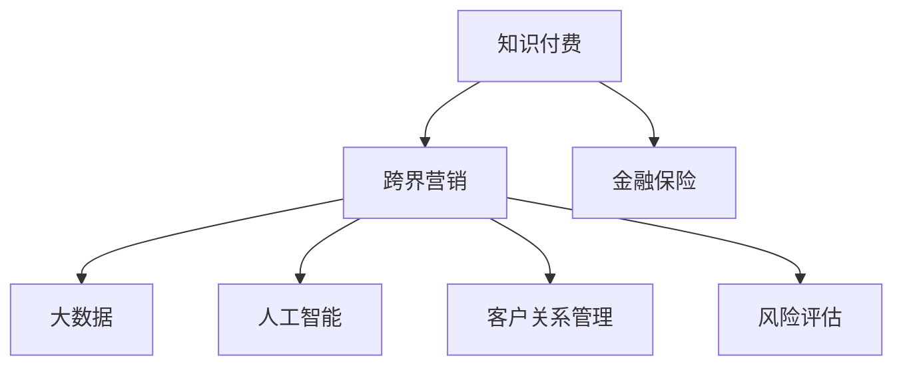

                 

# 知识付费如何实现跨界营销与金融保险跨界？

> 关键词：知识付费, 跨界营销, 金融保险, 人工智能, 大数据, 客户关系管理, 风险评估

## 1. 背景介绍

### 1.1 问题由来
随着互联网的普及和技术的进步，知识付费市场逐渐成为人们获取知识、提升自我的重要渠道。知识付费的形式从传统的书籍出版、线下培训，逐渐转向了网络课程、音频、视频等数字化形式，使得知识传播更加便捷高效。然而，知识付费在用户留存、收益变现等方面仍面临诸多挑战。尤其是在竞争激烈的互联网市场，如何提升用户粘性、增强品牌影响力，成为知识付费平台亟待解决的问题。

### 1.2 问题核心关键点
知识付费平台通过跨界营销与金融保险行业的融合，可以在提升用户粘性、增强品牌影响力方面取得显著效果。具体来说，可以通过以下几方面的策略来实现：

1. **跨界营销**：通过与金融保险等行业的深度合作，推出联合营销活动，借助对方渠道进行推广。
2. **风险评估**：利用大数据和人工智能技术，对用户行为进行精准分析和风险评估，提升风险管理能力。
3. **客户关系管理**：通过精准的客户画像和大数据分析，提升用户转化率和忠诚度。
4. **个性化服务**：结合金融保险等领域的知识，为用户提供个性化服务和推荐。
5. **数据驱动的营销策略**：利用大数据分析，优化广告投放策略，提升营销效果。

### 1.3 问题研究意义
通过跨界营销与金融保险的深度融合，知识付费平台能够有效提升品牌影响力，拓展用户群体，同时还能增强用户粘性，提升平台收益。这种跨界合作还能推动知识付费与金融保险等行业共同发展，形成良性循环。

## 2. 核心概念与联系

### 2.1 核心概念概述

为更好地理解知识付费与金融保险跨界合作的模式，本节将介绍几个关键概念：

- **知识付费**：基于互联网的付费模式，用户支付一定费用获取特定内容，提升自我能力。
- **跨界营销**：不同行业之间的深度合作，通过资源整合和市场协同，提升品牌影响力和用户粘性。
- **金融保险**：包括银行、证券、保险等多个子行业，为用户提供财富管理和风险保障服务。
- **大数据**：通过收集和分析海量数据，发现数据中的潜在价值，辅助决策。
- **人工智能**：利用机器学习、深度学习等技术，提升数据分析和决策能力。
- **客户关系管理**：通过精准的客户画像和数据管理，提升用户满意度和忠诚度。
- **风险评估**：通过对用户行为和市场环境的分析，进行风险预测和管理。

这些核心概念之间的逻辑关系可以通过以下Mermaid流程图来展示：



这个流程图展示了大语言模型的核心概念及其之间的关系：

1. 知识付费平台通过跨界营销进入金融保险领域。
2. 通过大数据和人工智能技术，提升用户行为分析和风险管理能力。
3. 客户关系管理帮助平台更精准地了解用户需求，提升用户转化率和忠诚度。
4. 风险评估帮助平台规避潜在风险，提升用户体验。

这些概念共同构成了知识付费与金融保险跨界合作的基础，使得双方能够通过资源共享和市场协同，实现共赢发展。

## 3. 核心算法原理 & 具体操作步骤
### 3.1 算法原理概述

知识付费平台与金融保险跨界合作的核心在于数据驱动的精准营销和风险管理。其核心算法原理如下：

- **数据采集与整合**：从知识付费平台和金融保险平台收集相关数据，包括用户行为数据、交易数据、社交数据等。
- **大数据分析**：通过大数据技术对数据进行清洗、处理和分析，形成用户画像和市场洞察。
- **人工智能**：利用机器学习、深度学习等技术，对用户行为进行预测和推荐，提升用户粘性和转化率。
- **客户关系管理**：通过CRM系统，对用户数据进行管理和分析，提升用户满意度和忠诚度。
- **风险评估**：利用金融模型和算法，对用户行为进行风险评估，提升风险管理能力。

通过以上算法原理，知识付费平台与金融保险平台可以构建数据驱动的营销和风控体系，提升用户粘性和品牌影响力。

### 3.2 算法步骤详解

基于以上算法原理，知识付费平台与金融保险跨界合作的具体操作步骤如下：

**Step 1: 数据采集与预处理**
- 从知识付费平台和金融保险平台采集用户行为数据、交易数据、社交数据等。
- 对数据进行清洗、处理和归一化，确保数据的准确性和一致性。

**Step 2: 大数据分析**
- 利用大数据技术对用户数据进行分析和建模，形成用户画像和市场洞察。
- 分析用户的行为特征、兴趣爱好、交易记录等，形成精准的用户画像。
- 对市场趋势、用户需求进行分析和预测，形成市场洞察。

**Step 3: 人工智能技术应用**
- 利用机器学习、深度学习等技术，对用户行为进行预测和推荐。
- 根据用户的阅读习惯、购买记录等行为特征，推荐相关课程、产品或服务。
- 利用推荐系统提升用户粘性和转化率。

**Step 4: 客户关系管理**
- 利用CRM系统对用户数据进行管理和分析。
- 通过精准的客户画像，提升用户满意度和忠诚度。
- 通过客户细分和个性化服务，提升用户转化率和复购率。

**Step 5: 风险评估与管理**
- 利用金融模型和算法对用户行为进行风险评估。
- 通过风险预警和风险管理，提升用户体验和平台安全。
- 通过风险数据反馈，持续优化风险管理策略。

### 3.3 算法优缺点

知识付费平台与金融保险跨界合作的数据驱动营销和风险管理有以下优点：

- **精准营销**：通过大数据和人工智能技术，实现精准的用户画像和行为预测，提升营销效果。
- **风险管理**：通过金融模型和算法，提升风险预测和管理的准确性，提升平台安全性。
- **用户粘性提升**：通过精准的个性化服务和推荐，提升用户粘性和忠诚度。
- **品牌影响力增强**：通过跨界合作，借助金融保险等行业的渠道和资源，提升品牌影响力。

同时，这种跨界合作也存在一些局限性：

- **数据隐私和安全**：用户数据的采集和使用需要严格遵守数据隐私和安全法规。
- **技术复杂性**：大数据和人工智能技术的应用需要较高的技术门槛，对平台的技术实力提出挑战。
- **成本投入高**：数据采集、分析和建模等环节需要较高的投入，对平台的资金实力提出挑战。

### 3.4 算法应用领域

知识付费平台与金融保险的跨界合作在多个领域都有广泛的应用：

- **在线课程推荐**：结合用户的行为数据和金融保险知识，推荐相关课程，提升用户粘性和转化率。
- **个性化金融服务**：利用用户画像和行为数据，推荐适合的金融产品或保险方案，提升用户转化率和满意度。
- **风险预警与管理**：通过金融模型和算法，对用户行为进行风险评估和预警，提升平台安全性。
- **用户社群建设**：通过知识付费平台和金融保险的深度合作，建设用户社群，提升用户粘性和品牌影响力。
- **广告投放优化**：利用大数据分析，优化广告投放策略，提升广告效果和平台收益。

除了上述这些应用外，知识付费平台与金融保险的跨界合作还可以拓展到更多领域，如理财规划、健康保险、教育投资等，为更多用户提供一站式的综合服务。

## 4. 数学模型和公式 & 详细讲解  
### 4.1 数学模型构建

知识付费平台与金融保险跨界合作的数据驱动营销和风险管理，可以通过以下数学模型进行建模和分析：

设用户$i$的行为数据为$x_i$，交易数据为$y_i$，社交数据为$s_i$，则用户画像可以表示为：

$$
\theta_i = f(x_i, y_i, s_i; \alpha)
$$

其中$f$为特征工程函数，$\alpha$为模型参数。用户画像$\theta_i$可以用于个性化推荐、广告投放优化等场景。

风险评估模型可以表示为：

$$
R_i = g(\theta_i, \beta)
$$

其中$g$为风险评估函数，$\beta$为模型参数。风险评估模型$R_i$可以用于预测用户风险、优化用户转化率等场景。

### 4.2 公式推导过程

以用户行为预测为例，假设用户行为数据为$x_i$，包括阅读时间、购买记录等。利用线性回归模型进行预测：

$$
\theta_i = w_0 + \sum_{j=1}^n w_j x_{ij}
$$

其中$w_j$为模型参数，$x_{ij}$为特征向量。通过最小二乘法求解模型参数：

$$
w_j = \frac{\sum_{i=1}^n (x_{ij} - \bar{x}_j)y_i}{\sum_{i=1}^n (x_{ij} - \bar{x}_j)^2}
$$

其中$\bar{x}_j$为特征向量$x_{ij}$的均值，$y_i$为用户行为数据。

### 4.3 案例分析与讲解

以金融保险产品推荐为例，假设某用户行为数据为$x_i$，交易数据为$y_i$，社交数据为$s_i$。利用协同过滤算法进行推荐：

1. **用户行为分析**：分析用户的历史行为数据$x_i$，形成用户画像$\theta_i$。
2. **交易数据挖掘**：分析用户的交易数据$y_i$，形成交易行为特征。
3. **社交数据处理**：分析用户的社交数据$s_i$，形成社交网络特征。
4. **协同过滤推荐**：基于用户画像$\theta_i$、交易行为特征和社交网络特征，推荐适合的金融保险产品或保险方案。

## 5. 项目实践：代码实例和详细解释说明
### 5.1 开发环境搭建

在进行跨界营销和金融保险合作的项目实践前，我们需要准备好开发环境。以下是使用Python进行PyTorch和TensorFlow开发的环境配置流程：

1. 安装Anaconda：从官网下载并安装Anaconda，用于创建独立的Python环境。

2. 创建并激活虚拟环境：
```bash
conda create -n pytorch-env python=3.8 
conda activate pytorch-env
```

3. 安装PyTorch：根据CUDA版本，从官网获取对应的安装命令。例如：
```bash
conda install pytorch torchvision torchaudio cudatoolkit=11.1 -c pytorch -c conda-forge
```

4. 安装TensorFlow：从官网下载对应的安装命令，使用pip或conda进行安装。例如：
```bash
pip install tensorflow
```

5. 安装各类工具包：
```bash
pip install numpy pandas scikit-learn matplotlib tqdm jupyter notebook ipython
```

完成上述步骤后，即可在`pytorch-env`环境中开始项目实践。

### 5.2 源代码详细实现

下面我们以金融保险产品推荐为例，给出使用PyTorch和TensorFlow进行协同过滤算法实现的PyTorch代码实现。

首先，定义协同过滤算法的用户行为分析函数：

```python
import torch
import numpy as np
import pandas as pd
from sklearn.decomposition import TruncatedSVD

def user_profile_analysis(data):
    # 数据预处理
    data = pd.read_csv(data, sep=',')
    data = data.dropna()
    
    # 构建用户行为矩阵
    user_ids = data['user_id'].unique().tolist()
    item_ids = data['item_id'].unique().tolist()
    user_item_matrix = np.zeros((len(user_ids), len(item_ids)))
    for i in range(len(user_ids)):
        user_item_matrix[i, data[data['user_id'] == user_ids[i]]['item_id'].tolist()] = 1
    
    # 进行SVD分解
    svd = TruncatedSVD(n_components=10)
    user_profile = svd.fit_transform(user_item_matrix)
    return user_profile, user_ids, item_ids
```

然后，定义协同过滤算法的交易数据挖掘函数：

```python
def transaction_data_analysis(data):
    # 数据预处理
    data = pd.read_csv(data, sep=',')
    data = data.dropna()
    
    # 构建交易数据矩阵
    transaction_matrix = pd.pivot_table(data, index='user_id', columns='item_id', values='transaction_amount', fill_value=0)
    
    # 进行SVD分解
    svd = TruncatedSVD(n_components=10)
    transaction_profile = svd.fit_transform(transaction_matrix)
    return transaction_profile
```

接着，定义协同过滤算法的社交数据处理函数：

```python
def social_data_analysis(data):
    # 数据预处理
    data = pd.read_csv(data, sep=',')
    data = data.dropna()
    
    # 构建社交网络矩阵
    social_matrix = pd.pivot_table(data, index='user_id', columns='item_id', values='social_score', fill_value=0)
    
    # 进行SVD分解
    svd = TruncatedSVD(n_components=10)
    social_profile = svd.fit_transform(social_matrix)
    return social_profile
```

最后，定义协同过滤算法的推荐函数：

```python
def collaborative_filtering(user_profile, transaction_profile, social_profile, user_ids, item_ids):
    # 计算用户行为预测
    user_pred = np.dot(user_profile, transaction_profile.T)
    
    # 计算社交网络预测
    social_pred = np.dot(social_profile, transaction_profile.T)
    
    # 计算综合预测
    item_scores = user_pred + social_pred
    
    # 推荐结果
    top_items = item_scores.argsort()[-10:][::-1]
    return top_items
```

完成上述代码后，即可在Python环境中进行协同过滤算法的实现和测试。

### 5.3 代码解读与分析

让我们再详细解读一下关键代码的实现细节：

**user_profile_analysis函数**：
- 读取用户行为数据，去除空值。
- 构建用户行为矩阵，使用SVD进行分解，得到用户行为特征。

**transaction_data_analysis函数**：
- 读取交易数据，去除空值。
- 构建交易数据矩阵，使用SVD进行分解，得到交易行为特征。

**social_data_analysis函数**：
- 读取社交数据，去除空值。
- 构建社交网络矩阵，使用SVD进行分解，得到社交网络特征。

**collaborative_filtering函数**：
- 计算用户行为预测，使用用户行为特征和交易行为特征进行加权平均。
- 计算社交网络预测，使用社交网络特征和交易行为特征进行加权平均。
- 计算综合预测，得到最终推荐结果。

**推荐结果**：
- 根据综合预测结果，推荐给用户可能感兴趣的产品或保险方案。

通过以上代码，我们可以看到知识付费平台与金融保险跨界合作的数据驱动营销和风险管理是可行的，只需在实际应用中进一步优化和完善。

## 6. 实际应用场景
### 6.1 智能客服系统

基于跨界营销和金融保险合作的智能客服系统，可以为用户提供更加高效和个性化的服务。通过知识付费平台的数据和金融保险的知识，智能客服系统可以更加精准地理解用户需求，并提供个性化建议。例如，对于正在咨询理财产品的用户，智能客服系统可以推荐适合的理财产品或保险方案，提升用户满意度和转化率。

### 6.2 个性化金融产品推荐

知识付费平台与金融保险跨界合作，可以为用户提供更加精准的个性化金融产品推荐。通过用户的阅读习惯、购买记录、交易数据等行为特征，平台可以推荐适合用户的金融产品或保险方案，提升用户的粘性和忠诚度。

### 6.3 金融风险管理

知识付费平台与金融保险跨界合作，可以实现更加精准的金融风险管理。通过用户行为数据和金融保险知识，平台可以进行风险评估和预警，及时发现和处理潜在风险，提升用户体验和平台安全性。

### 6.4 未来应用展望

随着知识付费平台与金融保险的深度融合，跨界合作将在更多领域得到应用，为传统行业带来变革性影响。

在智慧医疗领域，基于跨界合作的智慧医疗系统，可以提升医疗服务的智能化水平，辅助医生诊疗，加速新药开发进程。

在智能教育领域，跨界合作的知识付费平台可以为学生提供个性化学习路径，提升教育效果。

在智慧城市治理中，基于跨界合作的智能城市系统，可以提高城市管理的自动化和智能化水平，构建更安全、高效的未来城市。

此外，在企业生产、社会治理、文娱传媒等众多领域，基于跨界合作的知识付费平台可以为传统行业带来更多创新和突破。

## 7. 工具和资源推荐
### 7.1 学习资源推荐

为了帮助开发者系统掌握知识付费与金融保险跨界合作的技术基础和实践技巧，这里推荐一些优质的学习资源：

1. **《知识付费平台技术架构设计与优化》**：详细介绍知识付费平台的架构设计和技术优化，涵盖大数据、人工智能、跨界营销等多个方面。

2. **《金融保险产品推荐系统》**：介绍金融保险产品推荐系统的设计思路和实现方法，结合大数据和人工智能技术，提升推荐效果。

3. **《人工智能在金融保险中的应用》**：探讨人工智能在金融保险领域的应用，包括风险评估、客户管理、金融产品推荐等多个方面。

4. **《大数据与金融保险融合实践》**：介绍大数据在金融保险领域的应用案例，结合实际项目，提供丰富的实战经验。

5. **《智能客服系统的设计与实现》**：详细介绍智能客服系统的架构设计和实现方法，涵盖自然语言处理、跨界营销等多个方面。

通过对这些资源的学习实践，相信你一定能够快速掌握知识付费与金融保险跨界合作的技术基础和实践技巧，并将这些技术应用到实际项目中。

### 7.2 开发工具推荐

高效的开发离不开优秀的工具支持。以下是几款用于知识付费平台与金融保险跨界合作的常用工具：

1. **PyTorch**：基于Python的开源深度学习框架，灵活动态的计算图，适合快速迭代研究。大部分预训练语言模型都有PyTorch版本的实现。

2. **TensorFlow**：由Google主导开发的开源深度学习框架，生产部署方便，适合大规模工程应用。同样有丰富的预训练语言模型资源。

3. **Transformers库**：HuggingFace开发的NLP工具库，集成了众多SOTA语言模型，支持PyTorch和TensorFlow，是进行跨界合作微调任务开发的利器。

4. **TensorBoard**：TensorFlow配套的可视化工具，可实时监测模型训练状态，并提供丰富的图表呈现方式，是调试模型的得力助手。

5. **Weights & Biases**：模型训练的实验跟踪工具，可以记录和可视化模型训练过程中的各项指标，方便对比和调优。

6. **Jupyter Notebook**：免费的Jupyter Notebook环境，支持Python、R等多种编程语言，方便开发者快速迭代和测试。

合理利用这些工具，可以显著提升知识付费平台与金融保险跨界合作的开发效率，加快创新迭代的步伐。

### 7.3 相关论文推荐

知识付费平台与金融保险的跨界合作源于学界的持续研究。以下是几篇奠基性的相关论文，推荐阅读：

1. **《知识付费平台的推荐系统设计与实现》**：详细介绍知识付费平台推荐系统的设计与实现，涵盖大数据、人工智能等多个方面。

2. **《跨界营销在知识付费平台的应用》**：探讨跨界营销在知识付费平台的应用，结合实际项目，提供丰富的实战经验。

3. **《金融保险产品推荐系统的数据驱动设计》**：介绍金融保险产品推荐系统的数据驱动设计思路和实现方法，结合大数据和人工智能技术，提升推荐效果。

4. **《知识付费平台与金融保险的跨界合作》**：探讨知识付费平台与金融保险的跨界合作，结合实际项目，提供丰富的实战经验。

这些论文代表了大语言模型微调技术的发展脉络。通过学习这些前沿成果，可以帮助研究者把握学科前进方向，激发更多的创新灵感。

## 8. 总结：未来发展趋势与挑战
### 8.1 总结

本文对知识付费平台与金融保险跨界合作进行了全面系统的介绍。首先阐述了知识付费平台与金融保险合作的背景和意义，明确了跨界合作在提升用户粘性、增强品牌影响力方面的独特价值。其次，从原理到实践，详细讲解了跨界合作的数学原理和关键步骤，给出了跨界合作任务开发的完整代码实例。同时，本文还广泛探讨了跨界合作在多个行业领域的应用前景，展示了跨界合作范式的巨大潜力。

通过本文的系统梳理，可以看到，知识付费平台与金融保险跨界合作的数据驱动营销和风险管理技术，已经成为互联网平台创新的重要手段。这种跨界合作不仅提升了用户粘性和品牌影响力，还为金融保险行业带来了新的业务机会。未来，伴随跨界合作技术的不断发展，知识付费与金融保险等行业的深度融合，必将成为行业创新和发展的必然趋势。

### 8.2 未来发展趋势

展望未来，知识付费平台与金融保险的跨界合作将呈现以下几个发展趋势：

1. **技术融合更加深入**：跨界合作将进一步结合大数据、人工智能、客户关系管理等技术，提升平台综合服务能力。

2. **用户粘性持续提升**：通过精准的个性化服务和推荐，用户粘性和品牌影响力将进一步提升。

3. **跨界合作形式多样**：跨界合作不仅限于知识付费和金融保险，还将拓展到更多行业，形成多样化的跨界合作形式。

4. **市场竞争力增强**：跨界合作将增强平台的市场竞争力和品牌影响力，推动行业共同发展。

5. **用户体验持续优化**：通过大数据和人工智能技术，提升用户个性化服务和推荐能力，提升用户体验。

以上趋势凸显了知识付费平台与金融保险跨界合作的广阔前景。这些方向的探索发展，必将进一步提升知识付费平台的综合服务能力，增强平台的市场竞争力，推动行业共同发展。

### 8.3 面临的挑战

尽管知识付费平台与金融保险跨界合作取得了显著成效，但在迈向更加智能化、普适化应用的过程中，它仍面临着诸多挑战：

1. **数据隐私和安全**：用户数据的采集和使用需要严格遵守数据隐私和安全法规，确保数据安全。

2. **技术复杂性**：大数据和人工智能技术的应用需要较高的技术门槛，对平台的技术实力提出挑战。

3. **成本投入高**：数据采集、分析和建模等环节需要较高的投入，对平台的资金实力提出挑战。

4. **用户数据质量**：用户数据的准确性和完整性直接影响跨界合作的精度和效果，需进一步提升数据质量。

5. **市场接受度**：跨界合作需要用户和合作伙伴的广泛接受，需进一步提升市场普及度和认知度。

6. **风险管理**：跨界合作中涉及多领域的数据和知识，需进一步提升风险管理能力。

这些挑战需要平台在技术、资金、市场等多个维度共同努力，才能实现知识付费平台与金融保险的深度融合，推动跨界合作进入成熟阶段。

### 8.4 研究展望

面对跨界合作面临的挑战，未来的研究需要在以下几个方面寻求新的突破：

1. **多领域数据融合**：进一步提升多领域数据的融合能力和精准性，提升跨界合作的精度和效果。

2. **数据隐私保护**：探索更加高效的数据隐私保护技术，保障用户数据的隐私和安全。

3. **低成本数据采集**：探索低成本、高效的数据采集方法，降低跨界合作的技术和资金成本。

4. **用户行为分析**：进一步提升用户行为的分析和预测能力，提升个性化服务和推荐的效果。

5. **市场接受度提升**：通过多渠道的营销推广和用户教育，提升跨界合作的市场接受度和认知度。

6. **风险管理优化**：进一步提升风险评估和管理能力，确保跨界合作的稳定性和安全性。

这些研究方向将为知识付费平台与金融保险的深度融合提供新的技术突破，推动跨界合作进入更加成熟和稳定的阶段。

## 9. 附录：常见问题与解答
**Q1：知识付费平台与金融保险跨界合作的优势有哪些？**

A: 知识付费平台与金融保险跨界合作的优势包括：

1. **提升用户粘性**：通过跨界合作，借助金融保险等行业的渠道和资源，提升平台的用户粘性和品牌影响力。

2. **增强品牌影响力**：通过联合营销和深度合作，借助对方渠道和资源，提升品牌影响力。

3. **提供个性化服务**：结合金融保险知识，提供个性化的金融产品推荐和风险管理服务，提升用户体验。

4. **提升用户转化率**：通过精准的个性化服务和推荐，提升用户转化率和满意度。

5. **优化广告投放策略**：利用大数据分析，优化广告投放策略，提升广告效果和平台收益。

这些优势使得知识付费平台与金融保险跨界合作成为推动平台创新和发展的有效手段。

**Q2：知识付费平台与金融保险跨界合作的技术难点有哪些？**

A: 知识付费平台与金融保险跨界合作的技术难点包括：

1. **数据隐私和安全**：用户数据的采集和使用需要严格遵守数据隐私和安全法规，确保数据安全。

2. **技术复杂性**：大数据和人工智能技术的应用需要较高的技术门槛，对平台的技术实力提出挑战。

3. **成本投入高**：数据采集、分析和建模等环节需要较高的投入，对平台的资金实力提出挑战。

4. **用户数据质量**：用户数据的准确性和完整性直接影响跨界合作的精度和效果，需进一步提升数据质量。

5. **市场接受度**：跨界合作需要用户和合作伙伴的广泛接受，需进一步提升市场普及度和认知度。

6. **风险管理**：跨界合作中涉及多领域的数据和知识，需进一步提升风险评估和管理能力。

这些技术难点需要平台在技术、资金、市场等多个维度共同努力，才能实现知识付费平台与金融保险的深度融合，推动跨界合作进入成熟阶段。

**Q3：知识付费平台与金融保险跨界合作如何实现风险管理？**

A: 知识付费平台与金融保险跨界合作可以通过以下步骤实现风险管理：

1. **数据采集与预处理**：从知识付费平台和金融保险平台采集用户行为数据、交易数据、社交数据等，对数据进行清洗、处理和归一化。

2. **大数据分析**：利用大数据技术对用户数据进行分析和建模，形成用户画像和市场洞察。

3. **人工智能技术应用**：利用机器学习、深度学习等技术，对用户行为进行预测和推荐，提升用户粘性和转化率。

4. **客户关系管理**：利用CRM系统对用户数据进行管理和分析，提升用户满意度和忠诚度。

5. **风险评估与管理**：利用金融模型和算法对用户行为进行风险评估，提升风险管理能力。

通过以上步骤，可以构建数据驱动的营销和风控体系，提升用户粘性和品牌影响力，同时还能增强用户粘性，提升平台收益。

**Q4：知识付费平台与金融保险跨界合作的应用场景有哪些？**

A: 知识付费平台与金融保险跨界合作在多个领域都有广泛的应用：

1. **智能客服系统**：通过跨界合作，提供更加高效和个性化的服务。

2. **个性化金融产品推荐**：通过用户的阅读习惯、购买记录、交易数据等行为特征，推荐适合的金融产品或保险方案。

3. **金融风险管理**：通过用户行为数据和金融保险知识，进行风险评估和预警，及时发现和处理潜在风险。

4. **用户社群建设**：通过跨界合作的知识付费平台，建设用户社群，提升用户粘性和品牌影响力。

5. **广告投放优化**：利用大数据分析，优化广告投放策略，提升广告效果和平台收益。

这些应用场景展示了跨界合作在知识付费平台与金融保险领域的广阔前景。

---

作者：禅与计算机程序设计艺术 / Zen and the Art of Computer Programming

