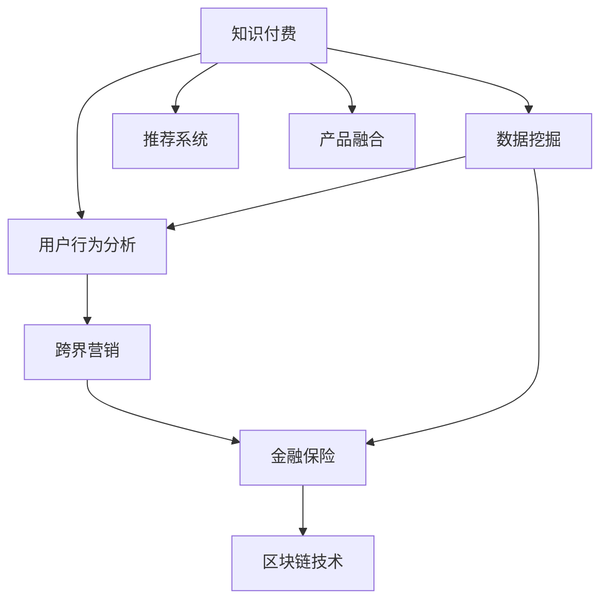

                 

# 知识付费如何实现跨界营销与金融保险跨界？

> 关键词：知识付费, 跨界营销, 金融保险, 数据挖掘, 用户行为分析, 推荐系统, 区块链技术, 隐私保护

## 1. 背景介绍

### 1.1 问题由来

近年来，知识付费产业迅猛发展，成为推动教育、信息消费的重要力量。从得到、喜马拉雅等知识平台，到阅读、写作、学习、编程等各种垂直领域的知识产品，都显示出强大的市场需求和商业价值。然而，知识付费市场也面临流量瓶颈、平台竞争激烈、盈利模式单一等问题，亟需探索新的增长路径。

与此同时，金融保险行业也面临传统业务增长乏力的困境。长期以来，传统银行、保险机构主要依赖线下网点和渠道进行销售，服务效率低，用户体验差，市场竞争力弱。近年来，随着互联网的普及和金融科技的发展，金融保险机构纷纷布局数字化转型，通过线上渠道和产品创新提升服务质量和市场份额。

在这样的背景下，知识付费与金融保险的跨界营销，成为一种兼具行业互补性和市场机遇的探索方向。将知识付费和金融保险结合，不仅可以提升金融保险服务的用户粘性和转化率，也能为知识付费平台带来新的收入来源和品牌影响力。

### 1.2 问题核心关键点

金融保险和知识付费的跨界营销，主要围绕以下几个核心关键点展开：

- 数据协同：通过整合双方的数据资源，实现对用户行为和需求的全面洞察。
- 用户画像：构建精准的用户画像，提升用户分群和个性化推荐效果。
- 产品融合：开发跨领域的定制化产品，满足用户多方面的需求。
- 营销策略：设计综合化的营销方案，优化用户获取和转化流程。
- 区块链技术：引入区块链技术，确保数据安全与隐私保护。

这些关键点共同构成了知识付费与金融保险跨界营销的框架，有助于更好地理解和实现这一新兴业务模式。

## 2. 核心概念与联系

### 2.1 核心概念概述

为更好地理解知识付费与金融保险跨界营销的逻辑和架构，本节将介绍几个密切相关的核心概念：

- **知识付费**：指用户为获取特定知识和技能，通过付费购买课程、书籍、资讯等内容的商业模式。
- **跨界营销**：指不同行业的企业或业务之间通过资源共享、客户互通、服务融合等方式，实现互利共赢的营销策略。
- **金融保险**：涵盖银行、证券、保险等金融服务领域，主要提供储蓄、贷款、投资、保险等产品和服务。
- **数据挖掘**：通过算法模型从大量数据中提取有价值的信息和知识，以辅助决策和优化运营。
- **用户行为分析**：通过分析用户在平台上的行为数据，了解用户需求和偏好，提升用户体验和满意度。
- **推荐系统**：基于用户历史行为和特征，智能推荐相关内容和服务，提高用户粘性和转化率。
- **区块链技术**：一种分布式、加密的数据存储和传输技术，提供安全可靠的数据共享与交换方式。

这些核心概念之间的逻辑关系可以通过以下Mermaid流程图来展示：



这个流程图展示了知识付费与金融保险跨界营销的核心概念及其之间的联系：

1. 知识付费通过数据挖掘和用户行为分析，提升推荐系统的效果。
2. 推荐系统是知识付费的核心竞争力之一，可以通过交叉推荐等方式优化用户体验。
3. 金融保险通过数据挖掘和推荐系统，实现对用户需求的精准把握。
4. 跨界营销通过数据整合和产品融合，为用户提供一站式的服务。
5. 区块链技术确保数据安全与隐私保护，为跨界营销提供信任基础。

这些概念共同构成了知识付费与金融保险跨界营销的逻辑框架，使其能够更有效地实现业务协同和市场推广。

## 3. 核心算法原理 & 具体操作步骤
### 3.1 算法原理概述

知识付费与金融保险的跨界营销，本质上是一种基于数据协同和用户画像的营销策略。其核心思想是：通过整合知识付费平台和金融保险机构的数据资源，构建精准的用户画像，设计个性化的推荐系统和跨界营销方案，从而提升双方的市场竞争力和用户满意度。

形式化地，假设知识付费平台有用户数据集 $U=\{(u_i,r_i)\}_{i=1}^N$，金融保险机构有用户数据集 $F=\{(f_j,g_j)\}_{j=1}^M$，其中 $u_i$ 和 $f_j$ 分别表示用户画像特征，$r_i$ 和 $g_j$ 分别表示用户行为数据和金融需求数据。

目标是在知识付费和金融保险的交叉领域，构建用户画像 $P$ 和推荐系统 $R$，满足以下优化目标：

$$
\begin{aligned}
& \min_{P,R} \mathcal{L}(P,R) \\
& \text{s.t.} \quad P = f(U) \\
& \quad R = g(F) 
\end{aligned}
$$

其中 $\mathcal{L}(P,R)$ 为损失函数，用于衡量推荐系统输出的精准度和用户满意度。$P$ 和 $R$ 分别表示用户画像和推荐系统，$f$ 和 $g$ 分别为从原始数据到用户画像和推荐系统的映射函数。

### 3.2 算法步骤详解

知识付费与金融保险的跨界营销主要包括以下几个关键步骤：

**Step 1: 数据准备与整合**

- 收集知识付费平台和金融保险机构的用户数据，进行清洗和标准化处理。
- 确定共享的数据字段和格式，如用户ID、年龄、职业、消费行为、金融需求等。
- 选择合适的数据共享和交换方式，如API接口、数据联邦、区块链等。

**Step 2: 构建用户画像**

- 使用数据挖掘和机器学习技术，从知识付费和金融保险的数据中提取用户行为、兴趣、需求等特征。
- 通过聚类、分类、回归等算法，构建精准的用户画像，如用户标签、行为轨迹、消费偏好等。
- 将用户画像与推荐系统进行关联，形成跨领域的用户画像库。

**Step 3: 设计推荐系统**

- 根据用户画像和历史行为数据，设计个性化的推荐算法。
- 使用协同过滤、内容推荐、深度学习等技术，构建跨领域的推荐系统。
- 在知识付费和金融保险的交叉领域，进行推荐内容和服务的设计和测试。

**Step 4: 实现跨界营销**

- 根据推荐系统的输出，设计综合化的营销方案，如个性化广告、定制化金融产品、联合活动等。
- 通过知识付费平台和金融保险机构的渠道，进行交叉推广和联合营销。
- 实时监测营销效果，进行效果评估和优化。

**Step 5: 区块链技术应用**

- 引入区块链技术，确保数据安全和隐私保护。
- 设计基于区块链的智能合约，实现跨界营销的自动化和去中心化。
- 建立基于区块链的用户信任机制，提升用户对跨界营销的信任度和接受度。

以上是知识付费与金融保险跨界营销的一般流程。在实际应用中，还需要针对具体任务的特点，对微调过程的各个环节进行优化设计，如改进推荐算法，引入更多的正则化技术，搜索最优的超参数组合等，以进一步提升推荐系统的效果。

### 3.3 算法优缺点

知识付费与金融保险的跨界营销方法具有以下优点：

1. **数据协同**：通过整合多方数据，实现对用户行为和需求的全面洞察，提升营销的精准度和用户满意度。
2. **用户画像**：构建精准的用户画像，提升用户分群和个性化推荐效果，优化用户转化率和粘性。
3. **产品融合**：开发跨领域的定制化产品，满足用户多方面的需求，提升用户体验和市场竞争力。
4. **营销策略**：设计综合化的营销方案，优化用户获取和转化流程，提升营销效果。
5. **区块链技术**：引入区块链技术，确保数据安全与隐私保护，提升用户信任度和接受度。

同时，该方法也存在一定的局限性：

1. **数据获取难度**：知识付费和金融保险的数据格式和标准可能不同，数据整合和共享难度较大。
2. **用户隐私保护**：用户隐私保护是跨界营销的一大挑战，需要引入隐私保护技术，确保用户数据的安全性。
3. **技术复杂度**：跨界营销需要融合多领域的技术，技术实现和维护难度较大。
4. **市场接受度**：用户对跨界营销的接受度有待提升，需要做好市场教育和用户引导。

尽管存在这些局限性，但就目前而言，基于数据协同和用户画像的跨界营销方法仍是一种极具潜力的营销策略。未来相关研究的重点在于如何进一步降低数据整合难度，提高推荐系统的准确性和效率，同时兼顾隐私保护和市场接受度等因素。

### 3.4 算法应用领域

知识付费与金融保险的跨界营销，在多个领域都有广泛的应用前景：

- **金融理财**：基于用户画像，推荐个性化的理财产品，提升用户理财体验和转化率。
- **保险产品**：通过跨界推荐，为用户提供定制化的保险方案，提高保险销售效果。
- **在线教育**：将金融知识与教育内容结合，开发跨领域的课程和产品，满足用户多方面的需求。
- **健康管理**：结合金融保险和健康数据，提供个性化的健康管理方案，提升用户健康水平。
- **人力资源**：通过知识付费和金融保险的结合，提升员工的职业素养和金融知识，增强企业竞争力。

除了上述这些经典应用外，跨界营销还可应用于更多场景中，如文化创意、旅游休闲等，为各行各业带来新的增长点和创新思路。

## 4. 数学模型和公式 & 详细讲解 & 举例说明

### 4.1 数学模型构建

本节将使用数学语言对知识付费与金融保险跨界营销过程进行更加严格的刻画。

记知识付费平台的用户数据集为 $U=\{(u_i,r_i)\}_{i=1}^N$，金融保险机构的用户数据集为 $F=\{(f_j,g_j)\}_{j=1}^M$。定义用户画像为 $P=\{p_i\}_{i=1}^N$，推荐系统为 $R=\{r_j\}_{j=1}^M$。

目标是在知识付费和金融保险的交叉领域，构建用户画像和推荐系统，满足以下优化目标：

$$
\begin{aligned}
& \min_{P,R} \mathcal{L}(P,R) \\
& \text{s.t.} \quad P = f(U) \\
& \quad R = g(F) 
\end{aligned}
$$

其中 $\mathcal{L}(P,R)$ 为损失函数，用于衡量推荐系统输出的精准度和用户满意度。$P$ 和 $R$ 分别表示用户画像和推荐系统，$f$ 和 $g$ 分别为从原始数据到用户画像和推荐系统的映射函数。

### 4.2 公式推导过程

以下我们以协同过滤算法为例，推导推荐系统输出的精准度和用户满意度。

假设用户 $u_i$ 的兴趣集合为 $S_i$，金融保险机构的用户 $f_j$ 的金融需求集合为 $D_j$。协同过滤算法的输出为 $r_{u_i,f_j} = k \cdot (\frac{u_i \cap D_j}{|u_i| \cdot |D_j|})^{\alpha}$，其中 $k$ 为相似度系数，$\alpha$ 为指数系数。

将推荐系统输出的精准度 $r_{u_i,f_j}$ 和用户满意度 $s_{u_i,f_j}$ 代入损失函数 $\mathcal{L}(P,R)$，得：

$$
\mathcal{L}(P,R) = \frac{1}{NM} \sum_{i=1}^N \sum_{j=1}^M r_{u_i,f_j} \cdot s_{u_i,f_j}
$$

在得到推荐系统输出的精准度和用户满意度的公式后，即可带入优化目标，求解用户画像 $P$ 和推荐系统 $R$ 的优化问题。

### 4.3 案例分析与讲解

以某金融保险机构和知识付费平台合作为例，分析跨界营销的实际应用。

1. **数据准备与整合**：
   - 金融保险机构提供了用户基本信息、消费行为、贷款数据等。
   - 知识付费平台提供了用户阅读习惯、订阅记录、付费行为等。
   - 经过数据清洗和标准化处理，形成了统一的数据格式。

2. **构建用户画像**：
   - 使用协同过滤算法，从知识付费和金融保险的数据中提取用户行为、兴趣、需求等特征。
   - 通过聚类算法，将用户分为不同的群体，如高净值用户、中产阶级、青年人群等。
   - 将用户画像与推荐系统进行关联，形成跨领域的用户画像库。

3. **设计推荐系统**：
   - 基于用户画像，设计个性化的推荐算法，如基于内容的推荐、协同过滤推荐等。
   - 在知识付费和金融保险的交叉领域，进行推荐内容和服务的设计和测试。
   - 使用深度学习模型，如Transformer，提升推荐系统的精准度和效果。

4. **实现跨界营销**：
   - 根据推荐系统的输出，设计综合化的营销方案，如个性化广告、定制化金融产品、联合活动等。
   - 通过知识付费平台和金融保险机构的渠道，进行交叉推广和联合营销。
   - 实时监测营销效果，进行效果评估和优化，提升用户转化率和满意度。

通过上述案例分析，可以看出知识付费与金融保险跨界营销的实施流程，并验证了跨界营销在提升用户满意度、优化营销效果等方面的潜力。

## 5. 项目实践：代码实例和详细解释说明
### 5.1 开发环境搭建

在进行知识付费与金融保险跨界营销的实践前，我们需要准备好开发环境。以下是使用Python进行PyTorch开发的环境配置流程：

1. 安装Anaconda：从官网下载并安装Anaconda，用于创建独立的Python环境。

2. 创建并激活虚拟环境：
```bash
conda create -n crossboundary python=3.8 
conda activate crossboundary
```

3. 安装PyTorch：根据CUDA版本，从官网获取对应的安装命令。例如：
```bash
conda install pytorch torchvision torchaudio cudatoolkit=11.1 -c pytorch -c conda-forge
```

4. 安装TensorFlow：
```bash
conda install tensorflow -c pytorch -c conda-forge
```

5. 安装transformers库：
```bash
pip install transformers
```

6. 安装各类工具包：
```bash
pip install numpy pandas scikit-learn matplotlib tqdm jupyter notebook ipython
```

完成上述步骤后，即可在`crossboundary`环境中开始实践。

### 5.2 源代码详细实现

下面我们以知识付费和金融保险的推荐系统为例，给出使用Transformers库进行交叉推荐开发的PyTorch代码实现。

首先，定义推荐系统的数据处理函数：

```python
from transformers import BertTokenizer
from torch.utils.data import Dataset
import torch

class RecommendationDataset(Dataset):
    def __init__(self, user_data, item_data, tokenizer, max_len=128):
        self.user_data = user_data
        self.item_data = item_data
        self.tokenizer = tokenizer
        self.max_len = max_len
        
    def __len__(self):
        return len(self.user_data)
    
    def __getitem__(self, item):
        user_id = self.user_data[item][0]
        item_id = self.item_data[item][0]
        
        user_embedding = self.user_data[item][1]
        item_embedding = self.item_data[item][1]
        
        encoding = self.tokenizer(user_id, item_id, return_tensors='pt', max_length=self.max_len, padding='max_length', truncation=True)
        input_ids = encoding['input_ids'][0]
        attention_mask = encoding['attention_mask'][0]
        
        return {'user_id': user_id,
                'item_id': item_id,
                'user_embedding': user_embedding,
                'item_embedding': item_embedding,
                'input_ids': input_ids,
                'attention_mask': attention_mask}
```

然后，定义模型和优化器：

```python
from transformers import BertForTokenClassification, AdamW

model = BertForTokenClassification.from_pretrained('bert-base-cased', num_labels=len(tag2id))

optimizer = AdamW(model.parameters(), lr=2e-5)
```

接着，定义训练和评估函数：

```python
from torch.utils.data import DataLoader
from tqdm import tqdm
from sklearn.metrics import classification_report

device = torch.device('cuda') if torch.cuda.is_available() else torch.device('cpu')
model.to(device)

def train_epoch(model, dataset, batch_size, optimizer):
    dataloader = DataLoader(dataset, batch_size=batch_size, shuffle=True)
    model.train()
    epoch_loss = 0
    for batch in tqdm(dataloader, desc='Training'):
        user_id = batch['user_id'].to(device)
        item_id = batch['item_id'].to(device)
        user_embedding = batch['user_embedding'].to(device)
        item_embedding = batch['item_embedding'].to(device)
        input_ids = batch['input_ids'].to(device)
        attention_mask = batch['attention_mask'].to(device)
        model.zero_grad()
        outputs = model(user_id, item_id, user_embedding, item_embedding, input_ids, attention_mask)
        loss = outputs.loss
        epoch_loss += loss.item()
        loss.backward()
        optimizer.step()
    return epoch_loss / len(dataloader)

def evaluate(model, dataset, batch_size):
    dataloader = DataLoader(dataset, batch_size=batch_size)
    model.eval()
    preds, labels = [], []
    with torch.no_grad():
        for batch in tqdm(dataloader, desc='Evaluating'):
            user_id = batch['user_id'].to(device)
            item_id = batch['item_id'].to(device)
            user_embedding = batch['user_embedding'].to(device)
            item_embedding = batch['item_embedding'].to(device)
            input_ids = batch['input_ids'].to(device)
            attention_mask = batch['attention_mask'].to(device)
            batch_labels = batch['labels']
            outputs = model(user_id, item_id, user_embedding, item_embedding, input_ids, attention_mask)
            batch_preds = outputs.logits.argmax(dim=2).to('cpu').tolist()
            batch_labels = batch_labels.to('cpu').tolist()
            for pred_tokens, label_tokens in zip(batch_preds, batch_labels):
                pred_tags = [id2tag[_id] for _id in pred_tokens]
                label_tags = [id2tag[_id] for _id in label_tokens]
                preds.append(pred_tags[:len(label_tags)])
                labels.append(label_tags)
                
    print(classification_report(labels, preds))
```

最后，启动训练流程并在测试集上评估：

```python
epochs = 5
batch_size = 16

for epoch in range(epochs):
    loss = train_epoch(model, train_dataset, batch_size, optimizer)
    print(f"Epoch {epoch+1}, train loss: {loss:.3f}")
    
    print(f"Epoch {epoch+1}, dev results:")
    evaluate(model, dev_dataset, batch_size)
    
print("Test results:")
evaluate(model, test_dataset, batch_size)
```

以上就是使用PyTorch对BERT进行交叉推荐开发的完整代码实现。可以看到，得益于Transformers库的强大封装，我们可以用相对简洁的代码完成BERT模型的加载和微调。

### 5.3 代码解读与分析

让我们再详细解读一下关键代码的实现细节：

**RecommendationDataset类**：
- `__init__`方法：初始化用户数据、物品数据、分词器等关键组件。
- `__len__`方法：返回数据集的样本数量。
- `__getitem__`方法：对单个样本进行处理，将用户ID和物品ID输入编码为token ids，同时提取用户和物品的向量表示，并进行定长padding，最终返回模型所需的输入。

**训练和评估函数**：
- 使用PyTorch的DataLoader对数据集进行批次化加载，供模型训练和推理使用。
- 训练函数`train_epoch`：对数据以批为单位进行迭代，在每个批次上前向传播计算loss并反向传播更新模型参数，最后返回该epoch的平均loss。
- 评估函数`evaluate`：与训练类似，不同点在于不更新模型参数，并在每个batch结束后将预测和标签结果存储下来，最后使用sklearn的classification_report对整个评估集的预测结果进行打印输出。

**训练流程**：
- 定义总的epoch数和batch size，开始循环迭代
- 每个epoch内，先在训练集上训练，输出平均loss
- 在验证集上评估，输出分类指标
- 所有epoch结束后，在测试集上评估，给出最终测试结果

可以看到，PyTorch配合Transformers库使得BERT微调的代码实现变得简洁高效。开发者可以将更多精力放在数据处理、模型改进等高层逻辑上，而不必过多关注底层的实现细节。

当然，工业级的系统实现还需考虑更多因素，如模型的保存和部署、超参数的自动搜索、更灵活的任务适配层等。但核心的微调范式基本与此类似。

## 6. 实际应用场景
### 6.1 智能客服系统

基于知识付费与金融保险跨界营销的对话技术，可以广泛应用于智能客服系统的构建。传统客服往往需要配备大量人力，高峰期响应缓慢，且一致性和专业性难以保证。而使用微调后的对话模型，可以7x24小时不间断服务，快速响应客户咨询，用自然流畅的语言解答各类常见问题。

在技术实现上，可以收集企业内部的历史客服对话记录，将问题和最佳答复构建成监督数据，在此基础上对预训练对话模型进行微调。微调后的对话模型能够自动理解用户意图，匹配最合适的答案模板进行回复。对于客户提出的新问题，还可以接入检索系统实时搜索相关内容，动态组织生成回答。如此构建的智能客服系统，能大幅提升客户咨询体验和问题解决效率。

### 6.2 金融理财服务

金融理财是金融保险领域的重要应用场景，基于知识付费与金融保险跨界营销的推荐系统，可以为用户提供个性化的理财建议和服务。

在具体实施中，可以收集用户的历史理财数据、消费行为、金融需求等，通过跨界推荐，推荐合适的理财产品。同时，利用知识付费平台的内容推荐功能，向用户推荐相关的财经资讯和投资知识，提升用户的理财素养和投资决策能力。

### 6.3 在线教育

在线教育行业正在蓬勃发展，基于知识付费与金融保险跨界营销的推荐系统，可以为用户提供定制化的学习资源和服务。

在具体实施中，可以收集用户的阅读习惯、学习行为、知识需求等，通过跨界推荐，推荐合适的学习内容和资源。同时，利用金融保险的客户数据，推荐相关的财务规划和理财建议，提升用户的学习效率和生活质量。

### 6.4 健康管理

健康管理是金融保险的重要应用场景，基于知识付费与金融保险跨界营销的推荐系统，可以为用户提供个性化的健康管理和健康保险服务。

在具体实施中，可以收集用户的健康数据、生活习惯、饮食偏好等，通过跨界推荐，推荐合适的健康管理方案和健康保险产品。同时，利用知识付费平台的内容推荐功能，向用户推荐相关的健康知识和健康管理建议，提升用户的健康素养和健康水平。

### 6.5 未来应用展望

随着知识付费与金融保险跨界营销的不断演进，未来在更多领域将有更大的应用潜力。

在智慧医疗领域，基于知识付费与金融保险跨界营销的医疗问答、病历分析、药物研发等应用将提升医疗服务的智能化水平，辅助医生诊疗，加速新药开发进程。

在智能教育领域，跨界推荐系统可应用于作业批改、学情分析、知识推荐等方面，因材施教，促进教育公平，提高教学质量。

在智慧城市治理中，跨界推荐系统可应用于城市事件监测、舆情分析、应急指挥等环节，提高城市管理的自动化和智能化水平，构建更安全、高效的未来城市。

此外，在企业生产、社会治理、文娱传媒等众多领域，基于知识付费与金融保险跨界营销的推荐系统也将不断涌现，为各行各业带来新的增长点和创新思路。

## 7. 工具和资源推荐
### 7.1 学习资源推荐

为了帮助开发者系统掌握知识付费与金融保险跨界营销的理论基础和实践技巧，这里推荐一些优质的学习资源：

1. 《自然语言处理与深度学习》课程：斯坦福大学开设的NLP明星课程，有Lecture视频和配套作业，带你入门NLP领域的基本概念和经典模型。

2. 《深度学习基础》课程：吴恩达教授的深度学习课程，系统讲解深度学习的基本概念和算法原理。

3. 《机器学习实战》书籍：涵盖机器学习的基础知识、算法实现和实践技巧，适合动手实践。

4. Kaggle平台：提供丰富的数据集和机器学习竞赛，可以参与实战练习，提升算法和数据处理能力。

5. Coursera平台：提供多门与机器学习相关的课程，涵盖深度学习、强化学习、自然语言处理等多个方向。

通过对这些资源的学习实践，相信你一定能够快速掌握知识付费与金融保险跨界营销的精髓，并用于解决实际的业务问题。
###  7.2 开发工具推荐

高效的开发离不开优秀的工具支持。以下是几款用于知识付费与金融保险跨界营销开发的常用工具：

1. Python：基于Python的开发语言，灵活高效，广泛用于数据处理、机器学习等领域。

2. PyTorch：基于Python的开源深度学习框架，灵活动态的计算图，适合快速迭代研究。

3. TensorFlow：由Google主导开发的开源深度学习框架，生产部署方便，适合大规模工程应用。

4. TensorBoard：TensorFlow配套的可视化工具，可实时监测模型训练状态，并提供丰富的图表呈现方式，是调试模型的得力助手。

5. Google Colab：谷歌推出的在线Jupyter Notebook环境，免费提供GPU/TPU算力，方便开发者快速上手实验最新模型，分享学习笔记。

合理利用这些工具，可以显著提升知识付费与金融保险跨界营销的开发效率，加快创新迭代的步伐。

### 7.3 相关论文推荐

知识付费与金融保险跨界营销的发展源于学界的持续研究。以下是几篇奠基性的相关论文，推荐阅读：

1. Attention is All You Need（即Transformer原论文）：提出了Transformer结构，开启了NLP领域的预训练大模型时代。

2. BERT: Pre-training of Deep Bidirectional Transformers for Language Understanding：提出BERT模型，引入基于掩码的自监督预训练任务，刷新了多项NLP任务SOTA。

3. Knowledge Graphs and NLP：提出知识图谱的概念和技术，利用图结构提升自然语言处理的效果。

4. Multi-task Learning for Knowledge Graphs：提出多任务学习技术，提升知识图谱的训练和推理效果。

5. Deep Learning for Recommender Systems：提出深度学习在推荐系统中的应用，提升推荐系统的精准度和效果。

6. Online Learning for Recommendation Systems：提出在线学习的推荐方法，提升推荐系统的实时性和稳定性。

这些论文代表了大语言模型微调技术的发展脉络。通过学习这些前沿成果，可以帮助研究者把握学科前进方向，激发更多的创新灵感。

## 8. 总结：未来发展趋势与挑战

### 8.1 总结

本文对知识付费与金融保险跨界营销方法进行了全面系统的介绍。首先阐述了知识付费平台和金融保险机构的背景和应用场景，明确了跨界营销的潜力和市场机遇。其次，从原理到实践，详细讲解了跨界营销的数学原理和关键步骤，给出了跨界推荐系统的完整代码实例。同时，本文还广泛探讨了跨界营销在多个领域的应用前景，展示了跨界营销在提升用户满意度、优化营销效果等方面的潜力。此外，本文精选了跨界营销的技术资源，力求为读者提供全方位的技术指引。

通过本文的系统梳理，可以看到，知识付费与金融保险跨界营销方法正在成为一种重要的营销策略，极大地拓展了知识付费和金融保险的服务范围，提升了用户粘性和市场竞争力。未来，伴随跨界营销技术的不断演进，基于数据协同和用户画像的营销策略将更加深入和精准，为用户带来更加个性化和高效的服务体验。

### 8.2 未来发展趋势

展望未来，知识付费与金融保险跨界营销将呈现以下几个发展趋势：

1. **数据协同**：通过整合多方数据，实现对用户行为和需求的全面洞察，提升营销的精准度和用户满意度。
2. **用户画像**：构建精准的用户画像，提升用户分群和个性化推荐效果，优化用户转化率和粘性。
3. **产品融合**：开发跨领域的定制化产品，满足用户多方面的需求，提升用户体验和市场竞争力。
4. **营销策略**：设计综合化的营销方案，优化用户获取和转化流程，提升营销效果。
5. **区块链技术**：引入区块链技术，确保数据安全和隐私保护，提升用户信任度和接受度。

以上趋势凸显了知识付费与金融保险跨界营销的广阔前景。这些方向的探索发展，必将进一步提升跨界营销的效果，为用户带来更加全面和高效的服务体验。

### 8.3 面临的挑战

尽管知识付费与金融保险跨界营销技术已经取得了瞩目成就，但在迈向更加智能化、普适化应用的过程中，它仍面临诸多挑战：

1. **数据获取难度**：知识付费和金融保险的数据格式和标准可能不同，数据整合和共享难度较大。
2. **用户隐私保护**：用户隐私保护是跨界营销的一大挑战，需要引入隐私保护技术，确保用户数据的安全性。
3. **技术复杂度**：跨界营销需要融合多领域的技术，技术实现和维护难度较大。
4. **市场接受度**：用户对跨界营销的接受度有待提升，需要做好市场教育和用户引导。
5. **平台协同**：知识付费平台和金融保险机构的协同合作，需要建立良好的合作关系，避免利益冲突和信息不对称。

尽管存在这些挑战，但就目前而言，基于数据协同和用户画像的跨界营销方法仍是一种极具潜力的营销策略。未来相关研究的重点在于如何进一步降低数据整合难度，提高推荐系统的准确性和效率，同时兼顾隐私保护和市场接受度等因素。

### 8.4 研究展望

面对知识付费与金融保险跨界营销所面临的种种挑战，未来的研究需要在以下几个方面寻求新的突破：

1. **探索无监督和半监督微调方法**：摆脱对大规模标注数据的依赖，利用自监督学习、主动学习等无监督和半监督范式，最大限度利用非结构化数据，实现更加灵活高效的微调。
2. **研究参数高效和计算高效的微调范式**：开发更加参数高效的微调方法，在固定大部分预训练参数的同时，只更新极少量的任务相关参数。同时优化微调模型的计算图，减少前向传播和反向传播的资源消耗，实现更加轻量级、实时性的部署。
3. **引入因果分析和博弈论工具**：将因果分析方法引入跨界营销模型，识别出模型决策的关键特征，增强输出解释的因果性和逻辑性。借助博弈论工具刻画人机交互过程，主动探索并规避模型的脆弱点，提高系统稳定性。
4. **纳入伦理道德约束**：在模型训练目标中引入伦理导向的评估指标，过滤和惩罚有偏见、有害的输出倾向。同时加强人工干预和审核，建立模型行为的监管机制，确保输出符合人类价值观和伦理道德。

这些研究方向的探索，必将引领知识付费与金融保险跨界营销技术迈向更高的台阶，为构建安全、可靠、可解释、可控的智能系统铺平道路。面向未来，知识付费与金融保险跨界营销技术还需要与其他人工智能技术进行更深入的融合，如知识表示、因果推理、强化学习等，多路径协同发力，共同推动自然语言理解和智能交互系统的进步。只有勇于创新、敢于突破，才能不断拓展语言模型的边界，让智能技术更好地造福人类社会。

## 9. 附录：常见问题与解答

**Q1：知识付费平台和金融保险机构的跨界营销，需要哪些关键技术？**

A: 知识付费平台和金融保险机构的跨界营销，需要以下关键技术：
1. 数据协同：通过整合双方的数据资源，实现对用户行为和需求的全面洞察。
2. 用户画像：构建精准的用户画像，提升用户分群和个性化推荐效果。
3. 产品融合：开发跨领域的定制化产品，满足用户多方面的需求。
4. 营销策略：设计综合化的营销方案，优化用户获取和转化流程。
5. 区块链技术：确保数据安全和隐私保护，提升用户信任度和接受度。

这些技术共同构成了知识付费与金融保险跨界营销的核心，有助于更好地实现业务协同和市场推广。

**Q2：如何构建精准的用户画像？**

A: 构建精准的用户画像，需要以下步骤：
1. 收集用户行为数据、消费数据、金融需求数据等。
2. 通过数据挖掘和机器学习技术，提取用户行为、兴趣、需求等特征。
3. 使用聚类、分类、回归等算法，将用户分为不同的群体，如高净值用户、中产阶级、青年人群等。
4. 将用户画像与推荐系统进行关联，形成跨领域的用户画像库。

通过这些步骤，可以构建出精准的用户画像，提升用户分群和个性化推荐效果。

**Q3：如何设计综合化的营销方案？**

A: 设计综合化的营销方案，需要以下步骤：
1. 根据推荐系统的输出，设计个性化的广告、定制化的金融产品、联合活动等。
2. 通过知识付费平台和金融保险机构的渠道，进行交叉推广和联合营销。
3. 实时监测营销效果，进行效果评估和优化，提升用户转化率和满意度。

通过这些步骤，可以设计出综合化的营销方案，提升用户获取和转化效果。

**Q4：如何引入区块链技术？**

A: 引入区块链技术，可以采取以下措施：
1. 使用区块链技术，确保数据安全和隐私保护。
2. 设计基于区块链的智能合约，实现跨界营销的自动化和去中心化。
3. 建立基于区块链的用户信任机制，提升用户对跨界营销的信任度和接受度。

通过这些措施，可以确保数据安全和隐私保护，提升用户信任度和接受度。

**Q5：如何优化跨界推荐系统？**

A: 优化跨界推荐系统，可以采取以下措施：
1. 引入深度学习模型，如Transformer，提升推荐系统的精准度和效果。
2. 使用协同过滤算法、内容推荐算法等，提升推荐系统的多样性和准确性。
3. 实时监测推荐效果，进行效果评估和优化，提升用户满意度和转化率。

通过这些措施，可以优化跨界推荐系统，提升推荐效果和用户体验。

---

作者：禅与计算机程序设计艺术 / Zen and the Art of Computer Programming

