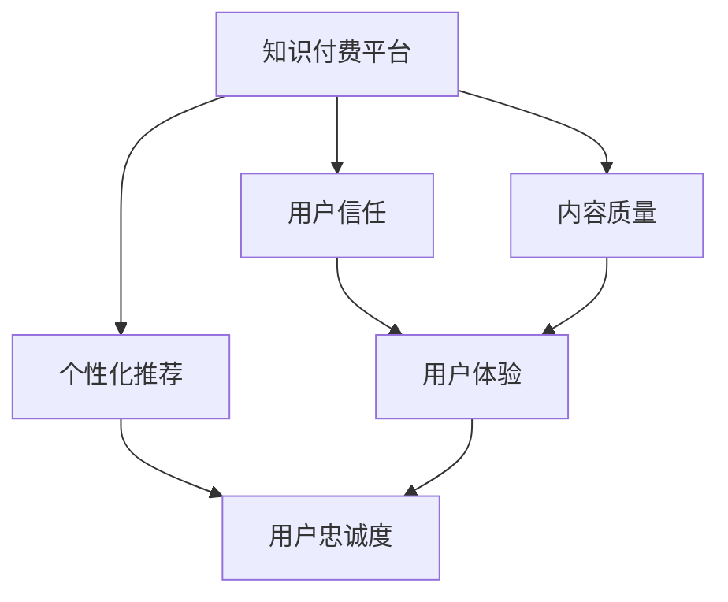

                 

# 知识付费如何建立用户信任和忠诚度？

## 1. 背景介绍

随着互联网的普及，知识和信息变得更加触手可及。用户对于高质内容的需求日益增长，知识付费市场迎来了蓬勃发展。然而，尽管许多平台和内容创作者不断尝试，用户信任和忠诚度的建立依旧是一个亟待解决的难题。如何在激烈的市场竞争中，脱颖而出，留住用户，成为知识付费领域的核心命题。本文将详细剖析知识付费平台如何通过技术手段、商业模式及用户体验等多方面策略，构建用户信任和忠诚度。

## 2. 核心概念与联系

### 2.1 核心概念概述

- **知识付费平台**：基于互联网，为用户提供知识服务，通过订阅、单次购买等方式实现收入的平台。
- **用户信任**：用户对知识付费平台的可靠性、安全性、隐私保护等方面的信心和认可。
- **用户忠诚度**：用户对知识付费平台的粘性，重复购买、持续使用并推荐他人。
- **内容质量**：知识付费平台的核心竞争力，指内容的深度、广度、实用性等。
- **个性化推荐**：根据用户的历史行为和偏好，提供定制化、高相关性的内容，提升用户体验。

### 2.2 核心概念原理和架构的 Mermaid 流程图



该流程图展示了知识付费平台的核心概念之间的联系。内容质量和用户体验是构建用户信任和忠诚度的基石，而个性化推荐则是提升用户体验和巩固用户忠诚度的重要手段。

## 3. 核心算法原理 & 具体操作步骤

### 3.1 算法原理概述

知识付费平台构建用户信任和忠诚度的过程，本质上是建立用户与平台之间的互动关系。平台通过提供高质量的内容，设计合理的商业模式，以及采用个性化推荐等技术手段，实现对用户需求的精准满足，从而增强用户粘性，构建长期合作关系。

具体来说，以下四个方面构成了知识付费平台的核心算法：

1. **内容推荐算法**：通过分析用户历史行为数据，预测用户偏好，推送个性化内容，提升用户体验。
2. **反欺诈算法**：利用机器学习模型识别异常交易行为，保障用户资金安全。
3. **风险评估算法**：对内容质量和用户行为进行综合评估，为平台风险管理提供依据。
4. **个性化定价算法**：根据内容价值和用户支付意愿，制定合理价格，确保平台盈利。

### 3.2 算法步骤详解

#### 3.2.1 内容推荐算法

1. **用户行为分析**：收集用户浏览、点赞、评论等行为数据，分析用户兴趣偏好。
2. **内容特征提取**：对课程、文章等内容进行特征提取，生成向量表示。
3. **相似度计算**：计算用户与内容之间的相似度，构建推荐模型。
4. **实时推荐**：基于实时数据动态调整推荐内容，提高推荐精准度。

#### 3.2.2 反欺诈算法

1. **异常检测**：建立异常行为检测模型，识别可疑交易。
2. **风险评估**：对识别出的可疑交易进行风险评估，确定是否采取防范措施。
3. **模型更新**：根据新数据不断更新模型，提升检测效果。

#### 3.2.3 风险评估算法

1. **内容质量评估**：利用自然语言处理技术，对内容质量进行自动评估。
2. **用户行为分析**：结合用户历史行为数据，综合评估用户信用风险。
3. **动态调整**：根据评估结果，动态调整推荐和定价策略。

#### 3.2.4 个性化定价算法

1. **价值评估**：利用机器学习模型，评估内容对不同用户的价值。
2. **用户定价策略**：根据用户价值，制定差异化定价策略。
3. **动态调整**：根据市场变化，动态调整定价策略。

### 3.3 算法优缺点

**优点**：
1. **提升用户体验**：个性化推荐和反欺诈算法能够显著提升用户体验和平台信任度。
2. **精准定价**：个性化定价算法能够根据用户价值实现精准定价，提升平台盈利能力。
3. **降低风险**：风险评估和反欺诈算法能够有效降低平台运营风险。

**缺点**：
1. **数据隐私**：用户行为数据的收集和分析，涉及用户隐私保护问题。
2. **模型复杂性**：多个算法模型需要维护和更新，增加了技术复杂度。
3. **成本高**：模型构建和优化需要投入大量资源。

### 3.4 算法应用领域

以上算法在知识付费平台的应用广泛，覆盖了内容推荐、用户管理、风险控制等多个方面。无论是在线教育、技能培训、还是专业咨询等领域，这些算法都能够帮助平台提升服务质量，增强用户粘性。

## 4. 数学模型和公式 & 详细讲解 & 举例说明

### 4.1 数学模型构建

以内容推荐算法为例，构建推荐系统的数学模型。假设平台有 $M$ 个课程，每个课程 $i$ 的特征向量为 $x_i$，用户 $u$ 的历史行为向量为 $y_u$。推荐系统的目标是最小化预测误差 $E$：

$$
E = \frac{1}{N}\sum_{i=1}^{M}\sum_{u=1}^{U}(y_u - \hat{y}_u)^2
$$

其中 $\hat{y}_u$ 为预测用户 $u$ 对课程 $i$ 的兴趣评分。

### 4.2 公式推导过程

推荐算法常用的模型有协同过滤、基于内容的推荐、混合推荐等。协同过滤模型假设用户间存在相似性，通过用户历史行为矩阵构建相似度矩阵：

$$
\hat{y}_u = \alpha\sum_{v=1}^{V}sim(u,v)\hat{y}_v
$$

其中 $\alpha$ 为相似度加权系数，$sim(u,v)$ 为用户 $u$ 和 $v$ 的相似度。基于内容的推荐模型则直接利用课程特征向量 $x_i$ 进行推荐：

$$
\hat{y}_u = \sum_{i=1}^{M}w_ix_i\cdot x_u
$$

其中 $w_i$ 为特征 $i$ 的权重，$x_u$ 为用户 $u$ 的特征向量。

### 4.3 案例分析与讲解

以在线教育平台为例，平台根据用户历史学习行为和课程评价，使用协同过滤算法推荐相关课程。具体步骤如下：

1. **数据收集**：收集用户历史学习记录、课程评价、学习时长等数据。
2. **相似度计算**：计算用户 $u$ 与所有课程的相似度，构建相似度矩阵。
3. **模型训练**：利用相似度矩阵和用户行为数据，训练推荐模型。
4. **推荐输出**：根据用户行为，实时推荐相关课程。

## 5. 项目实践：代码实例和详细解释说明

### 5.1 开发环境搭建

知识付费平台的开发环境包括后端开发环境、前端开发环境及数据管理环境：

- **后端开发环境**：基于Python的Django框架，利用MySQL数据库存储用户和课程数据。
- **前端开发环境**：基于React或Vue框架，实现用户界面。
- **数据管理环境**：使用Elasticsearch进行实时搜索和数据管理。

### 5.2 源代码详细实现

以下是使用Python和Elasticsearch实现内容推荐算法的示例代码：

```python
from elasticsearch import Elasticsearch
from gensim.models import Word2Vec
import pandas as pd

# 建立Elasticsearch连接
es = Elasticsearch([{'host': 'localhost', 'port': 9200}])

# 读取用户历史行为数据
df = pd.read_csv('user_behavior.csv')

# 构建用户行为向量
user_vecs = []
for user in df['user_id'].unique():
    user_data = df[df['user_id'] == user]
    vec = []
    for course in user_data['course_id']:
        vec.append(course)
    user_vecs.append(vec)

# 构建课程特征向量
df_course = pd.read_csv('course_features.csv')
courses = df_course['course_id'].unique()
course_vecs = []
for course in courses:
    course_data = df_course[df_course['course_id'] == course]
    vec = []
    for feat in course_data['feat']:
        vec.append(feat)
    course_vecs.append(vec)

# 训练Word2Vec模型
model = Word2Vec(user_vecs, course_vecs, size=128, min_count=1, window=5)

# 计算用户与课程的相似度
user_similarities = {}
for user in df['user_id'].unique():
    user_data = df[df['user_id'] == user]
    user_vec = user_data['course_id'].values
    user_similarities[user] = model.wv.user_vecs

# 推荐课程
def recommend_course(user, top_n=10):
    user_similarity = user_similarities[user]
    recommendations = []
    for course, similarity in user_similarity.items():
        if similarity > 0.5:  # 相似度阈值
            recommendations.append((course, similarity))
    recommendations.sort(key=lambda x: x[1], reverse=True)
    return recommendations[:top_n]

# 测试推荐算法
user_id = '12345'
top_courses = recommend_course(user_id)
print(top_courses)
```

### 5.3 代码解读与分析

以上代码实现了基于Word2Vec的协同过滤推荐算法，具体步骤如下：

1. **建立Elasticsearch连接**：使用Elasticsearch进行数据管理和实时搜索。
2. **读取用户历史行为数据**：从CSV文件中读取用户历史行为数据。
3. **构建用户行为向量**：将用户历史行为数据转换为向量形式，用于训练Word2Vec模型。
4. **构建课程特征向量**：从CSV文件中读取课程特征数据，构建课程特征向量。
5. **训练Word2Vec模型**：使用用户行为向量和课程特征向量训练Word2Vec模型。
6. **计算用户与课程的相似度**：利用训练好的模型计算用户与课程的相似度。
7. **推荐课程**：根据相似度对课程进行排序，推荐用户感兴趣的相关课程。

## 6. 实际应用场景

### 6.1 在线教育

在线教育平台通过内容推荐算法，为用户推荐感兴趣的课程，提升学习效率。平台使用Elasticsearch进行实时搜索，提供智能搜索和课程推荐功能。

### 6.2 专业咨询

专业咨询平台利用个性化推荐算法，根据用户历史咨询记录，推荐相关咨询师和问题。平台使用Elasticsearch进行搜索和推荐，提升用户满意度和咨询效率。

### 6.3 健康管理

健康管理平台通过推荐算法，根据用户健康数据，推荐合适的健康方案和医生。平台使用Elasticsearch进行数据管理，提升用户健康管理水平。

### 6.4 未来应用展望

未来，知识付费平台将更加注重个性化推荐和用户体验，采用更多的技术手段提升平台竞争力。平台将利用自然语言处理、计算机视觉等技术，提升内容质量和推荐精准度。同时，平台将进一步加强用户隐私保护和数据安全，构建用户信任，增强用户忠诚度。

## 7. 工具和资源推荐

### 7.1 学习资源推荐

1. **《推荐系统实战》**：详细介绍推荐系统原理和实现方法，涵盖协同过滤、基于内容的推荐等多种算法。
2. **Coursera《推荐系统》课程**：斯坦福大学教授提供的推荐系统课程，深入浅出地讲解推荐算法原理和应用。
3. **Kaggle推荐系统竞赛**：通过参与竞赛，提升推荐系统设计和实现能力。
4. **Recommender Systems textbook**：推荐系统领域的经典教材，详细介绍了推荐系统的理论和实践。

### 7.2 开发工具推荐

1. **Python**：基于Python的开发环境，具有丰富的机器学习库和框架支持。
2. **Elasticsearch**：用于实时搜索和数据管理，提升搜索和推荐效率。
3. **TensorFlow**：用于构建深度学习模型，提升推荐算法性能。
4. **Flask/Django**：用于构建Web应用，提供用户界面和服务接口。

### 7.3 相关论文推荐

1. **《推荐系统》**：Lecun、Bengio和Hinton三位深度学习领域大师合著的经典书籍，全面介绍推荐系统理论和技术。
2. **《信息检索》**：Larsen-Pedersen教授的推荐系统理论基础，帮助读者理解推荐系统的工作原理。
3. **《推荐系统方法论》**：推荐系统领域专家Jakob R. C. Josang的著作，涵盖推荐系统的基础理论和实践应用。

## 8. 总结：未来发展趋势与挑战

### 8.1 研究成果总结

本文详细探讨了知识付费平台如何通过技术手段构建用户信任和忠诚度。通过内容推荐、反欺诈、风险评估和个性化定价等算法，平台能够提升用户体验，降低运营风险，提升盈利能力。然而，平台的建设和发展仍面临数据隐私保护、技术复杂性高、成本高等挑战。

### 8.2 未来发展趋势

未来，知识付费平台将继续利用数据驱动和个性化推荐等技术手段，提升平台竞争力。平台将利用自然语言处理、计算机视觉等技术，提升内容质量和推荐精准度。同时，平台将进一步加强用户隐私保护和数据安全，构建用户信任，增强用户忠诚度。

### 8.3 面临的挑战

尽管知识付费平台在不断发展和壮大，但依然面临以下挑战：

1. **数据隐私保护**：用户行为数据的收集和分析涉及用户隐私保护问题，平台需要在数据收集和使用上更加谨慎。
2. **技术复杂性**：多个算法模型需要维护和更新，增加了技术复杂度，平台需要投入更多资源进行技术支持。
3. **成本高**：模型构建和优化需要投入大量资源，平台需要平衡成本和收益。

### 8.4 研究展望

未来的研究将进一步优化推荐算法，提升推荐效果。同时，研究将更加注重用户隐私保护和数据安全，构建透明、可信的平台。通过技术创新和商业模式优化，知识付费平台将不断提升用户信任和忠诚度，推动知识付费行业健康发展。

## 9. 附录：常见问题与解答

**Q1: 如何衡量推荐算法的效果？**

A: 推荐算法的效果可以通过以下指标进行评估：

- **准确率 (Precision)**：预测的相关内容中，实际相关的比例。
- **召回率 (Recall)**：实际相关的内容中，被预测为相关的比例。
- **F1 Score**：综合准确率和召回率的指标。
- **平均绝对误差 (MAE)**：预测评分与真实评分之间的平均差距。
- **Root Mean Squared Error (RMSE)**：预测评分与真实评分之间的均方根误差。

**Q2: 推荐系统中的数据隐私保护有哪些方法？**

A: 推荐系统中的数据隐私保护方法包括：

- **数据匿名化**：对用户数据进行匿名化处理，防止用户被识别。
- **差分隐私**：通过引入噪声，保护个体隐私，同时保证数据总体统计特性。
- **联邦学习**：在多个节点上分布式训练模型，保护本地数据隐私。
- **同态加密**：在加密数据上直接进行计算，保护数据隐私。

**Q3: 如何设计个性化定价算法？**

A: 个性化定价算法的设计主要包括以下步骤：

- **价值评估**：利用机器学习模型，评估内容对不同用户的价值。
- **定价策略**：根据用户价值，制定差异化定价策略。
- **动态调整**：根据市场变化，动态调整定价策略。

**Q4: 为什么推荐算法需要实时推荐？**

A: 实时推荐能够根据用户最新行为数据，实时调整推荐结果，提高推荐精准度。同时，实时推荐能够提升用户体验，增加用户粘性。

**Q5: 如何构建推荐系统的数学模型？**

A: 构建推荐系统的数学模型主要包括以下步骤：

- **数据收集**：收集用户历史行为数据和内容数据。
- **特征提取**：对用户和内容进行特征提取，生成向量表示。
- **相似度计算**：计算用户与内容之间的相似度，构建相似度矩阵。
- **模型训练**：利用相似度矩阵和用户行为数据，训练推荐模型。
- **推荐输出**：根据用户行为，实时推荐相关内容。

---

作者：禅与计算机程序设计艺术 / Zen and the Art of Computer Programming

