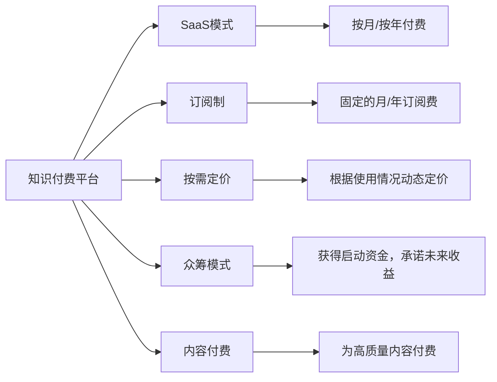

                 

# 知识付费平台要选择适合的商业模式发展

## 1. 背景介绍

随着互联网的迅速发展，知识付费逐渐成为一种新兴的商业模式，以在线课程、知识分享、在线问答等方式帮助用户提升知识和技能。不同于传统的教育方式，知识付费平台更加注重知识的内容质量和个性化推荐，为学习者提供更加便捷、高效的学习方式。

知识付费平台的核心价值在于提供高质量的、易于获取的知识产品，满足用户的学习需求。但随着市场的竞争加剧，越来越多的知识付费平台开始探索如何构建稳定的商业模式，以实现持续的增长和盈利。本文将探讨知识付费平台如何选择适合的商业模式，以实现可持续发展。

## 2. 核心概念与联系

### 2.1 核心概念概述

在讨论知识付费平台的商业模式前，我们需要先理解一些核心概念：

- **知识付费平台**：指提供高质量知识产品，并通过订阅、付费问答、课程购买等方式进行盈利的网络平台。
- **SaaS模式**：Software as a Service，即软件即服务，通过云服务提供企业级应用，按订阅收费。
- **订阅制**：用户按月或按年订阅平台，支付费用以获取持续的增值服务。
- **按需定价**：根据用户需求及使用的资源，动态调整价格，以实现营收最大化。
- **众筹模式**：通过众筹获得一定的启动资金，并承诺未来的盈利模式或分红，吸引更多投资者。
- **内容付费**：用户为获取高质量内容而支付费用，适用于精品课程、深度报告等。

### 2.2 核心概念联系

这些核心概念构成了知识付费平台商业模式的基础框架，通过合理的商业模式选择和优化，平台能够更好地实现用户价值的最大化和财务目标的实现。以下是一个Mermaid流程图，展示了各个概念之间的联系：



该图展示了知识付费平台如何通过不同的商业模式来满足用户的不同需求和平台自身的盈利目标。

## 3. 核心算法原理 & 具体操作步骤

### 3.1 算法原理概述

知识付费平台的商业模式选择，本质上是一个多目标优化问题，涉及用户价值最大化、平台营收最大化和用户满意度等多个方面。其核心算法原理包括：

- **用户行为分析**：通过数据分析模型，理解用户需求和行为，预测用户价值，为推荐系统提供数据支持。
- **成本-收益分析**：评估不同商业模式下的成本和收益，以选择合适的商业模式。
- **动态定价策略**：根据市场需求、平台资源和用户行为，动态调整价格，以实现收益最大化。
- **市场细分策略**：根据不同用户群体的特点，制定不同的商业模式，以实现差异化服务。

### 3.2 算法步骤详解

知识付费平台选择适合的商业模式，需要经过以下步骤：

**Step 1: 数据收集与分析**

- 收集平台的用户数据，包括注册信息、浏览记录、购买行为等。
- 通过机器学习算法，分析用户的行为特征，如学习偏好、活跃度、付费意愿等。
- 对不同用户群体进行细分，理解不同群体的需求和付费能力。

**Step 2: 模型训练与评估**

- 利用收集到的数据，训练推荐系统和成本-收益模型。
- 使用A/B测试等方法，评估不同商业模式下的用户满意度和收益。
- 通过反事实分析等方法，预测各模式下的长期收益和用户流失率。

**Step 3: 模式选择与调整**

- 根据模型评估结果，选择最适合平台的商业模式。
- 制定详细的实施方案，包括用户界面、支付系统、推荐系统等。
- 根据市场反馈和数据监控，不断调整商业模式，以应对市场变化。

### 3.3 算法优缺点

**优点**：

- **灵活性高**：可以根据市场变化和用户需求，动态调整商业模式。
- **用户体验优化**：通过精准的推荐系统，提升用户满意度和留存率。
- **收益可控性高**：通过成本-收益模型，实现收益最大化，同时控制成本。

**缺点**：

- **市场风险大**：商业模式选择不当可能导致平台营收下降。
- **复杂度高**：需要大量数据和算力支持，技术门槛高。
- **用户数据保护**：在数据收集和分析过程中，需要严格遵守数据隐私法规。

### 3.4 算法应用领域

基于算法的商业模式选择方法，不仅适用于知识付费平台，还广泛适用于其他领域，如电商、内容媒体、企业服务等。不同的应用场景需要针对性地进行商业模式选择和优化，以实现最佳的业务效果。

## 4. 数学模型和公式 & 详细讲解 & 举例说明

### 4.1 数学模型构建

知识付费平台的商业模式选择，可以通过构建以下数学模型来实现：

1. **用户价值模型**：
   - 用户价值 = 推荐质量 × 用户满意度 × 活跃度 × 付费意愿
   - 推荐质量 = 个性化推荐算法的效果

2. **成本-收益模型**：
   - 收益 = 订阅费 × 订阅用户数 + 付费内容收入 + 广告收入
   - 成本 = 内容制作成本 + 平台运营成本 + 推荐系统维护成本

3. **动态定价模型**：
   - 动态价格 = 基准价格 × (用户活跃度 + 内容使用率)^(α × β)

### 4.2 公式推导过程

- **用户价值模型推导**：
  - 设用户价值为U，推荐质量为Q，用户满意度为S，活跃度为A，付费意愿为P
  - U = Q × S × A × P
  - Q = f(推荐算法)

- **成本-收益模型推导**：
  - 设收益为R，订阅费为S，内容收入为C，广告收入为A，内容制作成本为C1，平台运营成本为C2，推荐系统维护成本为C3
  - R = S × N + C × P + A × Q
  - N为订阅用户数，P为内容使用率，Q为广告点击率

- **动态定价模型推导**：
  - 设基准价格为P0，用户活跃度为A，内容使用率为U
  - 动态价格P = P0 × (A + U)^(α × β)

### 4.3 案例分析与讲解

**案例：某在线教育平台**

- **用户价值模型应用**：
  - 通过分析用户的学习轨迹和评价，预测其满意度和活跃度。
  - 通过个性化推荐算法，提升用户满意度，增加其付费意愿。

- **成本-收益模型应用**：
  - 评估不同课程的平均制作成本和订阅费用，调整课程定价策略。
  - 根据平台运营数据，计算实际收益，优化平台运营策略。

- **动态定价模型应用**：
  - 根据用户活跃度和内容使用率，动态调整课程价格，吸引更多高价值用户。
  - 利用动态定价模型，优化平台营收。

## 5. 项目实践：代码实例和详细解释说明

### 5.1 开发环境搭建

为了实现知识付费平台的商业模式选择算法，需要搭建一个基于Python的开发环境，建议使用Jupyter Notebook或PyCharm等IDE进行开发。以下是具体步骤：

1. 安装Python：从官网下载Python 3.8及以上版本，并配置环境变量。
2. 安装Jupyter Notebook：
   - Windows：`pip install jupyter`
   - Mac/Linux：`conda install jupyter`
3. 安装相关库：
   - `pip install pandas numpy matplotlib scikit-learn`

### 5.2 源代码详细实现

以下是一个基于Python实现用户价值评估的示例代码：

```python
import pandas as pd
from sklearn.cluster import KMeans
from sklearn.preprocessing import StandardScaler

# 假设用户数据如下：
user_data = pd.read_csv('user_data.csv')

# 对用户数据进行标准化处理
scaler = StandardScaler()
scaled_data = scaler.fit_transform(user_data)

# 使用K-means算法对用户进行聚类
kmeans = KMeans(n_clusters=5)
kmeans.fit(scaled_data)

# 计算每个用户群体的用户价值
user_value = user_data.groupby('cluster_id')['value'].sum()
```

### 5.3 代码解读与分析

- **用户数据预处理**：通过标准化处理，消除不同特征之间的量纲差异。
- **用户聚类**：使用K-means算法对用户进行聚类，将相似用户分为同一群组。
- **用户价值评估**：根据每个用户群组的平均价值，评估用户价值。

### 5.4 运行结果展示

运行上述代码后，将得到一个用户价值评估的结果，帮助平台更好地理解不同用户群体的价值。

## 6. 实际应用场景

知识付费平台的商业模式选择需要考虑不同的实际应用场景，以下是几个典型的应用场景分析：

### 6.1 电商平台的订阅制模式

- **用户行为分析**：电商平台用户倾向于购买多次购买同类型商品，因此可以采用月度或年度订阅模式，降低流失率。
- **成本-收益分析**：通过分析订单数据和客户反馈，优化订阅价格和内容推荐，提升用户满意度和复购率。
- **推荐系统**：利用个性化推荐算法，提升用户购物体验，提高平台销售额。

### 6.2 内容媒体的众筹模式

- **用户行为分析**：内容媒体用户对高质量内容的付费意愿较高，可以通过众筹模式筹集启动资金，保障内容制作和平台运营。
- **成本-收益分析**：通过众筹资金支持内容创作和平台运营，同时利用订阅和广告收入增加收益。
- **推荐系统**：根据用户行为数据，推荐高质量内容，增加用户参与度。

### 6.3 企业服务的按需定价模式

- **用户行为分析**：企业客户对不同的服务需求差异较大，可以通过按需定价模式，灵活调整服务价格，满足客户需求。
- **成本-收益分析**：根据企业客户的不同需求，定制化服务方案，提升服务价值和客户满意度。
- **推荐系统**：利用推荐算法，推荐最适合企业的服务方案，增加服务收入。

## 7. 工具和资源推荐

### 7.1 学习资源推荐

1. **Coursera课程**：《机器学习基础》、《数据科学导论》等课程，涵盖数据科学和机器学习的基础知识。
2. **Kaggle竞赛**：参与数据科学和机器学习竞赛，提高实战能力。
3. **Google Colab**：免费的在线Jupyter Notebook环境，提供GPU算力，方便实验。

### 7.2 开发工具推荐

1. **Jupyter Notebook**：轻量级的开发环境，支持Python代码的在线编写和执行。
2. **PyCharm**：功能强大的IDE，提供代码自动补全、调试等功能。
3. **TensorFlow**：强大的深度学习框架，支持复杂的模型构建和训练。
4. **Keras**：简单易用的深度学习库，适合快速原型开发和模型训练。

### 7.3 相关论文推荐

1. **《机器学习：实战技巧与工程化》**：介绍机器学习在实际应用中的技巧和方法。
2. **《数据科学与数据工程》**：讲解数据科学和数据工程的基础知识和最佳实践。
3. **《深度学习：理论与实践》**：深度学习理论和实践的全面介绍。

## 8. 总结：未来发展趋势与挑战

### 8.1 研究成果总结

本文详细探讨了知识付费平台如何选择适合的商业模式，通过数学模型和案例分析，给出了具体的实现方法和注意事项。研究成果表明，通过算法和数据分析，平台可以更加灵活和高效地应对市场变化，提升用户满意度和平台收益。

### 8.2 未来发展趋势

- **智能化服务**：随着人工智能技术的发展，平台可以提供更智能化的推荐和服务，提升用户体验。
- **全渠道运营**：平台可以拓展到更多渠道，如社交媒体、移动应用等，增加用户覆盖率。
- **内容多样化**：平台可以提供更多样化的内容，如短视频、直播等，吸引更多用户。

### 8.3 面临的挑战

- **用户数据隐私**：在数据收集和分析过程中，需要严格遵守数据隐私法规。
- **内容版权问题**：平台需要解决内容版权和知识产权问题，避免侵权纠纷。
- **技术复杂性**：平台需要具备强大的算法和数据分析能力，技术门槛较高。

### 8.4 研究展望

未来的研究可以从以下几个方向进行探索：

1. **算法优化**：研究更高效的推荐算法和成本-收益模型，优化平台的商业模式选择。
2. **用户体验**：深入研究用户体验，提升推荐系统的个性化和精准度。
3. **用户行为研究**：利用心理学和社会学理论，深入分析用户行为，提升平台的用户粘性。

## 9. 附录：常见问题与解答

**Q1：知识付费平台的商业模式选择是否固定不变？**

A: 不是，平台可以根据市场变化和用户需求，动态调整商业模式，以达到最佳效果。

**Q2：知识付费平台应该如何进行成本控制？**

A: 平台可以通过优化内容制作和推荐系统，控制成本。同时，合理定价策略和用户数据管理也是成本控制的重要手段。

**Q3：如何评估知识付费平台推荐系统的有效性？**

A: 可以通过用户满意度、用户留存率和推荐转化率等指标，评估推荐系统的有效性。

**Q4：知识付费平台应该如何保护用户隐私？**

A: 平台应遵守相关法律法规，保护用户隐私。通过数据匿名化、去标识化等手段，减少隐私泄露风险。

**Q5：知识付费平台如何进行内容版权保护？**

A: 平台应建立严格的内容审查机制，避免侵权内容上架。同时，与内容创作者签署版权协议，明确版权归属。

---

作者：禅与计算机程序设计艺术 / Zen and the Art of Computer Programming

